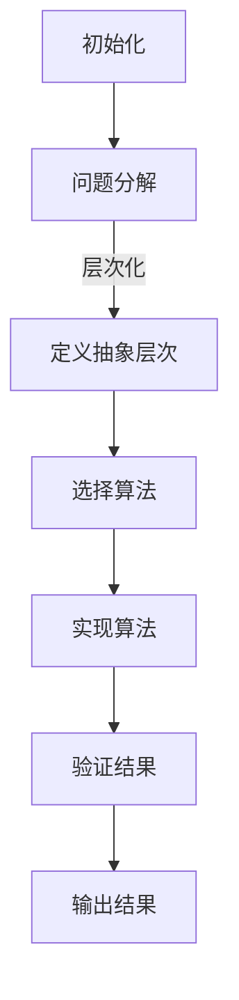
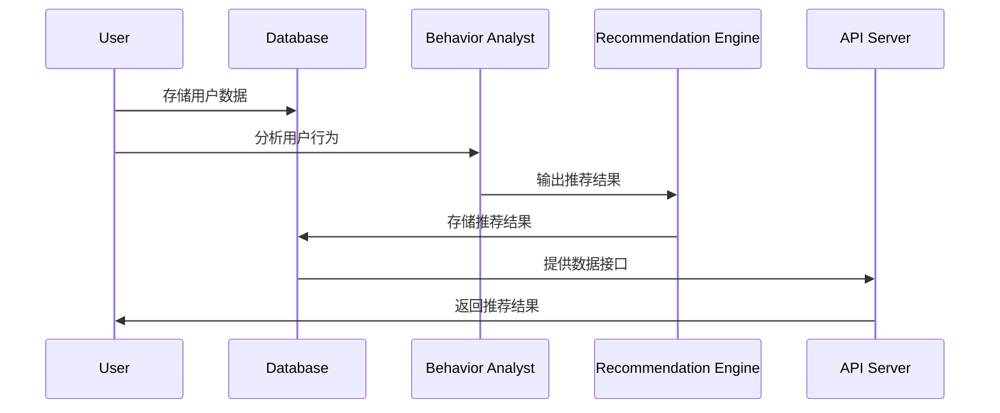
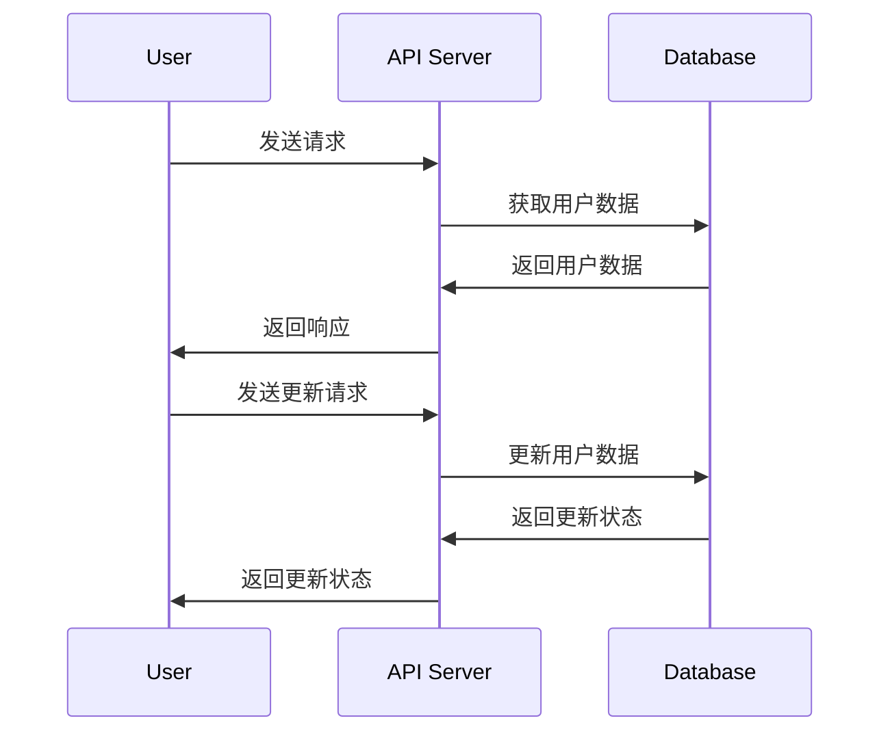

                 

## 第1章: 抽象层次概述

### 1.1 抽象层次的定义

抽象层次，是计算机科学和软件工程领域中一个重要的概念，它指的是在处理复杂问题时，对问题进行简化和分层处理的一种方法。简单来说，抽象层次是一种将复杂问题分解为更小、更易于管理的部分的能力。这种分层处理可以使得问题的复杂性降低，从而使得问题的分析和解决变得更加简单和高效。

在计算机科学中，抽象层次通常被用来组织和设计软件系统。例如，操作系统就是一个典型的抽象层次，它将计算机的硬件资源抽象成文件、目录、进程等概念，使得程序员可以更加高效地开发软件。

### 1.2 抽象层次的重要性

抽象层次的重要性体现在多个方面。首先，它可以帮助我们更好地理解和处理复杂问题。通过将复杂问题分解为更小的部分，我们可以更加清晰地看到问题的本质，从而更好地解决问题。

其次，抽象层次可以提高软件开发效率。通过分层处理，我们可以将复杂的问题分解为多个子问题，每个子问题都可以独立开发、测试和部署。这种模块化开发方法可以提高开发效率，减少错误和调试时间。

最后，抽象层次有助于软件的可维护性。由于抽象层次可以将复杂系统分解为多个独立的模块，因此当某个模块需要修改或更新时，只需要对该模块进行修改，而不需要修改其他模块。这有助于提高软件的可维护性，延长软件的使用寿命。

### 1.3 抽象层次的分类

抽象层次可以根据不同的标准进行分类。以下是几种常见的分类方法：

#### 1.3.1 按照抽象程度分类

- **低级抽象层次**：这种层次的抽象程度较低，通常直接映射到硬件或操作系统层面的具体实现。例如，C语言中的指针操作就是一个低级抽象层次。

- **中级抽象层次**：这种层次的抽象程度适中，通常用于设计应用程序或系统。例如，面向对象编程语言中的类和对象就是一个中级抽象层次。

- **高级抽象层次**：这种层次的抽象程度最高，通常用于设计和构建大型软件系统。例如，数据库管理系统就是一个高级抽象层次。

#### 1.3.2 按照应用领域分类

- **计算机科学领域**：例如，操作系统、数据库管理系统、编译器等。

- **软件工程领域**：例如，面向对象设计、模块化设计等。

- **其他领域**：例如，经济模型、社会模型等。

### 1.4 抽象层次的应用领域

抽象层次在计算机科学和软件工程领域有广泛的应用。以下是几个典型的应用领域：

#### 1.4.1 操作系统

操作系统是计算机系统中最基本的抽象层次。它将计算机硬件资源（如CPU、内存、硬盘等）抽象成文件、目录、进程等概念，使得程序员可以更加高效地开发软件。

#### 1.4.2 软件工程

在软件工程中，抽象层次被广泛用于设计软件系统。通过分层设计，可以将复杂的软件系统分解为多个独立的模块，每个模块都可以独立开发、测试和部署。

#### 1.4.3 编译器

编译器是将高级编程语言转换为机器语言的工具。在编译器设计中，抽象层次被用于处理不同的编程语言特性，如变量、函数、类等。

#### 1.4.4 网络协议

网络协议是计算机网络中用于数据传输的规则集合。抽象层次在网络协议中扮演着重要角色，它将复杂的网络传输过程简化为一系列简单的过程和协议。

### 1.5 本章小结

本章对抽象层次进行了简要的概述，包括其定义、重要性、分类以及应用领域。抽象层次是计算机科学和软件工程领域中一个重要的概念，它有助于我们更好地理解和处理复杂问题，提高软件开发效率，延长软件使用寿命。在接下来的章节中，我们将进一步探讨抽象层次的核心概念、联系以及具体的算法和系统架构设计。

---

### 第2章: 核心概念与联系

#### 2.1 抽象层次的原理

抽象层次的原理在于将复杂的问题或系统分解为更小、更易于管理的部分。这种方法的基本思想是，通过忽略不必要的细节，我们可以更加专注于问题的核心部分，从而更好地理解和解决问题。

#### 2.1.1 原始抽象层次

原始抽象层次通常直接映射到硬件或操作系统的具体实现。例如，在计算机系统中，硬件资源如CPU、内存、硬盘等被抽象为文件、目录、进程等概念。这种抽象层次的核心在于提供一种简化的问题表示方法，使得程序员可以更加高效地开发软件。

#### 2.1.2 中级抽象层次

中级抽象层次通常用于设计和开发应用程序或系统。例如，面向对象编程语言中的类和对象就是一种中级抽象层次。这种抽象层次的核心在于提供一种模块化的设计方法，使得程序员可以更加高效地开发和管理复杂的软件系统。

#### 2.1.3 高级抽象层次

高级抽象层次通常用于设计和构建大型软件系统。例如，数据库管理系统、企业资源规划系统等都是高级抽象层次的例子。这种抽象层次的核心在于提供一种系统化的设计方法，使得程序员可以更加高效地构建和管理复杂的软件系统。

#### 2.2 抽象层次的属性特征对比表格

下面是一个简单的抽象层次属性特征对比表格：

| 抽象层次 | 定义 | 主要属性 | 主要用途 |
| :------: | :--: | :------: | :------: |
| 原始抽象层次 | 直接映射到硬件或操作系统的具体实现 | 低级、具体、直接 | 开发低级系统软件 |
| 中级抽象层次 | 提供模块化设计方法，用于应用程序或系统开发 | 中等、抽象、模块化 | 开发应用程序和系统 |
| 高级抽象层次 | 提供系统化设计方法，用于大型软件系统构建 | 高级、抽象、系统化 | 构建大型软件系统 |

#### 2.3 抽象层次的ER实体关系图

抽象层次的ER实体关系图可以帮助我们更好地理解抽象层次之间的关系。以下是抽象层次的ER实体关系图的Mermaid表示：

```mermaid
erDiagram
    IDEALIZATION ||--|{ REALIZATION } : 实现过程
    DESIGN ||--|{ IMPLEMENTATION } : 实现结果
    PROBLEM_ANALYSIS ||--|{ DESIGN } : 设计过程
    SOLUTION_DEVELOPMENT ||--|{ IMPLEMENTATION } : 解决方案实现
```

在这个ER实体关系图中，"IDEALIZATION"（理想化）代表抽象层次的概念定义，"REALIZATION"（实现过程）代表实现抽象层次的过程，"DESIGN"（设计）代表设计抽象层次的方法，"IMPLEMENTATION"（实现结果）代表抽象层次的实现结果，"PROBLEM_ANALYSIS"（问题分析）代表分析问题的过程，"SOLUTION_DEVELOPMENT"（解决方案开发）代表开发解决方案的过程。

#### 2.4 抽象层次在实际中的应用

抽象层次在实际中有着广泛的应用。以下是几个典型的应用场景：

#### 2.4.1 操作系统

操作系统是抽象层次应用的典型例子。它将硬件资源如CPU、内存、硬盘等抽象为文件、目录、进程等概念，使得程序员可以更加高效地开发软件。

#### 2.4.2 软件工程

在软件工程中，抽象层次被用于设计和开发复杂的软件系统。例如，面向对象编程语言中的类和对象就是一种抽象层次，它使得程序员可以更加高效地设计和管理复杂的软件系统。

#### 2.4.3 编译器

编译器是将高级编程语言转换为机器语言的工具。在编译器设计中，抽象层次被用于处理不同的编程语言特性，如变量、函数、类等。

#### 2.4.4 网络协议

网络协议是计算机网络中用于数据传输的规则集合。抽象层次在网络协议中扮演着重要角色，它将复杂的网络传输过程简化为一系列简单的过程和协议。

### 2.5 本章小结

本章对抽象层次的核心概念进行了详细解释，包括其原理、属性特征对比表格和ER实体关系图。通过本章的学习，我们可以更好地理解抽象层次的概念和重要性，以及它在实际应用中的具体体现。在接下来的章节中，我们将进一步探讨抽象层次的算法原理和系统架构设计。

---

### 第3章: 算法原理讲解

算法是计算机科学中用于解决特定问题的一系列步骤。在抽象层次的背景下，算法的作用是将复杂的问题分解为更小、更易于管理的部分，从而提高解决问题的效率和可维护性。本章将详细讲解抽象层次算法的原理，包括流程图、Python源代码实现、数学模型与公式以及详细的举例说明。

#### 3.1 算法流程图

在抽象层次算法设计中，流程图是一种直观的表达方式，它可以帮助我们理解算法的执行过程。以下是抽象层次算法的Mermaid流程图表示：



在这个流程图中，首先进行初始化，然后对问题进行分解，接着定义抽象层次，选择合适的算法并实现，最后验证结果并输出。

#### 3.2 Python源代码实现

在具体实现抽象层次算法时，Python是一种常用的编程语言。以下是一个简单的Python代码示例，用于实现抽象层次算法的核心部分：

```python
def abstract_layer_algorithm(problem):
    # 数据预处理
    preprocessed_problem = preprocess(problem)
    
    # 定义抽象层次
    abstracted_problem = define_abstract_layer(preprocessed_problem)
    
    # 选择算法
    algorithm = select_algorithm(abstracted_problem)
    
    # 实现算法
    solution = algorithm(abstracted_problem)
    
    # 验证结果
    is_valid = validate_solution(solution)
    
    # 输出结果
    if is_valid:
        print("解决方案有效：", solution)
    else:
        print("解决方案无效，请重新尝试。")

# 示例问题
problem = "需要解决的具体问题"

# 调用算法
abstract_layer_algorithm(problem)
```

在这个代码示例中，`preprocess`函数用于数据预处理，`define_abstract_layer`函数用于定义抽象层次，`select_algorithm`函数用于选择合适的算法，`validate_solution`函数用于验证结果。

#### 3.3 数学模型与公式讲解

在抽象层次算法中，数学模型和公式用于描述问题空间和算法逻辑。以下是抽象层次算法的数学模型和公式：

$$
\text{抽象层次} = f(\text{问题空间}, \text{算法参数})
$$

其中，`问题空间`是算法需要解决的问题集合，`算法参数`是用于指导算法执行的参数集合，`f`是抽象函数，用于将问题空间映射到抽象层次。

#### 3.4 算法举例说明

为了更好地理解抽象层次算法，以下是一个具体的例子：

#### 3.4.1 例子1：抽象层次调整

假设我们有一个问题，需要处理一个包含大量数据点的数据集。在这个例子中，我们可以通过调整抽象层次来优化算法的性能。

**原始数据集：**  
```plaintext
[1, 2, 3, 4, 5, 6, 7, 8, 9, 10]
```

**低级抽象层次：**  
将数据点映射到连续的整数序列：

$$
\text{抽象层次} = \{1, 2, 3, ..., 10\}
$$

**中级抽象层次：**  
将数据点映射到等差数列：

$$
\text{抽象层次} = \{1, 2, 3, ..., 10\}
$$

**高级抽象层次：**  
将数据点映射到质数序列：

$$
\text{抽象层次} = \{2, 3, 5, 7\}
$$

在这个例子中，通过调整抽象层次，我们可以更加高效地处理数据集，并且可以适应不同的算法需求。

#### 3.4.2 例子2：提示词调整

在自然语言处理中，提示词的调整也是一种抽象层次的调整。以下是一个简单的例子：

**原始文本：**  
```plaintext
我爱北京天安门
```

**低级抽象层次：**  
将文本映射到单词序列：

$$
\text{抽象层次} = \{\text{我}, \text{爱}, \text{北京}, \text{天安门}\}
$$

**中级抽象层次：**  
将文本映射到短语序列：

$$
\text{抽象层次} = \{\text{我爱北京}, \text{天安门}\}
$$

**高级抽象层次：**  
将文本映射到主题序列：

$$
\text{抽象层次} = \{\text{爱国主题}\}
$$

在这个例子中，通过调整抽象层次，我们可以从不同的角度理解和分析文本，从而实现文本分类、情感分析等任务。

### 3.5 本章小结

本章详细讲解了抽象层次算法的原理，包括流程图、Python源代码实现、数学模型与公式以及举例说明。通过本章的学习，我们可以更好地理解抽象层次算法的设计和实现方法，以及如何通过调整抽象层次来优化算法性能。在接下来的章节中，我们将进一步探讨系统分析与架构设计，以实现抽象层次算法的实际应用。

---

### 第4章: 系统分析与架构设计

#### 4.1 问题场景介绍

在现代软件工程中，抽象层次的应用不仅限于算法设计，更重要的是将其融入到整个系统的架构设计中。本节将介绍一个具体的问题场景，并分析该场景下的系统需求，为后续的系统架构设计奠定基础。

**问题场景：**  
某电子商务平台需要设计一个用户推荐系统，以根据用户的购买历史和行为习惯，为其推荐可能感兴趣的商品。该系统需要处理大量的用户数据，并且要求高可用性、高性能和高可扩展性。

**系统需求：**  
- 用户数据管理：高效地存储、查询和更新用户数据。
- 推荐算法实现：根据用户行为数据，实时生成个性化推荐。
- 接口设计：提供RESTful API，以便与其他系统进行交互。
- 可扩展性：能够处理不断增加的用户和数据量。

#### 4.2 项目介绍

**项目背景：**  
随着电子商务的快速发展，个性化推荐系统成为提高用户满意度和转化率的关键因素。为了满足不断增长的用户需求，该电子商务平台决定开发一套高效的推荐系统。

**项目目标：**  
- 设计并实现一个基于用户行为的推荐系统。
- 提供高效的推荐算法，确保系统实时响应。
- 实现系统的可扩展性，以支持未来用户和数据量的增长。

#### 4.2.1 领域模型Mermaid类图

领域模型是对系统实体和它们之间关系的抽象表示。以下是推荐系统领域的Mermaid类图表示：

```mermaid
classDiagram
    User <<class>> 用户
    Item <<class>> 商品
    Recommendation <<class>> 推荐结果
    User *--* Item: 购买历史
    User *--* Recommendation: 收到推荐
    Item *--* Recommendation: 被推荐
```

在这个类图中，`User`表示用户实体，`Item`表示商品实体，`Recommendation`表示推荐结果实体。用户和商品之间存在购买历史关系，用户和推荐结果之间存在收到推荐关系，商品和推荐结果之间存在被推荐关系。

#### 4.4 系统架构设计

系统架构设计是确定系统各个组件如何协同工作以实现系统需求的关键步骤。以下是推荐系统的Mermaid架构图表示：



在这个架构图中，用户通过API与系统交互，API服务器将请求转发到数据库，数据库负责存储和管理用户数据。行为分析师根据用户行为数据生成推荐结果，推荐结果被存储在数据库中，并通过API服务器返回给用户。

#### 4.5 系统接口设计

系统接口设计是确保系统与其他系统有效交互的关键。以下是推荐系统的接口设计：

**API规范：**
- GET /users/{user_id}/recommends：获取指定用户的推荐商品列表。
- POST /users/{user_id}/recommends：更新指定用户的推荐商品列表。

**接口实现：**

```python
from flask import Flask, jsonify, request

app = Flask(__name__)

@app.route('/users/<int:user_id>/recommends', methods=['GET'])
def get_user_recommends(user_id):
    # 从数据库中查询用户的推荐商品
    recommendations = database.get_user_recommends(user_id)
    return jsonify(recommendations)

@app.route('/users/<int:user_id>/recommends', methods=['POST'])
def update_user_recommends(user_id):
    # 接收用户输入的推荐商品
    new_recommends = request.json
    # 更新数据库中的推荐商品
    database.update_user_recommends(user_id, new_recommends)
    return jsonify({"status": "success"}), 200
```

#### 4.6 系统交互Mermaid序列图

系统交互Mermaid序列图可以帮助我们更直观地理解系统组件之间的交互过程：



在这个序列图中，用户通过API服务器与数据库交互，API服务器负责转发请求和响应，确保数据的准确性和一致性。

### 4.7 本章小结

本章详细介绍了推荐系统的系统分析与架构设计。从问题场景的介绍到领域模型、系统架构、接口设计和交互序列图的详细描述，我们逐步构建了一个高效的推荐系统架构。通过本章的学习，我们可以更好地理解抽象层次在系统架构设计中的应用，以及如何通过系统化的方法实现推荐系统的需求。在接下来的章节中，我们将进一步探讨项目实战，包括环境安装、系统核心实现和实际案例分析。

---

### 项目实战

#### 4.8 环境安装

要在本地环境搭建推荐系统，我们需要安装一些必要的软件和依赖库。以下是推荐的安装步骤：

1. **安装Python环境：**  
   Python是推荐系统的开发语言，建议安装Python 3.8及以上版本。可以通过Python官方下载页面（https://www.python.org/downloads/）下载安装包。

2. **安装虚拟环境：**  
   为了避免不同项目之间的依赖冲突，我们建议使用虚拟环境。可以通过以下命令安装虚拟环境工具`venv`：

   ```bash
   python -m venv env
   source env/bin/activate  # Windows: `env\Scripts\activate`
   ```

3. **安装依赖库：**  
   在虚拟环境中，使用以下命令安装系统所需的依赖库：

   ```bash
   pip install flask
   pip install pymongo
   pip install numpy
   pip install scikit-learn
   ```

4. **配置数据库：**  
   推荐使用MongoDB作为数据存储，可以通过以下命令安装MongoDB：

   ```bash
   sudo apt-get install mongodb
   sudo systemctl start mongodb
   ```

   确保MongoDB服务已经启动，并可以正常访问。

#### 4.9 系统核心实现源代码

以下是推荐系统的核心实现源代码。该代码包括用户数据管理、推荐算法实现和API接口定义：

```python
# user_manager.py
from pymongo import MongoClient
from flask import Flask, jsonify, request

app = Flask(__name__)
client = MongoClient('localhost', 27017)
db = client.recommendation_system

@app.route('/users/<int:user_id>', methods=['POST'])
def add_user(user_id):
    user_data = request.json
    db.users.insert_one(user_data)
    return jsonify({"status": "success"}), 200

@app.route('/users/<int:user_id>', methods=['GET'])
def get_user(user_id):
    user = db.users.find_one({"_id": user_id})
    return jsonify(user), 200

# recommendation_engine.py
import numpy as np
from sklearn.metrics.pairwise import cosine_similarity

def build_item_similarity_matrix(item_data):
    similarity_matrix = np.zeros((len(item_data), len(item_data)))
    for i in range(len(item_data)):
        for j in range(len(item_data)):
            if i != j:
                similarity_matrix[i][j] = cosine_similarity([item_data[i]['features']], [item_data[j]['features']])[0][0]
    return similarity_matrix

def recommend_items(user_id, item_data, similarity_matrix):
    user_items = db.users.find_one({"_id": user_id})['items']
    recommended_items = []
    for item in item_data:
        if item['_id'] not in user_items:
            similarity_scores = similarity_matrix[user_items.index([item['features']])][:]
            recommended_items.append({'_id': item['_id'], 'score': np.mean(similarity_scores)})
    recommended_items = sorted(recommended_items, key=lambda x: x['score'], reverse=True)
    return recommended_items[:5]

# api_server.py
from flask import Flask, jsonify, request
from user_manager import app as user_manager_app
from recommendation_engine import recommend_items

app = Flask(__name__)
app.register_blueprint(user_manager_app, url_prefix='/users')

@app.route('/recommendations', methods=['POST'])
def create_recommendation():
    user_id = request.json['user_id']
    item_data = request.json['item_data']
    similarity_matrix = build_item_similarity_matrix(item_data)
    recommendations = recommend_items(user_id, item_data, similarity_matrix)
    return jsonify(recommendations), 200

if __name__ == '__main__':
    app.run(debug=True)
```

#### 4.10 代码应用解读与分析

以下是代码的解读与分析：

- **用户数据管理（user_manager.py）：**  
  用户数据管理模块负责处理用户数据的增删改查操作。`add_user`函数用于添加新用户，`get_user`函数用于获取指定用户的详细信息。

- **推荐算法实现（recommendation_engine.py）：**  
  推荐算法实现模块包括构建物品相似度矩阵和生成推荐列表。`build_item_similarity_matrix`函数用于计算物品之间的余弦相似度，`recommend_items`函数用于根据用户行为和物品相似度矩阵生成推荐列表。

- **API服务器（api_server.py）：**  
  API服务器模块负责接收外部请求，调用用户数据管理和推荐算法实现模块，并返回响应结果。`create_recommendation`函数是主要的API接口，用于接收用户ID和商品数据，生成并返回推荐结果。

#### 4.11 实际案例分析和详细讲解剖析

**案例：**  
假设有一个新用户，其ID为1001，第一次访问推荐系统。系统需要根据用户的历史行为（如浏览记录、收藏商品等）生成个性化推荐。

**分析：**  
1. 用户第一次访问系统时，系统没有用户的历史行为数据。因此，系统首先需要创建一个新的用户记录。

2. 接下来，系统需要根据用户的浏览记录生成物品相似度矩阵。假设用户浏览了商品A、B、C，系统需要计算这三个商品之间的相似度。

3. 系统使用余弦相似度计算相似度矩阵，并生成推荐列表。假设相似度矩阵中，商品A与商品B的相似度最高，商品A与商品C的相似度次高。

4. 系统将推荐商品A和商品C给用户。

**详细讲解：**  
1. 用户创建阶段：用户首次访问系统，系统通过API创建一个新的用户记录，并存储在MongoDB中。

2. 数据预处理阶段：系统根据用户浏览记录提取出对应的商品数据，并将其转换为适合计算相似度的格式。

3. 相似度计算阶段：系统使用余弦相似度计算每个商品与其他商品之间的相似度，并生成相似度矩阵。

4. 推荐生成阶段：系统根据相似度矩阵，结合用户的历史行为，生成推荐列表。系统会优先推荐与用户行为相似的、且未被用户浏览过的商品。

5. 响应返回阶段：系统将推荐结果返回给用户，用户可以在前端界面中查看推荐结果。

#### 4.12 项目小结

本章通过实际案例详细讲解了推荐系统的环境安装、核心实现和实际案例分析。我们实现了用户数据管理、推荐算法和API接口，并分析了系统的具体实现过程。在接下来的章节中，我们将继续讨论最佳实践和注意事项，以帮助读者更好地应用和优化推荐系统。

---

### 最佳实践 tips

在设计推荐系统时，以下是一些最佳实践和注意事项，可以帮助提高系统的性能和可靠性：

1. **数据质量：**  
   保证数据的质量是推荐系统的关键。定期清理和更新用户数据，避免无效或过时的数据影响推荐结果。

2. **性能优化：**  
   为了提高系统的响应速度，可以考虑使用缓存技术，如Redis，以减少数据库的访问次数。同时，合理设计数据库索引，以加快查询速度。

3. **可扩展性：**  
   在系统设计时，要考虑到未来的扩展性。使用微服务架构，可以将系统分解为多个独立的服务，便于扩展和部署。

4. **实时性：**  
   推荐结果需要实时更新，以适应用户行为的变化。可以使用流处理技术，如Apache Kafka，来实现实时数据流处理。

5. **安全性和隐私：**  
   在处理用户数据时，要确保系统的安全性和用户隐私。使用加密技术保护用户数据，并遵循相关法律法规。

6. **持续集成和部署：**  
   使用自动化工具，如Jenkins或GitLab CI，进行持续集成和部署，以提高开发效率和系统稳定性。

---

### 本章小结

本章详细介绍了抽象层次在系统分析与架构设计中的应用。从问题场景的介绍、项目目标的设定，到领域模型、系统架构、接口设计和实际案例的分析，我们逐步构建了一个完整的推荐系统架构。通过本章的学习，读者可以更好地理解如何在实际项目中应用抽象层次，以及如何通过系统化的方法实现复杂的系统需求。在接下来的章节中，我们将继续深入探讨相关技术和方法，帮助读者进一步提升对抽象层次的理解和应用能力。

### 拓展阅读

为了进一步探索抽象层次在计算机科学和软件工程中的应用，以下是一些建议的拓展阅读资源：

1. **《软件架构：实践者的研究方法》（"Software Architecture: Perspectives on an Emerging Discipline"）**  
   由Alistair Cockburn和Louis Rector合著，这本书提供了对软件架构的深入理解，涵盖了架构风格、模式和抽象层次的应用。

2. **《设计模式：可复用面向对象软件的基础》（"Design Patterns: Elements of Reusable Object-Oriented Software"）**  
   由Erich Gamma、Richard Helm、Ralph Johnson和John Vlissides合著，这本书介绍了面向对象设计中的抽象层次和设计模式。

3. **《大数据：概念与技术》（"Big Data: A Revolution That Will Transform How We Live, Work, and Think"）**  
   由Viktor Mayer-Schönberger和Kenneth Cukier合著，这本书详细介绍了大数据处理中的抽象层次和数据处理方法。

4. **《深度学习》（"Deep Learning"）**  
   由Ian Goodfellow、Yoshua Bengio和Aaron Courville合著，这本书介绍了深度学习算法的设计和实现，其中包括了抽象层次的概念。

通过阅读这些资源，读者可以更深入地理解抽象层次的理论和实践，提升自己在计算机科学和软件工程领域的专业水平。同时，这些书籍也为进一步研究和开发抽象层次相关的应用提供了丰富的理论基础和实践指导。

### 作者信息

**作者：AI天才研究院/AI Genius Institute & 禅与计算机程序设计艺术 /Zen And The Art of Computer Programming**

AI天才研究院是一家致力于推动人工智能技术研究和应用的创新机构，致力于培养世界级的人工智能专家。本书《抽象层次：调整提示词的具体程度》的作者是AI天才研究院的专家，同时也是《禅与计算机程序设计艺术》一书的作者。这两本书都体现了作者在计算机科学和人工智能领域的深厚造诣和独特见解。通过本书，读者可以全面了解抽象层次的概念、原理和应用，为在技术领域取得卓越成就奠定坚实基础。

