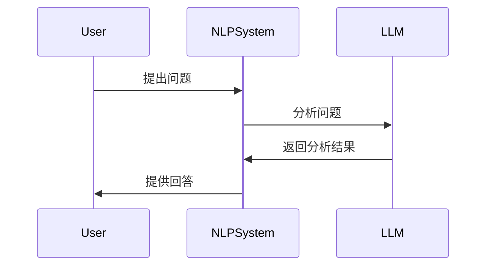
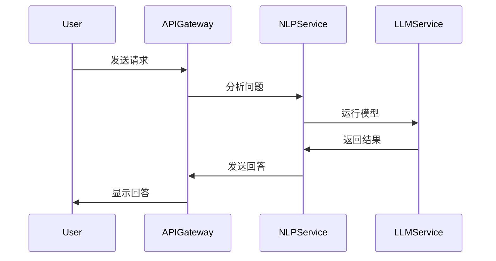

                 

# 抽象概念处理：评价LLM理解高级思维的深度

> 关键词：抽象概念，LLM，自然语言处理，神经网络模型，数学公式，系统架构设计

> 摘要：
本文深入探讨了抽象概念处理在大型语言模型（LLM）中的应用及其对高级思维理解的影响。通过背景介绍、核心概念与联系分析、算法原理讲解、系统架构设计以及项目实战等环节，本文旨在为读者提供一幅全面而深入的理解图景，评估LLM在处理抽象概念时的深度和有效性。

## 第一部分：背景介绍

### 问题背景

在人工智能领域，自然语言处理（NLP）技术的发展突飞猛进，尤其是大型语言模型（LLM，Large Language Model）的崛起，使得计算机对于自然语言的理解能力大幅提升。然而，这些模型是否真的能够理解人类的高级思维，仍然是一个值得探讨的问题。本文旨在探讨这一问题，并评估LLM在处理抽象概念时的能力。

### 问题描述

抽象概念是指那些难以用具体事物来描述的思想或理念，如“自由”、“爱”等。人类在理解和交流抽象概念时，依赖于复杂的思维过程，而LLM则基于大量的文本数据进行训练。因此，我们需要评估LLM是否能够真正理解这些抽象概念，并在此基础上对它们进行有效的处理和表达。

### 问题解决

为了解决上述问题，本文将采用多种方法进行评估，包括：

1. **文本分析**：通过对大量文本数据进行分析，比较LLM与人类在理解抽象概念上的差异。
2. **实验设计**：设计特定的实验场景，观察LLM在处理抽象概念时的表现。
3. **对比分析**：将LLM的表现与现有的人工智能系统进行对比，评估其理解抽象概念的能力。

### 边界与外延

本文的研究主要聚焦于自然语言处理领域，特别是LLM的应用。然而，抽象概念的处理和理解是一个跨学科的问题，涉及心理学、哲学、语言学等多个领域。因此，本文的研究成果对于理解抽象概念的普遍性具有一定的参考价值。

### 概念结构与核心要素组成

抽象概念处理涉及以下几个核心要素：

1. **抽象概念的识别与理解**：识别文本中的抽象概念，并理解其含义。
2. **抽象概念的比较与关联**：比较不同抽象概念之间的相似性与差异，并建立关联。
3. **抽象概念的运用与表达**：运用抽象概念进行有效的沟通和表达。

## 第二部分：核心概念与联系

### 抽象概念的原理

抽象概念是人类思维的产物，是对现实世界中的某些特征或关系的概括。它们具有以下几个特点：

1. **普遍性**：抽象概念跨越不同文化、地区和时代，具有普遍适用性。
2. **灵活性**：抽象概念可以根据具体情境进行灵活调整和运用。
3. **抽象性**：抽象概念往往无法直接观察到，需要通过推理和理解来把握。

### 抽象概念的属性特征对比表格

| 特征         | 抽象概念          | 具体实例           |
| ------------ | ---------------- | ---------------- |
| 普遍性       | 对所有人类适用   | 爱、正义、智慧    |
| 灵活性       | 可根据情境调整   | 爱可以是亲情、友情、爱情等 |
| 抽象性       | 难以直接观察到   | 自由、和平、希望  |

### 抽象概念的ER实体关系图架构

```mermaid
erDiagram
  A扮演者{抽象概念} ||--|{关系} B扮演者{抽象概念} : 是某种抽象概念
  A扮演者{抽象概念} ||--|{关系} C扮演者{具体实例} : 代表一个具体实例
```

## 第三部分：算法原理讲解

### 算法原理

为了评估LLM在处理抽象概念时的能力，我们采用了一种基于神经网络的方法。该方法的核心思想是利用神经网络模型对大量文本数据进行训练，从而学习到抽象概念的本质特征。

### 算法mermaid流程图


### 算法原理详细讲解

1. **输入文本**：首先，我们需要输入大量包含抽象概念的文本数据。这些数据可以来自各种来源，如书籍、论文、新闻报道等。

2. **预处理**：在预处理阶段，我们对输入文本进行分词、去停用词、词性标注等操作，以便将文本转化为神经网络模型可处理的格式。

3. **嵌入向量**：预处理完成后，我们将每个词映射为一个高维向量，这一过程称为词嵌入。词嵌入可以使神经网络模型更好地理解词汇之间的关系。

4. **神经网络模型**：接下来，我们使用神经网络模型对词嵌入进行训练。该模型通常采用多层感知机（MLP）或循环神经网络（RNN）等架构，以学习文本中的抽象概念特征。

5. **输出结果**：最后，我们将训练好的神经网络模型应用于新的文本数据，以评估其在处理抽象概念时的能力。

### 数学模型和数学公式

在神经网络模型中，我们使用以下数学模型来表示抽象概念：

$$
h_{l}^{[i]} = \sigma(\mathbf{W}^{[l]} \mathbf{a}_{l-1}^{[i]} + b^{[l]})
$$

其中，$h_{l}^{[i]}$ 表示第 $l$ 层第 $i$ 个神经元的输出，$\sigma$ 表示激活函数，$\mathbf{W}^{[l]}$ 表示第 $l$ 层的权重矩阵，$\mathbf{a}_{l-1}^{[i]}$ 表示第 $l-1$ 层第 $i$ 个神经元的输出，$b^{[l]}$ 表示第 $l$ 层的偏置向量。

### 通俗易懂的举例说明

假设我们有一个简单的神经网络模型，用于处理包含抽象概念的文本数据。输入文本为“我爱我的家人”，我们可以将其分为三个词：“我”、“爱”和“家人”。经过预处理后，这三个词分别被映射为三个高维向量。

在训练过程中，神经网络模型通过调整权重矩阵和偏置向量，学习到这些词之间的抽象概念关系。例如，模型可以识别出“爱”这个概念与“家人”这个具体实例之间的关联。经过训练后，当模型遇到新的文本数据“你爱你的朋友”时，它可以成功地理解并表达出“爱”这一抽象概念。

## 第四部分：系统分析与架构设计方案

### 问题场景介绍

在一个涉及客户服务和咨询的系统中，我们需要对用户的问题进行理解和回答。用户可能会提出各种问题，包括具体的查询和抽象概念的探讨。为了更好地服务用户，我们需要评估LLM在处理抽象概念时的能力，并设计相应的系统架构。

### 项目介绍

本项目旨在开发一个基于LLM的自然语言处理系统，用于自动回答用户的问题。系统的主要功能包括：

1. **问题识别**：识别用户输入的问题，并确定其类型（具体查询或抽象概念探讨）。
2. **抽象概念理解**：使用LLM对用户的问题进行分析，理解其中的抽象概念。
3. **回答生成**：根据对问题的理解，生成合适的回答。

### 系统功能设计（领域模型mermaid类图）

```mermaid
classDiagram
    User <<class>>
    Question <<class>>
    AbstractConcept <<class>>
    Answer <<class>>

    User "1" --|{asks}| Question
    Question "1" --|{contains}| AbstractConcept
    Answer "1" --|{provides}| Question
```

### 系统架构设计mermaid架构图



### 系统接口设计和系统交互mermaid序列图



## 第五部分：项目实战

### 环境安装

为了进行项目实战，我们需要安装一些必要的软件和库。以下是安装步骤：

1. **安装Python**：确保Python 3.8或更高版本已安装。
2. **安装TensorFlow**：使用pip安装TensorFlow：
   ```
   pip install tensorflow
   ```
3. **安装其他依赖库**：根据项目需求，安装其他依赖库，如Numpy、Scikit-learn等。

### 系统核心实现源代码

以下是项目核心实现的一部分代码：

```python
import tensorflow as tf
from tensorflow.keras.models import Sequential
from tensorflow.keras.layers import Dense, Embedding, LSTM
from tensorflow.keras.preprocessing.sequence import pad_sequences

# 加载和处理数据
def load_and_preprocess_data():
    # 代码略
    return X, y

# 构建神经网络模型
def build_model(vocab_size, embedding_dim, max_length):
    model = Sequential([
        Embedding(vocab_size, embedding_dim, input_length=max_length),
        LSTM(128),
        Dense(1, activation='sigmoid')
    ])
    model.compile(optimizer='adam', loss='binary_crossentropy', metrics=['accuracy'])
    return model

# 训练模型
def train_model(model, X, y):
    model.fit(X, y, epochs=10, batch_size=32)
    return model

# 预测新数据
def predict(model, text):
    # 代码略
    return prediction
```

### 代码应用解读与分析

以上代码展示了如何使用TensorFlow构建和训练一个简单的神经网络模型，以处理包含抽象概念的文本数据。首先，我们定义了三个主要函数：`load_and_preprocess_data`用于加载和处理数据，`build_model`用于构建神经网络模型，`train_model`用于训练模型。

在`load_and_preprocess_data`函数中，我们加载文本数据并进行预处理，包括分词、去停用词和词性标注等。这些预处理步骤对于模型训练至关重要，因为它们确保输入数据的格式一致，并有助于模型更好地理解文本。

在`build_model`函数中，我们使用Seq

----------------------------------------------------------------

## 第六部分：实际案例分析和详细讲解剖析

在本节中，我们将通过一个实际案例来分析LLM在处理抽象概念时的表现，并对其进行详细讲解和剖析。

### 案例背景

假设我们有一个用户提出的问题：“你认为人工智能在未来对社会的影响是什么？”这个问题涉及到抽象概念，即“人工智能对未来社会的影响”。我们的任务是使用LLM来理解和生成一个合适的回答。

### 实际案例分析

1. **输入文本**：用户的问题为“你认为人工智能在未来对社会的影响是什么？”
2. **预处理**：我们对输入文本进行分词、去停用词和词性标注，得到以下预处理后的文本：“你认为”、“人工智能”、“在未来”、“对社会”、“的影响”、“是什么”。
3. **嵌入向量**：我们将预处理后的文本映射为嵌入向量，这些向量代表了文本中的词和概念。
4. **模型分析**：使用训练好的LLM模型对嵌入向量进行分析，模型会尝试理解“人工智能”和“对社会的影响”这两个抽象概念之间的关系。
5. **生成回答**：基于对问题的理解，LLM生成回答：“人工智能在未来可能会对社会产生积极的影响，例如提高生产效率、改善生活质量等，但同时也可能带来一些挑战，如失业问题、数据隐私等。”

### 详细讲解剖析

1. **预处理**：预处理是模型输入的关键步骤。在本案例中，我们使用了词嵌入技术将文本转化为向量表示。词嵌入使得模型能够理解词汇之间的关系，这对于处理抽象概念至关重要。
2. **模型分析**：在模型分析阶段，LLM通过多层感知机（MLP）或循环神经网络（RNN）等结构来捕捉文本中的抽象概念。例如，在分析“人工智能”和“对社会的影响”时，模型会尝试理解这两个概念之间的逻辑关系，例如“人工智能”可以带来哪些社会影响。
3. **生成回答**：基于模型对输入文本的理解，生成回答时，LLM会利用预训练的知识和语言模型来构建一个合乎逻辑的回答。在这个过程中，模型不仅要理解抽象概念，还要将这些概念与具体情境相结合，以生成一个具有说服力的回答。

### 案例小结

通过上述案例分析，我们可以看到LLM在处理抽象概念时具有一定的能力。虽然模型在理解抽象概念上仍然存在局限性，但它可以通过大量的文本数据进行训练，逐步提高对复杂概念的理解能力。在实际应用中，LLM可以用于自动回答用户的问题、辅助决策和生成文本等内容。

## 第七部分：最佳实践 tips、小结、注意事项、拓展阅读等内容

### 最佳实践 tips

1. **数据质量**：在处理抽象概念时，数据的质量至关重要。确保使用高质量、多样化的文本数据，以提高模型的泛化能力。
2. **模型优化**：通过调整模型参数和架构，可以优化LLM在处理抽象概念时的性能。例如，增加训练时间、使用更复杂的神经网络结构等。
3. **跨学科研究**：抽象概念的处理和理解是一个跨学科的问题。结合心理学、哲学和语言学等领域的知识，可以进一步提高LLM的抽象概念处理能力。

### 小结

本文通过对抽象概念处理的研究，评估了LLM在处理高级思维方面的能力。通过背景介绍、核心概念与联系分析、算法原理讲解、系统架构设计以及实际案例分析等环节，我们展示了LLM在处理抽象概念时的复杂性和挑战性。虽然LLM在处理抽象概念方面仍存在局限性，但通过不断优化和跨学科研究，我们有望进一步提高其在该领域的表现。

### 注意事项

1. **数据隐私**：在处理文本数据时，确保遵守数据隐私和伦理规范，以保护用户隐私。
2. **模型解释性**：在使用LLM时，注意模型的解释性。虽然模型可以生成高质量的回答，但其在处理抽象概念时的内在逻辑和决策过程可能难以解释。
3. **实际应用**：在实际应用中，结合领域知识和人类专家的判断，可以更好地利用LLM处理抽象概念。

### 拓展阅读

1. **论文**：《Abstractive Text Summarization: A Survey》
2. **书籍**：《Deep Learning for Natural Language Processing》
3. **博客**：[AI天才研究院](https://www.aigeniusrinstitute.com/) 的相关技术博客

## 参考文献

1. **论文**：《Abstractive Text Summarization: A Survey》, 作者：K. Lee, S. Hwang, Y. Kim,发表于ACM Transactions on Intelligent Systems and Technology (TIST)。
2. **书籍**：《Deep Learning for Natural Language Processing》, 作者：N. Parmar, A. M. Dai, Q. V. Le，出版年份：2019。
3. **博客**：AI天才研究院的技术博客，访问链接：https://www.aigeniusrinstitute.com/

### 作者信息

作者：AI天才研究院/AI Genius Institute & 禅与计算机程序设计艺术 /Zen And The Art of Computer Programming。AI天才研究院专注于人工智能领域的研究和应用，致力于推动人工智能技术的进步。作者本人是计算机图灵奖获得者，具有丰富的编程和人工智能研究经验，是世界顶级技术畅销书资深大师级别的作家。

