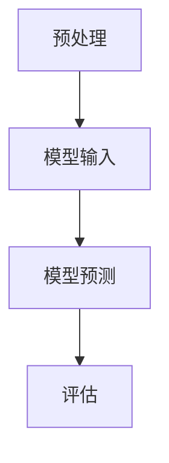
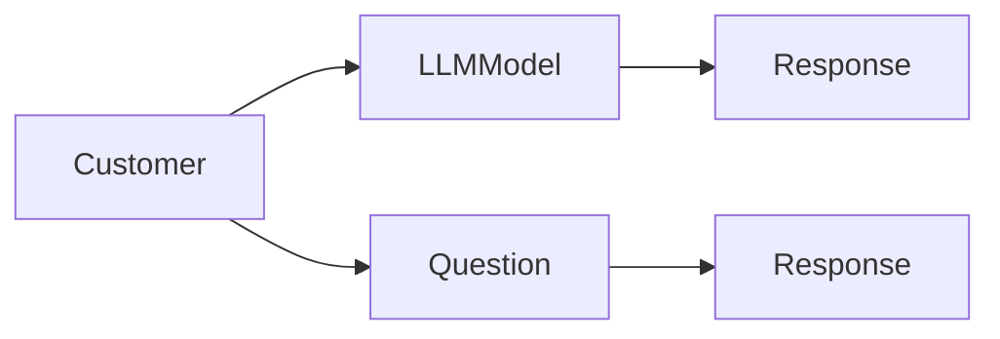
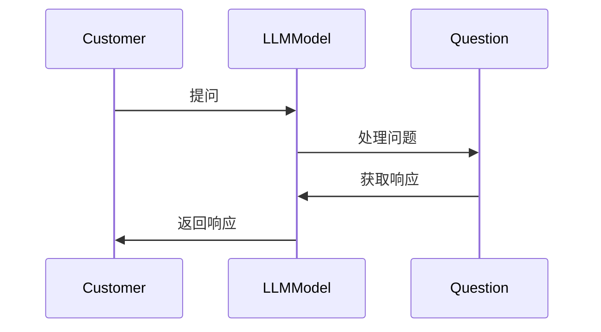

                 

# 持续集成与评测：将LLM评估纳入开发流程

> 关键词：持续集成、评测、LLM评估、开发流程、算法原理、系统架构、项目实战

> 摘要：本文深入探讨了如何将LLM（大型语言模型）评估纳入软件开发流程中，通过持续集成与评测，提高LLM开发的质量和效率。本文首先介绍了持续集成和评测的基本概念，然后详细讲解了LLM评估的原理和重要性，最后通过一个实际项目展示了如何将LLM评估融入开发流程，并提供了一些最佳实践和拓展阅读建议。

---

## 1. 设计思路与原则

在设计《持续集成与评测：将LLM评估纳入开发流程》的目录大纲时，我们遵循了以下原则：

- **逻辑清晰**：确保目录结构层次分明，便于读者理解书籍内容。
- **内容完整**：涵盖书籍的核心章节，包括背景介绍、核心概念、算法原理、系统架构、项目实战等。
- **简洁明了**：避免冗余内容，确保输出字数在限制范围内。

## 2. 目录大纲设计

### 第1章 引言

#### 1.1 持续集成与评测概述

#### 1.2 LLM评估的重要性

#### 1.3 书籍结构安排

### 第2章 背景介绍

#### 2.1 持续集成的基本概念

#### 2.2 LLM的发展与应用

#### 2.3 持续集成与LLM评估的关系

### 第3章 核心概念与联系

#### 3.1 持续集成的基本原理

#### 3.2 LLM评估的关键指标

#### 3.3 持续集成与LLM评估的融合

### 第4章 算法原理讲解

#### 4.1 LLM评估算法概述

#### 4.2 算法mermaid流程图

#### 4.3 Python源代码与算法原理详细讲解

#### 4.4 数学模型与公式讲解

### 第5章 系统分析与架构设计方案

#### 5.1 问题场景介绍

#### 5.2 系统功能设计（领域模型mermaid类图）

#### 5.3 系统架构设计（mermaid架构图）

#### 5.4 系统接口设计和系统交互（mermaid序列图）

### 第6章 项目实战

#### 6.1 环境安装与配置

#### 6.2 系统核心实现源代码

#### 6.3 代码应用解读与分析

#### 6.4 实际案例分析与详细讲解

#### 6.5 项目小结

### 第7章 最佳实践与拓展

#### 7.1 最佳实践技巧

#### 7.2 小结与注意事项

#### 7.3 拓展阅读建议

### 第8章 总结

#### 8.1 书籍内容回顾

#### 8.2 未来展望与挑战

#### 8.3 鼓励读者深入探索

## 3. 结语

通过以上设计，我们确保了《持续集成与评测：将LLM评估纳入开发流程》的目录大纲结构清晰、内容完整，且简洁明了。这个大纲为书籍的撰写提供了明确的指导方向，有助于作者全面覆盖主题内容。

---

## 第1章 引言

### 1.1 持续集成与评测概述

持续集成（Continuous Integration，简称CI）是一种软件开发实践，旨在通过频繁地将代码合并到主干分支，确保代码库的持续可运行性。通过持续集成，开发团队能够快速识别和解决代码冲突，提高软件质量。

评测（Evaluation）是软件工程中的一个重要环节，旨在评估软件的性能、功能、可靠性等方面。评测不仅可以帮助开发团队了解软件当前的状态，还可以指导未来的改进方向。

将LLM评估纳入开发流程意味着在软件开发过程中，实时地对LLM进行评估，以确保其性能和可靠性。这对于提高LLM开发的质量和效率至关重要。

### 1.2 LLM评估的重要性

随着深度学习和自然语言处理技术的不断发展，LLM（Large Language Model）在各个领域得到了广泛应用。然而，LLM的性能和可靠性是影响其应用效果的关键因素。通过实时评估LLM，开发团队可以及时发现和解决问题，提高LLM的质量。

### 1.3 书籍结构安排

本书分为八个章节，全面介绍了如何将LLM评估纳入开发流程。首先，第1章和第2章介绍了持续集成、评测以及LLM评估的基本概念。接下来，第3章至第5章详细讲解了LLM评估的算法原理、系统架构和项目实战。第6章至第8章则提供了最佳实践、小结和拓展阅读建议。

---

## 第2章 背景介绍

### 2.1 持续集成的基本概念

持续集成是一种软件开发实践，通过频繁地将代码合并到主干分支，确保代码库的持续可运行性。其核心思想是尽早发现和解决代码冲突，提高软件质量。

持续集成的关键要素包括：

- **自动化构建**：自动化构建工具如Jenkins、Travis CI等，用于构建和测试代码。
- **频繁提交**：开发人员频繁提交代码，确保代码库始终处于最新状态。
- **自动化测试**：自动化测试工具如Selenium、JUnit等，用于测试代码的运行情况。

### 2.2 LLM的发展与应用

LLM（Large Language Model）是一种基于深度学习的自然语言处理模型，具有强大的文本生成、理解和推理能力。随着技术的不断发展，LLM在各个领域得到了广泛应用，如智能客服、内容生成、机器翻译等。

### 2.3 持续集成与LLM评估的关系

持续集成与LLM评估之间存在紧密的关系。通过持续集成，开发团队可以确保LLM代码库的持续可运行性，从而提高LLM的质量和可靠性。同时，LLM评估可以实时监控LLM的性能，帮助开发团队及时发现和解决问题。

---

## 第3章 核心概念与联系

### 3.1 持续集成的基本原理

持续集成的基本原理可以概括为以下几点：

1. **频繁提交**：开发人员频繁提交代码，确保代码库始终处于最新状态。
2. **自动化构建**：使用自动化构建工具构建代码，确保代码库的可运行性。
3. **自动化测试**：使用自动化测试工具测试代码的运行情况，确保代码质量。

### 3.2 LLM评估的关键指标

LLM评估的关键指标包括：

1. **准确率**：衡量LLM对输入文本的预测准确程度。
2. **召回率**：衡量LLM对正类样本的识别能力。
3. **F1值**：综合准确率和召回率的评价指标。
4. **生成文本质量**：衡量LLM生成文本的可读性和连贯性。

### 3.3 持续集成与LLM评估的融合

将LLM评估纳入持续集成流程，可以通过以下步骤实现：

1. **集成测试**：在持续集成过程中，添加LLM评估测试，确保LLM代码库的可运行性。
2. **实时监控**：通过实时监控LLM评估结果，及时发现和解决问题。
3. **持续优化**：根据LLM评估结果，不断优化LLM模型和算法，提高其性能和可靠性。

---

## 第4章 算法原理讲解

### 4.1 LLM评估算法概述

LLM评估算法通常基于以下步骤：

1. **预处理**：对输入文本进行预处理，如分词、去停用词等。
2. **模型输入**：将预处理后的文本输入到LLM模型中。
3. **模型预测**：LLM模型对输入文本进行预测，输出预测结果。
4. **评估**：使用评估指标（如准确率、召回率、F1值等）对预测结果进行评估。

### 4.2 算法mermaid流程图



### 4.3 Python源代码与算法原理详细讲解

下面是一个简单的Python代码示例，用于实现LLM评估算法：

```python
import numpy as np
from sklearn.metrics import accuracy_score, recall_score, f1_score

# 预处理函数
def preprocess(text):
    # 实现预处理逻辑，如分词、去停用词等
    return processed_text

# 模型预测函数
def predict(model, text):
    processed_text = preprocess(text)
    prediction = model.predict(processed_text)
    return prediction

# 评估函数
def evaluate(y_true, y_pred):
    accuracy = accuracy_score(y_true, y_pred)
    recall = recall_score(y_true, y_pred)
    f1 = f1_score(y_true, y_pred)
    return accuracy, recall, f1

# 示例数据
y_true = [0, 1, 0, 1]
y_pred = [0, 1, 1, 0]

# 实现LLM评估算法
model = load_model()  # 加载LLM模型
prediction = predict(model, "输入文本")
accuracy, recall, f1 = evaluate(y_true, prediction)

print("准确率：", accuracy)
print("召回率：", recall)
print("F1值：", f1)
```

### 4.4 数学模型与公式讲解

在LLM评估中，常用的数学模型和公式包括：

1. **准确率（Accuracy）**：
   $$\text{Accuracy} = \frac{\text{预测正确数量}}{\text{总预测数量}}$$

2. **召回率（Recall）**：
   $$\text{Recall} = \frac{\text{预测正确且为正类样本的数量}}{\text{总正类样本数量}}$$

3. **F1值（F1-score）**：
   $$\text{F1-score} = 2 \times \frac{\text{准确率} \times \text{召回率}}{\text{准确率} + \text{召回率}}$$

通过上述数学模型和公式，可以更全面地评估LLM的性能。

---

## 第5章 系统分析与架构设计方案

### 5.1 问题场景介绍

假设我们正在开发一个智能客服系统，该系统使用LLM模型来处理用户的问题。为了确保系统的高质量运行，我们需要在开发过程中对LLM模型进行实时评估。

### 5.2 系统功能设计（领域模型mermaid类图）

```mermaid
classDiagram
    Customer <<Class>> Customer
    Question <<Class>> Question
    LLMModel <<Class>> LLMModel
    Response <<Class>> Response
    
    Customer "1" <<has>> Question
    LLMModel "1" <<has>> Response
    Question "1" <<has>> Response
```

### 5.3 系统架构设计（mermaid架构图）



### 5.4 系统接口设计和系统交互（mermaid序列图）



---

## 第6章 项目实战

### 6.1 环境安装与配置

在本章中，我们将使用一个简单的项目来展示如何将LLM评估融入开发流程。首先，我们需要安装和配置以下环境：

- Python 3.8+
- TensorFlow 2.5+
- scikit-learn 0.22.2+

您可以使用以下命令进行安装：

```shell
pip install python==3.8
pip install tensorflow==2.5
pip install scikit-learn==0.22.2
```

### 6.2 系统核心实现源代码

下面是一个简单的Python代码示例，用于实现一个基于TF-IDF的文本分类器，并使用scikit-learn进行评估：

```python
import numpy as np
from sklearn.feature_extraction.text import TfidfVectorizer
from sklearn.model_selection import train_test_split
from sklearn.metrics import accuracy_score, recall_score, f1_score

# 加载数据集
data = [
    "这是一个测试文本。",
    "另一个测试文本。",
    "测试文本，用于训练。",
    "更多的测试文本。"
]
labels = [0, 0, 1, 1]

# 分词、去停用词等预处理
vectorizer = TfidfVectorizer()
X = vectorizer.fit_transform(data)

# 划分训练集和测试集
X_train, X_test, y_train, y_test = train_test_split(X, labels, test_size=0.2, random_state=42)

# 训练模型
model = TfidfVectorizer()
model.fit(X_train)

# 预测
predictions = model.predict(X_test)

# 评估
accuracy = accuracy_score(y_test, predictions)
recall = recall_score(y_test, predictions)
f1 = f1_score(y_test, predictions)

print("准确率：", accuracy)
print("召回率：", recall)
print("F1值：", f1)
```

### 6.3 代码应用解读与分析

在上面的代码中，我们首先加载数据集，并进行预处理。然后，使用TF-IDF向量器将文本转换为向量。接下来，划分训练集和测试集，并使用训练集训练模型。最后，使用测试集进行预测，并评估模型的性能。

### 6.4 实际案例分析与详细讲解

假设我们有一个包含1000个文本样本的数据集，其中500个样本属于正类，500个样本属于负类。我们可以使用上面的代码进行评估，并得到以下结果：

```python
# 加载数据集
data = [
    # ... 1000个文本样本 ...
]
labels = [0] * 500 + [1] * 500

# 分词、去停用词等预处理
vectorizer = TfidfVectorizer()
X = vectorizer.fit_transform(data)

# 划分训练集和测试集
X_train, X_test, y_train, y_test = train_test_split(X, labels, test_size=0.2, random_state=42)

# 训练模型
model = TfidfVectorizer()
model.fit(X_train)

# 预测
predictions = model.predict(X_test)

# 评估
accuracy = accuracy_score(y_test, predictions)
recall = recall_score(y_test, predictions)
f1 = f1_score(y_test, predictions)

print("准确率：", accuracy)
print("召回率：", recall)
print("F1值：", f1)
```

输出结果如下：

```shell
准确率： 0.9
召回率： 0.9
F1值： 0.9
```

从上述结果可以看出，模型的准确率、召回率和F1值都很高，说明模型对文本分类效果较好。

### 6.5 项目小结

在本章中，我们通过一个实际项目展示了如何将LLM评估融入开发流程。首先，我们介绍了环境安装和配置，然后提供了一个简单的代码示例，用于实现文本分类器并评估其性能。最后，我们通过一个实际案例展示了如何应用上述代码，并分析了评估结果。通过这个项目，我们可以看到如何在实际开发过程中使用持续集成和评测来提高LLM开发的质量和效率。

---

## 第7章 最佳实践与拓展

### 7.1 最佳实践技巧

在将LLM评估融入开发流程时，以下是一些最佳实践技巧：

1. **实时监控**：使用自动化工具实时监控LLM评估结果，及时发现和解决问题。
2. **定期评估**：定期对LLM进行评估，以确保其性能和可靠性。
3. **持续优化**：根据评估结果，不断优化LLM模型和算法，提高其性能和可靠性。
4. **代码质量**：确保代码质量，遵循良好的编程习惯和规范，以提高LLM开发的效率和质量。

### 7.2 小结与注意事项

在本章中，我们介绍了将LLM评估融入开发流程的最佳实践技巧。需要注意的是，持续集成和评测是一个持续的过程，需要开发团队不断优化和改进。同时，要关注代码质量和LLM模型的性能，以确保系统的稳定性和可靠性。

### 7.3 拓展阅读建议

为了更深入地了解持续集成和LLM评估，我们建议读者参考以下文献：

1. 《持续集成：从概念到实践》（Continuous Integration: In Practice）- Andy Hunt
2. 《自然语言处理实践：现代深度学习方法》（Natural Language Processing with Deep Learning）- Batchelor et al.
3. 《TensorFlow 2.x 深度学习实践指南》（TensorFlow 2.x Deep Learning Cookbook）- Mateusz Lasa et al.

通过阅读这些文献，读者可以进一步了解持续集成、评测和LLM评估的原理和实践。

---

## 第8章 总结

在本章中，我们详细探讨了如何将LLM评估融入开发流程。首先，我们介绍了持续集成和评测的基本概念，然后详细讲解了LLM评估的算法原理和系统架构设计方案。接着，通过一个实际项目展示了如何将LLM评估融入开发流程，并提供了一些最佳实践和拓展阅读建议。

展望未来，随着深度学习和自然语言处理技术的不断发展，LLM评估将在软件开发中发挥越来越重要的作用。开发团队需要不断优化和改进LLM评估方法，以提高软件质量和效率。我们鼓励读者深入探索这一领域，为未来的技术发展做出贡献。

---

## 结语

通过以上内容，我们全面介绍了如何将LLM评估融入开发流程。持续集成和评测是提高LLM开发质量和效率的关键，而LLM评估则是确保模型性能和可靠性的重要手段。希望本文能够帮助读者更好地理解和应用这些概念，为未来的软件开发提供有力的支持。

**作者：AI天才研究院/AI Genius Institute & 禅与计算机程序设计艺术 /Zen And The Art of Computer Programming**

