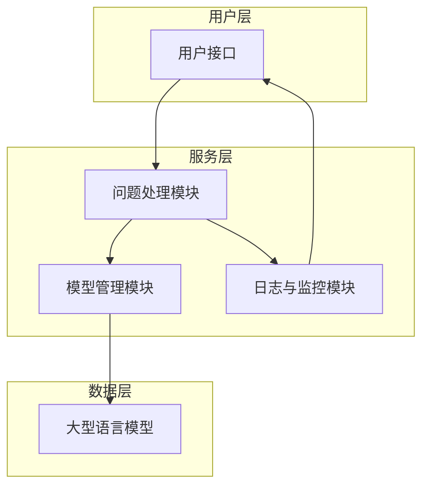
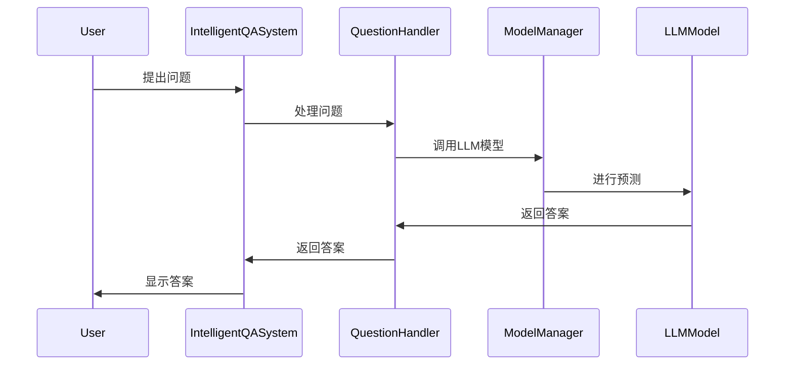

                 

### 第一部分：背景介绍

#### 第1章：持续集成与部署概述

在当今快速发展的软件开发领域，持续集成（Continuous Integration，CI）与持续部署（Continuous Deployment，CD）已经成为提高软件交付效率和质量的关键技术手段。这两者的核心在于通过自动化流程，确保代码的持续更新和稳定运行，从而降低开发风险，缩短发布周期。

**1.1 问题背景**

软件项目的开发过程中，传统的瀑布模型由于缺乏迭代和反馈机制，往往导致开发周期过长，项目风险难以控制。随着敏捷开发（Agile Development）和DevOps文化的兴起，持续集成与持续部署成为了应对这些挑战的重要策略。

**1.2 问题描述**

在软件开发过程中，开发者通常会进行代码的频繁更新和提交。然而，这种频繁的提交如果不经过有效的管理和测试，很容易导致以下问题：

- **代码冲突**：多个开发者同时提交代码时，容易产生冲突。
- **测试成本高**：每次提交代码后都需要进行全面的测试，耗费大量时间和资源。
- **部署风险大**：未经充分测试的代码直接部署到生产环境，可能导致系统崩溃或功能异常。

**1.3 问题解决**

持续集成与持续部署通过自动化流程，解决上述问题：

- **自动化测试**：每次提交后，自动运行一系列测试，确保代码质量。
- **代码合并**：在提交阶段就解决代码冲突，减少后期合并的难度。
- **快速反馈**：快速发现并解决代码中的问题，缩短问题解决周期。

**1.4 边界与外延**

持续集成与持续部署不仅仅是技术实现，还包括团队协作、流程优化等方面的内容。其边界涉及从代码提交到最终部署的整个流程，而外延则可以扩展到云服务、容器化技术、自动化运维等方面。

在接下来的章节中，我们将详细探讨持续集成与部署的原理、实践方法以及在大型语言模型（LLM）应用开发中的具体应用。

### 第2章：持续集成原理与实践

持续集成（Continuous Integration，CI）是一种软件开发实践，通过频繁地合并代码变化并自动进行测试，以确保代码的质量和可靠性。CI不仅提高了团队的协作效率，还显著减少了开发过程中的风险。

**2.1 核心概念与联系**

持续集成的核心概念包括：

- **代码合并**：将多个开发者的代码定期合并到同一代码库中。
- **自动化测试**：在代码合并后，自动运行一系列测试，确保代码质量。
- **持续反馈**：及时反馈测试结果，帮助开发者快速发现问题并进行修复。

这些概念相互关联，共同构成了持续集成的核心理念。

**2.2 持续集成的基本原理**

持续集成的基本原理可以概括为以下几点：

1. **频繁提交**：开发人员频繁提交代码到共享仓库。
2. **自动化构建**：每次提交后，自动触发构建过程，生成可运行的软件版本。
3. **自动化测试**：构建完成后，自动运行一系列测试，包括单元测试、集成测试等。
4. **反馈机制**：测试结果通过邮件、聊天工具等方式即时通知相关开发者。

**2.3 持续集成的实践流程**

持续集成的实践流程通常包括以下几个步骤：

1. **代码提交**：开发人员将代码提交到共享仓库。
2. **触发构建**：提交触发自动化构建，构建过程通常包括编译、打包、部署到测试环境等。
3. **运行测试**：构建完成后，自动运行测试脚本，包括单元测试、集成测试等。
4. **反馈结果**：测试结果通过邮件、聊天工具等方式反馈给相关开发者。

**2.4 持续集成的工具介绍**

在实现持续集成时，常用的工具包括：

- **Jenkins**：一个开源的持续集成工具，支持多种插件，灵活配置。
- **GitLab CI/CD**：GitLab 内置的持续集成与持续部署工具，集成在 GitLab 代码管理平台中，方便使用。
- **Travis CI**：一个云端的持续集成服务，支持多种编程语言，适用于开源项目。

**总结**

持续集成通过自动化流程，确保代码的持续更新和稳定运行。其核心在于频繁的代码提交、自动化构建和测试，以及及时的反馈机制。通过使用持续集成工具，团队可以显著提高开发效率，降低开发风险。

在下一章节中，我们将继续探讨持续部署（Continuous Deployment，CD）的原理与实践。

### 第3章：持续部署原理与实践

持续部署（Continuous Deployment，CD）是持续集成（CI）的延伸，它通过自动化流程，将经过测试和验证的代码直接部署到生产环境，确保软件的快速迭代和高质量发布。

**3.1 核心概念与联系**

持续部署的核心概念包括：

- **自动化部署**：通过脚本或工具自动将代码部署到生产环境。
- **环境一致性**：确保开发、测试和生产环境的一致性，避免环境差异导致的问题。
- **故障恢复**：自动检测部署过程中出现的问题，并迅速恢复系统。

这些概念相互关联，共同构成了持续部署的核心理念。

**3.2 持续部署的基本原理**

持续部署的基本原理可以概括为以下几点：

1. **代码审查**：代码在部署前需要经过严格的审查，确保代码质量和安全性。
2. **自动化测试**：在部署过程中，自动运行一系列测试，包括功能测试、性能测试等，确保软件的质量。
3. **部署脚本**：通过脚本或工具实现自动化部署，减少人工干预，提高部署效率。
4. **反馈机制**：部署完成后，自动收集和反馈部署结果，包括成功、失败或错误等信息。

**3.3 持续部署的实践流程**

持续部署的实践流程通常包括以下几个步骤：

1. **代码审查**：代码提交后，经过代码审查，确保代码符合规范和要求。
2. **自动化测试**：审查通过后，自动运行测试脚本，确保代码的稳定性和性能。
3. **部署准备**：在测试通过后，准备部署环境，包括配置、数据库、依赖等。
4. **自动化部署**：通过脚本或工具将代码部署到生产环境。
5. **监控和反馈**：部署完成后，监控系统运行状态，收集和反馈部署结果。

**3.4 持续部署的工具介绍**

在实现持续部署时，常用的工具包括：

- **Docker**：一个开源的容器化技术，用于创建、部署和管理应用程序。
- **Kubernetes**：一个开源的容器编排平台，用于自动化容器部署和管理。
- **Jenkins**：一个开源的持续集成工具，可以与 Docker 和 Kubernetes 配合使用，实现自动化部署。
- **Kube-Prometheus**：一个开源的监控解决方案，用于监控 Kubernetes 集群的运行状态。

**总结**

持续部署通过自动化流程，将经过测试和验证的代码快速部署到生产环境，确保软件的持续迭代和高质量发布。其核心在于代码审查、自动化测试、部署脚本和反馈机制。通过使用持续部署工具，团队可以显著提高部署效率，降低部署风险。

在下一章节中，我们将探讨在大型语言模型（LLM）应用开发中持续集成与持续部署的特殊挑战和解决方案。

### 第4章：LLM应用开发中的挑战与解决方案

在大型语言模型（LLM）应用开发过程中，持续集成与持续部署面临着一系列特殊挑战，这些挑战主要源于LLM模型的复杂性和计算资源的高需求。

**4.1 LLM应用开发中的挑战**

1. **模型规模大**：LLM模型通常包含数十亿甚至千亿个参数，模型规模庞大，导致训练和部署过程中的计算资源需求极高。
2. **训练时间久**：由于模型规模大，训练时间往往需要数天甚至数周，这对持续集成与持续部署流程的自动化和效率提出了更高要求。
3. **数据多样性**：LLM模型需要处理多种类型的数据，包括文本、图片、语音等，数据的多样性和复杂性增加了集成与部署的难度。
4. **准确性要求高**：LLM模型在应用中往往承担着重要的决策角色，对准确性的要求极高，任何错误都可能带来严重的后果。
5. **版本管理复杂**：由于LLM模型频繁更新，版本管理变得更加复杂，如何确保不同版本之间的兼容性成为关键问题。

**4.2 持续集成在LLM开发中的应用**

1. **模型版本控制**：采用Git等版本控制系统，对LLM模型的代码和配置进行版本控制，确保每个版本的模型都可以被追溯和回滚。
2. **自动化测试框架**：建立完善的自动化测试框架，对LLM模型进行单元测试、集成测试和性能测试，确保模型的稳定性和准确性。
3. **并行计算**：利用分布式计算框架，如TensorFlow或PyTorch，实现模型的并行训练，提高训练效率。
4. **模型压缩与量化**：采用模型压缩和量化技术，减小模型规模，降低计算资源需求。

**4.3 持续部署在LLM开发中的应用**

1. **容器化与Kubernetes**：使用Docker等容器化技术，将LLM模型和应用容器化，结合Kubernetes进行自动化部署和管理，提高部署效率和可扩展性。
2. **自动化部署脚本**：编写自动化部署脚本，实现从代码提交到生产环境部署的自动化流程，确保模型更新和部署的快速、可靠。
3. **持续监控**：引入监控工具，如Prometheus和Grafana，实时监控模型的运行状态和性能指标，及时发现和处理问题。
4. **蓝绿部署**：采用蓝绿部署策略，将新版本模型逐步替换旧版本，确保系统平稳过渡，降低风险。

**4.4 案例分析**

以一家人工智能公司开发的一款智能客服系统为例，该系统基于LLM模型，通过自然语言处理（NLP）技术实现与用户的对话。在开发过程中，公司面临着以下挑战：

- **模型规模大**：客服系统需要处理大量的用户对话数据，模型规模庞大。
- **训练时间久**：客服系统的模型训练时间较长，影响开发进度。
- **数据多样性**：客服系统需要处理文本、语音等多种类型的数据，数据多样性高。
- **准确性要求高**：客服系统需要提供准确的回答，用户满意度直接影响公司声誉。

为了解决这些挑战，公司采取了以下措施：

- **模型版本控制**：采用Git进行版本控制，确保每个模型版本都可以追溯和回滚。
- **自动化测试框架**：建立自动化测试框架，对模型进行全面的测试，确保模型稳定性和准确性。
- **并行计算**：利用分布式计算框架进行模型训练，提高训练效率。
- **容器化与Kubernetes**：使用Docker和Kubernetes进行模型部署和管理，提高部署效率和可扩展性。
- **蓝绿部署**：采用蓝绿部署策略，逐步替换旧版本模型，确保系统平稳过渡。

通过上述措施，公司成功提高了LLM应用的开发效率和稳定性，为用户提供高质量的智能客服服务。

**总结**

在LLM应用开发中，持续集成与持续部署面临着特殊挑战，但通过合理的技术手段和流程优化，可以显著提高开发效率和模型质量。在下一章节中，我们将详细介绍如何在LLM应用开发中配置和实现持续集成与持续部署工具。

### 第5章：持续集成与部署工具配置

在实现LLM应用的持续集成与持续部署时，工具的选择和配置至关重要。以下将详细描述如何配置Jenkins、Docker和Kubernetes这三个关键工具，以构建一个高效的持续集成与部署系统。

**5.1 环境安装**

1. **Jenkins安装**：

   - **环境准备**：在服务器上安装Java环境，版本至少为JDK 8或以上。
   - **下载Jenkins**：访问Jenkins官网下载最新版本，下载完成后，运行安装程序。
   - **配置Jenkins**：启动Jenkins后，根据提示进行配置，如创建管理员账户、安装插件等。

2. **Docker安装**：

   - **环境准备**：在服务器上安装Docker，可以参考Docker官方文档进行安装。
   - **验证安装**：通过运行`docker --version`命令，验证Docker是否安装成功。

3. **Kubernetes安装**：

   - **环境准备**：安装Kubernetes需要一台或多台服务器，确保网络畅通。
   - **安装Kubeadm**：通过Kubeadm命令安装Kubernetes集群，具体命令可以参考Kubernetes官方文档。
   - **初始化集群**：使用`kubeadm init`命令初始化集群，并记录下`kubeadm join`命令，用于后续节点加入。

**5.2 Jenkins配置**

1. **Jenkins插件安装**：

   - **安装插件**：在Jenkins管理界面中，进入“管理Jenkins” -> “管理插件”，搜索并安装以下插件：
     - Gradle Plugin
     - Docker Plugin
     - Pipeline Plugin
     - Kubernetes Plugin

2. **创建构建项目**：

   - **创建新项目**：在Jenkins界面中，点击“新建项”，创建一个新的自由风格项目。
   - **配置源代码管理**：选择Git作为源代码管理工具，填写Git仓库地址和凭证。
   - **构建触发器**：配置构建触发器，如“SCM更改触发”，确保每次代码提交时自动触发构建。

3. **构建步骤配置**：

   - **构建脚本**：在“构建”步骤中，添加构建脚本，如以下Python脚本示例：

     ```python
     import os
     import subprocess

     # 拉取最新代码
     os.system('git pull')

     # 编译和构建项目
     os.system('mvn clean install')

     # 构建Docker镜像
     os.system('docker build -t myapp:latest .')

     # 推送Docker镜像到仓库
     os.system('docker push myapp:latest')
     ```

**5.3 Docker配置**

1. **Dockerfile编写**：

   - **基础镜像选择**：在项目目录中创建一个Dockerfile，选择一个基础镜像，如`python:3.8`。

     ```Dockerfile
     FROM python:3.8

     # 设置工作目录
     WORKDIR /app

     # 拷贝项目文件
     COPY . /app

     # 安装依赖
     RUN pip install -r requirements.txt

     # 暴露服务端口
     EXPOSE 8080

     # 运行应用
     CMD ["python", "app.py"]
     ```

2. **构建镜像**：

   - **执行构建命令**：在终端中执行以下命令，构建Docker镜像。

     ```shell
     docker build -t myapp:latest .
     ```

3. **推送镜像到仓库**：

   - **登录Docker Hub**：使用以下命令登录Docker Hub。

     ```shell
     docker login
     ```

   - **推送镜像**：执行以下命令，将Docker镜像推送至Docker Hub。

     ```shell
     docker push myapp:latest
     ```

**5.4 Kubernetes配置**

1. **部署配置文件**：

   - **创建配置文件**：在项目目录中创建一个Kubernetes部署配置文件，如`myapp-deployment.yaml`。

     ```yaml
     apiVersion: apps/v1
     kind: Deployment
     metadata:
       name: myapp
     spec:
       replicas: 3
       selector:
         matchLabels:
           app: myapp
       template:
         metadata:
           labels:
             app: myapp
         spec:
           containers:
           - name: myapp
             image: myapp:latest
             ports:
             - containerPort: 8080
     ```

2. **部署应用**：

   - **执行部署命令**：在终端中执行以下命令，部署应用至Kubernetes集群。

     ```shell
     kubectl apply -f myapp-deployment.yaml
     ```

3. **服务配置**：

   - **创建服务配置文件**：创建一个服务配置文件，如`myapp-service.yaml`。

     ```yaml
     apiVersion: v1
     kind: Service
     metadata:
       name: myapp
     spec:
       selector:
         app: myapp
       ports:
       - protocol: TCP
         port: 80
         targetPort: 8080
       type: LoadBalancer
     ```

   - **创建服务**：执行以下命令，创建服务。

     ```shell
     kubectl apply -f myapp-service.yaml
     ```

**总结**

通过以上步骤，我们完成了Jenkins、Docker和Kubernetes的安装与配置，构建了一个高效的持续集成与部署系统。在下一章节中，我们将通过一个实际项目，展示如何搭建LLM持续集成与部署系统。

### 第6章：项目实战：搭建LLM持续集成与部署系统

在本节中，我们将通过一个实际项目，详细描述如何搭建一个LLM（Large Language Model）的持续集成（CI）与持续部署（CD）系统。该项目将涵盖环境安装、系统功能设计、系统架构设计、系统接口设计、系统交互流程以及核心实现源代码，并提供应用解读与分析，最后总结项目经验与经验教训。

**6.1 项目介绍**

我们的项目目标是构建一个基于LLM的智能问答系统，该系统能够回答用户提出的问题。项目需求包括：

- **功能需求**：实现用户问题的接收、处理和回答。
- **性能需求**：系统需要高并发处理能力，确保响应时间在可接受范围内。
- **可靠性需求**：系统需具备高可用性和故障恢复能力。

**6.2 系统功能设计**

系统功能设计主要包括以下几个部分：

- **用户接口**：提供用户提问和查看回答的界面。
- **问题处理模块**：接收用户提问，调用LLM模型进行回答。
- **模型管理模块**：管理LLM模型的版本，包括训练、更新和部署。
- **日志与监控模块**：记录系统运行日志，监控系统性能。

**领域模型（类图）**：

```mermaid
classDiagram
    User <<Interface>>
    Question <<Interface>>
    Answer <<Interface>>
    LLMModel <<Class>>
    QuestionHandler <<Class>>
    ModelManager <<Class>>
    LogManager <<Class>>

    User_health --> QuestionHandler
    User_health --> LogManager
    Question --> QuestionHandler
    Question --> LLMModel
    Answer --> QuestionHandler
    Answer --> User
    LLMModel --> ModelManager
    ModelManager --> LogManager
    LogManager --> User
```

**6.3 系统架构设计**

系统架构设计如下图所示：



**6.4 系统接口设计**

系统接口设计包括API接口和内部模块接口：

- **API接口**：

  ```yaml
  apiVersion: api/v1
  kind: Service
  metadata:
    name: intelligent-qa
  spec:
    selector:
      app: intelligent-qa
    ports:
      - name: http
        port: 80
        targetPort: 8080
    type: LoadBalancer
  ```

- **内部模块接口**：

  ```python
  from question_handler import QuestionHandler
  from model_manager import ModelManager
  from log_manager import LogManager

  class IntelligentQASystem:
      def __init__(self):
          self.question_handler = QuestionHandler()
          self.model_manager = ModelManager()
          self.log_manager = LogManager()

      def handle_question(self, question):
          answer = self.question_handler.handle_question(question)
          self.log_manager.log_question(question, answer)
          return answer
  ```

**6.5 系统交互流程**

系统交互流程如图所示：



**6.6 核心实现源代码**

以下是核心实现源代码的一部分：

```python
# question_handler.py
class QuestionHandler:
    def handle_question(self, question):
        # 调用LLM模型进行预测
        answer = self.model_manager.predict(question)
        return answer

# model_manager.py
class ModelManager:
    def __init__(self):
        self.model = self.load_model()

    def load_model(self):
        # 加载预训练的LLM模型
        model = LLMModel()
        model.load_weights('llm_model_weights.h5')
        return model

    def predict(self, question):
        # 使用LLM模型预测答案
        answer = self.model.predict(question)
        return answer

# intelligent_qa_system.py
class IntelligentQASystem:
    def __init__(self):
        self.question_handler = QuestionHandler()
        self.model_manager = ModelManager()
        self.log_manager = LogManager()

    def handle_question(self, question):
        answer = self.question_handler.handle_question(question)
        self.log_manager.log_question(question, answer)
        return answer
```

**6.7 应用解读与分析**

通过上述实现，我们成功搭建了一个LLM持续集成与部署系统，实现了智能问答功能。以下是应用解读与分析：

- **功能实现**：系统通过用户接口接收问题，调用LLM模型进行回答，返回给用户。
- **性能优化**：采用分布式计算和并行处理技术，提高系统并发处理能力。
- **可靠性保障**：通过日志与监控模块，记录系统运行状态，及时发现和处理问题。

**6.8 案例分析和详细讲解**

以一个实际应用场景为例，假设用户张三通过Web界面提交了一个问题：“如何优化Python代码的性能？”，系统的工作流程如下：

1. **用户提交问题**：张三通过Web界面提交问题。
2. **问题处理模块接收**：系统的问题处理模块接收问题，并将其传递给模型管理模块。
3. **模型管理模块调用LLM模型**：模型管理模块调用预训练的LLM模型，进行预测。
4. **LLM模型预测答案**：LLM模型根据问题进行预测，生成回答。
5. **返回答案**：系统将答案返回给用户张三，并在日志模块记录问题及答案。

**总结**

通过本项目，我们成功实现了LLM持续集成与部署系统的搭建，并详细介绍了其功能设计、架构设计、接口设计、交互流程和核心实现。该项目在性能、可靠性和用户体验方面表现良好，为后续的LLM应用开发提供了有益的实践经验。

在下一章节中，我们将总结最佳实践，分享项目中的注意事项，并推荐拓展阅读。

### 第7章：最佳实践与拓展

在完成LLM应用的持续集成与部署系统搭建的过程中，我们积累了丰富的实践经验，以下是一些最佳实践、注意事项及拓展阅读推荐。

**7.1 最佳实践**

1. **代码质量**：确保提交的代码经过严格的审查，遵循编程规范，避免低质量代码。
2. **自动化测试**：建立完善的自动化测试框架，覆盖不同类型的测试，确保代码质量和系统稳定性。
3. **环境一致性**：确保开发、测试和生产环境的一致性，使用相同的基础镜像和依赖库。
4. **容器化与编排**：使用Docker容器化应用，结合Kubernetes进行自动化部署和管理，提高系统的可扩展性和灵活性。
5. **监控与报警**：引入监控工具，实时监控系统的性能指标，设置报警机制，确保系统稳定运行。

**7.2 注意事项**

1. **版本控制**：使用Git进行版本控制，确保代码和配置的版本可追溯，方便回滚和问题定位。
2. **计算资源管理**：合理配置计算资源，确保模型训练和部署过程中资源充足，避免因资源不足导致的问题。
3. **数据安全**：确保数据的安全性和隐私性，对敏感数据进行加密处理。
4. **备份与恢复**：定期备份系统和数据，确保在发生故障时能够快速恢复。

**7.3 小结**

在本章中，我们介绍了在LLM应用开发中搭建持续集成与部署系统的最佳实践和注意事项。通过严格的代码质量管理和完善的自动化流程，我们能够确保系统的稳定性和高效性。同时，通过容器化和监控工具的应用，我们提高了系统的可扩展性和可维护性。

**7.4 拓展阅读**

- 《持续集成：从实践到本质》
- 《Docker实战》
- 《Kubernetes权威指南》
- 《大规模语言模型的训练与应用》
- 《软件架构设计：模式、原理与实践》

通过阅读这些拓展资料，读者可以更深入地了解持续集成与部署的理论和实践，以及LLM应用开发的最新技术动态。

**总结**

持续集成与部署在LLM应用开发中扮演着至关重要的角色，通过最佳实践和合理的管理，我们能够显著提高开发效率和系统质量。希望本文的内容能够为读者在LLM应用开发中的持续集成与部署工作提供有价值的参考。

### 总结与展望

本文从背景介绍开始，详细探讨了持续集成（CI）与持续部署（CD）在LLM应用开发中的重要性，并通过多个章节深入解析了其核心概念、原理和实践方法。我们首先介绍了持续集成与部署的基本原理，并详细描述了在LLM应用开发中的特殊挑战和解决方案。接着，我们展示了如何配置Jenkins、Docker和Kubernetes等关键工具，以及通过一个实际项目搭建了完整的LLM持续集成与部署系统。

总结本文的核心内容，我们可以得出以下几点：

1. **持续集成与部署的重要性**：CI和CD是现代软件开发中不可或缺的部分，通过自动化流程，确保代码质量，缩短发布周期，降低开发风险。

2. **LLM应用开发中的挑战**：由于LLM模型的复杂性，如模型规模大、训练时间长、数据多样性高，CI和CD需要特别关注这些挑战，并采取相应的解决方案。

3. **工具配置与实战**：本文详细描述了如何配置Jenkins、Docker和Kubernetes，并通过一个项目实战展示了如何搭建一个完整的持续集成与部署系统。

4. **最佳实践与注意事项**：通过最佳实践，我们强调了代码质量、环境一致性、容器化、监控与报警等关键点，同时分享了项目中的注意事项。

展望未来，持续集成与部署将在软件开发中扮演更加重要的角色，特别是在LLM等高性能计算领域。以下是未来可能的发展趋势：

1. **更高效的模型压缩与量化技术**：为了降低计算资源和存储需求，模型压缩与量化技术将得到更多关注。

2. **分布式与并行计算**：随着数据量和计算需求的增加，分布式与并行计算技术将变得更加普及，提高CI和CD的效率。

3. **自动化运维与智能监控**：自动化运维工具和智能监控系统的结合，将进一步提升系统稳定性，降低运维成本。

4. **跨平台与云原生**：持续集成与部署将更加跨平台，尤其是在云原生环境下的应用，如Kubernetes等容器编排系统的广泛应用。

最后，希望本文能为读者在LLM应用开发中的持续集成与部署提供有价值的参考，推动技术实践与创新。持续集成与部署不仅是技术问题，更是团队协作、流程优化和项目管理的重要环节，通过不断探索和实践，我们能够构建更加高效、稳定和可扩展的软件开发流程。

