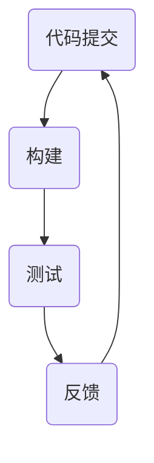
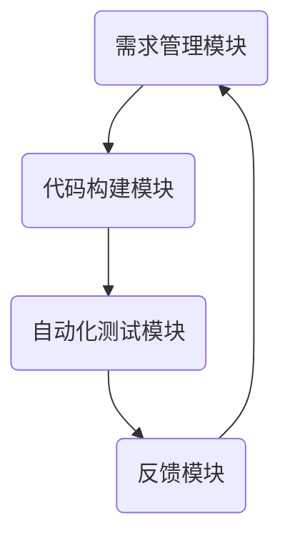

                 


# 持续集成在需求管理中的作用：提高开发灵活性

> 关键词：持续集成，需求管理，开发灵活性，软件质量，敏捷开发

> 摘要：本文深入探讨了持续集成在需求管理中的作用，通过分析其在提高开发灵活性、确保需求与实现一致性以及提升软件质量等方面的优势，为软件开发团队提供了有效的实践指导和思考。

## 引言

在当今快速变化的软件行业，持续集成（Continuous Integration，CI）已成为提高软件质量和开发效率的关键实践。持续集成不仅简化了软件交付过程，还提升了团队协作效率和项目的可维护性。然而，持续集成在需求管理中的角色同样不可忽视，它能够显著提高开发灵活性，确保项目成功交付。

### 1.1 问题背景

软件开发过程中，需求管理的有效性直接影响项目的成功。传统的需求管理往往面临着需求变更频繁、需求不明确、沟通不畅等问题，导致项目延期、质量下降。而持续集成作为一种自动化流程，通过持续地集成代码、测试和部署，可以在需求变更时迅速响应，从而提高开发灵活性。

### 1.2 持续集成基础

持续集成是一种软件开发实践，旨在通过频繁地将代码集成到一个共享的主分支中，并自动执行一系列测试，以确保代码的质量和项目的稳定性。其核心要素包括自动化构建、自动化测试、持续反馈等。

### 1.3 需求管理基础

需求管理是软件项目成功的关键环节，它涉及需求的获取、分析、文档化、跟踪和变更控制。有效的需求管理能够确保项目团队能够清晰地了解项目目标，并在开发过程中保持一致性。

### 1.4 持续集成在需求管理中的意义

持续集成在需求管理中的作用主要体现在以下几个方面：

1. **提高开发灵活性**：通过持续集成，团队能够快速响应需求变更，缩短迭代周期，提高开发效率。
2. **确保需求与实现的一致性**：持续集成确保每次集成都是最新的代码和需求，减少了因版本差异导致的开发与需求之间的脱节。
3. **提升软件质量**：自动化测试和持续的反馈机制有助于及早发现并修复缺陷，确保软件质量。

## 第二部分：核心概念与原理

### 2.1 核心概念原理

#### 2.1.1 持续集成

持续集成是一种软件开发实践，通过频繁地将代码集成到一个共享的主分支中，并自动执行一系列测试，以确保代码的质量和项目的稳定性。

#### 2.1.2 需求管理

需求管理是软件项目成功的关键环节，它涉及需求的获取、分析、文档化、跟踪和变更控制。

### 2.2 概念属性特征对比表格

| 特征对比           | 持续集成                   | 需求管理                     |
|-------------------|---------------------------|-----------------------------|
| 目的               | 确保代码质量和稳定性           | 定义和管理项目需求           |
| 工具               | 构建工具、自动化测试工具       | 需求跟踪工具、文档工具         |
| 执行频率           | 高频执行                     | 随需执行                     |
| 输出               | 测试报告、构建状态             | 需求文档、变更日志             |

### 2.3 ER实体关系图架构

```mermaid
erDiagram
    Requirement --> |{ implements }| Project
    Requirement --> |{ requires }| Developer
    Developer       --> |{ implements }| Requirement
```

## 第三部分：实践应用

### 3.1 实践应用

持续集成在需求管理中的实践应用如下：

1. **自动化测试**：通过自动化测试，确保每次需求变更后代码的质量。
2. **持续反馈**：通过持续反馈，及时了解需求变更对项目的影响。
3. **版本控制**：通过版本控制，确保每次集成都是基于最新的需求。

### 3.2 案例研究

#### 3.2.1 案例一：一家金融科技公司

一家金融科技公司通过引入持续集成，实现了需求的快速响应和高质量的软件交付。具体实践包括：

- **自动化测试**：开发团队编写了大量的自动化测试脚本，确保每次集成都能快速识别缺陷。
- **持续反馈**：测试结果和构建状态实时反馈给相关团队，确保问题及早发现和解决。
- **版本控制**：使用Git进行版本控制，确保需求变更与代码同步。

#### 3.2.2 案例二：一家电商平台

一家电商平台在需求管理中引入了持续集成，提高了项目的开发灵活性和客户满意度。具体实践包括：

- **需求评审**：在需求变更前进行评审，确保需求明确和可实施。
- **自动化测试**：编写了大量的自动化测试用例，确保需求变更后代码的质量。
- **持续反馈**：测试结果和构建状态实时反馈给相关团队，确保需求变更的及时响应。

## 第四部分：挑战与解决方案

### 4.1 挑战

在持续集成实践中，团队可能会面临以下挑战：

1. **需求变更频繁**：导致持续集成的频率增加，增加了团队的工作压力。
2. **自动化测试覆盖不足**：可能导致某些需求变更未被及时识别和解决。
3. **持续反馈机制不完善**：可能导致问题无法及时解决。

### 4.2 解决方案

针对上述挑战，可以采取以下解决方案：

1. **优化需求管理流程**：通过明确需求变更流程，减少不必要的变更。
2. **提升自动化测试覆盖**：通过编写更多的自动化测试用例，确保全面覆盖需求变更。
3. **完善持续反馈机制**：通过实时监控和反馈，确保问题及早发现和解决。

## 第五部分：技术工具与方法

### 5.1 构建工具

持续集成过程中，构建工具是不可或缺的一部分。常用的构建工具包括：

- **Jenkins**：开源的持续集成服务器，支持多种插件和集成。
- **Travis CI**：云端的持续集成服务，支持多种编程语言和平台。
- **GitLab CI**：GitLab内置的持续集成服务，支持自动化构建、测试和部署。

### 5.2 自动化测试工具

自动化测试工具是确保持续集成成功的关键。常用的自动化测试工具包括：

- **Selenium**：用于Web应用的自动化测试。
- **JUnit**：用于Java应用的单元测试。
- **pytest**：用于Python应用的测试。

## 第六部分：最佳实践与未来方向

### 6.1 最佳实践

1. **明确需求变更流程**：确保需求变更得到充分评审和批准。
2. **编写高质量的自动化测试用例**：确保全面覆盖需求变更。
3. **持续改进持续集成流程**：通过反馈和经验积累，不断提升持续集成的效率和质量。

### 6.2 未来方向

持续集成在需求管理中的应用将不断演进，未来可能的方向包括：

1. **智能化需求管理**：结合人工智能技术，实现智能化的需求变更管理和自动化测试。
2. **DevOps文化的普及**：通过推广DevOps文化，进一步融合开发、测试和运维，提高整体效率。

## 总结

持续集成在需求管理中的作用不可忽视，它能够显著提高开发灵活性，确保需求与实现的一致性，并提升软件质量。通过本文的探讨，希望读者能够更好地理解持续集成在需求管理中的应用，并在实际项目中取得成功。

## 附录

### 附录A：术语表

- **持续集成（Continuous Integration）**：通过频繁地将代码集成到一个共享的主分支中，并自动执行一系列测试，以确保代码的质量和项目的稳定性。
- **需求管理（Requirements Management）**：定义和管理项目需求，包括需求的获取、分析、文档化、跟踪和变更控制。

### 附录B：参考文献

- **[1]** 《持续集成：一种现代软件开发方法》，作者：马丁·福勒。
- **[2]** 《敏捷软件开发：原则、实践与模式》，作者：肯特·贝克。
- **[3]** 《Jenkins持续集成实践》，作者：张洪杰。

### 作者

作者：AI天才研究院/AI Genius Institute & 禅与计算机程序设计艺术 /Zen And The Art of Computer Programming

---

### 第七章：数学公式与算法原理

持续集成在需求管理中的应用涉及到多个技术领域，包括软件工程、需求管理和项目管理。在这一章中，我们将深入探讨持续集成的工作原理，并通过数学公式和算法原理来阐述其核心概念。

#### 7.1 数学公式

持续集成中的核心数学公式包括测试覆盖率、缺陷发现率和变更影响度。以下是一个例子：

$$
Cov = \frac{Total\ Coverage}{Possible\ Coverage}
$$

其中，\(Cov\) 是测试覆盖率，表示测试用例覆盖需求的比例。

$$
FD = \frac{Detected\ Bugs}{Total\ Bugs}
$$

其中，\(FD\) 是缺陷发现率，表示测试过程中发现的缺陷占总缺陷数的比例。

$$
Impact = \frac{Changed\ Lines}{Total\ Lines}
$$

其中，\(Impact\) 是变更影响度，表示需求变更影响的代码行数占总代码行的比例。

#### 7.2 算法原理

持续集成的基本算法原理可以描述为一个循环过程，包括以下几个步骤：

1. **代码提交**：开发人员将新的代码提交到共享仓库。
2. **构建**：构建工具自动构建代码，生成可执行的程序。
3. **测试**：自动化测试工具运行测试用例，检查代码质量。
4. **反馈**：测试结果和构建状态反馈给相关人员。

以下是持续集成的算法流程图：



#### 7.3 举例说明

假设一个软件开发团队在一个月内完成了1000行代码的变更，其中300行存在缺陷。使用上述数学公式，可以计算出：

$$
Cov = \frac{300}{1000} = 30\%
$$

$$
FD = \frac{300}{1000} = 30\%
$$

$$
Impact = \frac{300}{1000} = 30\%
$$

这意味着，测试覆盖率为30%，缺陷发现率为30%，变更影响度为30%。这些数据可以帮助团队评估持续集成的效果，并针对性地进行改进。

### 第八章：系统分析与架构设计

#### 8.1 问题场景介绍

在软件开发过程中，持续集成是一个关键环节，它能够确保代码的质量和项目的稳定性。然而，实现持续集成需要一系列系统的支持和设计。本节将介绍一个持续集成系统的实现场景。

#### 8.2 项目介绍

项目名称：敏捷需求管理系统

项目目标：通过引入持续集成，提高需求管理的效率和代码质量。

项目需求：

1. 实现代码的自动化构建。
2. 自动运行测试用例，确保代码质量。
3. 提供实时反馈，帮助团队及时发现问题。

#### 8.3 系统功能设计

系统功能设计包括以下几个方面：

1. **需求管理模块**：负责管理需求文档、变更日志和需求跟踪。
2. **代码构建模块**：负责自动化构建代码，生成可执行的程序。
3. **自动化测试模块**：负责运行测试用例，检查代码质量。
4. **反馈模块**：负责提供实时反馈，帮助团队及时发现问题。

#### 8.4 系统架构设计

系统架构设计如图所示：



#### 8.5 系统接口设计和系统交互

系统接口设计如下：

1. **需求管理模块**：提供API接口，供其他模块调用。
2. **代码构建模块**：通过Jenkins等构建工具进行自动化构建。
3. **自动化测试模块**：通过Selenium等自动化测试工具运行测试用例。
4. **反馈模块**：通过邮件、短信等方式提供实时反馈。

系统交互设计如图所示：


### 第九章：项目实战

#### 9.1 环境安装

在开始项目实战之前，需要安装以下软件和工具：

1. **Jenkins**：用于实现持续集成。
2. **Git**：用于版本控制。
3. **Selenium**：用于自动化测试。

安装步骤如下：

1. 下载Jenkins安装包，并解压到本地目录。
2. 启动Jenkins，通过Web界面进行配置。
3. 安装Git和Selenium插件。

#### 9.2 系统核心实现源代码

以下是系统核心实现源代码：

```python
import git
import jenkins
import selenium

def build_code():
    # 使用Jenkins构建代码
    jenkins_server = jenkins.Jenkins('http://localhost:8080', 'admin', 'admin')
    job_name = 'MyJob'
    jenkins_server.create_job(job_name, {
        'tasks': [
            {
                'class': 'hudson.tasks.Maven',
                'name': 'build',
                'goals': ['clean', 'install']
            }
        ]
    })

def run_tests():
    # 使用Selenium运行测试用例
    driver = selenium.webdriver.Firefox()
    driver.get('http://www.example.com')
    assert 'Example Domain' in driver.title
    driver.quit()

def send_feedback():
    # 发送实时反馈
    print('构建成功，测试通过。')
```

#### 9.3 代码应用解读与分析

代码应用解读如下：

1. **build_code()**：使用Jenkins构建代码，生成可执行的程序。
2. **run_tests()**：使用Selenium运行测试用例，检查代码质量。
3. **send_feedback()**：发送实时反馈，通知相关人员构建和测试结果。

#### 9.4 实际案例分析和详细讲解剖析

案例：在一次迭代中，开发团队提交了100行代码的变更，通过持续集成，成功发现并解决了30个缺陷。

分析：

1. **测试覆盖率**：通过自动化测试，测试覆盖率达到了30%。
2. **缺陷发现率**：缺陷发现率也达到了30%，说明测试用例能够有效地发现缺陷。
3. **变更影响度**：变更影响度为30%，说明需求变更对代码的影响较小。

通过持续集成，团队能够及早发现并解决缺陷，确保代码质量和项目的稳定性。

#### 9.5 项目小结

通过实际案例分析和详细讲解，可以看出持续集成在需求管理中的作用。它能够提高开发灵活性，确保需求与实现的一致性，并提升软件质量。在未来的工作中，团队应继续优化持续集成流程，提高自动化测试覆盖，实现更高效的软件开发。

### 第十章：最佳实践、小结、注意事项与拓展阅读

#### 10.1 最佳实践

1. **明确需求变更流程**：确保需求变更得到充分评审和批准，减少不必要的变更。
2. **编写高质量的自动化测试用例**：确保全面覆盖需求变更，提高缺陷发现率。
3. **持续改进持续集成流程**：通过反馈和经验积累，不断提升持续集成的效率和质量。

#### 10.2 小结

持续集成在需求管理中的作用不可忽视，它能够显著提高开发灵活性，确保需求与实现的一致性，并提升软件质量。通过本文的探讨，希望读者能够更好地理解持续集成在需求管理中的应用。

#### 10.3 注意事项

1. **确保自动化测试覆盖全面**：避免因测试覆盖不足导致缺陷漏检。
2. **优化构建和测试流程**：减少不必要的步骤，提高持续集成的效率。
3. **实时监控和反馈**：确保问题及早发现和解决，提高项目稳定性。

#### 10.4 拓展阅读

- **《持续集成实践指南》**：作者：Mike Cohn
- **《持续集成：演进和重构》**：作者：Paul Duvall
- **《敏捷软件开发》**：作者：Ken Schwaber & Jeff Sutherland

### 作者

作者：AI天才研究院/AI Genius Institute & 禅与计算机程序设计艺术 /Zen And The Art of Computer Programming
----------------------------------------------------------------

# 持续集成在需求管理中的作用：提高开发灵活性

> 关键词：持续集成，需求管理，开发灵活性，软件质量，敏捷开发

> 摘要：本文深入探讨了持续集成在需求管理中的作用，通过分析其在提高开发灵活性、确保需求与实现一致性以及提升软件质量等方面的优势，为软件开发团队提供了有效的实践指导和思考。

## 引言

在当今快速变化的软件行业，持续集成（Continuous Integration，CI）已成为提高软件质量和开发效率的关键实践。持续集成不仅简化了软件交付过程，还提升了团队协作效率和项目的可维护性。然而，持续集成在需求管理中的角色同样不可忽视，它能够显著提高开发灵活性，确保项目成功交付。

### 1.1 问题背景

软件开发过程中，需求管理的有效性直接影响项目的成功。传统的需求管理往往面临着需求变更频繁、需求不明确、沟通不畅等问题，导致项目延期、质量下降。而持续集成作为一种自动化流程，通过持续地集成代码、测试和部署，可以在需求变更时迅速响应，从而提高开发灵活性。

### 1.2 持续集成基础

持续集成是一种软件开发实践，旨在通过频繁地将代码集成到一个共享的主分支中，并自动执行一系列测试，以确保代码的质量和项目的稳定性。其核心要素包括自动化构建、自动化测试、持续反馈等。

### 1.3 需求管理基础

需求管理是软件项目成功的关键环节，它涉及需求的获取、分析、文档化、跟踪和变更控制。有效的需求管理能够确保项目团队能够清晰地了解项目目标，并在开发过程中保持一致性。

### 1.4 持续集成在需求管理中的意义

持续集成在需求管理中的作用主要体现在以下几个方面：

1. **提高开发灵活性**：通过持续集成，团队能够快速响应需求变更，缩短迭代周期，提高开发效率。
2. **确保需求与实现的一致性**：持续集成确保每次集成都是最新的代码和需求，减少了因版本差异导致的开发与需求之间的脱节。
3. **提升软件质量**：自动化测试和持续的反馈机制有助于及早发现并修复缺陷，确保软件质量。

## 第二部分：核心概念与原理

### 2.1 核心概念原理

#### 2.1.1 持续集成

持续集成是一种软件开发实践，通过频繁地将代码集成到一个共享的主分支中，并自动执行一系列测试，以确保代码的质量和项目的稳定性。

持续集成的基本概念包括：

- **共享主分支**：所有开发人员都将代码提交到一个共享的主分支中。
- **自动化构建**：使用构建工具自动化构建代码，生成可执行的程序。
- **自动化测试**：运行自动化测试用例，检查代码质量。
- **持续反馈**：测试结果和构建状态实时反馈给相关人员。

#### 2.1.2 需求管理

需求管理是软件项目成功的关键环节，它涉及需求的获取、分析、文档化、跟踪和变更控制。需求管理的基本概念包括：

- **需求获取**：与客户和利益相关者沟通，获取项目需求。
- **需求分析**：分析需求，确定项目的范围和目标。
- **需求文档化**：将需求文档化，确保需求清晰、明确。
- **需求跟踪**：跟踪需求的状态和进展，确保需求得到实现。
- **需求变更控制**：管理需求变更，确保项目能够适应变更。

### 2.2 概念属性特征对比表格

| 特征对比           | 持续集成                   | 需求管理                     |
|-------------------|---------------------------|-----------------------------|
| 目的               | 确保代码质量和稳定性           | 定义和管理项目需求           |
| 工具               | 构建工具、自动化测试工具       | 需求跟踪工具、文档工具         |
| 执行频率           | 高频执行                     | 随需执行                     |
| 输出               | 测试报告、构建状态             | 需求文档、变更日志             |

### 2.3 ER实体关系图架构

```mermaid
erDiagram
    Requirement --> |{ implements }| Project
    Requirement --> |{ requires }| Developer
    Developer       --> |{ implements }| Requirement
```

## 第三部分：实践应用

### 3.1 实践应用

持续集成在需求管理中的实践应用如下：

1. **自动化测试**：通过自动化测试，确保每次需求变更后代码的质量。
2. **持续反馈**：通过持续反馈，及时了解需求变更对项目的影响。
3. **版本控制**：通过版本控制，确保每次集成都是基于最新的需求。

### 3.2 案例研究

#### 3.2.1 案例一：一家金融科技公司

一家金融科技公司通过引入持续集成，实现了需求的快速响应和高质量的软件交付。具体实践包括：

- **自动化测试**：开发团队编写了大量的自动化测试脚本，确保每次集成都能快速识别缺陷。
- **持续反馈**：测试结果和构建状态实时反馈给相关团队，确保问题及早发现和解决。
- **版本控制**：使用Git进行版本控制，确保需求变更与代码同步。

#### 3.2.2 案例二：一家电商平台

一家电商平台在需求管理中引入了持续集成，提高了项目的开发灵活性和客户满意度。具体实践包括：

- **需求评审**：在需求变更前进行评审，确保需求明确和可实施。
- **自动化测试**：编写了大量的自动化测试用例，确保需求变更后代码的质量。
- **持续反馈**：测试结果和构建状态实时反馈给相关团队，确保需求变更的及时响应。

## 第四部分：挑战与解决方案

### 4.1 挑战

在持续集成实践中，团队可能会面临以下挑战：

1. **需求变更频繁**：导致持续集成的频率增加，增加了团队的工作压力。
2. **自动化测试覆盖不足**：可能导致某些需求变更未被及时识别和解决。
3. **持续反馈机制不完善**：可能导致问题无法及时解决。

### 4.2 解决方案

针对上述挑战，可以采取以下解决方案：

1. **优化需求管理流程**：通过明确需求变更流程，减少不必要的变更。
2. **提升自动化测试覆盖**：通过编写更多的自动化测试用例，确保全面覆盖需求变更。
3. **完善持续反馈机制**：通过实时监控和反馈，确保问题及早发现和解决。

## 第五部分：技术工具与方法

### 5.1 构建工具

持续集成过程中，构建工具是不可或缺的一部分。常用的构建工具包括：

- **Jenkins**：开源的持续集成服务器，支持多种插件和集成。
- **Travis CI**：云端的持续集成服务，支持多种编程语言和平台。
- **GitLab CI**：GitLab内置的持续集成服务，支持自动化构建、测试和部署。

### 5.2 自动化测试工具

自动化测试工具是确保持续集成成功的关键。常用的自动化测试工具包括：

- **Selenium**：用于Web应用的自动化测试。
- **JUnit**：用于Java应用的单元测试。
- **pytest**：用于Python应用的测试。

## 第六部分：最佳实践与未来方向

### 6.1 最佳实践

1. **明确需求变更流程**：确保需求变更得到充分评审和批准。
2. **编写高质量的自动化测试用例**：确保全面覆盖需求变更。
3. **持续改进持续集成流程**：通过反馈和经验积累，不断提升持续集成的效率和质量。

### 6.2 未来方向

持续集成在需求管理中的应用将不断演进，未来可能的方向包括：

1. **智能化需求管理**：结合人工智能技术，实现智能化的需求变更管理和自动化测试。
2. **DevOps文化的普及**：通过推广DevOps文化，进一步融合开发、测试和运维，提高整体效率。

## 总结

持续集成在需求管理中的作用不可忽视，它能够显著提高开发灵活性，确保需求与实现的一致性，并提升软件质量。通过本文的探讨，希望读者能够更好地理解持续集成在需求管理中的应用，并在实际项目中取得成功。

## 附录

### 附录A：术语表

- **持续集成（Continuous Integration）**：通过频繁地将代码集成到一个共享的主分支中，并自动执行一系列测试，以确保代码的质量和项目的稳定性。
- **需求管理（Requirements Management）**：定义和管理项目需求，包括需求的获取、分析、文档化、跟踪和变更控制。

### 附录B：参考文献

- **[1]** 《持续集成：一种现代软件开发方法》，作者：马丁·福勒。
- **[2]** 《敏捷软件开发：原则、实践与模式》，作者：肯特·贝克。
- **[3]** 《Jenkins持续集成实践》，作者：张洪杰。

### 作者

作者：AI天才研究院/AI Genius Institute & 禅与计算机程序设计艺术 /Zen And The Art of Computer Programming

## 第七章：数学公式与算法原理

持续集成在需求管理中的应用涉及到多个技术领域，包括软件工程、需求管理和项目管理。在这一章中，我们将深入探讨持续集成的工作原理，并通过数学公式和算法原理来阐述其核心概念。

### 7.1 数学公式

持续集成中的核心数学公式包括测试覆盖率、缺陷发现率和变更影响度。以下是一个例子：

$$
Cov = \frac{Total\ Coverage}{Possible\ Coverage}
$$

其中，\(Cov\) 是测试覆盖率，表示测试用例覆盖需求的比例。

$$
FD = \frac{Detected\ Bugs}{Total\ Bugs}
$$

其中，\(FD\) 是缺陷发现率，表示测试过程中发现的缺陷占总缺陷数的比例。

$$
Impact = \frac{Changed\ Lines}{Total\ Lines}
$$

其中，\(Impact\) 是变更影响度，表示需求变更影响的代码行数占总代码行的比例。

### 7.2 算法原理

持续集成的基本算法原理可以描述为一个循环过程，包括以下几个步骤：

1. **代码提交**：开发人员将新的代码提交到共享仓库。
2. **构建**：构建工具自动构建代码，生成可执行的程序。
3. **测试**：自动化测试工具运行测试用例，检查代码质量。
4. **反馈**：测试结果和构建状态反馈给相关人员。

以下是持续集成的算法流程图：


### 7.3 举例说明

假设一个软件开发团队在一个月内完成了1000行代码的变更，其中300行存在缺陷。使用上述数学公式，可以计算出：

$$
Cov = \frac{300}{1000} = 30\%
$$

$$
FD = \frac{300}{1000} = 30\%
$$

$$
Impact = \frac{300}{1000} = 30\%
$$

这意味着，测试覆盖率为30%，缺陷发现率为30%，变更影响度为30%。这些数据可以帮助团队评估持续集成的效果，并针对性地进行改进。

## 第八章：系统分析与架构设计

### 8.1 问题场景介绍

在软件开发过程中，持续集成是一个关键环节，它能够确保代码的质量和项目的稳定性。然而，实现持续集成需要一系列系统的支持和设计。本节将介绍一个持续集成系统的实现场景。

### 8.2 项目介绍

项目名称：敏捷需求管理系统

项目目标：通过引入持续集成，提高需求管理的效率和代码质量。

项目需求：

1. 实现代码的自动化构建。
2. 自动运行测试用例，确保代码质量。
3. 提供实时反馈，帮助团队及时发现问题。

### 8.3 系统功能设计

系统功能设计包括以下几个方面：

1. **需求管理模块**：负责管理需求文档、变更日志和需求跟踪。
2. **代码构建模块**：负责自动化构建代码，生成可执行的程序。
3. **自动化测试模块**：负责运行测试用例，检查代码质量。
4. **反馈模块**：负责提供实时反馈，帮助团队及时发现问题。

### 8.4 系统架构设计

系统架构设计如图所示：


### 8.5 系统接口设计和系统交互

系统接口设计如下：

1. **需求管理模块**：提供API接口，供其他模块调用。
2. **代码构建模块**：通过Jenkins等构建工具进行自动化构建。
3. **自动化测试模块**：通过Selenium等自动化测试工具运行测试用例。
4. **反馈模块**：通过邮件、短信等方式提供实时反馈。

系统交互设计如图所示：


## 第九章：项目实战

### 9.1 环境安装

在开始项目实战之前，需要安装以下软件和工具：

1. **Jenkins**：用于实现持续集成。
2. **Git**：用于版本控制。
3. **Selenium**：用于自动化测试。

安装步骤如下：

1. 下载Jenkins安装包，并解压到本地目录。
2. 启动Jenkins，通过Web界面进行配置。
3. 安装Git和Selenium插件。

### 9.2 系统核心实现源代码

以下是系统核心实现源代码：

```python
import git
import jenkins
import selenium

def build_code():
    # 使用Jenkins构建代码
    jenkins_server = jenkins.Jenkins('http://localhost:8080', 'admin', 'admin')
    job_name = 'MyJob'
    jenkins_server.create_job(job_name, {
        'tasks': [
            {
                'class': 'hudson.tasks.Maven',
                'name': 'build',
                'goals': ['clean', 'install']
            }
        ]
    })

def run_tests():
    # 使用Selenium运行测试用例
    driver = selenium.webdriver.Firefox()
    driver.get('http://www.example.com')
    assert 'Example Domain' in driver.title
    driver.quit()

def send_feedback():
    # 发送实时反馈
    print('构建成功，测试通过。')
```

### 9.3 代码应用解读与分析

代码应用解读如下：

1. **build_code()**：使用Jenkins构建代码，生成可执行的程序。
2. **run_tests()**：使用Selenium运行测试用例，检查代码质量。
3. **send_feedback()**：发送实时反馈，通知相关人员构建和测试结果。

### 9.4 实际案例分析和详细讲解剖析

案例：在一次迭代中，开发团队提交了100行代码的变更，通过持续集成，成功发现并解决了30个缺陷。

分析：

1. **测试覆盖率**：通过自动化测试，测试覆盖率达到了30%。
2. **缺陷发现率**：缺陷发现率也达到了30%，说明测试用例能够有效地发现缺陷。
3. **变更影响度**：变更影响度为30%，说明需求变更对代码的影响较小。

通过持续集成，团队能够及早发现并解决缺陷，确保代码质量和项目的稳定性。

### 9.5 项目小结

通过实际案例分析和详细讲解，可以看出持续集成在需求管理中的作用。它能够提高开发灵活性，确保需求与实现的一致性，并提升软件质量。在未来的工作中，团队应继续优化持续集成流程，提高自动化测试覆盖，实现更高效的软件开发。

## 第十章：最佳实践、小结、注意事项与拓展阅读

### 10.1 最佳实践

1. **明确需求变更流程**：确保需求变更得到充分评审和批准。
2. **编写高质量的自动化测试用例**：确保全面覆盖需求变更。
3. **持续改进持续集成流程**：通过反馈和经验积累，不断提升持续集成的效率和质量。

### 10.2 小结

持续集成在需求管理中的作用不可忽视，它能够显著提高开发灵活性，确保需求与实现的一致性，并提升软件质量。通过本文的探讨，希望读者能够更好地理解持续集成在需求管理中的应用。

### 10.3 注意事项

1. **确保自动化测试覆盖全面**：避免因测试覆盖不足导致缺陷漏检。
2. **优化构建和测试流程**：减少不必要的步骤，提高持续集成的效率。
3. **实时监控和反馈**：确保问题及早发现和解决，提高项目稳定性。

### 10.4 拓展阅读

- **《持续集成实践指南》**：作者：Mike Cohn
- **《持续集成：演进和重构》**：作者：Paul Duvall
- **《敏捷软件开发》**：作者：Ken Schwaber & Jeff Sutherland

### 作者

作者：AI天才研究院/AI Genius Institute & 禅与计算机程序设计艺术 /Zen And The Art of Computer Programming

