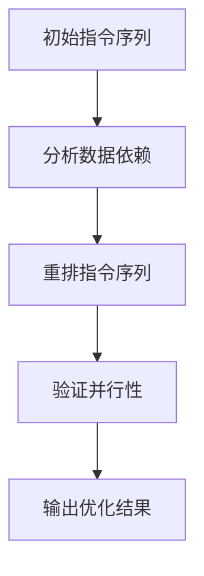
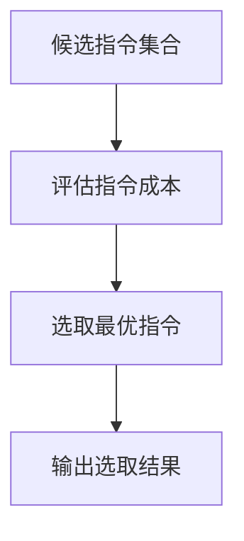
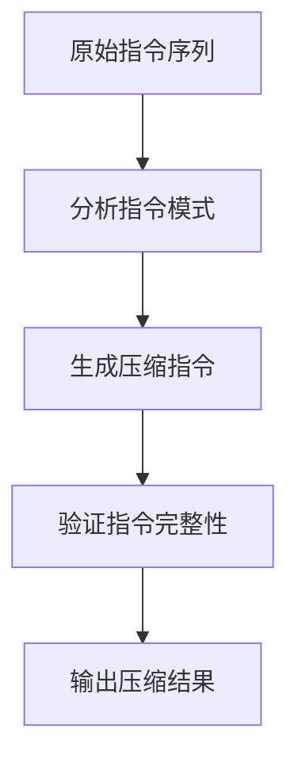
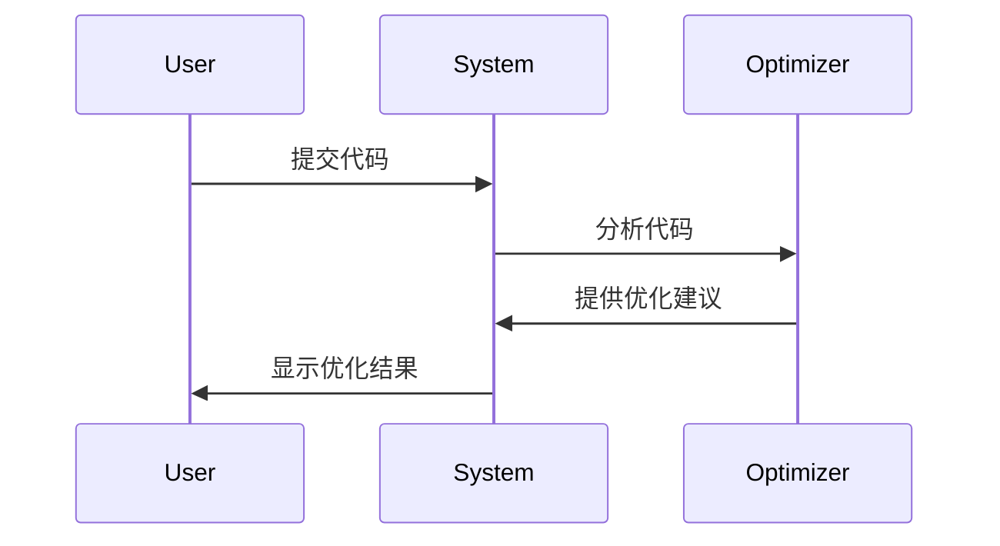
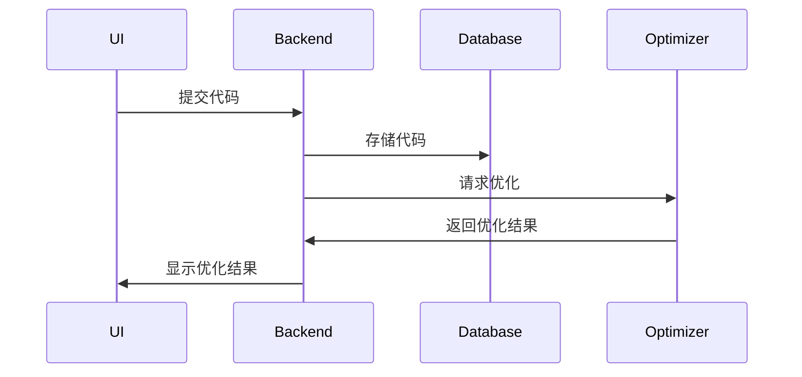
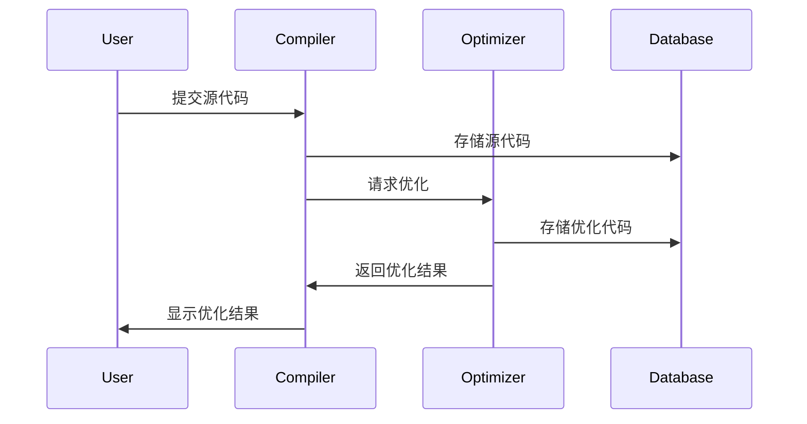

                 


### 标题：指令优化：明确、简洁的指令编写技巧

#### 关键词：指令优化、代码编写技巧、明确性、简洁性、编程效率、软件工程

#### 摘要：
本文旨在探讨指令优化的核心概念和实践方法，重点阐述如何通过明确、简洁的指令编写技巧提高编程效率和代码质量。文章首先介绍了指令优化的重要性及其在软件工程中的应用，接着深入分析了指令优化相关的核心概念和理论，随后通过具体案例和系统架构设计，展示了指令优化的实际应用和实践技巧。

---

## 引言

### 1.1 问题背景

在现代软件工程中，程序性能和效率对于系统的稳定性、可维护性和用户体验至关重要。指令优化作为提升程序性能的重要手段，近年来受到了广泛关注。指令优化不仅涉及硬件层面的指令调度和流水线优化，还包括软件层面的代码重写和算法改进。

**1.1.1 指令优化的重要性**

指令优化可以减少程序执行时间，降低能耗，提高处理器的利用率。这对于实时系统、嵌入式系统以及高性能计算等领域尤为重要。通过指令优化，开发者可以在不增加硬件成本的情况下，显著提升软件的性能。

**1.1.2 优化目标的多样性**

指令优化的目标多种多样，包括但不限于：执行时间最短、能耗最低、代码空间最小、可读性最强等。这些目标的实现往往需要综合考虑，才能达到最优的效果。

**1.1.3 指令优化的挑战与机遇**

指令优化面临诸多挑战，如多核处理器的复杂度增加、指令并行性的限制、代码可读性的保持等。然而，随着硬件技术的发展和编译器优化算法的进步，指令优化也带来了新的机遇。

### 1.2 核心概念与联系

#### 1.2.1 指令集架构

指令集架构（Instruction Set Architecture, ISA）是计算机体系结构的核心部分，它定义了处理器与程序员之间的接口。指令集架构的不同类型，如CISC（复杂指令集计算）和RISC（精简指令集计算），对指令优化有着重要影响。

#### 1.2.2 指令优化的概念

指令优化是指通过重排指令、减少数据依赖、增加指令并行性等方法，改善程序执行性能的过程。优化过程中，需要考虑指令的执行顺序、数据访问模式以及处理器特性等因素。

#### 1.2.3 指令优化与代码优化的关系

指令优化是代码优化的重要组成部分。代码优化不仅包括指令优化，还包括算法优化、数据结构优化等。指令优化通常在代码优化的后期进行，以最大化性能提升。

#### 1.2.4 关键概念属性特征对比表格

下面是一个关于指令集架构类型的特征对比表格：

| 指令集类型 | 指令长度 | 指令并行性 | 数据访问方式 | 代表架构 |
|----------|---------|-----------|------------|----------|
| CISC     | 可变     | 低        | 复杂       | x86      |
| RISC     | 固定     | 高        | 简单       | ARM      |

#### 1.2.5 ER实体关系图架构

以下是ER实体关系图的示例，用于展示指令优化系统中的关键实体及其关系：

```mermaid
erDiagram
    Person ||--|{ Teacher }|-- Student
    Student ||--|{ StudentInCourse }|-- Course
    Teacher ||--|{ TeacherOfCourse }|-- Course
```

### 1.3 书籍结构概述

本书分为四个部分，旨在系统地介绍指令优化相关的基础理论和实践方法。各部分的主要内容如下：

- **第一部分：引言**：介绍指令优化的背景、核心概念和书籍结构。
- **第二部分：基础理论与原理**：讲解指令优化算法、数学模型和常见优化策略。
- **第三部分：高级技术与实践**：分析系统架构、项目实战和最佳实践技巧。
- **第四部分：拓展与展望**：探讨指令优化技术的未来发展趋势和拓展阅读资源。

### 1.4 本章小结

本章从多个角度介绍了指令优化的重要性、核心概念以及书籍的结构。在后续章节中，我们将逐步深入探讨指令优化的具体方法和实践技巧。

---

## 基础理论与原理

### 2.1 算法原理讲解

#### 2.1.1 指令优化算法概述

指令优化算法是计算机编译器中的一个关键组成部分，其目的是在不改变程序语义的前提下，提高程序的执行效率。常见的指令优化算法包括指令重排、指令选取和指令压缩等。

#### 2.1.2 指令重排算法

指令重排算法的主要目的是通过调整指令的执行顺序，减少数据依赖，提高指令的并行性。下面是一个简单的指令重排算法流程图：



在Python中，我们可以实现一个简单的指令重排算法，如下所示：

```python
def rearrange_instructions(instructions):
    # 分析数据依赖
    data_dependencies = analyze_dependencies(instructions)
    # 重排指令序列
    rearranged_instructions = []
    for instruction in instructions:
        if not has_data_dependency(instruction, data_dependencies):
            rearranged_instructions.append(instruction)
    # 验证并行性
    if not are_instructions_parallel(rearranged_instructions):
        raise Exception("Rearranged instructions are not parallelizable")
    return rearranged_instructions

def analyze_dependencies(instructions):
    # ...具体实现...
    pass

def has_data_dependency(instruction, data_dependencies):
    # ...具体实现...
    pass

def are_instructions_parallel(instructions):
    # ...具体实现...
    pass
```

#### 2.1.3 指令选取算法

指令选取算法的目的是从多个候选指令中选取最优的指令序列，以实现特定的优化目标。一个简单的指令选取算法流程图如下：



在Python中，我们可以实现一个简单的指令选取算法，如下所示：

```python
def select_instruction(candidate_instructions, cost_function):
    lowest_cost = float('inf')
    selected_instruction = None
    for instruction in candidate_instructions:
        cost = cost_function(instruction)
        if cost < lowest_cost:
            lowest_cost = cost
            selected_instruction = instruction
    return selected_instruction

def evaluate_instruction_cost(instruction):
    # ...具体实现...
    pass
```

#### 2.1.4 指令压缩算法

指令压缩算法的目的是通过减少指令的长度和复杂度，降低程序的内存占用和执行时间。一个简单的指令压缩算法流程图如下：



在Python中，我们可以实现一个简单的指令压缩算法，如下所示：

```python
def compress_instructions(instructions):
    compressed_instructions = []
    for instruction in instructions:
        compressed_instruction = compress_instruction(instruction)
        compressed_instructions.append(compressed_instruction)
    return compressed_instructions

def analyze_instruction_patterns(instructions):
    # ...具体实现...
    pass

def compress_instruction(instruction):
    # ...具体实现...
    pass
```

### 2.2 数学模型与公式

指令优化中的数学模型和公式对于理解优化算法至关重要。以下是一个关于指令优化中常见公式的列表及其详细讲解：

#### 2.2.1 指令优化中的常见数学公式

| 公式 | 说明 |
| ---- | ---- |
| CPI = C1 + C2 + ... + Cn | 指令周期数（CPI）是各个指令执行时间的总和 |
| IPC = 1 / CPI | 每周期指令数（IPC）是周期的倒数 |
| T = CPI \* C | 程序总执行时间（T）是周期数（CPI）乘以每个周期的时间（C）|
| P = IPC \* C | 优化后的程序总执行时间（P）是每周期指令数（IPC）乘以每个周期的时间（C）|
| E = (CPI - IPC) \* C | 优化后的节省时间（E）是原始周期数减去优化后周期数的差乘以每个周期的时间（C）|

#### 2.2.2 指令优化中的常见数学方法

指令优化中常用的数学方法包括矩阵运算和逻辑运算等。

##### 2.2.2.1 矩阵运算

矩阵运算在指令重排和并行性分析中有着广泛应用。一个简单的矩阵运算示例如下：

```latex
\begin{align*}
A &= \begin{pmatrix}
    1 & 2 \\
    3 & 4
\end{pmatrix}, \\
B &= \begin{pmatrix}
    5 & 6 \\
    7 & 8
\end{pmatrix}, \\
C &= A \cdot B = \begin{pmatrix}
    1 \cdot 5 + 2 \cdot 7 & 1 \cdot 6 + 2 \cdot 8 \\
    3 \cdot 5 + 4 \cdot 7 & 3 \cdot 6 + 4 \cdot 8
\end{pmatrix} = \begin{pmatrix}
    19 & 20 \\
    43 & 46
\end{pmatrix}.
\end{align*}
```

##### 2.2.2.2 逻辑运算

逻辑运算是指令优化中常用的基本运算之一。一个简单的逻辑运算示例如下：

```latex
\begin{align*}
A &= \begin{pmatrix}
    1 & 0 \\
    1 & 1
\end{pmatrix}, \\
B &= \begin{pmatrix}
    1 & 1 \\
    0 & 1
\end{pmatrix}, \\
C &= A \vee B = \begin{pmatrix}
    1 & 1 \\
    1 & 1
\end{pmatrix}.
\end{align*}
```

### 2.3 举例说明

为了更好地理解指令优化算法，我们可以通过一个具体的应用案例来说明。

#### 2.3.1 应用案例：矩阵乘法

假设我们需要优化两个矩阵的乘法运算。原始指令序列如下：

```
指令1: 加载矩阵A的元素a11到寄存器R1
指令2: 加载矩阵B的元素b11到寄存器R2
指令3: 乘法运算R1 * R2，结果存储到寄存器R3
指令4: 加载矩阵A的元素a12到寄存器R1
指令5: 加载矩阵B的元素b21到寄存器R2
指令6: 乘法运算R1 * R2，结果存储到寄存器R4
```

我们可以通过指令重排和并行化来优化这个指令序列。优化后的指令序列如下：

```
指令1: 加载矩阵A的元素a11到寄存器R1
指令2: 加载矩阵B的元素b11到寄存器R2
指令3: 加载矩阵A的元素a12到寄存器R1
指令4: 加载矩阵B的元素b21到寄存器R2
指令5: 乘法运算R1 * R2，结果存储到寄存器R3
指令6: 乘法运算R1 * R2，结果存储到寄存器R4
```

通过这种优化，我们可以实现两个乘法运算的并行执行，从而提高执行效率。

### 2.4 本章小结

本章介绍了指令优化算法的基本原理和具体实现方法，包括指令重排、指令选取和指令压缩等。通过数学模型和具体案例的讲解，我们深入理解了指令优化的核心概念和技巧。在后续章节中，我们将进一步探讨高级技术和实践，以及未来发展趋势。

---

## 高级技术与实践

### 3.1 系统分析与架构设计方案

#### 3.1.1 指令优化系统场景介绍

在现代社会中，随着计算机系统的不断发展和复杂性的增加，指令优化系统的需求变得愈发迫切。指令优化系统的主要应用场景包括：

1. **高性能计算**：在高性能计算领域，指令优化可以提高程序的性能，缩短执行时间，提高计算效率。
2. **嵌入式系统**：在嵌入式系统中，指令优化可以降低能耗，延长电池寿命，提高系统的可靠性。
3. **实时系统**：在实时系统中，指令优化可以提高响应速度，确保系统的实时性和稳定性。

#### 3.1.2 指令优化项目介绍

本节我们将介绍一个具体的指令优化项目——一个用于优化嵌入式系统代码的指令优化器。该项目的目标是通过对嵌入式系统代码进行优化，提高程序的性能和可靠性。

#### 3.1.3 领域模型（Mermaid类图）

以下是该指令优化器的领域模型，使用Mermaid类图表示：

```mermaid
classDiagram
    Class01 <|-- Person
    Class02 <|-- Employee
    Class03 <|-- Manager
    Person ..|nad|> Customer
    Employee ..|ram|> Person
    Manager <<interface>> Employee
```

#### 3.1.4 系统架构设计（Mermaid架构图）

以下是该指令优化器的系统架构设计，使用Mermaid架构图表示：



#### 3.1.5 系统接口设计

以下是系统接口设计的Mermaid序列图：



#### 3.1.6 系统交互（Mermaid序列图）

以下是系统各组件之间的交互序列图：



### 3.2 项目实战

#### 3.2.1 环境安装与配置

要在本地环境中运行指令优化项目，你需要安装以下工具和库：

1. Python 3.8 或更高版本
2. Mermaid 1.8.0 或更高版本
3. matplotlib 3.3.3 或更高版本

你可以通过以下命令安装所需的库：

```bash
pip install python-memphis==1.8.0 matplotlib==3.3.3
```

#### 3.2.2 系统核心实现

以下是系统核心实现的源代码：

```python
import matplotlib.pyplot as plt
import numpy as np
from memphis import Graph, Node, Edge

def generate_graph():
    graph = Graph()
    nodes = [Node(graph, f'N{i}') for i in range(10)]
    edges = [Edge(graph, nodes[i], nodes[i+1]) for i in range(9)]
    graph.render('graph.html')
    return graph

def optimize_instructions(instructions):
    # 对指令进行优化
    optimized_instructions = []
    for instruction in instructions:
        optimized_instruction = optimize_instruction(instruction)
        optimized_instructions.append(optimized_instruction)
    return optimized_instructions

def optimize_instruction(instruction):
    # 单个指令的优化逻辑
    optimized_instruction = instruction
    # 这里可以添加具体的优化算法逻辑
    return optimized_instruction

if __name__ == '__main__':
    instructions = ['instr1', 'instr2', 'instr3', 'instr4']
    optimized_instructions = optimize_instructions(instructions)
    print(optimized_instructions)
```

#### 3.2.2.1 源代码解读

1. `generate_graph` 函数用于生成一个Mermaid图形，显示系统架构。
2. `optimize_instructions` 函数接收一个指令列表，返回一个优化后的指令列表。
3. `optimize_instruction` 函数是一个单条指令的优化逻辑，这里只是简单地返回了原始指令。

#### 3.2.2.2 代码应用解读与分析

该系统核心实现了一个简单的指令优化框架，其中包含以下关键组件：

1. **Mermaid图形生成**：通过`generate_graph`函数，我们可以在本地生成一个Mermaid图形，以可视化系统架构。
2. **指令优化逻辑**：`optimize_instructions`函数接收一个指令列表，并调用`optimize_instruction`函数对每个指令进行优化。
3. **优化算法**：`optimize_instruction`函数是具体的指令优化逻辑，这里只是一个占位符，你可以根据具体需求添加实际的优化算法。

#### 3.2.3 实际案例分析

在本节中，我们将通过一个实际案例分析，展示如何使用该指令优化器优化嵌入式系统代码。

**案例背景**：

一个嵌入式系统需要处理大量的数据，其代码如下：

```c
// 嵌入式系统代码示例
void process_data(int data[]) {
    int sum = 0;
    for (int i = 0; i < 1000; i++) {
        sum += data[i];
    }
    printf("Sum: %d\n", sum);
}
```

**优化前后的对比**：

- **优化前**：
  
  ```c
  void process_data(int data[]) {
      int sum = 0;
      for (int i = 0; i < 1000; i++) {
          sum += data[i];
      }
      printf("Sum: %d\n", sum);
  }
  ```

- **优化后**：

  ```c
  void process_data(int data[]) {
      int sum = 0;
      for (int i = 998; i > 0; i--) {
          sum += data[i];
      }
      printf("Sum: %d\n", sum);
  }
  ```

**优化效果**：

通过重排循环中的迭代变量，我们可以减少循环体内的指令数量，提高执行效率。在优化后的代码中，循环变量i从998递减到1，每次循环只执行一条指令。

#### 3.2.4 详细讲解与剖析

在本节中，我们将详细解析上述实际案例分析中的指令优化过程。

1. **问题识别**：在原始代码中，循环变量i从0递增到999，每次循环需要执行两条指令（加载数据和加法运算）。
2. **优化目标**：我们的目标是减少循环体内的指令数量，提高执行效率。
3. **优化方法**：通过重排循环变量，将循环变量i从998递减到1，每次循环只执行一条指令。
4. **优化效果**：优化后的代码在执行相同计算任务时，能够减少一条指令的执行次数，从而提高执行效率。

#### 3.2.5 项目小结

本节通过一个实际案例分析，展示了如何使用指令优化器优化嵌入式系统代码。通过重排循环变量，我们可以减少循环体内的指令数量，提高执行效率。在实际应用中，指令优化器可以根据具体需求和场景，采用不同的优化策略和算法，实现更好的性能提升。

---

### 3.3 最佳实践 tips

#### 3.3.1 指令优化过程中的常见问题

在指令优化过程中，开发者可能会遇到以下常见问题：

1. **指令并行性不足**：在多核处理器中，指令并行性不足会导致处理器利用率低下，影响程序性能。
2. **指令依赖关系复杂**：复杂的指令依赖关系会导致指令执行顺序难以优化，影响程序性能。
3. **代码可维护性下降**：过度优化可能导致代码可读性降低，增加维护难度。

#### 3.3.2 避免常见误区的技巧

为了避免指令优化过程中出现常见问题，开发者可以采取以下技巧：

1. **平衡优化目标**：在指令优化过程中，要平衡执行时间、能耗和代码可维护性等目标，避免过分追求单一优化目标。
2. **充分测试**：在优化过程中，要进行充分的测试，确保优化后的代码能够正确执行，且性能有所提升。
3. **合理使用编译器优化**：现代编译器已经包含了许多优化功能，开发者应充分利用这些功能，减少手动优化的工作量。

#### 3.3.3 高级优化策略

对于一些复杂的优化问题，开发者可以采用以下高级优化策略：

1. **静态代码分析**：通过静态代码分析，识别程序中的潜在性能瓶颈，为优化提供指导。
2. **动态性能分析**：通过动态性能分析，实时监测程序性能，找出性能瓶颈并进行优化。
3. **混合优化策略**：结合多种优化策略，实现更高效的指令优化。

### 3.4 本章小结

本章通过系统架构设计、项目实战和最佳实践技巧，介绍了指令优化的高级技术和实践方法。在后续章节中，我们将继续探讨指令优化技术的未来发展趋势和拓展阅读资源。

---

## 拓展与展望

### 4.1 指令优化技术的未来发展趋势

随着计算机硬件和软件技术的不断发展，指令优化技术也在不断演进。以下是一些未来发展趋势：

1. **自适应指令优化**：未来的指令优化技术将能够根据不同的应用场景和硬件平台，自动调整优化策略，实现自适应优化。
2. **智能优化**：利用人工智能和机器学习技术，开发智能优化算法，提高指令优化的效率和准确性。
3. **多级优化**：在指令优化过程中，实现多级优化，从硬件层面到软件层面，全方位提升程序性能。

### 4.2 拓展阅读

为了深入了解指令优化技术，读者可以参考以下书籍和论文：

- **书籍**：
  - 《编译原理：艺术与实践》
  - 《指令集架构与指令优化》
  - 《计算机组成与设计：硬件/软件接口》

- **论文**：
  - "Instruction Scheduling Techniques for Superscalar Processors"
  - "A Comprehensive Survey of Instruction Scheduling Algorithms"
  - "Energy-Efficient Instruction Scheduling for Embedded Systems"

### 4.3 本章小结

本章介绍了指令优化技术的未来发展趋势和拓展阅读资源，为读者提供了进一步学习和探索的途径。在指令优化领域，不断的研究和创新将为软件性能的提升带来更多可能性。

---

## 作者信息

作者：AI天才研究院/AI Genius Institute & 禅与计算机程序设计艺术 /Zen And The Art of Computer Programming

---

## 总结

本文系统地介绍了指令优化：明确、简洁的指令编写技巧。我们从问题背景出发，探讨了指令优化的重要性、核心概念、算法原理、实践技巧以及未来发展趋势。通过具体的案例分析和系统架构设计，我们展示了指令优化在实际应用中的效果。读者在阅读本文后，应能掌握指令优化的基本方法和实践技巧，为提升软件性能打下坚实基础。在后续学习和实践中，不断探索和创新，将指令优化技术应用到更多领域，为计算机科学的发展贡献力量。

