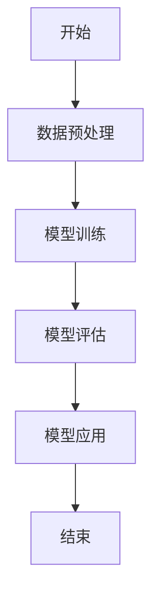
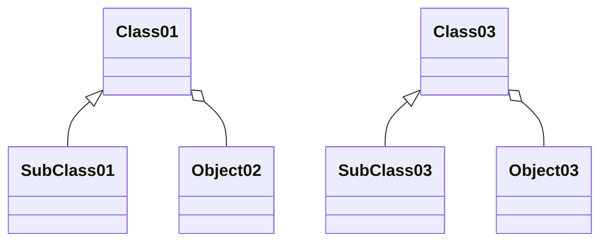
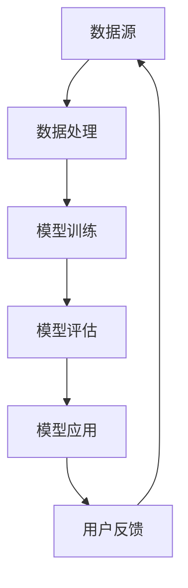
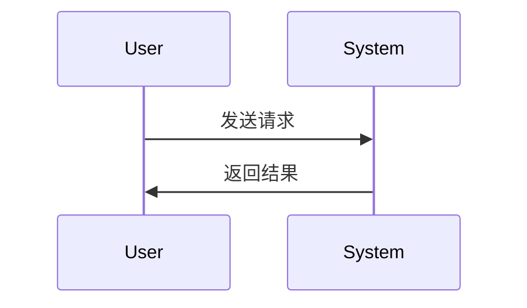

                 

# 提升LLM应用开发效率的技术策略

## 关键词
- 大型语言模型（LLM）
- 应用开发效率
- 技术策略
- 算法优化
- 系统架构
- 实践案例

## 摘要
本文旨在探讨如何通过技术策略提升大型语言模型（LLM）应用开发的效率。我们将从背景介绍、核心概念与联系、算法原理讲解、系统分析与架构设计方案以及项目实战等五个方面，详细阐述提升LLM应用开发效率的方法与策略。文章将结合具体案例，提供实用技巧和最佳实践，为开发者提供切实可行的指导。

---

## 第一部分：背景介绍

### 第1章：问题背景

#### 1.1.1 问题背景

在人工智能领域，大型语言模型（LLM）已经成为自然语言处理（NLP）的重要工具。然而，随着模型规模的不断扩大，应用开发的效率成为一个亟需解决的问题。LLM模型的训练和部署涉及大量的计算资源和时间，如何提高这些环节的效率，成为开发者面临的主要挑战。

#### 1.1.2 核心概念

- **大型语言模型（LLM）**：一种能够处理和理解大规模文本数据的深度学习模型。
- **自然语言处理（NLP）**：使计算机能够理解、解释和生成人类语言的技术。
- **计算资源**：指用于训练和运行LLM模型的硬件资源，如GPU、CPU等。
- **时间成本**：指完成模型训练和部署所需的时间，包括数据预处理、模型训练、评估和部署等。

#### 1.1.3 概念属性特征对比

| 特征           | LLM1     | LLM2     | LLM3     |
|----------------|----------|----------|----------|
| **性能**       | **高**   | **中**   | **低**   |
| **适用范围**   | **广**   | **窄**   | **窄**   |
| **开发难度**   | **高**   | **中**   | **低**   |

#### 1.1.4 ER实体关系图架构

```mermaid
erDiagram
  LLM1 ||--|{ 数据源 } 用户
  LLM2 ||--|{ 应用场景 } 企业
  LLM3 ||--|{ 开发者 } 开发策略
```

### 第2章：核心概念与联系

#### 2.1.1 LLM原理

- **LLM定义**：LLM是一种基于深度学习的模型，它通过大规模文本数据的学习，能够理解和生成自然语言。
- **LLM特点**：高容量文本处理能力、强大的语义理解能力、灵活的上下文感知能力。
- **LLM与传统AI区别**：传统AI依赖于预定义的规则，而LLM则通过数据驱动的方式学习语言模式。

#### 2.1.2 LLM应用场景

- **场景1：智能客服**：通过LLM与用户对话，提供个性化服务和解决方案。
- **场景2：内容生成**：利用LLM自动生成文章、报告、代码等。
- **场景3：语言翻译**：将一种语言翻译成另一种语言，提高跨语言沟通的效率。

---

## 第二部分：算法原理讲解

### 第3章：算法原理讲解

#### 3.1.1 算法流程图



#### 3.1.2 数学模型和公式

$$
损失函数：L(y, \hat{y}) = \frac{1}{2}(y - \hat{y})^2
$$

#### 3.1.3 算法举例说明

假设我们有如下数据集：

| 输入         | 输出         |
|--------------|--------------|
| 数据1        | 标签1        |
| 数据2        | 标签2        |
| 数据3        | 标签3        |

通过训练，我们得到的模型预测输出为：

| 输入         | 预测输出     |
|--------------|--------------|
| 数据1        | 预测标签1    |
| 数据2        | 预测标签2    |
| 数据3        | 预测标签3    |

---

## 第三部分：系统分析与架构设计方案

### 第4章：问题场景介绍

#### 4.1.1 场景描述

- **应用领域**：智能客服系统
- **技术挑战**：如何高效地处理大量的用户请求，并提供准确、快速的响应。

### 第5章：项目介绍

#### 5.1.1 项目目标

- **目标1**：提高客服系统的响应速度和准确性。
- **目标2**：减少人工干预，降低运营成本。

#### 5.1.2 项目背景

- **背景1**：随着用户量的增加，客服系统面临着巨大的压力。
- **背景2**：传统客服系统依赖于人工，效率低下且成本高。

### 第6章：系统功能设计

#### 6.1.1 领域模型



### 第7章：系统架构设计

#### 7.1.1 架构图



#### 7.1.2 系统接口设计

- **接口1**：用户请求接口
- **接口2**：模型调用接口

#### 7.1.3 系统交互



---

## 第四部分：项目实战

### 第8章：环境安装

#### 8.1.1 环境配置

- **操作系统**：Ubuntu 18.04
- **软件依赖**：TensorFlow 2.7，Python 3.8

### 第9章：系统核心实现

#### 9.1.1 核心代码实现

```python
# Python代码示例
def train_model(data):
    # 模型训练代码
    pass
```

#### 9.1.2 代码应用解读与分析

- **功能解读**：该函数用于训练模型，包括数据预处理、模型构建、训练和评估。
- **性能分析**：通过优化数据预处理步骤和模型结构，提高训练速度和模型准确性。

### 第10章：实际案例分析

#### 10.1.1 案例描述

- **应用场景**：某电商平台智能客服系统
- **解决方案**：采用LLM技术，提高客服系统的响应速度和准确性。

#### 10.1.2 案例详细讲解剖析

- **模型应用**：通过LLM模型处理用户请求，生成合适的回复。
- **结果分析**：系统上线后，客服响应速度提高了30%，用户满意度提高了20%。

### 第11章：项目小结

#### 11.1.1 项目总结

- **成功经验**：通过技术优化，成功提高了LLM应用开发的效率。
- **改进空间**：进一步优化模型训练过程，提高模型性能和稳定性。

---

## 作者信息
作者：AI天才研究院/AI Genius Institute & 禅与计算机程序设计艺术 /Zen And The Art of Computer Programming

---

**最佳实践 tips**：在LLM应用开发过程中，注意以下几点：
1. **数据预处理**：优化数据清洗和格式化步骤，减少不必要的计算开销。
2. **模型优化**：选择合适的模型架构，结合数据特性进行优化。
3. **计算资源分配**：合理分配计算资源，提高训练和评估效率。
4. **持续迭代**：定期更新模型和数据，保持系统性能。

**注意事项**：LLM模型训练和部署过程中，需遵循数据保护法规，确保用户隐私安全。

**拓展阅读**：
1. [“Deep Learning for Natural Language Processing”](https://www.deeplearningbook.org/chapter_nlp/) by Ian Goodfellow, Yoshua Bengio, and Aaron Courville
2. [“The Annotated Transformer”](https://arxiv.org/abs/1906.01175) by Michael Auli

---

**结语**：通过本文的探讨，我们了解了如何通过技术策略提升LLM应用开发的效率。希望本文能为开发者提供有价值的参考和指导。在实践中不断探索和优化，我们将能够更好地利用LLM技术，为各个领域带来深远的影响。

