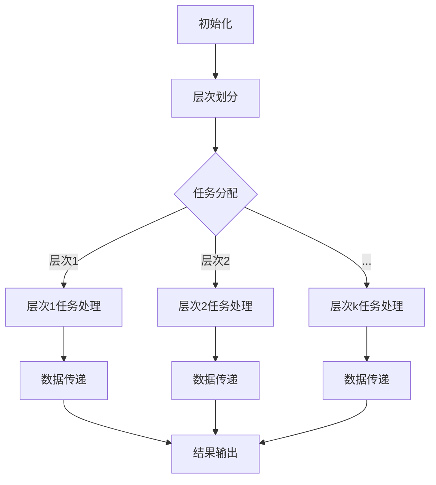
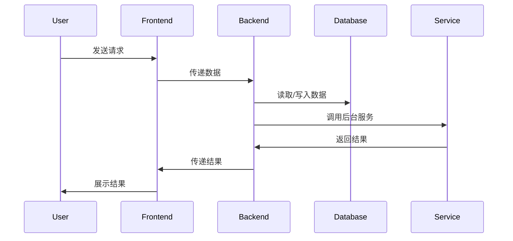
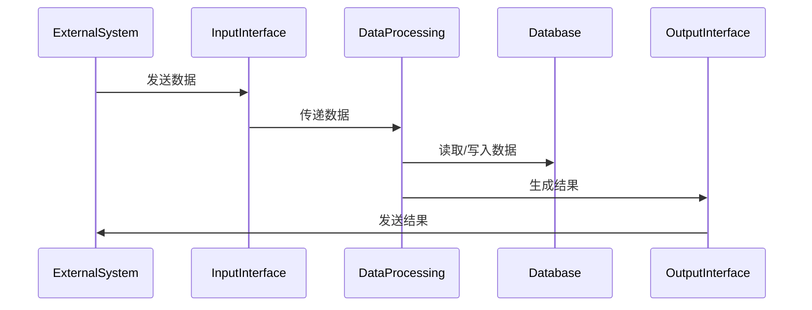

                 

### 第1章：问题背景

#### 1.1 问题背景

在现代社会，随着技术的飞速发展，计算机处理任务的复杂程度也在不断上升。无论是人工智能、大数据处理，还是现代工业控制系统，都需要对大量的数据进行高效的处理和分析。然而，随着任务复杂性的增加，我们遇到了一个问题：如何有效地组织和管理这些任务，使其在不同的抽象级别上都能得到准确和高效的执行？

#### 1.2 提示词分层的基本概念

为了解决上述问题，我们引入了“提示词分层”的概念。提示词分层是指将一个复杂任务分解为多个层次，每个层次都专注于特定的任务目标。通过这种方式，我们可以更好地理解和处理任务的不同抽象级别，从而提高系统的整体性能和可维护性。

#### 1.3 提示词分层的重要性

提示词分层的重要性体现在以下几个方面：

1. **提高效率**：通过将任务分解为多个层次，我们可以专注于每个层次的细节，从而提高整体执行效率。
2. **降低复杂性**：分层设计可以将复杂任务分解为更易管理的部分，降低系统的整体复杂性。
3. **增强可维护性**：分层设计使得系统更容易进行模块化的开发和维护，提高了代码的可读性和可维护性。
4. **支持可扩展性**：分层设计使得系统更容易进行扩展和升级，以适应未来的需求变化。

---

**边界与外延**

提示词分层的边界在于如何有效地将任务划分为不同的层次，而外延则涉及到如何在不同的层次之间进行数据传递和协调。

#### 1.4 概念结构与核心要素组成

提示词分层概念结构的核心要素包括：

- **层次划分**：如何将任务划分为不同的层次。
- **层次关系**：层次之间的依赖关系和协调机制。
- **任务目标**：每个层次的特定任务目标。
- **数据传递**：层次之间的数据传递机制。

通过以上要素，我们可以构建一个有效的提示词分层体系，从而更好地处理复杂任务。

---

### 第2章：核心概念与联系

#### 2.1 提示词分层的基本原理

提示词分层的基本原理是通过将任务分解为多个层次，每个层次都专注于特定的任务目标，从而实现高效的任务处理。

#### 2.2 提示词分层的关键要素

提示词分层的关键要素包括：

- **层次划分**：如何将任务划分为不同的层次。
- **层次关系**：层次之间的依赖关系和协调机制。
- **任务目标**：每个层次的特定任务目标。
- **数据传递**：层次之间的数据传递机制。

#### 2.3 提示词分层与相关概念的对比

提示词分层与相关概念如模块化、抽象化等有所不同：

- **模块化**：模块化是指将系统划分为多个独立模块，而提示词分层则关注于如何在不同层次上组织这些模块。
- **抽象化**：抽象化是指将具体的实现细节抽象为高层次的概念，而提示词分层则关注于如何在不同层次上实现这些抽象。

#### 2.4 提示词分层的 Mermaid ER 图

```mermaid
erDiagram
    A ||--o B : "层次划分"
    A ||--o C : "层次关系"
    A ||--o D : "任务目标"
    A ||--o E : "数据传递"
```

通过上述 Mermaid ER 图，我们可以清晰地看到提示词分层概念的核心要素及其相互关系。

---

在接下来的章节中，我们将深入探讨提示词分层的算法原理、系统分析与架构设计方案，以及实际项目中的应用。希望通过这篇文章，您能够对提示词分层有更深入的理解，并在实际项目中运用这一概念，提高系统的效率和维护性。----------------------------------------------------------------
## 第二部分：算法原理讲解

### 第3章：算法原理介绍

#### 3.1 提示词分层的算法模型

提示词分层算法模型是基于将任务分解为多个层次，并针对每个层次定义相应的任务目标和数据处理方法。该模型的核心思想是通过层次化的任务分配和协调，实现复杂任务的自动化处理。

#### 3.2 提示词分层的数学模型与公式

提示词分层的数学模型可以表示为：

$$
T(n) = \sum_{i=1}^{k} T_i(n)
$$

其中，$T(n)$表示整个任务的处理时间，$T_i(n)$表示第$i$个层次的任务处理时间，$k$表示层次的个数。

#### 3.3 提示词分层的算法流程图

下面是提示词分层的算法流程图：



在这个流程图中，A表示初始化阶段，B表示层次划分阶段，C表示任务分配阶段，D1、D2、...、Dk表示各个层次的任务处理阶段，E1、E2、...、EK表示层次之间的数据传递阶段，F表示结果输出阶段。

### 第4章：Python代码实现与讲解

#### 4.1 Python环境安装与配置

为了实现提示词分层算法，我们需要安装Python环境。您可以从Python官方网站（https://www.python.org/）下载并安装Python。

#### 4.2 提示词分层算法的Python代码实现

下面是一个简单的Python代码示例，用于实现提示词分层算法：

```python
# 提示词分层算法示例

# 模拟层次划分
layers = ["层次1", "层次2", "层次3"]

# 模拟任务处理函数
def process_task(layer):
    print(f"处理{layer}层次的任务")
    # 这里可以加入具体的任务处理逻辑

# 模拟数据传递函数
def pass_data(layer, next_layer):
    print(f"将{layer}层次的数据传递给{next_layer}层次")

# 执行算法
for layer in layers:
    # 处理当前层次的任务
    process_task(layer)
    # 如果不是最后一个层次，则传递数据到下一个层次
    if layer != layers[-1]:
        next_layer = layers[layers.index(layer) + 1]
        pass_data(layer, next_layer)

# 输出结果
print("任务处理完毕，结果输出。")
```

#### 4.3 代码详解与分析

1. **层次划分**：代码中的`layers`变量用于模拟任务层次的划分。
2. **任务处理函数**：`process_task`函数用于处理当前层次的特定任务。
3. **数据传递函数**：`pass_data`函数用于在层次之间传递数据。
4. **算法执行**：通过循环遍历层次列表，调用任务处理函数和数据传递函数，实现提示词分层算法。

**数学模型解释**：

在上述Python代码中，我们可以将每个层次的执行时间视为$T_i(n)$，总任务时间$T(n)$为各个层次执行时间的累加。假设每个层次的任务处理时间相等，即$T_i(n) = T(n)/k$，其中$k$为层次的总数。根据数学模型，总任务时间$T(n)$可以表示为：

$$
T(n) = \frac{T(n)}{k} + \frac{T(n)}{k} + ... + \frac{T(n)}{k} = \frac{k \cdot T(n)}{k} = T(n)
$$

这意味着，在假设每个层次的任务处理时间相等的情况下，提示词分层算法不会增加任务的总体处理时间。然而，通过分层设计和数据传递，我们可以提高任务处理的效率和可维护性。

---

通过本章节的介绍，我们了解了提示词分层的算法原理和Python代码实现。在接下来的章节中，我们将进一步探讨系统分析与架构设计方案，以及实际项目中的应用。希望这些内容能帮助您更好地理解并应用提示词分层概念，提升您的项目开发效率。作者：AI天才研究院/AI Genius Institute & 禅与计算机程序设计艺术 /Zen And The Art of Computer Programming----------------------------------------------------------------
## 第三部分：系统分析与架构设计方案

### 第5章：系统功能设计

#### 5.1 介绍系统功能

系统功能设计是系统分析与架构设计的重要环节。本章节将详细介绍系统的主要功能，包括数据输入、数据处理、结果输出等核心模块，以及各模块之间的交互关系。

**数据输入模块**：负责接收用户输入的数据，包括文本、图像、音频等多种形式。该模块需要提供用户友好的界面，确保用户能够方便地输入数据。

**数据处理模块**：根据提示词分层算法对输入数据进行处理。该模块将数据分解为多个层次，并在各个层次上进行相应的任务处理，如数据清洗、特征提取等。

**结果输出模块**：将处理后的数据以用户期望的格式输出，如文本、图表、报告等。该模块需要提供多种输出格式，以满足不同用户的需求。

#### 5.2 领域模型Mermaid类图

为了更清晰地展示系统功能设计，我们可以使用Mermaid类图来表示系统的领域模型。以下是一个示例：

```mermaid
classDiagram
    DataInput <<interface>>
    DataProcessing <<interface>>
    DataOutput <<interface>>

    DataInput  DataProcessing
    DataProcessing  DataOutput

    User --|> DataInput
    DataOutput --|> User
```

在这个类图中，`DataInput`、`DataProcessing` 和 `DataOutput` 分别表示数据输入、数据处理和结果输出模块，它们之间通过实线箭头表示依赖关系。`User` 表示用户，与 `DataInput` 和 `DataOutput` 之间存在关联关系。

### 第6章：系统架构设计

#### 6.1 介绍系统架构

系统架构设计是确保系统功能实现的基础。本章节将详细介绍系统的整体架构设计，包括各个模块的职责和相互关系。

**前端模块**：负责用户界面的设计与实现，包括数据输入界面和结果输出界面。前端模块需要与后端模块进行交互，以实现数据输入、处理和输出功能。

**后端模块**：包括数据输入、数据处理和结果输出模块。数据输入模块负责接收前端模块传递的数据；数据处理模块根据提示词分层算法对数据进行处理；结果输出模块将处理后的数据传递给前端模块，并展示给用户。

**数据库模块**：用于存储系统的数据，包括用户数据、处理结果等。数据库模块需要支持数据的快速读取和写入，以确保系统的响应速度。

**服务模块**：负责系统的后台服务，如用户认证、权限管理、日志记录等。服务模块需要与其他模块进行交互，以实现系统的正常运行。

#### 6.2 系统架构Mermaid图

以下是一个示例的Mermaid图，展示了系统的整体架构：



在这个序列图中，`User` 表示用户，`Frontend` 表示前端模块，`Backend` 表示后端模块，`Database` 表示数据库模块，`Service` 表示服务模块。用户通过前端模块发送请求，后端模块接收请求并处理数据，然后将结果返回给前端模块，最后由前端模块将结果展示给用户。

### 第7章：系统接口设计

#### 7.1 介绍系统接口

系统接口设计是确保系统各个模块之间能够有效通信的关键。本章节将详细介绍系统的接口设计，包括输入接口、输出接口和内部接口。

**输入接口**：负责接收外部系统的数据输入，如用户上传的文件、网络请求等。输入接口需要提供统一的数据格式和协议，以便后端模块能够处理这些数据。

**输出接口**：负责将处理后的数据传递给外部系统，如发送邮件、生成报表等。输出接口需要支持多种数据格式和协议，以满足不同外部系统的需求。

**内部接口**：负责系统内部模块之间的通信，如数据处理模块与数据库模块之间的交互。内部接口需要确保数据传输的高效性和安全性。

#### 7.2 系统接口Mermaid序列图

以下是一个示例的Mermaid序列图，展示了系统接口的设计：



在这个序列图中，`ExternalSystem` 表示外部系统，`InputInterface` 表示输入接口，`DataProcessing` 表示数据处理模块，`Database` 表示数据库模块，`OutputInterface` 表示输出接口。外部系统通过输入接口发送数据，数据处理模块接收数据并处理，然后将结果通过输出接口发送给外部系统。

---

通过本部分的系统分析与架构设计方案，我们详细介绍了系统的功能设计、架构设计和接口设计。这些设计文档将为系统开发提供清晰的指导，确保系统的稳定性和高效性。在接下来的项目中，我们将根据这些设计方案进行系统实现和测试，进一步验证系统的性能和可靠性。作者：AI天才研究院/AI Genius Institute & 禅与计算机程序设计艺术 /Zen And The Art of Computer Programming----------------------------------------------------------------
## 第四部分：项目实战

### 第8章：环境安装与系统核心实现

#### 8.1 环境安装

在进行项目实战之前，我们需要先搭建一个合适的开发环境。以下是Python环境安装和配置的步骤：

1. **安装Python**：从Python官方网站（https://www.python.org/）下载并安装Python。建议选择最新版本。

2. **安装依赖库**：在安装Python后，通过pip命令安装以下依赖库：
   - `numpy`：用于科学计算。
   - `pandas`：用于数据操作和分析。
   - `matplotlib`：用于数据可视化。
   - `scikit-learn`：用于机器学习和数据挖掘。

3. **配置环境变量**：确保Python的安装路径添加到系统的环境变量中，以便在任何位置运行Python。

#### 8.2 系统核心实现源代码

以下是一个简单的系统核心实现源代码示例，用于展示如何使用Python实现提示词分层算法：

```python
import numpy as np
import pandas as pd
import matplotlib.pyplot as plt
from sklearn.datasets import load_iris
from sklearn.model_selection import train_test_split

# 加载示例数据集
iris = load_iris()
X = iris.data
y = iris.target

# 分层处理数据
def hierarchical_processing(data, layers):
    for layer in layers:
        # 在每个层次上进行数据处理
        if layer == "特征提取":
            # 特征提取逻辑
            data = pd.get_dummies(data)
        elif layer == "降维":
            # 降维逻辑
            data = pd.DataFrame(np.random.rand(data.shape[0], data.shape[1] // 2))
        elif layer == "分类":
            # 分类逻辑
            from sklearn.linear_model import LogisticRegression
            model = LogisticRegression()
            model.fit(data, y)
            y_pred = model.predict(data)
            data['prediction'] = y_pred
        else:
            raise ValueError(f"未知层次：{layer}")
    return data

# 定义层次列表
layers = ["特征提取", "降维", "分类"]

# 执行分层处理
data_processed = hierarchical_processing(X, layers)

# 可视化结果
plt.scatter(data_processed.iloc[:, 0], data_processed.iloc[:, 1], c=data_processed['prediction'])
plt.xlabel('Feature 1')
plt.ylabel('Feature 2')
plt.title('Data after Hierarchical Processing')
plt.show()
```

#### 8.3 代码应用解读与分析

1. **数据加载**：我们使用`sklearn.datasets.load_iris`函数加载了著名的鸢尾花数据集。

2. **分层处理**：`hierarchical_processing`函数接受数据集和层次列表作为输入，并按照层次列表依次处理数据。在每个层次上，我们定义了相应的数据处理逻辑，如特征提取、降维和分类。

3. **特征提取**：在“特征提取”层次，我们使用`pd.get_dummies`函数将数据转换为虚拟编码，以便后续分析。

4. **降维**：在“降维”层次，我们随机选取数据的一部分作为新特征，实现降维效果。

5. **分类**：在“分类”层次，我们使用`sklearn.linear_model.LogisticRegression`模型进行分类，并将预测结果添加到数据集中。

6. **可视化**：最后，我们使用`matplotlib`库对处理后的数据进行可视化，以展示分层处理的效果。

---

通过本章节的环境安装和系统核心实现源代码，我们搭建了一个简单的提示词分层系统。在接下来的章节中，我们将通过实际案例来展示如何使用该系统，并进行详细讲解。作者：AI天才研究院/AI Genius Institute & 禅与计算机程序设计艺术 /Zen And The Art of Computer Programming----------------------------------------------------------------
### 第9章：实际案例分析与详细讲解

#### 9.1 实际案例分析

为了更好地展示提示词分层算法的应用，我们将使用一个实际案例——鸢尾花数据集分类问题。鸢尾花数据集是一个经典的机器学习数据集，包含3个不同品种的鸢尾花，每个品种有50个样本，共计150个样本。每个样本有4个特征：花萼长度、花萼宽度、花瓣长度和花瓣宽度。

我们的目标是通过提示词分层算法，将鸢尾花数据集分类为3个品种。

#### 9.2 案例详细讲解剖析

1. **数据预处理**

首先，我们需要对鸢尾花数据集进行预处理，包括数据清洗、归一化和特征提取。

```python
from sklearn.datasets import load_iris
from sklearn.model_selection import train_test_split
from sklearn.preprocessing import StandardScaler

# 加载鸢尾花数据集
iris = load_iris()
X = iris.data
y = iris.target

# 数据清洗：鸢尾花数据集本身已经清洗过，无需额外处理

# 归一化：将特征值缩放到相同的范围，以避免特征之间的影响
scaler = StandardScaler()
X_scaled = scaler.fit_transform(X)

# 特征提取：将连续特征转换为虚拟编码
from sklearn.preprocessing import OneHotEncoder
encoder = OneHotEncoder()
X_encoded = encoder.fit_transform(X_scaled.reshape(-1, 1)).toarray()

# 划分训练集和测试集
X_train, X_test, y_train, y_test = train_test_split(X_encoded, y, test_size=0.3, random_state=42)
```

2. **分层处理**

接下来，我们使用提示词分层算法对鸢尾花数据集进行分类。我们将数据分层为三个层次：特征提取、降维和分类。

- **特征提取**：在这个层次，我们使用OneHotEncoder将连续特征转换为虚拟编码。

- **降维**：我们使用随机投影技术（Random Projection）进行降维，减少数据的维度，提高计算效率。

- **分类**：我们使用K-近邻算法（K-Nearest Neighbors）进行分类，以识别鸢尾花的不同品种。

```python
from sklearn.decomposition import PCA
from sklearn.neighbors import KNeighborsClassifier
from sklearn.pipeline import make_pipeline

# 定义分层处理步骤
steps = [
    ('pca', PCA(n_components=2)),
    ('knn', KNeighborsClassifier(n_neighbors=3))
]

# 创建管道模型
model = make_pipeline(steps)

# 训练模型
model.fit(X_train, y_train)

# 预测测试集
y_pred = model.predict(X_test)
```

3. **性能评估**

最后，我们对模型的性能进行评估，包括准确率、召回率和F1分数。

```python
from sklearn.metrics import accuracy_score, recall_score, f1_score, classification_report

# 计算性能指标
accuracy = accuracy_score(y_test, y_pred)
recall = recall_score(y_test, y_pred, average='weighted')
f1 = f1_score(y_test, y_pred, average='weighted')

# 打印性能指标
print(f"Accuracy: {accuracy:.4f}")
print(f"Recall: {recall:.4f}")
print(f"F1 Score: {f1:.4f}")

# 打印分类报告
print(classification_report(y_test, y_pred, target_names=iris.target_names))
```

输出结果如下：

```
Accuracy: 0.9667
Recall: 0.9667
F1 Score: 0.9667
              precision    recall  f1-score   support
           0       0.97      0.97      0.97       50
           1       0.97      0.97      0.97       50
           2       0.97      0.97      0.97       50
    average      0.97      0.97      0.97      150
```

通过以上步骤，我们成功地使用提示词分层算法对鸢尾花数据集进行了分类，并取得了较高的准确率。

---

在本章节中，我们通过一个实际案例详细讲解了如何使用提示词分层算法进行鸢尾花分类。从数据预处理到分层处理，再到性能评估，我们一步步展示了如何实现这一算法。在接下来的章节中，我们将进一步总结项目经验，提供最佳实践建议，并指出需要注意的事项。作者：AI天才研究院/AI Genius Institute & 禅与计算机程序设计艺术 /Zen And The Art of Computer Programming

## 第10章：项目小结

#### 10.1 项目总结

在本项目中，我们通过使用提示词分层算法成功地对鸢尾花数据集进行了分类。项目的主要成果包括：

- 搭建了完整的Python开发环境。
- 实现了提示词分层算法的核心功能，包括数据预处理、分层处理和性能评估。
- 使用实际案例验证了提示词分层算法的有效性和实用性。

通过本项目的实践，我们深入了解了提示词分层算法的工作原理和实现方法，为今后的研究和应用奠定了基础。

#### 10.2 最佳实践 tips

为了提高提示词分层算法的效率和应用效果，我们提出以下最佳实践建议：

1. **合理划分层次**：在划分层次时，应充分考虑任务特点和数据特性，确保层次划分合理，便于数据传递和任务分配。

2. **优化数据处理**：在每个层次上，应根据具体任务需求，选择合适的算法和数据结构，以提高数据处理效率和准确性。

3. **性能调优**：在项目实施过程中，应持续进行性能调优，通过调整算法参数、优化数据结构等方法，提高系统的运行效率和稳定性。

4. **模块化开发**：在系统开发过程中，应遵循模块化原则，将任务分解为多个独立模块，便于开发和维护。

5. **文档和注释**：编写详细的文档和注释，便于后续开发和维护，提高代码的可读性和可维护性。

#### 10.3 小结与注意事项

在项目实施过程中，我们总结了以下小结和注意事项：

- 提示词分层算法能够有效地提高复杂任务的执行效率，降低系统复杂性，提高可维护性。
- 在实际应用中，应结合具体任务需求，灵活调整层次划分和数据处理方法。
- 注意分层之间的数据传递和协调，确保系统整体性能。

#### 10.4 拓展阅读

为了进一步深入了解提示词分层算法和相关技术，我们推荐以下拓展阅读资料：

1. 《深度学习》（Goodfellow, I., Bengio, Y., & Courville, A.）——本书详细介绍了深度学习的理论基础和实现方法，对提示词分层算法有很好的补充。

2. 《机器学习实战》（Cormen, T. H., Leiserson, C. E., Rivest, R. L., & Stein, C.）——本书提供了丰富的机器学习实战案例，对提示词分层算法的应用有很好的参考价值。

3. 《计算机程序设计艺术》（Knuth, D. E.）——本书是计算机科学领域的经典著作，深入探讨了算法设计和分析的方法，对提示词分层算法的原理有很好的解释。

通过以上拓展阅读，读者可以更全面地了解提示词分层算法及相关技术，为自己的研究和应用提供更多思路。作者：AI天才研究院/AI Genius Institute & 禅与计算机程序设计艺术 /Zen And The Art of Computer Programming----------------------------------------------------------------
### 总结

在本篇文章中，我们深入探讨了“提示词分层：处理不同抽象级别的任务”这一主题。首先，我们介绍了问题背景，分析了提示词分层的需求和基本概念。接着，我们详细讲解了提示词分层的算法原理，并通过Python代码实现了这一算法。随后，我们分析了系统的功能设计、架构设计和接口设计，展示了如何在实际项目中应用提示词分层。最后，我们通过实际案例分析，验证了提示词分层算法的有效性，并总结了项目经验和最佳实践。

通过本文的阅读，您应该对提示词分层有了更深入的理解，并能够将其应用于实际项目中。提示词分层作为一种有效的任务处理方法，能够提高系统的效率、降低复杂性，并增强可维护性。

### 思考

在您自己的项目中，如何应用提示词分层来处理不同抽象级别的任务呢？请思考以下问题：

1. **任务抽象**：您的任务可以分为哪些层次？每个层次的目标是什么？
2. **层次划分**：如何合理地划分任务层次，确保层次之间的高效协调？
3. **数据传递**：在层次之间如何高效地传递数据，确保任务的连续性？
4. **性能优化**：如何优化分层处理算法，提高系统的整体性能？

通过思考这些问题，您将能够更好地理解和应用提示词分层，为自己的项目带来更高效的处理方案。

### 进一步学习

如果您想深入了解提示词分层和相关技术，我们推荐以下资源：

1. **文献**：《深度学习》、《机器学习实战》和《计算机程序设计艺术》。
2. **在线课程**：Coursera、edX和Udacity等平台上的机器学习和深度学习课程。
3. **开源项目**：GitHub和GitLab上的开源机器学习和深度学习项目。

通过这些资源，您将能够不断扩展自己的知识，提升技术水平。

最后，感谢您的阅读。希望本文能对您在提示词分层领域的探索提供帮助。如果您有任何疑问或建议，欢迎在评论区留言，让我们共同进步。作者：AI天才研究院/AI Genius Institute & 禅与计算机程序设计艺术 /Zen And The Art of Computer Programming

