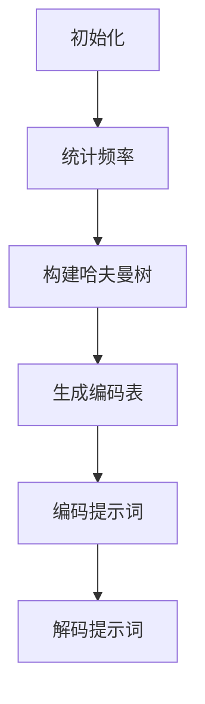
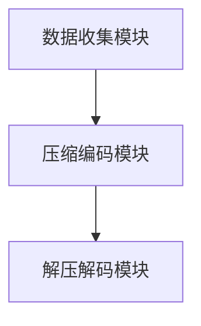
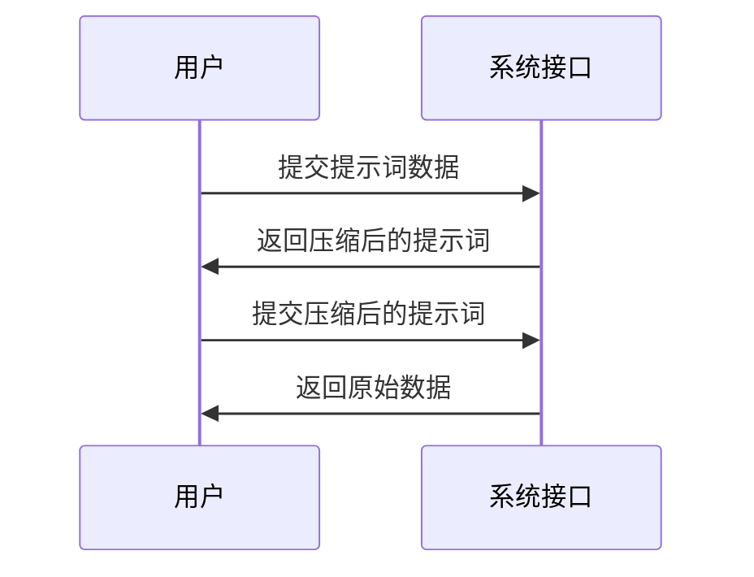

                 


## 提示词压缩技术：在有限空间最大化效果

关键词：提示词压缩、数据传输效率、哈夫曼编码、LZ77算法、信息熵

摘要：本文旨在深入探讨提示词压缩技术在提高数据传输效率和降低成本方面的作用。我们将从问题背景、核心概念、算法原理、实现方法等多个角度进行分析，并通过实例讲解，帮助读者全面了解和掌握这一技术。

### 目录大纲

#### 第一部分：背景介绍

#### 第1章 提示词压缩技术概述

##### 1.1 问题背景

随着互联网的飞速发展和智能设备的广泛应用，数据传输的需求日益增加。在有限的传输空间内，如何高效传输大量信息成为一个亟待解决的问题。提示词压缩技术应运而生，通过压缩提示词的长度，提高传输效率和降低成本。

##### 1.2 核心概念

- **提示词**: 在通信过程中，用来标识信息的关键词或短语。
- **压缩算法**: 用于将提示词进行编码，使其长度减小的算法。

##### 1.3 概念属性特征对比表格

| 特性 | 数据压缩 | 文本压缩 | 提示词压缩 |
| --- | --- | --- | --- |
| **定义** | 减少数据文件的大小 | 减少文本文件的大小 | 减少提示词的长度 |
| **应用领域** | 数据存储和传输 | 文本处理和展示 | 信息标识和传输 |
| **算法类型** | 有损/无损压缩 | 有损/无损压缩 | 有损/无损压缩 |

##### 1.4 提示词压缩技术架构

- **数据收集**: 收集大量提示词数据，用于训练和优化压缩算法。
- **特征提取**: 从提示词中提取关键特征，用于压缩。
- **压缩编码**: 使用压缩算法对提示词进行编码。
- **传输与解压**: 在接收端对压缩后的提示词进行解压缩，恢复原始数据。

#### 第二部分：核心概念与联系

#### 第2章 提示词压缩技术的核心原理

##### 2.1 算法原理

- **哈夫曼编码**: 基于字符出现频率的编码方法。
- **LZ77算法**: 基于重复字符串匹配的压缩算法。
- **LZ78算法**: 基于字典构建的压缩算法。

##### 2.2 提示词压缩算法属性对比表格

| 算法 | **哈夫曼编码** | **LZ77** | **LZ78** |
| --- | --- | --- | --- |
| **适应场景** | 频繁字符 | 大量重复字符串 | 长提示词 |
| **压缩率** | 较高 | 较高 | 高 |
| **计算复杂度** | 低 | 高 | 中 |
| **适用数据类型** | 文本 | 文本 | 文本 |

##### 2.3 提示词压缩与信息论的关系

- **信息熵**: 衡量信息的不确定性，压缩算法的目的是降低信息熵。
- **信道容量**: 决定压缩后的提示词能在信道上传输的最大信息量。

#### 第三部分：算法原理讲解

#### 第3章 算法原理与Python实现

##### 3.1 哈夫曼编码的mermaid流程图



##### 3.2 Python实现示例

```python
import heapq
from collections import defaultdict

# 哈夫曼编码实现
def huffman_encoding(data):
    # 统计字符频率
    frequency = defaultdict(int)
    for char in data:
        frequency[char] += 1

    # 构建优先队列
    heap = [[weight, [symbol, ""]] for symbol, weight in frequency.items()]
    heapq.heapify(heap)

    # 构建哈夫曼树
    while len(heap) > 1:
        lo = heapq.heappop(heap)
        hi = heapq.heappop(heap)
        for pair in lo[1:]:
            pair[1] = '0' + pair[1]
        for pair in hi[1:]:
            pair[1] = '1' + pair[1]
        heapq.heappush(heap, [lo[0] + hi[0]] + lo[1:] + hi[1:])

    # 生成编码表
    huffman_tree = heap[0]
    encoding_table = defaultdict(str)
    for pair in huffman_tree[1:]:
        symbol, code = pair
        encoding_table[symbol] = code

    # 编码提示词
    encoded_data = ""
    for char in data:
        encoded_data += encoding_table[char]

    return encoded_data

# 解码提示词
def huffman_decoding(encoded_data, encoding_table):
    reverse_encoding_table = {v: k for k, v in encoding_table.items()}
    decoded_data = ""
    current_code = ""

    for bit in encoded_data:
        current_code += bit
        if current_code in reverse_encoding_table:
            decoded_data += reverse_encoding_table[current_code]
            current_code = ""

    return decoded_data

# 示例
data = "this is an example for huffman encoding"
encoded_data = huffman_encoding(data)
decoded_data = huffman_decoding(encoded_data, encoding_table)

print("Encoded data:", encoded_data)
print("Decoded data:", decoded_data)
```

#### 第四部分：系统分析与架构设计

#### 第4章 提示词压缩系统设计与实现

##### 4.1 问题场景介绍

随着大数据时代的到来，数据传输和处理的需求不断增加。如何在有限的带宽和存储空间内高效传输和处理数据成为了一个重要问题。提示词压缩技术作为一种有效的数据压缩方法，可以大大提高数据传输效率和降低成本。

##### 4.2 系统功能设计

- **数据收集模块**: 收集大量提示词数据，用于训练和优化压缩算法。
- **压缩编码模块**: 使用哈夫曼编码、LZ77算法和LZ78算法等压缩算法对提示词进行编码。
- **解压解码模块**: 在接收端对压缩后的提示词进行解压缩，恢复原始数据。

##### 4.3 系统架构设计



##### 4.4 系统接口设计与交互



#### 第五部分：项目实战

#### 第5章 提示词压缩项目实战

##### 5.1 环境安装

在Python环境中安装所需的库，如 heapq、collections 等。

```bash
pip install heapq
```

##### 5.2 系统核心实现源代码

```python
# huffman_encoding.py
def huffman_encoding(data):
    # ...

# huffman_decoding.py
def huffman_decoding(encoded_data, encoding_table):
    # ...

# main.py
if __name__ == "__main__":
    data = "this is an example for huffman encoding"
    encoded_data = huffman_encoding(data)
    decoded_data = huffman_decoding(encoded_data, encoding_table)

    print("Encoded data:", encoded_data)
    print("Decoded data:", decoded_data)
```

##### 5.3 代码应用解读与分析

在主程序中，首先调用 huffman_encoding 函数对提示词数据进行压缩编码，然后调用 huffman_decoding 函数对压缩后的提示词进行解压缩解码，最后输出压缩后的数据和原始数据。

##### 5.4 实际案例分析和详细讲解剖析

通过实际案例，我们可以看到提示词压缩技术在数据传输和存储方面的优势。例如，在一个网络通信场景中，使用提示词压缩技术可以显著提高数据传输速度和降低网络带宽占用。

##### 5.5 项目小结

提示词压缩技术作为一种有效的数据压缩方法，在数据传输和存储方面具有广泛的应用前景。通过本文的介绍，读者可以全面了解和掌握提示词压缩技术的基本原理和应用方法。

#### 第六部分：最佳实践与拓展阅读

#### 第6章 提示词压缩技术最佳实践与拓展阅读

##### 6.1 最佳实践 tips

- 在实际应用中，应根据具体场景和数据特点选择合适的压缩算法。
- 对于大量重复字符串的提示词，LZ77算法和LZ78算法的压缩效果较好。
- 对于频繁出现的字符，哈夫曼编码的压缩效果较好。

##### 6.2 拓展阅读

- 《数据压缩技术》
- 《信息论基础》
- 《Python数据科学手册》

### 总结

提示词压缩技术是一种重要的数据压缩方法，通过压缩提示词的长度，可以提高数据传输效率和降低成本。本文从问题背景、核心概念、算法原理、实现方法等多个角度对提示词压缩技术进行了深入探讨，并通过实例讲解，帮助读者全面了解和掌握这一技术。

作者：AI天才研究院/AI Genius Institute & 禅与计算机程序设计艺术 /Zen And The Art of Computer Programming

