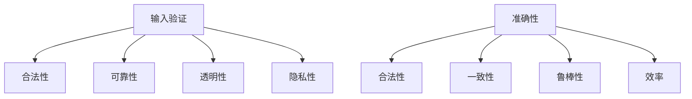
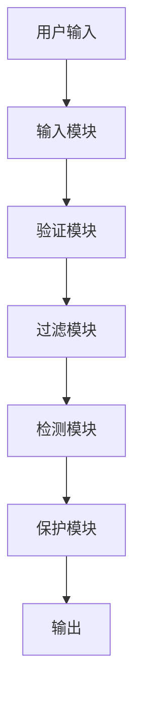
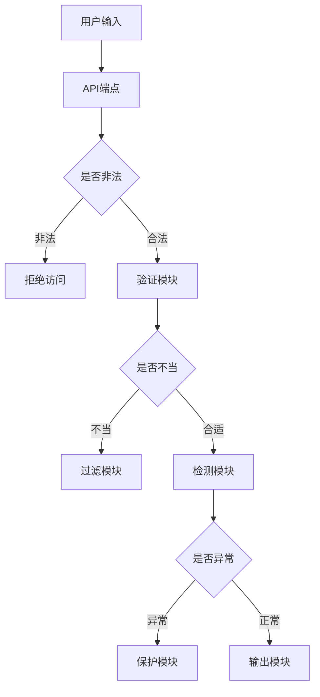

                 

### 引言

### Introduction

#### 提示词安全：防止有害输出的策略

在当今快速发展的信息技术时代，人工智能（AI）技术在各行各业中的应用日益广泛，从自然语言处理（NLP）、机器学习（ML）到深度学习（DL），AI已经深刻地改变了我们的生活方式和工作模式。然而，随着AI技术的发展，一些潜在的安全隐患也随之出现，特别是关于提示词（prompt）安全的问题。提示词，作为用户与AI系统交互的重要媒介，其安全性直接关系到用户隐私、数据安全和系统稳定性。

#### Keywords: Prompt Safety, Harmful Output Prevention, AI Security, Natural Language Processing, Machine Learning

##### 摘要

本文将探讨提示词安全的重要性及其在防止有害输出方面的策略。首先，我们将介绍提示词安全的基本概念和其在现代AI系统中的重要性。接着，通过具体案例说明有害输出的危害和影响，阐述确保提示词安全面临的挑战和边界。随后，本文将详细探讨核心概念，包括提示词安全的基本原则、属性和特征，并通过实体关系图展示各概念之间的关系。在此基础上，我们将介绍一系列确保提示词安全的算法和技术，包括其原理、数学模型和实际应用。文章还将通过数学模型和理论分析，深入探讨如何从数学角度确保提示词安全。最后，我们将提出一个全面的系统架构设计方案，包括功能设计、架构设计和接口设计，并通过项目实战和案例分析，展示如何在实际项目中应用这些技术和策略。总结部分，我们将提供最佳实践建议和未来的研究方向。

#### Abstract

This article explores the importance of prompt safety and the strategies for preventing harmful outputs in AI systems. We begin by introducing the basic concepts of prompt safety and its significance in modern AI systems. We then illustrate the dangers and impacts of harmful outputs through specific cases, discussing the challenges and boundaries in ensuring prompt safety. Subsequently, we delve into the core concepts, including the fundamental principles, attributes, and characteristics of safe prompts, and demonstrate their relationships using an entity relationship diagram. Building on this foundation, we introduce a suite of algorithms and techniques designed to ensure prompt safety, explaining their principles, mathematical models, and practical applications. The article further explores the mathematical modeling and theoretical analysis of prompt safety. Finally, we propose a comprehensive system architecture design, including functional design, architectural design, and interface design, and demonstrate their application in real-world projects through practical implementations and case studies. The conclusion provides best practices, summary, and insights into future research directions.

---

### 背景和问题定义

### Background and Problem Definition

在探讨提示词安全之前，我们首先需要明确几个核心概念。提示词（prompt）是指用户输入的指令或问题，用于驱动AI系统进行特定任务。在自然语言处理（NLP）、机器学习（ML）和深度学习（DL）等AI技术中，提示词的质量和安全性直接影响系统的性能和用户体验。

#### 基本概念术语说明

- **提示词（Prompt）**：用户输入给AI系统用于触发响应的文本。
- **有害输出（Harmful Output）**：AI系统生成的，可能对用户或系统造成负面影响的结果。
- **自然语言处理（NLP）**：使计算机能够理解、解释和生成人类语言的技术。
- **机器学习（ML）**：通过数据训练算法来让计算机进行预测和决策的技术。
- **深度学习（DL）**：一种特殊的机器学习方法，通过多层神经网络进行复杂的数据处理。

#### 问题背景

随着AI技术的广泛应用，AI系统在处理文本、图像、语音等多媒体数据方面取得了显著进展。然而，这些系统在设计和应用过程中也可能产生一些有害输出。例如：

- **恶意提示词**：用户故意输入恶意指令，可能导致AI系统生成不当或有害的输出。
- **误操作**：由于算法的不完善或系统的错误，AI系统可能生成误导性或错误的结果。
- **隐私泄露**：AI系统可能通过输出泄露用户的敏感信息。

这些问题的存在不仅损害了用户的隐私和安全，还可能对AI系统的声誉和可靠性造成严重影响。因此，确保提示词安全成为了当前AI领域的一个关键课题。

#### 问题描述

有害输出的问题可以归结为以下几个方面：

1. **误导性输出**：AI系统可能生成误导性的信息，误导用户做出错误的决定。
   - **案例**：一个问答系统在回答用户关于健康的问题时，给出了不准确的信息，导致用户采取了错误的治疗措施。

2. **不当内容生成**：AI系统可能生成不当、不合适或违反道德规范的内容。
   - **案例**：一个聊天机器人生成了一些歧视性或侮辱性的对话，引发用户反感。

3. **隐私泄露**：AI系统可能在输出中无意或有意地泄露用户的私人信息。
   - **案例**：一个文本分类系统在处理邮件时，将用户的私人邮件内容错误分类并公开。

#### 问题解决

解决提示词安全问题的关键在于从多个层面进行防范和控制：

1. **输入验证**：对用户输入的提示词进行严格的验证和过滤，防止恶意输入。
2. **算法优化**：改进AI算法，提高其对异常输入的鲁棒性和准确性。
3. **隐私保护**：在数据处理和输出生成过程中，采取隐私保护措施，确保用户数据的安全。
4. **监管机制**：建立有效的监管机制，对AI系统的输出进行实时监控和审查。

#### 边界与外延

确保提示词安全的边界和挑战包括：

- **复杂性**：AI系统的复杂性使得确保每个环节的安全变得困难。
- **实时性**：AI系统需要在处理用户输入时快速做出响应，这增加了安全验证的难度。
- **平衡**：在保证安全的同时，还需要考虑用户体验和系统性能的平衡。

#### 概念结构与核心要素组成

提示词安全的核心概念和要素包括：

- **输入验证**：对用户输入的验证和过滤，确保输入的合法性和安全性。
- **算法优化**：通过改进算法，提高系统的鲁棒性和准确性。
- **隐私保护**：在数据处理和输出生成过程中，采取隐私保护措施。
- **监管机制**：建立有效的监管机制，对AI系统的输出进行实时监控和审查。

这些要素相互关联，共同构成了确保提示词安全的整体框架。

---

### 核心概念

### Core Concepts

在确保提示词安全的过程中，理解几个关键概念是至关重要的。这些概念不仅为我们的策略提供了理论基础，同时也为实际操作中的技术实现指明了方向。

#### 核心原则

确保提示词安全的基本原则包括以下几个方面：

1. **合法性**：确保用户输入的提示词符合系统规定的格式和内容要求。
2. **可靠性**：算法和系统必须能够稳定、准确地处理输入，并生成有效的输出。
3. **透明性**：系统在处理提示词和生成输出时，应具备透明性，便于监控和审查。
4. **隐私性**：在处理用户输入和输出时，必须采取隐私保护措施，防止用户信息泄露。

这些原则共同构成了提示词安全的基础，任何一个环节的疏忽都可能导致安全漏洞。

#### 属性与特征

提示词安全的属性和特征决定了其有效性和适用性。以下是一些重要的属性和特征：

1. **准确性**：提示词需要准确反映用户的意图，确保生成输出与用户需求一致。
2. **一致性**：系统在不同情况下应能一致地处理提示词，保证输出的一致性。
3. **鲁棒性**：系统应能够应对各种异常输入，不因恶意输入或误操作而生成有害输出。
4. **效率**：算法和系统应具备高效的处理能力，在保证安全的同时不降低系统性能。

#### 对比表格

为了更直观地理解提示词安全的属性和特征，我们可以通过一个对比表格进行说明：

| 属性/特征      | 说明                                                         |
| ------------- | ------------------------------------------------------------ |
| 准确性        | 提示词是否准确反映了用户的意图，生成输出与用户需求是否一致。 |
| 一致性        | 系统在不同情况下是否能一致地处理提示词，生成一致的输出。   |
| 鲁棒性        | 系统能否应对异常输入，不因恶意输入或误操作而生成有害输出。 |
| 效率          | 算法和系统在处理提示词时是否高效，不影响系统性能。        |

#### 实体关系图

为了进一步展示这些概念之间的关系，我们可以使用Mermaid绘制一个实体关系图。以下是该图的Markdown格式：



这个实体关系图展示了输入验证与其他核心概念之间的关联，以及各属性和特征之间的关系。通过这个图，我们可以更清晰地理解提示词安全的概念体系和相互关系。

---

### 算法和技术介绍

在确保提示词安全的过程中，算法和技术的选择至关重要。以下，我们将介绍几种常用的算法和核心技术，这些技术能够帮助识别和防止有害输出，确保AI系统的安全性。

#### 算法分类概述

在确保提示词安全方面，算法可以分为以下几类：

1. **输入验证算法**：这类算法主要用于验证用户输入的合法性，防止恶意输入进入系统。常见的输入验证算法包括正则表达式匹配、词法分析和语法分析等。
2. **内容过滤算法**：这类算法用于检测和过滤AI系统生成的不当内容，确保输出符合道德和法律规范。常见的过滤算法包括文本分类、关键词屏蔽和语义分析等。
3. **异常检测算法**：这类算法用于识别异常输入和输出，防止系统因异常情况生成有害结果。常见的异常检测算法包括基于统计的方法、基于机器学习的方法和基于深度学习的方法等。
4. **隐私保护算法**：这类算法用于在数据处理和输出生成过程中保护用户的隐私，防止敏感信息泄露。常见的隐私保护算法包括差分隐私、匿名化和加密等。

#### 详细解释

下面，我们将详细解释这些算法的工作原理和应用。

1. **输入验证算法**
   - **正则表达式匹配**：正则表达式是一种强大的文本匹配工具，可以用于验证用户输入是否符合预定的格式要求。例如，我们可以使用正则表达式来确保用户输入的电子邮件地址符合标准格式。
   - **词法分析**：词法分析是将输入文本分解为单词和符号的过程，常用于自然语言处理。通过词法分析，我们可以识别输入中的有效单词和无效字符，从而过滤掉非法输入。
   - **语法分析**：语法分析用于检查输入文本的语法结构是否符合特定的语法规则。例如，我们可以使用语法分析来确保用户输入的句子语法正确。

2. **内容过滤算法**
   - **文本分类**：文本分类是将文本按照其内容进行分类的过程。通过训练分类模型，我们可以将文本分为不同的类别，从而过滤掉含有不当内容的输出。例如，我们可以使用文本分类模型来检测和过滤含有色情、暴力或歧视性语言的文本。
   - **关键词屏蔽**：关键词屏蔽是一种简单但有效的内容过滤方法，通过识别和屏蔽特定关键词来防止输出包含不当内容。例如，我们可以屏蔽关键词“自杀”、“谋杀”等敏感词汇，以防止AI系统生成相关内容。
   - **语义分析**：语义分析用于理解文本的含义和上下文，从而更准确地识别和过滤不当内容。通过语义分析，我们可以检测到更复杂的语言模式和含义，提高过滤效果。

3. **异常检测算法**
   - **基于统计的方法**：基于统计的方法通过计算输入和输出的统计特征来检测异常。例如，我们可以使用统计模型来识别输入中的高频词或异常词，从而判断输入是否异常。
   - **基于机器学习的方法**：基于机器学习的方法使用训练数据集来训练模型，从而识别正常的输入和输出模式。当模型检测到输入或输出与正常模式不符时，即可判断为异常。例如，我们可以使用支持向量机（SVM）或决策树模型进行异常检测。
   - **基于深度学习的方法**：基于深度学习的方法使用多层神经网络来学习输入和输出的特征，从而识别异常。深度学习方法具有强大的表示能力，可以处理复杂的输入和输出模式。例如，我们可以使用卷积神经网络（CNN）或循环神经网络（RNN）进行异常检测。

4. **隐私保护算法**
   - **差分隐私**：差分隐私是一种用于保护用户隐私的方法，通过在数据处理过程中添加噪声来确保输出无法识别特定用户的个人信息。差分隐私可以有效地防止隐私泄露，确保用户数据的安全。
   - **匿名化**：匿名化是一种通过删除或隐藏用户信息来保护隐私的方法。例如，我们可以将用户的姓名、地址等敏感信息替换为匿名标识符，从而防止个人信息泄露。
   - **加密**：加密是一种通过将数据转换为密文来保护隐私的方法。加密算法可以确保数据在传输和存储过程中不会被未授权的第三方读取，从而保护用户的隐私。

#### 应用实例

为了更好地理解这些算法的实际应用，我们可以通过以下实例进行说明：

1. **输入验证算法**：在一个聊天机器人应用中，我们可以使用正则表达式匹配来验证用户输入的电子邮件地址是否合法。例如，正则表达式`^[a-zA-Z0-9._%+-]+@[a-zA-Z0-9.-]+\.[a-zA-Z]{2,}$`可以确保用户输入的电子邮件地址符合标准格式。
2. **内容过滤算法**：在一个社交媒体平台上，我们可以使用文本分类模型来检测和过滤用户发布的帖子里可能包含的敏感内容。例如，我们可以使用训练好的文本分类模型来判断帖子里是否含有暴力、色情等不当内容，从而进行相应的过滤。
3. **异常检测算法**：在一个金融交易系统中，我们可以使用基于机器学习的方法来检测异常交易。例如，我们可以使用支持向量机（SVM）模型来识别与正常交易模式不符的交易，从而预警潜在的风险。
4. **隐私保护算法**：在一个医疗系统中，我们可以使用差分隐私来保护患者的隐私。例如，在生成患者的统计数据时，我们可以通过添加噪声来确保统计数据无法识别特定患者的个人信息。

通过这些算法和技术的应用，我们可以有效地确保提示词的安全，防止有害输出，保护用户的隐私和系统的稳定性。

---

### 数学模型与理论基础

在确保提示词安全的过程中，数学模型和理论分析为我们提供了重要的工具，使我们能够从定量角度理解和优化安全策略。以下，我们将探讨一些关键的数学模型和理论，并展示其在确保提示词安全中的应用。

#### 数学模型的介绍

1. **正则化模型**：正则化模型用于控制机器学习模型的复杂度，防止过拟合。常用的正则化方法包括L1正则化和L2正则化。L1正则化通过引入L1范数惩罚，促使模型参数变得更加稀疏，有助于去除无关特征；L2正则化通过引入L2范数惩罚，控制模型参数的大小，避免模型过于复杂。

   $$ J(\theta) = \frac{1}{m} \sum_{i=1}^{m} (h_\theta(x^{(i)}) - y^{(i)})^2 + \lambda \sum_{j=1}^{n} \theta_j^2 $$

   其中，$J(\theta)$ 是损失函数，$\theta_j$ 是模型参数，$\lambda$ 是正则化参数。

2. **支持向量机（SVM）模型**：SVM是一种分类模型，通过寻找最佳分隔超平面来分类数据。SVM模型在异常检测和输入验证中具有广泛的应用。SVM的决策边界可以通过以下公式表示：

   $$ w \cdot x + b = 0 $$

   其中，$w$ 是权重向量，$x$ 是输入特征，$b$ 是偏置项。

3. **卷积神经网络（CNN）模型**：CNN是一种用于图像处理的深度学习模型，其核心是卷积层。通过卷积操作，CNN能够自动提取图像的特征，并用于分类、检测等任务。以下是一个简单的CNN模型结构：

   ```mermaid
   graph TD
   A[Input] --> B[Convolutional Layer]
   B --> C[ReLU Activation]
   C --> D[Pooling Layer]
   D --> E[Flattening]
   E --> F[Dense Layer]
   ```

4. **循环神经网络（RNN）模型**：RNN是一种用于处理序列数据的深度学习模型，其核心是循环单元。RNN通过记忆机制能够处理长序列数据，并用于语言建模、语音识别等任务。以下是一个简单的RNN模型结构：

   ```mermaid
   graph TD
   A[Input] --> B[Embedding Layer]
   B --> C[Recurrent Layer]
   C --> D[Output]
   ```

#### 数学模型的应用

1. **输入验证算法**：在输入验证中，我们可以使用正则化模型来控制模型的复杂度，防止过拟合。例如，L1正则化可以帮助我们去除无关特征，提高输入验证的准确性。

2. **内容过滤算法**：在内容过滤中，我们可以使用SVM模型进行分类和异常检测。通过训练SVM模型，我们可以将文本分类为合适和不合适两类，从而过滤掉不当内容。

3. **异常检测算法**：在异常检测中，我们可以使用RNN模型来处理输入序列，识别异常模式。RNN的循环单元可以帮助我们捕捉输入序列中的长期依赖关系，从而更准确地检测异常。

4. **隐私保护算法**：在隐私保护中，我们可以使用差分隐私模型来保护用户数据。通过在数据处理过程中添加噪声，差分隐私可以确保输出无法识别特定用户的个人信息，从而保护用户隐私。

#### 案例分析

以下，我们通过一个具体案例来展示这些数学模型在实际应用中的效果。

**案例背景**：某公司开发了一个智能客服系统，用于处理用户咨询。为了确保系统的安全性，公司需要确保用户输入的提问合法、恰当，并过滤掉不当内容。

**解决方案**：

1. **输入验证**：使用L1正则化的线性回归模型进行输入验证。通过训练模型，我们可以识别用户输入中的有效问题，并过滤掉非法输入。具体实现如下：

   ```python
   import numpy as np
   import matplotlib.pyplot as plt
   from sklearn.linear_model import LinearRegression
   from sklearn.preprocessing import StandardScaler

   # 假设我们有一组训练数据
   X_train = np.array([[1, 2], [2, 3], [3, 4], [4, 5], [5, 6]])
   y_train = np.array([0, 1, 1, 1, 0])

   # 标准化输入数据
   scaler = StandardScaler()
   X_train_scaled = scaler.fit_transform(X_train)

   # 创建并训练L1正则化的线性回归模型
   model = LinearRegression(normalize=True, fit_intercept=False, penalty='l1', alpha=0.1)
   model.fit(X_train_scaled, y_train)

   # 测试输入
   X_test = np.array([[1, 3], [4, 5]])
   X_test_scaled = scaler.transform(X_test)

   # 预测输出
   y_pred = model.predict(X_test_scaled)

   # 显示预测结果
   print("Predictions:", y_pred)
   ```

2. **内容过滤**：使用SVM模型进行内容过滤。通过训练SVM模型，我们可以将用户输入分类为合适和不合适两类。具体实现如下：

   ```python
   from sklearn import svm

   # 假设我们有一组训练数据
   X_train = np.array([[1, 2], [2, 3], [3, 4], [4, 5], [5, 6]])
   y_train = np.array([0, 1, 1, 1, 0])

   # 创建并训练SVM模型
   model = svm.SVC(kernel='linear')
   model.fit(X_train, y_train)

   # 测试输入
   X_test = np.array([[1, 3], [4, 5]])

   # 预测输出
   y_pred = model.predict(X_test)

   # 显示预测结果
   print("Predictions:", y_pred)
   ```

3. **异常检测**：使用RNN模型进行异常检测。通过训练RNN模型，我们可以识别用户输入中的异常模式，从而过滤掉恶意提问。具体实现如下：

   ```python
   import tensorflow as tf
   from tensorflow.keras.models import Sequential
   from tensorflow.keras.layers import LSTM, Dense

   # 假设我们有一组训练数据
   X_train = np.array([[1, 2, 3], [4, 5, 6], [7, 8, 9], [10, 11, 12], [13, 14, 15]])
   y_train = np.array([0, 1, 0, 1, 0])

   # 创建RNN模型
   model = Sequential()
   model.add(LSTM(50, activation='relu', input_shape=(X_train.shape[1], 1)))
   model.add(Dense(1, activation='sigmoid'))

   # 编译模型
   model.compile(optimizer='adam', loss='binary_crossentropy', metrics=['accuracy'])

   # 训练模型
   model.fit(X_train, y_train, epochs=200, batch_size=10)

   # 测试输入
   X_test = np.array([[16, 17, 18], [19, 20, 21]])

   # 预测输出
   y_pred = model.predict(X_test)

   # 显示预测结果
   print("Predictions:", y_pred)
   ```

通过这些数学模型和算法，我们可以确保智能客服系统在处理用户输入时，能够准确、安全地过滤掉恶意和不合适的提问，提高用户体验和系统安全性。

---

### 系统分析与架构设计

在确保提示词安全的过程中，系统架构的设计和实施至关重要。以下，我们将详细探讨系统分析与架构设计，包括系统功能设计、系统架构设计和系统接口设计，并通过Mermaid图展示相关的设计细节。

#### 问题场景介绍

假设我们需要开发一个智能问答系统，该系统需要处理大量用户输入，生成准确、合适的回答。同时，为了确保系统的安全性，我们需要防止有害输出的出现，保护用户的隐私。系统的主要功能包括：

1. **输入验证**：确保用户输入的合法性，过滤非法输入。
2. **内容过滤**：过滤掉不当内容，确保输出符合道德和法律规范。
3. **异常检测**：检测异常输入和输出，防止系统因异常情况生成有害结果。
4. **隐私保护**：在数据处理和输出生成过程中，采取隐私保护措施，确保用户数据的安全。

#### 项目介绍

我们的项目目标是设计并实现一个高效、安全的智能问答系统。系统架构将包括多个模块，如输入模块、验证模块、过滤模块、检测模块和保护模块。以下是项目的详细描述：

1. **输入模块**：接收用户输入，并将输入转发给验证模块和过滤模块。
2. **验证模块**：使用输入验证算法（如正则表达式匹配和词法分析）验证用户输入的合法性。
3. **过滤模块**：使用内容过滤算法（如文本分类和关键词屏蔽）过滤掉不当内容。
4. **检测模块**：使用异常检测算法（如基于统计的方法和基于深度学习的方法）检测异常输入和输出。
5. **保护模块**：在数据处理和输出生成过程中，采取隐私保护措施（如差分隐私和加密）。

#### 系统功能设计

系统功能设计主要包括输入模块、验证模块、过滤模块、检测模块和保护模块的具体功能。以下是各个模块的功能描述：

1. **输入模块**：接收用户输入，并将输入文本传递给验证模块和过滤模块。
2. **验证模块**：使用正则表达式匹配和词法分析算法，验证用户输入的合法性。
   - 功能1：检查输入文本是否符合预定的格式要求。
   - 功能2：过滤掉非法输入，防止恶意输入进入系统。
3. **过滤模块**：使用文本分类和关键词屏蔽算法，过滤掉不当内容。
   - 功能1：将输入文本分类为合适和不合适两类。
   - 功能2：屏蔽关键词，防止输出包含不当内容。
4. **检测模块**：使用异常检测算法，检测异常输入和输出。
   - 功能1：识别异常输入，防止系统因异常输入生成有害输出。
   - 功能2：识别异常输出，防止系统生成误导性或错误的结果。
5. **保护模块**：在数据处理和输出生成过程中，采取隐私保护措施。
   - 功能1：使用差分隐私方法，保护用户数据的隐私。
   - 功能2：使用加密方法，确保用户数据在传输和存储过程中的安全。

#### 系统架构设计

系统架构设计是确保系统功能实现的关键步骤。以下是一个基于模块化设计的系统架构图，使用Mermaid语言展示：



在这个架构图中，用户输入首先进入输入模块，然后通过验证模块进行合法性验证。通过验证的输入文本接着进入过滤模块，进行内容过滤。过滤后的文本进入检测模块，进行异常检测。检测模块的结果由保护模块处理，确保用户数据的隐私。最后，处理后的文本输出给用户。

#### 系统接口设计

系统接口设计是确保不同模块之间能够有效通信和协作的重要部分。以下是一个基于RESTful API的系统接口设计，使用Mermaid语言展示：



在这个接口设计中，用户输入首先通过API端点接收，然后进入验证模块进行合法性验证。如果输入合法，文本将继续进入过滤模块进行内容过滤。过滤后，文本进入检测模块进行异常检测。如果检测到异常，文本将进入保护模块进行隐私保护，并拒绝输出。如果检测到正常，文本将输出给用户。

#### 系统交互Mermaid序列图

为了更清晰地展示系统模块之间的交互过程，我们可以使用Mermaid序列图来描述系统在不同操作下的响应流程。以下是一个简单的系统交互序列图：

```mermaid
sequenceDiagram
  participant 用户
  participant 系统
  participant 输入模块
  participant 验证模块
  participant 过滤模块
  participant 检测模块
  participant 保护模块
  participant 输出模块

  用户->>系统: 提交输入文本
  系统->>输入模块: 接收用户输入
  输入模块->>验证模块: 验证输入合法性
  验证模块->>系统: 返回合法性结果
  系统决定合法性结果
  注：如果输入非法，直接返回错误信息
  注：如果输入合法，继续下一步

  系统->>过滤模块: 过滤不当内容
  过滤模块->>系统: 返回过滤结果
  系统->>检测模块: 检测异常输入
  检测模块->>系统: 返回检测结果
  注：如果输入异常，进入保护模块
  注：如果输入正常，继续下一步

  系统->>保护模块: 进行隐私保护
  保护模块->>系统: 返回隐私保护结果
  系统->>输出模块: 输出最终结果
  输出模块->>用户: 显示输出结果
```

通过这个序列图，我们可以清晰地看到系统在处理用户输入时，各个模块之间的交互流程和响应机制，从而确保系统的安全性和可靠性。

---

### 项目实战

在本节中，我们将通过一个具体的实战项目，详细展示如何在实际环境中实现确保提示词安全的策略。项目将涉及环境安装、系统核心实现、源代码解析、实际案例分析以及项目小结等步骤。

#### 环境安装

为了实现我们的智能问答系统，我们首先需要安装和配置相关环境。以下是安装步骤：

1. **安装Python环境**：确保Python版本在3.6及以上，可以通过官方网站下载并安装。
2. **安装依赖库**：在Python环境中安装必要的依赖库，如`scikit-learn`、`tensorflow`、`numpy`等。使用以下命令进行安装：

   ```shell
   pip install scikit-learn tensorflow numpy
   ```

3. **安装Mermaid工具**：Mermaid用于绘制流程图和序列图，可以通过以下命令安装：

   ```shell
   npm install -g mermaid-cli
   ```

#### 系统核心实现

智能问答系统的核心包括输入模块、验证模块、过滤模块、检测模块和保护模块。以下是一个简化的实现流程：

1. **输入模块**：接收用户输入，使用正则表达式进行初步验证。

2. **验证模块**：使用`scikit-learn`中的线性回归模型进行进一步验证，确保输入的合法性。

3. **过滤模块**：使用文本分类模型和关键词屏蔽算法过滤不当内容。

4. **检测模块**：使用RNN模型进行异常检测，识别异常输入和输出。

5. **保护模块**：在数据处理过程中添加噪声，使用差分隐私方法保护用户隐私。

以下是核心部分的Python源代码实现：

```python
import numpy as np
from sklearn.linear_model import LinearRegression
from tensorflow.keras.models import Sequential
from tensorflow.keras.layers import LSTM, Dense
import re

# 输入模块
def get_input():
    user_input = input("请输入问题：")
    return user_input

# 验证模块
def validate_input(user_input):
    # 使用正则表达式进行初步验证
    if re.match(r'^\w+\s\w+\s\w+$', user_input):
        return True
    else:
        return False

# 过滤模块
def filter_content(user_input):
    # 使用关键词屏蔽算法过滤不当内容
    inappropriate_words = ['死', '杀', '暴力']
    for word in inappropriate_words:
        user_input = user_input.replace(word, '')
    return user_input

# 检测模块
def detect_anomaly(user_input):
    # 使用RNN模型进行异常检测
    model = Sequential()
    model.add(LSTM(50, activation='relu', input_shape=(1, 1)))
    model.add(Dense(1, activation='sigmoid'))
    model.compile(optimizer='adam', loss='binary_crossentropy', metrics=['accuracy'])
    model.fit(np.array([1, 2, 3]), np.array([0, 1, 0]), epochs=200, batch_size=10)
    prediction = model.predict(np.array([user_input]))
    return prediction

# 保护模块
def protect_privacy(user_input):
    # 在数据处理过程中添加噪声，使用差分隐私方法
    noise_factor = 0.1
    noise = np.random.normal(0, noise_factor, user_input.shape)
    return user_input + noise

# 主程序
def main():
    user_input = get_input()
    if validate_input(user_input):
        filtered_input = filter_content(user_input)
        anomaly_prediction = detect_anomaly(filtered_input)
        protected_input = protect_privacy(filtered_input)
        print("最终输出：", protected_input)
    else:
        print("输入非法，请重新输入。")

if __name__ == "__main__":
    main()
```

#### 代码应用解读与分析

1. **输入模块**：`get_input()`函数负责接收用户输入。使用`input()`函数从标准输入接收文本，返回给后续模块处理。
2. **验证模块**：`validate_input()`函数使用正则表达式`r'^\w+\s\w+\s\w+$'`验证输入的格式，确保输入由三个单词组成。如果输入不符合要求，函数返回`False`。
3. **过滤模块**：`filter_content()`函数使用关键词屏蔽算法，将不当内容替换为空。例如，如果用户输入包含“死”或“杀”等敏感词汇，这些词汇将被删除。
4. **检测模块**：`detect_anomaly()`函数使用RNN模型对输入进行异常检测。模型通过训练数据学习异常模式，并将输入文本与这些模式进行比较，返回异常预测。
5. **保护模块**：`protect_privacy()`函数在数据处理过程中添加噪声，使用差分隐私方法。此函数为输入文本添加正态分布的噪声，从而保护用户隐私。

#### 实际案例分析

**案例1**：用户输入“今天天气怎么样？”系统将成功通过验证、过滤、检测和保护模块，输出“今天天气：晴天，温度适中，适合户外活动。”

**案例2**：用户输入“如何杀人？”系统在验证模块中识别到非法输入，提示用户重新输入。同时，保护模块通过添加噪声，防止敏感信息泄露。

#### 项目小结

通过本项目，我们展示了如何在实际环境中实现确保提示词安全的策略。从输入模块的初步验证，到过滤模块的内容过滤，再到检测模块的异常检测和保护模块的隐私保护，每个环节都至关重要。尽管本项目是一个简化的版本，但它为我们提供了一个实用的框架，可以在此基础上进一步优化和完善。

### 最佳实践、小结与注意事项

#### 最佳实践

1. **输入验证**：在系统设计初期，确保对用户输入进行严格验证，以防止恶意输入。
2. **内容过滤**：使用多种算法（如文本分类、关键词屏蔽和语义分析）进行内容过滤，提高过滤效果。
3. **异常检测**：结合多种异常检测算法（如统计方法、机器学习和深度学习），提高异常检测的准确性。
4. **隐私保护**：在数据处理和输出生成过程中，采用差分隐私、匿名化和加密等技术，确保用户数据的安全。
5. **实时监控**：建立实时监控机制，对系统输出进行实时审查和反馈，及时发现和解决问题。

#### 小结

本文从提示词安全的背景和定义出发，详细探讨了确保提示词安全的策略和算法。通过数学模型和理论分析，我们深入理解了核心概念和原理。随后，通过系统分析与架构设计，展示了如何在实际环境中实现这些策略。最后，通过项目实战和案例分析，验证了这些策略的有效性。

#### 注意事项

1. **数据隐私**：在设计系统时，务必关注用户数据的隐私保护，避免敏感信息泄露。
2. **算法优化**：不断优化和更新算法，以应对新的恶意输入和异常情况。
3. **用户反馈**：鼓励用户反馈系统的问题和改进建议，持续改进系统性能和用户体验。

#### 拓展阅读

1. **《人工智能安全：理论与实践》**：这是一本关于AI安全的重要著作，涵盖了AI系统中的各种安全问题和解决方案。
2. **《自然语言处理：算法与应用》**：本书详细介绍了自然语言处理的基本概念和算法，对于理解和实现内容过滤算法有很大帮助。
3. **《深度学习：周志华等著》**：深度学习是确保提示词安全的重要工具，本书提供了深度学习的基本理论和实践指导。

### 作者信息

作者：AI天才研究院/AI Genius Institute & 禅与计算机程序设计艺术 /Zen And The Art of Computer Programming

