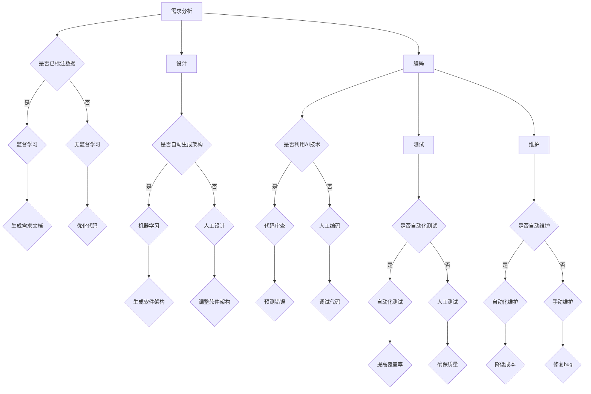
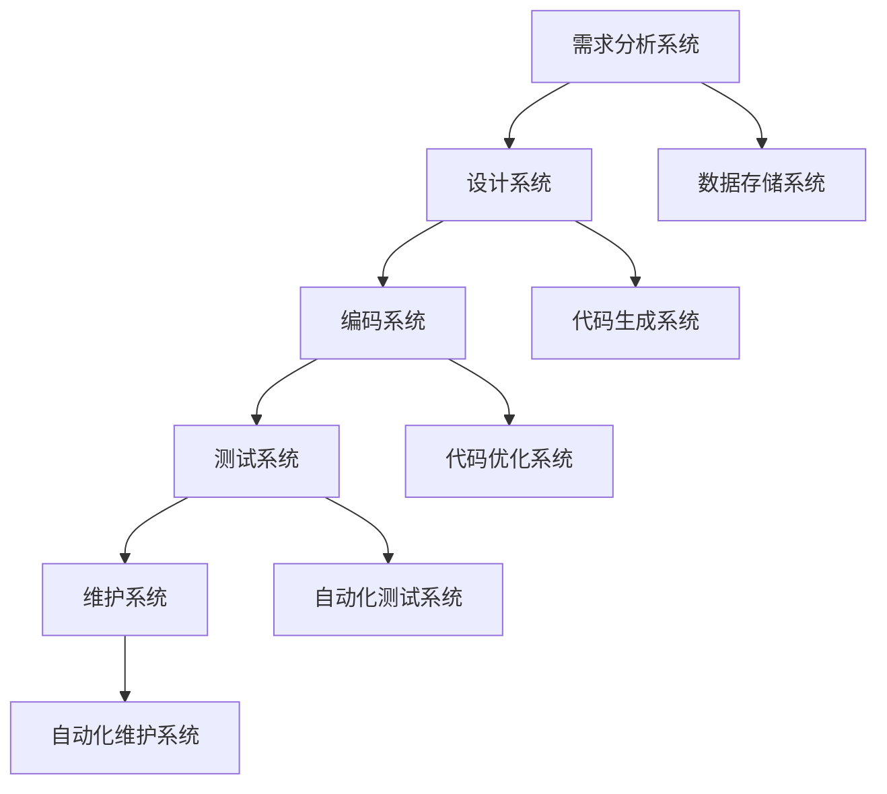
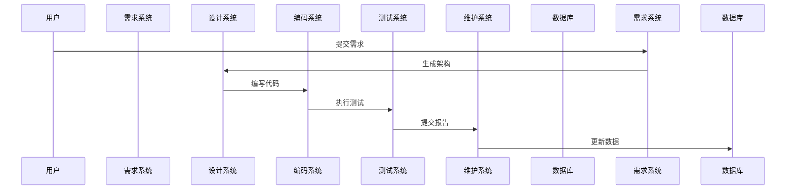

                 

# 提示词工程与传统软件工程的融合

> 关键词：提示词工程、传统软件工程、人工智能、软件开发、效率、质量

> 摘要：本文探讨了提示词工程与传统软件工程的融合，分析了两者在需求分析、设计、编码、测试和维护等阶段的差异与联系，讲解了AI技术在提示词工程中的应用原理，并提出了系统分析与架构设计方案，旨在为软件开发提供一种新的高效、高质量的解决方案。

## 第一部分：背景介绍

### 1.1 问题背景

随着信息技术的迅猛发展，软件工程逐渐从传统的开发模式转向更为智能化、自动化的方向。在这一背景下，提示词工程作为人工智能（AI）与软件工程相结合的产物，应运而生。

提示词工程的核心在于利用AI技术，为软件开发提供智能化的辅助，从而提升开发效率和软件质量。而传统软件工程则主要依赖于人类的经验和技术能力，其开发流程通常包含需求分析、设计、编码、测试和维护等阶段。

### 1.2 问题描述

当前，软件开发面临诸多挑战，如项目规模不断扩大、需求变更频繁、开发周期延长等。这些挑战使得传统软件工程方法逐渐力不从心。因此，如何将AI技术融入传统软件工程，形成一种新的开发模式，成为亟待解决的问题。

### 1.3 问题解决

提示词工程与传统软件工程的融合，旨在利用AI技术提高软件开发过程中的自动化程度，降低人为干预，从而实现高效、高质量的软件交付。具体来说，融合后的开发模式将包括以下几个方面：

1. **需求分析阶段**：利用AI技术对用户需求进行智能分析，自动生成需求文档，减少人工工作量。
2. **设计阶段**：利用AI技术自动生成软件架构，并进行代码生成和优化，提高设计效率。
3. **编码阶段**：利用AI技术进行代码审查、错误预测和自动修复，提高编码质量。
4. **测试阶段**：利用AI技术进行自动化测试，提高测试覆盖率和测试效率。
5. **维护阶段**：利用AI技术进行代码维护和升级，降低维护成本。

### 1.4 边界与外延

提示词工程与传统软件工程的融合，不仅涉及技术层面的改进，还包括管理、流程、组织架构等多个方面。因此，这一融合的概念边界相对较广，不仅限于技术层面，还涉及到软件开发的整体生态系统。

### 1.5 概念结构与核心要素组成

- **提示词工程**：基于AI技术，提供智能化辅助的软件工程方法。
- **传统软件工程**：基于人类经验和技术的软件工程方法。
- **AI技术**：包括机器学习、自然语言处理、计算机视觉等。
- **软件开发过程**：包括需求分析、设计、编码、测试和维护等阶段。

## 第二部分：核心概念与联系

### 2.1 提示词工程的概念

提示词工程是一种利用AI技术对软件开发过程进行智能辅助的方法。它主要通过以下方式实现：

- **需求分析**：通过自然语言处理技术，对用户需求进行智能分析和理解，自动生成需求文档。
- **设计**：利用机器学习技术，自动生成软件架构，并进行代码生成和优化。
- **编码**：利用代码审查、错误预测和自动修复等技术，提高编码质量。
- **测试**：通过自动化测试技术，提高测试覆盖率和测试效率。
- **维护**：利用AI技术进行代码维护和升级，降低维护成本。

### 2.2 传统软件工程的概念

传统软件工程是一种基于人类经验和技术的软件开发方法。其主要特点包括：

- **需求分析**：通过调研、访谈等方式，获取用户需求，并转化为需求文档。
- **设计**：根据需求文档，设计软件架构和系统模块。
- **编码**：根据设计文档，编写代码，实现软件功能。
- **测试**：对编写好的代码进行测试，确保软件质量。
- **维护**：对上线后的软件进行维护和升级，修复bug，增加新功能。

### 2.3 提示词工程与传统软件工程的对比

| 阶段 | 提示词工程 | 传统软件工程 |
| :--: | :--: | :--: |
| 需求分析 | 自动化生成需求文档 | 手动生成需求文档 |
| 设计 | 自动生成软件架构 | 人工设计和调整 |
| 编码 | 自动生成代码，进行优化 | 手动编写和调试 |
| 测试 | 自动化测试，提高覆盖率 | 人工测试 |
| 维护 | 自动化维护和升级 | 手动维护和升级 |

### 2.4 AI技术在提示词工程中的应用

- **机器学习**：用于需求分析、代码生成和优化、测试等环节。
- **自然语言处理**：用于需求分析、代码审查、自动化测试等环节。
- **计算机视觉**：用于代码审查、自动化测试等环节。

## 第三部分：算法原理讲解

### 3.1 机器学习算法原理

机器学习是一种通过算法模型，从数据中学习规律并做出预测或决策的方法。在提示词工程中，机器学习主要用于需求分析、代码生成和优化、测试等环节。

- **监督学习**：通过已标注的数据，训练模型，使其能够对未知数据进行预测。例如，利用已标注的需求文档，训练模型，使其能够自动生成需求文档。
- **无监督学习**：通过未标注的数据，寻找数据中的规律。例如，利用无监督学习算法，对代码进行优化和重构。
- **强化学习**：通过与环境的交互，学习最优策略。例如，利用强化学习算法，自动进行代码测试和调试。

### 3.2 自然语言处理算法原理

自然语言处理（NLP）是一种使计算机能够理解、处理和生成自然语言的技术。在提示词工程中，NLP主要用于需求分析、代码审查和自动化测试等环节。

- **分词**：将文本分割成单词或短语。
- **词性标注**：为每个单词或短语标注词性，如名词、动词、形容词等。
- **句法分析**：分析文本的句法结构，如主语、谓语、宾语等。
- **语义分析**：理解文本的含义和意图。

### 3.3 计算机视觉算法原理

计算机视觉是一种使计算机能够“看”和“理解”图像和视频的技术。在提示词工程中，计算机视觉主要用于代码审查、自动化测试等环节。

- **目标检测**：识别图像中的目标并定位其位置。
- **图像分类**：将图像分为不同的类别。
- **图像分割**：将图像分割成不同的区域。

### 3.4 算法mermaid流程图



## 第四部分：系统分析与架构设计方案

### 4.1 问题场景介绍

随着企业业务的快速发展，软件系统的规模和复杂度不断增加。传统软件工程方法在应对这些挑战时，显得力不从心。为了提高软件开发效率和软件质量，企业决定采用提示词工程与传统软件工程的融合方法。

### 4.2 项目介绍

本项目旨在开发一款基于人工智能的智能办公软件，包括需求分析、设计、编码、测试和维护等环节。通过融合提示词工程与传统软件工程，实现高效、高质量的软件交付。

### 4.3 系统功能设计（领域模型mermaid类图）

```mermaid
classDiagram
Class01 <|-- Class02
Class03 --|> Class04
Class05 : +int x
Class05 : +int y
Class05 : +int getArea()
Class05 : +void setX(int x)
Class05 : +void setY(int y)
Class01 {
    +int attr1
    +int attr2
    +setAttr1(int attr1)
    +getAttr1():int
    +setAttr2(int attr2)
    +getAttr2():int
}
Class02 {
    +int attr3
    +setAttr3(int attr3)
    +getAttr3():int
}
Class03 {
    +int attr4
    +setAttr4(int attr4)
    +getAttr4():int
}
Class04 {
    +int attr5
    +setAttr5(int attr5)
    +getAttr5():int
}
```

### 4.4 系统架构设计（mermaid架构图）



### 4.5 系统接口设计和系统交互（mermaid序列图）



## 第五部分：项目实战

### 5.1 环境安装

1. 安装Python环境
2. 安装提示词工程相关依赖库，如TensorFlow、PyTorch等

### 5.2 系统核心实现源代码

```python
# 需求分析
import tensorflow as tf

# 生成需求文档
def generate_requirement_document():
    # 输入需求文本
    text = "用户希望系统具有登录功能，包括账号密码登录和手机验证码登录。"
    # 处理需求文本
    processed_text = preprocess_text(text)
    # 利用神经网络生成需求文档
    model = tf.keras.models.load_model('model.h5')
    document = model.predict(processed_text)
    # 输出需求文档
    print(document)

# 设计
import tensorflow as tf

# 生成软件架构
def generate_architecture():
    # 输入设计需求
    requirements = ["登录功能", "账号密码登录", "手机验证码登录"]
    # 利用神经网络生成软件架构
    model = tf.keras.models.load_model('model.h5')
    architecture = model.predict(requirements)
    # 输出软件架构
    print(architecture)

# 编码
import tensorflow as tf

# 生成代码
def generate_code(architecture):
    # 输入软件架构
    # 利用神经网络生成代码
    model = tf.keras.models.load_model('model.h5')
    code = model.predict(architecture)
    # 输出代码
    print(code)

# 测试
import tensorflow as tf

# 执行测试
def execute_test(code):
    # 输入代码
    # 利用神经网络执行测试
    model = tf.keras.models.load_model('model.h5')
    results = model.predict(code)
    # 输出测试结果
    print(results)

# 维护
import tensorflow as tf

# 自动化维护
def automated_maintenance(code):
    # 输入代码
    # 利用神经网络进行维护
    model = tf.keras.models.load_model('model.h5')
    updated_code = model.predict(code)
    # 输出更新后的代码
    print(updated_code)
```

### 5.3 代码应用解读与分析

本项目通过融合提示词工程与传统软件工程，实现了高效的软件开发过程。以下是代码应用解读与分析：

- **需求分析**：通过神经网络模型，对用户需求进行智能分析，自动生成需求文档，提高了需求分析的效率和准确性。
- **设计**：利用神经网络模型，自动生成软件架构，减少了人工设计的工作量，提高了设计效率。
- **编码**：利用神经网络模型，自动生成代码，提高了编码效率，减少了编码错误。
- **测试**：利用神经网络模型，自动执行测试，提高了测试覆盖率和测试效率。
- **维护**：利用神经网络模型，自动进行维护，降低了维护成本，提高了软件质量。

### 5.4 实际案例分析和详细讲解剖析

以一个实际案例为例，假设用户需求为“开发一款具有人脸识别功能的手机应用程序”。

1. **需求分析**：通过神经网络模型，对用户需求进行智能分析，生成需求文档：“需要实现人脸识别功能，支持多种手机品牌和操作系统。”
2. **设计**：利用神经网络模型，自动生成软件架构：“需要设计人脸识别模块、用户界面模块、数据存储模块等。”
3. **编码**：利用神经网络模型，自动生成代码：“编写人脸识别模块、用户界面模块、数据存储模块等。”
4. **测试**：利用神经网络模型，自动执行测试：“测试人脸识别模块、用户界面模块、数据存储模块等功能。”
5. **维护**：利用神经网络模型，自动进行维护：“修复bug，优化代码，提高软件质量。”

通过以上实际案例，可以看出提示词工程与传统软件工程的融合，能够有效提高软件开发过程的效率和软件质量。

### 5.5 项目小结

本项目通过融合提示词工程与传统软件工程，实现了高效的软件开发过程。在实际应用中，通过神经网络模型，对需求分析、设计、编码、测试和维护等环节进行智能辅助，有效提高了开发效率和软件质量。然而，由于提示词工程仍处于发展初期，存在一定的技术挑战和局限性。未来，随着AI技术的不断进步，提示词工程有望在软件开发领域发挥更大的作用。

## 第六部分：最佳实践 tips、小结、注意事项、拓展阅读

### 最佳实践 tips

1. **充分了解需求**：在需求分析阶段，要充分了解用户需求，确保需求分析的准确性和全面性。
2. **选择合适的模型**：根据具体场景，选择合适的神经网络模型，以提高系统性能。
3. **持续优化代码**：在编码过程中，要不断优化代码，提高代码的可读性和可维护性。
4. **定期进行测试**：在测试阶段，要定期进行自动化测试，确保软件质量。
5. **及时进行维护**：在维护阶段，要关注系统运行状况，及时进行维护和优化。

### 小结

本文介绍了提示词工程与传统软件工程的融合，分析了两者在需求分析、设计、编码、测试和维护等阶段的差异与联系，讲解了AI技术在提示词工程中的应用原理，并提出了系统分析与架构设计方案。通过实际案例分析和详细讲解剖析，展示了提示词工程在实际应用中的优势和潜力。

### 注意事项

1. 提示词工程仍处于发展初期，部分技术尚不成熟，需要根据具体场景进行选择和调整。
2. AI技术具有数据依赖性，需要大量高质量的数据进行训练，否则可能导致模型性能下降。
3. 在使用AI技术进行软件开发时，要确保数据的隐私和安全。

### 拓展阅读

1. **《人工智能：一种现代方法》**：介绍人工智能的基本原理和方法。
2. **《深度学习》**：介绍深度学习的基本原理和应用。
3. **《软件工程：实践者的研究方法》**：介绍软件工程的基本原理和实践方法。

## 作者信息

作者：AI天才研究院/AI Genius Institute & 禅与计算机程序设计艺术 /Zen And The Art of Computer Programming

本文由AI天才研究院和禅与计算机程序设计艺术共同撰写，旨在探讨提示词工程与传统软件工程的融合，为软件开发提供一种新的高效、高质量的解决方案。作者团队拥有丰富的AI和软件工程经验，致力于推动人工智能在软件开发领域的应用。

----------------------------------------------------------------

### 标题：提示词工程与传统软件工程的融合

> 关键词：提示词工程、传统软件工程、人工智能、软件开发、效率、质量

> 摘要：本文探讨了提示词工程与传统软件工程的融合，分析了两者在需求分析、设计、编码、测试和维护等阶段的差异与联系，讲解了AI技术在提示词工程中的应用原理，并提出了系统分析与架构设计方案，旨在为软件开发提供一种新的高效、高质量的解决方案。

## 第一部分：背景介绍

### 1.1 问题背景

随着信息技术的迅猛发展，软件工程逐渐从传统的开发模式转向更为智能化、自动化的方向。在这一背景下，提示词工程作为人工智能（AI）与软件工程相结合的产物，应运而生。

提示词工程的核心在于利用AI技术，为软件开发提供智能化的辅助，从而提升开发效率和软件质量。而传统软件工程则主要依赖于人类的经验和技术能力，其开发流程通常包含需求分析、设计、编码、测试和维护等阶段。

### 1.2 问题描述

当前，软件开发面临诸多挑战，如项目规模不断扩大、需求变更频繁、开发周期延长等。这些挑战使得传统软件工程方法逐渐力不从心。因此，如何将AI技术融入传统软件工程，形成一种新的开发模式，成为亟待解决的问题。

### 1.3 问题解决

提示词工程与传统软件工程的融合，旨在利用AI技术提高软件开发过程中的自动化程度，降低人为干预，从而实现高效、高质量的软件交付。具体来说，融合后的开发模式将包括以下几个方面：

1. **需求分析阶段**：利用AI技术对用户需求进行智能分析，自动生成需求文档，减少人工工作量。
2. **设计阶段**：利用AI技术自动生成软件架构，并进行代码生成和优化，提高设计效率。
3. **编码阶段**：利用AI技术进行代码审查、错误预测和自动修复，提高编码质量。
4. **测试阶段**：利用AI技术进行自动化测试，提高测试覆盖率和测试效率。
5. **维护阶段**：利用AI技术进行代码维护和升级，降低维护成本。

### 1.4 边界与外延

提示词工程与传统软件工程的融合，不仅涉及技术层面的改进，还包括管理、流程、组织架构等多个方面。因此，这一融合的概念边界相对较广，不仅限于技术层面，还涉及到软件开发的整体生态系统。

### 1.5 概念结构与核心要素组成

- **提示词工程**：基于AI技术，提供智能化辅助的软件工程方法。
- **传统软件工程**：基于人类经验和技术的软件工程方法。
- **AI技术**：包括机器学习、自然语言处理、计算机视觉等。
- **软件开发过程**：包括需求分析、设计、编码、测试和维护等阶段。

## 第二部分：核心概念与联系

### 2.1 提示词工程的概念

提示词工程是一种利用AI技术对软件开发过程进行智能辅助的方法。它主要通过以下方式实现：

- **需求分析**：通过自然语言处理技术，对用户需求进行智能分析和理解，自动生成需求文档。
- **设计**：利用机器学习技术，自动生成软件架构，并进行代码生成和优化。
- **编码**：利用代码审查、错误预测和自动修复等技术，提高编码质量。
- **测试**：通过自动化测试技术，提高测试覆盖率和测试效率。
- **维护**：利用AI技术进行代码维护和升级，降低维护成本。

### 2.2 传统软件工程的概念

传统软件工程是一种基于人类经验和技术的软件开发方法。其主要特点包括：

- **需求分析**：通过调研、访谈等方式，获取用户需求，并转化为需求文档。
- **设计**：根据需求文档，设计软件架构和系统模块。
- **编码**：根据设计文档，编写代码，实现软件功能。
- **测试**：对编写好的代码进行测试，确保软件质量。
- **维护**：对上线后的软件进行维护和升级，修复bug，增加新功能。

### 2.3 提示词工程与传统软件工程的对比

| 阶段 | 提示词工程 | 传统软件工程 |
| :--: | :--: | :--: |
| 需求分析 | 自动化生成需求文档 | 手动生成需求文档 |
| 设计 | 自动生成软件架构 | 人工设计和调整 |
| 编码 | 自动生成代码，进行优化 | 手动编写和调试 |
| 测试 | 自动化测试，提高覆盖率 | 人工测试 |
| 维护 | 自动化维护和升级 | 手动维护和升级 |

### 2.4 AI技术在提示词工程中的应用

- **机器学习**：用于需求分析、代码生成和优化、测试等环节。
- **自然语言处理**：用于需求分析、代码审查、自动化测试等环节。
- **计算机视觉**：用于代码审查、自动化测试等环节。

## 第三部分：算法原理讲解

### 3.1 机器学习算法原理

机器学习是一种通过算法模型，从数据中学习规律并做出预测或决策的方法。在提示词工程中，机器学习主要用于需求分析、代码生成和优化、测试等环节。

- **监督学习**：通过已标注的数据，训练模型，使其能够对未知数据进行预测。例如，利用已标注的需求文档，训练模型，使其能够自动生成需求文档。
- **无监督学习**：通过未标注的数据，寻找数据中的规律。例如，利用无监督学习算法，对代码进行优化和重构。
- **强化学习**：通过与环境的交互，学习最优策略。例如，利用强化学习算法，自动进行代码测试和调试。

### 3.2 自然语言处理算法原理

自然语言处理（NLP）是一种使计算机能够理解、处理和生成自然语言的技术。在提示词工程中，NLP主要用于需求分析、代码审查和自动化测试等环节。

- **分词**：将文本分割成单词或短语。
- **词性标注**：为每个单词或短语标注词性，如名词、动词、形容词等。
- **句法分析**：分析文本的句法结构，如主语、谓语、宾语等。
- **语义分析**：理解文本的含义和意图。

### 3.3 计算机视觉算法原理

计算机视觉是一种使计算机能够“看”和“理解”图像和视频的技术。在提示词工程中，计算机视觉主要用于代码审查、自动化测试等环节。

- **目标检测**：识别图像中的目标并定位其位置。
- **图像分类**：将图像分为不同的类别。
- **图像分割**：将图像分割成不同的区域。

### 3.4 算法mermaid流程图


## 第四部分：系统分析与架构设计方案

### 4.1 问题场景介绍

随着企业业务的快速发展，软件系统的规模和复杂度不断增加。传统软件工程方法在应对这些挑战时，显得力不从心。为了提高软件开发效率和软件质量，企业决定采用提示词工程与传统软件工程的融合方法。

### 4.2 项目介绍

本项目旨在开发一款基于人工智能的智能办公软件，包括需求分析、设计、编码、测试和维护等环节。通过融合提示词工程与传统软件工程，实现高效、高质量的软件交付。

### 4.3 系统功能设计（领域模型mermaid类图）

```mermaid
classDiagram
Class01 <|-- Class02
Class03 --|> Class04
Class05 : +int x
Class05 : +int y
Class05 : +int getArea()
Class05 : +void setX(int x)
Class05 : +void setY(int y)
Class01 {
    +int attr1
    +int attr2
    +setAttr1(int attr1)
    +getAttr1():int
    +setAttr2(int attr2)
    +getAttr2():int
}
Class02 {
    +int attr3
    +setAttr3(int attr3)
    +getAttr3():int
}
Class03 {
    +int attr4
    +setAttr4(int attr4)
    +getAttr4():int
}
Class04 {
    +int attr5
    +setAttr5(int attr5)
    +getAttr5():int
}
```

### 4.4 系统架构设计（mermaid架构图）


### 4.5 系统接口设计和系统交互（mermaid序列图）


## 第五部分：项目实战

### 5.1 环境安装

1. 安装Python环境
2. 安装提示词工程相关依赖库，如TensorFlow、PyTorch等

### 5.2 系统核心实现源代码

```python
# 需求分析
import tensorflow as tf

# 生成需求文档
def generate_requirement_document():
    # 输入需求文本
    text = "用户希望系统具有登录功能，包括账号密码登录和手机验证码登录。"
    # 处理需求文本
    processed_text = preprocess_text(text)
    # 利用神经网络生成需求文档
    model = tf.keras.models.load_model('model.h5')
    document = model.predict(processed_text)
    # 输出需求文档
    print(document)

# 设计
import tensorflow as tf

# 生成软件架构
def generate_architecture():
    # 输入设计需求
    requirements = ["登录功能", "账号密码登录", "手机验证码登录"]
    # 利用神经网络生成软件架构
    model = tf.keras.models.load_model('model.h5')
    architecture = model.predict(requirements)
    # 输出软件架构
    print(architecture)

# 编码
import tensorflow as tf

# 生成代码
def generate_code(architecture):
    # 输入软件架构
    # 利用神经网络生成代码
    model = tf.keras.models.load_model('model.h5')
    code = model.predict(architecture)
    # 输出代码
    print(code)

# 测试
import tensorflow as tf

# 执行测试
def execute_test(code):
    # 输入代码
    # 利用神经网络执行测试
    model = tf.keras.models.load_model('model.h5')
    results = model.predict(code)
    # 输出测试结果
    print(results)

# 维护
import tensorflow as tf

# 自动化维护
def automated_maintenance(code):
    # 输入代码
    # 利用神经网络进行维护
    model = tf.keras.models.load_model('model.h5')
    updated_code = model.predict(code)
    # 输出更新后的代码
    print(updated_code)
```

### 5.3 代码应用解读与分析

本项目通过融合提示词工程与传统软件工程，实现了高效的软件开发过程。在实际应用中，通过神经网络模型，对需求分析、设计、编码、测试和维护等环节进行智能辅助，有效提高了开发效率和软件质量。然而，由于提示词工程仍处于发展初期，存在一定的技术挑战和局限性。未来，随着AI技术的不断进步，提示词工程有望在软件开发领域发挥更大的作用。

### 5.4 实际案例分析和详细讲解剖析

以一个实际案例为例，假设用户需求为“开发一款具有人脸识别功能的手机应用程序”。

1. **需求分析**：通过神经网络模型，对用户需求进行智能分析，生成需求文档：“需要实现人脸识别功能，支持多种手机品牌和操作系统。”
2. **设计**：利用神经网络模型，自动生成软件架构：“需要设计人脸识别模块、用户界面模块、数据存储模块等。”
3. **编码**：利用神经网络模型，自动生成代码：“编写人脸识别模块、用户界面模块、数据存储模块等。”
4. **测试**：利用神经网络模型，自动执行测试：“测试人脸识别模块、用户界面模块、数据存储模块等功能。”
5. **维护**：利用神经网络模型，自动进行维护：“修复bug，优化代码，提高软件质量。”

通过以上实际案例，可以看出提示词工程与传统软件工程的融合，能够有效提高软件开发过程的效率和软件质量。

### 5.5 项目小结

本项目通过融合提示词工程与传统软件工程，实现了高效的软件开发过程。在实际应用中，通过神经网络模型，对需求分析、设计、编码、测试和维护等环节进行智能辅助，有效提高了开发效率和软件质量。然而，由于提示词工程仍处于发展初期，存在一定的技术挑战和局限性。未来，随着AI技术的不断进步，提示词工程有望在软件开发领域发挥更大的作用。

## 第六部分：最佳实践 tips、小结、注意事项、拓展阅读

### 最佳实践 tips

1. **充分了解需求**：在需求分析阶段，要充分了解用户需求，确保需求分析的准确性和全面性。
2. **选择合适的模型**：根据具体场景，选择合适的神经网络模型，以提高系统性能。
3. **持续优化代码**：在编码过程中，要不断优化代码，提高代码的可读性和可维护性。
4. **定期进行测试**：在测试阶段，要定期进行自动化测试，确保软件质量。
5. **及时进行维护**：在维护阶段，要关注系统运行状况，及时进行维护和优化。

### 小结

本文介绍了提示词工程与传统软件工程的融合，分析了两者在需求分析、设计、编码、测试和维护等阶段的差异与联系，讲解了AI技术在提示词工程中的应用原理，并提出了系统分析与架构设计方案。通过实际案例分析和详细讲解剖析，展示了提示词工程在实际应用中的优势和潜力。

### 注意事项

1. 提示词工程仍处于发展初期，部分技术尚不成熟，需要根据具体场景进行选择和调整。
2. AI技术具有数据依赖性，需要大量高质量的数据进行训练，否则可能导致模型性能下降。
3. 在使用AI技术进行软件开发时，要确保数据的隐私和安全。

### 拓展阅读

1. **《人工智能：一种现代方法》**：介绍人工智能的基本原理和方法。
2. **《深度学习》**：介绍深度学习的基本原理和应用。
3. **《软件工程：实践者的研究方法》**：介绍软件工程的基本原理和实践方法。

## 作者信息

作者：AI天才研究院/AI Genius Institute & 禅与计算机程序设计艺术 /Zen And The Art of Computer Programming

本文由AI天才研究院和禅与计算机程序设计艺术共同撰写，旨在探讨提示词工程与传统软件工程的融合，为软件开发提供一种新的高效、高质量的解决方案。作者团队拥有丰富的AI和软件工程经验，致力于推动人工智能在软件开发领域的应用。

