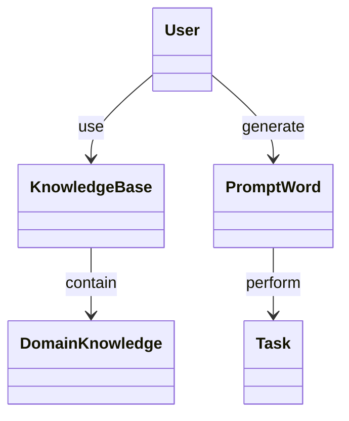
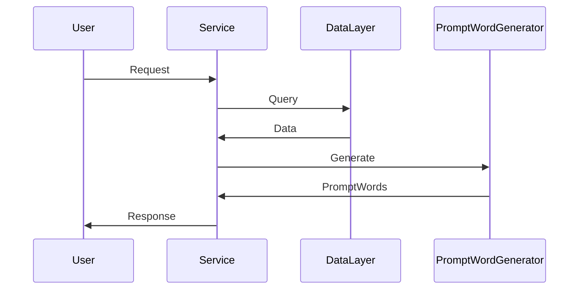
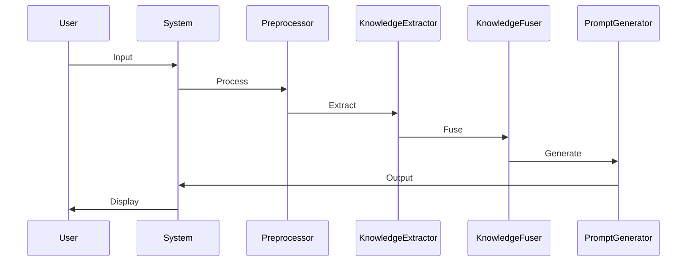

                 

# 《提示词工程中的领域知识融合》

## 关键词：提示词工程、领域知识融合、算法、系统架构、实战、最佳实践

## 摘要

本文将探讨提示词工程中的领域知识融合问题，首先介绍提示词工程和领域知识的基本概念，然后详细阐述领域知识融合的方法和流程。接着，我们将分析提示词生成算法，并探讨其在实际项目中的应用和最佳实践。文章最后将给出一个完整的系统架构设计和项目实战案例，以便读者更好地理解和应用所学的知识。

## 第1章 引言

### 1.1 问题背景

随着人工智能和大数据技术的快速发展，数据驱动的应用程序逐渐成为主流。在这些应用程序中，提示词工程作为一种重要的技术手段，被广泛应用于信息检索、自然语言处理、推荐系统等领域。然而，随着应用场景的复杂化和多样化，单纯依赖数据本身进行提示词工程已经难以满足需求。领域知识的融合成为提升提示词工程效果的关键。

领域知识是指特定领域内具有普遍性和规律性的知识，这些知识可以来自于专业书籍、文献、数据库、专家经验等。在提示词工程中，融合领域知识能够帮助系统更好地理解用户意图，提高信息检索和推荐的准确性。

### 1.2 问题描述

在提示词工程中，领域知识融合面临以下挑战：

1. **数据多样性**：不同领域的数据具有不同的结构和特征，如何高效地处理和整合这些数据成为一个问题。
2. **知识不一致**：领域知识可能存在冲突或不一致的情况，如何解决这些问题是一个挑战。
3. **知识表示**：如何将抽象的领域知识转换为计算机可以处理的形式，这是一个技术难题。
4. **知识更新**：领域知识是动态变化的，如何及时更新领域知识库也是一个关键问题。

### 1.3 问题解决

为了解决上述问题，我们可以采取以下方法：

1. **数据预处理**：通过数据清洗、整合和标准化，提高数据的统一性和可用性。
2. **知识抽取**：利用自然语言处理技术和机器学习算法，从数据中提取出关键的领域知识。
3. **知识融合**：设计有效的知识融合策略和算法，将不同来源的领域知识进行整合。
4. **知识更新**：建立自动化机制，定期更新领域知识库，确保知识的时效性和准确性。

### 1.4 边界与外延

提示词工程中的领域知识融合涉及到多个层面：

1. **技术层面**：涉及数据预处理、知识抽取、知识融合等技术。
2. **应用层面**：应用于各种信息检索、推荐系统和自然语言处理任务。
3. **领域层面**：需要针对不同领域制定特定的知识融合策略。

### 1.5 概念结构与核心要素组成

提示词工程中的领域知识融合主要由以下核心要素组成：

1. **数据源**：提供领域知识的原始数据。
2. **知识抽取模块**：负责从数据中提取出领域知识。
3. **知识融合模块**：负责将不同来源的领域知识进行整合。
4. **知识库**：存储整合后的领域知识。
5. **提示词生成模块**：利用领域知识生成有效的提示词。
6. **用户接口**：提供与用户交互的界面。

## 第2章 核心概念与联系

### 2.1 提示词工程的定义

提示词工程是一种利用自然语言处理技术，从文本数据中提取出关键信息，以支持信息检索、推荐系统和自然语言处理等任务的技术。提示词可以是单词、短语或句子，它们能够准确表达用户的意图或问题的核心。

### 2.2 领域知识的定义

领域知识是指特定领域内具有普遍性和规律性的知识，它们可以来自于专业书籍、文献、数据库、专家经验等。领域知识是对领域内事物和现象的抽象和总结，能够帮助系统更好地理解领域问题。

### 2.3 提示词工程与领域知识的联系

提示词工程与领域知识有着紧密的联系：

1. **依赖关系**：提示词工程依赖于领域知识，领域知识是生成有效提示词的基础。
2. **支持关系**：领域知识为提示词工程提供支持，帮助系统更好地理解用户意图和领域问题。

### 2.4 概念属性特征对比表格

| 特征 | 提示词工程 | 领域知识 |
| --- | --- | --- |
| 目标 | 提取关键信息 | 总结领域规律 |
| 数据源 | 文本数据 | 领域文献、数据库、专家经验 |
| 抽取方法 | 自然语言处理技术 | 知识抽取算法 |
| 应用领域 | 信息检索、推荐系统、自然语言处理 | 各领域专业应用 |

### 2.5 ER实体关系图架构

#### 2.5.1 提示词工程的ER图

```mermaid
erDiagram
  User ||--|{ KnowledgeBase }|>
  User ||--|{ PromptWord }|>
  PromptWord ||--|{ Task }|>
  KnowledgeBase ||--|{ Document }|>
```

#### 2.5.2 领域知识的ER图

```mermaid
erDiagram
  DomainKnowledge ||--|{ KnowledgeBase }|>
  DomainKnowledge ||--|{ ExpertKnowledge }|>
  DomainKnowledge ||--|{ DataKnowledge }|>
  KnowledgeBase ||--|{ Document }|>
```

## 第3章 领域知识融合方法

### 3.1 数据预处理

数据预处理是领域知识融合的基础，它包括数据清洗、整合和标准化等步骤。

#### 3.1.1 数据清洗

数据清洗是指去除数据中的噪声和冗余信息，确保数据的质量。常用的方法包括去除停用词、去除特殊字符、填补缺失值等。

#### 3.1.2 数据整合

数据整合是指将不同来源的数据进行合并，形成一个统一的数据集。常用的方法包括数据融合、数据融合算法和数据关联等。

#### 3.1.3 数据标准化

数据标准化是指将不同类型的数据转换为同一类型的数据，以便进行后续处理。常用的方法包括数值化、编码和规范化等。

### 3.2 知识抽取

知识抽取是指从数据中提取出领域知识。常用的方法包括实体识别、关系抽取和属性抽取等。

#### 3.2.1 实体识别

实体识别是指识别出数据中的实体，如人名、地名、组织名等。常用的方法包括基于规则的方法和基于机器学习的方法。

#### 3.2.2 关系抽取

关系抽取是指识别出实体之间的关系，如“张三”和“工作”之间的关系。常用的方法包括基于规则的方法和基于机器学习的方法。

#### 3.2.3 属性抽取

属性抽取是指识别出实体的属性，如“张三”的“年龄”。常用的方法包括基于规则的方法和基于机器学习的方法。

### 3.3 知识融合

知识融合是指将不同来源的领域知识进行整合。常用的方法包括基于规则的方法和基于机器学习的方法。

#### 3.3.1 知识融合策略

知识融合策略是指如何将不同来源的领域知识进行整合。常用的策略包括合并、对比、交叉和综合等。

#### 3.3.2 知识融合算法

知识融合算法是指实现知识融合的具体方法。常用的算法包括逻辑推理算法、聚类算法、关联规则算法等。

#### 3.3.3 知识融合评估

知识融合评估是指评估知识融合的效果。常用的评估方法包括准确率、召回率、F1值等。

## 第4章 提示词生成算法

### 4.1 基于规则的方法

基于规则的方法是指利用预设的规则来生成提示词。常用的方法包括关键词提取、短语提取和句子提取等。

#### 4.1.1 提示词规则库构建

提示词规则库是指存储提示词生成规则的数据库。构建提示词规则库的方法包括手工编写和自动生成等。

#### 4.1.2 提示词生成流程

提示词生成流程是指按照预设的规则生成提示词的过程。生成流程通常包括以下步骤：

1. 数据预处理
2. 提取关键词
3. 构建短语
4. 生成句子

#### 4.1.3 算法mermaid流程图


### 4.2 基于机器学习的方法

基于机器学习的方法是指利用机器学习算法来生成提示词。常用的方法包括分类算法、聚类算法和生成模型等。

#### 4.2.1 提示词生成模型构建

提示词生成模型是指用于生成提示词的机器学习模型。构建提示词生成模型的方法包括训练数据集的预处理、模型的选择和训练等。

#### 4.2.2 模型训练与优化

模型训练与优化是指对提示词生成模型进行训练和优化，以提高模型的性能。常用的方法包括调整超参数、增加训练数据和模型调优等。

#### 4.2.3 算法mermaid流程图


### 4.3 基于深度学习的方法

基于深度学习的方法是指利用深度学习算法来生成提示词。常用的方法包括循环神经网络（RNN）、长短期记忆网络（LSTM）和变换器（Transformer）等。

#### 4.3.1 提示词生成网络构建

提示词生成网络是指用于生成提示词的深度学习模型。构建提示词生成网络的方法包括选择网络架构、定义损失函数和优化器等。

#### 4.3.2 网络训练与优化

网络训练与优化是指对提示词生成网络进行训练和优化，以提高模型的性能。常用的方法包括调整超参数、增加训练数据和模型调优等。

#### 4.3.3 算法mermaid流程图


## 第5章 系统分析与架构设计

### 5.1 问题场景介绍

问题场景是指提示词工程在具体应用中的实际场景。例如，在一个电子商务平台上，用户可以搜索商品，平台需要根据用户的搜索词生成相关的提示词，以帮助用户更好地找到所需商品。

### 5.2 系统功能设计

系统功能设计是指定义系统的核心功能，例如数据预处理、知识抽取、知识融合、提示词生成和用户交互等。

#### 5.2.1 领域模型mermaid类图



### 5.3 系统架构设计

系统架构设计是指定义系统的整体结构和各个模块之间的关系。一个典型的系统架构包括数据层、服务层和表示层。

#### 5.3.1 系统架构mermaid架构图



### 5.4 系统接口设计

系统接口设计是指定义系统的输入输出接口，包括用户接口、API接口等。

### 5.5 系统交互mermaid序列图



## 第6章 项目实战

### 6.1 环境安装

环境安装是指为项目搭建所需的开发环境和运行环境。例如，安装Python、TensorFlow和Scikit-learn等库。

### 6.2 系统核心实现源代码

系统核心实现源代码是指实现系统核心功能的代码。以下是一个简单的示例：

```python
import tensorflow as tf
from sklearn.feature_extraction.text import TfidfVectorizer

# 数据预处理
def preprocess(text):
    # 去除特殊字符、停用词等
    pass

# 知识抽取
def extract_knowledge(text):
    # 实体识别、关系抽取等
    pass

# 知识融合
def fuse_knowledge(knowledge1, knowledge2):
    # 知识融合策略
    pass

# 提示词生成
def generate_prompt(knowledge):
    # 基于规则或机器学习生成提示词
    pass

# 主函数
def main():
    text = "用户输入的文本"
    preprocessed_text = preprocess(text)
    knowledge = extract_knowledge(preprocessed_text)
    prompt = generate_prompt(knowledge)
    print(prompt)

if __name__ == "__main__":
    main()
```

### 6.3 代码应用解读与分析

代码应用解读与分析是指对系统核心实现源代码进行解读和分析，解释代码的执行流程和原理。

### 6.4 实际案例分析与详细讲解剖析

实际案例分析与详细讲解剖析是指通过具体案例，分析系统在实际应用中的效果和优化策略。

### 6.5 项目小结

项目小结是指对项目进行总结和反思，包括项目成果、遇到的问题和解决方案等。

## 第7章 最佳实践与拓展

### 7.1 最佳实践 tips

最佳实践 tips是指总结项目经验和教训，为读者提供一些建议和技巧。

### 7.2 小结

小结是指对整篇文章进行总结，强调关键点和要点。

### 7.3 注意事项

注意事项是指提醒读者在应用所学知识时需要注意的问题和细节。

### 7.4 拓展阅读

拓展阅读是指为读者提供进一步学习的资源和建议。

