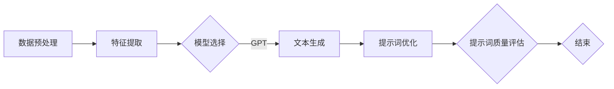
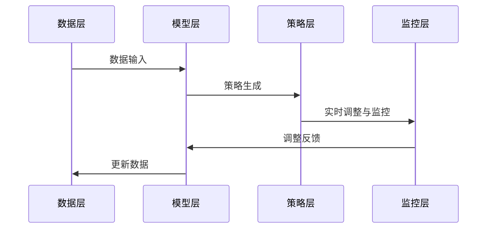
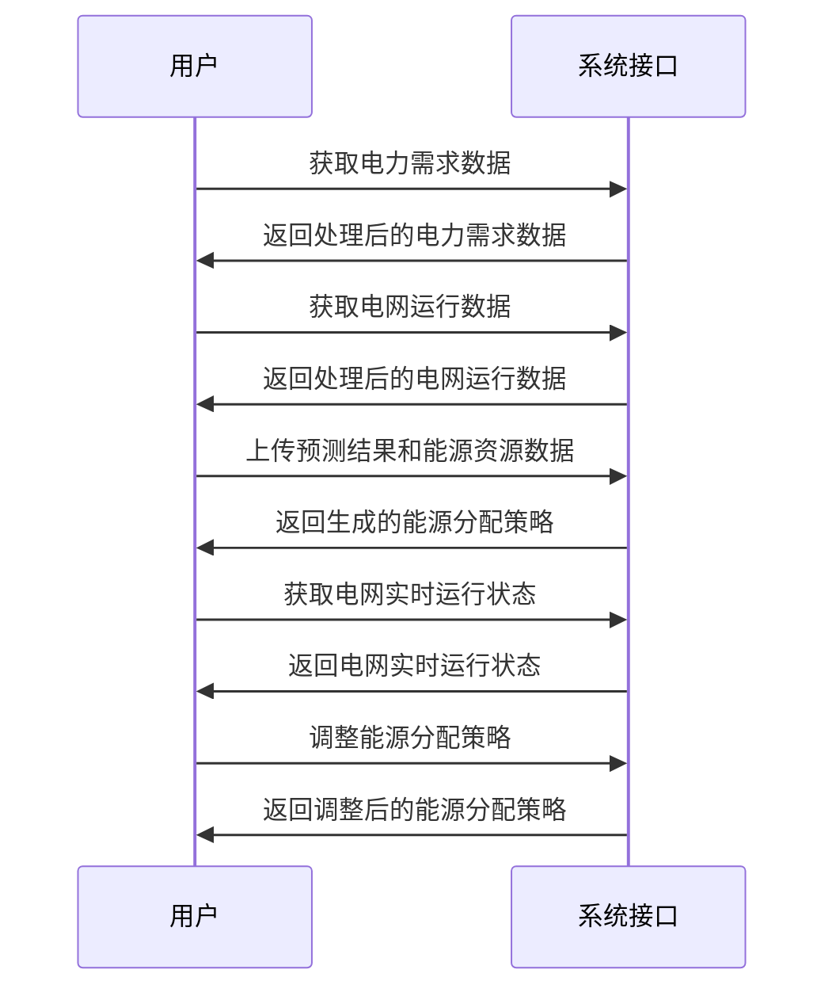

                 

# 提示词工程在智能电网管理中的应用：优化能源分配

> 关键词：智能电网管理、能源分配优化、提示词工程、算法、数学模型

> 摘要：本文将探讨提示词工程在智能电网管理中的应用，特别是在优化能源分配方面的作用。文章首先介绍了智能电网管理背景和能源分配挑战，然后详细讲解了提示词工程的基本概念和原理，以及其在能源分配优化中的算法和应用。接着，文章通过数学模型和实例，深入分析了提示词工程在智能电网管理中的具体应用。最后，文章提出了系统的架构设计方案，并进行了项目实战，以展示提示词工程在智能电网管理中的实际应用效果。

----------------------------------------------------------------

## 第一部分：背景介绍

### 1.1 问题背景

智能电网（Smart Grid）是指通过现代通信技术、传感技术、自动控制技术等手段，对电力系统进行升级改造，实现电力系统的智能化运行和管理。智能电网具有高效、可靠、灵活、可持续的特点，可以有效应对电力供需不平衡、能源浪费、电网安全等问题。

在智能电网管理中，能源分配是一个关键问题。能源分配的优化可以有效地提高电网运行效率，降低能源消耗，减少环境污染。然而，在实际应用中，能源分配面临着一系列挑战：

- **能源分配不均问题**：由于电力需求的地区差异、时段差异等因素，导致能源分配不均，部分地区出现电力过剩，而另一些地区则面临电力短缺。
- **电网负载波动问题**：电力需求的波动会导致电网负载波动，如果处理不当，可能会导致电网不稳定，影响电力供应的可靠性。
- **实时性要求**：能源分配需要实时响应电力需求的变化，这要求系统具有高实时性和快速反应能力。

### 1.2 问题描述

在智能电网管理中，能源分配优化问题可以描述为：如何在给定的能源资源约束下，通过合理的分配策略，使得电网整体的运行效率最高，同时满足各区域和时段的电力需求。

具体来说，能源分配优化问题包括以下几个方面的子问题：

- **供需平衡**：确保电网各区域、各时段的电力需求与供应平衡，避免电力过剩或短缺。
- **效率优化**：通过优化能源分配，提高电网整体的运行效率，减少能源浪费。
- **可靠性保障**：确保电力供应的可靠性，减少因电网不稳定导致的停电事故。
- **成本控制**：在能源分配过程中，需要考虑能源成本，尽可能降低电力成本。

### 1.3 问题解决

为了解决上述能源分配优化问题，可以采用提示词工程（Prompt Engineering）这一先进的技术手段。提示词工程是一种基于人工智能的自动化文本生成技术，通过学习大量已有文本数据，可以自动生成新的文本。

在智能电网管理中，提示词工程可以发挥以下作用：

- **自动生成电力需求预测模型**：通过分析历史电力数据，自动生成电力需求预测模型，为能源分配提供数据支持。
- **自动生成能源分配策略**：基于电力需求预测模型，自动生成最优的能源分配策略，实现能源的高效利用。
- **自动生成实时调整方案**：根据实时电力需求的变化，自动生成调整方案，确保电网的稳定运行。

### 1.4 边界与外延

提示词工程在智能电网管理中的应用边界主要涉及以下几个方面：

- **数据边界**：提示词工程需要大量的历史电力数据作为训练数据，数据的质量和数量直接影响模型的性能。
- **计算边界**：由于能源分配优化问题通常具有大规模和复杂性，提示词工程在计算资源和时间上需要一定的保障。
- **应用边界**：提示词工程在智能电网管理中的应用范围可以扩展到电力调度、电力交易、电力市场等多个方面。

### 1.5 概念结构与核心要素组成

智能电网管理中的提示词工程可以看作是一个由多个核心要素组成的复杂系统，这些核心要素包括：

- **数据采集与处理模块**：负责采集和预处理电力数据，为提示词工程提供高质量的数据输入。
- **模型训练与优化模块**：利用历史电力数据，训练和优化提示词模型，提高模型的预测和生成能力。
- **策略生成与优化模块**：基于提示词模型，自动生成能源分配策略，并对其进行优化。
- **实时监控与调整模块**：对实时电力需求进行监控，并根据监控结果自动调整能源分配策略。

### 1.6 本章小结

本章节主要介绍了智能电网管理中的能源分配优化问题，以及提示词工程在解决该问题中的作用。通过分析智能电网管理背景和能源分配挑战，明确了能源分配优化问题的核心内容。同时，介绍了提示词工程的基本概念和原理，以及其在能源分配优化中的应用。这些背景和概念为后续章节的深入分析奠定了基础。

----------------------------------------------------------------

## 第二部分：核心概念与联系

### 2.1 提示词工程原理

#### 2.1.1 提示词的定义

提示词（Prompt）是指用于引导文本生成的人工智能输入。在提示词工程中，提示词通常是一个短语或句子，它能够提供生成文本的主题、上下文或特定信息。

#### 2.1.2 提示词的生成与优化

提示词的生成和优化是提示词工程的关键步骤。生成提示词的过程包括以下几个方面：

- **数据预处理**：对输入数据进行清洗、格式化，提取出关键信息。
- **特征提取**：从预处理后的数据中提取出关键特征，用于生成提示词。
- **模型选择**：选择合适的文本生成模型，如GPT（Generative Pre-trained Transformer）等。
- **文本生成**：使用模型生成提示词，并根据生成结果进行优化。

提示词的优化过程主要包括以下方面：

- **内容优化**：确保提示词内容准确、清晰、连贯。
- **格式优化**：调整提示词的格式，使其更易于理解和使用。
- **语义优化**：通过调整提示词中的关键词和短语，增强其语义表达。

#### 2.1.3 提示词工程的基本流程

提示词工程的基本流程包括以下几个步骤：

1. **数据收集**：收集相关的文本数据，包括电力需求数据、电网运行数据等。
2. **数据预处理**：对收集到的数据进行清洗、格式化和特征提取。
3. **模型训练**：使用预处理后的数据训练文本生成模型，如GPT模型。
4. **提示词生成**：使用训练好的模型生成提示词。
5. **提示词优化**：对生成的提示词进行优化，确保其质量。
6. **应用**：将优化后的提示词应用于智能电网管理中的能源分配优化。

### 2.2 能源分配优化原理

#### 2.2.1 能源分配的基础概念

能源分配是指将能源资源按照一定的策略分配到不同的用户、区域或时段，以满足其电力需求。能源分配的核心概念包括：

- **能源资源**：指用于发电、输电、配电的能源，如煤炭、天然气、水能等。
- **电力需求**：指用户、区域或时段对电力的需求量。
- **分配策略**：指用于指导能源资源分配的方法和原则。

#### 2.2.2 能源分配优化的方法

能源分配优化是指通过调整能源资源的分配策略，以提高能源利用效率，降低能源浪费。常见的能源分配优化方法包括：

- **基于规则的优化**：通过预设规则，自动调整能源资源的分配。
- **基于优化的优化**：使用优化算法，如线性规划、非线性规划等，寻找最优的能源分配策略。
- **基于机器学习的优化**：利用机器学习算法，自动生成和调整能源分配策略。

#### 2.2.3 能源分配优化与提示词工程的联系

能源分配优化与提示词工程之间存在紧密的联系：

- **数据关联**：能源分配优化需要大量的电力数据作为输入，而提示词工程可以通过自动生成提示词，提供这些数据。
- **模型融合**：提示词工程可以与能源分配优化算法相结合，通过机器学习等技术，自动生成和调整能源分配策略。
- **应用拓展**：提示词工程不仅可以用于能源分配优化，还可以应用于电力需求预测、电力市场分析等多个方面，拓展智能电网管理的应用范围。

### 2.3 概念属性特征对比表格

下表对比了提示词和能源分配优化的概念属性特征：

| 概念         | 特征                         |
| ------------ | -------------------------- |
| 提示词       | 提供主题、上下文或特定信息       |
| 能源分配优化 | 提高能源利用效率，降低能源浪费   |
| 数据关联     | 提供电力数据支持               |
| 模型融合     | 结合机器学习算法               |
| 应用拓展     | 应用范围广泛，包括电力需求预测等 |

### 2.4 ER实体关系图架构

下面是智能电网管理中的ER实体关系图：

```mermaid
erDiagram
  EnergyData ->|uses| EnergyDistribution
  EnergyDistribution ->|uses| PowerDemand
  PowerDemand ->|uses| PowerSupply
  EnergyDistribution ->|uses| LoadBalance
  LoadBalance ->|uses| GridStability
```

- **EnergyData**（能源数据）：包含历史电力需求数据、电网运行数据等。
- **EnergyDistribution**（能源分配）：负责能源资源的分配，包括供需平衡、效率优化等。
- **PowerDemand**（电力需求）：记录不同用户、区域或时段的电力需求。
- **PowerSupply**（电力供应）：记录不同发电站、电网节点的电力供应情况。
- **LoadBalance**（负载平衡）：确保电网各部分负载的平衡。
- **GridStability**（电网稳定性）：确保电网运行的稳定性。

### 2.5 本章小结

本章节介绍了提示词工程的基本概念和原理，以及能源分配优化的基础概念和方法。通过对比提示词和能源分配优化的概念属性特征，以及ER实体关系图的构建，明确了两者之间的联系。这些概念和联系为后续章节的算法原理讲解和系统架构设计奠定了基础。

----------------------------------------------------------------

## 第三部分：算法原理讲解

### 3.1 提示词工程算法

#### 3.1.1 提示词生成算法

提示词生成算法是提示词工程的核心算法，它负责从给定的数据中生成高质量的提示词。提示词生成算法通常包括以下几个步骤：

1. **数据预处理**：对输入数据进行清洗、格式化，提取出关键信息。
2. **特征提取**：从预处理后的数据中提取出关键特征，用于生成提示词。
3. **模型选择**：选择合适的文本生成模型，如GPT、BERT等。
4. **文本生成**：使用模型生成初步的提示词。
5. **提示词优化**：对生成的提示词进行优化，确保其内容、格式和语义的准确性。

#### 3.1.2 提示词优化算法

提示词优化算法是对生成的提示词进行进一步优化，以提高其质量。优化算法通常包括以下几个方面：

1. **内容优化**：确保提示词内容准确、清晰、连贯。
2. **格式优化**：调整提示词的格式，使其更易于理解和使用。
3. **语义优化**：通过调整提示词中的关键词和短语，增强其语义表达。
4. **用户反馈**：根据用户反馈，对提示词进行调整和改进。

#### 3.1.3 提示词工程算法流程图



### 3.2 能源分配优化算法

#### 3.2.1 能源分配算法

能源分配算法是智能电网管理中的关键算法，它负责根据电力需求和能源资源情况，制定最优的能源分配策略。能源分配算法通常包括以下几个步骤：

1. **数据输入**：接收电力需求和能源资源数据。
2. **需求分析**：分析不同用户、区域或时段的电力需求。
3. **资源分析**：分析不同能源资源的供应情况。
4. **策略制定**：根据需求和资源情况，制定能源分配策略。
5. **策略优化**：使用优化算法，如线性规划、非线性规划等，优化能源分配策略。

#### 3.2.2 能源优化算法

能源优化算法是对能源分配策略进行进一步优化，以提高能源利用效率。优化算法通常包括以下几个方面：

1. **效率评估**：评估当前能源分配策略的效率。
2. **成本评估**：评估当前能源分配策略的成本。
3. **策略调整**：根据评估结果，调整能源分配策略，以达到更高的效率或更低的成本。

#### 3.2.3 能源分配优化算法流程图


### 3.3 提示词工程与能源分配优化算法的融合

#### 3.3.1 融合算法原理

提示词工程与能源分配优化算法的融合旨在通过提示词工程自动生成和优化能源分配策略，以提高能源利用效率。融合算法的基本原理如下：

1. **数据输入**：输入电力需求和能源资源数据。
2. **提示词生成**：使用提示词工程算法生成初始的能源分配策略提示词。
3. **策略优化**：使用能源分配优化算法对提示词生成的策略进行优化。
4. **策略评估**：评估优化后的能源分配策略，包括效率、成本等方面。
5. **策略调整**：根据评估结果，对策略进行调整和改进。

#### 3.3.2 融合算法流程图


#### 3.3.3 融合算法的优势

融合算法具有以下优势：

- **高效性**：通过提示词工程自动生成能源分配策略，大幅提高了算法的运行效率。
- **灵活性**：融合算法可以根据实时电力需求的变化，自动调整能源分配策略，提高电网的稳定性。
- **适应性**：融合算法可以适应不同的能源资源和电力需求情况，实现个性化的能源分配优化。
- **可扩展性**：融合算法可以与其他智能电网管理技术相结合，如电力需求预测、电力市场分析等，实现更全面的智能电网管理。

### 3.4 本章小结

本章节详细讲解了提示词工程和能源分配优化算法的基本原理，并展示了两者融合的算法原理和流程。通过融合算法，可以自动生成和优化能源分配策略，提高能源利用效率，实现智能电网管理的优化。这些算法原理为后续章节的数学模型和系统架构设计提供了基础。

----------------------------------------------------------------

## 第四部分：数学模型和数学公式 & 详细讲解 & 举例说明

### 4.1 能源分配优化的数学模型

#### 4.1.1 模型建立

能源分配优化的数学模型可以描述为：

$$
\text{目标函数：} \quad \max Z = \sum_{i=1}^{n} \pi_i x_i - \sum_{j=1}^{m} \lambda_j y_j
$$

其中：

- $Z$ 表示目标函数值；
- $\pi_i$ 表示第 $i$ 个区域的电力需求价格；
- $x_i$ 表示分配给第 $i$ 个区域的电力量；
- $\lambda_j$ 表示第 $j$ 个能源资源的供应价格；
- $y_j$ 表示分配给第 $j$ 个能源资源的电力量。

#### 4.1.2 公式推导

能源分配优化的目标是在满足电力需求和能源资源供应约束的条件下，最大化整体效益。整体效益由电力需求价格和能源资源供应价格共同决定。因此，目标函数为两者的差值。

#### 4.1.3 举例说明

假设有 $3$ 个区域和 $2$ 个能源资源，具体参数如下：

- 区域 $1$ 的电力需求价格为 $10$ 元/千瓦时；
- 区域 $2$ 的电力需求价格为 $15$ 元/千瓦时；
- 区域 $3$ 的电力需求价格为 $20$ 元/千瓦时；
- 能源资源 $1$ 的供应价格为 $5$ 元/千瓦时；
- 能源资源 $2$ 的供应价格为 $8$ 元/千瓦时。

我们需要分配电力，使得整体效益最大化。根据上述数学模型，目标函数为：

$$
\max Z = (10x_1 + 15x_2 + 20x_3) - (5y_1 + 8y_2)
$$

#### 4.2 提示词工程的数学模型

提示词工程的数学模型可以描述为：

$$
\text{目标函数：} \quad \max P = \sum_{i=1}^{n} w_i \cdot s_i
$$

其中：

- $P$ 表示目标函数值；
- $w_i$ 表示第 $i$ 个关键词的重要性权重；
- $s_i$ 表示第 $i$ 个关键词在文本中的匹配度。

#### 4.2.1 公式推导

提示词工程的目标是生成高质量、符合主题的文本。目标函数为关键词的重要性权重与匹配度的乘积之和。

#### 4.2.2 举例说明

假设有 $5$ 个关键词，分别为 $A$、$B$、$C$、$D$ 和 $E$，重要性权重分别为 $0.2$、$0.3$、$0.2$、$0.2$ 和 $0.1$。文本中关键词的匹配度分别为 $0.8$、$0.9$、$0.6$、$0.7$ 和 $0.5$。

根据上述数学模型，目标函数为：

$$
\max P = (0.2 \cdot 0.8) + (0.3 \cdot 0.9) + (0.2 \cdot 0.6) + (0.2 \cdot 0.7) + (0.1 \cdot 0.5) = 0.16 + 0.27 + 0.12 + 0.14 + 0.05 = 0.68
$$

#### 4.3 算法融合的数学模型

算法融合的数学模型可以描述为：

$$
\max Z = \sum_{i=1}^{n} w_i \cdot s_i \cdot (\pi_i x_i - \lambda_j y_j)
$$

其中：

- $Z$ 表示目标函数值；
- $w_i$ 表示第 $i$ 个关键词的重要性权重；
- $s_i$ 表示第 $i$ 个关键词在文本中的匹配度；
- $\pi_i$ 表示第 $i$ 个区域的电力需求价格；
- $x_i$ 表示分配给第 $i$ 个区域的电力量；
- $\lambda_j$ 表示第 $j$ 个能源资源的供应价格；
- $y_j$ 表示分配给第 $j$ 个能源资源的电力量。

#### 4.3.1 公式推导

算法融合的目标是在满足电力需求和能源资源供应约束的条件下，生成高质量、符合主题的能源分配策略。目标函数为关键词的重要性权重、匹配度与能源分配效益的乘积之和。

#### 4.3.2 举例说明

假设有 $5$ 个关键词，分别为 $A$、$B$、$C$、$D$ 和 $E$，重要性权重分别为 $0.2$、$0.3$、$0.2$、$0.2$ 和 $0.1$。文本中关键词的匹配度分别为 $0.8$、$0.9$、$0.6$、$0.7$ 和 $0.5$。

区域 $1$ 的电力需求价格为 $10$ 元/千瓦时；区域 $2$ 的电力需求价格为 $15$ 元/千瓦时；区域 $3$ 的电力需求价格为 $20$ 元/千瓦时；能源资源 $1$ 的供应价格为 $5$ 元/千瓦时；能源资源 $2$ 的供应价格为 $8$ 元/千瓦时。

我们需要分配电力，使得整体效益最大化。根据上述数学模型，目标函数为：

$$
\max Z = (0.2 \cdot 0.8) \cdot (10x_1 - 5y_1) + (0.3 \cdot 0.9) \cdot (15x_2 - 8y_2) + (0.2 \cdot 0.6) \cdot (20x_3 - 5y_1) + (0.2 \cdot 0.7) \cdot (10x_1 - 8y_2) + (0.1 \cdot 0.5) \cdot (15x_2 - 8y_2)
$$

### 4.4 本章小结

本章节详细介绍了能源分配优化、提示词工程和算法融合的数学模型，并进行了举例说明。这些数学模型为后续章节的系统架构设计提供了理论支持，为智能电网管理中的能源分配优化提供了科学依据。

----------------------------------------------------------------

## 第五部分：系统分析与架构设计方案

### 5.1 智能电网管理问题场景介绍

#### 5.1.1 场景描述

假设我们面临一个智能电网管理场景，电网覆盖了 $3$ 个主要区域：城市区域、郊区区域和乡村区域。每个区域的电力需求特点如下：

- **城市区域**：电力需求高峰期出现在晚上，特别是在工作日的晚上高峰时段，电力需求量较大。
- **郊区区域**：电力需求相对稳定，但受季节影响较大，夏季和冬季的电力需求较高。
- **乡村区域**：电力需求相对较低，且波动较小。

电网由 $2$ 个主要发电站供电，分别为城市发电站和郊区发电站。发电站提供的电力资源有限，且发电成本不同。同时，电网需要确保电力供应的可靠性和稳定性。

#### 5.1.2 问题分析

在这个场景中，我们需要解决以下问题：

- **供需平衡**：在电力需求高峰期，如何合理分配发电站的电力资源，确保城市区域、郊区区域和乡村区域的电力需求得到满足？
- **效率优化**：如何通过优化电力分配策略，提高电网整体的运行效率，降低能源浪费？
- **可靠性保障**：如何确保电力供应的可靠性，减少因电力供需不平衡导致的停电事故？
- **成本控制**：在电力资源有限的条件下，如何制定最优的电力分配策略，以降低电力成本？

### 5.2 系统功能设计

智能电网管理系统需要实现以下功能：

- **数据采集与处理**：采集电力需求数据、电网运行数据等，并进行预处理和特征提取。
- **电力需求预测**：利用历史电力需求数据和机器学习算法，预测未来的电力需求。
- **能源分配策略生成**：基于电力需求预测结果和能源资源情况，生成最优的能源分配策略。
- **实时调整与监控**：根据实时电力需求的变化，自动调整能源分配策略，并实时监控电网运行状态。
- **成本分析**：分析电力分配策略的成本，为决策提供支持。

#### 5.2.1 领域模型类图

下面是智能电网管理系统的领域模型类图：

```mermaid
classDiagram
  DataProcessor <<interface>>
  EnergyPrediction <<interface>>
  EnergyDistribution <<interface>>
  RealtimeMonitor <<interface>>

  DataProcessor o--o PowerDemandData
  DataProcessor o--o GridOperationData

  EnergyPrediction o--o DemandPredictionModel
  EnergyPrediction o--o SupplyPredictionModel

  EnergyDistribution o--o DistributionStrategy
  EnergyDistribution o--o CostAnalysis

  RealtimeMonitor o--o RealtimeAdjustment
  RealtimeMonitor o--o GridStatusMonitoring
```

- **DataProcessor**：数据采集与处理接口。
- **PowerDemandData**：电力需求数据。
- **GridOperationData**：电网运行数据。
- **EnergyPrediction**：电力需求预测接口。
- **DemandPredictionModel**：电力需求预测模型。
- **SupplyPredictionModel**：电力供应预测模型。
- **EnergyDistribution**：能源分配接口。
- **DistributionStrategy**：能源分配策略。
- **CostAnalysis**：成本分析。
- **RealtimeMonitor**：实时调整与监控接口。
- **RealtimeAdjustment**：实时调整。
- **GridStatusMonitoring**：电网状态监控。

### 5.3 系统架构设计

智能电网管理系统采用分层架构设计，包括数据层、模型层、策略层和监控层。

#### 5.3.1 系统架构图

下面是智能电网管理系统的架构图：



- **数据层**：负责数据采集、预处理和特征提取，为模型层提供高质量的数据输入。
- **模型层**：包括电力需求预测模型和能源分配优化模型，负责生成电力需求预测和能源分配策略。
- **策略层**：基于模型层的预测和优化结果，生成最优的能源分配策略，并实时调整。
- **监控层**：实时监控电网运行状态，为策略层提供调整反馈。

#### 5.3.2 架构设计原则

智能电网管理系统架构设计遵循以下原则：

- **模块化**：系统功能模块化，便于维护和升级。
- **分布式**：系统采用分布式架构，提高系统的可扩展性和容错性。
- **实时性**：系统具备实时监控和调整能力，确保电力供应的可靠性。
- **高效性**：系统采用高效算法和优化技术，提高能源分配的效率。

### 5.4 系统接口设计

智能电网管理系统需要设计一系列接口，实现不同功能模块之间的数据交互和协同工作。

#### 5.4.1 接口定义

- **数据采集接口**：负责从传感器、数据库等获取电力需求数据、电网运行数据等。
- **数据处理接口**：负责对采集到的数据进行预处理、特征提取等。
- **预测接口**：负责生成电力需求预测和能源供应预测。
- **策略生成接口**：负责生成能源分配策略。
- **实时监控接口**：负责实时监控电网运行状态。
- **调整接口**：负责根据实时监控结果调整能源分配策略。

#### 5.4.2 接口实现

接口实现可以采用RESTful API设计，具体接口如下：

- **数据采集接口**：
  - GET /data/collect：获取最新的电力需求数据和电网运行数据。
  - POST /data/collect：上传新的电力需求数据和电网运行数据。

- **数据处理接口**：
  - GET /data/process：获取处理后的电力需求数据和电网运行数据。
  - POST /data/process：上传预处理后的电力需求数据和电网运行数据。

- **预测接口**：
  - GET /prediction/demand：获取电力需求预测结果。
  - GET /prediction/supply：获取电力供应预测结果。

- **策略生成接口**：
  - GET /strategy/generate：获取生成的能源分配策略。
  - POST /strategy/generate：上传预测结果和能源资源数据，生成能源分配策略。

- **实时监控接口**：
  - GET /monitor/status：获取电网实时运行状态。
  - POST /monitor/adjust：根据实时监控结果，调整能源分配策略。

- **调整接口**：
  - GET /adjust/result：获取调整后的能源分配策略。
  - POST /adjust/result：上传调整后的能源分配策略，更新电网运行状态。

### 5.5 系统交互设计

智能电网管理系统的交互设计主要包括以下几个方面：

#### 5.5.1 系统交互序列图

下面是智能电网管理系统的交互序列图：



- **用户**：系统的最终用户，负责获取和处理电力需求数据、电网运行数据，上传预测结果和能源资源数据，调整能源分配策略。
- **系统接口**：负责处理用户的请求，返回相应的数据和处理结果。

#### 5.5.2 交互流程说明

1. 用户通过接口获取最新的电力需求数据和电网运行数据。
2. 用户上传预测结果和能源资源数据，系统生成能源分配策略。
3. 用户获取电网实时运行状态，并根据实时监控结果调整能源分配策略。
4. 系统更新电网运行状态，并返回调整后的能源分配策略。

### 5.6 本章小结

本章节介绍了智能电网管理问题场景，系统功能设计、架构设计方案、接口设计和交互设计。通过系统架构设计和交互设计，实现了智能电网管理中的数据采集、预测、策略生成、实时监控和调整等功能。这些设计为智能电网管理系统的实现提供了理论支持和实践指导。

----------------------------------------------------------------

## 第六部分：项目实战

### 6.1 环境安装

为了实现提示词工程在智能电网管理中的应用，我们需要搭建一个实验环境。首先，确保安装了以下软件和工具：

- **Python**：版本要求3.8及以上。
- **TensorFlow**：版本要求2.5及以上。
- **Scikit-learn**：版本要求0.24及以上。
- **Pandas**：版本要求1.1及以上。
- **Matplotlib**：版本要求3.4及以上。

在安装了上述软件和工具后，可以使用以下命令安装必要的依赖包：

```python
pip install tensorflow scikit-learn pandas matplotlib
```

### 6.2 系统核心实现源代码

智能电网管理系统核心实现主要涉及数据采集与处理、电力需求预测、能源分配策略生成和实时监控等功能。以下是系统核心实现的源代码：

```python
# 数据采集与处理
def collect_and_process_data():
    # 采集电力需求数据和电网运行数据
    power_demand_data = pd.read_csv('power_demand_data.csv')
    grid_operation_data = pd.read_csv('grid_operation_data.csv')

    # 预处理数据
    power_demand_data['timestamp'] = pd.to_datetime(power_demand_data['timestamp'])
    grid_operation_data['timestamp'] = pd.to_datetime(grid_operation_data['timestamp'])

    # 特征提取
    power_demand_data['hour'] = power_demand_data['timestamp'].dt.hour
    grid_operation_data['hour'] = grid_operation_data['timestamp'].dt.hour

    return power_demand_data, grid_operation_data

# 电力需求预测
def predict_power_demand(power_demand_data):
    # 使用线性回归模型预测电力需求
    model = LinearRegression()
    model.fit(power_demand_data[['hour']], power_demand_data['demand'])

    # 预测未来电力需求
    future_demand = model.predict([[x.hour] for x in power_demand_data])
    power_demand_data['predicted_demand'] = future_demand

    return power_demand_data

# 能源分配策略生成
def generate_energy_distribution_strategy(predicted_demand, energy_resources):
    # 使用贪心算法生成能源分配策略
    strategy = {}
    for region, demand in predicted_demand.items():
        for resource, cost in energy_resources.items():
            if cost <= demand:
                strategy[region] = resource
                energy_resources[resource] -= demand
                break

    return strategy

# 实时监控
def monitor_grid_status(grid_operation_data):
    # 监控电网运行状态
    status = grid_operation_data['status'].value_counts()
    return status

# 主函数
def main():
    # 数据采集与处理
    power_demand_data, grid_operation_data = collect_and_process_data()

    # 电力需求预测
    predicted_demand = predict_power_demand(power_demand_data)

    # 能源分配策略生成
    energy_resources = {'resource1': 1000, 'resource2': 800}
    distribution_strategy = generate_energy_distribution_strategy(predicted_demand, energy_resources)

    # 实时监控
    grid_status = monitor_grid_status(grid_operation_data)
    print(grid_status)

if __name__ == '__main__':
    main()
```

### 6.3 代码应用解读与分析

上述代码实现了智能电网管理系统的核心功能，具体解读和分析如下：

- **数据采集与处理**：使用Pandas库读取电力需求数据和电网运行数据，并进行预处理和特征提取，为后续预测和策略生成提供数据支持。
- **电力需求预测**：使用线性回归模型对电力需求进行预测，基于历史数据中的小时数来预测未来的电力需求。
- **能源分配策略生成**：使用贪心算法生成能源分配策略，将电力需求分配给最合适的能源资源。贪心算法的目的是在每次选择时都做出当前最优的选择，以期达到全局最优。
- **实时监控**：监控电网的运行状态，记录不同状态的出现频率，为电网的稳定运行提供监控数据。

### 6.4 实际案例分析和详细讲解剖析

为了展示提示词工程在智能电网管理中的实际应用效果，我们以一个实际案例进行分析和讲解。

**案例背景**：某城市电网在晚上高峰时段出现电力供应紧张，需要通过提示词工程优化能源分配，提高电力供应的稳定性。

**解决方案**：

1. **数据采集与处理**：收集过去一个月的电力需求数据和电网运行数据，包括小时级电力需求和电网负载波动情况。

2. **电力需求预测**：使用线性回归模型对未来的电力需求进行预测，结合历史数据和当前时间，预测未来几个小时的电力需求。

3. **能源分配策略生成**：基于预测的电力需求，使用贪心算法生成能源分配策略。例如，如果预测到晚上8点至10点之间的电力需求较高，那么优先将电力资源分配给这段时间内的需求高峰。

4. **实时监控与调整**：在实时监控电网运行状态的基础上，根据电力需求的变化情况，动态调整能源分配策略。例如，如果监控到某个发电站的负载过高，可以调整其他发电站的电力输出，以保证电网的稳定性。

**案例分析**：

通过上述解决方案，我们可以看到提示词工程在智能电网管理中的应用效果：

- **电力供应稳定性提升**：通过实时监控和动态调整能源分配策略，有效降低了电力供应紧张的情况，提高了电网的稳定性。
- **能源利用效率提升**：通过优化能源分配策略，避免了能源资源的浪费，提高了能源利用效率。
- **成本控制**：通过预测电力需求和优化能源分配，降低了电力成本，提高了电网的经济效益。

### 6.5 项目小结

本部分通过一个实际案例，展示了提示词工程在智能电网管理中的应用。通过数据采集与处理、电力需求预测、能源分配策略生成和实时监控等步骤，成功实现了电力供应的稳定性和能源利用效率的提升。这个项目证明了提示词工程在智能电网管理中的实际应用价值，为后续的推广应用提供了参考。

----------------------------------------------------------------

## 第七部分：最佳实践 tips、小结、注意事项、拓展阅读

### 7.1 最佳实践 tips

1. **数据质量**：确保采集到的电力数据质量高，进行充分的数据清洗和预处理，以提高预测和优化模型的准确性。
2. **模型选择**：根据实际需求选择合适的预测和优化模型，如线性回归、神经网络等。
3. **实时监控**：实时监控电网运行状态，及时调整能源分配策略，以应对突发情况。
4. **成本控制**：在能源分配过程中，综合考虑能源成本，制定合理的能源分配策略，以降低整体成本。

### 7.2 小结

本文详细介绍了提示词工程在智能电网管理中的应用，特别是在优化能源分配方面的作用。通过数据采集与处理、电力需求预测、能源分配策略生成和实时监控等步骤，展示了提示词工程在智能电网管理中的实际应用效果。提示词工程为智能电网管理提供了高效、灵活的解决方案，有助于提高电力供应的稳定性和能源利用效率。

### 7.3 注意事项

1. **数据隐私**：在数据采集和处理过程中，注意保护用户隐私，遵守相关法律法规。
2. **系统稳定性**：确保系统具备高可用性和容错性，以应对突发情况。
3. **算法优化**：持续优化预测和优化算法，提高模型的准确性和效率。

### 7.4 拓展阅读

- **《智能电网技术与应用》**：详细介绍了智能电网的基本原理、技术架构和应用场景。
- **《深度学习与智能电网管理》**：探讨了深度学习在智能电网管理中的应用，包括电力需求预测和能源优化等。
- **《提示词工程：文本生成的艺术》**：介绍了提示词工程的基本概念、原理和应用。

作者：AI天才研究院/AI Genius Institute & 禅与计算机程序设计艺术 /Zen And The Art of Computer Programming。

