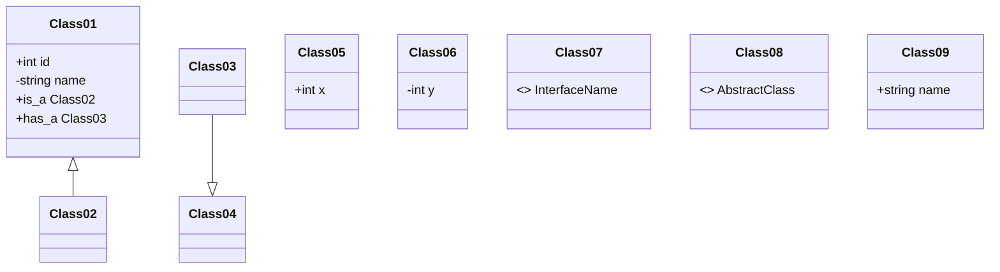
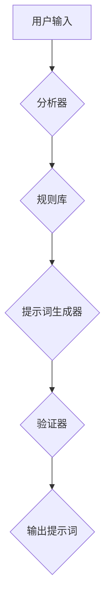
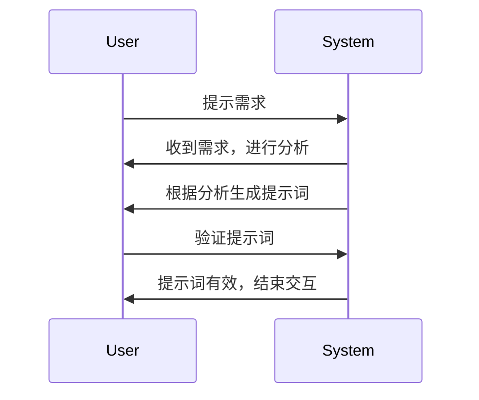

                 

## 文章标题

### 关键词

- 提示词工程
- 清晰原则
- 具体原则
- 相关原则
- 实际应用

### 摘要

本文将探讨提示词工程中的三个核心原则：清晰、具体和相关性。通过逐步分析这些原则的定义、重要性以及如何在实际工程中应用，我们将揭示如何构建高效、可靠的提示词系统。文章不仅涵盖理论，还通过实例展示了这些原则在不同阶段的应用，为工程实践提供了实用的指导和启示。

---

### 目录大纲

# 提示词工程的核心原则：清晰、具体、相关

## 第一部分：核心原则概述

### 1.1 清晰原则的定义与重要性

### 1.2 如何实现清晰原则

### 1.3 清晰原则的应用实例

### 2.1 具体原则的定义与重要性

### 2.2 如何实现具体原则

### 2.3 具体原则的应用实例

### 3.1 相关原则的定义与重要性

### 3.2 如何实现相关原则

### 3.3 相关原则的应用实例

## 第二部分：原则在实际工程中的应用

### 4.1 用户研究和需求分析

### 4.2 需求分析的过程

### 4.3 如何运用清晰、具体、相关原则进行用户研究和需求分析

### 5.1 设计思维与原型制作

### 5.2 原型制作的过程

### 5.3 如何运用清晰、具体、相关原则进行设计思维与原型制作

### 6.1 测试与迭代

### 6.2 迭代的过程和技巧

### 6.3 如何运用清晰、具体、相关原则进行测试与迭代

## 第三部分：最佳实践与总结

### 7.1 最佳实践

### 7.2 实践中的注意事项

### 7.3 拓展阅读

### 8.1 提示词工程的核心原则总结

### 8.2 对未来工作的启示

### 8.3 未来的发展方向

## 附录：相关资源与工具

### 8.4 常用工具介绍

### 8.5 相关资源推荐

---

## 第一部分：核心原则概述

### 1.1 清晰原则的定义与重要性

在提示词工程中，清晰原则是确保信息传递准确无误的基础。它要求我们在设计提示词时，语言要简洁明了，逻辑要清晰连贯，避免歧义和模糊性。清晰原则的重要性在于它直接影响系统的可理解性和可靠性。

#### 背景介绍

- **核心概念术语说明**：提示词、清晰性、语言简洁性、逻辑连贯性。
- **问题背景**：提示词工程中常见的清晰性问题，如模糊性、歧义、冗余。
- **问题描述**：如何在设计提示词时保持清晰性。
- **问题解决**：采用简洁、明确的语言，确保逻辑连贯。
- **边界与外延**：清晰原则的应用范围和限制。
- **概念结构与核心要素组成**：明确提示词的设计要素，包括语言、逻辑和结构。

#### 核心概念与联系

- **概念属性特征对比表格**：

| 特征         | 清晰性       | 模糊性       |
| ------------ | ------------ | ------------ |
| 语言简洁性   | 简洁、明确   | 复杂、冗长   |
| 逻辑连贯性   | 清晰连贯     | 混乱、断裂   |
| 可理解性     | 易懂、可靠   | 难懂、不可靠 |

- **ER实体关系图架构**：

```mermaid
erDiagram
  User ||--|{ Task }
  Task ||--|{ Keyword }
  Keyword ||--|{ Description }
```

#### 算法原理讲解

- **流程图**：


- **Python源代码**（简化示例）：

```python
def create_clear_keyword(task_description):
    # 分析任务描述
    analysis = analyze_task(task_description)
    # 制定规则
    rules = define_rules(analysis)
    # 简化语言
    simplified_language = simplify_rules(rules)
    # 测试验证
    test_results = test_keyword(simplified_language)
    # 迭代优化
    if not test_results['success']:
        return create_clear_keyword(analysis['description'])
    return simplified_language

def analyze_task(description):
    # 分析任务描述的详细过程
    pass

def define_rules(analysis):
    # 根据分析结果制定规则
    pass

def simplify_rules(rules):
    # 简化规则，使其更清晰
    pass

def test_keyword(keyword):
    # 测试提示词是否清晰
    pass
```

#### 数学公式

- **独立性测试的假设公式**：

$$ H_0: \text{提示词清晰} $$
$$ H_1: \text{提示词不清晰} $$

#### 系统分析与架构设计方案

- **问题场景介绍**：提示词系统在复杂环境中的应用。
- **项目介绍**：提示词系统的设计和实现。
- **系统功能设计**：领域模型。



- **系统架构设计**：高层次的架构图。



- **系统接口设计和系统交互**：交互流程。



---

接下来，我们将进一步探讨具体原则和相关原则，以及它们在提示词工程中的应用。

