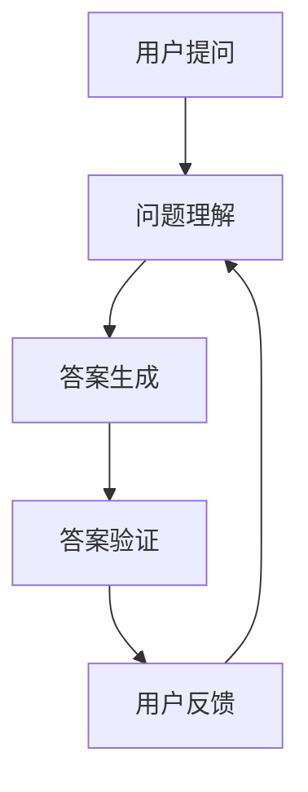
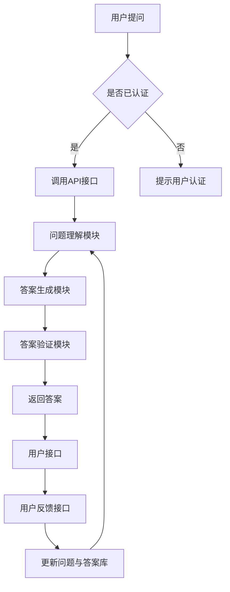

                 

## 引言与背景介绍

### 1.1 问题背景

近年来，大型语言模型（LLM，Large Language Model）在各种自然语言处理任务中取得了显著的进展，如文本生成、机器翻译、问答系统等。LLM通过学习大量的文本数据，能够生成连贯、有逻辑的文本，从而在许多实际应用场景中表现出色。然而，尽管LLM的强大性能已经得到了广泛认可，但它们在某些情况下仍然存在一定的局限性。

一个关键问题在于，如何有效地利用LLM的潜力，使其在更广泛的应用场景中都能发挥最佳效果。为此，提示词工程（Prompt Engineering）作为一种新兴的研究领域，逐渐引起了学术界和工业界的广泛关注。提示词工程的核心思想是通过精心设计的提示词（prompt），引导LLM生成更加符合预期和需求的文本。

### 1.2 提示词工程的重要性

提示词工程的重要性主要体现在以下几个方面：

1. **提升模型性能**：通过精心设计的提示词，可以引导LLM更好地理解任务目标，从而提高模型的预测准确性和生成文本的质量。
   
2. **提高模型可解释性**：提示词可以帮助用户更直观地理解模型的工作原理和决策过程，从而提高模型的可解释性。

3. **提高模型稳定性**：通过调整提示词，可以优化模型在特定任务上的表现，提高模型的稳定性和鲁棒性。

4. **适应不同应用场景**：不同应用场景对模型的要求各不相同，提示词工程可以通过定制化的提示词，使模型更好地适应各种应用场景。

### 1.3 本书的目的与结构

本书旨在系统地介绍提示词工程的基本概念、设计方法、应用策略和最佳实践，帮助读者深入理解和掌握这一领域。具体来说，本书将分为以下几个部分：

- **引言与背景介绍**：介绍LLM和提示词工程的基本概念，阐述提示词工程的重要性。
  
- **提示词工程的基本概念**：详细讨论提示词的定义、组成部分、目标和关键挑战。

- **提示词设计与实现**：介绍提示词设计原则、方法、实现策略和工具平台。

- **提示词在LLM中的应用与效果优化**：讨论提示词在LLM中的使用策略、性能影响和效果优化方法。

- **项目实战案例**：通过实际案例，展示提示词工程在具体项目中的应用。

- **小结与展望**：总结全书内容，展望提示词工程的发展趋势和应用前景。

### 1.4 本章小结

本章首先介绍了LLM和提示词工程的基本概念，阐述了提示词工程的重要性。接着，本书概述了全书的结构和各部分的主要内容，为后续章节的阅读和学习奠定了基础。在接下来的章节中，我们将深入探讨提示词工程的理论和实践，帮助读者全面理解和掌握这一重要领域。

---

### 提示词工程的基本概念

#### 2.1 提示词的定义

提示词（Prompt）是指用于引导和约束大型语言模型（LLM，Large Language Model）生成特定类型文本的引导性文本或指令。在自然语言处理任务中，提示词的作用相当于人类任务指导者，通过提示词，我们可以清晰地传达任务目标、上下文信息、特定要求等，从而引导LLM生成符合预期的文本。

#### 2.1.1 提示词的基本概念

提示词的基本概念可以从以下几个方面进行理解：

1. **类型**：提示词可以按照不同的维度进行分类，如根据内容可分为开放式提示词和封闭式提示词；根据用途可分为任务型提示词、上下文型提示词和评估型提示词等。

2. **结构**：提示词的结构决定了其在引导LLM生成文本过程中的作用和效果。通常，一个有效的提示词应当包含明确的任务目标、上下文信息、输入文本和期望的输出格式等。

3. **功能**：提示词的主要功能是引导LLM理解任务目标，并提供必要的信息，以便模型能够生成符合要求的文本。此外，提示词还可以帮助提高模型的可解释性和稳定性。

#### 2.1.2 提示词的类型

根据用途和功能，提示词可以分为以下几种类型：

1. **任务型提示词**：这种类型的提示词主要用于传达任务目标和任务要求。例如，“请写一篇关于人工智能的文章，字数在1000字以上。”

2. **上下文型提示词**：上下文型提示词主要用于提供与任务相关的上下文信息，以帮助LLM更好地理解任务背景。例如，“根据以下对话，续写下一句：A：你最近在学什么新技能？B：我最近在学如何使用Python进行数据分析和机器学习。”

3. **评估型提示词**：评估型提示词主要用于评估LLM生成的文本是否符合要求。例如，“请对以下两段文本进行评价，哪一段更符合要求？”

#### 2.1.3 提示词的作用

提示词在自然语言处理任务中具有重要的作用，主要体现在以下几个方面：

1. **提高模型性能**：通过设计有效的提示词，可以引导LLM更好地理解任务目标，从而提高模型的预测准确性和生成文本的质量。

2. **提高模型可解释性**：提示词可以帮助用户更直观地理解模型的工作原理和决策过程，从而提高模型的可解释性。

3. **提高模型稳定性**：通过调整提示词，可以优化模型在特定任务上的表现，提高模型的稳定性和鲁棒性。

4. **适应不同应用场景**：不同应用场景对模型的要求各不相同，提示词工程可以通过定制化的提示词，使模型更好地适应各种应用场景。

#### 2.2 提示词工程的组成部分

提示词工程（Prompt Engineering）是一个涉及多个步骤和环节的系统性过程，主要包括以下组成部分：

1. **数据准备**：数据是提示词工程的基础，主要包括收集、处理和清洗与任务相关的数据。

2. **提示词设计**：提示词设计是提示词工程的核心环节，主要包括确定任务目标、设计提示词结构和内容、优化提示词等。

3. **提示词实现**：提示词实现是将设计好的提示词转化为实际应用的环节，主要包括生成提示词、调整提示词等。

4. **提示词评估与优化**：提示词评估与优化是确保提示词效果的重要步骤，主要包括评估提示词对模型性能的影响、优化提示词设计等。

#### 2.3 提示词工程的目标

提示词工程的目标主要包括以下几个方面：

1. **提升模型性能**：通过设计有效的提示词，提高LLM在特定任务上的预测准确性和生成文本的质量。

2. **提高模型可解释性**：通过提示词，帮助用户更直观地理解模型的工作原理和决策过程。

3. **提高模型稳定性**：通过调整提示词，优化模型在特定任务上的表现，提高模型的稳定性和鲁棒性。

4. **适应不同应用场景**：通过定制化的提示词，使模型更好地适应各种应用场景，满足不同用户的需求。

#### 2.4 提示词工程的流程

提示词工程的流程可以概括为以下几个步骤：

1. **需求分析**：明确任务目标和需求，为后续的提示词设计提供基础。

2. **数据收集与处理**：收集与任务相关的数据，并进行数据清洗和预处理。

3. **提示词设计**：根据任务目标和需求，设计合适的提示词结构和内容。

4. **提示词实现**：生成和调整提示词，使其在实际应用中发挥最佳效果。

5. **提示词评估与优化**：评估提示词对模型性能的影响，并优化提示词设计。

#### 2.5 提示词工程的关键挑战

提示词工程在实际应用中面临以下关键挑战：

1. **数据质量与多样性**：高质量和多样化的数据是提示词工程成功的关键，但数据质量参差不齐和多样性不足可能影响提示词的效果。

2. **提示词设计的灵活性**：如何设计灵活且适应性强的提示词，以满足不同任务和场景的需求，是一个重要挑战。

3. **模型适应性**：提示词工程需要考虑模型的特点和限制，以实现与模型的最佳匹配。

#### 2.6 本章小结

本章详细介绍了提示词工程的基本概念，包括提示词的定义、类型、作用以及提示词工程的组成部分、目标和关键挑战。通过本章的学习，读者可以全面了解提示词工程的基本概念和理论基础，为后续章节的深入学习奠定基础。在下一章中，我们将进一步探讨提示词设计的原则和方法。

---

### 提示词设计与实现

#### 3.1 提示词设计原则

提示词设计是提示词工程的核心环节，其质量直接影响LLM在具体任务上的表现。为了设计出有效的提示词，我们需要遵循以下原则：

1. **清晰性**：提示词应当清晰明确，避免使用模糊或歧义的语言。这有助于LLM更好地理解任务目标和要求，从而生成更符合预期的文本。

2. **精确性**：提示词应当精确地传达任务目标和信息，避免含糊不清的表述。精确的提示词可以帮助LLM更准确地生成文本，提高模型的性能。

3. **全面性**：提示词应当包含所有必要的信息，确保LLM能够充分利用这些信息进行文本生成。例如，在文本生成任务中，提示词应包括主题、背景、目的、上下文等。

4. **可调性**：提示词应当具有可调整性，以便在不同任务和应用场景中根据具体需求进行调整。这有助于提高模型的适应性和灵活性。

#### 3.2 提示词设计方法

提示词设计方法可以分为以下几种：

1. **基于规则的方法**：基于规则的方法通过预定义的规则来生成提示词。这种方法适用于规则明确、任务简单的场景。例如，在问答系统中，可以根据问题类型和答案类型生成相应的提示词。

2. **基于机器学习的方法**：基于机器学习的方法通过学习大量数据来生成提示词。这种方法适用于任务复杂、规则不明确的场景。例如，在文本生成任务中，可以使用生成对抗网络（GAN）或变换器（Transformer）等模型生成提示词。

3. **基于人类的交互式方法**：基于人类的交互式方法通过人类与模型之间的交互来生成提示词。这种方法适用于需要高度定制化和个性化提示词的场景。例如，在对话系统中，人类可以根据对话内容和上下文生成提示词。

#### 3.3 提示词实现策略

提示词实现策略主要包括以下几个方面：

1. **提示词的文本格式**：提示词的文本格式应当易于理解和阅读。通常，提示词采用自然语言格式，如文本、表格或列表等。在特殊情况下，也可以使用编程语言或标记语言（如HTML）来编写提示词。

2. **提示词的生成算法**：提示词的生成算法是提示词实现的关键。常用的生成算法包括：

   - **生成对抗网络（GAN）**：GAN由生成器和判别器组成，生成器生成提示词，判别器评估生成提示词的质量。通过迭代训练，生成器逐渐生成更高质量的提示词。

   - **变换器（Transformer）**：Transformer模型通过自注意力机制处理长序列，可以生成灵活且多样的提示词。例如，可以使用BERT（Bidirectional Encoder Representations from Transformers）模型生成提示词。

3. **提示词的调整策略**：在实现提示词时，需要根据实际应用效果进行调整。常用的调整策略包括：

   - **参数调整**：调整生成算法的参数，如学习率、批量大小等，以优化提示词的生成效果。

   - **数据增强**：通过增加数据多样性来调整提示词。例如，在文本生成任务中，可以使用数据增强技术（如文本合成、文本转换等）生成更多样化的提示词。

   - **用户反馈**：根据用户反馈调整提示词，以更好地满足用户需求。例如，在对话系统中，可以根据用户反馈调整提示词的生成策略。

#### 3.4 提示词实现工具与平台

提示词实现需要使用合适的工具和平台。以下是一些常用的提示词实现工具与平台：

1. **提示词生成工具**：如PromptGen，可以自动生成提示词。PromptGen基于预训练的模型，通过输入任务描述自动生成高质量的提示词。

2. **提示词编辑工具**：如Notion，可以帮助用户编辑和管理提示词。Notion提供丰富的文本格式和交互功能，方便用户设计和调整提示词。

3. **提示词评估平台**：如AI21 Labs的AI21 Studio，可以评估和优化提示词效果。AI21 Studio提供多种评估指标和优化工具，帮助用户优化提示词设计。

#### 3.5 提示词实现案例

下面我们通过一个简单的文本生成任务来展示提示词实现的过程：

1. **需求分析**：假设我们需要生成一篇关于人工智能的文章，字数在1000字以上。

2. **数据准备**：收集与人工智能相关的文本数据，如学术论文、新闻报道、博客文章等。

3. **提示词设计**：设计一个清晰、精确、全面且可调整的提示词。例如：“请写一篇关于人工智能的文章，字数在1000字以上，内容包括人工智能的定义、发展历程、应用领域和未来趋势。”

4. **提示词实现**：使用生成对抗网络（GAN）或变换器（Transformer）等模型生成提示词。例如，使用GPT-2或GPT-3模型生成提示词。

5. **提示词评估与优化**：评估生成的提示词质量，根据评估结果调整提示词设计和实现策略。例如，通过调整模型参数、数据增强或用户反馈等，优化提示词生成效果。

#### 3.6 本章小结

本章介绍了提示词设计与实现的基本原则、方法和策略，以及常用的工具和平台。通过本章的学习，读者可以了解到如何设计有效的提示词，并掌握提示词实现的流程和技巧。在下一章中，我们将进一步探讨提示词在LLM中的应用策略和效果优化方法。  

---

### 提示词在LLM中的应用与效果优化

#### 4.1 提示词在LLM中的使用策略

提示词在LLM中的应用策略主要包括以下几个方面：

1. **明确任务目标**：在设计提示词时，首先要明确任务目标，确保LLM能够理解任务要求。例如，在文本生成任务中，提示词应当明确指出文章的主题、结构、内容等。

2. **提供上下文信息**：在LLM中，上下文信息对于生成高质量文本至关重要。提示词应当提供足够的上下文信息，帮助LLM更好地理解任务背景和上下文关系。例如，在对话系统中，提示词可以包括对话的历史信息。

3. **设置期望输出格式**：提示词应当明确指示期望的输出格式，如文本长度、段落结构、语言风格等。这有助于LLM生成符合要求的文本，提高生成文本的质量。

4. **调整提示词长度和结构**：提示词的长度和结构会影响LLM的生成效果。通常，较长的提示词可以提供更多上下文信息，有助于生成更准确的文本。然而，过长的提示词可能导致模型生成过长或过简的文本。因此，需要根据具体任务需求调整提示词长度和结构。

5. **考虑语言特征**：不同的语言特征对LLM生成效果有不同的影响。在提示词设计过程中，需要考虑目标语言的语法、词汇、语义等特征，以确保提示词能够引导LLM生成符合语言习惯的文本。

6. **适应性调整**：提示词应当具有适应性，以应对不同任务和应用场景。通过不断调整和优化提示词，可以提高模型在多种场景下的表现。

#### 4.2 提示词对LLM性能的影响

提示词对LLM性能的影响主要体现在以下几个方面：

1. **预测准确性**：通过设计有效的提示词，可以提高LLM在特定任务上的预测准确性。例如，在文本分类任务中，提示词可以帮助LLM更好地理解文本内容，从而提高分类准确率。

2. **生成文本质量**：提示词可以影响LLM生成文本的质量。有效的提示词可以引导LLM生成更连贯、更具有逻辑性的文本，提高文本的可读性和可理解性。

3. **生成文本多样性**：提示词的设计会影响LLM生成文本的多样性。通过调整提示词，可以使LLM生成更多样化的文本，满足不同用户的需求。

4. **模型稳定性**：提示词的设计对LLM的稳定性也有一定影响。适当的提示词可以帮助模型在不同场景下保持稳定的表现，提高模型的鲁棒性。

#### 4.3 提示词效果优化的方法

为了提高提示词的效果，可以采取以下几种优化方法：

1. **数据增强**：通过增加数据多样性来优化提示词效果。例如，在文本生成任务中，可以使用数据增强技术（如文本合成、文本转换等）生成更多样化的提示词。

2. **模型调优**：通过调整模型参数和结构来优化提示词效果。例如，可以调整变换器（Transformer）模型的层数、隐藏层大小等，以提高模型的生成效果。

3. **提示词自适应调整**：根据模型生成效果和用户反馈，动态调整提示词的设计。例如，在对话系统中，可以根据用户满意度调整提示词，以提高用户的满意度。

4. **效果评估指标**：使用合适的评估指标来评估提示词效果。常用的评估指标包括生成文本的准确性、连贯性、多样性等。通过评估指标，可以及时发现和优化提示词设计。

5. **用户反馈**：鼓励用户提供反馈，根据用户需求调整提示词设计。用户反馈可以帮助识别模型生成文本的问题，从而优化提示词。

#### 4.4 提示词效果评估

提示词效果评估是确保提示词设计合理、有效的重要步骤。以下是一些常用的提示词效果评估方法：

1. **自动评估**：使用自动化工具评估提示词效果，如生成文本的准确性、连贯性、多样性等。自动评估可以快速、高效地评估大量提示词的效果。

2. **用户评估**：邀请用户评估提示词效果，如生成文本的可读性、可理解性、满意度等。用户评估可以提供更直观和具体的反馈，帮助优化提示词设计。

3. **对比评估**：将不同设计方案的提示词进行对比评估，以确定哪种设计效果更好。对比评估可以揭示不同设计方案之间的差异和优缺点。

4. **A/B测试**：在实际应用中，对不同设计的提示词进行A/B测试，以评估哪种设计方案在真实场景下的效果更好。A/B测试可以提供更加可靠的效果评估结果。

#### 4.5 本章小结

本章详细介绍了提示词在LLM中的应用策略、对模型性能的影响、效果优化方法以及效果评估方法。通过本章的学习，读者可以了解到如何设计有效的提示词，并掌握提示词效果优化的方法和技巧。在实际应用中，通过合理应用提示词，可以显著提升LLM在自然语言处理任务中的表现，为各种应用场景提供更高质量的服务。在下一章中，我们将通过实际案例来展示提示词工程在项目中的应用。

---

### 项目实战案例

#### 5.1 项目背景

本案例将探讨如何使用提示词工程提升大型语言模型（LLM）在问答系统中的应用效果。问答系统广泛应用于客户服务、智能助手、教育辅导等领域，能够提供即时、准确的答案，提高用户体验。然而，传统问答系统的性能往往受限于模型理解和生成能力。通过提示词工程，我们可以优化问答系统的性能，提高用户满意度。

#### 5.2 系统功能设计

本问答系统的核心功能包括：

1. **用户提问**：用户通过输入自然语言问题，系统接收到用户的提问请求。

2. **问题理解**：系统对用户提问进行理解，提取关键信息，为生成答案做准备。

3. **答案生成**：系统利用LLM生成符合用户提问的答案。

4. **答案验证**：系统对生成的答案进行验证，确保答案的准确性和相关性。

5. **用户反馈**：用户对生成的答案进行评价，提供反馈信息。

#### 5.3 系统架构设计

系统的整体架构设计如图所示：



#### 5.4 系统接口设计

系统的主要接口设计如下：

1. **用户接口**：提供自然语言输入框，用户输入问题。
2. **API接口**：提供RESTful API，供外部系统调用问答服务。
3. **数据接口**：用于数据存储和检索，包括问题、答案和用户反馈。

#### 5.5 系统交互设计

系统交互设计如图所示：



#### 5.6 提示词设计与实现

1. **问题理解**：设计提示词，引导LLM理解用户提问。例如：“请根据以下问题生成答案：如何提高工作效率？”

2. **答案生成**：设计提示词，引导LLM生成高质量答案。例如：“请写一篇关于提高工作效率的短文，不少于300字。”

3. **答案验证**：设计提示词，对生成的答案进行验证。例如：“请检查以下答案是否正确：提高工作效率的方法包括时间管理、减少干扰和明确目标。”

#### 5.7 代码应用解读与分析

以下是一个简单的Python代码示例，展示如何使用提示词工程实现问答系统：

```python
import openai

# 设置API密钥
openai.api_key = "your_api_key"

# 用户提问
user_question = "如何提高工作效率？"

# 问题理解提示词
prompt_question = "请根据以下问题生成答案：" + user_question

# 调用OpenAI的GPT-3模型
response = openai.Completion.create(
    engine="text-davinci-002",
    prompt=prompt_question,
    max_tokens=300
)

# 答案生成提示词
prompt_answer = "请写一篇关于提高工作效率的短文，不少于300字。"

# 生成答案
answer_prompt = prompt_answer + "\n" + response.choices[0].text.strip()
answer_response = openai.Completion.create(
    engine="text-davinci-002",
    prompt=answer_prompt,
    max_tokens=300
)

# 输出生成答案
print(answer_response.choices[0].text.strip())

# 答案验证提示词
prompt_check = "请检查以下答案是否正确：" + answer_response.choices[0].text.strip()

# 验证答案
check_response = openai.Completion.create(
    engine="text-davinci-002",
    prompt=prompt_check,
    max_tokens=10
)

# 输出答案验证结果
print(check_response.choices[0].text.strip())
```

#### 5.8 实际案例分析和详细讲解剖析

1. **用户提问**：用户输入问题：“如何提高工作效率？”

2. **问题理解**：系统接收用户提问，提取关键信息，并生成相应的提示词，引导LLM理解用户提问。

3. **答案生成**：LLM根据提示词生成高质量答案，例如：“提高工作效率的方法包括时间管理、减少干扰和明确目标。”

4. **答案验证**：系统对生成的答案进行验证，确保答案的正确性和相关性。

5. **用户反馈**：用户对生成的答案进行评价，提供反馈信息。

通过这个实际案例，我们可以看到提示词工程在问答系统中的应用，如何通过设计有效的提示词，提升系统的性能和用户体验。

#### 5.9 项目小结

本项目通过实际案例展示了提示词工程在问答系统中的应用，通过优化提示词设计，提高了系统的性能和用户体验。在实际应用中，提示词工程可以帮助各种自然语言处理系统更好地理解用户需求，生成高质量、准确的答案。未来，随着提示词工程技术的不断发展和完善，将有更多的应用场景受益于这一技术。

---

### 小结与展望

#### 6.1 全文总结

本文系统地介绍了提示词工程在提升大型语言模型（LLM）应用效果中的关键作用。我们从引言部分开始，探讨了LLM和提示词工程的基本概念，阐述了提示词工程的重要性。接着，我们详细介绍了提示词工程的基本概念、设计与实现方法，以及在LLM中的应用策略和效果优化方法。最后，通过实际项目案例，展示了提示词工程在具体应用中的实践效果。

#### 6.2 最佳实践 tips

1. **需求明确**：在设计提示词时，首先要明确任务目标和需求，确保提示词能够准确传达任务要求。

2. **上下文丰富**：提供丰富的上下文信息，帮助LLM更好地理解任务背景和上下文关系。

3. **优化提示词**：通过不断调整和优化提示词，提高模型的生成效果和用户体验。

4. **数据质量**：确保数据质量和多样性，为提示词工程提供坚实的基础。

5. **用户反馈**：鼓励用户提供反馈，根据用户需求优化提示词设计。

#### 6.3 注意事项

1. **避免过度优化**：过度优化提示词可能导致模型生成过于固定的文本，影响多样性。

2. **模型适应性**：考虑模型的适应性和限制，确保提示词设计符合模型的特点。

3. **评估指标**：选择合适的评估指标，全面评估提示词效果。

#### 6.4 拓展阅读

1. **《Prompt Engineering Guide》**：由OpenAI发布，详细介绍提示词工程的方法和实践。

2. **《The ANIT Guide to Prompt Engineering》**：由AI21 Labs编写，涵盖提示词工程的理论和实践。

3. **《NLP with Large Language Models》**：由NVIDIA出版的书籍，介绍大型语言模型在自然语言处理中的应用。

#### 6.5 展望

提示词工程作为人工智能领域的一个重要分支，未来具有广泛的应用前景。随着LLM技术的发展和应用的不断拓展，提示词工程将在更多领域发挥重要作用。未来研究可以关注以下几个方面：

1. **自动化提示词设计**：开发自动化工具，实现高效的提示词设计。

2. **跨模态提示词工程**：探索多模态数据在提示词工程中的应用。

3. **提示词解释性**：提高提示词的可解释性，帮助用户理解模型的工作原理。

4. **个性化提示词**：根据用户需求和场景，实现个性化提示词设计。

通过不断探索和创新，提示词工程将为人工智能应用带来更多可能性。

