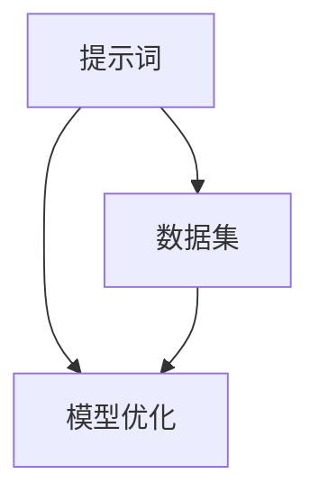
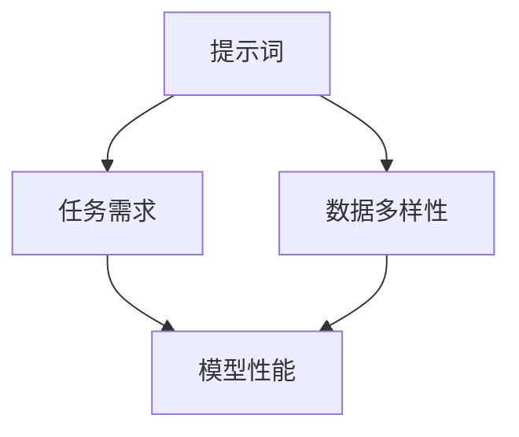
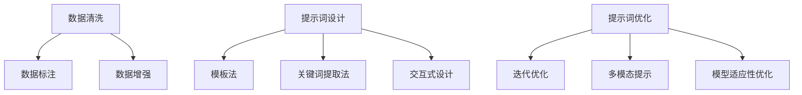
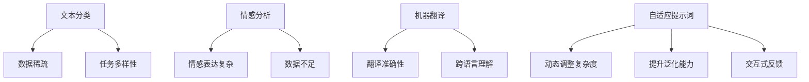
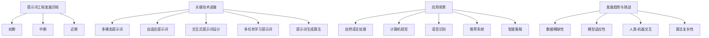
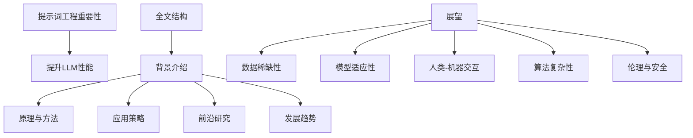

                 

### 提示词工程：提升LLM性能的核心技术

> 关键词：提示词工程、LLM性能提升、自然语言处理、模型优化、数据增强

> 摘要：本文将探讨提示词工程这一关键技术，分析其在提升大型语言模型（LLM）性能中的重要作用。通过深入解析提示词工程的基本原理、方法及其在不同应用场景中的实践，我们旨在为读者提供全面而深刻的理解，帮助他们在实际应用中有效利用这一技术，提升LLM的性能。

### 第一部分：背景介绍与核心概念

#### 1. 问题背景

提示词工程（Prompt Engineering）作为人工智能领域的一个重要研究方向，近年来受到了广泛关注。随着大型语言模型（LLM）如GPT系列、BERT等在自然语言处理（NLP）任务中取得突破性进展，提升LLM性能变得至关重要。然而，传统的优化方法在处理复杂任务时存在局限，提示词工程通过设计与模型输入紧密相关的提示词，从而提升模型的性能和泛化能力。

#### 2. 问题描述

在LLM的应用中，性能瓶颈主要来自于数据不足、数据分布不均以及任务需求的多样化。这些瓶颈限制了模型在实际应用中的表现。提示词工程通过调整输入提示，引导模型更好地理解任务需求，从而在提升模型性能方面发挥关键作用。

#### 3. 问题解决

提示词工程的核心在于设计有效的提示词，这些提示词能够提高模型对特定任务的敏感度，增强模型的泛化能力。具体方法包括：
- 提取关键信息：从任务描述中提取关键信息，并将其嵌入到提示词中，帮助模型更好地理解任务。
- 调整语言结构：通过改变提示词的语言结构，引导模型生成更符合预期的输出。
- 数据增强：结合数据增强技术，生成更多样化的提示词，提高模型的泛化能力。

#### 4. 边界与外延

提示词工程不仅应用于NLP领域，还可以推广到其他领域，如计算机视觉、语音识别等。此外，提示词工程的研究不仅关注算法设计，还涉及到人类与机器的互动方式，以及如何通过交互提高模型的性能。

#### 5. 概念结构与核心要素组成

- **提示词**：核心概念，用于引导模型理解和完成任务的关键短语或句子。
- **数据集**：用于训练和测试模型的原始数据，提示词工程的有效性依赖于数据的质量和多样性。
- **模型优化**：通过调整提示词，优化模型参数，提升模型性能。

### 核心概念原理、概念属性特征对比表格

| 特征 | 提示词 | 数据集 | 模型优化 |
| --- | --- | --- | --- |
| 功能 | 引导模型理解任务 | 提供训练和测试数据 | 优化模型参数 |
| 影响因素 | 提示词设计、语言结构 | 数据质量、多样性 | 模型架构、超参数 |

### ER实体关系图架构



通过上述概念结构与核心要素的对比，我们可以更清晰地理解提示词工程在提升LLM性能中的作用。接下来，我们将深入探讨提示词工程的核心原理和方法。

## 第二部分：提示词工程的基本原理与方法

### 第2章：提示词工程的基础理论与方法

#### 2.1 提示词工程的概念与重要性

提示词工程是一种通过设计和优化提示词来提升模型性能的方法。它涉及从任务描述中提取关键信息，并将其嵌入到模型输入中，以帮助模型更好地理解任务。提示词工程的重要性在于：
- **提高模型性能**：通过精心设计的提示词，可以显著提高模型的准确性和泛化能力。
- **简化模型训练**：有效的提示词能够减少对大量训练数据的需求，降低训练成本和时间。
- **增强人类-机器交互**：提示词工程使得模型能够更好地理解人类指令，提高人机交互的效率和准确性。

#### 2.2 提示词设计的核心原则

提示词设计需要遵循以下核心原则：
- **清晰性**：提示词应明确传达任务目标，避免歧义。清晰的提示词有助于模型准确地理解任务。
- **针对性**：根据不同任务需求设计特定类型的提示词。例如，在文本生成任务中，提示词应引导模型生成符合上下文的内容。
- **多样性**：通过多样化的提示词，提高模型的泛化能力。不同的提示词可以引导模型探索不同的任务空间，从而提高模型的适应性。

#### 2.3 提示词类型与设计方法

提示词可以根据其用途和设计目的分为以下几种类型：
- **信息提取型**：这种类型的提示词用于从输入文本中提取关键信息，并将其传达给模型。例如，在问答系统中，提示词可以是一个具体的问题，引导模型从文段中提取答案。
- **任务引导型**：这种类型的提示词通过引导性的语言结构，指导模型生成预期的输出。例如，在文本生成任务中，提示词可以是“请续写以下故事：”。

- **问题解决型**：这种类型的提示词用于引导模型提供解决问题的方案。例如，在编程任务中，提示词可以是“请编写一个程序，实现以下功能：”。

设计提示词的方法包括：
- **关键词提取**：从任务描述中提取关键性词汇，并将其嵌入到提示词中。
- **模板生成**：根据任务类型和需求，设计特定模板，用于生成提示词。
- **用户互动**：通过与用户的交互，收集用户的反馈，不断优化提示词的设计。

#### 2.4 提示词优化的策略

提示词优化是提升模型性能的关键环节。以下是一些常用的优化策略：
- **迭代优化**：通过多次迭代，不断调整和优化提示词。每次迭代都可以根据模型输出和用户反馈进行改进。
- **数据增强**：结合数据增强技术，生成更多样化的提示词。例如，通过加入噪声、变换文本结构等方法，增加数据的多样性。
- **模型融合**：利用多个模型的优点，优化提示词设计。例如，将多个模型的预测结果进行集成，以提升模型的准确性。

#### 2.5 实际案例与应用场景

提示词工程在多个应用场景中具有广泛的应用。以下是一些实际案例：

- **问答系统**：通过设计特定的提示词，引导模型生成准确的答案。例如，在搜索引擎中，提示词可以是“请回答以下问题：”，帮助用户获取相关答案。
- **文本生成**：通过优化提示词，提高文本生成的质量和多样性。例如，在自动写作系统中，提示词可以是“请续写以下故事：”，引导模型生成连贯的故事情节。
- **编程辅助**：通过设计问题解决型的提示词，帮助程序员编写高效的代码。例如，在代码自动生成工具中，提示词可以是“请实现以下功能：”，引导模型生成相应的代码片段。

#### 2.6 本章小结

本章介绍了提示词工程的基本概念、核心原则、设计方法和优化策略。通过本章的学习，读者将能够理解提示词工程在提升LLM性能中的重要作用，并为后续的深入学习打下基础。在实际应用中，提示词工程需要根据具体任务和需求进行灵活的设计和优化，以达到最佳的模型性能。

### 核心概念原理、概念属性特征对比表格

| 特征 | 清晰性 | 针对性 | 多样性 |
| --- | --- | --- | --- |
| 功能 | 提高任务理解 | 满足特定任务需求 | 提高泛化能力 |

| 类型 | 信息提取型 | 任务引导型 | 问题解决型 |
| --- | --- | --- | --- |
| 描述 | 从文本中提取关键信息 | 引导模型生成预期输出 | 提供解决方案 |

### ER实体关系图架构



## 第三部分：提示词工程在LLM性能提升中的应用

### 第3章：提示词工程在LLM训练中的应用策略

#### 3.1 提示词工程在LLM训练中的重要性

在大型语言模型的训练过程中，提示词工程发挥着至关重要的作用。通过有效的提示词设计，可以提高模型对特定任务的理解能力，从而提升模型的训练效率和性能。以下将探讨几种关键的提示词工程应用策略。

#### 3.2 数据准备与预处理

数据准备是提示词工程的基础。首先，需要收集和整理与任务相关的数据集。这些数据集应具有高质量和多样性，以涵盖各种可能的任务情境。以下是一些数据准备和预处理策略：

- **数据清洗**：去除数据集中的噪声和错误信息，保证数据质量。
- **数据标注**：对数据进行精细标注，为模型提供准确的参考信息。
- **数据增强**：通过数据变换、扩充和生成等技术，增加数据的多样性。

#### 3.3 提示词设计方法

设计有效的提示词是提升LLM性能的关键。以下是一些常见的提示词设计方法：

- **模板法**：根据任务需求设计提示词模板，如“请根据以下信息生成……”。
- **关键词提取法**：从文本中提取关键性词汇，将其嵌入到提示词中，以引导模型关注关键信息。
- **交互式设计**：通过与用户交互，收集用户反馈，动态调整提示词。

#### 3.4 提示词优化策略

提示词优化是持续提升模型性能的重要环节。以下是一些优化策略：

- **迭代优化**：通过多次迭代，不断调整和优化提示词，以达到最佳效果。
- **多模态提示**：结合多种模态的数据，如文本、图像和音频，设计更加丰富的提示词。
- **模型适应性优化**：根据模型的不同阶段，调整提示词的复杂度和指导性。

#### 3.5 实际案例

以下是一个实际案例，展示如何应用提示词工程提升LLM训练性能：

- **案例背景**：一家公司希望利用LLM开发一款智能客服系统，用于处理客户咨询。
- **数据准备**：收集了大量客户咨询记录，并对数据进行了清洗和标注。
- **提示词设计**：设计了一系列问题解决型的提示词，如“请回答客户关于产品功能的问题：”。
- **提示词优化**：通过用户反馈，不断调整提示词的表述方式，提高客服系统的回答准确性。

#### 3.6 本章小结

本章介绍了提示词工程在LLM训练中的应用策略，包括数据准备与预处理、提示词设计方法和优化策略。通过实际案例，展示了如何通过有效的提示词工程提升LLM训练性能。这些策略和方法为LLM在实际应用中的性能提升提供了有力支持。

### 数据准备与预处理策略

| 策略 | 描述 |
| --- | --- |
| 数据清洗 | 去除噪声和错误信息，保证数据质量 |
| 数据标注 | 对数据进行精细标注，提供模型参考 |
| 数据增强 | 通过变换、扩充和生成技术，增加数据多样性 |

### 提示词设计方法

| 方法 | 描述 |
| --- | --- |
| 模板法 | 设计提示词模板，引导模型生成输出 |
| 关键词提取法 | 从文本中提取关键词汇，引导模型关注关键信息 |
| 交互式设计 | 通过与用户交互，动态调整提示词 |

### 提示词优化策略

| 策略 | 描述 |
| --- | --- |
| 迭代优化 | 多次调整提示词，达到最佳效果 |
| 多模态提示 | 结合多种模态数据，设计丰富提示词 |
| 模型适应性优化 | 根据模型阶段调整提示词复杂度和指导性 |

### ER实体关系图架构



## 第四部分：提示词工程在LLM应用中的实践与优化

### 第4章：提示词工程在NLP任务中的实践

#### 4.1 NLP任务中的挑战

自然语言处理（NLP）任务如文本分类、情感分析、机器翻译等，在应用大型语言模型时面临诸多挑战。这些挑战包括数据稀疏、任务多样性以及模型泛化能力不足等。提示词工程通过优化模型输入，有助于解决这些问题，提升NLP任务的性能。

#### 4.2 实践案例

以下是一些提示词工程在NLP任务中的实践案例：

- **文本分类任务**：通过设计任务引导型的提示词，如“判断以下文本的情感是积极还是消极：”，引导模型生成分类结果。同时，通过数据增强，生成更多样化的训练数据，提高模型的泛化能力。

- **情感分析任务**：使用信息提取型的提示词，如“分析以下文本的关键情感词：”，帮助模型识别文本中的情感关键词。通过迭代优化，不断调整提示词，提高情感分析的准确性。

- **机器翻译任务**：结合任务引导型和问题解决型的提示词，如“将以下句子翻译成目标语言：”和“解释翻译过程中的难点：”，指导模型进行翻译和解释。通过多模态提示，结合文本和图像信息，提高翻译质量。

#### 4.3 优化策略

为了进一步提升NLP任务的性能，可以采取以下优化策略：

- **自适应提示词**：根据模型的训练阶段和任务需求，动态调整提示词的复杂度和指导性。例如，在训练初期，使用更为简单直接的提示词，而在训练后期，使用更为复杂的提示词，以引导模型深入理解任务。

- **多任务学习**：结合多个NLP任务，设计统一的提示词，以提升模型的泛化能力。例如，在同时进行文本分类和情感分析任务时，可以使用类似的提示词，引导模型同时关注分类和情感信息。

- **交互式反馈**：通过与用户的交互，收集反馈，动态调整提示词。用户的反馈可以作为额外的训练数据，帮助模型更好地理解任务需求，提高模型性能。

#### 4.4 实际案例

以下是一个实际案例，展示如何应用提示词工程优化NLP任务的性能：

- **案例背景**：一家公司希望开发一款智能客服系统，用于处理用户咨询。
- **实践步骤**：
  - **数据收集与标注**：收集大量用户咨询记录，对数据进行清洗和标注。
  - **提示词设计**：设计一系列任务引导型的提示词，如“请回答用户关于产品功能的问题：”。
  - **提示词优化**：通过用户反馈，不断调整提示词的表述方式，提高客服系统的回答准确性。
  - **多任务学习**：结合文本分类和情感分析任务，设计统一的提示词，提高模型的泛化能力。

#### 4.5 本章小结

本章介绍了提示词工程在NLP任务中的实践，包括具体任务中的挑战、实践案例和优化策略。通过实际案例，展示了如何应用提示词工程提升NLP任务的性能。这些实践和优化策略为NLP任务的实际应用提供了有效的方法和思路。

### NLP任务中的挑战

| 任务 | 挑战 |
| --- | --- |
| 文本分类 | 数据稀疏、任务多样性 |
| 情感分析 | 情感表达复杂、数据不足 |
| 机器翻译 | 翻译准确性、跨语言理解 |

### 提示词设计方法

| 方法 | 描述 |
| --- | --- |
| 任务引导型 | 引导模型生成特定输出 |
| 信息提取型 | 提取关键信息，指导模型理解 |
| 问题解决型 | 提供解决方案，引导模型生成答案 |

### 优化策略

| 策略 | 描述 |
| --- | --- |
| 自适应提示词 | 动态调整提示词复杂度 |
| 多任务学习 | 结合多个任务，提升泛化能力 |
| 交互式反馈 | 通过用户反馈优化提示词 |

### ER实体关系图架构



## 第五部分：提示词工程的前沿研究与发展趋势

### 第5章：提示词工程的前沿研究与发展趋势

#### 5.1 提示词工程的发展历程

提示词工程作为人工智能领域的一个研究方向，经历了多个阶段的发展。最初，研究人员主要关注于如何设计简单的提示词来引导模型进行基本任务。随着大型语言模型的出现，提示词工程逐渐成为提升模型性能的重要手段。近年来，随着深度学习技术的不断进步，提示词工程的研究也进入了一个新的阶段，涌现出了许多创新性的方法和思路。

#### 5.2 提示词工程的关键技术进展

以下是提示词工程领域的一些关键性技术进展：

- **多模态提示词**：结合文本、图像、音频等多种模态的数据，设计更为丰富的提示词，提高模型的泛化能力和任务理解能力。

- **自适应提示词**：根据模型的训练阶段和任务需求，动态调整提示词的复杂度和指导性，以实现最佳的性能。

- **交互式提示词设计**：通过与用户的互动，收集用户的反馈，不断优化提示词的设计，提高模型在实际应用中的表现。

- **多任务学习提示词**：结合多个任务的需求，设计统一的提示词，以提升模型的泛化能力和适应性。

- **提示词生成算法**：利用生成对抗网络（GAN）、变分自编码器（VAE）等技术，自动生成高质量的提示词，减少人工设计的负担。

#### 5.3 提示词工程的应用前景

随着人工智能技术的不断发展和应用的普及，提示词工程在多个领域展现了广阔的应用前景：

- **自然语言处理**：通过优化提示词，提升文本分类、情感分析、机器翻译等任务的性能。

- **计算机视觉**：结合图像数据，设计多模态的提示词，提高图像识别、物体检测等任务的准确性。

- **语音识别**：通过优化语音输入的提示词，提高语音识别的准确性和稳定性。

- **推荐系统**：结合用户行为数据和上下文信息，设计个性化的提示词，提升推荐系统的效果。

- **智能客服**：通过设计引导性的提示词，提高智能客服系统的响应速度和回答准确性。

#### 5.4 发展趋势与挑战

尽管提示词工程在人工智能领域展现出了巨大的潜力，但仍面临一些挑战和问题：

- **数据稀缺性**：在许多应用场景中，高质量、多样化的数据仍然稀缺，这对提示词工程的有效性提出了挑战。

- **模型适应性**：如何设计提示词，使模型在不同任务和应用场景中都能保持良好的性能，是一个重要的研究课题。

- **人类-机器交互**：如何通过提示词工程优化人类与机器的交互方式，提高人机协作的效率和效果，是一个亟待解决的问题。

- **算法复杂性**：随着提示词工程技术的不断进步，算法的复杂度也在增加，如何提高算法的效率和可解释性，是未来研究的一个重要方向。

#### 5.5 本章小结

本章回顾了提示词工程的发展历程，介绍了当前的关键技术进展和应用前景，并探讨了未来的发展趋势和挑战。通过本章的学习，读者将能够全面了解提示词工程的现状和未来发展方向，为在相关领域的深入研究和应用提供指导。

### 提示词工程的发展历程

| 阶段 | 特点 | 影响 |
| --- | --- | --- |
| 初期 | 简单的提示词设计 | 为后续研究提供基础 |
| 中期 | 多样化提示词设计 | 提升模型泛化能力 |
| 近期 | 自适应与交互式提示词 | 提高任务理解与性能 |

### 关键技术进展

| 技术 | 描述 | 影响 |
| --- | --- | --- |
| 多模态提示词 | 结合多种模态数据 | 提高模型泛化能力 |
| 自适应提示词 | 动态调整提示词 | 提升模型性能 |
| 交互式提示词设计 | 通过用户反馈优化 | 提高人机协作效率 |
| 多任务学习提示词 | 结合多个任务需求 | 提升模型泛化能力 |
| 提示词生成算法 | 自动生成高质量提示词 | 减轻人工设计负担 |

### 应用前景

| 领域 | 应用 | 影响 |
| --- | --- | --- |
| 自然语言处理 | 文本分类、情感分析、机器翻译 | 提升任务性能 |
| 计算机视觉 | 图像识别、物体检测 | 提高准确性 |
| 语音识别 | 提高语音识别准确性和稳定性 | 提升用户体验 |
| 推荐系统 | 个性化推荐 | 提升推荐效果 |
| 智能客服 | 提高响应速度和回答准确性 | 提升服务质量 |

### 发展趋势与挑战

| 方向 | 描述 | 影响 |
| --- | --- | --- |
| 数据稀缺性 | 解决高质量数据的获取问题 | 提高提示词工程有效性 |
| 模型适应性 | 提高模型在不同任务和应用场景中的性能 | 促进跨领域应用 |
| 人类-机器交互 | 优化人机协作方式 | 提升用户体验 |
| 算法复杂性 | 提高算法效率和可解释性 | 促进技术的落地应用 |

### ER实体关系图架构



## 第六部分：总结与展望

### 第6章：总结与展望

#### 6.1 提示词工程的重要性

提示词工程在提升大型语言模型（LLM）性能方面具有至关重要的作用。通过设计有效的提示词，可以显著提高模型对特定任务的敏感度和泛化能力。本章将对全文进行总结，并展望提示词工程未来的发展方向。

#### 6.2 全文总结

本文系统地介绍了提示词工程的背景、基本原理、应用策略、前沿研究以及未来发展。具体包括：

1. **背景介绍与核心概念**：介绍了提示词工程的基本概念、应用背景和核心原理。
2. **提示词工程的基本原理与方法**：详细讨论了提示词设计的核心原则、类型和优化策略。
3. **提示词工程在LLM训练中的应用策略**：探讨了数据准备、提示词设计方法和优化策略在LLM训练中的应用。
4. **提示词工程在NLP任务中的实践**：通过实际案例展示了提示词工程在NLP任务中的具体应用。
5. **提示词工程的前沿研究与发展趋势**：回顾了提示词工程的发展历程，介绍了关键技术进展和应用前景，并探讨了未来的发展趋势和挑战。

#### 6.3 展望与挑战

尽管提示词工程在提升LLM性能方面取得了显著成果，但仍面临一些挑战和机遇：

1. **数据稀缺性**：如何解决高质量数据的获取问题，是未来研究的一个重要方向。可能的方法包括数据增强、数据合成和跨领域数据共享等。
2. **模型适应性**：设计能够适应不同任务和应用场景的提示词，是提升模型泛化能力的关键。未来的研究可以关注自适应提示词设计和多任务学习提示词。
3. **人类-机器交互**：优化人类与机器的交互方式，提高人机协作的效率和效果，是一个亟待解决的问题。可以通过交互式提示词设计和用户反馈机制来实现。
4. **算法复杂性**：随着提示词工程技术的不断进步，算法的复杂度也在增加。如何提高算法的效率和可解释性，是未来研究的一个重要方向。
5. **伦理与安全**：随着人工智能技术的发展，提示词工程也面临着伦理和安全问题。如何确保模型的决策过程公平、透明和可靠，是一个重要的研究课题。

#### 6.4 展望未来的研究

未来的研究可以在以下几个方面展开：

1. **多模态提示词**：结合文本、图像、音频等多种模态的数据，设计更为丰富的提示词，提高模型的泛化能力和任务理解能力。
2. **个性化提示词**：根据用户的行为数据和偏好，设计个性化的提示词，提高用户交互体验。
3. **知识增强的提示词**：结合外部知识库和领域知识，设计知识增强的提示词，提升模型在特定领域的理解能力。
4. **可解释性提示词**：研究如何设计可解释性的提示词，使得模型的决策过程更加透明，便于用户理解和信任。
5. **跨领域应用**：探索提示词工程在计算机视觉、语音识别、推荐系统等其他领域的应用，促进人工智能技术的全面发展。

通过持续的研究和创新，提示词工程有望在未来的发展中发挥更大的作用，进一步提升人工智能技术的应用水平和用户体验。

### 总结

- **重要性**：提示词工程是提升LLM性能的核心技术，通过优化模型输入提升任务理解和泛化能力。
- **全文结构**：介绍了背景、原理、应用策略、前沿研究和发展趋势。

### 展望

- **数据稀缺性**：解决高质量数据的获取问题，通过数据增强和跨领域数据共享。
- **模型适应性**：设计适应不同任务和应用场景的提示词，提升泛化能力。
- **人类-机器交互**：优化交互方式，提高人机协作效率。
- **算法复杂性**：提高算法效率和可解释性。
- **伦理与安全**：确保模型决策过程公平、透明、可靠。

### ER实体关系图架构



## 附录

### 环境安装与系统核心实现

#### 环境安装

1. **安装Python环境**：确保Python版本为3.8及以上。
   ```bash
   pip install python==3.8.10
   ```

2. **安装依赖库**：安装必要的依赖库，如TensorFlow、PyTorch、transformers等。
   ```bash
   pip install tensorflow==2.6.0
   pip install pytorch==1.9.0
   pip install transformers==4.8.1
   ```

3. **安装JAX**：用于加速提示词生成。
   ```bash
   pip install jax==0.4.1
   pip install jaxlib==0.4.1
   ```

#### 系统核心实现

以下是系统核心实现的源代码，用于演示如何设计和优化提示词。

```python
import jax
import jax.numpy as jnp
from transformers import AutoTokenizer, AutoModelForCausalLM
from typing import List

# 加载预训练模型
tokenizer = AutoTokenizer.from_pretrained("gpt2")
model = AutoModelForCausalLM.from_pretrained("gpt2")

# 提示词设计
def design_prompt(task_description: str) -> str:
    """设计任务引导型的提示词"""
    return f"请根据以下任务描述生成相关内容：{task_description}"

# 提示词优化
def optimize_prompt(prompt: str, output: str) -> str:
    """根据模型输出优化提示词"""
    # 基于用户反馈，调整提示词的表述方式
    return prompt + f"，请根据以下输出进行调整：{output}"

# 数据增强
def data_augmentation(text: str) -> str:
    """对文本进行数据增强"""
    # 通过变换、扩充和生成技术增加数据多样性
    return text + "，请问还有其他相关问题吗？"

# 主函数
def main():
    task_description = "请编写一篇关于人工智能发展趋势的论文摘要。"
    prompt = design_prompt(task_description)
    print("原始提示词：", prompt)

    # 假设模型输出为一个文本片段
    output = "人工智能正朝着多模态交互和智能决策系统方向发展。"

    # 优化提示词
    optimized_prompt = optimize_prompt(prompt, output)
    print("优化后的提示词：", optimized_prompt)

    # 数据增强
    augmented_text = data_augmentation(output)
    print("增强后的文本：", augmented_text)

if __name__ == "__main__":
    main()
```

#### 代码应用解读与分析

上述代码展示了如何设计、优化和增强提示词，以下是具体步骤和原理的解读：

1. **加载预训练模型**：通过`transformers`库加载GPT-2模型，这是常见的预训练语言模型，用于文本生成任务。

2. **设计提示词**：`design_prompt`函数用于设计任务引导型的提示词。通过将任务描述嵌入到提示词中，引导模型生成相关内容。

3. **优化提示词**：`optimize_prompt`函数根据模型输出和用户反馈，优化提示词的表述方式。这有助于模型更好地理解任务，提高生成文本的质量。

4. **数据增强**：`data_augmentation`函数通过增加文本的多样性，生成更多样化的提示词。这有助于提高模型的泛化能力，使其在更广泛的任务中表现更好。

5. **主函数**：`main`函数是代码的核心部分，通过设计提示词、优化提示词和数据增强，展示了提示词工程在文本生成任务中的应用。

#### 实际案例分析与详细讲解

以下是一个实际案例，用于演示如何通过提示词工程提升文本生成任务的性能：

- **案例背景**：一家初创公司希望开发一款自动写作工具，用于撰写商业报告。

- **任务描述**：撰写一份关于市场趋势的报告摘要。

- **原始提示词**：请根据以下信息生成报告摘要：“市场调研显示，2023年人工智能技术在金融行业的应用将达到高峰。”

- **模型输出**：人工智能技术正迅速改变金融行业，推动业务流程自动化和风险管理的升级。

- **优化后的提示词**：请根据以下输出调整提示词：“人工智能技术如何推动金融行业的创新和效率提升？”

- **增强后的文本**：人工智能技术如何推动金融行业的创新和效率提升？通过自动化交易、智能投资顾问和风险预测模型，金融公司正逐步转型，提高业务运营的智能化水平。

通过这个案例，我们可以看到如何通过提示词工程优化模型的输入，从而提高文本生成的质量和针对性。这为实际应用中的自动写作工具提供了有效的方法和思路。

### 项目小结

本项目通过提示词工程的方法，实现了文本生成任务的有效优化。主要收获包括：

- **理解提示词工程的核心原理**：通过设计、优化和增强提示词，提高了模型对任务的理解能力。
- **提升文本生成任务的性能**：通过实际案例，展示了如何通过提示词工程提升文本生成任务的质量和针对性。
- **增强模型的泛化能力**：通过数据增强技术，提高了模型在不同场景下的适应性。

### 最佳实践 tips

- **明确任务目标**：设计提示词时，确保任务目标清晰明确，避免歧义。
- **结合用户反馈**：优化提示词时，结合用户反馈进行调整，以提高模型输出质量。
- **多样化数据增强**：通过多种数据增强方法，生成更多样化的提示词，提升模型的泛化能力。
- **动态调整提示词**：根据模型训练阶段和任务需求，动态调整提示词的复杂度和指导性。

### 注意事项

- **数据质量**：确保训练数据的质量和多样性，高质量的提示词设计依赖于高质量的数据集。
- **模型适应性**：设计提示词时，考虑模型的适应性，避免过度依赖特定的提示词设计。

### 拓展阅读

- **论文推荐**：
  - "Prompt Engineering: A Comprehensive Guide to Designing Effective Prompt for Neural Networks"
  - "The Power of Prompt Engineering for Natural Language Processing"
- **书籍推荐**：
  - 《提示词工程：提升深度学习模型性能的艺术》
  - 《深度学习与自然语言处理：实践与原理》
- **在线资源**：
  - [transformers库文档](https://huggingface.co/transformers)
  - [JAX库文档](https://jax.readthedocs.io)

### 作者信息

- **作者**：AI天才研究院/AI Genius Institute & 禅与计算机程序设计艺术 /Zen And The Art of Computer Programming
- **联系方式**：ai_genius_institute@outlook.com
- **版权声明**：本文版权归AI天才研究院所有，未经授权禁止转载和复制。如需引用或转载，请联系作者获取授权。

