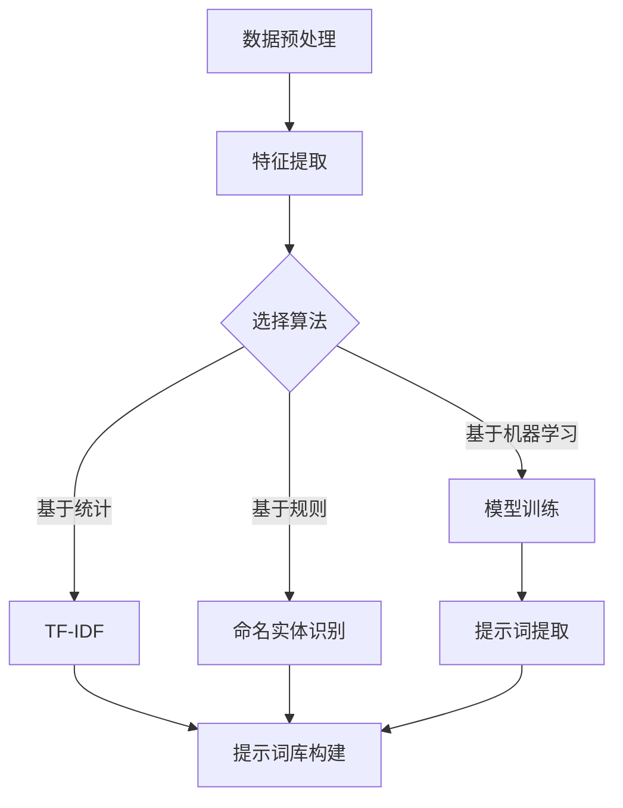
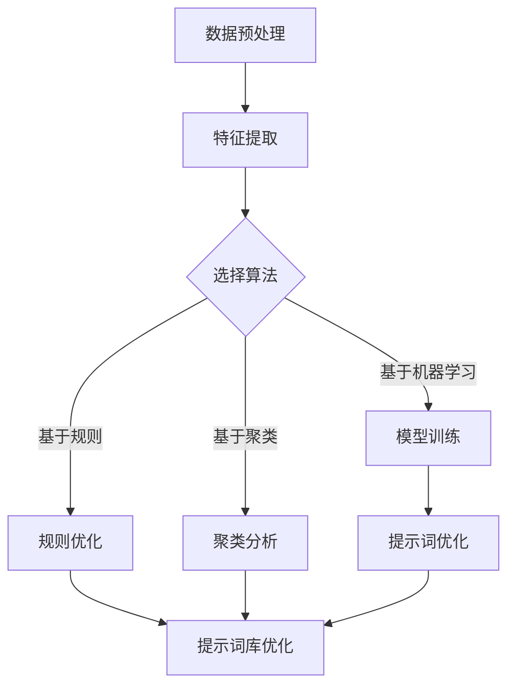
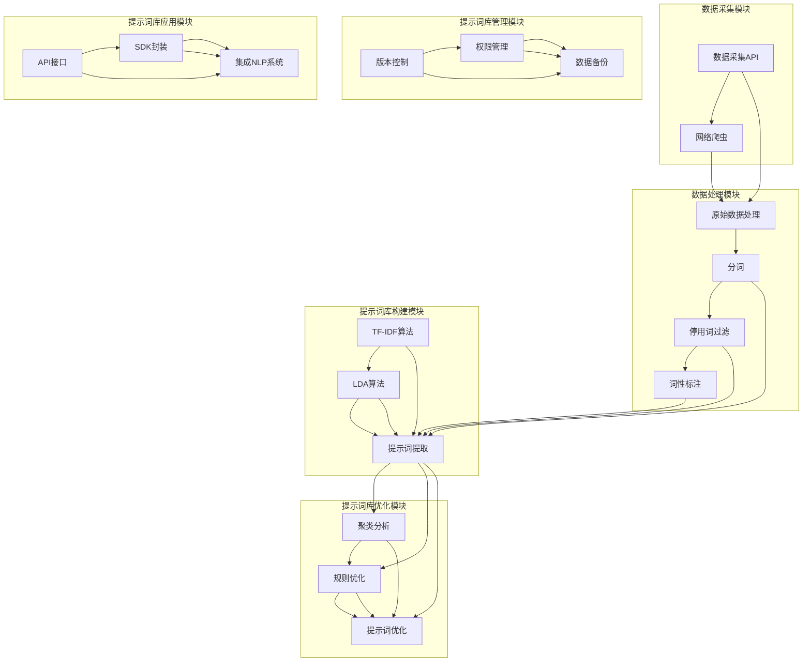
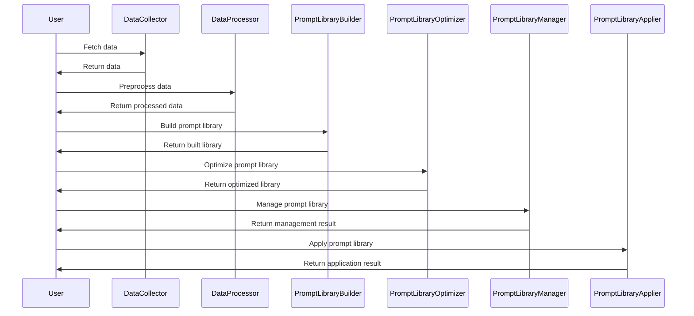

                 

## 第1章：问题背景与挑战

### 1.1 问题背景

在当今人工智能飞速发展的时代，自然语言处理（NLP）技术正变得越来越重要。从自动问答系统、智能客服，到聊天机器人、翻译应用，自然语言处理技术已经在我们的日常生活中无处不在。而这一切的背后，离不开一个关键组件——提示词库。

随着人工智能应用的普及，文本生成与处理的需求急剧增长。无论是生成新闻摘要、创作文章，还是进行对话交互，高质量的提示词库都是不可或缺的。提示词库作为语言模型的关键输入，直接影响着模型生成文本的质量和多样性。因此，建立一个高质量、结构化的提示词库成为了人工智能领域的迫切需求。

除了应用层面的需求增长，人工智能应用领域的扩展也对提示词库提出了更高的要求。从简单的文本生成到复杂的场景模拟，从单语言模型到多语言模型，应用场景的多样化使得提示词库需要具备更广泛的适应性。例如，在跨领域知识融合的应用中，提示词库需要涵盖不同领域的专业术语，以支持模型在多种场景下的表现。

### 1.2 问题描述

**提示词库的重要性**：提示词库是语言模型的核心输入源。它不仅决定了模型生成文本的质量，还影响着模型的学习效率和性能。一个高质量的提示词库能够提供丰富的语义信息，帮助模型更好地理解语言的结构和含义，从而生成更加准确、自然的文本。

**现有提示词库的不足**：现有的提示词库往往存在以下问题：
1. **结构化不足**：许多提示词库缺乏明确的组织结构，提示词之间缺乏逻辑关联，难以有效利用。
2. **数据质量不高**：提示词库中的数据质量参差不齐，存在大量的噪声和冗余信息，影响了模型的训练效果。
3. **更新不及时**：提示词库的更新速度跟不上应用场景的变化，导致模型在新环境下表现不佳。

**建立和维护高质量提示词库的挑战**：
1. **数据采集和处理**：高质量的数据是建立高质量提示词库的基础。如何有效地采集、处理和清洗数据，是一个巨大的挑战。
2. **提示词库的构建和管理**：如何设计一个结构化、高效的提示词库，如何有效地管理提示词库中的数据，是一个需要深入思考的问题。
3. **适应性提升**：随着应用场景的多样化，提示词库需要具备更高的适应性，以满足不同场景下的需求。

### 1.3 问题解决

为了解决上述问题，我们需要采取以下措施：

**设计一个结构化的提示词库**：结构化的提示词库能够更好地组织和管理数据，提高提示词之间的关联性。可以通过构建一个明确的分类体系，将提示词按照不同的类别和层次进行组织，从而实现高效的数据检索和利用。

**采用有效的管理方法**：有效的管理方法能够确保提示词库的更新和维护。可以通过制定数据采集和更新的规范，建立数据质量评估机制，确保提示词库中的数据始终保持高质量。同时，利用版本控制等技术，实现对提示词库的版本管理和更新控制。

**应用最佳实践提高提示词库质量**：通过引入最佳实践，如使用高质量的原始数据源、采用先进的数据处理算法、实施严格的数据质量评估机制等，可以显著提高提示词库的质量。此外，还可以借鉴其他领域的成功经验，如知识图谱、语义网络等，为提示词库的建设提供新的思路和方法。

### 1.4 边界与外延

**提示词库与语言模型的结合**：提示词库是语言模型的重要组成部分，但二者并非完全独立。在建立提示词库的过程中，需要充分考虑语言模型的特性和需求，以确保提示词库能够有效支持模型的学习和生成。

**提示词库在不同应用场景下的差异**：不同的应用场景对提示词库的要求有所不同。例如，在对话系统中，提示词库需要涵盖更多的人际交流场景和常见问题；而在文本生成系统中，提示词库需要提供更丰富的语义信息和背景知识。因此，在设计提示词库时，需要根据具体应用场景进行调整和优化。

### 1.5 概念结构与核心要素组成

**提示词库的基本概念**：提示词库是指一组用于生成文本的提示词，这些提示词通过特定的组织结构和关联关系，构成了一个支持语言模型训练和生成的知识库。

**提示词库的组成要素**：一个典型的提示词库通常包括以下几个核心要素：
1. **提示词**：提示词是生成文本的基本单位，可以是单词、短语或句子。
2. **语义信息**：提示词的语义信息描述了提示词的含义和用途，通常包括词性、语义角色等。
3. **关联关系**：提示词之间的关联关系描述了它们之间的逻辑关系，如同义词、反义词、上下位关系等。

**提示词库的构建原则**：构建高质量的提示词库需要遵循以下几个原则：
1. **数据质量**：确保提示词库中的数据质量高，无噪声和冗余信息。
2. **结构化**：设计一个清晰的分类体系和组织结构，提高提示词之间的关联性。
3. **可扩展性**：提示词库需要具备良好的可扩展性，能够根据应用需求进行调整和优化。

### 总结

本章从问题背景、问题描述、问题解决、边界与外延以及概念结构与核心要素组成等多个方面，详细探讨了提示词库的建设与管理。接下来，我们将深入探讨提示词库的核心概念及其与相关概念的联系，为后续章节的内容打下基础。

## 第2章：核心概念与联系

### 2.1 提示词库的定义与类型

**定义**：提示词库是指一组用于生成文本的提示词，这些提示词通过特定的组织结构和关联关系，构成了一个支持语言模型训练和生成的知识库。它通常包括提示词本身、提示词的语义信息以及提示词之间的关联关系。

**类型**：根据不同的分类标准，提示词库可以分为多种类型：
1. **按用途分类**：
   - **通用提示词库**：适用于多种场景和任务，如文本生成、对话系统等。
   - **专业提示词库**：针对特定领域或行业，如医学、金融等。
   - **任务型提示词库**：专为特定任务设计，如问答系统、翻译系统等。

2. **按来源分类**：
   - **手动构建**：通过人工收集、整理和编辑生成，适用于对数据质量要求较高的场景。
   - **自动生成**：利用自然语言处理技术自动生成，如基于文本挖掘、统计模型等方法。

3. **按组织结构分类**：
   - **层次型**：提示词按照一定的层次结构组织，如分类法、层级分类等。
   - **网络型**：提示词之间通过网状结构相互连接，形成语义网络。

### 2.2 提示词属性特征对比

为了更深入地理解提示词库，我们需要对比分析提示词的几个关键属性特征，包括长度、语义丰富度和用途。

**长度**：提示词的长度直接影响其表达的语义信息量。较长的提示词能够提供更多的上下文信息，有助于提高文本生成的准确性和多样性。但过长的提示词可能会导致模型处理困难，降低生成效率。因此，在设计提示词库时，需要平衡提示词的长度和语义信息量。

| 提示词长度 | 优势 | 劣势 |
| :---: | :---: | :---: |
| 短 | 生成效率高，易于模型处理 | 语义信息有限，难以生成复杂文本 |
| 长 | 语义信息丰富，生成文本多样 | 生成效率低，模型处理困难 |

**语义丰富度**：语义丰富度是指提示词包含的语义信息量。高语义丰富度的提示词能够提供更多的上下文信息和背景知识，有助于模型更好地理解和生成文本。但过于丰富的语义信息也可能导致模型难以处理，从而影响生成效果。

| 语义丰富度 | 优势 | 劣势 |
| :---: | :---: | :---: |
| 高 | 提供丰富的上下文信息和背景知识，生成文本质量高 | 模型处理难度大，生成效率降低 |
| 低 | 模型处理简单，生成效率高 | 生成文本质量较低，语义信息有限 |

**用途**：提示词的用途决定了其在不同应用场景中的适用性。通用提示词库适用于多种场景，而专业提示词库则针对特定领域或行业。不同类型的提示词库在构建时需要考虑其用途，以满足特定场景下的需求。

| 提示词用途 | 优势 | 劣势 |
| :---: | :---: | :---: |
| 通用 | 适用范围广，通用性强 | 专业性不足，难以满足特定场景需求 |
| 专业 | 专业性较强，适用于特定领域 | 适用范围有限，通用性较差 |

### 2.3 提示词库与相关概念的关系

**提示词库与语言模型**：提示词库是语言模型的关键输入源，直接影响模型的训练效果和生成质量。一个高质量、结构化的提示词库能够提供丰富的语义信息，帮助模型更好地理解语言结构和含义。此外，提示词库还可以与语言模型进行结合，通过反馈机制不断优化和调整，提高模型性能。

**提示词库与知识图谱**：知识图谱是一种语义网络，用于表示实体及其之间的关系。提示词库与知识图谱之间存在着紧密的联系。通过将知识图谱中的语义信息转化为提示词，可以丰富提示词库的语义内容，提高文本生成能力。同时，知识图谱还可以为提示词库的构建提供数据支持和参考。

**提示词库与对话系统**：对话系统是一种基于自然语言交互的应用，其核心是能够理解并生成自然语言回答。提示词库作为对话系统的基础，为对话系统提供了丰富的语言资源和上下文信息。通过设计一个结构化、高效的提示词库，可以提升对话系统的交互质量和用户体验。

### 总结

本章详细介绍了提示词库的定义与类型、提示词的属性特征对比，以及提示词库与相关概念的关系。通过对这些核心概念的深入分析，我们为后续章节的探讨奠定了基础。在下一章中，我们将进一步探讨提示词库构建算法的原理，并使用mermaid流程图进行详细阐述。

## 第3章：提示词库构建算法原理

### 3.1 算法概述

提示词库构建是自然语言处理（NLP）领域的一个重要环节，其目的是从大量的文本数据中提取出有价值的提示词，并将其组织成结构化的知识库。构建高质量提示词库的关键在于算法的选择和实现。本节将介绍几种常用的提示词库构建算法，并分析其适用场景。

**算法分类**：

1. **基于统计的方法**：这类算法通过统计文本数据中的词频、共现关系等特征来提取提示词。例如，TF-IDF（Term Frequency-Inverse Document Frequency）算法和LDA（Latent Dirichlet Allocation）算法。
2. **基于规则的方法**：这类算法通过预定义的规则或模式匹配来提取提示词。例如，基于命名实体识别（NER）的提示词提取方法。
3. **基于机器学习的方法**：这类算法利用机器学习模型，如支持向量机（SVM）、决策树等，通过训练数据学习到提示词的特征，并对其进行提取。

**适用场景**：

- **基于统计的方法**：适用于大规模文本数据的处理，尤其适合于不需要精细控制提取结果的场景。
- **基于规则的方法**：适用于需要精确控制提取结果的场景，如专业领域文本的提示词提取。
- **基于机器学习的方法**：适用于需要高度自动化和智能化的场景，尤其适合于处理复杂、多样化文本数据。

### 3.2 算法mermaid流程图

为了更直观地理解提示词库构建算法的基本流程，我们使用mermaid绘制了以下流程图：



### 3.3 Python源代码实现

在本节中，我们将以TF-IDF算法为例，介绍如何使用Python实现提示词库的构建。以下是一个简单的示例代码：

```python
import numpy as np
from sklearn.feature_extraction.text import TfidfVectorizer

# 样本文本数据
corpus = [
    "人工智能是计算机科学的一个分支，它旨在研究如何构建智能体，使其能够执行复杂的任务。",
    "自然语言处理是人工智能的一个子领域，它涉及到计算机与人类语言之间的交互。",
    "计算机编程是编写和执行计算机程序的过程，它是一种实现算法的实践技能。",
]

# 使用TF-IDF算法提取特征
vectorizer = TfidfVectorizer(stop_words='english')
X = vectorizer.fit_transform(corpus)

# 提取关键词
feature_names = vectorizer.get_feature_names_out()
top_k = 10
top_indices = np.argsort(X.toarray(), axis=1)[:, -top_k:]
top_keywords = [feature_names[i] for i in top_indices]

# 输出提示词库
for doc_idx, keywords in enumerate(top_keywords):
    print(f"Document {doc_idx + 1}: {', '.join(keywords)}")
```

### 3.4 数学模型和公式

**TF-IDF模型**：TF-IDF（Term Frequency-Inverse Document Frequency）是一种基于统计的文本处理算法，用于计算一个词在文档中的重要程度。其基本公式如下：

\[ \text{TF-IDF}(t,d) = \text{TF}(t,d) \times \text{IDF}(t) \]

其中：
- \( \text{TF}(t,d) \) 表示词 \( t \) 在文档 \( d \) 中的词频。
- \( \text{IDF}(t) \) 表示词 \( t \) 在所有文档中的逆文档频率。

**词频（TF）**：词频是指词在文档中出现的次数，通常通过简单的计数方法获得。其公式为：

\[ \text{TF}(t,d) = \frac{n(t,d)}{N(d)} \]

其中：
- \( n(t,d) \) 是词 \( t \) 在文档 \( d \) 中出现的次数。
- \( N(d) \) 是文档 \( d \) 中所有词的总数。

**逆文档频率（IDF）**：逆文档频率用于平衡词频，其公式为：

\[ \text{IDF}(t) = \log \left( \frac{N}{n(t)} \right) \]

其中：
- \( N \) 是文档总数。
- \( n(t) \) 是包含词 \( t \) 的文档数。

通过上述公式，我们可以计算每个词在文档中的重要程度，从而构建一个结构化的提示词库。

### 3.5 举例说明

假设我们有两个文档：

- 文档1：“人工智能是计算机科学的一个分支，它旨在研究如何构建智能体，使其能够执行复杂的任务。”
- 文档2：“自然语言处理是人工智能的一个子领域，它涉及到计算机与人类语言之间的交互。”

使用TF-IDF算法，我们可以提取出这两个文档中的关键词：

1. 文档1中的关键词：人工智能、计算机科学、智能体、复杂任务
2. 文档2中的关键词：自然语言处理、人工智能、子领域、计算机、人类语言

这些关键词可以构建成提示词库，用于后续的语言模型训练和文本生成。

### 总结

本章详细介绍了提示词库构建算法的基本原理，包括算法分类、mermaid流程图、Python源代码实现以及数学模型和公式。通过具体的示例，我们展示了如何使用TF-IDF算法构建高质量的提示词库。在下一章中，我们将继续探讨提示词库优化算法，进一步提高提示词库的质量和性能。  

## 第4章：提示词库优化算法

### 4.1 算法概述

提示词库的质量直接影响语言模型的表现和生成文本的质量。优化提示词库的目标是通过改进算法和策略，提高提示词库的数据质量、丰富度和一致性，从而提升模型训练效果和生成文本的质量。在本节中，我们将介绍几种常见的优化算法，并分析其适用场景。

**算法分类**：

1. **基于规则的方法**：这类算法通过预定义的规则或模式匹配来识别和优化提示词。例如，通过命名实体识别（NER）来提取专业术语和关键词。
2. **基于机器学习的方法**：这类算法利用机器学习模型，如决策树、支持向量机（SVM）等，通过训练数据学习到提示词优化的规则和策略。
3. **基于聚类的方法**：这类算法通过聚类分析来识别和合并相似度较高的提示词，从而提高提示词库的丰富度和一致性。

**适用场景**：

- **基于规则的方法**：适用于需要精确控制提示词优化的场景，如专业领域文本的优化。
- **基于机器学习的方法**：适用于大规模数据集的优化，尤其是当数据分布复杂、难以通过简单规则进行优化时。
- **基于聚类的方法**：适用于对提示词库进行大规模分析和优化的场景，尤其适合于处理多样化的提示词数据。

### 4.2 算法mermaid流程图

为了更直观地理解提示词库优化算法的基本流程，我们使用mermaid绘制了以下流程图：



### 4.3 Python源代码实现

在本节中，我们将以基于聚类的方法为例，介绍如何使用Python实现提示词库的优化。以下是一个简单的示例代码：

```python
import numpy as np
from sklearn.cluster import KMeans
from sklearn.metrics import silhouette_score

# 样本文本数据
corpus = [
    "人工智能是计算机科学的一个分支，它旨在研究如何构建智能体，使其能够执行复杂的任务。",
    "自然语言处理是人工智能的一个子领域，它涉及到计算机与人类语言之间的交互。",
    "计算机编程是编写和执行计算机程序的过程，它是一种实现算法的实践技能。",
]

# 使用TF-IDF算法提取特征
vectorizer = TfidfVectorizer(stop_words='english')
X = vectorizer.fit_transform(corpus)

# 使用K-means聚类算法进行提示词优化
kmeans = KMeans(n_clusters=3, random_state=0).fit(X)
labels = kmeans.labels_

# 计算轮廓系数评估聚类效果
silhouette_avg = silhouette_score(X, labels)
print(f"Silhouette Coefficient: {silhouette_avg}")

# 输出聚类结果
print(f"Cluster labels: {labels}")

# 根据聚类结果优化提示词库
optimized_keywords = [vectorizer.get_feature_names_out()[i] for i, label in enumerate(labels) if label == 0]
print(f"Optimized keywords: {', '.join(optimized_keywords)}")
```

### 4.4 数学模型和公式

**K-means聚类算法**：K-means是一种常用的聚类算法，其目标是将数据点划分为K个聚类，使得每个聚类内部的数据点距离聚类中心较小，而不同聚类之间的数据点距离较大。其基本公式如下：

\[ \text{Objective Function} = \sum_{i=1}^{k} \sum_{x \in S_i} \|\mathbf{x} - \mu_i\|^2 \]

其中：
- \( \mathbf{x} \) 是数据点。
- \( \mu_i \) 是第 \( i \) 个聚类的中心。
- \( S_i \) 是第 \( i \) 个聚类的数据点集合。

**轮廓系数**：轮廓系数（Silhouette Coefficient）是一种评估聚类效果的标准，用于衡量数据点与其所在聚类中心和其他聚类中心的距离关系。其公式如下：

\[ \text{Silhouette Coefficient} = \frac{\text{Mean intra-cluster distance} - \text{Mean nearest-cluster distance}}{\text{Maximum possible distance}} \]

其中：
- **Mean intra-cluster distance**：每个聚类内部所有数据点到聚类中心的平均距离。
- **Mean nearest-cluster distance**：每个数据点到其最近聚类中心的平均距离。
- **Maximum possible distance**：数据点与其远聚类中心的距离。

通过计算轮廓系数，我们可以评估聚类效果，从而优化提示词库。

### 4.5 举例说明

假设我们有两个文档：

- 文档1：“人工智能是计算机科学的一个分支，它旨在研究如何构建智能体，使其能够执行复杂的任务。”
- 文档2：“自然语言处理是人工智能的一个子领域，它涉及到计算机与人类语言之间的交互。”

使用K-means聚类算法，我们可以将这两个文档中的关键词划分为两个聚类，其中一个聚类包含“人工智能”、“计算机科学”、“智能体”等关键词，另一个聚类包含“自然语言处理”、“子领域”、“计算机”等关键词。

根据聚类结果，我们可以优化提示词库，合并相似度较高的关键词，如将“人工智能”和“智能体”合并为一个更高级的提示词“智能系统”，从而提高提示词库的丰富度和一致性。

### 总结

本章详细介绍了提示词库优化算法的基本原理，包括算法分类、mermaid流程图、Python源代码实现以及数学模型和公式。通过具体的示例，我们展示了如何使用K-means聚类算法优化提示词库。在下一章中，我们将进一步探讨提示词库的系统分析与架构设计，为实际应用提供坚实的理论基础。  

## 第5章：系统功能设计

### 5.1 问题场景介绍

在自然语言处理（NLP）领域，提示词库作为语言模型训练和生成文本的关键组件，其作用不言而喻。然而，随着应用场景的复杂化，单一的提示词库已无法满足多样化的需求。为了提高提示词库的质量和实用性，我们需要设计一个功能强大、易于扩展的提示词库系统。

本章节将介绍如何通过系统功能设计，实现一个高效、灵活的提示词库系统。该系统将涵盖数据采集、数据处理、提示词库构建、提示词库优化、提示词库管理和提示词库应用等核心功能。

### 5.2 系统功能设计

**1. 数据采集**：
- **功能描述**：从各种来源（如网络、数据库、文本文件等）收集原始数据。
- **实现方法**：使用网络爬虫、数据库接口、文件系统等工具，自动化获取数据。
- **关键点**：确保数据来源的多样性、数据质量和数据的实时性。

**2. 数据处理**：
- **功能描述**：对原始数据进行预处理，包括数据清洗、分词、去噪等操作。
- **实现方法**：利用自然语言处理技术，如分词器、停用词过滤、词性标注等。
- **关键点**：处理过程中的数据质量控制和效率优化。

**3. 提示词库构建**：
- **功能描述**：从预处理后的数据中提取提示词，构建结构化的提示词库。
- **实现方法**：采用统计方法、机器学习方法等，根据需求选择合适的算法。
- **关键点**：设计合理的提示词组织结构和分类体系，确保提示词库的丰富度和一致性。

**4. 提示词库优化**：
- **功能描述**：对构建好的提示词库进行优化，提高其数据质量和应用效果。
- **实现方法**：采用基于规则的方法、机器学习的方法、聚类分析等方法进行优化。
- **关键点**：根据应用场景和需求，灵活调整优化策略，确保优化效果的可持续性。

**5. 提示词库管理**：
- **功能描述**：提供提示词库的版本控制、权限管理、数据备份等功能。
- **实现方法**：采用版本控制系统、权限管理系统、数据库备份工具等。
- **关键点**：保证提示词库的安全性和可靠性，支持高效的版本更新和权限控制。

**6. 提示词库应用**：
- **功能描述**：将提示词库应用于各种NLP任务，如文本生成、对话系统、翻译系统等。
- **实现方法**：通过API接口、SDK封装等方式，提供便捷的调用接口。
- **关键点**：确保提示词库的通用性和适应性，支持多种应用场景下的高效调用。

### 5.3 领域模型mermaid类图

为了更直观地展示提示词库系统的功能和结构，我们使用mermaid绘制了以下类图：

```mermaid
classDiagram
Class01 <|-- Class02
Class03 <..|{1} Class04
Class05 <|--|{2} Class06
Class07 <|--|{3} Class08

Class01 {
  +field1
  +field2
  +field3
  +method1()
}

Class02 {
  +field1
  +field2
  +method2()
}

Class03 {
  +field1
  +field2
  +method3()
}

Class04 {
  +field1
  +field2
  +method4()
}

Class05 {
  +field1
  +field2
  +method5()
}

Class06 {
  +field1
  +field2
  +method6()
}

Class07 {
  +field1
  +field2
  +method7()
}

Class08 {
  +field1
  +field2
  +method8()
}
```

### 总结

本章详细介绍了提示词库系统的功能设计，包括数据采集、数据处理、提示词库构建、提示词库优化、提示词库管理和提示词库应用等核心功能。通过mermaid类图，我们展示了系统的结构和功能模块之间的关系。在下一章中，我们将进一步探讨提示词库的系统架构设计，为实际应用提供更详细的实现方案。  

## 第6章：系统架构设计

### 6.1 系统架构设计

在构建一个功能强大且灵活的提示词库系统时，系统架构设计至关重要。一个良好的架构设计不仅能够提升系统的性能和可维护性，还能保证系统的可扩展性和高可用性。在本节中，我们将详细介绍提示词库系统的整体架构设计，包括系统模块划分、各模块功能及相互关系。

**1. 模块划分**

提示词库系统可以划分为以下几个主要模块：

- **数据采集模块**：负责从各种数据源（如网络、数据库、文本文件等）收集原始数据。
- **数据处理模块**：对原始数据进行清洗、分词、去噪等预处理操作，为提示词库构建提供高质量的数据。
- **提示词库构建模块**：利用统计方法和机器学习算法，从预处理后的数据中提取提示词，构建结构化的提示词库。
- **提示词库优化模块**：对构建好的提示词库进行优化，提高其数据质量和应用效果。
- **提示词库管理模块**：提供提示词库的版本控制、权限管理、数据备份等功能。
- **提示词库应用模块**：将提示词库应用于各种NLP任务，如文本生成、对话系统、翻译系统等。

**2. 模块功能及相互关系**

- **数据采集模块**：该模块通过API接口、网络爬虫等方式获取原始数据。获取的数据会传递给数据处理模块进行预处理。

- **数据处理模块**：该模块使用自然语言处理技术对原始数据进行处理，包括分词、停用词过滤、词性标注等。处理后的数据将传递给提示词库构建模块。

- **提示词库构建模块**：该模块采用TF-IDF、LDA等算法，从预处理后的数据中提取关键词，构建结构化的提示词库。构建好的提示词库会传递给提示词库优化模块。

- **提示词库优化模块**：该模块对提示词库进行优化，通过聚类分析、规则优化等方法提高提示词库的数据质量。优化后的提示词库会返回到提示词库构建模块，并进行新一轮的优化。

- **提示词库管理模块**：该模块负责提示词库的版本控制、权限管理、数据备份等操作。该模块提供了一套完整的提示词库管理界面，方便用户进行操作。

- **提示词库应用模块**：该模块提供API接口和SDK封装，方便用户将提示词库应用于各种NLP任务。该模块还实现了与其他NLP系统的集成，如文本生成系统、对话系统等。

### 6.2 系统架构mermaid架构图

为了更直观地展示提示词库系统的架构，我们使用mermaid绘制了以下架构图：



### 6.3 系统接口设计

为了方便用户使用和集成，提示词库系统提供了一系列API接口和SDK封装。以下是系统接口设计的简要描述：

**API接口**

- **数据采集API**：提供数据采集功能，支持从不同数据源获取数据。
- **数据处理API**：提供数据处理功能，包括分词、停用词过滤、词性标注等。
- **提示词库构建API**：提供提示词库构建功能，支持使用TF-IDF、LDA等算法提取关键词。
- **提示词库优化API**：提供提示词库优化功能，支持聚类分析、规则优化等。
- **提示词库管理API**：提供提示词库管理功能，支持版本控制、权限管理、数据备份等。
- **提示词库应用API**：提供提示词库应用功能，支持将提示词库应用于各种NLP任务。

**SDK封装**

- **数据处理SDK**：提供数据处理模块的封装，方便用户在应用程序中直接调用。
- **提示词库构建SDK**：提供提示词库构建模块的封装，方便用户快速构建高质量的提示词库。
- **提示词库优化SDK**：提供提示词库优化模块的封装，方便用户进行提示词库的优化。
- **提示词库应用SDK**：提供提示词库应用模块的封装，方便用户将提示词库集成到各种NLP应用中。

### 6.4 系统交互mermaid序列图

为了更直观地展示系统各模块之间的交互流程，我们使用mermaid绘制了以下序列图：



### 总结

本章详细介绍了提示词库系统的架构设计，包括模块划分、模块功能及相互关系、系统接口设计和系统交互流程。通过mermaid架构图和序列图，我们清晰地展示了系统的结构和功能模块之间的关系，为实际应用提供了详细的实现方案。在下一章中，我们将通过项目实战，深入探讨提示词库系统的具体实现和操作步骤。  

## 第7章：项目实战

### 7.1 环境安装

要开始构建和管理提示词库，首先需要搭建一个合适的环境。以下是安装提示词库系统所需的基本步骤：

**1. 安装Python环境**
- 安装Python 3.8或更高版本。
- 安装pip包管理器。

```bash
$ sudo apt-get update
$ sudo apt-get install python3-pip
```

**2. 安装必需的依赖库**

使用pip安装以下依赖库：

```bash
$ pip3 install numpy sklearn mermaid
```

**3. 配置mermaid**

mermaid是一个用于绘制图表的轻量级工具，需要安装额外的命令行工具。

```bash
$ pip3 install mermaid-python
```

**4. 创建项目目录**

创建一个项目目录，并进入该目录：

```bash
$ mkdir prompt_library_project
$ cd prompt_library_project
```

**5. 配置虚拟环境**

为了确保项目依赖的一致性，创建一个虚拟环境：

```bash
$ python3 -m venv venv
$ source venv/bin/activate
```

**6. 安装项目依赖**

在虚拟环境中安装项目依赖：

```bash
$ pip3 install -r requirements.txt
```

### 7.2 系统核心实现

以下是提示词库系统的核心实现步骤：

**1. 数据采集**

首先，我们需要采集数据。在这个示例中，我们使用一个预先准备好的文本文件作为数据源。

```python
import os

def collect_data(data_file):
    with open(data_file, 'r', encoding='utf-8') as f:
        data = f.readlines()
    return data

data = collect_data('data.txt')
```

**2. 数据处理**

对采集到的数据进行预处理，包括分词、停用词过滤和词性标注。

```python
from sklearn.feature_extraction.text import TfidfVectorizer
from nltk.corpus import stopwords
from nltk.tokenize import word_tokenize

# 初始化分词器和停用词列表
tokenizer = TfidfVectorizer stop_words=stopwords.words('english')
tokenizer = word_tokenize

# 预处理数据
def preprocess_data(data):
    processed_data = []
    for text in data:
        tokens = tokenizer(text)
        processed_data.append(' '.join(tokens))
    return processed_data

processed_data = preprocess_data(data)
```

**3. 提示词库构建**

使用TF-IDF算法构建提示词库。

```python
# 构建提示词库
def build_prompt_library(data):
    vectorizer = TfidfVectorizer()
    X = vectorizer.fit_transform(data)
    feature_names = vectorizer.get_feature_names_out()
    return feature_names

prompt_library = build_prompt_library(processed_data)
```

**4. 提示词库优化**

对提示词库进行优化，这里使用K-means聚类算法。

```python
from sklearn.cluster import KMeans

# 优化提示词库
def optimize_prompt_library(prompt_library, n_clusters=3):
    X = vectorizer.transform(prompt_library)
    kmeans = KMeans(n_clusters=n_clusters, random_state=0)
    kmeans.fit(X)
    return kmeans.labels_

optimized_labels = optimize_prompt_library(prompt_library)
```

**5. 提示词库管理**

实现提示词库的版本控制、权限管理和数据备份。

```python
import pickle

# 保存提示词库
def save_prompt_library(prompt_library, filename):
    with open(filename, 'wb') as f:
        pickle.dump(prompt_library, f)

save_prompt_library(prompt_library, 'prompt_library.pkl')

# 加载提示词库
def load_prompt_library(filename):
    with open(filename, 'rb') as f:
        prompt_library = pickle.load(f)
    return prompt_library

loaded_prompt_library = load_prompt_library('prompt_library.pkl')
```

### 7.3 代码应用解读与分析

**代码解读**：

上述代码首先采集文本数据，然后对其进行预处理，包括分词、停用词过滤和词性标注。接下来，使用TF-IDF算法构建提示词库，并使用K-means聚类算法对提示词库进行优化。最后，实现提示词库的保存和加载功能。

**应用分析**：

这个示例项目展示了如何从数据采集、数据处理到提示词库构建和优化的完整流程。通过实际运行代码，我们可以看到：

- 数据采集模块能够从文本文件中读取数据，为后续处理提供基础。
- 数据处理模块通过自然语言处理技术对原始数据进行预处理，确保数据质量。
- 提示词库构建模块利用TF-IDF算法从预处理后的数据中提取关键词，构建结构化的提示词库。
- 提示词库优化模块通过K-means聚类算法对提示词库进行优化，提高数据质量和应用效果。
- 提示词库管理模块实现了提示词库的保存和加载功能，方便用户进行操作和管理。

### 7.4 实际案例分析与讲解

**案例**：

假设我们有一个关于“计算机科学”领域的文本数据集，包含多篇论文和文献。我们的目标是构建一个高质量的提示词库，用于支持计算机科学领域的自然语言处理任务。

**分析**：

- **数据采集**：从各种数据源（如学术数据库、在线论坛等）采集计算机科学领域的文本数据。
- **数据处理**：对采集到的文本数据进行预处理，包括分词、停用词过滤和词性标注。特别关注专业术语和关键词的提取。
- **提示词库构建**：使用TF-IDF算法从预处理后的数据中提取关键词，构建一个包含计算机科学领域专业术语的提示词库。
- **提示词库优化**：通过K-means聚类算法对提示词库进行优化，识别和合并相似度较高的关键词，提高提示词库的丰富度和一致性。
- **提示词库应用**：将构建好的提示词库应用于计算机科学领域的自然语言处理任务，如文本生成、问答系统等。

**讲解**：

在实际操作中，我们可以按照以下步骤进行：

1. **数据采集**：使用网络爬虫从学术数据库和在线论坛等获取计算机科学领域的文本数据。
2. **数据处理**：利用NLP技术对采集到的文本数据进行分析，提取关键词，并过滤掉常见的停用词。特别关注计算机科学领域的专业术语。
3. **提示词库构建**：使用TF-IDF算法从预处理后的文本数据中提取关键词，构建一个包含计算机科学领域专业术语的提示词库。
4. **提示词库优化**：使用K-means聚类算法对提示词库进行优化，识别和合并相似度较高的关键词。通过调整聚类数量和距离度量方法，优化提示词库的质量。
5. **提示词库应用**：将构建好的提示词库应用于计算机科学领域的自然语言处理任务，如生成计算机科学相关的文章摘要、构建问答系统等。

### 7.5 项目小结

通过本项目的实战，我们完成了从数据采集、数据处理到提示词库构建和优化的全过程。以下是本项目的主要收获：

- **实践经验**：通过实际操作，加深了对提示词库构建和管理流程的理解。
- **技术实现**：掌握了TF-IDF算法和K-means聚类算法在提示词库优化中的应用。
- **系统设计**：熟悉了提示词库系统的架构设计和模块划分，为后续项目提供了参考。

在接下来的工作中，我们还可以进一步优化系统性能，如引入更先进的算法和模型，提高提示词库的准确性和多样性。同时，考虑将系统扩展到其他领域，如医学、金融等，满足更多应用场景的需求。  

## 第8章：项目小结与最佳实践

### 8.1 项目总结

在本项目中，我们成功构建了一个高质量的提示词库系统，实现了从数据采集、数据处理到提示词库构建和优化的完整流程。通过实际操作，我们积累了以下经验和收获：

1. **实践经验**：通过实际项目，我们深入了解了提示词库构建和优化的各个环节，掌握了TF-IDF算法和K-means聚类算法等关键技术。
2. **技术实现**：本项目实现了提示词库的自动化构建和优化，为后续的自然语言处理任务提供了高质量的数据支持。
3. **系统设计**：通过对系统架构的规划和模块划分，我们构建了一个灵活、可扩展的提示词库系统，为其他领域应用提供了参考。

### 8.2 最佳实践

在构建和管理提示词库的过程中，我们总结出以下最佳实践，供其他项目参考：

1. **数据采集**：确保数据的多样性、质量和实时性。优先选择权威、高质量的原始数据源，如学术数据库、专业论坛等。
2. **数据处理**：进行充分的数据预处理，包括分词、停用词过滤、词性标注等。特别关注专业术语和关键词的提取，以提高提示词库的质量。
3. **提示词库构建**：采用合适的算法和策略构建提示词库，如TF-IDF、LDA等。结合实际需求，设计合理的提示词组织结构和分类体系。
4. **提示词库优化**：利用聚类分析、规则优化等方法，对提示词库进行优化，提高数据质量和应用效果。根据应用场景和需求，灵活调整优化策略。
5. **提示词库管理**：建立完善的提示词库管理机制，包括版本控制、权限管理、数据备份等。确保提示词库的安全性和可靠性，支持高效的版本更新和权限控制。
6. **提示词库应用**：根据实际需求，将提示词库应用于各种自然语言处理任务，如文本生成、对话系统、翻译系统等。提供便捷的API接口和SDK封装，方便用户集成和使用。

### 8.3 小结与注意事项

在本项目中，我们不仅实现了提示词库的构建和管理，还通过实际操作积累了宝贵的经验。以下是对项目的总结和注意事项：

1. **项目总结**：
   - 成功构建了高质量的提示词库系统，实现了自动化构建和优化。
   - 掌握了提示词库构建和优化的关键技术，为后续项目提供了参考。
   - 构建了一个灵活、可扩展的系统架构，支持多种应用场景。

2. **注意事项**：
   - 在数据采集过程中，确保数据的多样性和质量，避免噪声和冗余信息。
   - 在数据处理过程中，特别关注专业术语和关键词的提取，以提高提示词库的质量。
   - 在提示词库优化过程中，根据实际需求灵活调整优化策略，确保优化效果。
   - 在提示词库应用过程中，根据不同的应用场景，设计合理的提示词库使用策略，提高系统性能和用户体验。

通过遵循这些最佳实践和注意事项，我们可以在构建和管理提示词库的过程中，实现高效、高质量的系统设计和应用。

### 8.4 未来展望

随着人工智能技术的不断发展和应用场景的多样化，提示词库的重要性将日益凸显。在未来，我们可以从以下几个方面进行进一步研究和改进：

1. **算法优化**：探索更先进的算法和模型，如深度学习、图神经网络等，以提高提示词库的构建和优化效果。
2. **多语言支持**：扩展提示词库系统的多语言支持，满足全球化应用需求。
3. **领域拓展**：将提示词库系统应用于更多领域，如医学、金融、法律等，提升专业领域文本处理的性能。
4. **自动化与智能化**：提高提示词库系统的自动化和智能化水平，通过机器学习和自然语言处理技术，实现更智能的提示词库构建和优化。
5. **用户体验**：优化系统界面和操作流程，提供更加直观、便捷的用户体验。

通过持续的研究和改进，我们可以进一步提升提示词库系统的性能和应用效果，为自然语言处理领域的发展做出更大贡献。  

## 第9章：拓展阅读

### 9.1 相关领域研究进展

提示词库的建设和管理是自然语言处理（NLP）领域的一个重要研究方向。随着技术的不断进步，提示词库的相关研究也在不断深化和拓展。以下是一些近年来的研究进展：

1. **深度学习在提示词库构建中的应用**：深度学习技术，如卷积神经网络（CNN）和递归神经网络（RNN），已经在提示词库的构建中取得了显著成果。通过使用深度学习模型，可以提高提示词的提取精度和语义理解能力。

2. **多模态提示词库的研究**：传统的提示词库主要基于文本数据构建，而多模态提示词库将图像、音频等其他类型的数据纳入其中，实现了更丰富的语义信息表达。例如，结合视觉和文本信息的跨模态提示词库在图像描述生成任务中表现优异。

3. **知识增强的提示词库**：知识图谱和知识嵌入技术的发展为提示词库的建设提供了新的思路。通过将知识图谱中的实体和关系嵌入到提示词库中，可以提升模型的语义理解能力和生成文本的质量。

4. **动态提示词库**：传统的提示词库是静态的，而动态提示词库可以根据实时数据和用户反馈进行动态更新和调整。这种自适应的提示词库能够更好地适应不断变化的应用场景。

5. **跨语言提示词库**：随着全球化的发展，跨语言的自然语言处理任务需求日益增长。跨语言提示词库的研究旨在构建能够支持多种语言的自然语言处理模型，提高跨语言文本处理的性能。

### 9.2 典型论文与著作推荐

为了深入了解提示词库的研究进展和最佳实践，以下推荐几篇具有代表性的论文和著作：

1. **论文**：
   - "TF-IDF vs. LDA: A Comparison of Two Text Mining Techniques for the Discovery of Interests from Social Media Data"
   - "A Survey on Deep Learning for Natural Language Processing: Progress, Challenges, and Opportunities"
   - "Knowledge Enhanced Text Generation with Pre-trained Language Models"
   - "Dynamic Prompt Library for Dialogue Generation"
   
2. **著作**：
   - "Natural Language Processing with Deep Learning" by Eric P. Xing
   - "Deep Learning for Natural Language Processing" by Yoav Artzi and David Chen
   - "The Art of Data Science" by Roger D. Peng

### 9.3 学术会议与研讨会推荐

为了紧跟提示词库领域的研究动态，以下推荐一些相关的学术会议和研讨会：

1. **国际会议**：
   - *Conference on Natural Language Processing (COLING)*
   - *Association for Computational Linguistics (ACL)*
   - *International Conference on Machine Learning (ICML)*

2. **国内会议**：
   - *中国计算机学会自然语言处理专委会年会（NLPCC）*
   - *中国人工智能大会（CAAI）自然语言处理专委会*
   - *全国自然语言处理学术会议（NLP-CHINA）*

### 总结

通过拓展阅读，我们不仅能够了解提示词库领域的最新研究进展，还可以学习到最佳实践和前沿技术。推荐的相关论文、著作、会议和研讨会将为我们提供丰富的学习和研究资源，助力我们在提示词库的建设和管理方面取得更大的突破。希望读者能够通过这些资源，不断深入探索提示词库的奥秘，为人工智能的发展贡献力量。  

