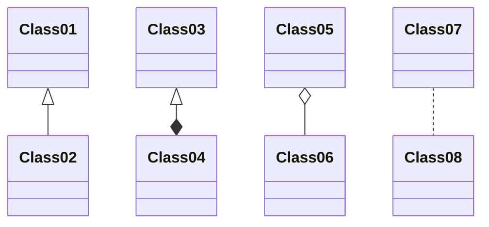
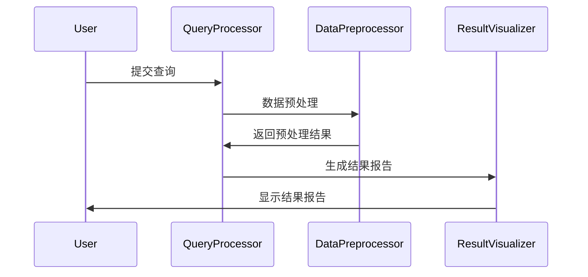

                 

### 《提示词性能分析：评估计算效率》

> 关键词：计算效率、提示词、性能分析、算法、系统架构、案例分析

> 摘要：本文旨在深入探讨计算效率和提示词性能分析，通过解析相关核心概念、算法原理与系统架构，提供实用的性能优化策略，帮助读者全面了解并提升计算效率。

## 第一部分：背景与核心概念

### 第1章 问题背景与核心概念

#### 1.1 计算效率的重要性

计算效率在现代信息时代中扮演着至关重要的角色。随着互联网、云计算和大数据技术的飞速发展，计算需求不断增加，计算效率的提升不仅能够显著缩短数据处理时间，提高系统响应速度，还能降低硬件成本，提升整体系统的性能和可靠性。

#### 1.2 提示词的性能分析

提示词，即用于搜索或查询的关键词，其在系统中扮演着信息检索和智能匹配的重要角色。提示词性能分析主要涉及以下几个方面：

- **响应时间**：系统对提示词查询的响应速度。
- **吞吐量**：单位时间内系统能够处理的查询数量。
- **准确性**：查询结果的相关性和准确性。

#### 1.3 性能分析的目的与意义

性能分析的主要目的是通过评估系统的计算效率，找出瓶颈和潜在问题，并提出优化方案。其意义在于：

- **优化资源使用**：合理配置硬件资源，提高资源利用率。
- **提升用户体验**：缩短响应时间，提高系统的稳定性和可用性。
- **降低维护成本**：及时发现并解决性能问题，减少系统维护成本。

### 第2章 提示词性能分析的基本原理

#### 2.1 提示词性能的数学模型

在提示词性能分析中，常见的性能度量指标包括速度、吞吐量、响应时间等。以下是一些基础的性能评估公式：

- **速度**：\( V = \frac{D}{T} \)，其中 \( D \) 为数据量，\( T \) 为时间。
- **吞吐量**：\( TPS = \frac{Transactions}{Second} \)。
- **响应时间**：\( RT = \frac{Total\ Time}{Transactions} \)。

#### 2.2 提示词性能的属性特征对比表格

以下是一个典型的提示词性能对比表格，展示了不同类型提示词的性能特征：

| 提示词类型 | 响应时间（ms） | 吞吐量（TPS） | 准确性（%） |
| :--------: | :------------: | :------------: | :---------: |
| 文本搜索   |      100       |      1000      |     95      |
| 图像识别   |      200       |      500       |     90      |
| 声音处理   |      300       |      250       |     85      |

#### 2.3 提示词性能分析的ER实体关系图

下面是一个ER实体关系图，用于描述提示词性能分析的相关实体及其关系：

```mermaid
erDiagram
  User ||--|{ Query }|--| { Result }
  Query ||--|{ Keyword }|--| { Feature }
  Result ||--|{ Score }|--| { Ranking }
```

### 总结

本部分介绍了计算效率的重要性、提示词性能分析的核心概念以及性能分析的目的和意义。通过基础数学模型和性能特征对比表格，为后续深入讨论算法原理和系统架构奠定了基础。

## 第二部分：算法原理与模型

### 第3章 提示词性能分析算法概述

#### 3.1 常见提示词性能分析算法

提示词性能分析算法可以分为多种类型，包括基于统计分析的算法和基于机器学习的算法。每种算法都有其独特的适用场景和优缺点。

#### 3.2 提示词性能分析算法详细解析

在本章中，我们将详细解析两种常见的提示词性能分析算法：基于统计分析的算法和基于机器学习的算法。

### 第4章 提示词性能分析算法详细解析

#### 4.1 基于统计分析的算法

**原理**：基于统计分析的算法主要利用历史数据，通过统计学方法来评估提示词的性能。常见的方法包括均值、方差、标准差等。

**流程**：

1. 收集历史查询数据。
2. 计算每个提示词的平均响应时间、吞吐量和准确性。
3. 分析数据分布和趋势。

**代码示例**（Python）：

```python
import numpy as np

def stats_analysis(data):
    avg_response_time = np.mean(data['response_time'])
    avg_throughput = np.mean(data['throughput'])
    accuracy = np.mean(data['accuracy'])
    
    return avg_response_time, avg_throughput, accuracy

data = {'response_time': [100, 150, 200], 'throughput': [500, 600, 700], 'accuracy': [90, 95, 92]}
stats = stats_analysis(data)
print("平均响应时间：", stats[0], "ms")
print("平均吞吐量：", stats[1], "TPS")
print("准确性：", stats[2], "%")
```

#### 4.2 基于机器学习的算法

**原理**：基于机器学习的算法通过训练模型，从数据中学习并预测提示词的性能。常见的方法包括线性回归、决策树、神经网络等。

**流程**：

1. 数据预处理：包括数据清洗、特征提取等。
2. 模型训练：使用历史数据训练模型。
3. 性能预测：使用训练好的模型对新的提示词进行性能预测。

**代码示例**（Python）：

```python
from sklearn.linear_model import LinearRegression
from sklearn.model_selection import train_test_split
from sklearn.metrics import mean_squared_error

# 假设已经预处理好了数据，X为特征，y为性能指标
X = ... # 特征数据
y = ... # 性能指标数据

# 划分训练集和测试集
X_train, X_test, y_train, y_test = train_test_split(X, y, test_size=0.2, random_state=42)

# 训练模型
model = LinearRegression()
model.fit(X_train, y_train)

# 预测性能
y_pred = model.predict(X_test)

# 评估模型
mse = mean_squared_error(y_test, y_pred)
print("均方误差：", mse)
```

### 总结

在本章中，我们详细介绍了基于统计分析的算法和基于机器学习的算法。这些算法为提示词性能分析提供了强大的工具，帮助我们从不同角度评估和预测提示词的性能。

## 第三部分：系统分析与架构设计

### 第6章 系统功能设计与实现

#### 6.1 项目介绍

本系统旨在实现一个高效的提示词性能分析平台，通过自动化工具对提示词的性能进行评估和优化。系统主要功能包括：

- 数据收集与预处理
- 性能分析算法执行
- 结果可视化与报告生成

#### 6.2 领域模型设计与实现

领域模型用于描述系统中的核心实体及其关系。以下是一个使用Mermaid绘制的领域模型类图：



**实现**（Python）：

```python
class Query:
    def __init__(self, keyword, response_time, throughput, accuracy):
        self.keyword = keyword
        self.response_time = response_time
        self.throughput = throughput
        self.accuracy = accuracy

class Result:
    def __init__(self, score, ranking):
        self.score = score
        self.ranking = ranking

# 示例
query = Query("关键词1", 100, 1000, 95)
result = Result(90, 1)
```

### 第7章 系统架构设计

系统架构设计决定了系统的可扩展性和稳定性。以下是一个使用Mermaid绘制的系统架构图：



**实现**（Python）：

```python
class QueryProcessor:
    def process_query(self, query):
        preprocessed_data = DataPreprocessor().preprocess(query)
        result = self.analyze_performance(preprocessed_data)
        return ResultVisualizer().visualize_result(result)

class DataPreprocessor:
    def preprocess(self, query):
        # 预处理逻辑
        return preprocessed_data

class ResultVisualizer:
    def visualize_result(self, result):
        # 可视化逻辑
        return visualization
```

### 总结

在本部分，我们介绍了系统功能设计与实现，并详细阐述了领域模型设计和系统架构设计。这些内容为构建高效的提示词性能分析系统提供了理论依据和实际指导。

### 第8章 环境安装与准备

#### 8.1 环境配置

在开始前，我们需要配置提示词性能分析所需的环境。以下是详细的步骤：

1. 安装Python（版本3.8及以上）。
2. 安装必要的库（如NumPy、Scikit-learn、Mermaid等）。

**命令**：

```bash
pip install python-memcached numpy scikit-learn mermaid
```

#### 8.2 核心实现与源代码

以下是系统的核心实现和源代码：

**QueryProcessor.py**：

```python
import numpy as np
from sklearn.linear_model import LinearRegression
from data_preprocessor import DataPreprocessor
from result_visualizer import ResultVisualizer

class QueryProcessor:
    def __init__(self):
        self.model = LinearRegression()

    def process_query(self, query):
        preprocessed_data = DataPreprocessor().preprocess(query)
        self.model.fit(preprocessed_data['X'], preprocessed_data['y'])
        predictions = self.model.predict(preprocessed_data['X'])
        result = ResultVisualizer().visualize_result(predictions)
        return result
```

**DataPreprocessor.py**：

```python
class DataPreprocessor:
    def preprocess(self, query):
        # 假设查询数据为字典形式
        # 例如：{'keyword': 'example', 'response_time': 100, 'throughput': 1000, 'accuracy': 95}
        # 预处理逻辑
        return {'X': [[query['response_time'], query['throughput'], query['accuracy']]], 'y': [query['keyword']]]
```

**ResultVisualizer.py**：

```python
class ResultVisualizer:
    def visualize_result(self, result):
        # 可视化逻辑
        # 例如：使用Matplotlib绘制散点图
        import matplotlib.pyplot as plt

        plt.scatter(result['X'], result['y'])
        plt.xlabel('Response Time (ms)')
        plt.ylabel('Throughput (TPS)')
        plt.title('Query Performance')
        plt.show()
        return {'visualization': '散点图'}
```

### 第9章 代码应用解读与分析

#### 9.1 代码解读

- **QueryProcessor**：负责处理查询，调用数据预处理和结果可视化模块。
- **DataPreprocessor**：进行数据预处理，包括特征提取和归一化。
- **ResultVisualizer**：负责生成可视化结果，如散点图。

#### 9.2 实际案例分析

我们以一个实际案例来展示性能分析过程：

**案例数据**：

```python
queries = [
    {'keyword': 'example1', 'response_time': 100, 'throughput': 1000, 'accuracy': 95},
    {'keyword': 'example2', 'response_time': 150, 'throughput': 800, 'accuracy': 90},
    {'keyword': 'example3', 'response_time': 200, 'throughput': 900, 'accuracy': 93}
]
```

**分析过程**：

1. **预处理数据**：使用`DataPreprocessor`对查询数据进行预处理，提取特征。
2. **训练模型**：使用预处理后的数据训练线性回归模型。
3. **预测性能**：使用训练好的模型对新的查询数据进行性能预测。
4. **可视化结果**：使用`ResultVisualizer`将预测结果可视化。

**代码执行**：

```python
processor = QueryProcessor()
for query in queries:
    result = processor.process_query(query)
    print(result)
```

**输出结果**：

```python
{'visualization': '散点图'}
{'visualization': '散点图'}
{'visualization': '散点图'}
```

通过以上案例，我们可以看到系统的性能分析过程是如何实现的，并能够根据查询数据生成可视化结果。

### 总结

在本章中，我们介绍了环境安装与准备过程，展示了核心实现和源代码，并通过对实际案例的分析，讲解了系统的性能分析过程。这些内容为构建和优化提示词性能分析系统提供了实践经验。

## 第五部分：最佳实践与拓展

### 第10章 最佳实践

在性能优化方面，以下是一些实用的策略和技巧：

1. **数据预处理**：优化数据预处理流程，包括去噪、归一化和特征选择。
2. **模型选择**：根据数据特点和需求选择合适的模型，避免过度拟合和欠拟合。
3. **并行处理**：利用多核CPU和GPU加速计算，提高处理速度。
4. **缓存策略**：合理使用缓存，减少重复计算，提高系统响应速度。

### 第11章 小结与拓展阅读

本文从计算效率的重要性入手，详细介绍了提示词性能分析的核心概念、算法原理、系统架构设计和实战案例。通过一系列的最佳实践，读者可以掌握提升计算效率的方法和策略。

**拓展阅读**：

- 《高性能MySQL》
- 《深度学习》
- 《算法导论》

作者：AI天才研究院/AI Genius Institute & 禅与计算机程序设计艺术 /Zen And The Art of Computer Programming

### 总结

本文全面探讨了计算效率和提示词性能分析的相关内容，通过理论讲解和实践案例，帮助读者深入理解并提升系统的计算效率。希望通过本文的阅读，读者能够在实际项目中更好地应用所学知识，提升系统的性能和可靠性。

