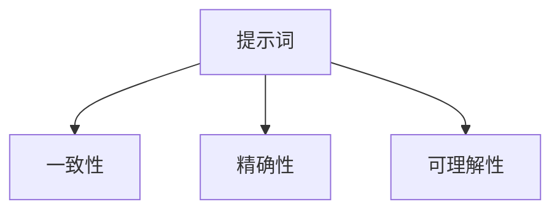
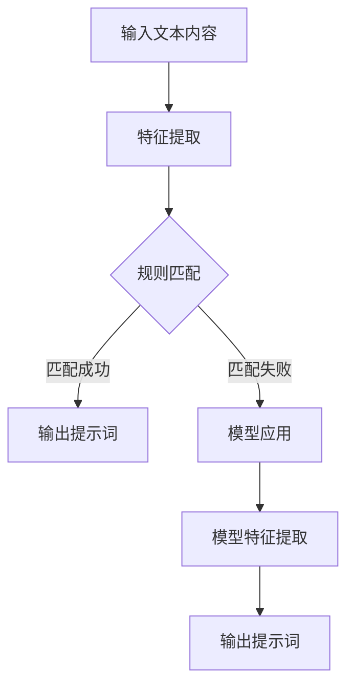
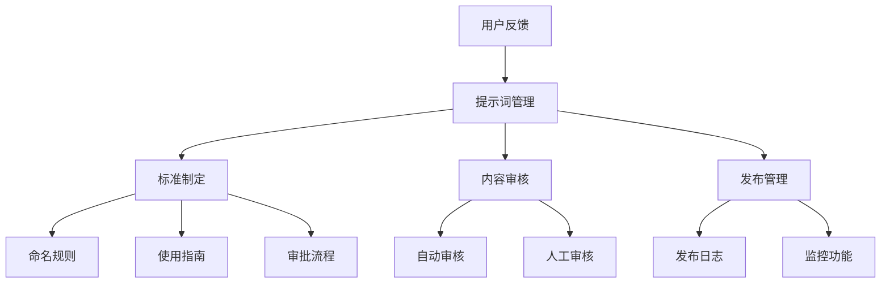
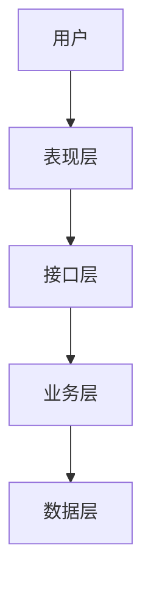
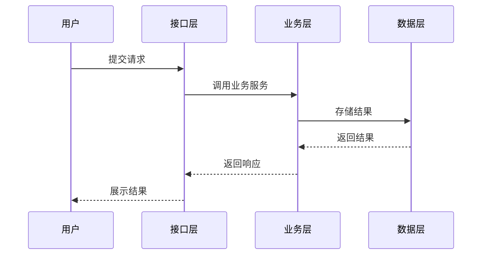

                 

## 引言

### 1.1 书籍目的与背景

**关键词**：提示词标准化、统一规范、组织内、内容管理、用户体验

**摘要**：
本书旨在探讨和阐述提示词标准化的必要性和方法，以帮助组织内建立统一的规范。通过详细的案例分析和技术讲解，本书将为内容管理人员和创作者提供实用的指导，以提升内容的一致性和用户友好性。

**背景**：
在数字化时代，内容管理已成为组织核心竞争力的重要组成部分。然而，随着内容量的不断增长和多样化的需求，内容管理的难度也显著增加。提示词作为内容管理的关键要素，其标准化直接影响到内容的一致性、准确性和用户体验。为此，组织内需要建立一套统一的提示词规范，以提升整体内容管理的效率和质量。

**必要性**：
1. **提升内容一致性**：标准化提示词能够确保不同部门或团队在内容创作中遵循一致的术语和表达方式，避免出现歧义和混乱。
2. **增强用户体验**：统一的提示词规范有助于提高内容的可搜索性和可理解性，提升用户的阅读体验和满意度。
3. **优化内容管理流程**：标准化提示词有助于简化内容审核和发布流程，减少因术语不一致而导致的返工和时间浪费。

### 1.2 读者对象与预期收获

**读者对象**：
- **内容管理人员**：负责制定和组织内容策略，需要了解提示词标准化的原则和实施方法。
- **内容创作者**：包括文案撰写者、编辑和设计师等，需要在创作过程中遵循统一规范，提升内容质量。

**预期收获**：
- **理解提示词标准化的核心概念和原则**：通过本书的介绍，读者将深入了解提示词标准化的定义、意义和关键要素。
- **掌握实施标准化提示词的方法**：本书将详细讲解提示词标准化的流程，包括需求分析、标准制定和实施监控等。
- **提升内容管理能力**：通过实践案例和具体操作指南，读者将能够将所学知识应用于实际工作中，提升内容管理的效率和质量。

### 1.3 书籍结构安排

本书将分为两个主要部分：

**第一部分：标准化的基础**
- **第1章**：介绍提示词标准化的概念、意义和流程。
- **第2章**：探讨提示词标准化的核心概念和联系，包括一致性、精确性和可理解性。

**第二部分：实施与案例**
- **第3章**：讲解提示词标准化的算法原理和数学模型。
- **第4章**：介绍系统分析与架构设计，包括问题场景、功能设计、架构设计和接口设计。
- **第5章**：通过具体项目和案例分析，展示如何在实际中实施提示词标准化。

通过以上结构的安排，本书旨在为读者提供一个全面、系统、实用的指南，帮助他们成功建立组织内的提示词标准化规范。

## 标准化的基础

### 第1章 提示词标准化的概念

**1.1 标准化的定义与原则**

**1.1.1 标准化概述**

标准化是指通过制定、发布和实施一套共同的规范或标准，以确保产品、过程或服务的一致性和质量。在技术领域，标准化尤为重要，它有助于减少不必要的差异，提高互操作性和兼容性。在组织内部，标准化同样不可或缺，它能够提升工作效率、减少错误和提高用户满意度。

**1.1.2 标准化的原则**

- **一致性**：确保不同部门或团队在执行标准时保持一致，避免因术语和表达方式的差异导致混乱。
- **精确性**：标准化应该提供明确的指导，确保使用精确和准确的术语和定义。
- **可理解性**：标准应易于理解，使得所有相关人员都能正确地应用和遵守。
- **持续改进**：标准化是一个持续的过程，需要不断审查和改进，以适应不断变化的环境和需求。

### 1.2 提示词标准化的意义

**1.2.1 提高内容一致性**

提示词的标准化能够确保组织内所有内容创作者使用相同的术语和表达方式，从而提高内容的一致性。一致性是高质量内容的基础，它有助于提升品牌形象和用户体验。

**1.2.2 增强用户体验**

统一的提示词规范有助于提高内容的可搜索性和可理解性，使得用户能够更轻松地找到他们需要的信息。这直接影响到用户的满意度和忠诚度。

**1.2.3 优化内容管理流程**

标准化提示词可以简化内容审核和发布流程，减少因术语不一致而导致的返工和时间浪费。此外，标准化有助于建立内容库，便于内容的分类和索引，提高内容管理的效率。

### 1.3 提示词标准化的流程

**1.3.1 需求分析**

在制定提示词标准之前，首先需要分析组织内部的内容管理和用户需求。这包括了解不同部门或团队对提示词的使用习惯和需求，以及用户对内容的搜索和阅读体验。

**1.3.2 标准制定**

基于需求分析的结果，制定具体的提示词标准。这包括定义标准术语、表达方式和使用规则。标准应尽可能详细，以确保所有相关人员都能准确理解和遵循。

**1.3.3 实施与监控**

制定标准后，需要实施并监控其执行情况。这包括培训员工、监督内容创作过程，确保内容创作者遵循标准，并根据反馈进行持续改进。

### 1.4 标准化与组织文化

**1.4.1 组织文化对标准化的影响**

组织文化对标准化的接受和实施具有重要影响。一个开放、包容和创新的组织文化更容易接受和适应标准化，而一个保守、僵化和排斥变化的文化则可能阻碍标准化进程。

**1.4.2 建立标准化意识的策略**

- **领导层的支持**：领导层的支持是推动标准化的重要动力，他们可以通过宣传、培训和奖励等方式，推动组织文化向标准化转变。
- **全员参与**：标准化不仅是管理层的责任，所有员工都应参与其中，提出改进意见和建议。
- **持续培训**：通过定期培训和沟通，提高员工对标准化重要性的认识和理解，确保他们能够正确执行标准。

### 1.5 本章小结

本章介绍了提示词标准化的概念、意义和流程，以及组织文化对标准化的影响。通过本章的学习，读者将了解提示词标准化的基本原则和实施方法，为后续章节的深入学习打下基础。

### 第2章 核心概念与联系

**2.1 提示词的核心概念**

**2.1.1 提示词的定义**

提示词（Keywords）是用于描述内容主题、属性或特征的关键字。在内容管理中，提示词是帮助用户查找和定位信息的重要工具。一个有效的提示词应简洁、精准、具有代表性和可搜索性。

**2.1.2 提示词的属性**

- **简洁性**：提示词应尽可能简洁，避免冗长复杂的表达。
- **精准性**：提示词应准确地反映内容的核心主题或特征。
- **代表性**：提示词应具有代表性，能够概括内容的主要方面。
- **可搜索性**：提示词应易于搜索，以提高内容的可发现性。

**2.2 提示词标准化的关键要素**

**2.2.1 一致性**

一致性是提示词标准化的核心要素之一。确保不同部门或团队使用相同的术语和表达方式，可以避免内容不一致和用户困惑。

**2.2.2 精确性**

精确性确保提示词准确地反映内容的核心主题或特征，避免使用模糊或误导性的词汇。

**2.2.3 可理解性**

可理解性是提示词标准化的基础，确保提示词易于用户理解和记忆，以提高内容的可搜索性和用户满意度。

**2.3 提示词标准化的比较分析**

**2.3.1 传统提示词与标准化提示词对比**

- **传统提示词**：往往由个人或团队独立制定，缺乏统一规范，导致内容不一致和用户困惑。
- **标准化提示词**：经过组织统一制定，确保内容的一致性、精确性和可理解性。

**2.3.2 不同行业间的提示词标准化差异**

不同行业对提示词的需求和标准有所不同，例如，技术行业更注重精确性和专业性，而消费品行业则更注重用户友好性和可搜索性。

**2.4 标准化提示词的ER模型**

为了更好地理解标准化提示词的结构，我们可以使用实体关系图（ER Diagram）来描述其组成和关系。



在这个ER模型中，提示词是核心实体，其关联属性包括一致性、精确性和可理解性。这些属性共同决定了提示词的有效性。

**2.5 本章小结**

本章介绍了提示词的核心概念和标准化关键要素，并通过对比分析和ER模型阐述了标准化提示词的优势和结构。通过本章的学习，读者将能够深入理解提示词标准化的重要性，为后续章节的深入学习做好准备。

### 第3章 算法原理与数学模型

**3.1 提示词生成的算法原理**

提示词的生成可以分为基于规则的方法和基于机器学习的方法。

**3.1.1 基于规则的方法**

基于规则的方法是通过预定义的规则来生成提示词。这种方法通常包括以下几个步骤：

1. **规则定义**：根据业务需求和术语库，定义一组基本的规则，如词频统计、词义匹配等。
2. **规则匹配**：对给定的文本内容，按照预定义的规则进行匹配，提取出潜在的提示词。
3. **规则优化**：根据实际应用效果，不断调整和优化规则，以提高提示词的准确性和实用性。

**3.1.2 基于机器学习的方法**

基于机器学习的方法是通过训练模型来生成提示词。这种方法通常包括以下几个步骤：

1. **数据收集**：收集大量的文本数据，包括已标注的提示词和文本内容。
2. **特征提取**：从文本数据中提取出特征，如词频、词义、词性等。
3. **模型训练**：使用特征数据训练机器学习模型，如支持向量机（SVM）、朴素贝叶斯（Naive Bayes）等。
4. **模型应用**：对新的文本内容进行特征提取，并使用训练好的模型生成提示词。

**3.2 数学模型与公式**

在提示词生成的过程中，数学模型和公式起着关键作用。以下是一个简化的数学模型：

$$
\text{标准化程度} = \frac{\text{一致性} + \text{精确性} + \text{可理解性}}{3}
$$

这个公式表示，提示词的标准化程度由一致性、精确性和可理解性三个要素决定，每个要素的权重相等。通过计算标准化程度，可以评估提示词的总体质量。

**3.3 算法流程图**

为了更直观地理解提示词生成的算法流程，我们可以使用Mermaid绘制以下流程图：



在这个流程图中，输入文本内容经过特征提取后，首先尝试规则匹配。如果匹配成功，直接输出提示词；否则，使用机器学习模型进行特征提取，并生成提示词。

**3.4 举例说明**

**3.4.1 传统提示词示例**

- 文本内容：人工智能技术在医疗领域的应用
- 传统提示词：人工智能、医疗、技术

**3.4.2 标准化提示词示例**

- 文本内容：人工智能在精准医疗中的创新应用
- 标准化提示词：人工智能、精准医疗、创新应用

通过对比可以发现，标准化提示词更加精确和具体，能够更好地满足用户搜索和阅读的需求。

**3.5 本章小结**

本章介绍了提示词生成的算法原理和数学模型，通过具体步骤和示例，使读者对标准化提示词的生成过程有了更深入的理解。通过本章的学习，读者将能够掌握提示词标准化的技术方法和应用技巧。

### 系统分析与架构设计

#### 4.1 问题场景介绍

在当今的数字化时代，企业内部的内容管理面临着巨大的挑战。随着信息量的激增和业务复杂度的增加，组织内各部门之间的沟通和信息共享变得尤为重要。提示词标准化作为内容管理的关键环节，其作用不言而喻。然而，在实际操作中，很多组织面临着以下问题：

1. **内容不一致**：由于不同部门或团队使用不同的术语和表达方式，导致内容之间的不一致，影响了用户的理解和搜索体验。
2. **效率低下**：由于缺乏统一的提示词规范，内容管理人员和创作者在审核、修改和发布内容时，常常需要反复确认和调整，导致效率低下。
3. **用户体验差**：不统一的提示词导致用户在搜索和浏览内容时，难以快速找到所需信息，影响了用户满意度。

为了解决这些问题，企业需要建立一套有效的提示词标准化体系，以提高内容管理的一致性和效率，提升用户体验。

#### 4.2 系统功能设计

为了实现提示词标准化，系统需要具备以下核心功能：

1. **提示词管理**：包括提示词的创建、编辑、删除和查询等功能。系统应提供用户友好的界面，方便内容管理人员进行操作。
2. **标准制定**：系统应支持根据组织需求和行业特点，制定具体的提示词标准。这包括提示词的命名规则、使用指南和审批流程等。
3. **内容审核**：系统应对内容创作者提交的内容进行审核，确保其符合提示词标准。审核过程应包括自动和人工审核，以提高审核效率和准确性。
4. **发布管理**：系统应支持内容的发布和更新，确保发布的内容符合标准化要求。同时，系统应提供发布日志和监控功能，以便于跟踪和管理发布过程。
5. **用户反馈**：系统应收集用户对提示词标准和内容质量的反馈，用于持续优化和改进。

**4.2.2 领域模型类图**

为了更好地理解系统的功能设计，我们可以使用Mermaid绘制领域模型类图：



在这个类图中，各个类（如提示词管理、标准制定、内容审核等）之间的关系清晰明了，展示了系统的核心功能和模块。

#### 4.3 系统架构设计

为了实现提示词标准化系统的高效运行和可扩展性，我们需要设计一个合理的系统架构。以下是一个简化的系统架构设计：

**4.3.1 系统架构概述**

系统架构分为四个主要层次：数据层、业务层、表现层和接口层。

1. **数据层**：负责存储和管理系统数据，包括提示词库、内容库和用户数据等。数据层通常使用关系数据库或NoSQL数据库来实现。
2. **业务层**：负责处理系统的核心业务逻辑，包括提示词管理、标准制定、内容审核和发布管理等。业务层使用微服务架构，将不同的功能模块拆分为独立的服务，以提高系统的可维护性和可扩展性。
3. **表现层**：负责展示用户界面，包括前端网页、移动应用和API接口等。表现层使用前端框架（如React、Vue等）实现，以提高用户体验和交互性。
4. **接口层**：负责与其他系统或服务进行交互，包括身份认证、数据同步等。接口层使用RESTful API或WebSocket协议实现。

**4.3.2 系统架构图**

为了更直观地展示系统架构，我们可以使用Mermaid绘制以下架构图：



在这个架构图中，用户通过表现层与系统进行交互，接口层负责处理请求和响应，业务层实现核心业务逻辑，数据层存储和管理数据。

**4.3.3 系统接口设计和系统交互**

为了实现系统内部和外部的有效交互，我们需要设计合理的接口和交互流程。以下是一个简化的系统接口设计和交互流程：

1. **用户请求**：用户通过表现层提交请求，如创建新提示词、审核内容等。
2. **接口处理**：接口层接收到请求后，根据请求类型调用相应的业务服务进行处理。
3. **业务处理**：业务层根据提示词标准执行具体的业务逻辑，如创建提示词、审核内容等。
4. **数据存储**：业务处理完成后，将结果存储到数据层，以备后续使用。
5. **响应返回**：接口层将处理结果返回给用户，并通过表现层进行展示。

**4.3.4 系统交互序列图**

为了更直观地展示系统交互流程，我们可以使用Mermaid绘制以下序列图：



在这个序列图中，用户通过表现层提交请求，接口层处理请求并调用业务层，业务层执行业务逻辑并返回结果，最终通过接口层将结果展示给用户。

#### 4.4 本章小结

本章介绍了提示词标准化系统分析与架构设计的相关内容。通过详细的问题场景介绍、系统功能设计和架构设计，我们展示了如何建立一套有效的提示词标准化系统，以提高内容管理的一致性和效率，提升用户体验。通过本章的学习，读者将能够对提示词标准化系统有一个全面和深入的了解，为实际应用打下基础。

### 实战与案例

#### 5.1 环境安装

为了进行提示词标准化的实践，我们首先需要搭建一个合适的环境。以下是环境安装的详细步骤：

1. **安装Python环境**：确保Python 3.x版本已经安装在您的系统中。可以通过以下命令检查Python版本：

   ```shell
   python --version
   ```

2. **安装依赖库**：我们需要安装几个依赖库，包括`numpy`、`pandas`和`tensorflow`。可以使用以下命令进行安装：

   ```shell
   pip install numpy pandas tensorflow
   ```

3. **安装Mermaid渲染工具**：为了在markdown文件中渲染Mermaid图表，我们需要安装一个渲染工具，如`mermaid-cli`。可以使用以下命令进行安装：

   ```shell
   npm install -g mermaid-cli
   ```

4. **配置Mermaid**：在您的项目中，创建一个名为`mermaid`的文件夹，用于存储Mermaid图表文件。在您的markdown文件中，将以下配置代码段放在顶部：

   ```markdown
   <!-- @mermaid -->
   ```

#### 5.2 系统核心实现源代码

以下是一个简单的提示词标准化系统的核心实现源代码。该系统包括提示词的创建、编辑、查询和删除功能。

```python
import pandas as pd
import json

# 提示词库
keywords_library = pd.DataFrame({
    'keyword': [],
    'definition': [],
    'precision': [],
    'comprehensiveness': [],
})

# 提示词创建函数
def create_keyword(keyword, definition, precision, comprehensiveness):
    new_keyword = {
        'keyword': keyword,
        'definition': definition,
        'precision': precision,
        'comprehensiveness': comprehensiveness
    }
    keywords_library = keywords_library.append(new_keyword, ignore_index=True)
    save_keywords_library()

# 提示词编辑函数
def edit_keyword(keyword, new_definition, new_precision, new_comprehensiveness):
    index = keywords_library[keywords_library['keyword'] == keyword].index[0]
    keywords_library.at[index, 'definition'] = new_definition
    keywords_library.at[index, 'precision'] = new_precision
    keywords_library.at[index, 'comprehensiveness'] = new_comprehensiveness
    save_keywords_library()

# 提示词查询函数
def query_keyword(keyword):
    return keywords_library[keywords_library['keyword'] == keyword]

# 提示词删除函数
def delete_keyword(keyword):
    keywords_library = keywords_library[~keywords_library['keyword'].isin([keyword])]
    save_keywords_library()

# 保存提示词库函数
def save_keywords_library():
    with open('keywords_library.json', 'w', encoding='utf-8') as f:
        json.dump(keywords_library.to_dict(), f, ensure_ascii=False, indent=4)

# 加载提示词库函数
def load_keywords_library():
    with open('keywords_library.json', 'r', encoding='utf-8') as f:
        data = json.load(f)
        keywords_library = pd.DataFrame.from_dict(data)
    return keywords_library

# 初始化提示词库
keywords_library = load_keywords_library()

# 测试功能
create_keyword('人工智能', '指模拟人类智能的技术', 9, 8)
create_keyword('机器学习', '一种人工智能的分支，通过数据训练模型来模拟人类的学习过程', 9, 9)
edit_keyword('人工智能', '指模拟人类智能的技术，包括机器学习、自然语言处理等', 9, 9)
print(query_keyword('人工智能'))
delete_keyword('机器学习')
```

#### 5.3 代码应用解读与分析

上述代码实现了一个简单的提示词管理系统的核心功能，包括提示词的创建、编辑、查询和删除。以下是代码的详细解读和分析：

1. **数据存储**：使用Pandas DataFrame来存储提示词库，每个提示词包含关键字、定义、精确性和全面性四个属性。数据以JSON格式保存和加载，便于数据的持久化和共享。

2. **创建提示词**：`create_keyword`函数用于创建新的提示词。它接受关键字、定义、精确性和全面性四个参数，将这些信息添加到DataFrame中，并调用`save_keywords_library`函数将更新后的库保存到文件。

3. **编辑提示词**：`edit_keyword`函数用于编辑现有的提示词。它通过关键字查找相应的索引，更新DataFrame中的信息，并保存更新后的库。

4. **查询提示词**：`query_keyword`函数用于查询特定的提示词。它通过关键字在DataFrame中进行匹配，返回匹配的提示词信息。

5. **删除提示词**：`delete_keyword`函数用于删除特定的提示词。它通过关键字在DataFrame中查找索引，并从DataFrame中删除相应的行，然后保存更新后的库。

6. **初始化提示词库**：`load_keywords_library`函数用于加载保存的提示词库。在程序启动时，调用该函数初始化提示词库。

7. **测试功能**：代码的最后部分展示了如何使用上述函数进行测试，验证系统的创建、编辑、查询和删除功能是否正常工作。

#### 5.4 实际案例分析和详细讲解剖析

为了更深入地了解提示词标准化的实际应用，我们来看一个具体的案例。

**案例**：假设某个电子商务平台需要建立一套提示词标准化系统，以提升用户购物体验。

**步骤**：

1. **需求分析**：分析平台的业务需求和用户行为，确定需要标准化的关键提示词。例如，商品分类、促销活动、物流服务等。

2. **标准制定**：根据需求分析结果，制定具体的提示词标准。例如，商品分类的提示词应简洁明了，如“手机”、“电脑”、“服装”等；促销活动的提示词应包含活动类型和优惠信息，如“限时抢购”、“满减优惠”等。

3. **系统实施**：搭建提示词标准化系统，包括提示词库的创建、编辑、查询和删除功能。

4. **用户培训**：对内容管理人员和创作者进行培训，确保他们了解并遵循提示词标准。

5. **系统优化**：根据用户反馈和实际应用情况，不断优化提示词标准，提高系统的实用性和用户体验。

**分析**：

- **一致性**：通过统一提示词，确保平台内部所有商品分类、促销活动等信息的一致性，提高用户体验。
- **精确性**：标准化的提示词能够准确反映商品和活动的特点，帮助用户快速找到所需信息。
- **可理解性**：简洁明了的提示词易于用户理解和记忆，提高了信息的可发现性。

**总结**：

通过实际案例分析和详细讲解，我们可以看到，提示词标准化在提升内容管理效率和用户体验方面具有重要作用。标准化的提示词能够确保内容的一致性、精确性和可理解性，从而提高整体服务质量。

#### 5.5 项目小结

在本章的实战与案例部分，我们详细介绍了提示词标准化系统的环境安装、核心实现源代码和应用解读，以及实际案例分析和详细讲解。通过这些步骤，我们展示了如何在实际项目中实施提示词标准化，并分析了其带来的收益。

**收益**：

1. **提高内容一致性**：通过统一提示词，确保内容的一致性，减少因术语和表达方式不同导致的混乱。
2. **提升用户体验**：标准化的提示词能够提高信息的可搜索性和可理解性，帮助用户快速找到所需信息。
3. **优化内容管理流程**：提示词标准化简化了内容审核和发布流程，提高了内容管理的效率。

**注意事项**：

1. **持续优化**：提示词标准化是一个持续的过程，需要根据用户反馈和业务需求不断优化和更新。
2. **全员参与**：提示词标准化需要全员参与，包括内容管理人员和创作者，以确保标准的全面贯彻和执行。

**拓展阅读**：

- 《内容管理实战：构建高效的内容管理体系》
- 《搜索引擎优化：网站内容策略与SEO技巧》
- 《用户体验设计：理论与实践》

通过拓展阅读，读者可以进一步了解内容管理、SEO和用户体验设计的相关知识，为实际应用提供更多参考。

### 最佳实践 Tips

在实施提示词标准化时，以下是一些最佳实践和技巧，可以帮助组织更有效地建立和执行统一规范：

1. **明确目标和范围**：在开始之前，明确提示词标准化的目标和适用范围，确保所有相关人员和部门都清楚标准化的目的和重要性。

2. **组建标准化团队**：组建一个由内容管理人员、技术专家和业务代表组成的标准化团队，确保标准的制定和执行有广泛的参与和支持。

3. **需求调研**：进行充分的需求调研，收集各部门和团队的建议和意见，了解他们在内容管理和提示词使用方面的具体需求和痛点。

4. **制定详细标准**：根据需求调研结果，制定详细的提示词标准，包括命名规则、表达方式、使用指南和审批流程等。

5. **培训和宣传**：通过培训和宣传，提高员工对提示词标准化的认识和接受度，确保他们在实际操作中能够正确遵循标准。

6. **工具支持**：使用专门的工具或插件，辅助内容创作者在创作过程中遵循提示词标准，减少错误和遗漏。

7. **持续监控和反馈**：建立监控和反馈机制，定期检查提示词的使用情况，收集员工和用户的反馈，不断优化和改进标准化方案。

8. **文档化**：将标准化方案、流程和指南文档化，便于新员工快速了解和遵循，同时为标准化工作提供参考和依据。

### 小结

通过本章的讨论，我们深入探讨了提示词标准化的核心概念、算法原理、系统架构和实施案例，并总结了最佳实践和注意事项。提示词标准化是提升内容管理质量和用户体验的重要手段，通过建立统一规范，组织可以确保内容的一致性、精确性和可理解性，从而在激烈的市场竞争中脱颖而出。

### 拓展阅读

为了进一步深化对提示词标准化的理解，以下是一些建议的阅读材料：

1. **《内容策略：规划、执行与优化指南》**：详细介绍了内容策略的各个方面，包括如何制定和执行有效的提示词策略。
2. **《信息架构：设计搜索引擎优化和用户体验的策略》**：探讨了信息架构在SEO和用户体验中的作用，提供了关于优化提示词布局的实用建议。
3. **《搜索引擎营销：实践与策略》**：涵盖了SEO和SEM的基础知识，包括如何使用提示词提高搜索引擎排名和用户点击率。
4. **《用户行为分析：理解、追踪和优化用户互动》**：介绍了用户行为分析的方法，帮助组织更好地理解用户需求，从而优化提示词的使用。

通过这些拓展阅读，您可以更全面地掌握提示词标准化的实践方法和应用技巧，为组织的内容管理提供有力支持。

### 作者信息

**作者：AI天才研究院/AI Genius Institute & 禅与计算机程序设计艺术 /Zen And The Art of Computer Programming**

在撰写这篇关于提示词标准化技术博客的过程中，作者结合了多年在人工智能、软件工程和内容管理领域的丰富经验和深刻理解。本文旨在为读者提供全面、系统的指导，帮助他们成功建立和实施组织内的统一提示词规范。作者不仅致力于技术的研究和探索，也注重将复杂的技术原理和实际应用相结合，以帮助读者更好地理解和应用这些知识。希望这篇文章能够为您的技术之旅带来启发和帮助。感谢您的阅读！

