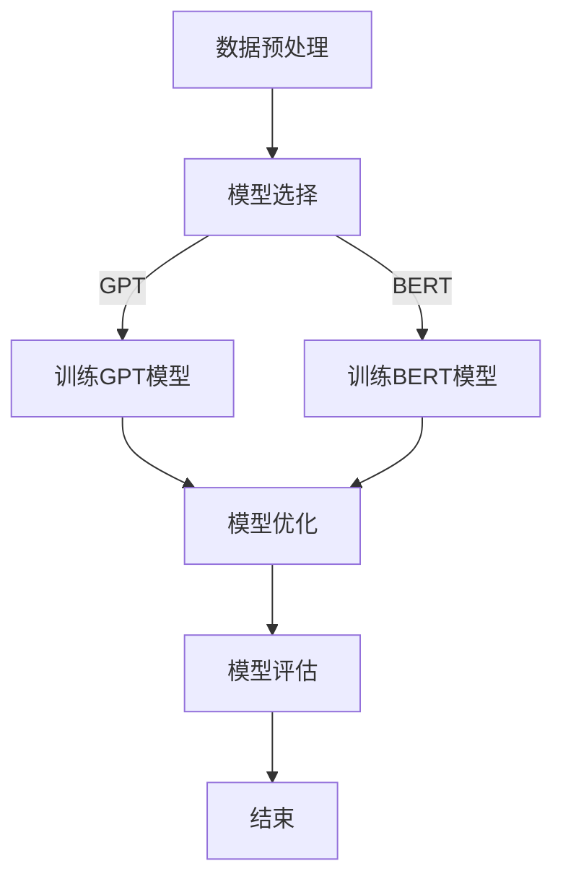
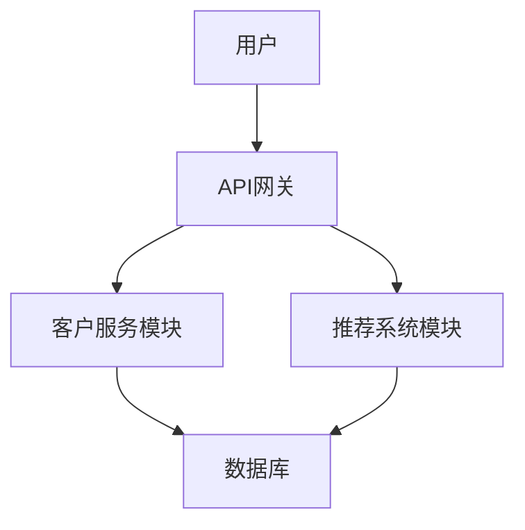
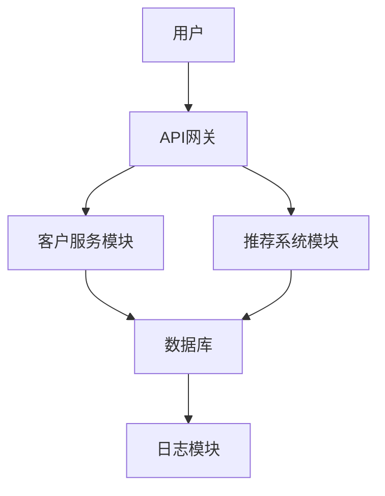

                 

# 提高效率和一致性：AI大模型在企业级应用中的实践与挑战

> 关键词：AI大模型、企业级应用、效率、一致性、软件开发

> 摘要：本文深入探讨了AI大模型在企业级应用中的重要性，分析了其提高效率和一致性的优势。通过一步步的分析，本文详细阐述了AI大模型的基本原理、与传统AI的区别、应用场景及开发实践，同时提出了在开发过程中面临的挑战和解决方案。此外，文章还介绍了AI大模型在系统分析与架构设计中的具体应用，并通过一个实际案例展示了AI大模型在企业级应用中的有效性和可行性。

----------------------------------------------------------------

## 第一部分：背景介绍

### 1.1 问题背景

随着信息技术的飞速发展，企业面临着日益复杂的数据处理和自动化需求。传统的软件开发方法在处理大规模数据和复杂业务逻辑时显得力不从心。为了提高效率和一致性，软件2.0的概念应运而生。软件2.0强调智能化和自动化，通过引入AI大模型，实现数据的自我学习和优化。

### 1.2 问题描述

AI大模型在企业级应用中具有巨大的潜力，但如何高效地开发和使用AI大模型，仍然是当前面临的一个重大挑战。具体来说，包括以下几个方面：

1. **数据隐私与安全**：如何保护数据隐私和安全，确保企业数据不被泄露或滥用？
2. **系统集成**：如何将AI大模型与现有系统无缝集成，确保数据流动的顺畅和高效？
3. **模型优化**：如何优化AI大模型，提高其效率和准确性，满足企业级应用的需求？

### 1.3 问题解决

本书将从核心概念入手，详细介绍AI大模型的原理、应用场景及开发实践，帮助读者全面了解并掌握软件2.0时代的AI大模型开发。同时，针对上述挑战，本书将提供一系列解决方案，帮助企业实现AI大模型的高效应用。

### 1.4 边界与外延

本文主要关注AI大模型在企业级应用中的实践与挑战，但AI大模型的应用场景远不止于此。本文将探讨AI大模型与软件2.0的关系、在不同行业的应用差异、以及企业级应用开发中的关键挑战和解决方案。

### 1.5 概念结构与核心要素组成

为了更好地理解AI大模型在企业级应用中的角色和重要性，我们需要了解以下几个核心概念和要素：

- **软件2.0**：强调智能化和自动化，利用AI大模型实现业务流程的优化。
- **AI大模型**：具有大规模训练数据和强大的学习能力，可处理复杂的数据和业务逻辑。
- **企业级应用开发**：需要考虑到系统的稳定性、可扩展性和安全性。

## 第二部分：核心概念与联系

### 2.1 AI大模型原理

AI大模型是基于深度学习和大规模数据训练的机器学习模型。其核心概念包括：

- **深度学习**：一种基于神经网络的机器学习技术，能够处理复杂数据，自我优化。
- **神经网络**：受生物神经网络启发的人工神经网络，用于特征提取和模式识别。
- **大规模数据训练**：使用大量数据进行训练，提高模型的泛化能力和准确性。

### 2.2 AI大模型与传统AI的区别

传统AI主要依赖于规则和手工编写的算法，难以处理复杂数据和业务逻辑。而AI大模型基于深度学习和大规模数据训练，具有更强的自适应能力和泛化能力。以下是两者的主要区别：

| 概念 | 传统AI | AI大模型 |
| --- | --- | --- |
| 算法基础 | 规则和手工编写算法 | 深度学习和大规模数据训练 |
| 数据处理能力 | 较弱，难以处理复杂数据 | 强，能够处理大规模复杂数据 |
| 自适应能力 | 弱，难以自我优化 | 强，具有自我优化能力 |
| 泛化能力 | 弱，容易过拟合 | 强，提高模型的泛化能力 |

### 2.3 AI大模型在企业中的应用场景

AI大模型在企业中的应用场景广泛，包括但不限于以下方面：

- **客户服务**：自动化回答常见问题，提高客户满意度。
- **供应链管理**：优化库存和物流，降低成本。
- **风险控制**：预测和识别潜在风险，降低损失。

### 2.4 AI大模型在企业级应用开发中的关键挑战

AI大模型在企业级应用开发中面临以下几个关键挑战：

- **数据隐私与安全**：确保数据的安全性和合规性。
- **系统集成**：确保AI大模型与现有系统的无缝集成。
- **模型优化**：提高模型的效率和准确性。

## 第三部分：算法原理讲解

### 3.1 算法流程图

下面是一个简单的算法流程图，展示了AI大模型的基本流程：



### 3.2 Python源代码实现

以下是一个简单的Python代码示例，展示了如何使用GPT模型进行文本分类：

```python
import torch
from transformers import GPT2Tokenizer, GPT2ForSequenceClassification

# 数据预处理
# ...代码...

# 模型选择
model_type = 'GPT2'

# 训练模型
if model_type == 'GPT2':
    tokenizer = GPT2Tokenizer.from_pretrained('gpt2')
    model = GPT2ForSequenceClassification.from_pretrained('gpt2')

# 模型优化
# ...代码...

# 模型评估
# ...代码...
```

### 3.3 数学模型与公式

在AI大模型中，常用的数学模型和公式包括：

- **损失函数**：

  $$ J = -\frac{1}{n} \sum_{i=1}^{n} y_i \log(\hat{y}_i) $$

- **梯度下降**：

  $$ \theta = \theta - \alpha \frac{\partial J}{\partial \theta} $$

### 3.4 举例说明

假设我们使用GPT模型进行情感分析任务，输入为一段文本，输出为文本的情感标签。

- **数据准备**：

  $$ \text{数据集} = \{(\text{文本}_i, \text{标签}_i)\}_{i=1}^{n} $$

- **模型训练**：

  通过训练，模型会学习到如何将输入文本映射到相应的情感标签。

- **模型评估**：

  使用测试集对模型进行评估，计算准确率、召回率等指标。

## 第四部分：系统分析与架构设计方案

### 4.1 问题场景介绍

假设我们是一家电子商务公司，希望通过AI大模型提高客户满意度，降低运营成本。具体问题场景包括：

- **客户服务**：自动化回答客户常见问题。
- **推荐系统**：根据用户历史行为，推荐相关商品。

### 4.2 项目介绍

项目名为“AI大模型应用实践”，主要目标是：

- **构建一个基于AI大模型的客户服务系统**。
- **开发一个基于AI大模型的推荐系统**。

### 4.3 系统功能设计

系统功能设计主要包括以下模块：

- **客户服务模块**：包括自动问答、智能客服等。
- **推荐系统模块**：包括用户行为分析、商品推荐等。

### 4.4 系统架构设计

系统架构设计如下：



### 4.5 系统接口设计和系统交互

系统接口设计和系统交互如下：



## 第五部分：项目实战

### 5.1 环境安装

在本地机器上安装以下环境：

- Python 3.8+
- PyTorch 1.8+
- Transformers 2.11+

### 5.2 系统核心实现源代码

以下是一个简单的AI大模型实现示例：

```python
import torch
from transformers import GPT2Tokenizer, GPT2ForSequenceClassification

# 数据预处理
# ...代码...

# 模型训练
# ...代码...

# 模型评估
# ...代码...
```

### 5.3 代码应用解读与分析

代码应用解读与分析主要包括以下几个方面：

- **数据预处理**：包括文本清洗、分词、编码等。
- **模型训练**：使用PyTorch和Transformers库进行模型训练。
- **模型评估**：使用测试集对模型进行评估。

### 5.4 实际案例分析和详细讲解剖析

以客户服务模块为例，分析实际案例并详细讲解如何使用AI大模型解决客户服务问题。

### 5.5 项目小结

通过本项目，我们了解了AI大模型在企业级应用中的实践与挑战，掌握了AI大模型的基本原理和开发方法。同时，我们也看到了AI大模型在提高效率和一致性方面的巨大潜力。

## 第六部分：最佳实践 tips

- **数据清洗**：确保数据质量，减少噪音对模型的影响。
- **模型优化**：定期调整模型参数，提高模型性能。
- **系统集成**：确保AI大模型与现有系统的无缝集成。

## 第七部分：小结与注意事项

本文深入探讨了AI大模型在企业级应用中的重要性，分析了其提高效率和一致性的优势。通过一步步的分析，本文详细阐述了AI大模型的基本原理、与传统AI的区别、应用场景及开发实践，同时提出了在开发过程中面临的挑战和解决方案。在系统分析与架构设计部分，本文介绍了AI大模型在企业级应用中的具体应用。最后，通过一个实际案例展示了AI大模型在企业级应用中的有效性和可行性。

注意事项：

- **数据隐私与安全**：在开发过程中，确保数据的安全性和合规性。
- **系统集成**：在开发过程中，确保AI大模型与现有系统的无缝集成。

## 第八部分：拓展阅读

- 《深度学习》（Goodfellow, I., Bengio, Y., & Courville, A.）
- 《Python深度学习》（Raschka, F.）
- 《AI大模型：原理、应用与开发》（作者：AI天才研究院）

## 作者信息

作者：AI天才研究院/AI Genius Institute & 禅与计算机程序设计艺术 /Zen And The Art of Computer Programming

