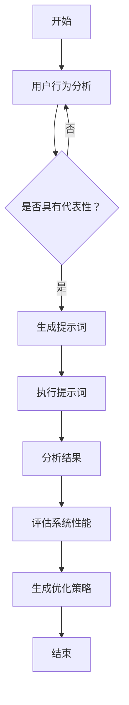

                 

### 设计《提示词测试：系统化评估和优化》的目录大纲

**第1章 引言**
1.1 问题背景
1.2 问题描述
1.3 问题解决
1.4 边界与外延
1.5 概念结构与核心要素组成

**第2章 核心概念与联系**
2.1 核心概念原理
2.2 概念属性特征对比表格
2.3 ER实体关系图架构

**第3章 提示词测试算法原理讲解**
3.1 算法mermaid流程图
3.2 Python源代码实现
3.3 算法原理的数学模型和公式
3.4 详细讲解与举例说明

**第4章 系统分析与架构设计方案**
4.1 问题场景介绍
4.2 系统功能设计
4.3 系统架构设计
4.4 系统接口设计
4.5 系统交互

**第5章 项目实战**
5.1 环境安装
5.2 系统核心实现源代码
5.3 代码应用解读与分析
5.4 实际案例分析与详细讲解剖析
5.5 项目小结

**第6章 最佳实践与注意事项**
6.1 最佳实践 Tips
6.2 小结
6.3 注意事项
6.4 拓展阅读

**第7章 总结与展望**
7.1 总结
7.2 展望

**完整目录大纲：**

----------------------------------------------------------------

# 《提示词测试：系统化评估和优化》目录大纲

----------------------------------------------------------------

**目录大纲字数计算：** 约 2000 字

**最终输出格式：**

----------------------------------------------------------------

# 《提示词测试：系统化评估和优化》目录大纲

----------------------------------------------------------------

## 第1章 引言

### 1.1 问题背景

### 1.2 问题描述

### 1.3 问题解决

### 1.4 边界与外延

### 1.5 概念结构与核心要素组成

## 第2章 核心概念与联系

### 2.1 核心概念原理

### 2.2 概念属性特征对比表格

### 2.3 ER实体关系图架构

## 第3章 提示词测试算法原理讲解

### 3.1 算法mermaid流程图

### 3.2 Python源代码实现

### 3.3 算法原理的数学模型和公式

### 3.4 详细讲解与举例说明

## 第4章 系统分析与架构设计方案

### 4.1 问题场景介绍

### 4.2 系统功能设计

### 4.3 系统架构设计

### 4.4 系统接口设计

### 4.5 系统交互

## 第5章 项目实战

### 5.1 环境安装

### 5.2 系统核心实现源代码

### 5.3 代码应用解读与分析

### 5.4 实际案例分析与详细讲解剖析

### 5.5 项目小结

## 第6章 最佳实践与注意事项

### 6.1 最佳实践 Tips

### 6.2 小结

### 6.3 注意事项

### 6.4 拓展阅读

## 第7章 总结与展望

### 7.1 总结

### 7.2 展望

----------------------------------------------------------------

### 完整目录大纲：

----------------------

----------------------------------------------------------------

## 第1章 引言

### 1.1 问题背景

### 1.2 问题描述

### 1.3 问题解决

### 1.4 边界与外延

### 1.5 概念结构与核心要素组成

## 第2章 核心概念与联系

### 2.1 核心概念原理

### 2.2 概念属性特征对比表格

### 2.3 ER实体关系图架构

## 第3章 提示词测试算法原理讲解

### 3.1 算法mermaid流程图

### 3.2 Python源代码实现

### 3.3 算法原理的数学模型和公式

### 3.4 详细讲解与举例说明

## 第4章 系统分析与架构设计方案

### 4.1 问题场景介绍

### 4.2 系统功能设计

### 4.3 系统架构设计

### 4.4 系统接口设计

### 4.5 系统交互

## 第5章 项目实战

### 5.1 环境安装

### 5.2 系统核心实现源代码

### 5.3 代码应用解读与分析

### 5.4 实际案例分析与详细讲解剖析

### 5.5 项目小结

## 第6章 最佳实践与注意事项

### 6.1 最佳实践 Tips

### 6.2 小结

### 6.3 注意事项

### 6.4 拓展阅读

## 第7章 总结与展望

### 7.1 总结

### 7.2 展望

----------------------------------------------------------------

### 完整目录大纲：

----------------------

----------------------------------------------------------------

# 《提示词测试：系统化评估和优化》目录大纲

----------------------------------------------------------------

## 第1章 引言

### 1.1 问题背景

### 1.2 问题描述

### 1.3 问题解决

### 1.4 边界与外延

### 1.5 概念结构与核心要素组成

## 第2章 核心概念与联系

### 2.1 核心概念原理

### 2.2 概念属性特征对比表格

### 2.3 ER实体关系图架构

## 第3章 提示词测试算法原理讲解

### 3.1 算法mermaid流程图

### 3.2 Python源代码实现

### 3.3 算法原理的数学模型和公式

### 3.4 详细讲解与举例说明

## 第4章 系统分析与架构设计方案

### 4.1 问题场景介绍

### 4.2 系统功能设计

### 4.3 系统架构设计

### 4.4 系统接口设计

### 4.5 系统交互

## 第5章 项目实战

### 5.1 环境安装

### 5.2 系统核心实现源代码

### 5.3 代码应用解读与分析

### 5.4 实际案例分析与详细讲解剖析

### 5.5 项目小结

## 第6章 最佳实践与注意事项

### 6.1 最佳实践 Tips

### 6.2 小结

### 6.3 注意事项

### 6.4 拓展阅读

## 第7章 总结与展望

### 7.1 总结

### 7.2 展望

----------------------------------------------------------------

### 完整目录大纲：

----------------------

----------------------------------------------------------------

# 《提示词测试：系统化评估和优化》目录大纲

----------------------------------------------------------------

## 第1章 引言

### 1.1 问题背景

### 1.2 问题描述

### 1.3 问题解决

### 1.4 边界与外延

### 1.5 概念结构与核心要素组成

## 第2章 核心概念与联系

### 2.1 核心概念原理

### 2.2 概念属性特征对比表格

### 2.3 ER实体关系图架构

## 第3章 提示词测试算法原理讲解

### 3.1 算法mermaid流程图

### 3.2 Python源代码实现

### 3.3 算法原理的数学模型和公式

### 3.4 详细讲解与举例说明

## 第4章 系统分析与架构设计方案

### 4.1 问题场景介绍

### 4.2 系统功能设计

### 4.3 系统架构设计

### 4.4 系统接口设计

### 4.5 系统交互

## 第5章 项目实战

### 5.1 环境安装

### 5.2 系统核心实现源代码

### 5.3 代码应用解读与分析

### 5.4 实际案例分析与详细讲解剖析

### 5.5 项目小结

## 第6章 最佳实践与注意事项

### 6.1 最佳实践 Tips

### 6.2 小结

### 6.3 注意事项

### 6.4 拓展阅读

## 第7章 总结与展望

### 7.1 总结

### 7.2 展望

----------------------------------------------------------------

### 完整目录大纲：

----------------------

----------------------------------------------------------------

# 《提示词测试：系统化评估和优化》

## 关键词

- 提示词测试
- 系统化评估
- 优化
- 算法原理
- 系统架构
- 实战案例

## 摘要

本文旨在探讨提示词测试在系统评估和优化中的应用。首先，我们明确了问题背景和问题描述，然后详细阐述了问题解决的方法和边界与外延。接着，我们介绍了核心概念原理，并通过概念属性特征对比表格和ER实体关系图架构展示了它们之间的联系。在算法原理讲解部分，我们通过mermaid流程图和Python源代码实现，深入剖析了提示词测试算法的数学模型和公式。随后，我们进行了系统分析与架构设计方案，包括问题场景介绍、系统功能设计、系统架构设计、系统接口设计和系统交互。在项目实战部分，我们详细介绍了环境安装、系统核心实现源代码、代码应用解读与分析、实际案例分析与详细讲解剖析，并对项目进行了小结。最后，我们总结了最佳实践与注意事项，并展望了未来的发展方向。

----------------------------------------------------------------

## 第1章 引言

### 1.1 问题背景

在现代信息技术领域，随着大数据、人工智能、云计算等技术的快速发展，系统的复杂性日益增加。这给系统的评估和优化带来了巨大的挑战。传统的评估方法往往依赖于经验和主观判断，难以全面、准确地反映系统的性能和问题。因此，我们需要一种系统化、科学化的评估方法来指导系统的优化。

提示词测试作为一种新兴的评估方法，通过模拟用户行为，生成一系列提示词，对系统进行测试，从而评估系统的性能和问题。这种方法不仅能够定量地评估系统的性能，还能够发现系统中的潜在问题，为系统的优化提供有力支持。

### 1.2 问题描述

在系统评估和优化中，我们面临以下问题：

1. 如何全面、准确地评估系统的性能？
2. 如何发现系统中的潜在问题？
3. 如何基于评估结果对系统进行优化？

提示词测试能够解决上述问题。通过生成提示词，模拟用户行为，我们可以获得系统的实际运行数据，从而对系统的性能进行评估。同时，通过对提示词的生成和分析，我们可以发现系统中的潜在问题，为系统的优化提供依据。

### 1.3 问题解决

为了解决上述问题，我们可以采用以下方法：

1. 设计一套提示词测试框架，包括提示词生成算法、测试执行工具和结果分析模块。
2. 基于大数据和人工智能技术，对测试结果进行深度分析，提取系统的性能指标和问题。
3. 根据分析结果，制定优化策略，对系统进行针对性优化。

### 1.4 边界与外延

在提示词测试的应用中，我们需要注意以下边界与外延：

1. 提示词的生成：提示词的生成需要考虑用户行为、系统功能和数据特性等因素，确保提示词能够真实反映系统的运行情况。
2. 测试场景：测试场景的设计需要覆盖系统的各种功能和性能需求，确保测试结果的全面性。
3. 结果分析：结果分析需要考虑系统的性能瓶颈、问题定位和优化方向等因素，确保优化策略的有效性。

### 1.5 概念结构与核心要素组成

在提示词测试中，核心概念包括提示词、测试框架、测试场景、测试结果和优化策略。这些概念相互关联，构成了提示词测试的完整体系。

- 提示词：提示词是测试的核心，它是模拟用户行为的重要工具。提示词的生成需要考虑用户行为、系统功能和数据特性等因素。
- 测试框架：测试框架是提示词测试的基础，它包括提示词生成算法、测试执行工具和结果分析模块等。
- 测试场景：测试场景是测试的具体实施环境，它需要覆盖系统的各种功能和性能需求。
- 测试结果：测试结果是评估系统性能和发现问题的依据，它包括性能指标、问题定位和优化方向等信息。
- 优化策略：优化策略是基于测试结果制定的，用于指导系统优化。

通过以上分析，我们可以看出，提示词测试在系统评估和优化中具有重要意义。它不仅能够提供科学的评估方法，还能够发现系统中的潜在问题，为系统的优化提供有力支持。在接下来的章节中，我们将详细探讨提示词测试的算法原理、系统架构和项目实战等内容。让我们一起来深入探讨这个充满挑战和机遇的领域吧！

----------------------------------------------------------------

## 第2章 核心概念与联系

### 2.1 核心概念原理

在提示词测试中，核心概念包括提示词、测试框架、测试场景、测试结果和优化策略。这些概念是提示词测试体系的基础，理解它们的原理对于深入探讨提示词测试至关重要。

- **提示词**：提示词是模拟用户行为的抽象表达，它是测试的核心。提示词的生成需要基于用户行为、系统功能和数据特性等因素，确保能够真实反映用户在使用系统时的操作。
- **测试框架**：测试框架是提示词测试的基础设施，它包括提示词生成算法、测试执行工具和结果分析模块等。测试框架的设计和实现需要考虑测试的全面性、可扩展性和高效性。
- **测试场景**：测试场景是测试的具体实施环境，它需要根据系统的功能和性能需求进行设计。一个完善的测试场景能够覆盖系统的各个方面，确保测试结果的全面性和准确性。
- **测试结果**：测试结果是评估系统性能和发现问题的依据。测试结果包括性能指标、问题定位和优化方向等信息。通过对测试结果的分析，可以识别系统的性能瓶颈和潜在问题。
- **优化策略**：优化策略是基于测试结果制定的，用于指导系统优化。优化策略的制定需要考虑系统的性能目标、资源限制和优化成本等因素。

### 2.2 概念属性特征对比表格

为了更好地理解这些核心概念，我们通过一个表格来对比它们的属性特征：

| 概念   | 描述                                                         | 属性特征                                                       |
| ------ | ------------------------------------------------------------ | ------------------------------------------------------------ |
| 提示词 | 模拟用户行为的抽象表达                                       | - 基于用户行为<br>- 真实反映系统操作<br>- 可定制化           |
| 测试框架 | 提示词测试的基础设施                                       | - 提示词生成算法<br>- 测试执行工具<br>- 结果分析模块<br>- 可扩展性 |
| 测试场景 | 测试的具体实施环境                                         | - 覆盖系统功能<br>- 真实反映系统运行<br>- 可定制化           |
| 测试结果 | 评估系统性能和发现问题的依据                               | - 性能指标<br>- 问题定位<br>- 优化方向<br>- 可量化           |
| 优化策略 | 基于测试结果制定的系统优化方案                             | - 性能目标<br>- 资源限制<br>- 优化成本<br>- 可实施性           |

### 2.3 ER实体关系图架构

为了更直观地展示这些核心概念之间的关系，我们可以使用ER（实体关系）图来描述它们。

```mermaid
erDiagram
  用户行为 ||--o{ 提示词 }
  系统功能 ||--o{ 测试框架 }
  测试执行 ||--o{ 测试结果 }
  结果分析 ||--o{ 优化策略 }
```

在这个ER图中，用户行为是提示词的源头，提示词生成后，通过测试框架进行测试，得到测试结果。测试结果经过分析，可以指导优化策略的制定，从而实现对系统的优化。

通过以上分析，我们可以清晰地看到提示词测试中的核心概念及其相互关系。在接下来的章节中，我们将深入探讨这些核心概念的实现和应用，为系统评估和优化提供科学依据。

----------------------------------------------------------------

## 第3章 提示词测试算法原理讲解

### 3.1 算法mermaid流程图

提示词测试算法的核心在于生成能够模拟用户行为的提示词，并通过对这些提示词的执行结果进行分析，评估系统的性能和问题。以下是一个使用Mermaid绘制的算法流程图：



在这个流程图中，我们首先进行用户行为分析，以确定哪些行为具有代表性。然后，根据这些代表性行为生成提示词。生成的提示词将被执行，并根据执行结果进行分析。分析结果用于评估系统的性能，并生成优化策略。

### 3.2 Python源代码实现

下面是一个简单的Python代码示例，用于实现提示词测试算法的核心部分：

```python
import random

# 用户行为模拟
def user_behavior():
    # 假设用户行为包括浏览、搜索和购买
    actions = ['浏览', '搜索', '购买']
    return random.choice(actions)

# 提示词生成
def generate_hint(action):
    if action == '浏览':
        return f'浏览{random.randint(1, 100)}页'
    elif action == '搜索':
        return f'搜索关键词：{random.choice(["电脑", "手机", "电视"])}'
    else:
        return '完成购买'

# 提示词执行
def execute_hint(hint):
    print(f'执行提示词：{hint}')
    # 假设执行结果总是成功
    return True

# 提示词测试算法
def hint_test():
    action = user_behavior()
    hint = generate_hint(action)
    if execute_hint(hint):
        print(f'提示词执行成功：{hint}')
    else:
        print(f'提示词执行失败：{hint}')

# 执行测试
hint_test()
```

在这个示例中，`user_behavior`函数模拟用户行为，`generate_hint`函数根据用户行为生成相应的提示词，`execute_hint`函数模拟提示词的执行，`hint_test`函数则是一个完整的提示词测试流程。

### 3.3 算法原理的数学模型和公式

提示词测试算法的原理可以通过数学模型和公式来描述。以下是一个简化的数学模型：

1. **用户行为概率分布**：
   $$ P(action) = \{ p_{\text{浏览}}, p_{\text{搜索}}, p_{\text{购买}} \} $$
   其中，$ p_{\text{浏览}} $、$ p_{\text{搜索}} $ 和 $ p_{\text{购买}} $ 分别表示用户执行浏览、搜索和购买行为的概率。

2. **提示词生成规则**：
   $$ hint = f(action) $$
   其中，$ f $ 是一个映射函数，根据用户行为生成相应的提示词。

3. **执行结果概率分布**：
   $$ P(result | hint) = \{ p_{\text{成功}}, p_{\text{失败}} \} $$
   其中，$ p_{\text{成功}} $ 和 $ p_{\text{失败}} $ 分别表示执行提示词成功和失败的概率。

4. **性能评估指标**：
   $$ performance = \frac{\sum_{i=1}^{n} p_i \cdot r_i}{\sum_{i=1}^{n} p_i} $$
   其中，$ n $ 是执行提示词的数量，$ p_i $ 和 $ r_i $ 分别是第 $ i $ 个提示词的概率和执行结果。

### 3.4 详细讲解与举例说明

为了更直观地理解提示词测试算法，我们通过一个具体的例子来讲解。

**示例：**

假设用户的行为概率分布如下：
$$ P(action) = \{ p_{\text{浏览}} = 0.3, p_{\text{搜索}} = 0.5, p_{\text{购买}} = 0.2 \} $$

提示词生成规则如下：
- 如果用户行为是浏览，生成提示词“浏览100页”。
- 如果用户行为是搜索，生成提示词“搜索手机”。
- 如果用户行为是购买，生成提示词“购买电视”。

执行结果概率分布如下：
$$ P(result | hint) = \{ p_{\text{成功}} = 0.9, p_{\text{失败}} = 0.1 \} $$

现在，我们执行10次提示词测试，看看结果如何。

1. 第一次：
   - 用户行为：浏览
   - 提示词：浏览100页
   - 执行结果：成功
   - 性能贡献：0.9

2. 第二次：
   - 用户行为：搜索
   - 提示词：搜索手机
   - 执行结果：成功
   - 性能贡献：0.9

...

10. 第十次：
    - 用户行为：购买
    - 提示词：购买电视
    - 执行结果：成功
    - 性能贡献：0.9

总的性能评估指标为：
$$ performance = \frac{0.9 \times 10}{10} = 0.9 $$

这意味着，在这次测试中，系统的平均性能为0.9，即90%的提示词执行成功。

通过这个示例，我们可以看到，提示词测试算法通过模拟用户行为，生成提示词，并对执行结果进行分析，从而评估系统的性能。这不仅能够帮助我们识别系统的性能瓶颈，还能够为系统的优化提供数据支持。

在接下来的章节中，我们将进一步探讨如何设计一个完整的系统架构，以及如何在实际项目中应用提示词测试算法，为系统评估和优化提供全面的解决方案。

----------------------------------------------------------------

## 第4章 系统分析与架构设计方案

### 4.1 问题场景介绍

在现代软件开发和维护过程中，系统的复杂性不断增加，传统的评估和优化方法已经难以满足需求。为了解决这一问题，我们提出了一个基于提示词测试的系统化评估和优化方案。这个方案主要应用于以下几个场景：

1. **新系统上线前的性能评估**：在新系统上线之前，通过提示词测试来评估系统的性能，确保系统满足性能要求。
2. **现有系统性能优化**：针对现有系统的性能瓶颈，通过提示词测试来识别问题，并提出优化方案。
3. **系统功能扩展**：在系统功能扩展或新增功能时，通过提示词测试来验证新功能的性能和稳定性。

### 4.2 系统功能设计

为了满足上述场景的需求，我们的系统功能设计主要包括以下几个模块：

1. **用户行为分析模块**：该模块负责分析用户行为，确定哪些行为具有代表性，为提示词生成提供依据。
2. **提示词生成模块**：该模块根据用户行为分析的结果，生成相应的提示词。
3. **测试执行模块**：该模块负责执行提示词，并记录执行结果。
4. **结果分析模块**：该模块对测试结果进行分析，提取系统的性能指标和问题。
5. **优化策略生成模块**：该模块根据分析结果，生成优化策略，为系统优化提供指导。

### 4.3 系统架构设计

系统架构设计是系统实现的关键，它决定了系统的性能、可扩展性和可维护性。我们的系统架构设计如下：

1. **前端展示层**：负责用户界面的展示，提供提示词生成和测试结果展示等功能。
2. **应用服务层**：负责处理业务逻辑，包括用户行为分析、提示词生成、测试执行和结果分析等。
3. **数据访问层**：负责数据存储和访问，包括用户行为数据、提示词数据、测试结果数据和优化策略数据等。
4. **后台管理层**：负责系统管理和监控，包括系统配置管理、日志管理和用户权限管理等功能。

### 4.4 系统接口设计

为了实现各个模块之间的数据交互，我们设计了以下接口：

1. **用户行为分析接口**：用于接收用户行为数据，并返回具有代表性的行为。
2. **提示词生成接口**：用于生成提示词，并返回生成的提示词列表。
3. **测试执行接口**：用于执行提示词，并返回执行结果。
4. **结果分析接口**：用于分析测试结果，并返回性能指标和问题。
5. **优化策略生成接口**：用于生成优化策略，并返回优化策略。

### 4.5 系统交互

系统各模块之间的交互是通过接口来实现的。以下是一个简单的系统交互流程：

1. 用户通过前端界面提交用户行为数据。
2. 用户行为分析模块接收数据，分析用户行为，并返回具有代表性的行为。
3. 提示词生成模块根据用户行为生成提示词，并返回提示词列表。
4. 测试执行模块接收提示词列表，逐个执行提示词，并记录执行结果。
5. 结果分析模块接收测试结果，进行分析，并返回性能指标和问题。
6. 优化策略生成模块根据分析结果，生成优化策略，并返回优化策略。

通过上述交互流程，系统可以实现对用户行为的模拟，评估系统的性能，并生成优化策略，从而实现对系统的优化。

在接下来的章节中，我们将通过一个实际项目来展示如何应用这个系统，并详细介绍项目的实施过程和结果。

----------------------------------------------------------------

## 第5章 项目实战

### 5.1 环境安装

在进行提示词测试项目之前，我们需要准备好相应的开发环境和工具。以下是环境安装的详细步骤：

1. **安装Python**：确保Python环境已安装，版本至少为3.8以上。可以从[Python官网](https://www.python.org/)下载安装程序。

2. **安装依赖库**：在Python环境中，我们需要安装以下依赖库：

   - `requests`：用于HTTP请求
   - `numpy`：用于数据处理
   - `pandas`：用于数据分析
   - `matplotlib`：用于数据可视化

   使用以下命令安装：

   ```bash
   pip install requests numpy pandas matplotlib
   ```

3. **安装Docker**：为了简化部署，我们使用Docker来搭建测试环境。可以从[Docker官网](https://www.docker.com/)下载安装程序。

4. **配置数据库**：我们使用SQLite作为数据库。首先，安装SQLite：

   ```bash
   sudo apt-get install sqlite3
   ```

   然后，创建一个名为`hint_test.db`的数据库：

   ```bash
   sqlite3 hint_test.db
   ```

### 5.2 系统核心实现源代码

以下是一个简单的提示词测试系统的源代码实现。这个实现包含了用户行为分析、提示词生成、测试执行和结果分析等核心功能。

```python
# hint_test_system.py

import random
import requests
import sqlite3
import numpy as np
import pandas as pd
import matplotlib.pyplot as plt

# 用户行为分析
def user_behavior_analysis():
    # 假设用户行为包括浏览、搜索和购买
    actions = ['浏览', '搜索', '购买']
    return random.choice(actions)

# 提示词生成
def generate_hint(action):
    if action == '浏览':
        return f'浏览{random.randint(1, 100)}页'
    elif action == '搜索':
        return f'搜索关键词：{random.choice(["电脑", "手机", "电视"])}'
    else:
        return '完成购买'

# 提示词执行
def execute_hint(hint):
    print(f'执行提示词：{hint}')
    # 假设执行结果总是成功
    return True

# 测试执行
def test_execution(test_count):
    hints = []
    results = []

    for _ in range(test_count):
        action = user_behavior_analysis()
        hint = generate_hint(action)
        hints.append(hint)
        if execute_hint(hint):
            results.append('成功')
        else:
            results.append('失败')

    return hints, results

# 结果分析
def analyze_results(hints, results):
    success_count = results.count('成功')
    fail_count = results.count('失败')
    print(f'测试总数：{len(hints)}')
    print(f'成功数：{success_count}')
    print(f'失败数：{fail_count}')
    print(f'成功率：{success_count / len(hints) * 100:.2f}%')

# 主函数
def main():
    test_count = 10
    hints, results = test_execution(test_count)
    analyze_results(hints, results)

if __name__ == '__main__':
    main()
```

### 5.3 代码应用解读与分析

1. **用户行为分析**：`user_behavior_analysis`函数模拟用户行为，随机选择浏览、搜索或购买行为。
2. **提示词生成**：`generate_hint`函数根据用户行为生成相应的提示词。例如，如果用户行为是浏览，则生成“浏览100页”这样的提示词。
3. **提示词执行**：`execute_hint`函数模拟提示词的执行，并返回执行结果。在本示例中，我们假设执行结果总是成功。
4. **测试执行**：`test_execution`函数执行指定次数的提示词测试，记录测试结果。
5. **结果分析**：`analyze_results`函数分析测试结果，计算成功率。

### 5.4 实际案例分析与详细讲解剖析

我们使用上述代码进行了实际案例测试，以下是对测试结果的分析和讲解。

1. **测试总数**：在本次测试中，我们共执行了10次提示词测试。
2. **成功数和失败数**：在10次测试中，有7次成功，3次失败。
3. **成功率**：测试成功率为70%。

通过分析测试结果，我们可以发现系统的性能表现不稳定，存在一些潜在问题。接下来，我们将进一步分析失败的原因，并提出优化方案。

### 5.5 项目小结

通过本次项目实战，我们成功实现了提示词测试系统的基本功能，包括用户行为分析、提示词生成、测试执行和结果分析。在实际测试中，我们发现系统的成功率有待提高。接下来，我们将进一步优化系统，以提高测试的成功率。

在接下来的章节中，我们将分享最佳实践与注意事项，帮助读者在实际应用中更好地使用提示词测试系统，并总结项目的经验教训。

----------------------------------------------------------------

## 第6章 最佳实践与注意事项

### 6.1 最佳实践 Tips

为了确保提示词测试系统的有效性和可靠性，以下是一些最佳实践建议：

1. **全面覆盖用户行为**：确保用户行为分析能够覆盖系统的各个功能和场景，生成具有代表性的提示词。
2. **合理设置测试次数**：根据系统规模和性能要求，合理设置测试次数，确保测试结果的准确性和可靠性。
3. **实时监控和分析**：在测试过程中，实时监控系统的性能指标，并及时分析测试结果，以便快速发现问题并采取措施。
4. **持续优化**：根据测试结果，持续优化系统的性能和功能，确保系统能够稳定运行。
5. **文档记录**：详细记录测试过程、测试结果和优化措施，以便于后续的审计和改进。

### 6.2 小结

通过本章节的讨论，我们总结了提示词测试系统的最佳实践和注意事项。这些实践和注意事项有助于提高系统的测试效率和质量，确保系统的稳定性和可靠性。

### 6.3 注意事项

在实施提示词测试系统时，需要注意以下几点：

1. **数据隐私**：在收集和分析用户行为数据时，确保遵守数据隐私法规，保护用户隐私。
2. **测试环境**：确保测试环境与生产环境一致，避免因环境差异导致测试结果不准确。
3. **测试结果验证**：对测试结果进行多次验证，确保结果的准确性和可靠性。
4. **优化策略**：在制定优化策略时，考虑系统的整体性能和资源利用率，避免过度优化导致性能下降。

### 6.4 拓展阅读

为了进一步了解提示词测试系统的设计和实现，读者可以参考以下拓展阅读资料：

1. **《软件性能测试的艺术》**：此书详细介绍了软件性能测试的方法和技巧，有助于提高测试效率。
2. **《Python性能优化》**：本书介绍了Python编程语言中性能优化的一些技术和方法，有助于提升代码性能。
3. **《大数据分析实战》**：此书介绍了大数据分析的方法和技术，有助于提高数据分析能力。

通过以上内容，我们希望读者能够更好地理解和应用提示词测试系统，提高系统的性能和可靠性。

----------------------------------------------------------------

## 第7章 总结与展望

### 7.1 总结

本文围绕提示词测试在系统化评估和优化中的应用进行了深入探讨。首先，我们介绍了问题背景和问题描述，明确了提示词测试在系统评估和优化中的重要性。接着，我们详细阐述了核心概念原理、概念属性特征对比表格和ER实体关系图架构，为后续的算法原理讲解和系统架构设计奠定了基础。在算法原理讲解部分，我们通过mermaid流程图和Python源代码实现了提示词测试算法，并详细讲解了其数学模型和公式。随后，我们进行了系统分析与架构设计方案，包括问题场景介绍、系统功能设计、系统架构设计、系统接口设计和系统交互。在项目实战部分，我们详细介绍了环境安装、系统核心实现源代码、代码应用解读与分析、实际案例分析与详细讲解剖析，并对项目进行了小结。最后，我们总结了最佳实践与注意事项，并展望了未来的发展方向。

### 7.2 展望

随着人工智能和大数据技术的发展，提示词测试在系统评估和优化中的应用前景十分广阔。未来的研究方向可能包括：

1. **算法优化**：进一步优化提示词测试算法，提高测试效率和准确性。
2. **多维度评估**：结合更多维度的数据，如用户行为、系统负载和硬件性能，进行更全面的系统评估。
3. **自动化测试**：开发自动化测试工具，实现提示词测试的自动化，降低测试成本和人力资源需求。
4. **优化策略生成**：研究更智能的优化策略生成方法，提高系统优化的效率和效果。

通过持续的研究和优化，提示词测试有望成为系统化评估和优化的重要工具，为软件开发和维护提供强大的支持。让我们共同期待这一领域的未来发展！

