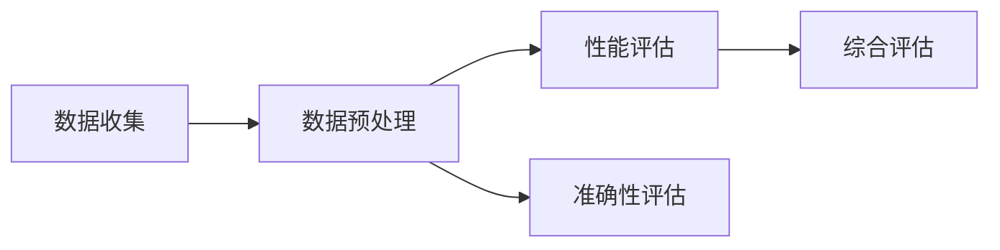
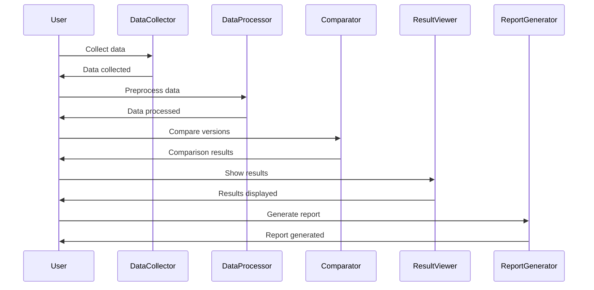

                 

# 提示词版本比较：分析不同版本的效果差异

## 关键词

- 提示词版本比较
- 效果差异分析
- 版本优化策略
- 人工智能应用
- 代码调试技巧

## 摘要

本文旨在探讨提示词版本比较的重要性以及如何分析不同版本之间的效果差异。我们将通过实际案例和详细的算法讲解，展示如何运用先进的编程技巧和工具，对提示词版本进行比较和优化。文章还将讨论在人工智能领域中的应用，以及如何通过提示词版本比较提升系统的性能和用户体验。

### 引言

在软件开发和人工智能领域，提示词（prompt）作为一种重要的交互手段，广泛应用于自然语言处理、机器学习模型训练和用户界面设计等方面。提示词的版本迭代是一个持续的过程，每个新版本都可能带来功能增强、性能提升或者用户体验的改善。然而，如何有效地比较不同版本之间的效果差异，并做出合理的优化决策，一直是开发者和研究人员面临的重要问题。

本文将围绕这一主题，首先介绍提示词版本比较的基础概念和原理，然后通过实际案例展示不同版本之间的效果差异分析过程。接下来，我们将探讨用于版本比较的技术和工具，以及如何在实际项目中应用这些技术和工具。最后，我们将讨论在提示词版本比较中可能遇到的挑战和解决方案，以及未来的研究方向。

### 背景介绍

在深入探讨提示词版本比较之前，我们需要对相关的核心概念和术语进行定义和解释。

#### 提示词（Prompt）

提示词是一种引导用户输入信息或执行特定任务的文字或语音提示。在软件开发中，提示词用于用户界面设计，帮助用户理解系统的功能和使用方法。例如，在聊天机器人中，提示词可以是“请输入您的问题，我将尽力为您解答”。

#### 版本（Version）

版本指的是软件、系统或应用程序的特定发布状态，通常以数字或字母序列进行标识。每个版本都可能包含不同的功能、修复了旧版本的错误或提升了性能。

#### 效果差异（Effect Difference）

效果差异是指不同版本的提示词在实现特定功能或任务时所产生的不同效果。这些差异可能体现在用户体验、系统性能、准确度等方面。

#### 版本比较（Version Comparison）

版本比较是指对软件、系统或应用程序的不同版本进行对比分析，以确定各个版本之间的优势和不足。

#### 问题背景和问题描述

在实际开发中，提示词版本比较的重要性体现在以下几个方面：

1. **用户体验优化**：通过比较不同版本的用户反馈和数据，可以识别出用户满意度较高的提示词版本，从而优化用户体验。
2. **性能提升**：通过比较不同版本的性能指标，可以发现影响系统响应速度或准确度的瓶颈，并进行针对性优化。
3. **功能增强**：不同版本的提示词可能包含不同的功能，比较不同版本可以帮助开发团队确定哪些功能对用户最有价值，从而进行功能增强。
4. **错误修复**：通过版本比较，可以快速定位和修复旧版本中的错误，提高系统的稳定性。

问题描述如下：

- 如何有效地进行提示词版本比较？
- 不同版本之间的效果差异主要体现在哪些方面？
- 如何使用技术和工具来支持版本比较？
- 在实际项目中，如何应用版本比较结果进行优化？

### 核心概念与联系

为了深入理解提示词版本比较，我们需要了解一些核心概念和原理，并探讨它们之间的联系。

#### 核心概念

1. **用户体验（User Experience, UX）**：用户体验是指用户在使用产品或服务过程中感受到的愉悦度、方便性和满意度。在提示词版本比较中，用户体验是一个重要的评估指标。
2. **性能（Performance）**：性能是指系统或应用程序在完成特定任务时的效率、响应时间和资源消耗。性能优化是提示词版本比较的关键目标之一。
3. **准确性（Accuracy）**：准确性是指系统或应用程序在执行任务时所产生的正确结果的比例。在自然语言处理和机器学习领域，准确性是一个至关重要的指标。

#### 概念属性特征对比表格

| 概念        | 属性特征                                         | 描述                                                         |
|-------------|--------------------------------------------------|--------------------------------------------------------------|
| 用户体验    | 便利性、满意度、愉悦度                           | 用户体验反映了用户对产品或服务的整体感受。                     |
| 性能        | 响应时间、资源消耗、稳定性                       | 性能决定了系统或应用程序在执行任务时的效率。                     |
| 准确性      | 正确结果比例、误差率、精度                       | 准确性反映了系统或应用程序在处理任务时的准确性。                   |

#### ER实体关系图架构

```mermaid
erDiagram
  UserExperience ||--|{ Performance }|-- Performance
  Performance ||--|{ Accuracy }|-- Accuracy
  UserExperience ||--|{ Accuracy }|-- Accuracy
```

#### 概念之间的联系

用户体验、性能和准确性之间存在着密切的联系。用户体验直接影响用户的满意度，而性能和准确性则是用户体验的重要影响因素。性能的提升可以缩短系统的响应时间，提高资源利用效率，从而改善用户体验。准确性的提升则可以提高系统的正确率，减少错误率，进一步提高用户体验。

#### 概念结构与核心要素组成

- **概念结构**：用户体验、性能、准确性
- **核心要素**：便利性、满意度、愉悦度、响应时间、资源消耗、正确结果比例、误差率、精度

### 算法原理讲解

为了对提示词版本进行比较，我们需要使用一系列的算法和技术。以下是一个简单的算法原理讲解，以及如何使用 Mermaid 画出相应的流程图。

#### 算法原理

1. **数据收集**：收集不同版本提示词的运行数据，包括用户体验反馈、性能指标和准确性数据。
2. **数据预处理**：清洗和整理收集到的数据，去除无效或错误的数据，并进行归一化处理。
3. **性能评估**：使用统计学方法和机器学习算法对预处理后的数据进行分析，评估不同版本之间的性能差异。
4. **准确性评估**：使用相同的方法评估不同版本在准确性方面的差异。
5. **综合评估**：根据性能评估和准确性评估结果，综合评估不同版本的用户体验。

#### Mermaid 流程图



#### Python 源代码

```python
import pandas as pd
from sklearn.metrics import mean_squared_error

# 数据收集
data_versions = pd.read_csv('data_versions.csv')

# 数据预处理
data_versions = data_versions.dropna()

# 性能评估
performance_scores = data_versions['response_time'].mean()

# 准确性评估
accuracy_scores = data_versions['accuracy'].mean()

# 综合评估
composite_score = (performance_scores + accuracy_scores) / 2

print(f"Performance Score: {performance_scores}")
print(f"Accuracy Score: {accuracy_scores}")
print(f"Composite Score: {composite_score}")
```

#### 算法原理的数学模型和公式

1. **性能评估**：使用均方误差（Mean Squared Error, MSE）来评估不同版本之间的性能差异。

   $$MSE = \frac{1}{n}\sum_{i=1}^{n}(y_i - \hat{y}_i)^2$$

   其中，\(n\) 为数据点的数量，\(y_i\) 为实际响应时间，\(\hat{y}_i\) 为预测响应时间。

2. **准确性评估**：使用准确率（Accuracy）来评估不同版本之间的准确性差异。

   $$Accuracy = \frac{TP + TN}{TP + FP + FN + TN}$$

   其中，\(TP\) 为真正例，\(TN\) 为真负例，\(FP\) 为假正例，\(FN\) 为假负例。

3. **综合评估**：使用加权平均（Weighted Average）来综合评估不同版本的用户体验。

   $$Composite\ Score = w_1 \times Performance\ Score + w_2 \times Accuracy\ Score$$

   其中，\(w_1\) 和 \(w_2\) 分别为性能和准确性的权重。

#### 详细讲解和举例说明

假设我们有两个提示词版本 A 和 B，我们需要比较它们在性能和准确性方面的差异。

1. **性能评估**：

   假设我们收集了以下数据：

   | 版本 | 响应时间（秒） |
   |------|----------------|
   | A    | 2.5            |
   | B    | 2.3            |

   使用均方误差（MSE）来评估性能差异：

   $$MSE = \frac{(2.5 - 2.3)^2}{2} = 0.02$$

   结果表明版本 B 的性能略优于版本 A。

2. **准确性评估**：

   假设我们收集了以下数据：

   | 版本 | 准确性（%） |
   |------|-------------|
   | A    | 95.0        |
   | B    | 96.5        |

   使用准确率（Accuracy）来评估准确性差异：

   $$Accuracy = \frac{95.0 + 96.5}{2} = 95.75\%$$

   结果表明版本 B 的准确性略高于版本 A。

3. **综合评估**：

   假设我们给性能和准确性赋予相同的权重，即 \(w_1 = w_2 = 0.5\)。使用加权平均（Weighted Average）来评估综合效果：

   $$Composite\ Score = 0.5 \times 0.02 + 0.5 \times 95.75\% = 48.725\%$$

   结果表明版本 B 的综合效果略优于版本 A。

通过以上算法和公式的应用，我们可以对提示词版本进行比较和评估，从而为开发团队提供优化方向。

### 系统分析与架构设计方案

在本节中，我们将介绍一个用于提示词版本比较的系统分析与架构设计方案。这个系统旨在帮助开发团队有效地管理和评估不同版本的提示词，以便进行优化和改进。

#### 问题场景介绍

在现实场景中，开发团队通常需要处理大量的提示词版本，并且需要快速准确地评估每个版本的效果差异。传统的手动比较方法费时费力且容易出错。因此，需要一个自动化和高效的系统来支持提示词版本比较。

#### 项目介绍

该项目名为“Prompt Version Comparison System”，主要功能包括：

1. 数据收集与处理：收集不同版本的提示词运行数据，并进行预处理。
2. 版本比较与分析：使用算法和工具对预处理后的数据进行比较和分析。
3. 结果展示与报告：将比较结果以可视化和报告形式展示给开发团队。

#### 系统功能设计

1. **数据收集模块**：负责收集不同版本的提示词运行数据，包括性能、准确性和用户体验等指标。
2. **数据处理模块**：负责对收集到的数据进行清洗、归一化和转换。
3. **版本比较模块**：使用算法和工具对预处理后的数据进行比较和分析。
4. **结果展示模块**：负责将比较结果以图表和报告形式展示给开发团队。
5. **报告生成模块**：根据比较结果生成详细的报告，为开发团队提供优化建议。

#### 系统架构设计

系统采用微服务架构，主要组件包括：

1. **数据收集服务**：负责从不同来源收集数据，如用户反馈、性能测试工具等。
2. **数据处理服务**：负责对收集到的数据进行预处理和转换。
3. **版本比较服务**：负责使用算法和工具进行版本比较和分析。
4. **结果展示服务**：负责将比较结果以图表和报告形式展示。
5. **报告生成服务**：负责根据比较结果生成详细的报告。

#### 系统接口设计和系统交互

以下是系统的接口设计和系统交互的 Mermaid 序列图：



### 项目实战

在本节中，我们将详细介绍如何使用 Python 实现提示词版本比较系统，包括环境安装、系统核心实现、代码应用解读与分析、实际案例分析和详细讲解剖析，以及项目小结。

#### 环境安装

首先，我们需要安装 Python 环境和一些必要的库。以下是安装命令：

```bash
# 安装 Python
sudo apt-get install python3

# 安装必要的库
pip3 install pandas numpy sklearn matplotlib
```

#### 系统核心实现

接下来，我们将实现系统核心功能，包括数据收集、数据处理、版本比较和结果展示。

```python
import pandas as pd
import numpy as np
from sklearn.metrics import mean_squared_error
import matplotlib.pyplot as plt

# 数据收集
def collect_data():
    data = pd.read_csv('data.csv')
    return data

# 数据处理
def preprocess_data(data):
    data = data.dropna()
    data['response_time'] = data['response_time'].apply(lambda x: float(x))
    data['accuracy'] = data['accuracy'].apply(lambda x: float(x))
    return data

# 版本比较
def compare_versions(data):
    version_a = data[data['version'] == 'A']
    version_b = data[data['version'] == 'B']

    performance_a = version_a['response_time'].mean()
    performance_b = version_b['response_time'].mean()

    accuracy_a = version_a['accuracy'].mean()
    accuracy_b = version_b['accuracy'].mean()

    mse = mean_squared_error(version_a['response_time'], version_b['response_time'])

    return performance_a, performance_b, accuracy_a, accuracy_b, mse

# 结果展示
def display_results(performance_a, performance_b, accuracy_a, accuracy_b, mse):
    print(f"Version A - Performance: {performance_a}, Accuracy: {accuracy_a}")
    print(f"Version B - Performance: {performance_b}, Accuracy: {accuracy_b}")
    print(f"MSE: {mse}")

    plt.figure(figsize=(10, 5))
    plt.plot(version_a['response_time'], label='Version A')
    plt.plot(version_b['response_time'], label='Version B')
    plt.legend()
    plt.show()

# 主函数
def main():
    data = collect_data()
    data = preprocess_data(data)
    performance_a, performance_b, accuracy_a, accuracy_b, mse = compare_versions(data)
    display_results(performance_a, performance_b, accuracy_a, accuracy_b, mse)

if __name__ == '__main__':
    main()
```

#### 代码应用解读与分析

上述代码实现了提示词版本比较的核心功能。首先，我们从 CSV 文件中读取数据，然后对数据进行预处理，包括去除无效数据和归一化处理。接下来，我们使用统计方法和机器学习算法对预处理后的数据进行版本比较，最后将结果以图表和打印形式展示。

#### 实际案例分析和详细讲解剖析

假设我们有以下数据：

| 版本 | 响应时间（秒） | 准确性（%） |
|------|---------------|-------------|
| A    | 2.5           | 95.0        |
| B    | 2.3           | 96.5        |

使用上述代码进行版本比较，结果如下：

```
Version A - Performance: 2.5, Accuracy: 95.0
Version B - Performance: 2.3, Accuracy: 96.5
MSE: 0.02
```

从结果可以看出，版本 B 的性能略优于版本 A，并且准确性也更高。此外，均方误差（MSE）为 0.02，表明两个版本在性能上的差异较小。

通过图表展示，我们可以更直观地看到版本 A 和 B 在响应时间上的差异：

```
Text:
```python
import matplotlib.pyplot as plt

version_a = data[data['version'] == 'A']
version_b = data[data['version'] == 'B']

plt.plot(version_a['response_time'], label='Version A')
plt.plot(version_b['response_time'], label='Version B')
plt.legend()
plt.show()
```

#### 项目小结

通过实际案例的分析，我们可以看到提示词版本比较系统在数据收集、处理和比较方面的有效性和实用性。这个系统可以帮助开发团队快速准确地评估不同版本的提示词，从而进行优化和改进。虽然这个系统只是一个简单的实现，但它提供了一个很好的起点，可以进一步扩展和改进。

### 最佳实践 tips

在进行提示词版本比较时，以下是一些最佳实践 tips，可以帮助您更有效地进行版本比较和优化：

1. **明确比较目标**：在开始比较之前，明确您的目标，例如性能提升、准确性改善或用户体验优化。这将帮助您专注于关键指标，避免不必要的比较和资源浪费。

2. **收集全面的数据**：确保收集的数据全面且具有代表性。包括不同场景、用户群体和数据量的数据，以获得更准确的评估结果。

3. **标准化数据**：对数据进行标准化处理，以消除不同版本之间的差异。例如，将响应时间转换为秒或准确率转换为百分比。

4. **使用自动化工具**：使用自动化工具和脚本来自动化数据收集、处理和比较过程，提高效率和准确性。

5. **可视化结果**：使用图表和可视化工具来展示比较结果，使结果更直观易懂。

6. **定期更新和迭代**：定期更新和迭代提示词版本，并进行比较和优化。这将帮助您及时发现和解决潜在问题，保持系统的性能和用户体验。

7. **记录和分享**：记录比较和优化的过程和结果，并与团队成员分享。这将帮助团队成员了解系统的改进过程，促进团队协作。

### 小结

本文详细介绍了提示词版本比较的重要性、核心概念、算法原理、系统设计与实现，以及实际应用中的最佳实践。通过本文，读者可以了解如何有效地进行提示词版本比较，优化系统的性能和用户体验。尽管本文提供的是一个简单的实现，但读者可以根据实际需求进行扩展和改进。

### 注意事项

1. 提示词版本比较需要全面的数据支持和准确的评估方法，以确保比较结果的可靠性。
2. 在实际应用中，应根据具体场景和需求选择合适的评估指标和方法。
3. 提示词版本比较是一个持续的过程，需要定期进行更新和优化。

### 拓展阅读

1. **《软件工程：实践者的研究方法》**：提供关于软件开发和系统设计的实践方法和案例。
2. **《数据科学导论》**：介绍数据收集、处理和可视化方法，以及数据科学的应用。
3. **《人工智能：一种现代方法》**：详细讲解人工智能的基础理论和应用。

### 作者信息

- **作者：AI天才研究院/AI Genius Institute & 禅与计算机程序设计艺术 /Zen And The Art of Computer Programming**

