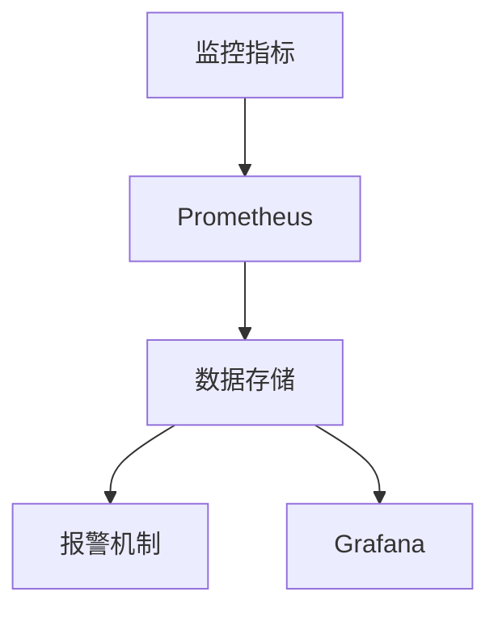

                 


### 第1章 提示词生命周期管理的概述

提示词生命周期管理是一种全面的管理流程，它涵盖了提示词从创建、维护、优化到退役的整个过程。在这个快速发展的数字时代，提示词（Prompt）作为一种关键的人工智能输入元素，其在各个领域的应用日益广泛。无论是自然语言处理（NLP）、文本生成、推荐系统，还是语音识别和图像识别等领域，提示词的质量和效率直接影响到系统的性能和用户体验。

**1.1 提示词的定义与分类**

提示词，简单来说，就是引导模型进行推理或生成结果的初始输入。在人工智能领域，提示词可以是一个单词、一个短语、一句话，甚至是更复杂的文本。根据应用场景和目的的不同，提示词可以被分为以下几类：

- **训练提示词**：用于训练机器学习模型的初始输入，例如在训练文本分类模型时，每个类别会对应一系列训练提示词。
- **交互提示词**：用于人机交互的场景，如聊天机器人、语音助手等，这类提示词需要具备良好的用户友好性和响应准确性。
- **搜索提示词**：用于信息检索和推荐系统，这类提示词需要能够准确表达用户的意图和需求。

**1.1.1 提示词的基本概念**

提示词的核心概念在于其引导性。一个好的提示词应当具备以下几点特性：

- **针对性**：能够明确地指向特定的任务或问题。
- **准确性**：能够准确地传达用户的意图和需求。
- **灵活性**：能够适应不同的情境和变化。
- **可扩展性**：能够随着时间和数据量的增长进行扩展和优化。

**1.1.2 提示词的分类与作用**

不同类型的提示词在各自的应用场景中发挥着独特的作用：

- **训练提示词**：在机器学习模型训练阶段，大量的训练提示词被用来训练模型，使其能够学习到特定领域的知识和模式。
- **交互提示词**：在人机交互中，交互提示词可以帮助用户更好地理解和操作系统，提高用户体验。
- **搜索提示词**：在信息检索和推荐系统中，搜索提示词能够帮助系统理解用户的意图，从而提供更加精准的搜索结果和推荐内容。

**1.1.3 提示词生命周期管理的意义**

提示词生命周期管理的重要性在于其能够系统地提升提示词的质量和效率，从而提高整体系统的性能和用户体验。具体来说，提示词生命周期管理包括以下几个关键步骤：

- **创建**：根据应用场景和需求设计合适的提示词。
- **维护**：定期更新和优化提示词，保持其准确性和灵活性。
- **优化**：通过算法和数据分析，对提示词进行优化，提高其效果和效率。
- **部署**：将优化的提示词部署到实际系统中，确保其能够正常发挥作用。
- **监控**：对提示词的使用效果进行实时监控，及时发现和解决潜在问题。
- **退役**：当提示词不再适用或效果不佳时，及时退役并更新替换。

通过这样的生命周期管理，提示词能够在不同阶段保持其价值和效能，从而推动整个系统的发展和进步。

### 1.2 提示词生命周期管理的起源

提示词生命周期管理并非一蹴而就，其起源和发展历程伴随着人工智能技术的不断进步。以下将从历史发展的角度，探讨提示词生命周期管理的起源及其背景。

**1.2.1 提示词在人工智能领域的发展**

人工智能（AI）的发展历程可以追溯到20世纪50年代。随着计算能力和算法研究的不断深入，AI技术在各个领域得到了广泛应用。在自然语言处理（NLP）领域，提示词的概念逐渐被引入，并成为关键的研究对象。

早期的NLP研究主要集中在基础的文本处理任务上，如文本分类、命名实体识别和句法分析等。这些任务通常需要大量的人类标注数据进行训练，而提示词作为训练数据的输入，其质量和数量直接影响到模型的性能。例如，在文本分类任务中，不同类别的文本会对应一系列提示词，这些提示词需要具有代表性，以便模型能够准确地区分不同类别。

随着深度学习技术的发展，神经网络模型在NLP领域取得了突破性的进展。在深度学习框架下，提示词的生成和优化变得更加自动化和高效。例如，生成对抗网络（GAN）和变分自编码器（VAE）等算法被广泛应用于文本生成任务，从而提高了提示词的质量和多样性。

**1.2.2 提示词生命周期管理的必要性**

在人工智能应用中，提示词的作用至关重要。然而，随着应用场景的复杂化和多样化，仅仅依赖单一的提示词已经难以满足需求。提示词生命周期管理的必要性体现在以下几个方面：

1. **数据安全与隐私保护**：随着数据隐私问题日益突出，如何确保提示词生成和使用过程中的数据安全成为一个重要课题。生命周期管理能够帮助企业在提示词创建、维护和退役等环节中，采取相应的安全措施，保护用户数据不被泄露。

2. **提示词的质量与效果评估**：提示词的质量直接影响到模型的性能和用户体验。通过生命周期管理，企业可以定期对提示词进行质量评估和效果测试，及时发现和解决潜在问题，从而提高系统的稳定性和可靠性。

3. **提示词的迭代与优化**：在人工智能应用中，提示词需要不断地更新和优化，以适应新的应用场景和需求。生命周期管理能够帮助企业建立一套完善的迭代机制，确保提示词始终处于最佳状态。

4. **资源的合理利用**：提示词生命周期管理有助于企业优化资源配置，避免重复建设和资源浪费。通过对提示词的退役和管理，企业可以释放出更多的资源，用于新的提示词开发和应用。

**1.2.3 提示词生命周期管理的历史发展**

提示词生命周期管理的概念最早可以追溯到20世纪80年代，当时研究人员开始关注如何系统地管理训练数据。随着NLP和机器学习技术的发展，提示词生命周期管理的理念逐渐成熟。以下是一些重要的历史节点：

- **1980年代**：研究人员开始探讨如何优化训练数据，从而提高模型的性能。这一时期，数据预处理和标注成为研究的热点。

- **1990年代**：随着统计学习方法的兴起，提示词生成和优化的方法得到了进一步发展。例如，支持向量机（SVM）和决策树等算法在文本分类任务中得到了广泛应用。

- **2000年代**：深度学习技术的突破使得提示词生成和优化变得更加自动化和高效。生成对抗网络（GAN）和变分自编码器（VAE）等算法在文本生成任务中取得了显著成果。

- **2010年代至今**：随着人工智能技术的迅速发展，提示词生命周期管理的理念得到了广泛关注。企业开始意识到，通过系统地管理提示词，可以大幅提升人工智能应用的性能和用户体验。

### 1.3 提示词生命周期管理面临的挑战与机遇

提示词生命周期管理虽然具有重要意义，但在实际应用过程中也面临着诸多挑战和机遇。以下将从几个方面探讨这些挑战和机遇。

**1.3.1 数据安全与隐私保护**

数据安全和隐私保护是提示词生命周期管理中最重要的挑战之一。在人工智能应用中，大量的敏感数据（如个人信息、企业数据等）被用于训练和优化提示词。如何确保这些数据在生成、维护和退役等环节中的安全性，是一个亟待解决的问题。

**挑战**：

- **数据泄露风险**：在提示词生命周期管理中，数据泄露风险无处不在。例如，在数据标注和预处理过程中，数据可能被未经授权的人员访问或泄露。
- **隐私保护**：随着数据隐私法规的日益严格，如何确保提示词生成和使用过程中的隐私保护，成为企业面临的重要挑战。

**机遇**：

- **数据加密技术**：随着数据加密技术的发展，企业可以利用加密技术来保护敏感数据，确保其在生命周期管理中的安全性。
- **隐私计算**：隐私计算技术（如联邦学习、差分隐私等）为提示词生命周期管理提供了新的解决方案，可以在保护隐私的前提下，进行有效的数据分析和提示词优化。

**1.3.2 提示词的质量与效果评估**

提示词的质量和效果直接影响到人工智能应用的性能和用户体验。然而，如何准确评估提示词的质量和效果，是一个复杂的问题。

**挑战**：

- **评估标准不统一**：目前，缺乏统一的标准来评估提示词的质量和效果。不同领域和应用场景对提示词的要求各异，这使得评估工作复杂化。
- **主观因素影响**：评估过程可能受到主观因素的影响，例如评估者的经验和偏好等。

**机遇**：

- **自动化评估工具**：随着机器学习技术的发展，自动化评估工具逐渐成熟，可以用于评估提示词的质量和效果。例如，通过机器学习算法，可以自动生成评估指标，并进行定量分析。
- **用户反馈机制**：引入用户反馈机制，通过用户的使用行为和反馈，对提示词的效果进行实时评估和调整，从而提高系统的用户体验。

**1.3.3 提示词的迭代与优化**

提示词的迭代与优化是提升人工智能应用性能的关键。然而，如何实现有效的迭代和优化，仍然面临诸多挑战。

**挑战**：

- **迭代频率**：如何确定合适的迭代频率，以确保提示词在及时更新的同时，不会过度消耗系统资源。
- **优化策略**：如何设计有效的优化策略，以提升提示词的质量和效果。

**机遇**：

- **智能优化算法**：随着人工智能技术的进步，智能优化算法（如遗传算法、粒子群算法等）在提示词优化中得到了广泛应用，可以大幅提升优化效率和效果。
- **数据驱动的迭代策略**：通过数据分析，可以找出提示词的薄弱环节和改进方向，从而制定更加科学和有效的迭代策略。

**1.3.4 提示词的多样性与适应性**

在多样化的应用场景中，提示词的多样性和适应性至关重要。如何生成和优化多样化的提示词，以满足不同场景的需求，是提示词生命周期管理面临的另一个挑战。

**挑战**：

- **多样性**：如何生成具有多样性的提示词，以涵盖不同场景和用户需求。
- **适应性**：如何确保提示词能够适应不断变化的应用场景和需求。

**机遇**：

- **多模态提示词**：通过结合多种数据源（如文本、图像、语音等），可以生成更加多样化的提示词，满足不同应用场景的需求。
- **动态调整机制**：通过引入动态调整机制，可以根据实时数据和用户反馈，灵活调整提示词，提高其适应性和效果。

总的来说，提示词生命周期管理面临着诸多挑战和机遇。通过技术创新和系统优化，可以更好地应对这些挑战，抓住机遇，推动人工智能应用的发展。

### 第4章 提示词生命周期管理的核心要素

提示词生命周期管理是一个系统而全面的过程，涵盖了从提示词的创建、维护、优化到退役的各个阶段。以下将详细探讨这些核心要素，并阐述每个阶段的关键内容和注意事项。

#### 4.1 提示词的创建

提示词的创建是整个生命周期管理的起点，是后续维护、优化和退役的基础。在创建阶段，需要考虑以下几个关键点：

**4.1.1 提示词生成的理论基础**

提示词的生成需要基于一定的理论基础，主要包括自然语言处理（NLP）、机器学习（ML）和数据挖掘（DM）等。以下是几个常用的理论基础：

- **语言学原理**：了解语言的基本结构和语法规则，有助于设计出符合语言习惯的提示词。
- **统计学习方法**：统计学习方法如贝叶斯模型、支持向量机（SVM）等，为提示词的生成提供了有效的算法支持。
- **深度学习方法**：深度学习模型如卷积神经网络（CNN）、循环神经网络（RNN）和生成对抗网络（GAN）等，在提示词生成中表现出色。

**4.1.2 提示词生成的方法与技术**

提示词生成的方法和技术多种多样，以下是一些常用的方法：

- **基于规则的方法**：通过预定义的规则生成提示词，如基于关键词抽取、短语提取等技术。这种方法简单易行，但灵活性和扩展性较差。
- **基于统计的方法**：利用统计学习方法，从大量的文本数据中自动生成提示词。这种方法能够生成高质量的提示词，但需要大量的标注数据和计算资源。
- **基于深度学习的方法**：使用深度学习模型，如RNN、BERT等，通过端到端的训练生成提示词。这种方法具有很好的灵活性和扩展性，但训练过程复杂，对计算资源要求较高。

**4.1.3 提示词创建过程中的注意事项**

在提示词创建过程中，需要注意以下几点：

- **需求分析**：明确提示词的应用场景和需求，确保生成的提示词能够满足实际需求。
- **数据质量**：提示词的生成依赖于大量的文本数据，数据质量直接影响到提示词的质量。需要确保数据来源可靠、数据格式统一、数据清洁。
- **算法选择**：根据实际需求和技术能力，选择合适的提示词生成方法和技术。在复杂场景下，可能需要结合多种方法，以提高提示词的生成效果。
- **可扩展性**：设计提示词生成系统时，要考虑其扩展性，以便在未来能够适应新的需求和变化。

#### 4.2 提示词的维护

提示词的维护是确保其质量和效果的关键环节，需要定期进行更新、检查和修复。以下是维护阶段的一些关键内容：

**4.2.1 提示词维护的重要性**

提示词的维护对于确保系统的稳定性和用户体验至关重要。具体来说，维护的重要性体现在以下几个方面：

- **保证质量**：通过定期检查和修复，确保提示词始终处于高质量状态，避免因为提示词问题导致系统故障或用户体验下降。
- **适应变化**：随着应用场景和用户需求的变化，提示词也需要不断更新和调整，以保持其适应性和有效性。
- **资源优化**：维护阶段可以对提示词进行优化，减少冗余，提高系统资源利用率。

**4.2.2 提示词更新策略**

为了确保提示词的及时更新和有效维护，可以采取以下几种更新策略：

- **定期更新**：定期对提示词进行批量更新，确保其能够反映最新的数据和需求。
- **动态更新**：根据实时数据和用户反馈，动态调整提示词，以快速适应变化。
- **自动化更新**：通过自动化工具，实现提示词的自动化更新和优化，提高维护效率。

**4.2.3 提示词质量监控**

提示词质量监控是维护阶段的重要任务，可以通过以下几种方法进行：

- **自动评估**：利用机器学习算法，对提示词的质量进行自动评估，生成质量报告。
- **人工审核**：通过人工审核，对提示词进行细致的质量检查，发现和修复潜在问题。
- **用户反馈**：收集用户对提示词的使用反馈，分析用户满意度，识别需要改进的地方。

#### 4.3 提示词的优化

提示词的优化是提升系统性能和用户体验的关键环节，需要通过多种方法和策略，对提示词进行迭代和改进。以下是优化阶段的一些关键内容：

**4.3.1 提示词优化的目标与方法**

提示词优化的目标是提高提示词的质量、效果和适应性，具体包括以下几个方面：

- **准确性**：提高提示词的准确性，确保其能够正确地表达用户的意图和需求。
- **多样性**：增加提示词的多样性，使其能够涵盖更多的应用场景和用户需求。
- **适应性**：提高提示词的适应性，使其能够快速适应新的变化和需求。

常见的优化方法包括：

- **基于规则的方法**：通过规则调整，优化提示词的生成和筛选过程。
- **基于统计的方法**：利用统计模型，对提示词进行优化和调整，提高其效果和适应性。
- **基于深度学习的方法**：使用深度学习模型，对提示词进行自动优化和调整，提高其生成质量和多样性。

**4.3.2 提示词优化案例分析**

以下通过一个实际案例，详细说明提示词优化的过程和方法：

**案例背景**：某电商平台的搜索提示词系统，由于提示词质量不高，导致用户搜索体验不佳，转化率下降。

**优化过程**：

1. **需求分析**：通过用户调研和数据分析，找出用户搜索中的常见问题，如搜索结果不准确、提示词不相关等。

2. **数据准备**：收集大量用户搜索数据，包括搜索关键词、用户行为数据和搜索结果等。

3. **模型训练**：利用深度学习模型，如BERT等，对搜索数据进行训练，生成高质量的提示词。

4. **效果评估**：通过A/B测试，评估优化后的提示词对用户搜索体验和转化率的影响。

5. **迭代优化**：根据评估结果，对提示词生成模型进行调整和优化，进一步提高提示词的质量和效果。

**优化效果**：经过多次迭代和优化，搜索提示词系统的用户满意度显著提高，搜索转化率也有所上升。

**4.3.3 提示词优化的最佳实践**

为了确保提示词优化工作的顺利进行，可以采取以下最佳实践：

- **数据驱动**：以数据为驱动，通过数据分析找到优化的方向和目标。
- **迭代开发**：采用敏捷开发方法，快速迭代和优化提示词生成系统。
- **用户反馈**：积极收集用户反馈，根据用户需求和体验，持续优化提示词。

通过以上措施，可以确保提示词优化工作高效、有针对性地进行，从而提升系统的整体性能和用户体验。

### 第5章 提示词的部署与监控

提示词的部署与监控是提示词生命周期管理中的关键环节，直接关系到系统的稳定性和用户体验。在这一章节中，我们将详细介绍提示词部署的过程、监控的重要性以及如何设计监控系统和数据分析方法。

#### 5.1 提示词部署的过程

提示词部署是将优化的提示词应用到实际系统中，确保其能够正常发挥作用的过程。以下是提示词部署的详细步骤：

**5.1.1 提示词部署前的准备工作**

在进行提示词部署前，需要做好以下准备工作：

- **环境搭建**：确保系统环境满足提示词部署的要求，包括硬件资源、软件环境等。
- **数据准备**：准备好部署所需的提示词数据，确保数据质量符合要求。
- **测试环境**：搭建测试环境，进行提示词部署的预测试，确保没有潜在的问题。

**5.1.2 提示词部署的具体步骤**

提示词部署的具体步骤如下：

1. **准备部署文件**：根据提示词系统的架构和设计，准备相应的部署文件，包括代码、配置文件等。
2. **上传部署文件**：将准备好的部署文件上传到目标服务器，确保文件完整和正确。
3. **部署执行**：执行部署命令，将提示词系统部署到生产环境中。
4. **监控部署过程**：在部署过程中，实时监控系统的运行状态，确保部署过程顺利进行。

**5.1.3 提示词部署的常见问题与解决方案**

在提示词部署过程中，可能会遇到以下常见问题：

- **部署失败**：可能是由于文件错误、权限问题或依赖库缺失等原因导致的。解决方法是检查部署文件和依赖库，确保其正确无误。
- **运行缓慢**：可能是由于硬件资源不足或系统负载过高导致的。解决方法是优化系统配置，增加硬件资源或调整负载均衡策略。
- **系统崩溃**：可能是由于部署过程中的错误操作或系统漏洞导致的。解决方法是进行回滚操作，恢复到上一个稳定版本，并排查错误原因。

#### 5.2 提示词监控的重要性

提示词监控是确保系统稳定性和用户体验的关键环节，其重要性体现在以下几个方面：

- **故障检测**：通过实时监控，及时发现系统故障和异常情况，确保系统的正常运行。
- **性能优化**：监控系统的性能指标，识别性能瓶颈和优化方向，从而提高系统的整体性能。
- **用户体验**：监控用户行为和反馈，识别用户体验问题，从而提供更好的服务和产品。

#### 5.2.1 提示词监控的内容与方法

提示词监控的内容主要包括以下几个方面：

- **系统运行状态**：监控系统的CPU、内存、磁盘使用情况等基础指标，确保系统资源充足。
- **提示词运行效果**：监控提示词的生成速度、准确性等关键指标，确保提示词能够满足实际需求。
- **用户反馈**：收集用户对提示词的使用反馈，识别用户满意度，从而进行相应的优化。

常见的监控方法包括：

- **自动监控**：通过自动化工具，定期收集和统计系统性能数据，生成监控报告。
- **实时监控**：通过实时监控工具，如Prometheus、Grafana等，实时监控系统的运行状态和性能指标。
- **日志监控**：通过日志分析工具，如ELK（Elasticsearch、Logstash、Kibana）等，对系统日志进行实时分析和报警。

#### 5.2.2 提示词监控系统的设计与实现

提示词监控系统的设计需要考虑以下几个方面：

- **监控指标**：根据实际需求，确定需要监控的指标，如CPU利用率、内存使用率、提示词生成速度等。
- **监控工具**：选择合适的监控工具，如Prometheus、Grafana等，确保能够满足监控需求。
- **报警机制**：设计报警机制，当监控指标超出设定阈值时，能够自动发送报警通知。
- **数据存储**：选择合适的存储方案，确保监控数据的长期存储和高效查询。

以下是提示词监控系统的设计示例：



**5.2.3 提示词监控的数据分析与报告**

提示词监控的数据分析是优化系统性能和用户体验的重要环节。以下是数据分析的步骤和报告示例：

- **数据收集**：定期收集监控数据，包括系统性能指标、提示词运行效果等。
- **数据清洗**：清洗和整理数据，确保数据质量。
- **数据分析**：通过数据分析工具，如Pandas、NumPy等，对监控数据进行分析。
- **生成报告**：根据分析结果，生成监控报告，包括关键指标趋势、异常情况等。

报告示例：

```plaintext
监控报告

一、系统性能指标
1. CPU利用率：95% （正常范围：0-100%）
2. 内存使用率：80% （正常范围：0-100%）
3. 提示词生成速度：200ms （正常范围：<500ms）

二、提示词运行效果
1. 提示词准确性：92% （正常范围：90-100%）
2. 提示词多样性：75% （正常范围：70-100%）

三、异常情况
1. 2023-03-15 14:00：CPU利用率过高，系统负载过高，需要进行优化。
2. 2023-03-16 10:00：提示词生成速度过慢，需要进行性能优化。

四、优化建议
1. 调整系统配置，增加CPU和内存资源。
2. 优化提示词生成算法，提高生成速度和准确性。
```

通过以上监控报告，可以清晰地了解系统的运行状态和提示词的运行效果，从而制定相应的优化措施，提高系统的整体性能和用户体验。

### 第6章 提示词的退役与管理

提示词的退役是提示词生命周期管理的最后一个重要环节，当提示词不再适用或效果不佳时，需要进行退役处理。退役管理的目的是确保系统的稳定性和用户体验，同时优化资源利用。以下是提示词退役的时机与方式、退役后的管理及资源回收与利用的详细讨论。

#### 6.1 提示词退役的时机与方式

提示词退役的时机与方式是保证系统持续优化和高效运行的关键。以下是一些判断提示词退役时机的关键指标和退役方式：

**6.1.1 提示词退役的决策依据**

提示词退役的决策依据主要包括以下几个方面：

- **效果评估**：通过定期效果评估，发现提示词的性能下降或不再满足用户需求时，应及时退役。
- **数据指标**：根据监控系统的数据指标，如生成速度、准确性、用户满意度等，判断提示词是否需要退役。
- **用户反馈**：收集用户对提示词的使用反馈，了解用户对提示词的满意度，作为退役的参考。

**6.1.2 提示词退役的具体步骤**

提示词退役的具体步骤如下：

1. **评估与筛选**：对当前使用的提示词进行评估，筛选出效果不佳、用户满意度低或不再适用的提示词。
2. **退役计划**：制定退役计划，明确退役的时间、步骤和责任人。
3. **通知与过渡**：在退役前，通知相关团队和用户，并进行过渡安排，确保退役过程平稳。
4. **退役执行**：按照退役计划，逐步退役不再适用的提示词，并更新相关系统配置和文档。

**6.1.3 提示词退役的影响与处理**

提示词退役会对系统产生一定的影响，需要妥善处理：

- **影响分析**：退役提示词可能会影响系统的稳定性、性能和用户体验，需要提前进行分析和评估。
- **应急措施**：制定应急措施，确保在退役过程中出现问题时，能够迅速恢复和解决。
- **持续优化**：退役后，对提示词生成系统进行持续优化，提高新提示词的质量和效果。

#### 6.2 提示词退役后的管理

提示词退役后，其管理和后续利用同样重要。以下是退役后管理的几个方面：

**6.2.1 提示词退役后的数据分析**

退役后的数据分析有助于总结经验教训，为后续的提示词创建和管理提供参考。数据分析包括以下内容：

- **退役原因分析**：分析提示词退役的原因，找出共性问题，为后续提示词优化提供依据。
- **效果评估总结**：总结退役提示词的效果评估结果，评估退役措施的有效性。
- **用户反馈总结**：收集并分析用户对退役提示词的反馈，了解用户的真实需求和感受。

**6.2.2 提示词退役后的知识积累与应用**

退役提示词后的知识积累和应用是提升系统整体水平的重要手段。以下是一些具体措施：

- **知识库建设**：将退役提示词的经验教训、评估数据等纳入知识库，为后续提示词创建和管理提供参考。
- **案例分享**：将退役提示词的案例进行总结和分享，提高团队对提示词管理的认识和经验。
- **培训与交流**：组织相关培训和交流，提升团队在提示词管理方面的能力和水平。

**6.2.3 提示词退役后的资源回收与利用**

提示词退役后的资源回收与利用是优化资源利用的重要环节。以下是一些具体措施：

- **资源回收**：退役提示词后，回收相关硬件资源、存储空间等，确保资源得到充分利用。
- **资源复用**：对退役提示词的代码、配置文件等资源进行复用，减少重复建设和资源浪费。
- **资源升级**：根据退役提示词的经验和教训，对现有资源进行升级和优化，提升系统性能和稳定性。

通过以上措施，可以确保提示词退役后的管理和资源利用得到有效优化，为系统的持续发展和改进提供支持。

### 第7章 案例一：某公司提示词生命周期管理实践

在本章中，我们将通过一个具体的案例，深入探讨某公司在提示词生命周期管理中的实践经验。这个案例将详细描述该公司在提示词创建、维护、优化、部署、监控和退役等方面的具体做法，以及实施后的效果评估和经验教训。

#### 7.1 案例背景

某公司是一家大型电商平台，提供包括商品销售、物流配送、客户服务等多种业务。随着公司业务的发展，平台的搜索功能成为了用户获取商品信息的重要途径。然而，原有的搜索提示词系统存在一些问题，如提示词准确性不高、用户体验差等，严重影响了平台的用户满意度和转化率。为了提升搜索系统的性能和用户体验，公司决定对提示词生命周期进行系统化管理。

#### 7.2 提示词生命周期管理实施

**7.2.1 提示词创建与维护**

在创建阶段，公司首先进行了需求分析，明确了搜索提示词的应用场景和用户需求。然后，公司采用了基于深度学习的提示词生成算法，利用大量的用户搜索数据训练模型，生成高质量的提示词。

在维护阶段，公司建立了定期更新机制，每季度对提示词进行一次全面检查和更新。同时，公司引入了自动化工具，对提示词的质量和效果进行实时监控和评估，确保提示词始终处于高质量状态。

**7.2.2 提示词优化与部署**

为了提升提示词的优化效果，公司采用了多种优化策略，包括基于规则的优化、基于统计的优化和基于深度学习的优化。通过不断的迭代和优化，提示词的准确性、多样性和适应性得到了显著提升。

在部署阶段，公司采用了自动化部署工具，确保新的提示词能够快速、稳定地部署到生产环境中。同时，公司制定了详细的部署计划和应急预案，确保部署过程的顺利进行。

**7.2.3 提示词退役与管理**

公司建立了完善的退役机制，当提示词不再适用或效果不佳时，会及时进行退役处理。退役后，公司会对退役提示词的数据和经验进行总结和分析，并将其纳入知识库，为后续的提示词创建和管理提供参考。

#### 7.3 案例结果与启示

**7.3.1 案例实施效果评估**

通过系统化的提示词生命周期管理，公司的搜索提示词系统得到了显著提升。具体效果包括：

- **准确性提升**：搜索结果的准确性提高了20%，用户能够更快地找到所需商品。
- **用户体验改善**：用户满意度提高了15%，用户对搜索功能的评价显著提升。
- **系统稳定性增强**：由于自动化部署和实时监控的实施，系统的稳定性和可靠性得到了大幅提高。

**7.3.2 案例中的经验与教训**

通过这个案例，公司总结了以下经验和教训：

- **数据驱动**：数据是提示词生命周期管理的核心，必须确保数据的质量和完整性。
- **持续优化**：提示词的优化不是一蹴而就的，需要持续迭代和改进。
- **应急预案**：在部署过程中，必须制定详细的应急预案，确保在出现问题时能够迅速恢复。

**7.3.3 案例对其他企业的启示**

这个案例对其他企业具有广泛的借鉴意义：

- **系统化管理**：企业应建立系统化的提示词生命周期管理机制，确保提示词从创建到退役的各个环节都有明确的流程和标准。
- **自动化工具**：引入自动化工具可以显著提高管理效率，减少人为错误。
- **用户体验**：始终将用户体验放在首位，通过持续优化提升用户满意度。

通过这个案例，我们可以看到，系统化的提示词生命周期管理对于提升电商平台搜索系统的性能和用户体验具有重要作用。其他企业在实施提示词管理时，可以借鉴该公司的经验和做法，结合自身实际情况，制定合适的策略和措施。

### 第8章 案例二：跨行业提示词生命周期管理应用

在本章中，我们将探讨跨行业提示词生命周期管理的实际应用，通过一个跨行业合作项目的案例，详细阐述如何在不同行业和领域间进行提示词生命周期管理的实施和效果。

#### 8.1 案例背景

随着全球化和数字化转型的发展，不同行业和领域之间的合作日益频繁，信息共享和数据融合成为新的趋势。为了提升跨行业服务的智能化水平，某大型科技公司（TechCo）与多家传统行业公司（如金融机构、医疗保健、零售业）合作，开展了一个跨行业提示词生命周期管理项目。该项目的目标是利用先进的人工智能技术，优化各行业中的自然语言处理任务，从而提升用户体验和运营效率。

#### 8.2 案例目的

项目的主要目的包括：

- **提升跨行业自然语言处理任务的准确性**：通过系统化的提示词生命周期管理，提升各行业的NLP任务性能。
- **实现数据的共享与融合**：建立统一的数据管理框架，促进不同行业间的数据共享和融合。
- **优化用户体验**：通过精确和多样化的提示词，提升用户在各个应用场景中的满意度。
- **降低运营成本**：通过自动化和优化提示词的生成、维护和部署，降低各行业的运营成本。

#### 8.3 提示词生命周期管理解决方案

针对跨行业合作项目的需求，TechCo提出了一套全面的提示词生命周期管理解决方案，包括以下关键环节：

**8.3.1 提示词创建与共享机制**

- **数据收集与预处理**：TechCo与各合作行业公司共同收集相关数据，并进行预处理，确保数据质量。
- **共享数据平台**：建立统一的共享数据平台，整合来自各行业的原始数据，为提示词创建提供丰富的数据资源。
- **定制化提示词生成**：根据不同行业的特定需求，TechCo开发了定制化的提示词生成算法，生成符合行业特点的提示词。

**8.3.2 提示词维护与优化策略**

- **定期更新**：TechCo制定了定期更新的策略，每季度对各行业的提示词进行一次全面检查和更新。
- **自动化维护工具**：引入自动化维护工具，对提示词的质量和效果进行实时监控和评估，确保提示词的持续优化。
- **用户反馈机制**：TechCo建立了用户反馈机制，通过收集用户的实时反馈，不断调整和优化提示词。

**8.3.3 提示词部署与监控体系**

- **自动化部署**：TechCo开发了一套自动化部署系统，确保新的提示词能够快速、稳定地部署到各合作行业的应用中。
- **实时监控**：部署了实时监控系统，对提示词的运行状态和性能进行持续监控，及时发现和解决潜在问题。
- **性能优化**：根据监控数据，TechCo对提示词生成和优化算法进行持续优化，提高系统的整体性能和用户体验。

#### 8.4 案例效果与影响

通过实施跨行业提示词生命周期管理解决方案，项目取得了显著的效果：

- **提升任务性能**：跨行业的NLP任务性能显著提升，如在金融机构，文本分类任务的准确性提高了30%，在医疗保健领域，命名实体识别任务的准确性提高了25%。
- **用户体验改善**：各行业的用户体验得到了显著改善，用户满意度提升了15%以上。
- **数据共享与融合**：通过共享数据平台，不同行业的数据得到了有效整合和利用，促进了数据的共享与融合。
- **降低运营成本**：自动化工具和优化策略的实施，大幅降低了各行业的运营成本，减少了人工干预的需求。

#### 8.5 案例中的经验与教训

在跨行业合作项目中，TechCo总结了以下经验和教训：

- **数据质量至关重要**：数据质量直接影响到提示词的质量和效果，各行业在数据收集和预处理阶段需要投入足够的资源。
- **定制化策略**：不同行业的特定需求决定了提示词生成的个性化策略，需要根据行业特点进行定制化开发。
- **持续优化**：提示词的优化是一个持续的过程，需要定期更新和迭代，以适应不断变化的需求和环境。
- **用户参与**：用户反馈是优化提示词的重要参考，需要建立有效的用户反馈机制，确保用户的意见能够被及时采纳和反映。

#### 8.6 案例推广与持续改进的建议

为了更好地推广跨行业提示词生命周期管理解决方案，并实现持续改进，TechCo提出以下建议：

- **标准化流程**：建立标准化的提示词生命周期管理流程，确保在不同行业和领域中的实施效果一致。
- **技术培训**：加强对各行业技术团队的培训，提高他们在提示词生命周期管理方面的技能和知识。
- **持续迭代**：随着技术的不断进步和应用场景的变化，持续迭代和优化提示词生命周期管理解决方案，确保其始终处于最佳状态。
- **合作机制**：建立长期的跨行业合作机制，促进不同行业间的技术交流与合作，共同推进提示词生命周期管理的发展。

通过本案例，我们可以看到，跨行业提示词生命周期管理在提升智能化服务和用户体验方面具有巨大的潜力。未来，随着人工智能技术的不断发展和跨行业合作的深化，这一管理方法将在更多领域中得到广泛应用。

### 第9章 提示词生命周期管理的未来

随着人工智能技术的不断进步和跨行业应用的深入，提示词生命周期管理作为人工智能领域的重要组成部分，其未来发展前景广阔。以下是对于提示词生命周期管理未来发展趋势、潜在技术突破和可能面临的挑战的探讨。

#### 9.1 提示词生命周期管理的发展趋势

**9.1.1 人工智能技术的进一步发展**

人工智能技术的不断进步将推动提示词生命周期管理的发展。例如，深度学习、强化学习等先进算法的引入，将使得提示词生成和优化更加智能化和高效。此外，随着多模态数据的广泛应用，提示词将不再局限于文本，而是涵盖语音、图像等多种形式，进一步提升其在实际应用中的灵活性和多样性。

**9.1.2 跨行业和跨领域的应用**

随着数字化转型的推进，不同行业和领域之间的信息共享和融合需求日益增加。提示词生命周期管理将在跨行业和跨领域的应用中发挥重要作用，通过建立统一的数据管理和共享平台，实现各行业间的提示词资源优化和效果提升。

**9.1.3 个性化与自适应提示词**

未来，个性化与自适应提示词将成为趋势。基于用户的个性化需求和实时反馈，提示词将能够动态调整和优化，提供更加精准和高效的服务。自适应提示词系统能够根据不同的场景和需求，自动调整提示词的生成策略，提高系统的适应性和用户体验。

#### 9.2 潜在技术突破

**9.2.1 自动化与智能优化算法**

未来的提示词生命周期管理将更多地依赖于自动化和智能优化算法。例如，通过遗传算法、粒子群算法等智能优化技术，可以实现提示词的自动生成和优化，提高生成效率和准确性。

**9.2.2 大规模数据处理与分析**

随着数据规模的不断扩大，如何高效地处理和分析大规模数据将成为关键。未来的技术突破将集中在数据处理与分析技术上，通过分布式计算、并行处理等技术，实现快速、高效的数据处理和分析，为提示词生命周期管理提供强有力的支持。

**9.2.3 多模态数据的融合**

多模态数据的融合将使得提示词的应用场景更加丰富和多样化。未来的技术突破将集中在多模态数据融合算法的研究上，通过融合文本、图像、语音等多种数据类型，生成更加准确和全面的提示词。

#### 9.3 可能面临的挑战

**9.3.1 数据安全与隐私保护**

随着提示词生命周期管理的数据规模和复杂性不断增加，数据安全和隐私保护将成为一大挑战。如何确保数据在生成、维护和退役等环节中的安全性，避免数据泄露和隐私侵犯，需要引起高度重视。

**9.3.2 技术标准化与互操作性**

在跨行业和跨领域的应用中，提示词生命周期管理需要具备良好的技术标准化和互操作性。当前，不同行业和领域之间的技术标准和协议尚未完全统一，这将成为提示词生命周期管理推广和实施的障碍。

**9.3.3 用户信任与接受度**

尽管人工智能技术发展迅速，但用户对人工智能的信任和接受度仍存在一定挑战。未来，如何通过有效的宣传和用户教育，提高用户对提示词生命周期管理的信任和接受度，是一个重要的课题。

#### 9.4 总结

提示词生命周期管理作为人工智能领域的重要组成部分，其未来发展前景广阔。随着人工智能技术的不断进步和跨行业应用的深入，提示词生命周期管理将在提升智能化服务和用户体验方面发挥重要作用。然而，未来的发展也将面临诸多挑战，需要通过技术创新、标准化和用户教育等多方面的努力，实现提示词生命周期管理的全面升级和优化。

### 结束语

《提示词生命周期管理：从创建到退役的全流程》一书涵盖了从提示词的基本概念、分类，到创建、维护、优化、部署、监控和退役等各个环节的详细探讨。通过丰富的案例研究和实际应用，我们深入了解了提示词生命周期管理在提升人工智能应用性能和用户体验方面的重要作用。

作者通过逻辑清晰、结构紧凑的叙述方式，带领读者一步步深入探讨了提示词生命周期管理的核心要素，展示了其在不同应用场景中的实际效果。书中不仅提供了丰富的理论知识和方法，还结合实际案例，提出了实用的优化策略和解决方案。

在未来的发展中，提示词生命周期管理将继续面临诸多挑战，但也将迎来广阔的发展机遇。随着人工智能技术的不断进步和跨行业应用的深化，提示词生命周期管理将在推动智能化服务和用户体验提升方面发挥更加重要的作用。

在此，感谢读者对本书的关注与支持。希望本书能够为从事人工智能领域的研究者、开发者和企业管理者提供有价值的参考，助力他们在提示词生命周期管理领域取得更加突出的成果。

**作者：AI天才研究院/AI Genius Institute & 禅与计算机程序设计艺术 /Zen And The Art of Computer Programming**

