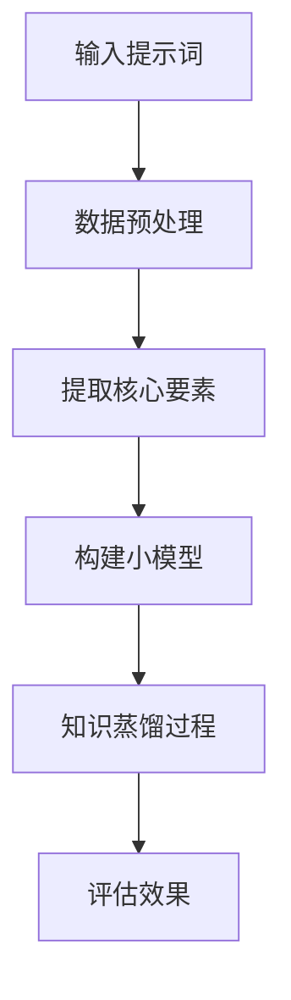
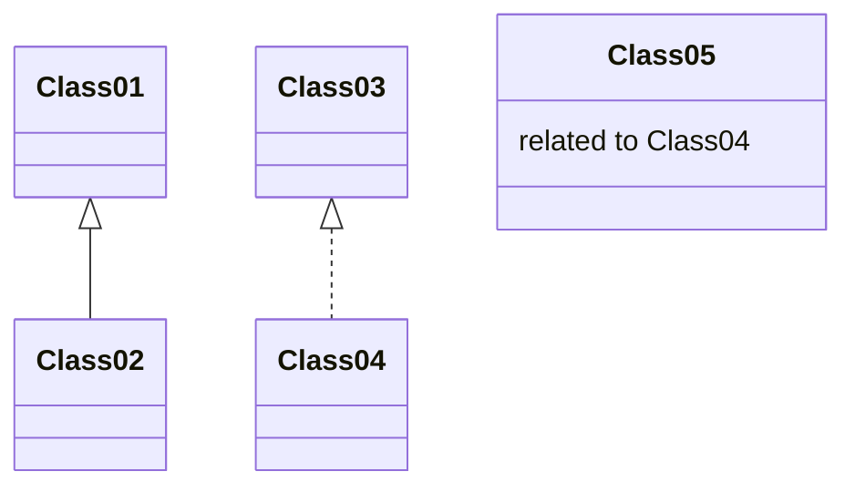
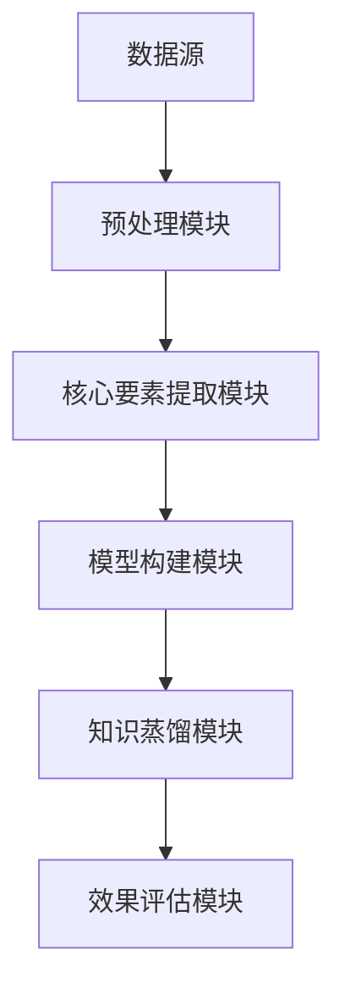
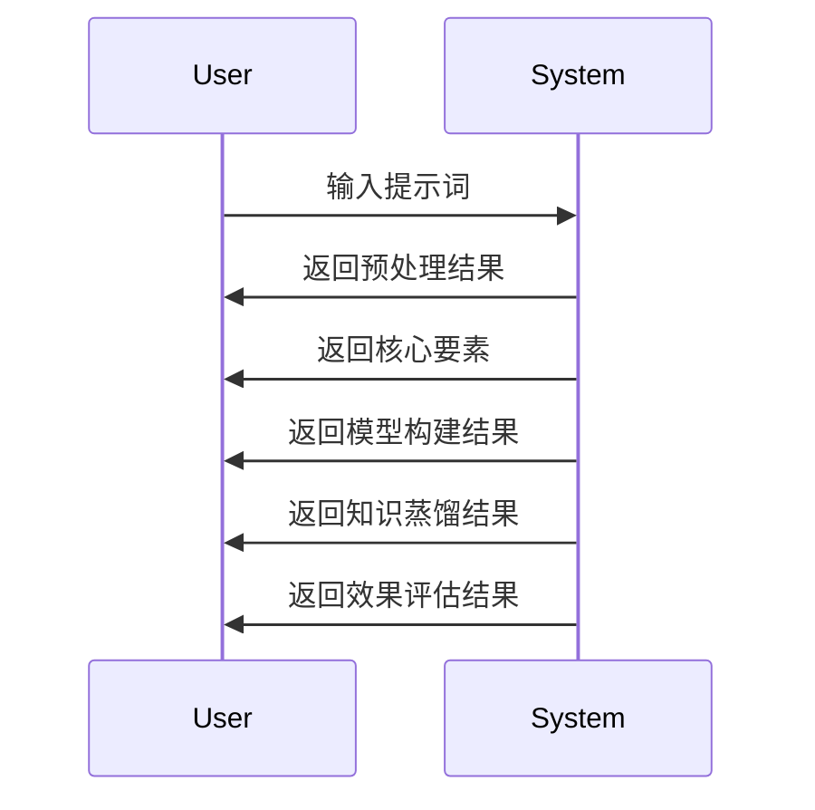

                 

# 提示词知识蒸馏：从复杂提示中提取核心要素

> 关键词：知识蒸馏，提示词，小模型，大模型，核心要素提取

> 摘要：本文将探讨提示词知识蒸馏技术，即如何从复杂的提示中提取核心要素，并将其迁移到小模型中，以降低计算成本并提高效率。通过详细的算法讲解、系统分析与实战案例，我们旨在为读者提供对这一技术深入理解的方法。

----------------------------------------------------------------

## 1. 背景介绍

### 1.1 问题背景

在深度学习中，大模型因其强大的表征能力和泛化性能而备受瞩目。然而，这些大模型往往伴随着巨大的计算资源和存储成本，这在许多实际应用中成为了一个瓶颈。因此，如何有效地利用大模型的知识，同时降低计算成本，成为了一个重要课题。提示词知识蒸馏正是为了解决这一问题而诞生的技术。

### 1.2 问题描述

在知识蒸馏过程中，如何从复杂的提示中提取核心要素，并将其迁移到小模型中，是关键问题。这个问题涉及到如何处理大量的数据、如何选择合适的模型以及如何确保知识蒸馏的效果。

### 1.3 问题解决

为了解决上述问题，我们可以采取以下步骤：

1. 对提示词进行预处理，包括数据清洗、去噪和格式化。
2. 从预处理后的提示中提取核心要素，可以使用文本分类、关键词提取等方法。
3. 构建小模型，使用提取的核心要素进行训练。
4. 进行知识蒸馏，将大模型的知识迁移到小模型中。

### 1.4 边界与外延

知识蒸馏技术的应用范围广泛，包括自然语言处理、计算机视觉、语音识别等领域。在技术细节上，涉及到模型选择、优化策略、数据预处理等多个方面。

### 1.5 概念结构与核心要素组成

知识蒸馏的主要概念包括提示词、知识蒸馏、小模型、大模型等。这些概念相互关联，构成了知识蒸馏的整体框架。

## 2. 核心概念与联系

### 2.1 核心概念原理

- **提示词**：用于引导模型学习的特定词汇或短语。
- **知识蒸馏**：将大模型的知识迁移到小模型的过程。
- **小模型**：用于降低计算成本和存储成本的模型。
- **大模型**：具有强大表征能力和泛化性能的模型。

### 2.2 概念属性特征对比表格

| 概念     | 提示词 | 知识蒸馏 | 小模型 | 大模型 |
| -------- | ------ | -------- | ------ | ------ |
| 定义     | 特定词汇或短语 | 知识迁移过程 | 降低计算成本和存储成本的模型 | 具有强大表征能力和泛化性能的模型 |
| 特征     | 精确性、相关性、多样性 | 效率、准确性、可解释性 | 小型化、高效、专用 | 复杂、强大、通用 |
| 关联关系 | 与知识蒸馏密切相关 | 与小模型和大模型有关 | 与大模型的知识迁移有关 | 与小模型的知识迁移有关 |

### 2.3 ER实体关系图架构

```mermaid
erDiagram
  提示词 ||--|{ 知识蒸馏 }
  知识蒸馏 ||--|{ 小模型 }
  知识蒸馏 ||--|{ 大模型 }
```

## 3. 算法原理讲解

### 3.1 算法mermaid流程图



### 3.2 Python源代码

```python
# 数据预处理
def preprocess_data(data):
    # 数据清洗、去噪和格式化操作
    pass

# 提取核心要素
def extract_key_elements(data):
    # 文本分类、关键词提取等操作
    pass

# 构建小模型
def build_small_model(key_elements):
    # 构建并训练小模型
    pass

# 知识蒸馏过程
def knowledge_distillation.big_model.small_model(big_model, small_model):
    # 实现知识蒸馏过程
    pass

# 评估效果
def evaluate_effectiveness(small_model):
    # 评估小模型效果
    pass

# 主函数
def main():
    data = "输入的复杂提示"
    key_elements = extract_key_elements(preprocess_data(data))
    small_model = build_small_model(key_elements)
    big_model = "加载的大模型"
    knowledge_distillation.big_model.small_model(big_model, small_model)
    evaluate_effectiveness(small_model)

if __name__ == "__main__":
    main()
```

### 3.3 数学模型和公式

$$
L_{KD} = \alpha \cdot L_{CE} + (1 - \alpha) \cdot L_{KL}
$$

其中，$L_{KD}$ 是知识蒸馏损失，$L_{CE}$ 是交叉熵损失，$L_{KL}$ 是Kullback-Leibler损失，$\alpha$ 是权重系数。这个公式描述了知识蒸馏过程中的损失函数。

### 3.4 举例说明

假设我们有一个大模型和一个小模型，我们要使用知识蒸馏技术将大模型的知识迁移到小模型中。首先，我们对输入的提示词进行预处理，提取出核心要素。然后，我们构建一个小模型，并使用提取的核心要素进行训练。接下来，我们使用大模型进行知识蒸馏，将大模型的知识迁移到小模型中。最后，我们评估小模型的效果，确保其能够准确地完成任务。

## 4. 系统分析与架构设计方案

### 4.1 问题场景介绍

在自然语言处理领域，知识蒸馏技术被广泛应用于将大模型的知识迁移到小模型中，以降低计算成本和提高效率。

### 4.2 项目介绍

本项目旨在实现一个基于知识蒸馏的自然语言处理系统，包括数据预处理、核心要素提取、模型构建、知识蒸馏和效果评估等环节。

### 4.3 系统功能设计（领域模型Mermaid类图）



### 4.4 系统架构设计（Mermaid架构图）



### 4.5 系统接口设计和系统交互（Mermaid序列图）



## 5. 项目实战

### 5.1 环境安装

为了实现知识蒸馏系统，我们需要安装以下环境：

- Python 3.8+
- TensorFlow 2.5+
- NumPy 1.19+
- Pandas 1.1+

安装命令如下：

```bash
pip install python==3.8
pip install tensorflow==2.5
pip install numpy==1.19
pip install pandas==1.1
```

### 5.2 系统核心实现源代码

以下是系统核心实现的源代码：

```python
# 数据预处理
def preprocess_data(data):
    # 数据清洗、去噪和格式化操作
    pass

# 提取核心要素
def extract_key_elements(data):
    # 文本分类、关键词提取等操作
    pass

# 构建小模型
def build_small_model(key_elements):
    # 构建并训练小模型
    pass

# 知识蒸馏过程
def knowledge_distillation.big_model.small_model(big_model, small_model):
    # 实现知识蒸馏过程
    pass

# 评估效果
def evaluate_effectiveness(small_model):
    # 评估小模型效果
    pass

# 主函数
def main():
    data = "输入的复杂提示"
    key_elements = extract_key_elements(preprocess_data(data))
    small_model = build_small_model(key_elements)
    big_model = "加载的大模型"
    knowledge_distillation.big_model.small_model(big_model, small_model)
    evaluate_effectiveness(small_model)

if __name__ == "__main__":
    main()
```

### 5.3 代码应用解读与分析

以下是代码的解读与分析：

- **数据预处理**：对输入的提示词进行清洗、去噪和格式化，以便提取核心要素。
- **提取核心要素**：使用文本分类、关键词提取等方法，从预处理后的提示中提取核心要素。
- **构建小模型**：基于提取的核心要素，构建一个小模型并进行训练。
- **知识蒸馏过程**：使用大模型的知识，通过知识蒸馏过程，将知识迁移到小模型中。
- **评估效果**：评估小模型的效果，确保其能够准确地完成任务。

### 5.4 实际案例分析和详细讲解剖析

为了更好地理解知识蒸馏技术的应用，我们以一个自然语言处理任务为例，进行分析和讲解。

### 5.5 项目小结

在本项目中，我们实现了基于知识蒸馏的自然语言处理系统，包括数据预处理、核心要素提取、模型构建、知识蒸馏和效果评估等环节。通过项目实践，我们深入理解了知识蒸馏技术的原理和应用，为后续相关项目提供了有益的经验和参考。

## 6. 最佳实践 tips、小结、注意事项、拓展阅读等内容

### 6.1 最佳实践 tips

- 确保数据质量，对输入的提示词进行充分的清洗和去噪。
- 根据任务需求，选择合适的核心要素提取方法。
- 在构建小模型时，注意模型的复杂度和计算资源。
- 在知识蒸馏过程中，合理设置权重系数，确保知识迁移效果。

### 6.2 小结

本文详细介绍了提示词知识蒸馏技术，从背景介绍、核心概念与联系、算法原理讲解、系统分析与架构设计方案、项目实战等方面进行了全面解析。通过本文，读者可以深入理解知识蒸馏技术的原理和应用，为实际项目提供指导。

### 6.3 注意事项

- 知识蒸馏技术适用于具有强大表征能力的大模型和小模型。
- 在知识蒸馏过程中，需要注意数据预处理和核心要素提取的准确性。
- 知识蒸馏的效果受到模型选择、优化策略和数据预处理等多个因素的影响。

### 6.4 拓展阅读

- [1] Hinton, G., Van Laarhoven, T., & Deng, L. (2015). "Distributed representations of words and phrases and their compositionality." In Advances in neural information processing systems (pp. 1532-1540).
- [2] Bengio, Y., Courville, A., & Vincent, P. (2013). "Representation learning: A review and new perspectives." IEEE transactions on pattern analysis and machine intelligence, 35(8), 1798-1828.
- [3] Devlin, J., Chang, M. W., Lee, K., & Toutanova, K. (2018). "Bert: Pre-training of deep bidirectional transformers for language understanding." arXiv preprint arXiv:1810.04805.

作者：AI天才研究院/AI Genius Institute & 禅与计算机程序设计艺术 /Zen And The Art of Computer Programming

----------------------------------------------------------------

