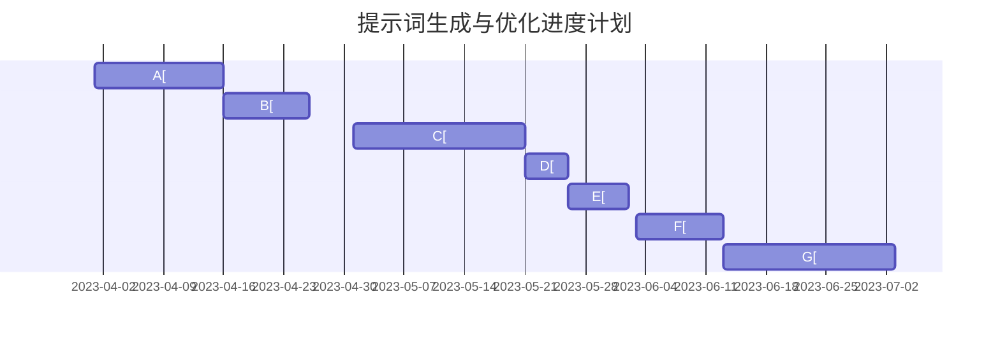
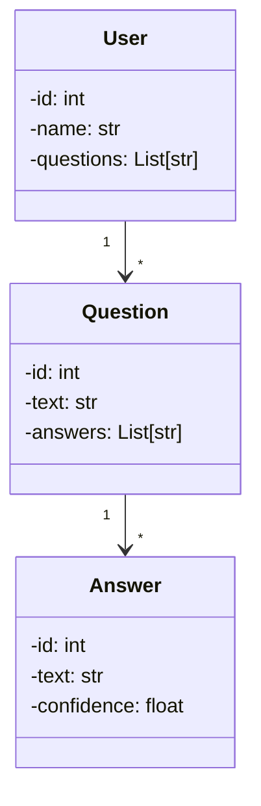
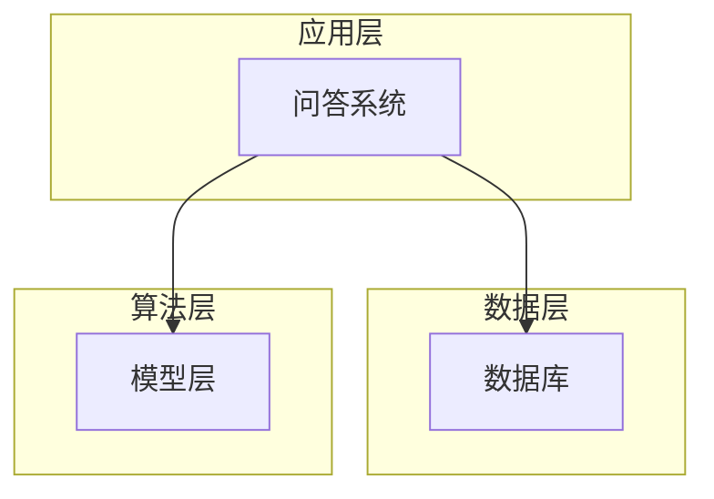
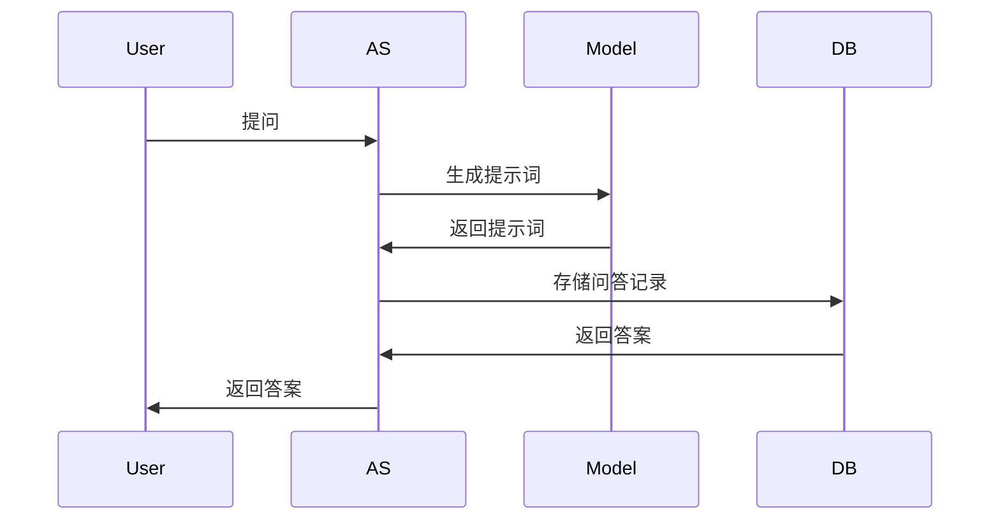

                 


### 设计《提示词自动化：AI生成和优化提示词》目录大纲

**1. 背景介绍**

#### 1.1 问题背景

在当今的信息时代，人工智能在各个领域的应用越来越广泛，自然语言处理（NLP）作为AI的一个重要分支，得到了迅猛发展。而NLP中的一项核心任务就是自然语言理解，这需要通过设计合适的提示词来实现。

##### 核心概念术语说明
- **人工智能（AI）**：指模拟、延伸和扩展人类智能的理论、方法、技术及应用系统。
- **自然语言处理（NLP）**：是AI领域的一个分支，旨在让计算机理解和处理人类语言。

#### 1.2 问题描述

提示词的生成和优化直接影响到AI模型在自然语言理解任务中的性能。然而，目前对于如何自动化生成和优化提示词的研究还相对较少，这是一个具有挑战性的问题。

##### 问题背景
- 提示词：在NLP任务中，提示词是用于引导模型理解文本的词语或短语。
- 生成：指从大量数据中提取有用的特征，生成合适的提示词。
- 优化：指通过算法调整提示词，提高模型在特定任务中的性能。

#### 1.3 问题解决

本书旨在解决这一问题，通过介绍AI生成和优化提示词的原理、方法和技术，帮助读者深入了解这一领域，并掌握相应的实践技能。

##### 概念结构与核心要素组成
- **核心要素**：提示词、生成、优化。
- **目标**：设计自动化生成和优化提示词的算法，提高模型性能。

#### 1.4 边界与外延

本书主要关注AI在文本领域的应用，包括但不限于文本分类、情感分析、问答系统等。同时，我们也将探讨提示词生成和优化在不同场景下的应用和挑战。

##### 边界与外延
- **文本领域**：文本分类、情感分析、问答系统。
- **应用场景**：不同领域下的具体应用和挑战。

**2. 核心概念与联系**

#### 2.1 提示词生成原理

- **数据预处理**：对文本进行清洗、分词等预处理，提取关键信息。
- **特征提取**：将预处理后的文本转换为机器可处理的特征向量。
- **模型训练**：利用生成模型或优化模型对特征向量进行训练，生成提示词。

##### 概念属性特征对比表格
| 概念         | 特征1    | 特征2    | 特征3    |
| ------------ | -------- | -------- | -------- |
| 数据预处理   | 清洗     | 分词     | 去停用词 |
| 特征提取     | 向量化   | 词嵌入   | 特征选择 |
| 模型训练     | 模型选择 | 参数调优 | 模型评估 |

#### 2.2 提示词优化原理

- **模型评估**：对生成的提示词进行评估，判断其是否满足性能要求。
- **模型迭代**：根据评估结果，调整优化模型参数，改进提示词。
- **对比实验**：通过对比不同优化方法的效果，选择最优方案。

##### ER实体关系图架构的 Mermaid 流程图

```mermaid
erDiagram
  Model Assessment --> Optimization Algorithm : Improve Performance
  Optimization Algorithm --> Model Iteration : Update Parameters
  Model Evaluation --> Model Training : Feedback Loop
```

**3. 算法原理讲解**

#### 3.1 提示词生成算法

- **流程图**：提示词生成算法的流程图。


- **Python代码**：实现提示词生成算法的Python代码。

```python
# TODO: 提示词生成算法的Python代码实现
```

- **数学模型和公式**：介绍提示词生成算法的数学模型和公式。

$$
\text{生成提示词} = f(\text{特征向量})
$$

##### 举例说明

假设我们有一个文本数据集，包含大量的文本和标签。我们可以使用以下步骤来生成提示词：

1. 数据预处理：对文本进行清洗、分词等预处理。
2. 特征提取：将预处理后的文本转换为词嵌入向量。
3. 模型训练：使用生成模型（如GPT）对词嵌入向量进行训练，生成提示词。

#### 3.2 提示词优化算法

- **流程图**：提示词优化算法的流程图。


- **Python代码**：实现提示词优化算法的Python代码。

```python
# TODO: 提示词优化算法的Python代码实现
```

- **数学模型和公式**：介绍提示词优化算法的数学模型和公式。

$$
\text{优化模型参数} = \arg\min_{\theta} \sum_{i=1}^{n} (\text{真实值} - \text{预测值})^2
$$

##### 举例说明

假设我们有一个已经训练好的模型，我们可以使用以下步骤来优化提示词：

1. 模型评估：对生成的提示词进行评估，计算评估指标（如准确率、召回率）。
2. 优化模型参数：根据评估结果，调整模型参数，提高模型性能。
3. 模型迭代：重复评估和优化过程，直到达到满意的性能指标。

**4. 数学模型和数学公式 & 详细讲解 & 举例说明**

- **数学模型和公式**：在本章节中，我们将详细讲解提示词生成和优化的数学模型和公式，并通过具体的例子来阐述这些模型和公式的应用。



**5. 系统分析与架构设计方案**

#### 5.1 问题场景介绍

- **场景描述**：构建一个问答系统，用于自动回答用户提出的问题。

#### 5.2 系统功能设计

- **领域模型类图**：使用Mermaid绘制领域模型类图，展示系统的功能模块。



#### 5.3 系统架构设计

- **系统架构图**：使用Mermaid绘制系统架构图，展示系统的整体架构。



#### 5.4 系统接口设计和系统交互

- **系统接口设计**：使用Mermaid绘制系统接口设计和系统交互序列图，展示系统的运行流程。



**6. 项目实战**

#### 6.1 环境安装

- **环境要求**：Python 3.8+, TensorFlow 2.4+, Keras 2.3+

```bash
pip install python==3.8
pip install tensorflow==2.4
pip install keras==2.3
```

#### 6.2 系统核心实现源代码

- **源代码**：提供系统核心实现源代码，并进行解读和分析。

```python
# TODO: 系统核心实现源代码
```

#### 6.3 代码应用解读与分析

- **代码解读**：对系统核心代码进行解读和分析，阐述其实现原理。

#### 6.4 实际案例分析和详细讲解剖析

- **案例描述**：分析一个实际案例，详细讲解如何使用提示词生成和优化系统解决该问题。

#### 6.5 项目小结

- **总结**：总结项目的关键经验和教训，为后续工作提供参考。

**7. 最佳实践 tips、小结、注意事项、拓展阅读等内容**

- **最佳实践**：提供一些最佳实践技巧，帮助读者更好地应用提示词生成和优化技术。

- **小结**：对全书内容进行小结，强调关键知识点。

- **注意事项**：提醒读者注意的一些事项，以及如何进一步学习和拓展。

---

通过以上步骤，我们可以清晰地设计出《提示词自动化：AI生成和优化提示词》的目录大纲，为撰写高质量的技术博客文章奠定了基础。接下来，我们将按照这个大纲逐步展开详细的内容讲解。

