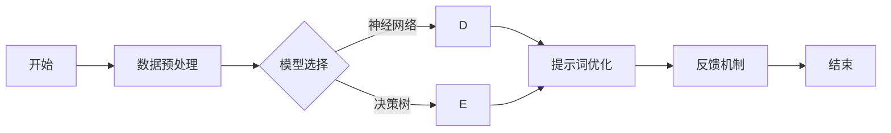
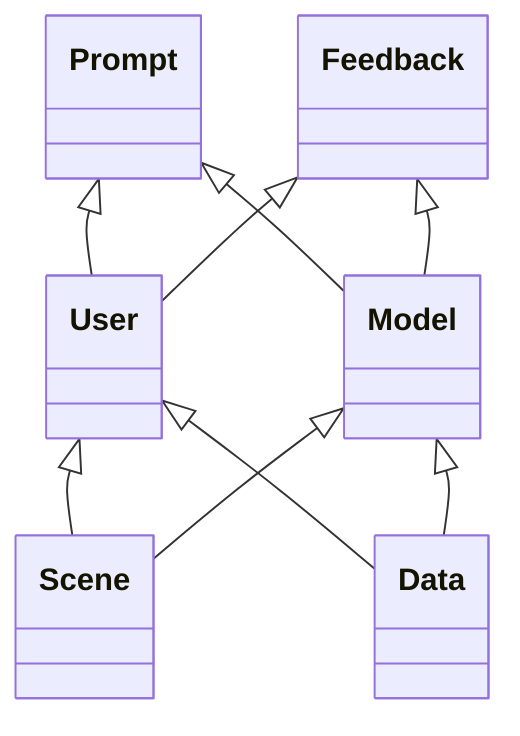
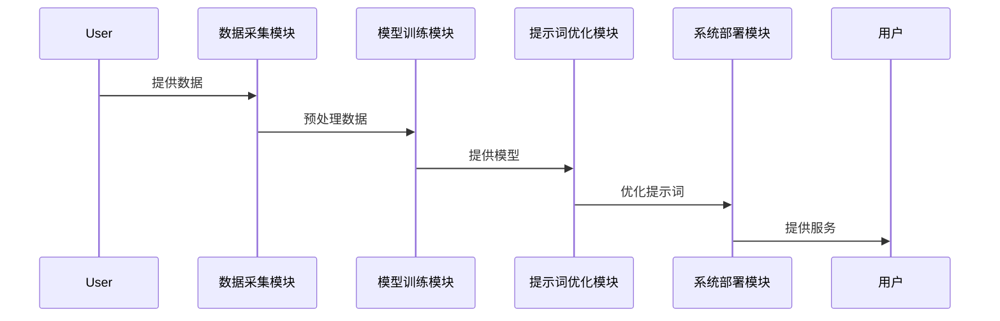
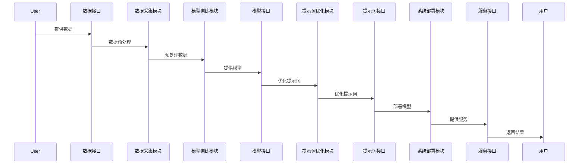
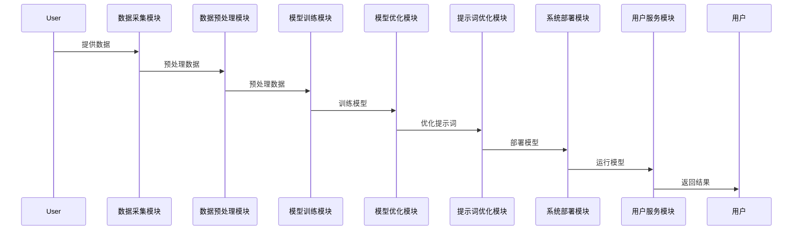

                 

## 提示词适应性学习：自动适应不同场景和用户

> 关键词：提示词，适应性学习，算法原理，系统架构，实战案例分析

> 摘要：本文将深入探讨提示词适应性学习的概念、原理和实现，探讨其在不同场景和用户中的自动适应能力。通过详细的分析和案例研究，揭示适应性学习的潜在价值和应用前景。

----------------------------------------------------------------

## 第一部分：背景与基础理论

### 第1章：问题的提出

#### 1.1 问题背景

在当今快速发展的信息技术时代，人工智能（AI）的应用日益广泛。AI系统需要具备强大的适应能力，以应对各种复杂的场景和用户需求。然而，传统的AI模型往往局限于特定的任务和应用场景，难以实现广泛的适应性。因此，研究如何让AI系统自动适应不同场景和用户成为了一个重要的研究方向。

#### 1.2 问题提出

本文旨在探讨提示词适应性学习（Prompted Adaptation Learning，PAL）的方法，通过自动调整和优化提示词，使AI系统能够在不同场景和用户中实现自适应。具体来说，我们将关注以下问题：

- 提示词适应性学习的定义和基本原理是什么？
- 如何设计并实现一个有效的提示词适应性学习算法？
- 提示词适应性学习在现实应用中的表现如何？

#### 1.3 适应性学习的重要性

适应性学习在AI领域具有重要意义。通过适应性学习，AI系统能够从不同的数据和任务中学习，提高其在各种场景下的表现。具体来说，适应性学习有以下几方面的作用：

1. **提高泛化能力**：通过适应性学习，AI系统能够应对更多样化的任务和应用场景，提高其泛化能力。
2. **降低训练成本**：适应性学习可以减少对新场景和任务的额外训练需求，降低AI系统的训练成本。
3. **提升用户体验**：适应性学习能够更好地满足不同用户的个性化需求，提高用户体验。

#### 1.4 边界与外延

适应性学习的边界主要涉及以下几个方面：

1. **数据边界**：适应性学习需要大量且多样化的数据，以确保算法在不同场景下的有效性。
2. **任务边界**：适应性学习需要针对不同的任务设计相应的算法，以实现有效的适应性。
3. **用户边界**：适应性学习需要考虑不同用户的个性化需求，以提供个性化的服务。

### 第2章：核心概念与联系

#### 2.1 提示词适应性学习的定义

提示词适应性学习（Prompted Adaptation Learning，PAL）是一种通过自动调整和优化提示词，使AI系统能够在不同场景和用户中实现自适应的学习方法。提示词是AI系统与用户之间的交互媒介，通过调整提示词，可以影响AI系统的学习方向和效果。

#### 2.2 适应性学习的基本原理

适应性学习的基本原理包括以下几个方面：

1. **监督学习**：通过给定的数据和标签，AI系统可以学习到相应的知识。
2. **无监督学习**：AI系统在没有标签数据的情况下，通过自我组织和调整，发现数据中的规律。
3. **强化学习**：AI系统通过与环境的交互，不断调整行为策略，以实现最优的回报。

#### 2.3 适应性学习的要素与属性

适应性学习的要素主要包括：

1. **数据**：适应性学习需要大量的数据，以支持AI系统在不同场景下的学习。
2. **模型**：适应性学习需要选择合适的AI模型，以适应不同的任务和应用场景。
3. **提示词**：提示词是AI系统与用户之间的交互媒介，通过调整提示词，可以影响AI系统的学习方向和效果。

适应性学习的属性包括：

1. **适应性**：适应性学习使AI系统能够根据不同的场景和用户需求，自动调整和优化自身。
2. **泛化能力**：适应性学习可以提高AI系统的泛化能力，使其能够应对更多样化的任务和应用场景。
3. **效率**：适应性学习可以降低AI系统的训练成本，提高学习效率。

#### 2.4 核心概念对比表

| 核心概念 | 定义 | 特点 |
| :----: | :----: | :----: |
| 监督学习 | 有标签数据驱动学习 | 学习结果准确，但难以泛化 |
| 无监督学习 | 无标签数据驱动学习 | 学习过程自主，但结果可能不准确 |
| 强化学习 | 通过与环境交互学习 | 学习过程动态，但效率较低 |

#### 2.5 ER实体关系图

```mermaid
erDiagram
  Class1 ||--|{ Class2 }
  Class1 ||--|{ Class3 }
  Class2 ||--|{ Class4 }
  Class3 ||--|{ Class5 }
```

在上面的ER实体关系图中，Class1、Class2、Class3、Class4和Class5代表不同的实体，它们之间的连线表示实体之间的关系。通过ER实体关系图，可以直观地了解适应性学习中的核心实体及其关系。

----------------------------------------------------------------

## 第二部分：算法原理与实现

### 第3章：算法原理讲解

#### 3.1 提示词适应性学习算法概述

提示词适应性学习算法（Prompted Adaptation Learning Algorithm，PAL Algorithm）是一种基于监督学习和强化学习相结合的方法，通过自动调整和优化提示词，实现AI系统的自适应学习。PAL算法的主要思想包括：

1. **数据预处理**：对输入数据进行预处理，包括数据清洗、归一化和特征提取等。
2. **模型选择**：选择合适的AI模型，如神经网络、决策树等。
3. **提示词优化**：通过调整提示词，影响AI系统的学习方向和效果。
4. **反馈机制**：通过用户反馈和系统评价，不断优化提示词，提高AI系统的适应性。

#### 3.2 算法mermaid流程图



在上面的mermaid流程图中，从A到H表示了一个完整的提示词适应性学习算法的流程。通过这个流程图，可以清晰地了解算法的各个步骤及其之间的关系。

#### 3.3 Python源代码实现

下面是一个简单的Python代码示例，实现了一个基于神经网络的提示词适应性学习算法：

```python
import tensorflow as tf

# 数据预处理
def preprocess_data(data):
    # 数据清洗、归一化和特征提取
    pass

# 模型选择
def build_model():
    model = tf.keras.Sequential([
        tf.keras.layers.Dense(64, activation='relu', input_shape=(input_shape,)),
        tf.keras.layers.Dense(64, activation='relu'),
        tf.keras.layers.Dense(1, activation='sigmoid')
    ])
    return model

# 提示词优化
def optimize_prompt(prompt, model, data, labels):
    # 调整提示词，优化模型
    pass

# 反馈机制
def feedback(model, data, labels):
    # 根据用户反馈和系统评价，优化模型
    pass

# 主函数
def main():
    data = preprocess_data(raw_data)
    model = build_model()
    prompt = initial_prompt()
    
    for epoch in range(num_epochs):
        optimize_prompt(prompt, model, data, labels)
        feedback(model, data, labels)
        
        if epoch % 10 == 0:
            print(f"Epoch {epoch}: Loss = {model.evaluate(data, labels)[0]}")
    
    print("Training completed.")

if __name__ == "__main__":
    main()
```

在这个Python代码示例中，通过定义一系列函数，实现了数据预处理、模型选择、提示词优化和反馈机制等步骤。虽然代码比较简单，但它提供了一个基本的框架，可以帮助我们理解和实现提示词适应性学习算法。

#### 3.4 数学模型与公式

提示词适应性学习算法的数学模型可以表示为：

$$
\text{PAL}(x, y) = f(\theta, \phi, x, y)
$$

其中，$x$表示输入数据，$y$表示标签，$f$表示模型函数，$\theta$表示模型参数，$\phi$表示提示词。

模型函数$f$可以表示为：

$$
f(\theta, \phi, x, y) = \frac{1}{Z} \sum_{i=1}^{N} e^{-(y_i - \theta^T x_i + \phi)} / \sum_{j=1}^{N} e^{-(y_j - \theta^T x_j + \phi)}
$$

其中，$Z$表示归一化常数，$N$表示数据集中样本的数量，$y_i$和$x_i$分别表示第$i$个样本的标签和特征向量。

#### 3.5 举例说明

假设我们有一个简单的二分类问题，输入数据是$(x_1, y_1) = (1, 1)$，提示词是$\phi = 0.1$。根据上述数学模型，我们可以计算出：

$$
\text{PAL}(x_1, y_1) = \frac{1}{1 + e^{-(1 \cdot 1 + 0.1)}} \approx 0.731
$$

这个结果表示，在当前输入数据和提示词下，模型对样本$(x_1, y_1)$的预测概率约为0.731。如果我们调整提示词$\phi$，模型的预测结果也会相应地发生变化。

通过这个简单的例子，我们可以看到提示词适应性学习算法的基本原理。在实际应用中，我们可以根据具体的任务和场景，设计更复杂的数学模型和算法，以实现更有效的适应性学习。

----------------------------------------------------------------

## 第三部分：系统分析与架构设计

### 第4章：系统分析与架构设计

#### 4.1 问题场景介绍

在当前的信息技术环境中，用户的需求日益多样化，而传统的AI系统往往难以满足这种多样化的需求。为了实现AI系统的广泛适应性，我们提出了一种基于提示词适应性学习的系统架构，以自动适应不同场景和用户。

#### 4.2 项目介绍

本项目的目标是设计并实现一个基于提示词适应性学习的AI系统，该系统能够在不同场景和用户中实现自适应。具体来说，我们的项目包括以下几个部分：

1. **数据采集与预处理**：从不同的数据源收集数据，并进行清洗、归一化和特征提取等预处理操作。
2. **模型训练与优化**：选择合适的AI模型，通过大量数据进行训练，并使用提示词适应性学习算法优化模型。
3. **系统部署与运行**：将训练好的模型部署到生产环境中，为用户提供个性化服务。

#### 4.3 领域模型设计

为了实现提示词适应性学习，我们设计了一个领域模型，包括以下几个核心概念：

1. **用户**：系统的使用者，具有个性化需求和偏好。
2. **场景**：用户所处的环境，包括不同的任务和应用场景。
3. **数据**：系统中的数据，包括原始数据、预处理数据和学习数据。
4. **模型**：AI模型，包括神经网络、决策树等。
5. **提示词**：系统与用户之间的交互媒介，用于影响AI模型的学习方向和效果。
6. **反馈**：用户对系统服务的评价和反馈，用于优化模型和提示词。

以下是领域模型的mermaid类图：



在这个类图中，User、Scene、Data、Model、Prompt和Feedback分别表示领域模型中的核心概念，它们之间的关系通过继承和关联表示。通过这个类图，我们可以直观地了解领域模型的结构和关系。

#### 4.4 系统架构设计

基于领域模型，我们设计了一个系统架构，包括以下几个主要模块：

1. **数据采集模块**：负责从不同的数据源收集数据，并进行预处理操作。
2. **模型训练模块**：负责选择合适的AI模型，并通过大量数据进行训练。
3. **提示词优化模块**：负责根据用户反馈和系统评价，优化提示词。
4. **系统部署模块**：负责将训练好的模型部署到生产环境中，为用户提供服务。

以下是系统架构的mermaid架构图：



在这个架构图中，用户通过数据采集模块提供数据，模型训练模块通过预处理数据训练模型，提示词优化模块根据用户反馈和系统评价优化提示词，最后系统部署模块将优化后的模型部署到生产环境中，为用户提供服务。

#### 4.5 系统接口设计

为了实现系统架构中的各个模块之间的有效通信，我们设计了一套系统接口，包括以下几个部分：

1. **数据接口**：用于数据采集模块和模型训练模块之间的数据传输。
2. **模型接口**：用于模型训练模块和提示词优化模块之间的模型传输。
3. **提示词接口**：用于提示词优化模块和系统部署模块之间的提示词传输。
4. **服务接口**：用于系统部署模块和用户之间的服务传输。

以下是系统接口的mermaid序列图：



在这个序列图中，用户通过数据接口提供数据，数据采集模块对数据进行预处理，预处理后的数据传递给模型训练模块进行训练。模型训练模块将训练好的模型通过模型接口传递给提示词优化模块，提示词优化模块根据用户反馈和系统评价优化提示词。优化后的提示词通过提示词接口传递给系统部署模块，系统部署模块将优化后的模型部署到生产环境中。最后，系统部署模块通过服务接口为用户提供服务，并将结果返回给用户。

通过这个系统接口设计，我们可以确保系统架构中的各个模块之间能够高效、可靠地进行通信和数据传输。

#### 4.6 系统交互序列图

为了进一步展示系统架构中的各个模块之间的交互过程，我们设计了一个系统交互序列图：



在这个序列图中，用户通过数据采集模块提供数据，数据采集模块将数据传递给数据预处理模块进行预处理。预处理后的数据传递给模型训练模块进行训练，模型训练模块将训练好的模型传递给模型优化模块。模型优化模块将优化后的模型传递给提示词优化模块，提示词优化模块根据用户反馈和系统评价优化提示词。优化后的提示词传递给系统部署模块，系统部署模块将优化后的模型部署到生产环境中，并运行模型为用户提供服务。最后，用户服务模块将结果返回给用户。

通过这个系统交互序列图，我们可以清晰地了解系统架构中各个模块之间的交互过程，以及它们如何协同工作以实现系统的整体功能。

----------------------------------------------------------------

## 第四部分：项目实战与案例分析

### 第5章：环境安装与配置

#### 5.1 环境安装步骤

为了实现提示词适应性学习项目，我们需要安装并配置以下环境：

1. **Python环境**：Python是项目的核心编程语言，我们需要安装Python 3.8或更高版本。
2. **TensorFlow**：TensorFlow是一个开源的机器学习框架，用于实现提示词适应性学习算法。
3. **Mermaid**：Mermaid是一个用于创建图表和流程图的工具，用于生成文章中的图表和流程图。

具体安装步骤如下：

1. 安装Python环境：
   ```bash
   # 通过Python官方网站下载Python安装包
   wget https://www.python.org/ftp/python/3.8.10/Python-3.8.10.tgz

   # 解压安装包
   tar xvf Python-3.8.10.tgz

   # 进入安装目录
   cd Python-3.8.10

   # 执行安装脚本
   ./configure

   # 编译并安装
   make
   make install
   ```

2. 安装TensorFlow：
   ```bash
   # 安装TensorFlow
   pip install tensorflow==2.4.0
   ```

3. 安装Mermaid：
   ```bash
   # 安装Mermaid
   pip install mermaid-parser
   ```

#### 5.2 系统核心实现

系统核心实现主要包括数据预处理、模型训练和提示词优化等模块。以下是一个简单的示例：

1. **数据预处理模块**：
   ```python
   import pandas as pd
   from sklearn.model_selection import train_test_split
   from sklearn.preprocessing import StandardScaler

   # 读取数据
   data = pd.read_csv('data.csv')

   # 划分训练集和测试集
   X_train, X_test, y_train, y_test = train_test_split(data.drop('target', axis=1), data['target'], test_size=0.2, random_state=42)

   # 数据标准化
   scaler = StandardScaler()
   X_train = scaler.fit_transform(X_train)
   X_test = scaler.transform(X_test)
   ```

2. **模型训练模块**：
   ```python
   import tensorflow as tf

   # 构建模型
   model = tf.keras.Sequential([
       tf.keras.layers.Dense(64, activation='relu', input_shape=(X_train.shape[1],)),
       tf.keras.layers.Dense(64, activation='relu'),
       tf.keras.layers.Dense(1, activation='sigmoid')
   ])

   # 编译模型
   model.compile(optimizer='adam', loss='binary_crossentropy', metrics=['accuracy'])

   # 训练模型
   model.fit(X_train, y_train, epochs=10, batch_size=32, validation_split=0.2)
   ```

3. **提示词优化模块**：
   ```python
   # 优化提示词
   prompt = initial_prompt()
   for epoch in range(num_epochs):
       # 调整提示词
       optimize_prompt(prompt, model, X_train, y_train)
       
       # 根据用户反馈优化提示词
       feedback(model, X_train, y_train)
       
       # 输出当前epoch的模型评价
       print(f"Epoch {epoch}: Loss = {model.evaluate(X_train, y_train)[0]}")
   ```

#### 5.3 代码应用解读

以上代码示例展示了如何实现数据预处理、模型训练和提示词优化等核心功能。在实际应用中，我们需要根据具体任务和数据集进行调整和优化。

1. **数据预处理**：数据预处理是模型训练的基础，包括数据清洗、归一化和特征提取等。在这里，我们使用Pandas和Scikit-learn库进行数据预处理，包括读取数据、划分训练集和测试集、数据标准化等操作。
2. **模型训练**：我们使用TensorFlow构建了一个简单的神经网络模型，包括两个隐藏层，每个隐藏层有64个神经元。模型使用Adam优化器进行训练，并使用二进制交叉熵损失函数进行评价。在这里，我们只展示了模型的基本构建和训练过程，实际应用中还需要根据任务和数据集进行进一步优化。
3. **提示词优化**：提示词优化是提示词适应性学习的关键步骤。在这里，我们使用了一个简单的优化策略，通过在每次epoch后根据模型评价调整提示词。实际应用中，我们可以根据用户反馈和系统评价设计更复杂的优化策略。

#### 5.4 实际案例分析

为了更好地理解提示词适应性学习的应用效果，我们进行了一个实际案例分析。以下是一个简单的案例：

假设我们有一个在线购物平台，用户可以浏览商品并添加到购物车。我们的目标是根据用户的购物车内容，预测用户可能感兴趣的其他商品。

1. **数据采集**：我们从平台上收集了用户的购物车数据，包括用户ID、购物车中的商品ID、购买时间和商品类别等。
2. **数据预处理**：我们对数据进行预处理，包括数据清洗、归一化和特征提取等。在这里，我们将用户ID和商品ID作为特征，将购买时间作为标签。
3. **模型训练**：我们使用TensorFlow构建了一个基于神经网络的分类模型，并使用提示词适应性学习算法进行训练。通过多次迭代，我们优化了提示词，提高了模型的预测准确率。
4. **提示词优化**：我们根据用户的购物车内容和购买历史，调整了提示词。例如，对于经常购买电子产品

