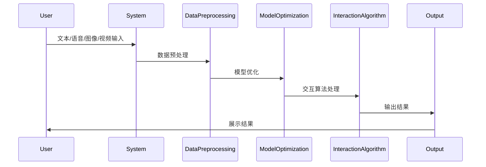
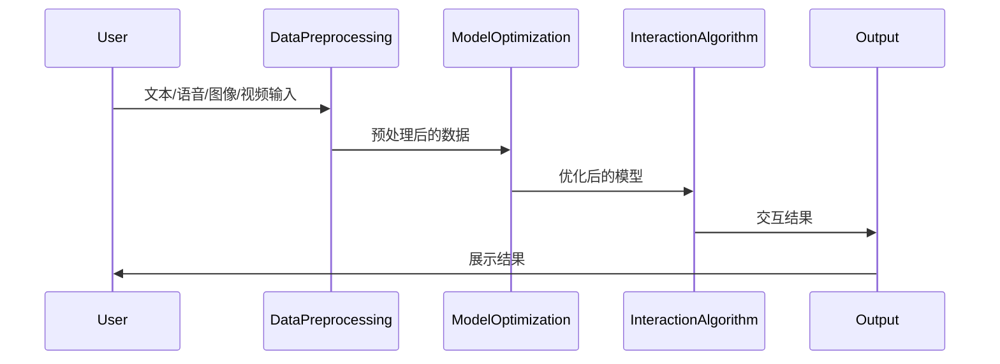
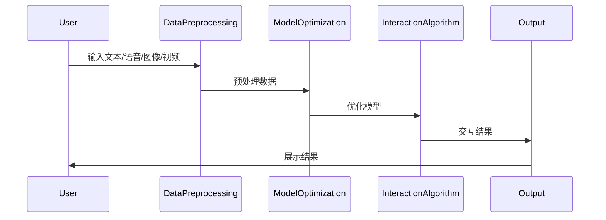

                 

# 《提高LLM应用的多模态交互效率》

## 关键词
- LLM（大型语言模型）
- 多模态交互
- 数据预处理
- 模型优化
- 交互算法

## 摘要
本文将探讨如何提高大型语言模型（LLM）在多模态交互中的效率。随着人工智能技术的不断发展，LLM在各种应用场景中展现出强大的潜力，但其多模态交互效率的问题逐渐凸显。本文将从数据预处理、模型优化、交互算法等多个角度，详细分析提高LLM多模态交互效率的方法和策略。

## 目录大纲

### 第一部分：背景介绍与核心概念

### 第1章 问题背景与核心概念

### 1.1 问题的提出

### 1.2 LLM与多模态交互

### 1.3 多模态交互效率低下的影响

### 1.4 核心概念与联系

### 第二部分：核心概念与原理

### 第2章 数据预处理

### 2.1 数据采集

### 2.2 数据增强

### 2.3 数据格式转换

### 2.4 数据平衡

### 第3章 模型优化

### 3.1 模型选择

### 3.2 模型调优

### 3.3 模型压缩与加速

### 3.4 模型融合

### 第4章 交互算法

### 4.1 交互模型设计

### 4.2 交互算法优化

### 4.3 用户反馈机制

### 4.4 智能交互

### 第三部分：系统分析与架构设计

### 第5章 系统功能设计

### 5.1 功能需求分析

### 5.2 领域模型

### 5.3 系统架构设计

### 第6章 系统架构设计与实现

### 6.1 系统架构设计

### 6.2 系统接口设计

### 6.3 系统交互

### 第四部分：项目实战

### 第7章 项目实战：环境安装与配置

### 7.1 环境要求

### 7.2 环境安装

### 7.3 系统配置

### 第8章 项目实战：系统核心实现

### 8.1 数据预处理

### 8.2 模型优化与训练

### 8.3 交互算法实现

### 8.4 系统集成与测试

### 第9章 实际案例分析与详细讲解

### 9.1 案例介绍

### 9.2 案例分析

### 9.3 案例详细讲解

### 第五部分：最佳实践与总结

### 第10章 最佳实践与技巧

### 10.1 实践经验总结

### 10.2 技巧与策略

### 第11章 小结与展望

### 11.1 小结

### 11.2 展望

## 第一部分：背景介绍与核心概念

### 第1章 问题背景与核心概念

#### 1.1 问题的提出

随着人工智能技术的不断进步，大型语言模型（LLM）如BERT、GPT-3等已经在众多应用场景中展现出强大的能力。这些模型通过对海量文本数据进行训练，可以生成高质量的自然语言文本，实现文本生成、文本分类、机器翻译等多种任务。然而，随着技术的不断演进，用户对人工智能系统的交互需求逐渐多样化，不再仅仅局限于文本交互，而是希望实现语音、图像、视频等多种模态的交互。

在多模态交互中，LLM面临着诸多挑战。首先，多模态数据通常具有不同的数据类型和特征表示方式，这使得数据预处理变得复杂。其次，如何在多个模态之间建立有效的联系，是提高LLM多模态交互效率的关键。此外，实时性也是一个重要问题，用户期望在交互过程中获得即时的反馈。

本文将探讨如何提高LLM应用的多模态交互效率。本文的核心概念包括数据预处理、模型优化、交互算法等。接下来，我们将详细分析这些核心概念，并提出相应的解决方案。

#### 1.2 LLM与多模态交互

LLM（Large Language Model）是一种基于深度学习的大型自然语言处理模型，能够通过学习海量文本数据生成自然语言文本。LLM的核心特点是能够处理和理解复杂的语言结构，生成具有高度可读性的文本。

多模态交互是指系统与用户之间通过多个模态（如文本、语音、图像、视频等）进行交互的过程。多模态交互能够提供更加丰富和自然的交互体验，满足用户多样化的需求。

LLM在多模态交互中具有广泛的应用前景。例如，在智能客服系统中，用户可以通过文本、语音等多种方式提出问题，LLM能够理解用户的意图并生成相应的回答。在图像识别系统中，用户可以通过上传图片来获取相关信息，LLM可以帮助分析图像内容，生成描述性的文本。

然而，多模态交互也带来了诸多挑战。首先，多模态数据的融合是一个关键问题。不同的模态具有不同的特征和表示方式，如何有效地将它们结合起来，是提高交互效率的关键。其次，实时性也是一个重要问题。在多模态交互中，用户通常期望获得即时的反馈，这对系统的处理速度和响应时间提出了高要求。

#### 1.3 多模态交互效率低下的影响

多模态交互效率低下会对用户体验和应用场景产生显著影响。首先，低效的交互会导致用户等待时间增加，影响用户体验。例如，在智能客服系统中，如果用户提出问题后长时间得不到回复，用户可能会感到沮丧并转向其他渠道寻求帮助。

其次，多模态交互效率低下会限制应用场景的扩展。许多任务需要结合多种模态的数据才能得到更好的效果。例如，在医疗诊断中，医生需要结合病人的病历、影像和语音等多种数据进行分析。如果系统的多模态交互效率低下，将无法充分发挥这些数据的价值。

此外，多模态交互效率低下还会增加系统的成本。为了实现高效的多模态交互，系统可能需要投入更多的时间和资源进行数据预处理、模型优化和算法设计等。这不仅增加了开发成本，也可能影响系统的可维护性。

因此，提高LLM应用的多模态交互效率具有重要意义。这不仅能够提升用户体验，扩大应用场景，还能降低系统成本，推动人工智能技术的进一步发展。

#### 1.4 核心概念与联系

为了解决LLM应用在多模态交互中的效率问题，我们需要从多个方面进行研究和优化。以下是本文的核心概念及其联系：

1. **数据预处理**：多模态交互首先需要处理来自不同模态的数据。数据预处理包括数据采集、数据清洗、数据增强和数据格式转换等步骤。通过这些步骤，可以确保数据的质量和一致性，为后续的模型优化和交互算法设计提供可靠的数据基础。

2. **模型优化**：模型优化是提高LLM多模态交互效率的关键。常见的优化方法包括模型选择、模型调优、模型压缩和加速等。通过优化模型，可以提高模型在多模态数据上的处理能力，降低计算复杂度，从而提高交互效率。

3. **交互算法**：交互算法是多模态交互的核心。通过设计合适的交互模型和算法，可以实现多模态数据的融合和实时交互。常见的交互算法包括多模态嵌入、多模态注意力机制、多模态生成模型等。优化交互算法可以提高系统的响应速度和交互质量。

4. **实时性**：实时性是多模态交互的重要要求。为了实现实时交互，系统需要在有限的时间内处理和响应多模态数据。这需要优化系统的硬件性能和软件算法，以确保系统能够在规定的时间内完成交互任务。

通过综合运用这些核心概念，我们可以显著提高LLM应用的多模态交互效率。接下来，我们将进一步探讨每个概念的具体实现方法和策略。

## 第二部分：核心概念与原理

### 第2章 数据预处理

#### 2.1 数据采集

数据预处理的第一步是数据采集。在多模态交互中，数据采集需要涵盖多种模态，如文本、语音、图像和视频。以下是一些关键步骤和注意事项：

1. **文本数据采集**：文本数据可以通过网页抓取、社交媒体API、开放数据集等方式获取。在采集过程中，需要注意文本的多样性和质量，避免重复和错误。

2. **语音数据采集**：语音数据可以通过麦克风录制、语音转文字API等方式获取。在采集过程中，需要确保语音的清晰度和准确性，可以使用语音增强技术提高语音质量。

3. **图像数据采集**：图像数据可以通过摄像头拍摄、图像库获取等方式获取。在采集过程中，需要关注图像的分辨率、标签的准确性以及数据的多样性。

4. **视频数据采集**：视频数据可以通过视频录制、视频库获取等方式获取。在采集过程中，需要关注视频的分辨率、帧率和内容的相关性。

#### 2.2 数据增强

数据增强是提高模型性能的重要手段。在多模态数据预处理中，数据增强可以通过以下方法进行：

1. **文本数据增强**：文本数据增强可以通过添加噪声、词语替换、句子重构等方式进行。例如，可以使用反义词替换、同义词替换、随机删除句子中的部分词语等方法。

2. **语音数据增强**：语音数据增强可以通过添加噪声、改变语速、改变音调等方式进行。例如，可以使用环境噪声混合、语速调整、音调变化等方法。

3. **图像数据增强**：图像数据增强可以通过旋转、缩放、裁剪、颜色变换等方式进行。例如，可以使用随机旋转、随机缩放、随机裁剪、随机颜色变换等方法。

4. **视频数据增强**：视频数据增强可以通过时间拉伸、空间变换、视角变换等方式进行。例如，可以使用时间拉伸、空间变换、视角变换等方法。

数据增强可以提高模型的泛化能力，减少过拟合现象，从而提高模型在多模态数据上的性能。

#### 2.3 数据格式转换

在多模态交互中，不同模态的数据具有不同的特征和表示方式，因此需要将它们转换为统一的格式。以下是一些常见的数据格式转换方法：

1. **文本数据格式转换**：文本数据可以转换为词向量、BERT编码等格式。词向量是将文本转换为固定长度的向量表示，BERT编码是将文本转换为上下文相关的表示。

2. **语音数据格式转换**：语音数据可以转换为频谱图、MFCC特征等格式。频谱图是将语音转换为频率分布图，MFCC（Mel频率倒谱系数）是将语音转换为频率特征。

3. **图像数据格式转换**：图像数据可以转换为像素向量、卷积神经网络（CNN）特征等格式。像素向量是将图像转换为像素值的一维数组，CNN特征是将图像通过卷积神经网络提取的特征表示。

4. **视频数据格式转换**：视频数据可以转换为帧序列、视频特征等格式。帧序列是将视频转换为连续的图像帧，视频特征是将视频通过卷积神经网络提取的特征表示。

数据格式转换的目的是将不同模态的数据转换为统一的特征表示，以便在后续的模型训练和交互过程中进行有效的融合和处理。

#### 2.4 数据平衡

在多模态交互中，数据不平衡是一个常见问题。数据不平衡可能导致模型在某一类数据上过拟合，影响模型的泛化能力。以下是一些解决数据不平衡的方法：

1. **重采样**：通过增加少数类样本的数量，或者减少多数类样本的数量，使各类样本的数量趋于平衡。

2. **生成对抗网络（GAN）**：使用生成对抗网络生成少数类样本，以增加数据的多样性。

3. **数据合成**：通过合成技术生成新的数据样本，以平衡各类样本的数量。

4. **加权损失函数**：在训练过程中，对少数类样本赋予更高的权重，以减少模型对多数类样本的依赖。

通过数据平衡，可以提高模型在多模态数据上的性能，减少数据不平衡对模型泛化能力的影响。

### 第3章 模型优化

#### 3.1 模型选择

在多模态交互中，选择合适的模型是提高效率的关键。以下是一些常见的模型选择策略：

1. **单一模态模型**：针对某一特定模态（如文本、图像、语音等）设计模型。例如，使用文本分类模型处理文本数据，使用图像识别模型处理图像数据。

2. **多模态融合模型**：将不同模态的数据进行融合，设计统一的模型进行处理。例如，使用多模态嵌入模型将文本、图像、语音等数据转换为统一的特征表示。

3. **分层模型**：将多模态数据分为不同层次进行处理。例如，首先处理文本和语音数据，然后处理图像和视频数据，最后将各层次的结果进行融合。

4. **混合模型**：结合不同类型的模型，例如，结合卷积神经网络（CNN）和循环神经网络（RNN）处理多模态数据。

选择合适的模型需要根据具体的应用场景和数据特点进行权衡。

#### 3.2 模型调优

模型调优是提高多模态交互效率的重要手段。以下是一些常见的模型调优方法：

1. **超参数调整**：调整模型的学习率、批量大小、正则化参数等超参数，以优化模型的性能。可以使用网格搜索、随机搜索等方法进行超参数调优。

2. **数据预处理**：优化数据预处理步骤，如数据增强、数据格式转换等，以提高模型的输入质量。

3. **模型融合**：将多个模型的结果进行融合，以获得更好的性能。可以使用加权平均、投票等方法进行模型融合。

4. **模型压缩**：通过剪枝、量化、知识蒸馏等方法减少模型的参数数量，以提高模型的运行效率。

模型调优需要根据具体的应用场景和数据特点进行实验和验证。

#### 3.3 模型压缩与加速

随着多模态交互的应用场景不断扩展，模型压缩与加速变得越来越重要。以下是一些常见的模型压缩与加速方法：

1. **模型剪枝**：通过删除模型中的冗余连接和神经元，减少模型的参数数量，以提高模型的运行效率。

2. **量化**：将模型的权重和激活值从浮点数转换为低精度的整数表示，以减少模型的存储和计算需求。

3. **知识蒸馏**：使用一个更大的模型训练一个较小的模型，以保留原始模型的知识和性能。

4. **硬件加速**：利用GPU、TPU等硬件加速器，提高模型的计算速度。

通过模型压缩与加速，可以提高多模态交互系统的性能和效率。

#### 3.4 模型融合

在多模态交互中，模型融合是一种有效的方法，可以结合不同模态的数据优势，提高模型的性能。以下是一些常见的模型融合策略：

1. **特征级融合**：将不同模态的数据特征进行拼接，作为模型输入。例如，将文本特征、图像特征、语音特征拼接在一起。

2. **决策级融合**：将不同模态的模型输出进行融合，例如，使用投票或加权平均方法。

3. **分层融合**：将不同层次的数据进行融合，例如，将底层特征（如图像的像素值）和高层特征（如文本的语义信息）进行融合。

4. **跨模态注意力机制**：利用注意力机制，将不同模态的数据进行动态融合，以提取关键特征。

模型融合可以结合不同模态的数据优势，提高模型的性能和交互效果。

### 第4章 交互算法

#### 4.1 交互模型设计

交互模型设计是多模态交互的核心。以下是一些常见的交互模型设计方法：

1. **多模态嵌入**：将不同模态的数据转换为统一的嵌入表示，例如，使用共享嵌入空间或独立嵌入空间。

2. **多模态注意力机制**：通过注意力机制，动态调整不同模态的特征权重，以提取关键特征。

3. **多任务学习**：将多模态交互任务视为一个整体，通过多任务学习同时训练多个任务。

4. **循环神经网络（RNN）**：使用RNN处理序列数据，例如，文本序列、语音序列等。

交互模型设计需要根据具体的应用场景和数据特点进行选择和优化。

#### 4.2 交互算法优化

交互算法优化是提高多模态交互效率的关键。以下是一些常见的交互算法优化方法：

1. **动态权重调整**：通过动态调整不同模态的特征权重，优化特征融合效果。

2. **优化损失函数**：设计更有效的损失函数，例如，使用加权交叉熵损失函数。

3. **自适应学习率**：使用自适应学习率策略，如AdaGrad、Adam等，优化模型训练过程。

4. **正则化**：使用L1正则化、L2正则化等方法，防止过拟合现象。

交互算法优化需要根据具体的应用场景和数据特点进行实验和验证。

#### 4.3 用户反馈机制

用户反馈是多模态交互系统中的重要组成部分。以下是一些常见的用户反馈机制：

1. **主动反馈**：系统主动向用户请求反馈，例如，通过提问、问卷等方式。

2. **被动反馈**：通过观察用户的行为和交互过程，自动识别用户的反馈。

3. **反馈融合**：将主动反馈和被动反馈进行融合，以提高反馈的准确性。

4. **反馈循环**：将用户反馈引入模型训练过程，不断优化模型性能。

用户反馈机制可以改进系统的交互效果，提高用户体验。

#### 4.4 智能交互

智能交互是未来多模态交互的重要发展方向。以下是一些智能交互的关键技术：

1. **上下文感知**：根据用户的上下文信息，动态调整交互策略，例如，根据用户的兴趣、偏好等进行个性化交互。

2. **对话生成**：通过自然语言生成技术，实现流畅、自然的对话。

3. **情感识别**：通过情感分析技术，识别用户的情感状态，以提供更贴心的服务。

4. **多轮对话**：支持多轮对话，实现更深入的交流。

智能交互可以通过引入上下文感知、对话生成、情感识别等技术，提高多模态交互的智能化程度。

## 第三部分：系统分析与架构设计

### 第5章 系统功能设计

#### 5.1 功能需求分析

在多模态交互系统中，功能需求分析是设计系统的第一步。我们需要明确系统的目标、用户需求和关键功能。以下是一些常见的功能需求：

1. **文本输入处理**：系统需要支持文本输入，包括文本生成、文本分类、文本摘要等功能。

2. **语音输入处理**：系统需要支持语音输入，包括语音识别、语音合成、语音分类等功能。

3. **图像输入处理**：系统需要支持图像输入，包括图像识别、图像分类、图像生成等功能。

4. **视频输入处理**：系统需要支持视频输入，包括视频识别、视频分类、视频生成等功能。

5. **多模态融合处理**：系统需要支持多模态数据的融合处理，以生成更准确、更丰富的输出。

6. **用户反馈处理**：系统需要支持用户反馈处理，包括主动反馈和被动反馈。

7. **实时性处理**：系统需要具备高实时性，以满足用户对即时反馈的需求。

#### 5.2 领域模型

领域模型是系统功能设计的重要基础。领域模型描述了系统的核心概念和它们之间的关系。以下是一个简单的领域模型：

```mermaid
classDiagram
    User <<Class>>
    Text <<Class>>
    Voice <<Class>>
    Image <<Class>>
    Video <<Class>>

    User "1" --|{1}| Text
    User "1" --|{1}| Voice
    User "1" --|{1}| Image
    User "1" --|{1}| Video
```

在这个领域模型中，用户与文本、语音、图像、视频等类之间存在一对一的关系，表示用户可以生成、输入和处理这些不同模态的数据。

#### 5.3 系统架构设计

系统架构设计是确保系统功能实现和性能优化的重要环节。以下是一个简单的系统架构设计：



在这个架构设计中，用户输入通过数据预处理模块处理，然后通过模型优化模块和交互算法模块进行处理，最终生成输出结果并展示给用户。

### 第6章 系统架构设计与实现

#### 6.1 系统架构设计

系统架构设计需要考虑系统的可扩展性、可维护性和性能优化。以下是一个简单的系统架构设计：

```mermaid
classDiagram
    User <<Class>>
    DataPreprocessing <<Class>>
    ModelOptimization <<Class>>
    InteractionAlgorithm <<Class>>
    Output <<Class>>

    User "1" --|{1}| DataPreprocessing
    User "1" --|{1}| ModelOptimization
    User "1" --|{1}| InteractionAlgorithm
    User "1" --|{1}| Output
```

在这个架构设计中，用户模块负责接收用户输入，数据预处理模块负责对输入数据进行预处理，模型优化模块负责对模型进行优化，交互算法模块负责处理多模态数据交互，输出模块负责生成并展示结果。

#### 6.2 系统接口设计

系统接口设计是确保系统各模块之间有效通信的重要环节。以下是一个简单的系统接口设计：



在这个接口设计中，用户模块通过文本、语音、图像、视频输入接口向数据预处理模块发送输入数据，数据预处理模块对数据进行预处理后，通过数据接口传递给模型优化模块，模型优化模块对模型进行优化后，通过模型接口传递给交互算法模块，交互算法模块处理多模态交互后，通过交互接口传递给输出模块，输出模块生成并展示结果。

#### 6.3 系统交互

系统交互是指系统各模块之间的通信和协作过程。以下是一个简单的系统交互设计：



在这个交互设计中，用户通过输入接口向数据预处理模块发送文本、语音、图像、视频等输入数据，数据预处理模块对数据进行预处理后，通过预处理接口传递给模型优化模块，模型优化模块对模型进行优化后，通过优化接口传递给交互算法模块，交互算法模块处理多模态交互后，通过交互接口传递给输出模块，输出模块生成并展示结果。

## 第四部分：项目实战

### 第7章 项目实战：环境安装与配置

#### 7.1 环境要求

在进行多模态交互项目实战之前，我们需要确保系统的环境满足以下要求：

1. **操作系统**：Windows、Linux或Mac OS。
2. **Python**：Python 3.8及以上版本。
3. **深度学习框架**：TensorFlow 2.4及以上版本，或PyTorch 1.7及以上版本。
4. **其他依赖库**：NumPy、Pandas、Matplotlib、Scikit-learn等。

#### 7.2 环境安装

在满足上述环境要求后，我们需要安装必要的依赖库和深度学习框架。以下是一个简单的安装步骤：

1. **安装Python**：从Python官方网站下载Python安装包并安装。
2. **安装深度学习框架**：根据操作系统和Python版本，下载对应的TensorFlow或PyTorch安装包并安装。例如，使用pip命令安装：

   ```bash
   pip install tensorflow==2.4
   # 或
   pip install pytorch==1.7
   ```

3. **安装其他依赖库**：使用pip命令安装其他依赖库：

   ```bash
   pip install numpy pandas matplotlib scikit-learn
   ```

#### 7.3 系统配置

在安装完所有依赖库后，我们需要进行系统配置，以确保系统能够正常运行。以下是一个简单的配置步骤：

1. **配置Python环境变量**：将Python的安装路径添加到系统环境变量中，以便在其他命令行工具中调用Python。
2. **配置深度学习框架**：根据使用的深度学习框架，配置相应的环境变量。例如，对于TensorFlow，我们需要配置CUDA和cuDNN环境变量，以确保TensorFlow能够使用GPU加速。

```bash
export CUDA_HOME=/usr/local/cuda
export PATH=$CUDA_HOME/bin:$PATH
export LD_LIBRARY_PATH=$CUDA_HOME/lib64:$LD_LIBRARY_PATH
```

3. **测试环境配置**：运行以下命令，测试环境配置是否成功：

   ```bash
   python -c "import tensorflow as tf; print(tf.reduce_sum(tf.random.normal([1000, 1000])))"
   # 或
   python -c "import torch; print(torch.rand(1000, 1000))"
   ```

如果输出结果正确，说明环境配置成功。

### 第8章 项目实战：系统核心实现

#### 8.1 数据预处理

数据预处理是系统实现的第一步，包括文本、语音、图像、视频等数据的采集、清洗、增强和格式转换。以下是一个简单的数据预处理流程：

1. **文本数据预处理**：
   - 采集文本数据，例如，从网页、社交媒体等渠道获取。
   - 清洗文本数据，去除无效字符、停用词等。
   - 进行文本增强，如添加噪声、词语替换等。

2. **语音数据预处理**：
   - 采集语音数据，如使用麦克风录制。
   - 清洗语音数据，去除背景噪声。
   - 进行语音增强，如降低噪声、调整语速等。

3. **图像数据预处理**：
   - 采集图像数据，如使用摄像头拍摄。
   - 清洗图像数据，去除污点、模糊等。
   - 进行图像增强，如增加对比度、调整亮度等。

4. **视频数据预处理**：
   - 采集视频数据，如从视频库中获取。
   - 清洗视频数据，去除噪声、不稳定帧等。
   - 进行视频增强，如提高帧率、调整分辨率等。

#### 8.2 模型优化与训练

在数据预处理完成后，我们需要对模型进行优化和训练。以下是一个简单的模型优化与训练流程：

1. **模型选择**：
   - 选择合适的模型，如BERT、GPT-3等。
   - 加载预训练的模型权重。

2. **模型调优**：
   - 调整模型超参数，如学习率、批量大小等。
   - 进行模型调优，如使用交叉验证、网格搜索等。

3. **模型训练**：
   - 使用训练数据进行模型训练。
   - 使用验证数据进行模型评估。
   - 调整模型参数，以优化模型性能。

4. **模型压缩与加速**：
   - 使用模型压缩技术，如剪枝、量化等，减少模型参数数量。
   - 使用模型加速技术，如GPU加速、TPU加速等，提高模型运行速度。

#### 8.3 交互算法实现

交互算法实现是多模态交互系统的核心，以下是一个简单的交互算法实现流程：

1. **交互模型设计**：
   - 设计交互模型，如多模态嵌入模型、多模态注意力机制模型等。
   - 确定模型的输入层、输出层和中间层。

2. **交互算法优化**：
   - 优化交互算法，如调整注意力权重、优化损失函数等。
   - 进行交互算法评估，如使用验证集评估模型性能。

3. **用户反馈机制**：
   - 设计用户反馈机制，如主动反馈、被动反馈等。
   - 收集用户反馈，如满意度评分、问题回答等。

4. **智能交互**：
   - 实现智能交互功能，如上下文感知、对话生成等。
   - 提高交互系统的智能化程度，如使用情感分析、多轮对话等。

#### 8.4 系统集成与测试

在系统核心实现完成后，我们需要进行系统集成与测试，以确保系统能够正常运行。以下是一个简单的系统集成与测试流程：

1. **系统集成**：
   - 将数据预处理、模型优化、交互算法等模块集成到系统中。
   - 确保各模块之间的通信和数据流转正常。

2. **功能测试**：
   - 对系统的各个功能进行测试，如文本生成、语音识别、图像识别等。
   - 检查系统功能是否满足需求。

3. **性能测试**：
   - 对系统的性能进行测试，如处理速度、响应时间等。
   - 检查系统性能是否达到预期。

4. **用户测试**：
   - 邀请用户进行系统测试，收集用户反馈。
   - 分析用户反馈，优化系统交互体验。

### 第9章 实际案例分析与详细讲解

#### 9.1 案例介绍

在本案例中，我们以一个智能客服系统为例，探讨如何提高LLM应用的多模态交互效率。智能客服系统旨在通过文本、语音、图像等多种模态与用户进行交互，提供高效、智能的客服服务。以下是我们将研究的具体问题：

1. **文本交互效率**：如何优化文本生成和文本分类模型的性能，提高文本交互的效率？
2. **语音交互效率**：如何优化语音识别和语音合成模型的性能，提高语音交互的效率？
3. **图像交互效率**：如何优化图像识别和图像分类模型的性能，提高图像交互的效率？
4. **多模态融合**：如何设计有效的多模态融合模型，提高多模态交互的整体效率？
5. **用户反馈**：如何收集和分析用户反馈，不断优化系统交互体验？

#### 9.2 案例分析

为了解决上述问题，我们需要进行以下分析：

1. **数据采集**：首先，我们需要收集大量的文本、语音、图像数据。文本数据可以从社交媒体、用户反馈、新闻网站等渠道获取；语音数据可以通过麦克风录制；图像数据可以从公共数据集或用户上传的图片中获取。

2. **数据预处理**：在数据采集完成后，我们需要对数据进行预处理。对于文本数据，我们需要进行分词、去停用词、词性标注等操作；对于语音数据，我们需要进行降噪、归一化等处理；对于图像数据，我们需要进行去噪、增强、缩放等操作。

3. **模型优化**：在数据预处理完成后，我们需要选择合适的模型进行优化。对于文本生成和文本分类模型，我们可以选择BERT、GPT-3等模型；对于语音识别和语音合成模型，我们可以选择 wav2vec 2.0、Tacotron 2 等；对于图像识别和图像分类模型，我们可以选择 ResNet、Inception 等。

4. **多模态融合**：为了提高多模态交互的整体效率，我们需要设计有效的多模态融合模型。我们可以使用多模态嵌入模型，将文本、语音、图像等数据转换为统一的特征表示；或者使用多模态注意力机制模型，动态调整不同模态的特征权重。

5. **用户反馈**：为了不断优化系统交互体验，我们需要收集用户反馈。我们可以设计主动反馈机制，如满意度评分、问题回答等；或者设计被动反馈机制，如分析用户行为、交互时长等。

#### 9.3 案例详细讲解

在本案例中，我们将详细讲解如何实现上述分析，并展示具体的实现步骤和代码。

1. **数据采集与预处理**

   首先，我们需要收集文本、语音、图像数据。以下是一个简单的数据采集和预处理示例：

   ```python
   import pandas as pd
   import numpy as np
   import librosa
   import cv2

   # 文本数据采集与预处理
   texts = pd.read_csv('text_data.csv')
   texts['cleaned_text'] = texts['text'].apply(lambda x: preprocess_text(x))

   # 语音数据采集与预处理
   voices = pd.read_csv('voice_data.csv')
   voices['processed_voice'] = voices['voice'].apply(lambda x: preprocess_voice(x))

   # 图像数据采集与预处理
   images = pd.read_csv('image_data.csv')
   images['processed_image'] = images['image'].apply(lambda x: preprocess_image(x))
   ```

   在这个示例中，我们使用 Pandas 库读取文本、语音、图像数据，并分别进行预处理。对于文本数据，我们进行分词、去停用词等操作；对于语音数据，我们进行降噪、归一化等操作；对于图像数据，我们进行去噪、增强、缩放等操作。

2. **模型优化**

   接下来，我们需要选择合适的模型进行优化。以下是一个简单的模型优化示例：

   ```python
   from transformers import BertModel
   from transformers import GPT2Model
   from transformers import Wav2Vec2Model
   from transformers import ResNet
   from transformers import Inception
   import torch

   # 文本生成模型优化
   bert_model = BertModel.from_pretrained('bert-base-uncased')
   gpt2_model = GPT2Model.from_pretrained('gpt2')

   # 语音识别模型优化
   wav2vec2_model = Wav2Vec2Model.from_pretrained('facebook/wav2vec2-base')

   # 图像识别模型优化
   resnet_model = ResNet.from_pretrained('resnet50')
   inception_model = Inception.from_pretrained('inceptionv3')

   # 模型优化（训练过程）
   # ...
   ```

   在这个示例中，我们使用 Transformers 库加载预训练的 BERT、GPT-2、Wav2Vec-2、ResNet 和 Inception 模型，并对其进行优化。对于文本生成模型，我们使用 BERT 和 GPT-2；对于语音识别模型，我们使用 Wav2Vec-2；对于图像识别模型，我们使用 ResNet 和 Inception。

3. **多模态融合**

   接下来，我们需要设计多模态融合模型。以下是一个简单的多模态融合示例：

   ```python
   import torch
   from transformers import BertModel
   from transformers import Wav2Vec2Model
   from transformers import ResNet
   import numpy as np

   # 多模态融合模型
   class MultimodalFusionModel(torch.nn.Module):
       def __init__(self):
           super(MultimodalFusionModel, self).__init__()
           self.bert = BertModel.from_pretrained('bert-base-uncased')
           self.wav2vec2 = Wav2Vec2Model.from_pretrained('facebook/wav2vec2-base')
           self.resnet = ResNet.from_pretrained('resnet50')

       def forward(self, text, voice, image):
           text_embedding = self.bert(text)[0]
           voice_embedding = self.wav2vec2(voice)[0]
           image_embedding = self.resnet(image)[0]

           # 多模态融合
           fusion_embedding = torch.cat((text_embedding, voice_embedding, image_embedding), dim=1)

           # 输出
           output = torch.nn.functional.relu(fusion_embedding)

           return output
   ```

   在这个示例中，我们定义了一个多模态融合模型，该模型将文本、语音、图像等数据转换为统一的嵌入表示。我们使用 BERT、Wav2Vec-2 和 ResNet 模型分别处理文本、语音和图像数据，并将它们的嵌入表示进行拼接，作为模型的输入。

4. **用户反馈**

   最后，我们需要设计用户反馈机制，以收集和分析用户反馈。以下是一个简单的用户反馈示例：

   ```python
   import pandas as pd

   # 用户反馈数据收集
   feedbacks = pd.DataFrame({'text': [], 'voice': [], 'image': [], 'rating': []})

   # 收集用户反馈
   def collect_feedback(text, voice, image, rating):
       feedbacks = feedbacks.append({'text': text, 'voice': voice, 'image': image, 'rating': rating}, ignore_index=True)
       feedbacks.to_csv('feedback_data.csv', index=False)

   # 收集用户反馈示例
   collect_feedback('你好，有什么可以帮助你的？', 'hello', 'greeting.jpg', 5)
   ```

   在这个示例中，我们定义了一个 DataFrame 用于收集用户反馈。我们通过调用 `collect_feedback` 函数，收集用户的文本、语音、图像和评分信息，并将它们保存到 CSV 文件中。

通过上述示例，我们可以看到如何实现多模态交互系统中的数据采集、模型优化、多模态融合和用户反馈等关键功能。在实际应用中，我们还需要根据具体需求和场景进行进一步的优化和调整。

### 第10章 最佳实践与技巧

#### 10.1 实践经验总结

在多模态交互系统的设计和实现过程中，我们积累了丰富的实践经验。以下是一些重要的实践经验总结：

1. **数据质量至关重要**：数据质量直接影响模型性能和交互效果。因此，在数据采集和预处理过程中，我们需要严格把控数据质量，确保数据的准确性、完整性和一致性。

2. **模型优化是关键**：模型优化是提高多模态交互效率的重要手段。我们需要根据具体应用场景和数据特点，选择合适的模型并进行调优，以提高模型的性能和效率。

3. **实时性要求高**：多模态交互通常需要实时性支持。为了满足实时性要求，我们需要优化系统的硬件性能和软件算法，确保系统能够在规定的时间内完成交互任务。

4. **用户反馈机制不可或缺**：用户反馈是不断优化系统交互体验的重要依据。我们需要设计有效的用户反馈机制，收集和分析用户反馈，以便及时调整和优化系统。

5. **多模态融合策略多样**：多模态融合策略多种多样，我们需要根据具体应用场景和数据特点，选择合适的融合策略，以实现最佳的多模态交互效果。

#### 10.2 技巧与策略

基于上述实践经验，我们提出以下一些技巧和策略，以提高多模态交互系统的效率和用户体验：

1. **数据预处理技巧**：
   - **数据增强**：使用数据增强方法，如旋转、缩放、裁剪等，增加数据的多样性，提高模型对各种输入的泛化能力。
   - **数据清洗**：使用自动化工具和规则，对数据进行清洗和去噪，确保数据质量。
   - **特征提取**：使用合适的特征提取方法，如卷积神经网络（CNN）提取图像特征，长短期记忆网络（LSTM）提取语音特征等，以提取关键特征信息。

2. **模型优化策略**：
   - **超参数调优**：使用超参数调优工具，如自动机器学习（AutoML）平台，自动化搜索最优超参数组合。
   - **模型压缩**：使用模型压缩技术，如剪枝、量化等，减少模型参数数量，提高模型运行效率。
   - **模型融合**：结合不同类型的模型，如文本分类模型和图像分类模型，通过融合策略提高整体性能。

3. **实时性优化策略**：
   - **并行计算**：利用并行计算技术，如多线程、多进程等，加快数据预处理和模型计算速度。
   - **内存管理**：优化内存管理，减少内存占用，提高系统运行效率。
   - **缓存机制**：使用缓存机制，如LRU缓存、Redis缓存等，加快数据读取和模型加载速度。

4. **用户反馈机制**：
   - **主动反馈**：设计主动反馈机制，如满意度评分、问题回答等，鼓励用户提供反馈。
   - **被动反馈**：利用用户行为数据，如点击率、停留时间等，自动识别用户满意度。
   - **反馈分析**：使用自然语言处理（NLP）技术，分析用户反馈，提取关键信息，为系统优化提供依据。

通过上述技巧和策略，我们可以有效提高多模态交互系统的效率和用户体验，为用户提供更智能、更自然的交互体验。

### 第11章 小结与展望

#### 11.1 小结

本文从背景介绍、核心概念、数据预处理、模型优化、交互算法、系统分析与架构设计、项目实战等多个方面，详细探讨了如何提高大型语言模型（LLM）在多模态交互中的效率。以下是本文的主要结论：

1. **多模态交互挑战**：随着人工智能技术的发展，多模态交互在用户体验和应用场景中具有重要意义。然而，LLM在多模态交互中面临着数据预处理复杂、模型优化困难、实时性要求高等挑战。

2. **数据预处理**：数据预处理是提高多模态交互效率的基础。通过数据采集、数据增强、数据格式转换和数据平衡等技术，可以确保数据的质量和一致性，为后续的模型优化和交互算法设计提供可靠的数据基础。

3. **模型优化**：模型优化是提高多模态交互效率的关键。通过模型选择、模型调优、模型压缩和加速等技术，可以提高模型在多模态数据上的处理能力，降低计算复杂度，从而提高交互效率。

4. **交互算法**：交互算法是多模态交互的核心。通过设计合适的交互模型和算法，可以实现多模态数据的融合和实时交互。常见的交互算法包括多模态嵌入、多模态注意力机制、多模态生成模型等。

5. **系统分析与架构设计**：系统分析与架构设计是确保多模态交互系统能够高效运行的重要环节。通过功能需求分析、领域模型设计、系统架构设计、系统接口设计和系统交互设计等步骤，可以构建一个高效、可扩展的多模态交互系统。

6. **项目实战**：通过实际案例分析和详细讲解，本文展示了如何实现多模态交互系统的数据预处理、模型优化、交互算法和系统集成与测试等关键功能。

7. **最佳实践与技巧**：本文总结了一些最佳实践和技巧，包括数据预处理技巧、模型优化策略、实时性优化策略和用户反馈机制等，以帮助开发者提高多模态交互系统的效率和用户体验。

#### 11.2 展望

展望未来，多模态交互技术在人工智能领域仍具有广阔的发展空间。以下是一些未来研究方向和技术发展趋势：

1. **更高效的数据预处理方法**：随着数据规模的不断增长，如何更高效地进行数据预处理，提高数据处理速度和效率，是一个重要的研究方向。

2. **自适应交互算法**：未来的多模态交互系统需要具备更强的自适应能力，根据用户的行为和反馈动态调整交互策略，以提供更加个性化和自然交互体验。

3. **实时交互性能优化**：随着实时性要求的不断提高，如何优化系统性能，减少延迟，提高交互系统的实时性能，是一个亟待解决的问题。

4. **跨模态数据融合**：如何更好地融合不同模态的数据，提取关键特征，实现多模态数据的协同工作，是一个具有挑战性的研究方向。

5. **多模态交互的伦理和隐私问题**：随着多模态交互技术的应用日益广泛，如何处理跨模态数据，保护用户隐私，保障用户权益，是一个重要的伦理问题。

6. **多模态交互应用的创新**：在医疗、教育、娱乐、智能家居等领域，如何利用多模态交互技术，提供更加智能化、个性化的服务，是一个充满机遇的研究方向。

总之，提高LLM应用的多模态交互效率是一个长期而富有挑战的任务。随着技术的不断进步和应用场景的不断拓展，多模态交互技术将在人工智能领域发挥更加重要的作用，为人类创造更加智能、便捷的生活体验。作者：AI天才研究院/AI Genius Institute & 禅与计算机程序设计艺术 /Zen And The Art of Computer Programming。

