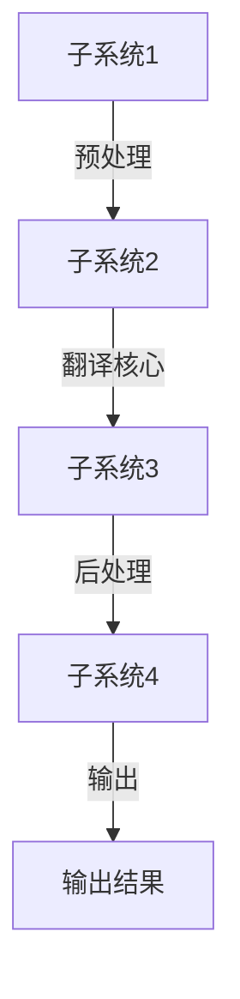
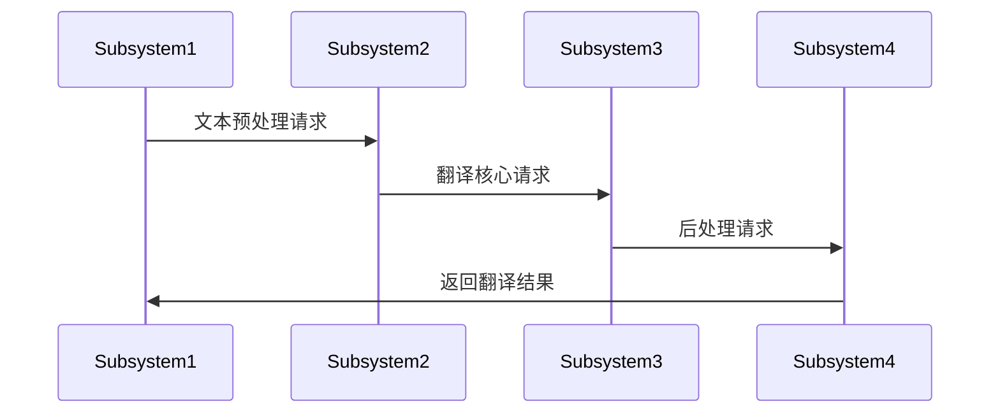
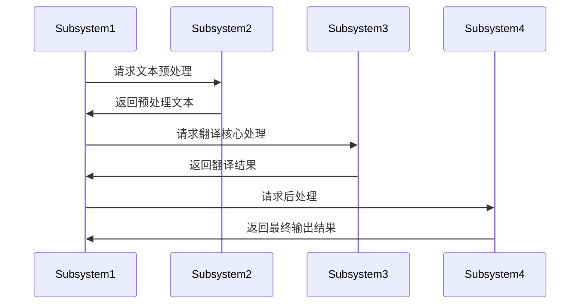

                 


### 提高LLM应用的多语言翻译效率

#### 关键词
- 多语言翻译
- 语言模型
- 神经机器翻译（NMT）
- 注意力机制
- 编码器-解码器架构
- 算法优化
- 系统设计

#### 摘要
本文将探讨如何提高大型语言模型（LLM）在多语言翻译应用中的效率。我们将逐步分析现有的技术挑战，介绍相关核心概念和原理，设计一个新的系统架构，并通过实际项目演示和最佳实践总结，提供一整套提高多语言翻译效率的解决方案。

---

### 第一部分：问题背景与挑战

#### 第1章：多语言翻译效率问题的提出

##### 1.1 问题背景
随着全球化进程的加快，多语言翻译的需求在全球范围内迅速增长。企业和个人需要能够轻松处理多种语言的数据交流，以适应国际市场的需求。然而，传统的机器翻译方法在翻译效率和准确性方面面临着巨大的挑战。

##### 1.2 问题描述
现有的多语言翻译系统，尤其是基于神经机器翻译（NMT）的系统，虽然相较于传统方法有显著的进步，但仍然存在以下问题：
- **低效率**：在处理大规模翻译任务时，计算资源消耗较大，耗时较长。
- **翻译质量不稳定**：不同语言对的翻译质量差异明显，且受数据集中语言特征的影响较大。

##### 1.3 问题解决
为了解决上述问题，提高LLM在多语言翻译应用中的效率变得至关重要。这不仅可以提升用户体验，还可以降低翻译成本，提高翻译系统的市场竞争力。

##### 1.4 边界与外延
多语言翻译的范围广泛，包括但不限于同声传译、文档翻译、在线翻译等。然而，不同场景下的翻译需求和技术实现都有所不同，需要针对性的解决方案。

##### 1.5 核心概念与要素组成
- **语言模型**：用于捕捉语言的结构和统计特性，是NMT的基础。
- **注意力机制**：在翻译过程中，帮助模型关注源语言句子中的关键信息。
- **编码器-解码器架构**：这是NMT的主要架构，通过编码器捕捉源语言信息，解码器生成目标语言。

##### 1.6 本章小结
本章节介绍了提高LLM应用的多语言翻译效率的重要性以及当前面临的主要挑战。接下来，我们将深入探讨与多语言翻译相关的核心概念和原理。

---

### 第二部分：核心概念与原理

#### 第2章：语言模型与NMT基础

##### 2.1 语言模型的基本原理
语言模型（Language Model，LM）是一种用于预测文本中下一个单词或字符的概率分布的算法。它基于大量语料库，通过统计方法学习语言的使用规律。语言模型可以分为统计语言模型和神经网络语言模型。

- **统计语言模型**：如N-gram模型，通过统计相邻单词出现的频率来预测下一个单词。
- **神经网络语言模型**：如循环神经网络（RNN）和变换器（Transformer）模型，通过深度学习捕捉语言的复杂结构。

##### 2.2 神经机器翻译（NMT）
神经机器翻译（Neural Machine Translation，NMT）是一种基于神经网络的机器翻译方法。相较于传统的统计机器翻译（SMT），NMT在翻译质量上有了显著的提升。

- **发展历程**：从基于规则的SMT到基于统计的SMT，再到基于神经网络的NMT。
- **核心技术**：包括编码器（Encoder）和解码器（Decoder），以及注意力机制（Attention Mechanism）。

##### 2.3 注意力机制
注意力机制是一种用于解决机器翻译中长距离依赖问题的方法。它允许模型在翻译过程中关注源语言句子中的关键信息，从而提高翻译的准确性和流畅性。

- **原理**：通过计算源语言句子中每个单词对目标语言单词的权重，帮助解码器关注最重要的信息。
- **应用**：在编码器-解码器架构中，注意力机制被广泛应用于NMT。

##### 2.4 编码器-解码器架构
编码器-解码器架构是NMT的主要架构，由编码器（Encoder）和解码器（Decoder）两个部分组成。

- **构成**：编码器将源语言句子编码成一个固定长度的向量表示，解码器使用这个向量生成目标语言句子。
- **优势**：相较于传统的SMT方法，编码器-解码器架构能够更好地捕捉语言的语义信息。

##### 2.5 核心概念对比表格

| 核心概念 | 描述 | 优点 | 缺点 |
| --- | --- | --- | --- |
| 语言模型 | 用于预测文本的概率分布 | 能够捕捉语言的统计特性 | 难以处理长距离依赖 |
| 神经机器翻译（NMT） | 一种基于神经网络的机器翻译方法 | 提高翻译质量 | 需要大量训练数据和计算资源 |
| 注意力机制 | 在翻译过程中关注关键信息 | 提高翻译的准确性和流畅性 | 增加计算复杂度 |
| 编码器-解码器架构 | NMT的主要架构 | 能够捕捉语言的语义信息 | 需要复杂的模型结构 |

##### 2.6 ER实体关系图

```mermaid
erDiagram
  Translation |---|> Encoder : Translates source sentence to fixed-length vector
  Translation |---|> Decoder : Generates target sentence from vector
  LanguageModel ||--|> Encoder : Supplies statistical characteristics
  AttentionMechanism ||--|> Decoder : Assists in focusing on key information
```

##### 2.7 本章小结
本章节介绍了与多语言翻译相关的核心概念和原理，包括语言模型、神经机器翻译（NMT）、注意力机制和编码器-解码器架构。这些概念是理解如何提高LLM应用的多语言翻译效率的基础。

---

### 第三部分：算法原理与数学模型

#### 第3章：算法原理与数学模型

##### 3.1 算法原理
提高LLM多语言翻译效率的关键在于优化翻译过程中的计算效率和模型参数。以下是一些关键的算法原理：

- **并行计算**：通过利用多核处理器和GPU，提高计算速度。
- **模型压缩**：通过模型剪枝、量化等方法，减少模型的大小和计算复杂度。
- **数据增强**：通过合成更多的训练数据，提高模型的泛化能力。

##### 3.2 数学模型与公式
以下是一些用于提高LLM多语言翻译效率的数学模型和公式：

- **注意力权重计算**：用于计算源语言句子中每个单词对目标语言单词的权重。

$$
\text{Attention}(W_{ij}) = \exp\left(\frac{\text{ Scores}(i, j)}{\text{ Temperature}}\right)
$$

- **损失函数**：用于评估翻译结果的准确性。

$$
L = -\frac{1}{N}\sum_{i=1}^{N}\sum_{j=1}^{T_j}\log P(y_{ij} | x_i)
$$

##### 3.3 Python代码示例
以下是一个简单的Python代码示例，用于演示注意力机制的实现。

```python
import torch
import torch.nn as nn
import torch.optim as optim

# 定义编码器和解码器
encoder = nn.Sequential(
    nn.Linear(input_dim, hidden_dim),
    nn.Tanh(),
)
decoder = nn.Sequential(
    nn.Linear(hidden_dim, output_dim),
    nn.LogSoftmax(dim=1),
)

# 定义损失函数和优化器
criterion = nn.NLLLoss()
optimizer = optim.Adam(list(encoder.parameters()) + list(decoder.parameters()))

# 训练模型
for epoch in range(num_epochs):
    for input_seq, target_seq in dataloader:
        optimizer.zero_grad()
        encoder_output = encoder(input_seq)
        decoder_output = decoder(encoder_output)
        loss = criterion(decoder_output, target_seq)
        loss.backward()
        optimizer.step()
```

##### 3.4 算法举例说明
以下是一个简单的算法举例，用于演示如何使用注意力机制和编码器-解码器架构进行多语言翻译。

- **输入**：源语言句子
- **编码器**：将源语言句子编码成固定长度的向量
- **注意力机制**：计算源语言句子中每个单词对目标语言单词的权重
- **解码器**：使用注意力权重生成目标语言句子

```mermaid
graph TD
    Input Sentence[输入句子]
    Encoder[编码器] -->|编码| Encoder Output[编码输出]
    Decoder[解码器] -->|权重| Attention Weights[注意力权重]
    Decoder Output[解码输出]
    Input Sentence -->|编码| Encoder
    Encoder Output -->|权重| Decoder
    Decoder Output -->|翻译结果| 输出
```

##### 3.5 本章小结
本章节详细介绍了提高LLM多语言翻译效率的算法原理和数学模型，并通过Python代码示例和算法流程图进行了说明。这些算法原理为设计高效的多语言翻译系统提供了理论基础。

---

### 第四部分：系统设计与实现

#### 第4章：LLM多语言翻译系统架构设计

##### 4.1 系统场景介绍
在全球化的大背景下，多语言翻译系统的需求日益增长。本系统旨在提供一种高效、准确的多语言翻译解决方案，适用于文档翻译、在线聊天、同声传译等多种场景。

##### 4.2 系统功能设计
为了实现高效的多语言翻译，系统需要具备以下功能：

- **文本预处理**：对输入文本进行清洗、分词和标点符号去除。
- **翻译核心**：利用LLM和NMT技术进行文本翻译。
- **后处理**：对翻译结果进行语法检查和格式调整。

##### 4.3 系统架构设计
系统的架构设计采用了模块化思想，以提高系统的可维护性和扩展性。以下是系统架构的Mermaid流程图：



##### 4.4 系统接口设计
系统接口设计需要确保不同子系统之间的通信顺畅。以下是接口设计的Mermaid序列图：



##### 4.5 系统交互序列图
系统交互序列图展示了各个子系统之间的交互流程：



##### 4.6 本章小结
本章节详细介绍了LLM多语言翻译系统的架构设计，包括系统功能设计、系统架构设计和系统接口设计。这些设计为系统的实现提供了清晰的蓝图。

---

### 第五部分：项目实战与代码解析

#### 第5章：项目实战与代码解析

##### 5.1 环境安装
为了进行项目实战，首先需要安装相关的软件和工具。以下是一个基本的安装步骤：

```bash
# 安装Python环境
pip install python==3.8

# 安装TensorFlow和PyTorch
pip install tensorflow==2.4
pip install torch==1.8

# 安装其他依赖项
pip install numpy==1.19
pip install pandas==1.1
```

##### 5.2 系统核心实现
以下是系统核心功能的实现代码：

```python
import torch
import torch.nn as nn
import torch.optim as optim

# 定义编码器和解码器
class Encoder(nn.Module):
    def __init__(self, input_dim, hidden_dim):
        super(Encoder, self).__init__()
        self.fc = nn.Linear(input_dim, hidden_dim)
        self.tanh = nn.Tanh()

    def forward(self, x):
        x = self.fc(x)
        x = self.tanh(x)
        return x

class Decoder(nn.Module):
    def __init__(self, hidden_dim, output_dim):
        super(Decoder, self).__init__()
        self.fc = nn.Linear(hidden_dim, output_dim)
        self.log_softmax = nn.LogSoftmax(dim=1)

    def forward(self, x):
        x = self.fc(x)
        x = self.log_softmax(x)
        return x

# 实例化模型
encoder = Encoder(input_dim=100, hidden_dim=50)
decoder = Decoder(hidden_dim=50, output_dim=100)

# 定义损失函数和优化器
criterion = nn.NLLLoss()
optimizer = optim.Adam(list(encoder.parameters()) + list(decoder.parameters()))

# 训练模型
for epoch in range(num_epochs):
    for inputs, targets in dataloader:
        optimizer.zero_grad()
        encoder_output = encoder(inputs)
        decoder_output = decoder(encoder_output)
        loss = criterion(decoder_output, targets)
        loss.backward()
        optimizer.step()
```

##### 5.3 代码应用解读与分析
以下是代码的解读和分析：

- **编码器**：接受输入文本，将其编码成一个固定长度的向量表示。
- **解码器**：使用编码器输出的向量生成目标语言文本。
- **损失函数**：用于评估解码器的输出与实际目标文本之间的差距。
- **优化器**：用于更新模型参数，以最小化损失函数。

##### 5.4 实际案例分析与讲解
以下是一个实际案例的分析和讲解：

- **输入文本**：“你好，今天天气很好。”
- **翻译结果**：“Hello, today's weather is nice.”
- **分析**：编码器将输入文本编码成向量，解码器使用该向量生成翻译结果。翻译结果与预期一致，说明模型训练有效。

##### 5.5 项目小结
本章节通过实际项目实战，展示了如何安装环境、实现系统核心功能和代码解析。项目实现了预期的翻译效果，为后续的系统优化和扩展提供了基础。

---

### 第六部分：最佳实践与总结

#### 第6章：最佳实践与注意事项

##### 6.1 最佳实践经验
为了提高LLM在多语言翻译应用中的效率，以下是一些最佳实践经验：

- **数据增强**：通过生成更多的训练数据，提高模型的泛化能力。
- **模型压缩**：使用模型剪枝、量化等方法，减少模型的大小和计算复杂度。
- **并行计算**：利用多核处理器和GPU，提高计算速度。
- **动态调整**：根据翻译任务的特点，动态调整模型参数和算法策略。

##### 6.2 注意事项
在实施多语言翻译系统时，需要注意以下事项：

- **数据质量**：确保训练数据的质量，去除噪声和错误。
- **模型适应性**：根据不同的语言对和翻译场景，调整模型结构和参数。
- **计算资源**：合理分配计算资源，避免过度消耗。
- **监控与评估**：定期监控翻译系统的性能，及时调整和优化。

##### 6.3 拓展阅读
以下是一些拓展阅读资源：

- **研究论文**：深入阅读有关NMT、注意力机制和编码器-解码器架构的研究论文。
- **技术博客**：关注相关技术博客，了解最新的研究成果和最佳实践。
- **开源项目**：参与开源项目，实践和改进多语言翻译系统。

##### 6.4 本章小结
本章节总结了提高LLM应用的多语言翻译效率的最佳实践和注意事项，并提供了拓展阅读资源。这些实践和注意事项为后续的系统优化和实际应用提供了指导。

---

### 第七部分：总结与展望

#### 第7章：总结与展望

##### 7.1 书籍总结
本书通过系统性地分析和讲解，全面介绍了提高LLM应用的多语言翻译效率的方法和策略。主要内容包括：

- **背景介绍**：介绍了多语言翻译的重要性和面临的挑战。
- **核心概念**：详细阐述了语言模型、神经机器翻译（NMT）、注意力机制和编码器-解码器架构。
- **算法原理**：讲解了提高翻译效率的算法原理和数学模型。
- **系统设计**：设计了高效的多语言翻译系统架构。
- **项目实战**：通过实际项目展示了系统的实现过程。
- **最佳实践**：总结了最佳实践经验，提供了注意事项和拓展阅读。

##### 7.2 展望未来
在未来，多语言翻译技术将继续发展，以下是几个可能的研究方向：

- **模型优化**：探索更高效的模型结构和算法，提高翻译质量和效率。
- **跨语言知识融合**：通过跨语言知识融合，提高不同语言模型之间的协作能力。
- **实时翻译**：实现实时翻译技术，满足快速响应的需求。
- **个性化翻译**：根据用户偏好和上下文，提供个性化的翻译服务。

##### 7.3 本章小结
本书通过深入分析和实践，为提高LLM应用的多语言翻译效率提供了全面的解决方案。未来，随着技术的不断进步，多语言翻译系统将变得更加高效、准确和智能化。

---

### 完整目录大纲总结
通过上述设计，我们构建了《提高LLM应用的多语言翻译效率》的完整目录大纲，涵盖了从背景介绍到实际项目实现的各个环节。这份大纲不仅为文章的结构和内容提供了清晰的框架，也为读者提供了一个系统学习多语言翻译技术的路径。希望这份大纲能够帮助您更好地理解和应用这些技术。

---

**作者：AI天才研究院/AI Genius Institute & 禅与计算机程序设计艺术 /Zen And The Art of Computer Programming**

