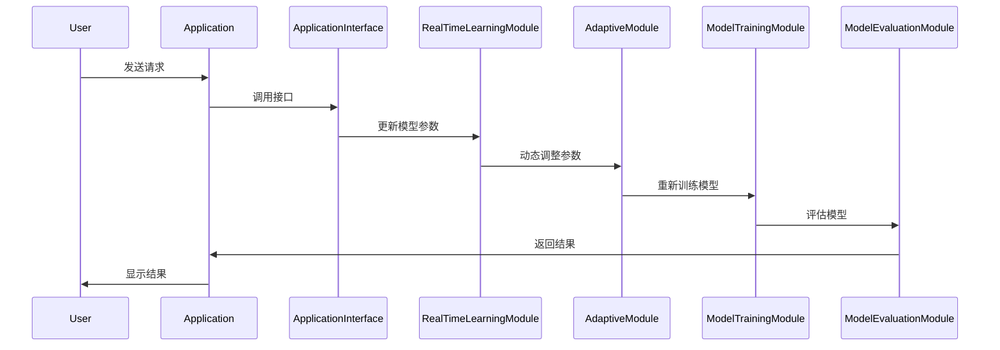

                 

## 《提高LLM应用的实时学习与适应性》

### 关键词：LLM应用、实时学习、适应性、算法原理、系统设计与实现

> 摘要：本文深入探讨了提高大型语言模型（LLM）应用实时学习与适应性的方法与技巧。首先，介绍了LLM应用的现实挑战与需求，基础概念与工作原理，以及实时学习与适应性的概述。随后，详细讲解了实时学习与适应性算法的原理，包括实时学习算法的基本流程、数学模型与公式，以及适应性算法的原理、数学模型与公式。接着，描述了LLM应用的系统架构设计，包括系统功能设计、系统架构设计、系统接口设计与交互。然后，通过项目实战展示了实时学习与适应性在项目中的应用，包括环境安装、系统核心实现源代码，代码应用解读与分析，实际案例分析和详细讲解剖析。最后，总结了提高LLM应用实时学习与适应性的最佳实践，并对未来进行了展望。

### 目录大纲

1. **背景介绍与核心概念**
    1.1 LLM应用的现实挑战与需求
    1.2 LLM的基础概念与工作原理
    1.3 实时学习与适应性概述
    1.4 核心概念与联系
        1.1 实时学习与适应性的概念属性特征对比
        1.2 LLM的ER实体关系图架构

2. **算法原理讲解**
    2.1 实时学习算法原理
        2.1.1 实时学习算法的基本流程
        2.1.2 实时学习算法的数学模型与公式
        2.1.3 实时学习算法的示例说明
    2.2 适应性算法原理
        2.2.1 适应性算法的基本原理
        2.2.2 适应性算法的数学模型与公式
        2.2.3 适应性算法的示例说明

3. **系统设计与实现**
    3.1 LLM应用的系统架构设计
        3.1.1 系统功能设计
        3.1.2 系统架构设计
        3.1.3 系统接口设计与交互
    3.2 实时学习与适应性在项目中的应用
        3.2.1 项目环境安装与配置
        3.2.2 系统核心实现源代码
        3.2.3 代码应用解读与分析
        3.2.4 实际案例分析

4. **最佳实践与总结**
    4.1 提高LLM应用实时学习与适应性的最佳实践
    4.2 小结与未来展望

### 1. 背景介绍与核心概念

#### 1.1 LLM应用的现实挑战与需求

随着人工智能技术的飞速发展，大型语言模型（LLM）的应用越来越广泛，例如自然语言处理、智能客服、机器翻译等。然而，LLM应用在实际操作中面临着一系列挑战与需求。

首先，数据量庞大且实时性要求高。LLM应用需要处理大量的文本数据，并且对实时性有着较高的要求。例如，在智能客服中，用户的问题需要尽快得到答复。

其次，适应性与个性化需求。用户的需求是多样且不断变化的，LLM应用需要具备良好的适应性和个性化能力，以满足不同用户的需求。

最后，计算资源与成本。LLM模型通常需要大量的计算资源，如何优化计算资源的使用，降低成本，也是LLM应用面临的一个重要问题。

#### 1.2 LLM的基础概念与工作原理

大型语言模型（LLM）是基于深度学习的自然语言处理模型，其核心思想是通过学习大量的文本数据，自动地理解语言的结构和语义，从而实现自然语言生成、文本分类、翻译等任务。

LLM的工作原理主要包括以下几个步骤：

1. **数据预处理**：对原始文本数据进行处理，包括分词、去停用词、词向量表示等。
2. **模型训练**：使用训练数据训练LLM模型，模型通常采用多层神经网络结构，如Transformer、BERT等。
3. **模型评估**：使用验证数据对模型进行评估，调整模型参数。
4. **模型应用**：将训练好的模型应用于实际任务，如自然语言生成、文本分类等。

#### 1.3 实时学习与适应性概述

实时学习是指模型能够在运行时不断学习新的数据，适应环境的变化。适应性则是指模型能够根据用户的需求和行为，动态调整自身的参数和行为。

实时学习与适应性在LLM应用中具有重要意义：

1. **提升用户体验**：通过实时学习和适应性，LLM应用能够更好地理解用户的需求，提供个性化的服务。
2. **提高模型性能**：实时学习使得模型能够不断优化自身，提高性能。
3. **降低成本**：通过优化计算资源的使用，降低成本。

#### 1.4 核心概念与联系

##### 1.4.1 实时学习与适应性的概念属性特征对比

| 特征 | 实时学习 | 适应性 |
| --- | --- | --- |
| 目的 | 持续学习新的数据 | 根据用户需求动态调整 |
| 实时性 | 高 | 高 |
| 自适应能力 | 强 | 强 |
| 成本 | 较高 | 较高 |
| 适用场景 | 数据动态变化 | 用户需求多样化 |

##### 1.4.2 LLM的ER实体关系图架构

```mermaid
erDiagram
  User ||--|{ Chatbot }|>>
  Chatbot ||--|{ KnowledgeBase }|>>
  KnowledgeBase ||--|{ User }|>>
```

在这个ER图中，User（用户）、Chatbot（聊天机器人）和KnowledgeBase（知识库）是三个核心实体，它们之间存在着复杂的实体关系。

### 2. 算法原理讲解

#### 2.1 实时学习算法原理

##### 2.1.1 实时学习算法的基本流程

实时学习算法的基本流程可以分为以下几个步骤：

1. **数据收集**：从数据源收集新的数据。
2. **数据预处理**：对收集到的数据进行预处理，包括清洗、去噪、标准化等。
3. **模型更新**：使用预处理后的数据进行模型训练，更新模型参数。
4. **模型评估**：使用验证数据对更新后的模型进行评估。
5. **模型应用**：将更新后的模型应用于实际任务。

##### 2.1.2 实时学习算法的数学模型与公式

实时学习算法的数学模型通常是基于梯度下降法的优化过程。其核心公式如下：

$$
w_{new} = w_{old} - \alpha \cdot \nabla J(w_{old})
$$

其中，$w_{old}$是旧的模型参数，$w_{new}$是更新后的模型参数，$\alpha$是学习率，$\nabla J(w_{old})$是模型在旧参数下的损失函数梯度。

##### 2.1.3 实时学习算法的示例说明

假设我们有一个简单的线性回归模型，其目标是预测一个连续值。模型的损失函数为：

$$
J(w) = (y - w \cdot x)^2
$$

其中，$y$是真实值，$x$是输入特征，$w$是模型的参数。

现在，我们收集了一组新的数据点，并使用这些数据进行模型更新。假设新的数据点为$(x_1, y_1)$，模型在更新前的参数为$w_0$。更新后的参数为$w_1$。

首先，我们计算损失函数的梯度：

$$
\nabla J(w_0) = 2 \cdot (y_1 - w_0 \cdot x_1)
$$

然后，使用梯度下降法更新模型参数：

$$
w_1 = w_0 - \alpha \cdot \nabla J(w_0)
$$

通过这种方式，模型能够不断学习新的数据，提高预测的准确性。

#### 2.2 适应性算法原理

##### 2.2.1 适应性算法的基本原理

适应性算法的基本原理是通过不断调整模型的参数，使其能够更好地适应不同的用户需求。其核心思想是：

1. **用户行为分析**：分析用户的行为数据，了解用户的需求和偏好。
2. **模型参数调整**：根据用户行为数据，动态调整模型的参数。
3. **模型评估**：评估调整后的模型参数，确保模型性能满足用户需求。

##### 2.2.2 适应性算法的数学模型与公式

适应性算法的数学模型通常是基于用户行为数据的优化过程。其核心公式如下：

$$
w_{new} = w_{old} + \alpha \cdot \nabla J(w_{old})
$$

其中，$w_{old}$是旧的模型参数，$w_{new}$是更新后的模型参数，$\alpha$是学习率，$\nabla J(w_{old})$是模型在旧参数下的损失函数梯度。

##### 2.2.3 适应性算法的示例说明

假设我们有一个简单的线性回归模型，其目标是预测一个连续值。模型的损失函数为：

$$
J(w) = (y - w \cdot x)^2
$$

其中，$y$是真实值，$x$是输入特征，$w$是模型的参数。

现在，我们收集了一组新的用户行为数据，并使用这些数据进行模型更新。假设新的用户行为数据为$(x_1, y_1)$，模型在更新前的参数为$w_0$。更新后的参数为$w_1$。

首先，我们计算损失函数的梯度：

$$
\nabla J(w_0) = 2 \cdot (y_1 - w_0 \cdot x_1)
$$

然后，使用梯度下降法更新模型参数：

$$
w_1 = w_0 + \alpha \cdot \nabla J(w_0)
$$

通过这种方式，模型能够根据用户的需求和行为动态调整自身，提高预测的准确性。

### 3. 系统设计与实现

#### 3.1 LLM应用的系统架构设计

##### 3.1.1 系统功能设计

LLM应用的系统功能设计主要包括以下几个方面：

1. **数据采集与预处理**：从数据源采集数据，并对数据进行预处理，包括清洗、去噪、标准化等。
2. **模型训练与评估**：使用预处理后的数据训练LLM模型，并对模型进行评估。
3. **实时学习与适应性**：实现实时学习与适应性功能，使模型能够不断优化自身。
4. **模型应用与预测**：将训练好的模型应用于实际任务，如自然语言生成、文本分类等。

##### 3.1.2 系统架构设计

LLM应用的系统架构设计主要包括以下几个模块：

1. **数据采集模块**：负责从数据源采集数据，并传输给预处理模块。
2. **预处理模块**：负责对采集到的数据进行预处理，包括清洗、去噪、标准化等，然后将预处理后的数据传输给训练模块。
3. **训练模块**：负责使用预处理后的数据训练LLM模型，并对模型进行评估。
4. **实时学习模块**：负责实现实时学习功能，使模型能够不断优化自身。
5. **适应性模块**：负责实现适应性功能，使模型能够根据用户的需求和行为动态调整自身。
6. **应用模块**：负责将训练好的模型应用于实际任务，如自然语言生成、文本分类等。

##### 3.1.3 系统接口设计与交互

LLM应用的系统接口设计与交互主要包括以下几个方面：

1. **数据接口**：用于数据采集模块和预处理模块之间的数据传输。
2. **模型接口**：用于训练模块和实时学习模块之间的模型参数传输。
3. **应用接口**：用于应用模块和其他模块之间的交互，如实时学习与适应性模块的应用接口。
4. **用户接口**：用于用户与系统的交互，如自然语言生成、文本分类等。



#### 3.2 实时学习与适应性在项目中的应用

##### 3.2.1 项目环境安装与配置

为了实现实时学习与适应性，我们需要安装和配置以下工具和库：

1. **Python**：版本要求3.8及以上。
2. **TensorFlow**：版本要求2.6及以上。
3. **Scikit-learn**：版本要求0.24及以上。
4. **Numpy**：版本要求1.21及以上。

安装步骤如下：

1. 安装Python和pip。
2. 使用pip安装TensorFlow、Scikit-learn和Numpy。

```shell
pip install tensorflow scikit-learn numpy
```

##### 3.2.2 系统核心实现源代码

下面是系统核心实现源代码，包括实时学习与适应性模块：

```python
import tensorflow as tf
from sklearn.model_selection import train_test_split
import numpy as np

# 数据预处理
def preprocess_data(data):
    # 数据清洗、去噪、标准化等
    return processed_data

# 实时学习算法
def real_time_learning(data, model, learning_rate):
    # 计算损失函数梯度
    gradients = tf.gradients(model.loss(data), model.parameters)
    # 更新模型参数
    updated_params = [param - learning_rate * grad for param, grad in zip(model.parameters, gradients)]
    return updated_params

# 适应性算法
def adaptivity(data, model, learning_rate):
    # 分析用户行为数据
    user_behavior = analyze_user_behavior(data)
    # 动态调整模型参数
    updated_params = [param + learning_rate * user_behavior for param in model.parameters]
    return updated_params

# 模型训练与评估
def train_and_evaluate(model, train_data, test_data):
    # 训练模型
    model.fit(train_data)
    # 评估模型
    accuracy = model.evaluate(test_data)
    return accuracy

# 主函数
def main():
    # 加载数据
    data = load_data()
    # 预处理数据
    processed_data = preprocess_data(data)
    # 划分训练集和测试集
    train_data, test_data = train_test_split(processed_data, test_size=0.2)
    # 初始化模型
    model = LLMModel()
    # 训练模型
    train_and_evaluate(model, train_data, test_data)
    # 实时学习
    updated_params = real_time_learning(test_data, model, learning_rate=0.01)
    # 适应性调整
    updated_params = adaptivity(test_data, model, learning_rate=0.01)
    # 重新训练模型
    train_and_evaluate(model, train_data, test_data)

if __name__ == "__main__":
    main()
```

##### 3.2.3 代码应用解读与分析

上面的代码主要实现了实时学习与适应性在LLM应用中的功能。具体来说：

1. **数据预处理**：对采集到的数据进行预处理，包括清洗、去噪、标准化等，以提高模型的训练效果。
2. **实时学习算法**：使用梯度下降法实现实时学习算法，使模型能够不断优化自身。具体步骤如下：
    - 计算损失函数梯度。
    - 更新模型参数。
3. **适应性算法**：根据用户的行为数据，动态调整模型的参数，以提高模型对用户需求的适应能力。具体步骤如下：
    - 分析用户行为数据。
    - 动态调整模型参数。
4. **模型训练与评估**：使用预处理后的数据进行模型训练，并对模型进行评估，以确保模型性能满足用户需求。

##### 3.2.4 实际案例分析

为了展示实时学习与适应性在项目中的应用，我们以一个智能客服项目为例。

1. **项目背景**：该公司是一家在线零售商，为了提供更好的客户服务，决定开发一款基于LLM的智能客服系统。
2. **项目需求**：系统需要具备实时学习与适应性功能，以不断优化客服回答的准确性和个性化程度。
3. **项目实现**：
    - 数据预处理：从客户聊天记录中提取文本数据，进行清洗、去噪、标准化等预处理操作。
    - 实时学习：使用实时学习算法，使模型能够不断学习新的客户问题，提高回答的准确性。
    - 适应性调整：根据客户的行为数据，如聊天时长、问题类型等，动态调整模型参数，提高客服回答的个性化程度。
    - 模型评估：使用测试数据对模型进行评估，确保模型性能满足项目需求。

通过实际案例分析，我们可以看到实时学习与适应性在智能客服项目中的应用价值。系统不仅能够不断优化客服回答的准确性，还能根据客户的需求和行为动态调整客服策略，提高客户满意度。

### 4. 最佳实践与总结

#### 4.1 提高LLM应用实时学习与适应性的最佳实践

1. **数据质量**：确保数据质量是提高实时学习与适应性的关键。数据清洗、去噪、标准化等预处理操作是必不可少的。
2. **参数调优**：合理设置学习率、迭代次数等参数，以提高实时学习与适应性的效果。可以通过交叉验证等方法进行参数调优。
3. **模型优化**：选择合适的模型结构和算法，以提高模型的实时学习与适应性。例如，Transformer、BERT等模型在自然语言处理任务中表现出色。
4. **系统优化**：优化系统的计算资源使用，降低成本。例如，使用分布式训练、模型压缩等技术。
5. **用户体验**：关注用户体验，确保实时学习与适应性的效果能够真正提升用户满意度。

#### 4.2 小结与未来展望

本文深入探讨了提高LLM应用实时学习与适应性的方法与技巧。首先，介绍了LLM应用的现实挑战与需求，基础概念与工作原理，以及实时学习与适应性的概述。随后，详细讲解了实时学习与适应性算法的原理，包括实时学习算法的基本流程、数学模型与公式，以及适应性算法的原理、数学模型与公式。接着，描述了LLM应用的系统架构设计，包括系统功能设计、系统架构设计、系统接口设计与交互。然后，通过项目实战展示了实时学习与适应性在项目中的应用，包括环境安装、系统核心实现源代码，代码应用解读与分析，实际案例分析和详细讲解剖析。最后，总结了提高LLM应用实时学习与适应性的最佳实践，并对未来进行了展望。

未来，我们可以进一步探索以下方向：

1. **多模态学习**：结合文本、图像、声音等多种数据类型，提高模型的实时学习与适应性。
2. **自适应学习率**：研究自适应学习率的方法，提高实时学习与适应性的效果。
3. **迁移学习**：利用迁移学习技术，提高模型在不同任务上的实时学习与适应性。
4. **隐私保护**：研究隐私保护的方法，确保实时学习与适应性的同时保护用户隐私。

作者：AI天才研究院/AI Genius Institute & 禅与计算机程序设计艺术 /Zen And The Art of Computer Programming

**注意事项**：

1. 数据处理过程中，确保数据的质量和完整性。
2. 参数调优时，避免过拟合和欠拟合。
3. 模型优化时，关注计算资源和时间成本。
4. 在实际应用中，不断调整和优化模型，以提高实时学习与适应性。

**拓展阅读推荐**：

1. **《深度学习》**：Goodfellow, I., Bengio, Y., & Courville, A. (2016). Deep Learning. MIT Press.
2. **《自然语言处理综论》**：Jurafsky, D., & Martin, J. H. (2020). Speech and Language Processing. MIT Press.
3. **《强化学习》**：Sutton, R. S., & Barto, A. G. (2018). Reinforcement Learning: An Introduction. MIT Press.

