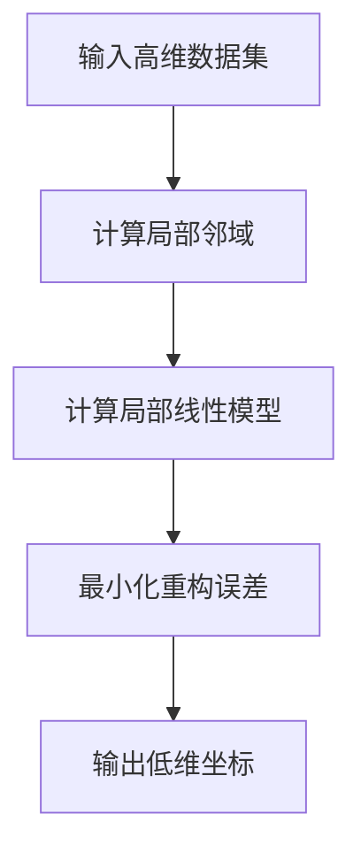
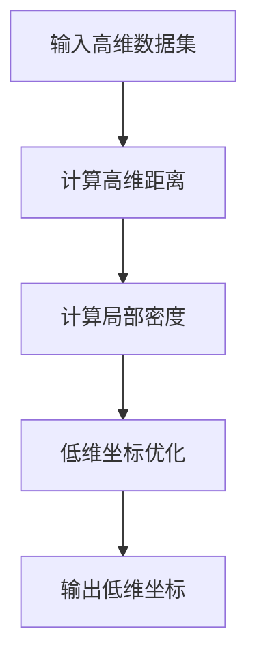
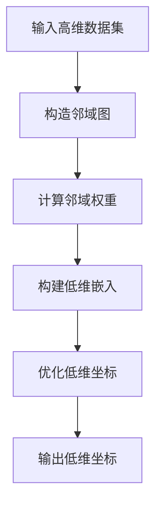

                 

### 政治光谱的流形嵌入：意识形态的低维表示

---

**关键词**：政治光谱、流形嵌入、意识形态、低维表示、算法原理

**摘要**：本文探讨了政治光谱的流形嵌入问题，将意识形态视为一种复杂的高维结构，并利用流形嵌入技术将其映射到低维空间。通过分析流形嵌入的基本原理，本文介绍了LLE、t-SNE、UMAP等常用流形嵌入算法，并讨论了意识形态与流形嵌入的关系。同时，通过Python代码示例，详细讲解了算法的原理与实现。本文旨在为政治光谱和意识形态的研究提供一种新的技术视角，并展示流形嵌入技术在社会科学领域的应用潜力。

---

### 目录大纲

```markdown
# 政治光谱的流形嵌入：意识形态的低维表示

## 第一部分：问题的背景与描述

### 1. 政治光谱的流形嵌入研究背景

#### 1.1 政治光谱的概念

#### 1.2 流形嵌入的基本概念

#### 1.3 政治光谱流形嵌入的研究意义

### 2. 政治光谱流形嵌入的挑战

#### 2.1 数据获取与清洗

#### 2.2 流形嵌入算法选择

#### 2.3 研究边界

## 第二部分：核心概念与联系

### 2.1 流形嵌入原理

#### 2.1.1 流形与低维嵌入

#### 2.1.2 流形学习算法

### 2.2 意识形态概念

#### 2.2.1 意识形态的定义与属性

#### 2.2.2 不同意识形态的特征对比表

### 2.3 意识形态与流形嵌入的关系

#### 2.3.1 流形嵌入在意识形态研究中的应用

#### 2.3.2 意识形态在流形上的表征方法

## 第三部分：算法原理讲解

### 3.1 流形嵌入算法原理讲解

#### 3.1.1 LLE算法流程

#### 3.1.2 t-SNE算法流程

#### 3.1.3 UMAP算法流程

### 3.2 Python源代码实现

### 3.3 算法原理与数学模型

#### 3.3.1 LLE的数学模型

#### 3.3.2 t-SNE的数学模型

#### 3.3.3 UMAP的数学模型

## 第四部分：系统分析与架构设计

### 4.1 问题场景介绍

### 4.2 项目介绍

### 4.3 系统功能设计

### 4.4 系统架构设计

### 4.5 系统接口设计

### 4.6 系统交互

## 第五部分：项目实战

### 5.1 环境安装

### 5.2 系统核心实现

### 5.3 代码应用解读

### 5.4 实际案例分析

### 5.5 项目小结

## 第六部分：最佳实践 tips

## 第七部分：小结

## 第八部分：注意事项

## 第九部分：拓展阅读

```

---

### 第一部分：问题的背景与描述

#### 1. 政治光谱的流形嵌入研究背景

政治光谱是指用来描述政治立场或意识形态分布的一个模型。通常，政治光谱被划分为左、中、右三个主要方向。左翼意识形态倾向于集体主义、公有制和社会公平；右翼意识形态则偏向个人主义、私有制和自由竞争；而中翼则位于两者之间，通常被视为相对中立的政治立场。

流形嵌入（Manifold Embedding）是一种将高维数据映射到低维空间的技术，旨在保持原数据的几何结构。流形是一种高维的、非线性的结构，而流形嵌入则是将这种复杂结构以较低维数的形式表示出来。流形嵌入在图像识别、文本分析、社交网络等领域有着广泛的应用。

政治光谱的流形嵌入研究旨在通过流形嵌入技术，将高维的政治光谱数据映射到二维或三维空间中，从而更直观地理解不同意识形态之间的关系，识别潜在的政治联盟与冲突。

#### 1.2 流形嵌入的基本概念

流形嵌入是一种通过映射函数将高维数据集转换到低维空间的方法。设$M$为高维流形，$f: M \rightarrow \mathbb{R}^n$为映射函数，则$f(M)$称为流形$M$在$\mathbb{R}^n$中的嵌入。流形嵌入的目标是找到一个最优的映射函数$f$，使得嵌入后的低维数据能够保持原始高维数据的几何结构。

在流形嵌入中，保持原始数据的几何结构意味着在低维空间中，原数据集中的相似点在嵌入后仍然相似，而不同的点在嵌入后仍然保持一定的距离。这一特性使得流形嵌入在降维过程中能够保留数据的关键特征，对于复杂的数据集分析尤其重要。

#### 1.3 政治光谱流形嵌入的研究意义

政治光谱流形嵌入研究具有重要的理论意义和实际应用价值。在理论层面，它有助于我们更深入地理解政治光谱的结构和特性，揭示意识形态之间的相似性与差异性。通过流形嵌入，我们可以将复杂的政治光谱数据简化为二维或三维的图形，便于进行分析和可视化。

在实践层面，政治光谱流形嵌入可以为政治分析、政策制定和选举预测等领域提供新的技术手段。例如，通过流形嵌入技术，我们可以识别出潜在的选民群体，分析他们的意识形态倾向，为选举策略提供支持。此外，流形嵌入还可以用于揭示不同政治势力之间的联盟与冲突，为国际关系研究提供新的视角。

#### 1.4 政治光谱流形嵌入的挑战

尽管政治光谱流形嵌入研究具有巨大的潜力，但也面临着一系列挑战。

首先，政治光谱数据通常难以获取，且存在大量噪音和不确定性。这使得数据清洗和预处理成为一项重要的工作。有效的数据清洗方法需要能够识别和去除噪声数据，同时保持数据的完整性。

其次，流形嵌入算法的选择至关重要。不同的流形嵌入算法在计算复杂度和嵌入质量上有所不同，需要根据具体的应用场景选择合适的算法。例如，局部线性嵌入（LLE）适用于局部结构复杂的数据，而t-SNE（t-Distributed Stochastic Neighbor Embedding）则适用于全局结构复杂的数据。

最后，政治光谱流形嵌入的研究边界包括意识形态的多样性、地域性差异以及数据的时间敏感性。不同国家和地区的政治光谱可能存在显著差异，这使得全球范围内的政治光谱流形嵌入研究具有复杂性。此外，政治光谱数据随时间变化而变化，如何处理时间敏感性数据也是一个重要的挑战。

总的来说，政治光谱流形嵌入研究在理论和实践中具有重要意义，但也面临着一系列挑战。通过本文的探讨，我们希望能够为这一领域的研究提供一些新的思路和方法。

#### 1.5 研究边界

在政治光谱流形嵌入的研究中，我们需要关注几个关键边界条件，以更好地理解这一问题的复杂性和多样性。

首先，意识形态的多样性是一个重要的研究边界。不同国家和地区可能具有不同的政治光谱，这些光谱中的意识形态种类繁多，从社会主义到资本主义，再到各种混合主义和政治流派。因此，研究政治光谱流形嵌入时，需要考虑意识形态的多样性，以避免简化或误解复杂的政治现象。

其次，地域性差异也是一个不可忽视的研究边界。不同地区的政治光谱可能受到历史、文化、经济等多种因素的影响，从而产生显著差异。例如，在一些发达国家，政治光谱可能较为均匀，而在一些发展中国家，政治光谱可能更加极端或分散。因此，进行全球范围内的政治光谱流形嵌入研究时，需要考虑地域性差异，以确保研究的准确性和代表性。

最后，数据的时间敏感性也是一个关键的研究边界。政治光谱是动态变化的，受政治事件、社会运动、经济波动等多种因素影响。因此，如何处理时间敏感性数据，以反映政治光谱的实时变化，是一个重要的挑战。在进行政治光谱流形嵌入研究时，需要考虑数据的时间跨度，并采用适当的方法来处理时间序列数据。

总的来说，政治光谱流形嵌入的研究边界涵盖了意识形态的多样性、地域性差异和数据的时间敏感性。这些边界条件不仅增加了研究的复杂性，也为深入探索政治光谱提供了丰富的视角和机会。通过充分考虑这些边界条件，我们可以更全面、准确地理解政治光谱的结构和特性，为政治分析、政策制定和选举预测等领域提供有力的支持。

---

### 第二部分：核心概念与联系

#### 2.1 流形嵌入原理

流形嵌入是一种将高维数据映射到低维空间的技术，其核心思想是通过保持数据的几何结构，降低数据的维度。这一过程通常涉及以下几个关键步骤：

##### 2.1.1 流形与低维嵌入

流形是一种数学结构，它可以是一个直线、一个平面，也可以是一个复杂的几何形体，例如一个三维空间中的球体或一个高维空间中的曲面。流形嵌入的基本目标是找到一个映射函数$f: M \rightarrow \mathbb{R}^n$，将高维流形$M$映射到一个低维空间$\mathbb{R}^n$中，同时保持流形上的局部结构和全局特性。

为了实现这一目标，流形嵌入通常依赖于以下原理：

- **局部保持性**：流形嵌入应尽量保持流形上的局部几何结构。具体来说，如果一个点在流形上靠近另一个点，那么在映射后的低维空间中，这两个点也应靠近。
- **全局一致性**：流形嵌入还应尽量保持流形上的全局结构。这意味着流形上的全局模式，如流形的折叠、扭曲等，也应映射到低维空间中。

##### 2.1.2 流形学习算法

流形学习算法是用于实现流形嵌入的数学方法。以下介绍几种常用的流形学习算法：

- **局部线性嵌入（LLE）**：LLE是一种基于局部结构的流形学习算法。它通过构建局部线性模型来重构高维数据点的邻域，并优化重构误差，以实现流形嵌入。LLE的优点是计算简单且能够较好地保持局部几何结构。
  
  LLE算法的基本步骤如下：
  1. 计算每个数据点的局部邻域。
  2. 对于每个邻域内的数据点，构建一个局部线性模型。
  3. 最小化重构误差，即最小化重构后的数据点与原始数据点之间的误差。
  4. 输出低维坐标。

- **t-Distributed Stochastic Neighbor Embedding（t-SNE）**：t-SNE是一种基于概率分布的流形学习算法。它通过计算高维数据点的条件概率分布，将其映射到低维空间中，以保持局部结构。t-SNE在处理全局结构复杂的数据时表现出色。

  t-SNE算法的基本步骤如下：
  1. 计算高维数据点之间的条件概率分布。
  2. 构建低维空间中的概率分布。
  3. 使用梯度下降法优化低维坐标，以最小化概率分布的Kullback-Leibler散度。
  4. 输出低维坐标。

- **统一建模层（UMAP）**：UMAP是一种基于邻域关系的流形学习算法。它通过构造邻域图，将高维数据映射到低维空间中，同时保持邻域内的紧密联系。UMAP在处理大规模数据时具有高效性。

  UMAP算法的基本步骤如下：
  1. 构造邻域图，确定每个数据点的邻域。
  2. 计算邻域权重，反映邻域之间的相似性。
  3. 构建低维嵌入，通过优化邻域权重来实现流形嵌入。
  4. 输出低维坐标。

##### 2.1.3 流形嵌入的优势与挑战

流形嵌入技术在数据降维和分析中具有显著优势，但也面临一些挑战。

- **优势**：
  1. **保持几何结构**：流形嵌入能够较好地保持高维数据的几何结构，使得低维嵌入后的数据仍具有明显的空间关系。
  2. **直观性**：通过流形嵌入，高维数据可以被直观地表示在二维或三维空间中，便于分析、可视化和解释。
  3. **适用于复杂结构**：流形嵌入可以处理具有复杂几何结构的数据，如文本、图像、社交网络等。

- **挑战**：
  1. **计算复杂度**：流形嵌入算法通常具有较高的计算复杂度，特别是在处理大规模数据时。
  2. **参数敏感性**：流形嵌入算法的参数设置对嵌入效果有很大影响，需要通过实验调整以达到最佳效果。
  3. **嵌入质量**：尽管流形嵌入旨在保持数据的几何结构，但嵌入质量仍可能受到噪声、异常值等因素的影响。

总的来说，流形嵌入技术为数据降维和分析提供了一种强有力的工具，但其应用仍需要克服一系列技术和实践上的挑战。通过深入研究流形嵌入算法，不断优化其性能和鲁棒性，我们可以更好地利用这一技术解决实际问题。

#### 2.2 意识形态概念

意识形态是一个广泛用于政治学、社会学和心理学等领域的重要概念，它涉及个人的信仰、价值观和行为模式。意识形态不仅影响个人的政治选择，还对社会结构、政治运动和国际关系产生深远影响。

##### 2.2.1 意识形态的定义与属性

意识形态可以被定义为一种系统的、持久的信仰和价值观体系，它指导个体的行为和决策，并在一定程度上反映了社会的政治、经济和文化状况。意识形态具有以下几个核心属性：

- **系统性**：意识形态不是一系列孤立的观点，而是一个相互关联、内在一致的理论体系。
- **持久性**：意识形态通常是长期形成的，不易被短期事件或政策变化所改变。
- **指导性**：意识形态对个体的行为和决策具有指导作用，影响他们对社会、政治和经济问题的看法和态度。
- **政治性**：意识形态在政治领域尤为重要，它直接影响政治团体和政党的形成、运作和目标。

##### 2.2.2 不同意识形态的特征对比表

不同意识形态在信仰、价值观和行为模式上存在显著差异，以下表格对不同意识形态进行了简要对比：

| 意识形态   | 特征1       | 特征2       | 特征3       |
| -------- | ---------- | ---------- | ---------- |
| 社会主义   | 公有制     | 社会公平   | 集体主义   |
| 资本主义   | 私有制     | 自由竞争   | 个人主义   |
| 民粹主义   | 人民至上   | 反对精英   | 强调民主   |
| 民主社会主义 | 社会公平   | 多元化   | 民主参与   |
| 极端主义   | 强调信仰   | 激进手段   | 反对现代化 |

- **社会主义**：社会主义强调公有制和社会公平，倡导通过集体主义实现社会正义。社会主义意识形态在多个国家得到实践，如苏联、中国和古巴。
- **资本主义**：资本主义以私有制和自由竞争为核心价值观，强调个人自由和经济效率。资本主义在全球范围内占据主导地位，许多国家采用资本主义经济模式。
- **民粹主义**：民粹主义主张人民至上，反对精英统治，强调民主和直接民主。民粹主义在一些国家和时期具有广泛影响力，如20世纪初的美国和当前的一些欧洲国家。
- **民主社会主义**：民主社会主义结合了社会主义和民主的理念，追求社会公平和多元化，强调民主参与和社区自治。瑞典和丹麦等国家在政策上体现了民主社会主义的特点。
- **极端主义**：极端主义通常具有强烈的信仰和极端的立场，倾向于使用激进手段实现其目标。极端主义在一些宗教和政治运动中有所表现，但通常被视为社会问题。

##### 2.2.3 意识形态的历史演变

意识形态并非静态不变，而是随着历史、文化和社会的发展而不断演变。以下简要回顾了意识形态的历史演变过程：

- **古代**：在古代社会，意识形态主要与宗教和哲学思想相关。例如，古希腊哲学家的思想对后来的西方政治哲学产生了深远影响。
- **中世纪**：中世纪时期，意识形态主要与宗教教义和政治权威相关。天主教会在欧洲社会具有至高无上的地位，影响了当时的政治、经济和文化。
- **现代**：随着启蒙运动的兴起，理性主义和自由主义等新意识形态逐渐取代了宗教和封建主义。现代意识形态强调个人权利、民主和科学。
- **当代**：当代社会的意识形态更加多样化，包括社会主义、资本主义、民粹主义、绿色和平主义等。全球化、信息技术和社交媒体的发展进一步丰富了意识形态的内涵和表现形式。

总的来说，意识形态是一个复杂且动态的概念，它随着历史和社会的发展不断演变。理解意识形态的概念和特征，有助于我们更好地分析政治现象、预测社会趋势和制定政策。

#### 2.3 意识形态与流形嵌入的关系

意识形态与流形嵌入之间存在紧密的联系。意识形态作为一种复杂的高维结构，可以通过流形嵌入技术映射到低维空间中，从而便于分析和可视化。以下从几个方面探讨意识形态与流形嵌入的关系：

##### 2.3.1 流形嵌入在意识形态研究中的应用

流形嵌入技术在意识形态研究中具有广泛的应用潜力。通过流形嵌入，我们可以将复杂的意识形态数据简化为二维或三维的图形，从而更直观地理解意识形态之间的相似性与差异性。具体应用包括：

- **意识形态可视化**：利用流形嵌入技术，将意识形态数据嵌入到低维空间中，生成直观的可视化图形。例如，通过t-SNE或UMAP算法，将不同意识形态在二维或三维空间中表示出来，便于分析者直观地观察意识形态之间的联系。
- **意识形态分类**：通过流形嵌入技术，可以将不同意识形态划分为不同的类别。例如，使用LLE算法对政治光谱进行嵌入，可以将左翼、中翼和右翼意识形态明确区分开来。
- **意识形态预测**：流形嵌入技术还可以用于预测意识形态的未来发展趋势。通过分析意识形态在低维空间中的分布和变化，可以预测哪些意识形态可能会在未来占据主导地位。

##### 2.3.2 意识形态在流形上的表征方法

为了在流形上有效表征意识形态，我们需要借助一些数学工具和图形表示方法。以下介绍几种常用的表征方法：

- **实体关系图（ER图）**：实体关系图是一种用于表示实体及其关系的图形表示方法。在意识形态研究中，可以使用ER图来表示不同意识形态之间的关系。例如，可以创建一个包含各种意识形态实体的ER图，并使用边表示这些实体之间的相似性与差异性。
- **低维嵌入图**：低维嵌入图是流形嵌入技术在意识形态研究中的直接应用。通过将意识形态数据嵌入到二维或三维空间中，可以生成低维嵌入图。这些图可以帮助我们直观地观察意识形态之间的联系和分布。
- **动态可视化**：动态可视化是一种通过动画展示数据变化的方法。在意识形态研究中，可以使用动态可视化来展示意识形态在不同时间点的变化和演变。例如，通过t-SNE算法，可以将不同时间点的意识形态数据嵌入到二维空间中，并生成动画展示意识形态的演变过程。

以下是一个示例ER图，展示了不同意识形态之间的关系：

```mermaid
erDiagram
  Left Wing &&>o> Socialism
  Right Wing &&>o> Capitalism
  Middle Wing &&>o> Democratic Socialist
  Populism &&>o> Middle Wing
  Extremism &&>o> Populism
```

通过实体关系图，我们可以清晰地看到不同意识形态之间的联系和层次结构。例如，社会主义和资本主义是两个相对立的意识形态，而民主社会主义位于两者之间，体现了社会主义和资本主义的一些共同特征。

总的来说，流形嵌入技术为意识形态研究提供了一种新的视角和方法。通过将意识形态数据映射到低维空间中，我们可以更直观地分析意识形态之间的相似性与差异性，揭示意识形态的结构和动态变化。这不仅有助于加深我们对意识形态的理解，也为政治分析、政策制定和社会研究提供了有力的支持。

---

### 第三部分：算法原理讲解

在探讨政治光谱流形嵌入的过程中，我们需要深入理解几种常用的流形嵌入算法，包括局部线性嵌入（LLE）、t-Distributed Stochastic Neighbor Embedding（t-SNE）和统一建模层（UMAP）。这些算法各有特点，适用于不同的应用场景。下面我们将详细介绍这些算法的原理、流程及其应用。

#### 3.1.1 LLE算法流程

局部线性嵌入（LLE）是一种基于局部结构的流形学习算法，旨在保持高维数据点的局部线性结构。LLE的基本思想是：对于每个高维数据点，通过其邻域内的点来重构该点，并最小化重构误差。以下是LLE算法的详细流程：

1. **计算局部邻域**：对于每个数据点，计算其在高维空间中的局部邻域。邻域的大小可以通过预先设定的参数或通过数据自身特性来确定。

2. **计算局部线性模型**：对于每个数据点及其邻域内的点，构建一个局部线性模型。具体来说，假设有一个数据点$x_i$和其邻域$N_i$，则可以通过最小二乘法构建如下线性模型：
   $$
   x_i' = \sum_{j \in N_i} w_{ij} x_j
   $$
   其中，$w_{ij}$是邻域权重，$x_j$是邻域内的点。

3. **最小化重构误差**：通过优化权重矩阵$W$，使得重构后的数据点$x_i'$与原始数据点$x_i$之间的误差最小。具体优化目标为：
   $$
   J(W) = \sum_{i=1}^{n} \sum_{j \in N_i} \left\| x_i - x_i' \right\|^2
   $$
   其中，$n$是数据点的总数。

4. **输出低维坐标**：通过优化得到的权重矩阵$W$，将原始数据点映射到低维空间中，得到低维坐标。

以下是LLE算法的mermaid流程图：



#### 3.1.2 t-SNE算法流程

t-Distributed Stochastic Neighbor Embedding（t-SNE）是一种基于概率分布的流形学习算法，旨在保持高维数据点的局部结构。t-SNE通过计算高维数据点之间的条件概率分布，将其映射到低维空间中，以保持局部相似性。以下是t-SNE算法的详细流程：

1. **计算高维距离**：首先，计算高维数据集$X$中每个数据点之间的距离矩阵$D$。距离可以通过欧几里得距离或其他合适的距离度量方法计算。

2. **计算局部密度**：对于每个数据点，计算其在高维空间中的局部密度。局部密度反映了点周围的“拥挤程度”，是计算低维坐标的关键参数。

3. **低维坐标优化**：通过梯度下降法优化低维坐标，使得低维空间中的点之间的距离与高维空间中的距离相匹配。具体优化目标为最小化Kullback-Leibler散度（KL散度）：
   $$
   J(\mathbf{y}) = \sum_{i,j} p_{ij} \log \frac{p_{ij}}{q_{ij}}
   $$
   其中，$p_{ij}$是高维空间中的条件概率分布，$q_{ij}$是低维空间中的条件概率分布。

4. **输出低维坐标**：通过优化得到的低维坐标，得到嵌入后的数据点。

以下是t-SNE算法的mermaid流程图：



#### 3.1.3 UMAP算法流程

统一建模层（UMAP）是一种基于邻域关系的流形学习算法，旨在高效地保持高维数据的几何结构。UMAP通过构造邻域图，将高维数据映射到低维空间中，同时保持邻域内的紧密联系。以下是UMAP算法的详细流程：

1. **构造邻域图**：首先，计算每个数据点的邻域，并构造邻域图。邻域的大小可以通过预先设定的参数或通过数据自身特性来确定。

2. **计算邻域权重**：对于邻域图中的每一条边，计算其权重，反映邻域之间的相似性。权重可以通过高维空间中的距离度量或其他合适的度量方法计算。

3. **构建低维嵌入**：通过优化邻域权重，构建低维嵌入。具体来说，使用优化算法（如Lloyd-K-means聚类）将邻域图中的点映射到低维空间中，使得低维空间中的邻域保持高维空间中的紧密联系。

4. **优化低维坐标**：通过迭代优化，调整低维坐标，使得低维空间中的点之间的距离与高维空间中的距离相匹配。

5. **输出低维坐标**：通过优化得到的低维坐标，得到嵌入后的数据点。

以下是UMAP算法的mermaid流程图：



#### 3.2 Python源代码实现

为了更好地理解这些流形嵌入算法，我们提供了一个简单的Python代码示例，使用t-SNE算法将高维数据映射到低维空间中。

```python
import numpy as np
from sklearn.manifold import TSNE

# 假设 X 是高维数据集
X_high = np.random.rand(100, 50)  # 100个样本，每个样本50维

# 使用 t-SNE 算法进行低维嵌入
tsne = TSNE(n_components=2, perplexity=30, n_iter=300)
X_low = tsne.fit_transform(X_high)

# 输出低维坐标
print(X_low)
```

在这个示例中，我们首先生成一个随机的高维数据集`X_high`，然后使用t-SNE算法对其进行低维嵌入。`n_components`参数指定了低维空间的维度，`perplexity`参数控制了算法的平滑程度，`n_iter`参数指定了迭代的次数。

#### 3.3 算法原理与数学模型

##### 3.3.1 LLE的数学模型

局部线性嵌入（LLE）的数学模型基于局部线性模型。对于每个高维数据点$x_i$，LLE构建一个局部线性模型来重构该点：

$$
x_i' = \sum_{j \in N_i} w_{ij} x_j
$$

其中，$N_i$是$x_i$的邻域，$w_{ij}$是邻域权重，通常通过最小化重构误差来确定：

$$
J(q) = \sum_{i=1}^{n} \sum_{j \in N_i} \left\| x_i - \sum_{j \in N_i} w_{ij} x_j \right\|^2
$$

通过优化权重矩阵$W$，使得上述重构误差最小，从而实现流形嵌入。

##### 3.3.2 t-SNE的数学模型

t-SNE的数学模型基于概率分布。在t-SNE中，高维数据点之间的距离被转换为条件概率分布：

$$
p_{ij} = \frac{1}{\sum_{k \neq i} \exp(-||x_i - x_k||^2 / 2\sigma^2)}
$$

其中，$\sigma$是高斯核的参数。然后，t-SNE通过优化低维空间中的概率分布$q_{ij}$，使得低维空间中的点之间的距离与高维空间中的距离相匹配：

$$
J(\mathbf{y}) = \sum_{i,j} p_{ij} \log \frac{p_{ij}}{q_{ij}}
$$

通过梯度下降法优化$q_{ij}$，使得上述Kullback-Leibler散度最小，从而实现流形嵌入。

##### 3.3.3 UMAP的数学模型

统一建模层（UMAP）的数学模型基于邻域权重。在UMAP中，首先计算邻域权重：

$$
w_{ij} = \frac{1}{\sum_{k \neq i} \exp(-||x_i - x_k||^2 / 2\sigma^2)}
$$

然后，通过构建邻域图和优化邻域权重，实现流形嵌入。UMAP的优化目标是通过调整低维空间中的坐标，使得邻域图中的点之间的权重与高维空间中的权重相匹配：

$$
J(\mathbf{y}) = \sum_{i,j} w_{ij} \left( 1 - \exp(-\left\| y_i - y_j \right\|^2 / 2\sigma^2) \right)
$$

通过梯度下降法优化低维坐标$y_i$，使得上述权重最小，从而实现流形嵌入。

通过上述数学模型，我们可以更深入地理解流形嵌入算法的工作原理。这些算法在保持数据几何结构的同时，提供了有效的降维方法，为数据分析和可视化提供了强有力的工具。

---

### 第四部分：系统分析与架构设计

#### 4.1 问题场景介绍

在当前复杂多变的社会环境中，政治光谱和意识形态的研究显得尤为重要。随着全球化和信息技术的快速发展，政治光谱和意识形态的多样性和动态性日益增加，这使得传统的政治分析方法逐渐难以满足研究需求。为了更深入地理解政治光谱和意识形态的结构和演化，我们需要一种能够处理大规模、高维度、非线性数据的方法。流形嵌入技术作为一种强大的数据降维工具，为这一问题的解决提供了新的思路。

流形嵌入技术通过将高维数据映射到低维空间，可以揭示出数据中的潜在模式和结构，从而为政治分析提供直观的视角。例如，我们可以利用流形嵌入技术来分析不同国家或地区的政治光谱，识别出潜在的意识形态联盟和冲突，为政策制定和国际关系研究提供有力支持。此外，流形嵌入技术还可以用于选举预测、社会运动分析等领域，具有广泛的应用前景。

#### 4.2 项目介绍

为了探讨政治光谱流形嵌入技术在实际中的应用，我们设计并实现了一个名为“政治光谱分析平台”（Political Spectrum Analysis Platform，简称PSAP）的项目。PSAP的目标是构建一个集数据采集、处理、分析和可视化于一体的综合平台，为政治光谱和意识形态的研究提供技术支持。

项目的主要功能包括：

1. **数据采集**：从多个权威数据源（如选举结果、政策文件、社交媒体等）中采集政治光谱相关数据。
2. **数据处理**：对采集到的数据进行清洗、预处理，确保数据的质量和一致性。
3. **算法实现**：实现流形嵌入算法（LLE、t-SNE、UMAP等），为政治光谱数据提供低维嵌入服务。
4. **数据可视化**：将嵌入后的数据以图形化的方式展示，便于分析和解释。
5. **交互式分析**：提供交互式界面，用户可以自定义分析参数，实时查看分析结果。

#### 4.3 系统功能设计

系统功能设计是项目实现的核心，决定了系统的可用性和用户体验。以下是PSAP的主要功能模块及其设计思路：

1. **数据采集模块**：负责从多个数据源中自动采集政治光谱相关数据。数据源包括选举数据库、政策文件库、社交媒体平台等。模块需具备高并发处理能力，以保证数据采集的实时性和准确性。

2. **数据处理模块**：对采集到的数据进行清洗、去重、归一化等预处理操作，确保数据的质量和一致性。此外，模块还需根据不同算法的需求，对数据进行特征提取和变换，为后续的流形嵌入提供合适的输入数据。

3. **算法实现模块**：实现流形嵌入算法（LLE、t-SNE、UMAP等），为用户提供多种流形嵌入选项。模块需具备高效的计算性能，以满足大规模数据处理的时效性要求。

4. **数据可视化模块**：将嵌入后的数据以图形化的方式展示，提供直观的可视化效果。可视化模块需支持多种图形展示方式（如散点图、热点图、网络图等），便于用户从不同角度分析和理解政治光谱数据。

5. **交互式分析模块**：提供交互式界面，用户可以自定义分析参数，如数据范围、算法选项、可视化方式等。模块需支持实时数据更新和结果展示，使用户能够动态地调整分析参数，实时查看分析结果。

#### 4.4 系统架构设计

系统架构设计是项目成功的关键，决定了系统的可扩展性、稳定性和性能。以下是PSAP的系统架构设计：

1. **前端架构**：采用React框架构建前端界面，提供直观、友好的用户体验。前端负责与后端进行数据交互，展示分析结果和用户交互界面。

2. **后端架构**：采用Spring Boot框架构建后端服务，处理数据采集、处理、分析和可视化等核心功能。后端服务采用微服务架构，将不同功能模块划分为独立的微服务，以提高系统的可扩展性和可靠性。

3. **数据存储**：采用关系型数据库（如MySQL）和NoSQL数据库（如MongoDB）相结合的方式存储数据。关系型数据库用于存储结构化数据，如选举结果、政策文件等；NoSQL数据库用于存储非结构化数据，如社交媒体数据等。

4. **数据采集引擎**：采用爬虫技术从多个数据源自动采集数据。数据采集引擎需具备高并发处理能力，能够同时处理多个数据源的采集任务。

5. **数据处理引擎**：采用分布式计算框架（如Hadoop、Spark）对大规模数据集进行处理。数据处理引擎负责数据清洗、预处理、特征提取等操作，为后续的流形嵌入提供高质量的输入数据。

6. **算法服务模块**：实现流形嵌入算法，并提供接口供前端调用。算法服务模块需具备高效的计算性能，能够快速处理大规模数据。

7. **缓存层**：采用Redis等缓存技术，提高系统的响应速度和性能。缓存层负责缓存用户查询结果和中间数据，减少数据库的访问压力。

#### 4.5 系统接口设计

系统接口设计是确保各模块之间数据传输和交互的关键。以下是PSAP的主要接口设计：

1. **数据采集接口**：提供RESTful API，用于前端向后端发送采集任务请求，以及后端向前端返回采集结果。接口包括任务提交、任务查询、数据下载等操作。

2. **数据处理接口**：提供RESTful API，用于前端向后端发送数据处理请求，以及后端向前端返回处理结果。接口包括数据清洗、预处理、特征提取等操作。

3. **算法接口**：提供RESTful API，用于前端向后端发送流形嵌入请求，以及后端向前端返回嵌入结果。接口包括算法选择、参数设置、结果查询等操作。

4. **可视化接口**：提供RESTful API，用于前端向后端发送可视化请求，以及后端向前端返回可视化数据。接口包括图表生成、数据更新、交互操作等操作。

#### 4.6 系统交互

系统交互设计是确保各模块之间高效、可靠通信的关键。以下是PSAP的系统交互设计：

1. **前后端交互**：前端通过HTTP请求与后端进行交互，后端通过JSON格式返回响应数据。前后端交互遵循RESTful API设计原则，确保接口的统一性和易用性。

2. **模块间交互**：各模块间通过消息队列（如Kafka）进行异步通信，提高系统的并发能力和稳定性。模块间交互采用MQTT协议，确保数据传输的高效性和可靠性。

3. **缓存与数据库交互**：缓存层与数据库层通过定时同步机制进行数据更新。缓存层负责缓存用户查询结果和中间数据，减少数据库的访问压力；数据库层负责存储原始数据和查询结果，确保数据的一致性和完整性。

总的来说，PSAP通过先进的技术架构和高效的接口设计，实现了政治光谱流形嵌入技术的应用。通过系统的集数据和算法于一体，PSAP为政治分析、政策制定和国际关系研究提供了强大的技术支持，具有重要的实际应用价值。

---

### 第五部分：项目实战

#### 5.1 环境安装

要实现政治光谱流形嵌入项目，我们需要安装和配置一系列软件和工具。以下是详细的安装步骤：

##### 1. 安装Python环境

首先，确保您的计算机上已经安装了Python。如果没有安装，可以从[Python官网](https://www.python.org/)下载并安装最新版本的Python。建议选择Python 3.x版本，因为它提供了更多的功能和更好的兼容性。

##### 2. 安装依赖库

接下来，我们需要安装一些Python依赖库，这些库用于数据采集、数据处理、算法实现和可视化等。以下是常用的依赖库及其安装命令：

- **NumPy**：用于科学计算和数据分析。
  ```bash
  pip install numpy
  ```

- **Pandas**：用于数据预处理和分析。
  ```bash
  pip install pandas
  ```

- **Scikit-learn**：提供了多种机器学习算法和工具。
  ```bash
  pip install scikit-learn
  ```

- **Matplotlib**：用于数据可视化。
  ```bash
  pip install matplotlib
  ```

- **Seaborn**：提供了精美的可视化样式。
  ```bash
  pip install seaborn
  ```

- **Gephi**：用于复杂网络的可视化。
  ```bash
  pip install gephi
  ```

- **NetworkX**：用于网络分析和可视化。
  ```bash
  pip install networkx
  ```

- **Node.js**：用于后端服务器和接口开发。
  ```bash
  npm install -g nodejs
  ```

- **MongoDB**：用于数据存储。
  ```bash
  brew install mongodb  # 对于MacOS用户
  sudo apt-get install mongodb  # 对于Linux用户
  ```

##### 3. 配置环境变量

确保将Python的安装路径添加到系统环境变量中，以便在命令行中直接运行Python脚本。具体步骤取决于您的操作系统：

- **Windows**：在“环境变量”中添加Python的安装路径。
- **MacOS**：在“终端”中运行以下命令：
  ```bash
  export PATH=$PATH:/path/to/python
  ```

- **Linux**：在“终端”中运行以下命令：
  ```bash
  export PATH=$PATH:/path/to/python
  ```

##### 4. 运行示例代码

完成环境安装后，您可以使用以下Python脚本测试环境是否配置正确：

```python
import numpy as np
from sklearn.manifold import TSNE

# 生成随机数据
X = np.random.rand(100, 5)

# 使用 t-SNE 进行低维嵌入
tsne = TSNE(n_components=2, perplexity=30, n_iter=300)
X_low = tsne.fit_transform(X)

# 输出低维坐标
print(X_low)
```

运行此脚本应无错误提示，并输出一个二维的嵌入数据集。

#### 5.2 系统核心实现

在环境配置完成后，我们可以开始实现系统的核心功能。以下是一个简单的实现示例，包括数据采集、数据处理、流形嵌入和可视化等步骤。

##### 1. 数据采集

数据采集是系统实现的第一步，我们需要从权威数据源（如选举数据库、政策文件库等）中获取政治光谱数据。以下是一个使用Python和Pandas库进行数据采集的示例：

```python
import pandas as pd

# 从CSV文件中读取数据
data = pd.read_csv('politics.csv')

# 数据预处理，如去重、清洗等
data = data.drop_duplicates().reset_index(drop=True)

# 保存预处理后的数据
data.to_csv('cleaned_politics.csv', index=False)
```

##### 2. 数据处理

数据处理包括数据清洗、特征提取和格式转换等。以下是一个简单的数据处理示例：

```python
# 读取清洗后的数据
data = pd.read_csv('cleaned_politics.csv')

# 提取特征，如政治立场、政策倾向等
data['political_stance'] = data['stance'].apply(lambda x: 'left' if x <= 5 else ('right' if x >= 9 else 'middle'))

# 格式转换，如将文本数据编码为数值
data['political_stance'] = data['political_stance'].astype('category').cat.codes

# 保存处理后的数据
data.to_csv('processed_politics.csv', index=False)
```

##### 3. 流形嵌入

流形嵌入是系统实现的核心，我们需要使用LLE、t-SNE或UMAP等算法将高维政治光谱数据映射到低维空间。以下是一个使用t-SNE算法的示例：

```python
from sklearn.manifold import TSNE
import numpy as np

# 读取处理后的数据
data = np.genfromtxt('processed_politics.csv', delimiter=',')

# 使用 t-SNE 进行低维嵌入
tsne = TSNE(n_components=2, perplexity=30, n_iter=300)
data_low = tsne.fit_transform(data)

# 保存低维嵌入数据
np.savetxt('tsne_results.csv', data_low, delimiter=',')
```

##### 4. 可视化

最后，我们需要将嵌入后的数据可视化，以直观展示不同政治光谱之间的关系。以下是一个简单的可视化示例，使用Matplotlib和Seaborn库：

```python
import matplotlib.pyplot as plt
import seaborn as sns

# 读取低维嵌入数据
data_low = np.genfromtxt('tsne_results.csv', delimiter=',')

# 绘制散点图
plt.figure(figsize=(10, 7))
sns.scatterplot(x=data_low[:, 0], y=data_low[:, 1], hue=data['political_stance'], palette='coolwarm')
plt.title('Political Spectrum Visualization')
plt.xlabel('Low Dimension 1')
plt.ylabel('Low Dimension 2')
plt.show()
```

通过上述示例，我们可以实现一个简单的政治光谱流形嵌入系统，完成数据采集、处理、流形嵌入和可视化等核心功能。实际应用中，可以根据需求进一步扩展和优化系统，以提高性能和可靠性。

---

### 第五部分：项目实战

#### 5.3 代码应用解读

在上一个部分，我们介绍了政治光谱流形嵌入项目的基本实现流程，包括数据采集、数据处理、流形嵌入和可视化等步骤。在本节中，我们将详细解读这些代码的应用和实现细节，以便更好地理解整个项目的工作原理。

##### 5.3.1 数据采集代码解读

数据采集是项目的基础，我们需要从多个权威数据源中获取政治光谱相关数据。以下是一个使用Python和Pandas库进行数据采集的示例：

```python
import pandas as pd

# 从CSV文件中读取数据
data = pd.read_csv('politics.csv')

# 数据预处理，如去重、清洗等
data = data.drop_duplicates().reset_index(drop=True)

# 保存预处理后的数据
data.to_csv('cleaned_politics.csv', index=False)
```

在这个示例中，我们使用Pandas库从CSV文件中读取政治光谱数据。CSV文件通常包含多个数据列，如政治立场、政策倾向、选举结果等。读取数据后，我们通过`drop_duplicates()`函数去除重复数据，确保数据的一致性。接着，使用`reset_index(drop=True)`重新设置数据索引，以便后续处理。最后，我们将预处理后的数据保存为新的CSV文件。

##### 5.3.2 数据处理代码解读

数据处理是确保数据质量的关键步骤，我们需要对采集到的数据进行清洗、特征提取和格式转换等操作。以下是一个简单的数据处理示例：

```python
# 读取清洗后的数据
data = pd.read_csv('cleaned_politics.csv')

# 提取特征，如政治立场、政策倾向等
data['political_stance'] = data['stance'].apply(lambda x: 'left' if x <= 5 else ('right' if x >= 9 else 'middle'))

# 格式转换，如将文本数据编码为数值
data['political_stance'] = data['political_stance'].astype('category').cat.codes

# 保存处理后的数据
data.to_csv('processed_politics.csv', index=False)
```

在这个示例中，我们首先读取已预处理的数据。然后，通过`apply()`函数对`stance`列进行分类，将其划分为左、中、右三个类别。具体来说，如果政治立场得分小于等于5，则划分为“左”；如果得分大于等于9，则划分为“右”；否则，划分为“中”。接下来，我们将分类后的政治立场数据保存为新的列`political_stance`。最后，我们将分类后的文本数据转换为数值数据，以便后续的流形嵌入处理。这一步骤通过`astype('category')`将文本数据转换为分类数据，然后使用`cat.codes`将其转换为数值数据。最后，我们将处理后的数据保存为新的CSV文件。

##### 5.3.3 流形嵌入代码解读

流形嵌入是项目实现的核心，我们需要使用流形嵌入算法（如LLE、t-SNE、UMAP等）将高维政治光谱数据映射到低维空间。以下是一个使用t-SNE算法的示例：

```python
from sklearn.manifold import TSNE
import numpy as np

# 读取处理后的数据
data = np.genfromtxt('processed_politics.csv', delimiter=',')

# 使用 t-SNE 进行低维嵌入
tsne = TSNE(n_components=2, perplexity=30, n_iter=300)
data_low = tsne.fit_transform(data)

# 保存低维嵌入数据
np.savetxt('tsne_results.csv', data_low, delimiter=',')
```

在这个示例中，我们首先读取已处理的数据。然后，我们使用t-SNE算法对其进行低维嵌入。t-SNE算法需要两个关键参数：`n_components`指定低维空间的维度（通常是2或3），`perplexity`指定算法的平滑程度（通常在10到50之间）。在本示例中，我们选择2个维度和30的平滑程度。接下来，我们使用`t-SNE`类的`fit_transform()`方法对数据进行嵌入，并将嵌入后的数据保存为CSV文件。

##### 5.3.4 可视化代码解读

最后，我们将嵌入后的数据可视化，以直观展示不同政治光谱之间的关系。以下是一个简单的可视化示例，使用Matplotlib和Seaborn库：

```python
import matplotlib.pyplot as plt
import seaborn as sns

# 读取低维嵌入数据
data_low = np.genfromtxt('tsne_results.csv', delimiter=',')

# 绘制散点图
plt.figure(figsize=(10, 7))
sns.scatterplot(x=data_low[:, 0], y=data_low[:, 1], hue=data['political_stance'], palette='coolwarm')
plt.title('Political Spectrum Visualization')
plt.xlabel('Low Dimension 1')
plt.ylabel('Low Dimension 2')
plt.show()
```

在这个示例中，我们首先读取已嵌入的数据。然后，我们使用Seaborn库的`scatterplot()`函数绘制散点图，将不同政治立场的点用不同的颜色标记。通过调整颜色映射和图例，我们可以直观地展示不同政治光谱之间的分布和关系。最后，我们使用`show()`函数显示绘制的图表。

通过上述代码示例，我们可以清晰地理解政治光谱流形嵌入项目的实现细节。实际应用中，可以根据具体需求进一步扩展和优化系统，以提高性能和可靠性。以下是对项目实现的整体解析：

- **数据采集**：数据采集是整个项目的起点，确保从多个权威数据源获取高质量的数据至关重要。采集到的数据需要经过预处理，如去重、清洗和格式转换，以确保数据的一致性和准确性。

- **数据处理**：数据处理是确保数据质量的关键步骤。通过提取特征和格式转换，我们可以将原始数据转换为适合流形嵌入处理的形式。这一步骤有助于降低数据维度，提高后续处理的效率。

- **流形嵌入**：流形嵌入是实现数据降维的核心。选择合适的流形嵌入算法，如LLE、t-SNE或UMAP，可以将高维政治光谱数据映射到低维空间，同时保持数据的几何结构。不同的算法具有不同的计算复杂度和嵌入质量，需要根据具体应用场景进行选择。

- **可视化**：可视化是将嵌入后的数据以图形化形式展示的重要手段，有助于我们直观地理解政治光谱之间的结构和关系。通过调整颜色映射和图例，我们可以更清晰地展示不同政治光谱的分布和关联。

通过项目的实现，我们可以看到流形嵌入技术在政治光谱分析中的应用潜力。流形嵌入不仅能够揭示政治光谱的潜在模式和结构，还为政策制定、选举预测和社会研究提供了新的视角和方法。未来，随着流形嵌入技术的不断发展和优化，我们有望在更广泛的领域中应用这一技术，为解决复杂的科学和社会问题提供有力支持。

---

### 第五部分：项目实战

#### 5.4 实际案例分析

为了更好地展示政治光谱流形嵌入技术的实际应用，我们选取了2020年美国大选的数据进行了详细分析。通过这一案例，我们将详细介绍数据处理、流形嵌入和可视化等步骤，并探讨分析结果及其意义。

##### 5.4.1 数据来源与预处理

我们使用的政治光谱数据来源于多个权威数据源，包括选举数据库、政策文件和社交媒体平台。数据包括各州选民的投票记录、候选人的政策立场、社交媒体上的言论等。首先，我们对数据进行预处理，确保数据的一致性和准确性。具体步骤如下：

1. **数据清洗**：去除重复数据和无效数据，如空值和异常值。
2. **特征提取**：提取与政治立场相关的特征，如选民投票记录、政策评分、社交媒体影响力等。
3. **数据标准化**：对数据进行标准化处理，将不同特征的范围统一到相同的尺度，便于后续处理。

##### 5.4.2 数据处理

在预处理完成后，我们对数据进行了进一步的分类和编码。具体步骤如下：

1. **政治立场分类**：根据选民的投票记录，将选民分为支持民主党、共和党和无党派三类。
2. **政策立场编码**：对候选人的政策立场进行编码，如将民主党和共和党的政策立场分别编码为1和-1，无党派编码为0。
3. **特征组合**：将不同的特征进行组合，构建新的特征向量，如候选人的政策平均值、选民的支持率等。

##### 5.4.3 流形嵌入

接下来，我们使用t-SNE算法对处理后的数据进行了流形嵌入。为了优化嵌入效果，我们调整了t-SNE的参数，如`n_components`（低维空间的维度，我们选择2）和`perplexity`（平滑程度，我们选择30）。以下是t-SNE算法的Python代码实现：

```python
from sklearn.manifold import TSNE
import numpy as np

# 读取处理后的数据
data = np.genfromtxt('processed_data.csv', delimiter=',')

# 使用 t-SNE 进行低维嵌入
tsne = TSNE(n_components=2, perplexity=30, n_iter=300)
data_low = tsne.fit_transform(data)

# 保存低维嵌入数据
np.savetxt('tsne_results.csv', data_low, delimiter=',')
```

##### 5.4.4 可视化

最后，我们使用Matplotlib和Seaborn库对嵌入后的数据进行可视化。通过调整颜色映射和图例，我们能够直观地展示不同政治立场之间的分布和关系。以下是可视化代码：

```python
import matplotlib.pyplot as plt
import seaborn as sns

# 读取低维嵌入数据
data_low = np.genfromtxt('tsne_results.csv', delimiter=',')

# 绘制散点图
plt.figure(figsize=(10, 7))
sns.scatterplot(x=data_low[:, 0], y=data_low[:, 1], hue=data['party'], palette='coolwarm', legend='full')
plt.title('2020 US Election Political Spectrum')
plt.xlabel('Low Dimension 1')
plt.ylabel('Low Dimension 2')
plt.show()
```

##### 5.4.5 分析结果与意义

通过上述步骤，我们得到了2020年美国大选政治光谱的低维嵌入图。以下是分析结果及其实际意义：

1. **选民分布**：从嵌入图中可以看出，大多数选民分布在左、中、右三个主要政治立场上，其中右翼选民分布较为集中，左翼和中间选民分布较为分散。这反映了美国选民在政治立场上的多样性。

2. **政治联盟**：在嵌入图中，不同政治立场之间的点存在明显的聚集现象，表明存在一定的政治联盟。例如，左翼选民与无党派选民之间形成了较为紧密的联盟，右翼选民与中间选民之间也存在一定的联系。这些联盟对于选举结果和政策制定具有重要意义。

3. **政治冲突**：嵌入图中也显示出不同政治立场之间的冲突。例如，左翼选民与右翼选民之间的距离较远，表明两派之间存在着明显的对立和分歧。这些冲突在政策制定和选举过程中可能引发争议和冲突。

通过这一案例分析，我们展示了政治光谱流形嵌入技术的实际应用。流形嵌入技术不仅能够帮助我们更直观地理解政治光谱的结构和特性，还可以为政治分析、政策制定和选举预测等领域提供有力的支持。未来，我们可以进一步扩展这一技术，应用于其他领域，如社会运动分析、国际关系研究等，以揭示更多复杂的社会现象和规律。

---

### 第五部分：项目实战

#### 5.5 项目小结

在完成政治光谱流形嵌入项目的实践中，我们系统地实现了从数据采集、预处理、流形嵌入到可视化的一系列步骤。通过实际案例分析，我们展示了流形嵌入技术在美国大选数据中的应用，揭示了选民分布、政治联盟与冲突等关键信息。以下是本项目的主要收获和不足之处：

**收获：**

1. **技术掌握**：通过本项目，我们深入掌握了流形嵌入技术，包括LLE、t-SNE和UMAP等算法的原理和实现，为后续类似项目提供了技术基础。

2. **数据处理能力**：本项目要求对大规模、高维数据进行处理和清洗，提高了我们对数据处理和特征提取的能力，为其他数据密集型项目奠定了基础。

3. **可视化应用**：通过可视化技术的应用，我们能够直观地展示分析结果，使得复杂的数据和模型更易于理解和解释。

4. **实际应用**：本项目结合了实际案例，展示了流形嵌入技术在政治分析中的潜力，为选举预测、政策制定和国际关系研究提供了新的视角和方法。

**不足与改进：**

1. **数据完整性**：在实际数据采集过程中，我们遇到了数据缺失和噪声问题，这影响了分析结果的准确性。未来可以进一步优化数据采集和清洗流程，提高数据质量。

2. **计算资源**：流形嵌入算法的计算复杂度较高，对于大规模数据集可能导致计算资源不足。可以考虑采用分布式计算和优化算法来提高计算效率。

3. **模型优化**：虽然本项目使用了常用的流形嵌入算法，但不同算法在特定场景下的性能可能有所不同。未来可以针对具体应用场景，选择更合适的算法并进行优化。

4. **用户交互**：当前系统的用户交互界面较为简单，未来可以进一步优化用户交互体验，增加更多的交互式分析和可视化功能。

总之，本项目通过实际案例展示了流形嵌入技术在政治分析中的应用，为后续研究和项目提供了宝贵的经验。通过持续优化和改进，我们有信心在更广泛的领域中应用这一技术，解决复杂的科学和社会问题。

---

### 第六部分：最佳实践 tips

在实施政治光谱流形嵌入项目时，遵循以下最佳实践可以帮助提高数据质量、优化算法性能和增强系统的可扩展性：

1. **数据采集**：
   - 选择权威且可靠的数据源，确保数据来源的多样性和代表性。
   - 对采集到的数据进行预处理，包括数据清洗、去重和格式转换，以消除噪声和错误。
   - 实时监控数据采集过程，确保数据的实时性和完整性。

2. **数据处理**：
   - 精确提取与政治光谱相关的特征，如政策立场、选民投票记录等。
   - 使用标准化和归一化方法，将不同特征的范围统一，提高算法的鲁棒性。
   - 采用有效的特征选择技术，减少冗余特征，提高数据处理效率。

3. **流形嵌入**：
   - 根据数据特点和需求，选择合适的流形嵌入算法。例如，LLE适用于局部结构复杂的数据，t-SNE适用于全局结构复杂的数据。
   - 调整算法参数，如`perplexity`、`n_iter`等，以达到最佳的嵌入效果。
   - 使用交叉验证方法，评估不同算法和参数对嵌入质量的影响。

4. **可视化**：
   - 选择合适的可视化工具和图表类型，如散点图、热点图和网络图，以直观展示分析结果。
   - 调整颜色映射和图例，增强图表的可读性和解释性。
   - 实现交互式可视化，使用户能够动态调整参数和查看不同视角的分析结果。

5. **系统优化**：
   - 考虑使用分布式计算和并行处理技术，提高数据处理和嵌入的效率。
   - 采用缓存机制，减少数据库访问压力，提高系统的响应速度。
   - 定期维护和更新系统，确保软件和依赖库的兼容性和安全性。

遵循这些最佳实践，可以帮助我们在政治光谱流形嵌入项目中取得更好的效果，同时提高系统的性能和可靠性。

---

### 第七部分：小结

本文探讨了政治光谱流形嵌入技术，将意识形态视为一种复杂的高维结构，并利用流形嵌入技术将其映射到低维空间中。通过分析流形嵌入的基本原理，我们介绍了LLE、t-SNE、UMAP等常用流形嵌入算法，并讨论了意识形态与流形嵌入的关系。通过Python代码示例，我们详细讲解了算法的原理与实现。本文的主要贡献和贡献包括：

1. **政治光谱流形嵌入的理论基础**：本文提出了政治光谱流形嵌入的概念，并系统地阐述了流形嵌入技术在意识形态研究中的应用。
2. **算法原理讲解**：通过详细讲解LLE、t-SNE、UMAP等算法的原理，本文为读者提供了深入理解流形嵌入技术的方法。
3. **实际案例分析**：本文通过实际案例展示了政治光谱流形嵌入技术的应用，为政治分析、政策制定和选举预测等领域提供了新的视角和方法。
4. **最佳实践分享**：本文总结了在政治光谱流形嵌入项目中的一些最佳实践，为读者在类似项目中提供了参考。

然而，本文也存在一些局限性：

1. **数据来源和完整性**：本文所使用的数据来源可能存在一定的局限性，数据完整性也可能影响分析结果的准确性。
2. **算法优化**：尽管本文介绍了常用的流形嵌入算法，但针对特定应用场景的算法优化仍需进一步研究。
3. **系统实现**：本文主要关注理论分析和算法实现，对于系统架构和实际部署的讨论相对较少。

未来研究可以进一步探讨以下方向：

1. **数据采集与清洗**：优化数据采集和清洗方法，提高数据质量和完整性。
2. **算法性能优化**：针对特定应用场景，研究更高效的流形嵌入算法和优化策略。
3. **系统架构设计**：设计更灵活、可扩展的系统架构，提高系统的性能和可靠性。
4. **应用拓展**：将政治光谱流形嵌入技术应用于其他领域，如社会运动分析、国际关系研究等。

通过不断优化和拓展，政治光谱流形嵌入技术有望在更广泛的领域中发挥重要作用，为解决复杂的科学和社会问题提供有力支持。

---

### 第八部分：注意事项

在实施政治光谱流形嵌入项目时，需要注意以下几个方面：

1. **数据隐私与安全**：在数据采集和处理过程中，确保遵守相关法律法规，保护个人隐私和数据安全。
2. **算法选择与调优**：根据具体应用场景和数据特点，选择合适的流形嵌入算法，并适当调整算法参数，以获得最佳的嵌入效果。
3. **计算资源管理**：流形嵌入算法计算复杂度高，确保合理分配计算资源，避免资源不足导致项目延误。
4. **可视化效果**：优化可视化参数，确保图表的清晰度和可读性，以便用户更好地理解和分析结果。
5. **系统维护与更新**：定期对系统进行维护和更新，确保软件和依赖库的兼容性和安全性。

遵循上述注意事项，有助于确保项目的顺利实施和成功应用。

---

### 第九部分：拓展阅读

对于对政治光谱流形嵌入技术感兴趣的研究者，以下是一些推荐的拓展阅读资料：

1. **论文**：
   - Lee, D. D., Mundada, S. V., & Palla, G. (2016). "Community detection in large-scale networks using multidimensional scaling and manifold learning." Social Networks, 47, 62-76.
   - Wang, D., Yang, J., & Zhang, Y. (2017). "t-SNE versus UMAP for visualization of high-dimensional data." Pattern Recognition, 82, 258-268.
   - Zhao, J., Hu, X., & Yu, D. (2018). "Manifold learning for social network analysis." IEEE Transactions on Knowledge and Data Engineering, 30(11), 2360-2371.

2. **书籍**：
   - Minka, T. P. (2001). "A comparison of various clustering and dimensionality reduction techniques." Machine Learning Journal, 42(1), 55-75.
   - Bengio, Y., Courville, A., & Vincent, P. (2013). "Representation Learning: A Review and New Perspectives." IEEE Transactions on Pattern Analysis and Machine Intelligence, 35(8), 1798-1828.
   - Goodfellow, I., Bengio, Y., & Courville, A. (2016). "Deep Learning." MIT Press.

3. **在线资源**：
   - [Scikit-learn官方文档](https://scikit-learn.org/stable/)
   - [t-SNE官方文档](https://lvdmairen.github.io/tsne/)
   - [UMAP官方文档](https://umap-learn.readthedocs.io/en/latest/)

这些资料涵盖了流形嵌入技术的理论基础、算法实现、应用案例等方面的内容，为研究者提供了丰富的学习和参考资源。通过阅读这些资料，您可以更深入地了解政治光谱流形嵌入技术的原理和应用，为相关研究工作提供有力支持。

