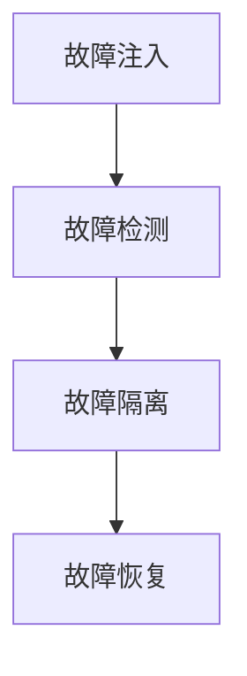

                 

# 故障演练：提升AI系统韧性的有效方法

关键词：故障演练，AI系统，韧性，故障注入，测试方法

摘要：本文将探讨故障演练在提升人工智能系统韧性方面的有效方法。通过详细介绍故障演练的核心概念、设计策略、实施技巧和分析结果，并结合实际案例，我们将揭示如何通过故障演练提高AI系统的可靠性和稳定性。

## 引言

随着人工智能（AI）技术的飞速发展，AI系统在各个领域的应用越来越广泛。然而，AI系统的复杂性和不确定性使得它们在面临异常情况时容易出现故障，从而影响其可靠性和稳定性。为了解决这一问题，故障演练作为一种有效的测试方法，可以帮助我们发现并解决潜在的问题，提升AI系统的韧性。

本文将从以下几个方面展开讨论：

1. 故障演练的基本概念和重要性
2. 故障演练的核心概念和类型
3. 故障演练的设计策略和实施技巧
4. 故障演练结果的分析与改进
5. 故障演练在AI系统中的应用案例

通过本文的探讨，我们将了解故障演练在提升AI系统韧性方面的重要作用，并为实际应用提供有益的指导。

## 1. 故障演练的基本概念和重要性

### 1.1 故障演练的定义和特点

故障演练（Fault Injection）是一种通过故意引入故障来测试系统韧性和稳定性的方法。它旨在模拟实际操作中可能出现的各种故障场景，以评估系统的应对能力和恢复能力。故障演练的特点包括：

- 故障的故意引入：通过手动或自动方式，在系统中故意引入故障。
- 故障类型的多样性：涵盖硬件故障、软件故障、网络故障等多种类型。
- 环境的模拟性：尽量模拟真实环境，以便更准确地评估系统的性能。

### 1.2 故障演练在AI系统中的重要性

AI系统通常具有高度复杂性和不确定性，这使得它们在面对异常情况时容易出现故障。故障演练在AI系统中的重要性体现在以下几个方面：

- **提高系统可靠性**：通过故障演练，可以发现并解决潜在的问题，从而提高AI系统的可靠性。
- **提升系统稳定性**：故障演练可以帮助评估系统在面对异常情况时的稳定性，确保系统在遇到故障时能够保持正常运行。
- **优化系统性能**：通过故障演练，可以识别系统性能瓶颈，并进行优化，以提高整体性能。
- **降低风险**：故障演练可以提前发现并解决潜在的风险，降低系统在实际运行中发生故障的概率。

### 1.3 故障演练的边界和范围

虽然故障演练在提升AI系统韧性方面具有重要意义，但其在实际应用中也存在一定的边界和范围。以下是一些需要考虑的因素：

- **故障类型和范围**：故障演练需要根据具体系统特点和需求选择合适的故障类型和范围，以确保演练的有效性。
- **测试环境和工具**：故障演练需要具备相应的测试环境和工具，以便准确模拟故障场景。
- **安全性和合规性**：在故障演练过程中，需要确保系统的安全性和合规性，避免对系统造成不可逆的损害。

## 2. 故障演练的核心概念和类型

### 2.1 故障演练的核心概念

故障演练的核心概念包括故障注入、故障检测、故障隔离和故障恢复。这些概念共同构成了故障演练的基本框架，如图所示：

#### 故障注入

故障注入是故障演练的第一步，即通过手动或自动方式，在系统中引入故障。故障注入的方式包括：

- 手动注入：由测试人员手动触发故障，例如断开网络连接、关闭服务器等。
- 自动注入：通过脚本或工具自动执行故障注入，例如使用自动化测试工具模拟硬件故障。

#### 故障检测

故障检测是指在系统中检测到故障的存在。故障检测的方法包括：

- 基于日志的检测：通过分析系统日志，检测故障的发生和影响。
- 基于性能指标的检测：通过监测系统性能指标，如响应时间、吞吐量等，检测故障的存在。

#### 故障隔离

故障隔离是指确定故障的具体位置和原因。故障隔离的方法包括：

- 故障定位：通过逐步缩小故障范围，确定故障的具体位置。
- 原因分析：通过对系统日志、性能指标等数据进行分析，确定故障的原因。

#### 故障恢复

故障恢复是指解决故障并使系统恢复正常运行。故障恢复的方法包括：

- 故障修复：对故障进行修复，恢复系统的正常运行。
- 故障切换：在故障无法立即修复的情况下，切换到备用系统或组件，确保系统的持续运行。

### 2.2 故障演练的类型

故障演练可以根据不同的维度进行分类，常见的类型包括：

- **按故障类型分类**：根据故障类型的不同，故障演练可以分为硬件故障演练、软件故障演练、网络故障演练等。
- **按测试阶段分类**：根据测试阶段的差异，故障演练可以分为开发阶段演练、测试阶段演练、上线前演练等。
- **按目标分类**：根据演练的目标不同，故障演练可以分为性能测试、稳定性测试、安全性测试等。

每种类型的故障演练都有其特定的应用场景和优势，需要根据具体需求进行选择。

## 3. 故障演练的设计策略和实施技巧

### 3.1 设计故障演练策略

设计故障演练策略是确保故障演练顺利进行的关键步骤。以下是一些设计故障演练策略的要点：

- **确定演练目标**：明确故障演练的目标，如提高系统可靠性、稳定性等。
- **选择合适的故障类型**：根据系统特点和需求，选择合适的故障类型。
- **规划演练步骤**：制定详细的演练步骤，包括故障注入、故障检测、故障隔离和故障恢复等。
- **制定应急预案**：为应对可能出现的故障，制定应急预案，确保演练过程中能够迅速应对。

### 3.2 实施故障演练技巧

实施故障演练需要掌握一定的技巧，以下是一些实施故障演练的技巧：

- **选择合适的工具**：使用合适的工具可以提高故障演练的效率和准确性，如自动化测试工具、故障注入工具等。
- **模拟真实环境**：尽量模拟真实环境，以便更准确地评估系统的性能和稳定性。
- **逐步扩大故障范围**：在故障演练过程中，逐步扩大故障范围，以便全面评估系统的性能和恢复能力。
- **记录和总结**：详细记录故障演练的过程和结果，并总结经验教训，为后续演练提供参考。

## 4. 故障演练结果的分析与改进

### 4.1 故障演练结果分析

故障演练结果分析是评估故障演练效果的重要环节。以下是一些故障演练结果分析的要点：

- **故障类型和频率**：分析故障类型和故障频率，了解系统的薄弱环节。
- **故障影响范围**：评估故障对系统的影响范围，包括对业务、用户等的影响。
- **故障处理时间**：分析故障处理时间，了解系统的恢复速度。
- **故障恢复效果**：评估故障恢复效果，包括系统性能、稳定性等方面的恢复情况。

### 4.2 提高AI系统韧性

通过故障演练结果分析，可以识别系统的薄弱环节，并采取相应的措施提高AI系统的韧性。以下是一些提高AI系统韧性的方法：

- **优化系统架构**：根据故障演练结果，对系统架构进行优化，提高系统的可靠性和稳定性。
- **加强监控和预警**：加强系统监控和预警，提前发现潜在故障，减少故障对系统的影响。
- **提高人员培训**：提高相关人员的故障处理能力，确保在故障发生时能够迅速应对。
- **完善应急预案**：完善应急预案，确保在故障发生时能够迅速启动并执行。

## 5. 故障演练在AI系统中的应用案例

### 5.1 应用案例1：自动驾驶系统故障演练

自动驾驶系统是AI系统的一个典型应用案例。通过故障演练，可以评估自动驾驶系统在面对各种故障情况时的表现。以下是一个具体的应用案例：

**案例描述**：在某次故障演练中，测试人员模拟了自动驾驶系统中的网络故障，以评估系统在失去网络连接时的表现。

**演练过程**：测试人员通过模拟网络故障，使自动驾驶系统失去网络连接。在故障发生时，系统自动切换到备用模式，并通过本地数据进行导航和避障。

**演练结果**：故障演练结果显示，自动驾驶系统在失去网络连接时，能够保持稳定运行，并通过本地数据进行导航和避障，达到了预期的效果。

**经验教训**：通过本次故障演练，测试团队发现了自动驾驶系统在网络故障情况下的性能瓶颈，并针对这些瓶颈进行了优化，提高了系统的韧性。

## 结论

故障演练是一种有效的测试方法，可以帮助我们提高AI系统的可靠性和稳定性。通过本文的探讨，我们了解了故障演练的核心概念、设计策略、实施技巧和分析方法，并分析了故障演练在AI系统中的应用案例。在实际应用中，故障演练可以帮助我们发现并解决潜在的问题，提高AI系统的韧性，确保系统的稳定运行。

### 作者信息

作者：AI天才研究院/AI Genius Institute & 禅与计算机程序设计艺术 /Zen And The Art of Computer Programming

---

通过以上内容，本文旨在为读者提供关于故障演练在提升AI系统韧性方面的全面理解。希望本文能够对AI领域的技术人员和研究者在实际工作中有所启发和帮助。在未来的研究中，我们还将继续深入探讨故障演练在AI系统中的应用，为推动AI技术的发展做出贡献。感谢您的阅读，期待与您共同探讨更多技术话题。

