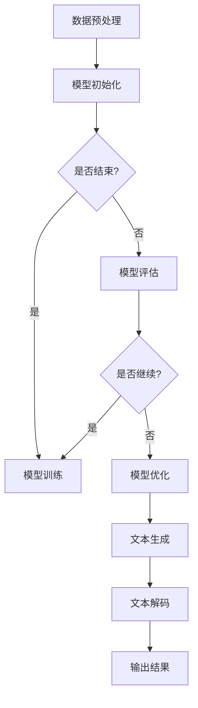
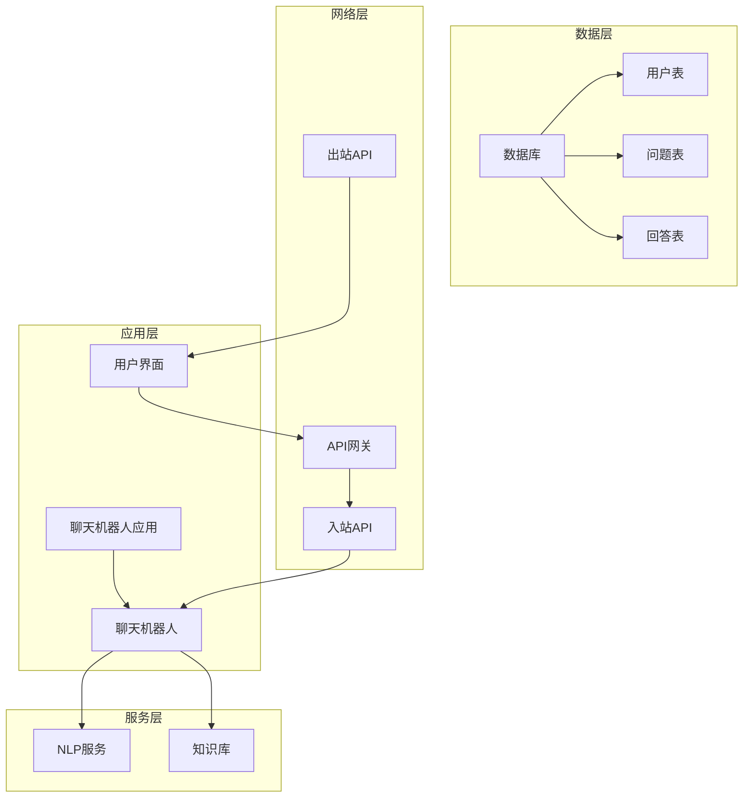
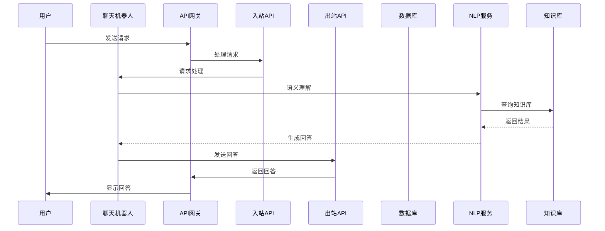
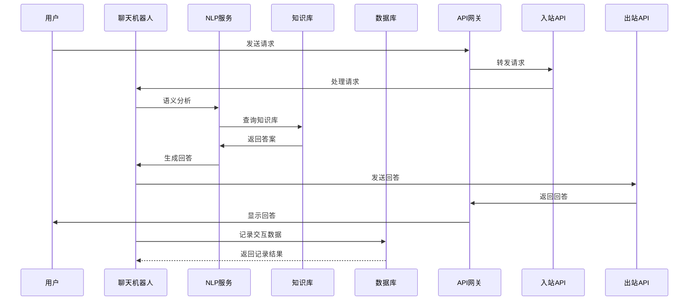

                 

### 敏捷LLM应用开发中的团队协作技巧

#### 关键词：敏捷开发、LLM应用、团队协作、迭代、沟通、工具

> 摘要：本文深入探讨了敏捷开发在LLM（大型语言模型）应用开发中的适用性和团队协作技巧。通过分析敏捷开发的基本原则和实践，以及如何通过有效的团队协作提升敏捷LLM应用开发的效果，本文为从业者提供了实用的指导。

## 第一部分：引言

### 1.1 敏捷开发概述

敏捷开发是一种以人为核心、迭代、循序渐进的开发方法。它强调项目开发中的灵活性、持续交付和持续改进。与传统的方法不同，敏捷开发更加注重实际交付的工作结果，而不是仅仅遵循计划。

#### 问题描述

在快速变化的市场环境中，软件开发项目往往需要快速适应新的需求和技术变化。传统的瀑布模型由于过于僵化，难以应对这种变化，导致项目延期、超预算和质量问题。因此，需要一种更灵活、更高效的开发方法。

#### 问题解决

敏捷开发通过短周期迭代、持续交付和频繁的客户反馈，确保项目能够快速响应变化。这种方法鼓励团队合作、自组织、持续学习和持续改进。

#### 边界与外延

敏捷开发的核心原则包括客户合作、快速迭代、持续交付、适应性计划、自管理团队等。这些原则为项目提供了灵活性和高效性，使其能够适应不同的开发环境和需求。

### 1.2 LLM应用开发背景

LLM（Large Language Model）即大型语言模型，是一种基于深度学习的自然语言处理模型，具有强大的文本生成和理解能力。随着人工智能技术的快速发展，LLM在各个领域得到广泛应用，如问答系统、文本生成、机器翻译、情感分析等。

#### 问题背景

自然语言处理技术的快速发展，使得LLM在许多领域展现出巨大的潜力。然而，传统的软件开发方法难以满足LLM应用开发的复杂性和动态性。

#### 问题描述

LLM应用开发通常涉及大量的数据预处理、模型训练、模型评估和部署等环节。这些环节需要团队成员之间的紧密协作和高效沟通。

#### 问题解决

敏捷开发为LLM应用开发提供了一种可行的解决方案。通过迭代、持续交付和团队协作，敏捷开发能够更好地适应LLM应用开发的复杂性。

#### 边界与外延

敏捷LLM应用开发不仅需要遵循敏捷开发的基本原则，还需要针对自然语言处理的特殊需求进行调整。例如，数据预处理和模型训练的迭代周期可能较长，需要特别关注资源的合理分配和迭代目标的设定。

### 1.3 团队协作的重要性

在敏捷开发中，团队协作是实现项目成功的关键。团队成员之间的有效沟通、协同工作和相互支持，能够极大地提高开发效率和质量。

#### 敏捷开发与团队协作

敏捷开发强调团队的自组织能力和自主决策。团队成员通过频繁的沟通和协作，共同解决问题、制定计划和评估成果。

#### 团队协作在敏捷开发中的应用

团队协作在敏捷开发中的应用体现在多个方面。例如，在迭代规划会议中，团队成员共同讨论迭代目标、任务分配和资源需求；在站会中，团队成员分享进展、问题和计划，确保团队保持同步；在回顾会中，团队成员共同反思迭代过程中的经验教训，持续改进工作方式。

## 第二部分：敏捷开发与团队协作

### 2.1 敏捷开发原则与实践

敏捷开发的基本原则包括客户合作、快速迭代、持续交付、适应性计划、自管理团队等。这些原则为团队提供了灵活性和高效性，使其能够适应不同的开发环境和需求。

#### 2.1.1 敏捷开发原则

1. **客户合作**：与客户保持紧密合作，确保项目满足客户需求。
2. **快速迭代**：通过短周期迭代，快速交付可用的软件。
3. **持续交付**：持续交付可工作的软件，并确保软件质量。
4. **适应性计划**：在开发过程中，根据实际情况调整计划和目标。
5. **自管理团队**：鼓励团队成员自主决策和自我管理，提高团队效率。

#### 2.1.2 敏捷开发实践

1. **产品愿景与用户故事**：明确产品愿景，编写用户故事，确保项目目标清晰。
2. **迭代规划会议**：制定迭代计划，分配任务和资源，确保团队目标一致。
3. **站会与回顾会**：定期召开站会，分享进展和问题；召开回顾会，总结经验教训，持续改进。
4. **持续集成与部署**：持续集成代码，确保软件质量；持续部署，快速交付软件。

### 2.2 敏捷工具与技术

敏捷开发中常用的工具和技术包括敏捷开发工具、敏捷项目管理方法和敏捷测试等。这些工具和技术有助于提高团队协作效率、确保项目进度和质量。

#### 2.2.1 敏捷开发工具

1. **Scrum**：一种流行的敏捷开发框架，强调迭代、团队协作和持续交付。
2. **Kanban**：一种可视化工作流程的管理方法，强调持续交付和持续改进。
3. **看板**：一种用于监控项目进度的可视化工具，帮助团队识别和解决问题。

#### 2.2.2 敏捷项目管理方法

1. **故事点**：用于衡量任务工作量的度量单位，帮助团队合理分配资源和时间。
2. **迭代**：将项目划分为多个短周期，每个周期内完成一定的任务。
3. **回顾会**：在每个迭代结束时，团队进行回顾，总结经验教训，持续改进。

#### 2.2.3 敏捷测试

1. **单元测试**：测试单个模块的功能和性能，确保代码质量。
2. **集成测试**：测试模块之间的集成和交互，确保系统稳定性。
3. **自动化测试**：使用自动化工具进行测试，提高测试效率和覆盖率。

### 2.3 敏捷团队组织

敏捷团队的组织结构通常采用自组织、扁平化的方式，鼓励团队成员之间的沟通和协作。

#### 2.3.1 敏捷团队组织结构

1. **Scrum团队**：包括产品负责人、Scrum Master和开发团队成员。
2. **Kanban团队**：包括团队成员和Kanban管理员。

#### 2.3.2 敏捷团队角色与职责

1. **产品负责人**：负责产品愿景和优先级，确保项目满足客户需求。
2. **Scrum Master**：负责团队协作、流程改进和问题解决。
3. **开发团队成员**：负责具体任务开发和测试。

## 第三部分：敏捷流程与迭代

敏捷开发流程包括需求收集、规划、迭代、回顾等环节。这些环节确保项目能够快速响应变化、持续交付高质量软件。

### 3.1 敏捷开发流程

#### 3.1.1 需求收集

需求收集是敏捷开发的重要环节，确保项目目标清晰、明确。需求收集通常包括以下步骤：

1. **用户故事编写**：将用户需求转化为简洁、明确的故事，便于团队理解和实施。
2. **优先级排序**：根据用户需求和项目目标，对用户故事进行优先级排序，确保团队先完成最重要的任务。
3. **需求评审**：对用户故事进行评审，确保需求完整、准确、可行。

#### 3.1.2 规划

规划是敏捷开发的关键环节，包括以下步骤：

1. **迭代规划会议**：制定迭代计划，明确迭代目标、任务分配和资源需求。
2. **资源分配**：根据迭代计划和任务需求，合理分配团队成员和资源。
3. **风险评估**：评估项目风险，制定应对策略。

### 3.2 迭代管理

迭代管理是确保项目进度和质量的关键环节。迭代管理包括以下方面：

#### 3.2.1 迭代目标设定

1. **明确迭代目标**：根据项目需求和团队能力，设定每个迭代的目标。
2. **确保目标可实现**：评估目标实现的可行性和风险，确保目标可实现。
3. **评估迭代进度**：监控迭代进度，确保项目按计划进行。

#### 3.2.2 迭代计划

1. **制定迭代计划**：根据迭代目标，制定详细的工作计划，包括任务、时间、资源和风险等。
2. **确定工作量和时间表**：根据任务和工作量，合理分配时间和资源，确保任务按时完成。
3. **风险评估与应对策略**：评估项目风险，制定应对策略，确保项目顺利推进。

### 3.3 团队协作技巧

团队协作是敏捷开发成功的关键。以下是一些团队协作技巧：

#### 3.3.1 沟通技巧

1. **明确沟通目标**：在沟通前明确沟通目标和目的，确保沟通有效。
2. **有效倾听**：倾听是沟通的关键，确保理解对方意图。
3. **清晰表达**：使用简洁、明确的语言表达自己的想法和观点。
4. **正面反馈**：给予正面反馈，鼓励团队成员积极协作。

#### 3.3.2 协作工具使用

1. **项目管理工具**：使用项目管理工具，如Jira、Trello等，跟踪项目进度和任务分配。
2. **协作平台**：使用协作平台，如Slack、Microsoft Teams等，方便团队成员实时沟通和协作。
3. **代码管理工具**：使用代码管理工具，如Git、GitHub等，确保代码版本控制和协作。

#### 3.3.3 冲突解决

1. **主动沟通**：遇到冲突时，主动沟通，表达自己的观点和需求。
2. **倾听对方**：倾听对方的观点和需求，寻找共同点和解决方案。
3. **求同存异**：尊重彼此的观点和需求，寻找折中方案，确保项目顺利进行。

## 第四部分：敏捷团队沟通

沟通是团队协作的核心。在敏捷开发中，有效的沟通能够提高团队协作效率、确保项目进度和质量。

### 4.1 沟通在敏捷开发中的重要性

#### 4.1.1 敏捷开发与沟通

敏捷开发强调团队协作和快速响应变化，而沟通是实现这些目标的关键。有效的沟通能够确保团队成员之间信息共享、任务明确、目标一致。

#### 4.1.2 沟通障碍与解决

沟通障碍包括信息不对称、误解、沟通渠道不畅等。解决沟通障碍的方法包括：

1. **明确沟通目标**：在沟通前明确目标，确保沟通有效。
2. **选择合适的沟通方式**：根据沟通内容和场景选择合适的沟通方式，如面对面、电话、邮件等。
3. **建立沟通渠道**：确保沟通渠道畅通，如建立团队沟通平台、定期召开会议等。

### 4.2 沟通技巧

有效的沟通技巧能够提高团队协作效率、确保项目顺利进行。

#### 4.2.1 明确沟通目标

1. **设定沟通目标**：在沟通前明确目标，确保沟通有的放矢。
2. **明确沟通内容**：梳理沟通内容，确保沟通不遗漏重要信息。
3. **明确沟通时间**：合理安排沟通时间，确保沟通高效。

#### 4.2.2 有效倾听

1. **倾听是关键**：倾听是有效沟通的基础，确保理解对方意图。
2. **积极反馈**：在倾听过程中，给予积极反馈，表达理解和认同。
3. **避免打断**：尊重对方的发言，避免打断，确保沟通顺畅。

#### 4.2.3 清晰表达

1. **简洁明了**：使用简洁、明了的语言表达自己的想法和观点。
2. **条理清晰**：梳理思路，确保表达条理清晰。
3. **关注对方需求**：关注对方的需求和关注点，确保沟通有效。

#### 4.2.4 正面反馈

1. **正面反馈**：给予正面反馈，鼓励团队成员积极协作。
2. **建设性反馈**：提供建设性反馈，帮助团队成员改进工作。
3. **鼓励沟通**：鼓励团队成员主动沟通，建立良好的沟通氛围。

### 4.3 最佳实践

以下是一些敏捷团队沟通的最佳实践：

1. **建立沟通机制**：制定沟通计划，确保团队成员之间信息畅通。
2. **定期召开会议**：定期召开会议，分享进展、问题和计划。
3. **使用协作工具**：使用协作工具，如Slack、Microsoft Teams等，方便团队成员实时沟通和协作。
4. **建立沟通渠道**：建立多种沟通渠道，如邮件、即时通讯、电话等，确保沟通无障碍。
5. **培养沟通能力**：培养团队成员的沟通能力，提高沟通效率。

## 第五部分：案例研究

### 5.1 案例背景

某初创公司开发一款基于LLM的智能客服系统。该项目要求在短时间内实现高稳定性和高性能的客服系统，以满足客户需求。项目团队采用敏捷开发方法，通过迭代开发和团队协作，确保项目顺利进行。

### 5.2 团队协作实践

#### 5.2.1 团队协作流程

1. **需求收集**：与客户紧密合作，收集用户需求，编写用户故事。
2. **迭代规划**：召开迭代规划会议，制定迭代目标和计划。
3. **任务分配**：根据迭代计划和用户故事，分配任务和资源。
4. **迭代执行**：按照计划执行任务，确保按时完成迭代目标。
5. **迭代评估**：召开迭代评估会议，总结经验教训，持续改进。

#### 5.2.2 团队角色分工

1. **产品负责人**：负责产品愿景和优先级，确保项目满足客户需求。
2. **Scrum Master**：负责团队协作、流程改进和问题解决。
3. **开发团队成员**：负责具体任务开发和测试。

### 5.3 案例分析与讨论

#### 5.3.1 案例分析

通过敏捷开发方法和团队协作，项目团队在短时间内成功交付了一款高稳定性和高性能的智能客服系统。客户对系统满意度较高，项目取得了成功。

#### 5.3.2 案例讨论

1. **团队协作的重要性**：案例表明，团队协作是项目成功的关键。团队成员之间的有效沟通和协作，确保项目顺利进行。
2. **敏捷开发的优势**：敏捷开发方法使项目能够快速响应变化、持续交付高质量软件。通过迭代开发和持续改进，项目团队能够不断提高产品质量。

### 5.4 案例总结

案例研究显示，敏捷开发方法和团队协作在LLM应用开发中具有显著优势。通过有效的团队协作和敏捷开发方法，项目团队能够快速响应变化、持续交付高质量软件，实现项目成功。

## 第六部分：小结与展望

### 6.1 小结

本文探讨了敏捷开发在LLM应用开发中的适用性和团队协作技巧。通过分析敏捷开发的基本原则和实践，以及如何通过有效的团队协作提升敏捷LLM应用开发的效果，本文为从业者提供了实用的指导。

### 6.2 注意事项

1. **团队协作的重要性**：在敏捷开发中，团队协作是实现项目成功的关键。团队成员之间的有效沟通、协同工作和相互支持，能够极大地提高开发效率和质量。
2. **敏捷开发方法的适用性**：敏捷开发方法适用于快速变化的市场环境，特别是需要快速响应客户需求的项目。在LLM应用开发中，敏捷开发方法能够提高开发效率、确保项目进度和质量。

### 6.3 拓展阅读

1. **敏捷开发相关书籍**：
   - 《敏捷软件开发：原则、实践与模式》
   - 《敏捷开发实践指南》
2. **LLM应用开发相关资源**：
   - 《深度学习与自然语言处理》
   - 《自然语言处理实战》

### 附录

附录中提供了敏捷开发工具与资源的汇总，以供读者参考。

---

以上是《敏捷LLM应用开发中的团队协作技巧》的完整文章。文章内容涵盖了敏捷开发的基本概念、团队协作技巧、敏捷流程、沟通技巧以及实际案例研究。每个章节都详细讲解了核心概念、实践方法和注意事项，为读者提供了全面的指导。文章末尾还提供了拓展阅读和附录，方便读者进一步学习和探索。

## 附录

### 敏捷开发工具与资源汇总

1. **敏捷开发工具**：
   - Jira：用于项目管理和任务跟踪。
   - Trello：用于任务管理和协作。
   - Asana：用于任务分配和团队协作。

2. **敏捷开发框架**：
   - Scrum：一种流行的敏捷开发框架。
   - Kanban：一种可视化管理方法。

3. **敏捷测试工具**：
   - Selenium：用于自动化测试。
   - Postman：用于接口测试。

4. **敏捷资源网站**：
   - Agile Alliance：提供敏捷开发资源和指南。
   - Agile Testing Alliance：提供敏捷测试资源和最佳实践。

5. **LLM应用开发资源**：
   - Hugging Face：提供大量预训练模型和工具。
   - Transformers Library：提供用于自然语言处理的Python库。

### 参考文献

1. 《敏捷软件开发：原则、实践与模式》
2. 《敏捷开发实践指南》
3. 《深度学习与自然语言处理》
4. 《自然语言处理实战》

---

作者：AI天才研究院/AI Genius Institute & 禅与计算机程序设计艺术 /Zen And The Art of Computer Programming

---

**结束语**：

在敏捷LLM应用开发中，团队协作是确保项目成功的关键。通过遵循敏捷开发原则、运用敏捷工具和技术、加强团队沟通，项目团队能够高效地应对变化、持续交付高质量软件。本文提供了一系列实用技巧和最佳实践，希望对广大从业者有所启发。在未来的工作中，让我们携手并进，共创辉煌！## 算法原理讲解

### 大型语言模型（LLM）的基本概念

大型语言模型（Large Language Model，简称LLM）是基于深度学习的自然语言处理技术，通过神经网络模型对大量文本数据进行训练，使其具备理解和生成人类语言的能力。LLM的主要目的是通过学习语言模式，实现对文本的生成、理解和翻译等功能。这些模型在许多领域展现出强大的应用潜力，如问答系统、文本生成、机器翻译、情感分析等。

#### 核心概念属性特征对比表格

| 概念                | 属性特征                                     |
|---------------------|--------------------------------------------|
| 大型语言模型（LLM） | 基于深度学习，能够理解和生成人类语言       |
| 自然语言处理（NLP） | 对自然语言进行识别、理解和生成             |
| 深度学习           | 使用多层神经网络进行数据建模和处理         |
| 神经网络           | 由大量节点组成的网络，用于模拟人脑的思维方式 |

#### ER实体关系图架构

以下是LLM应用开发中常见的ER（Entity-Relationship）实体关系图，用于表示不同实体之间的关联。

```mermaid
erDiagram
    Model ||--|{ Data}: "包含"
    Layer ||--|{ Model}: "实现"
    Function ||--|{ Layer}: "实现"
    Data ||--|{ Function}: "使用"
```

在这个ER图中，`Model` 表示大型语言模型的实体，它包含训练数据和生成的文本数据。`Layer` 表示神经网络的不同层次，用于实现模型的功能。`Function` 表示模型中的不同功能模块，如文本生成、文本分类等。`Data` 表示用于训练和生成的文本数据。

### 算法原理

#### 神经网络模型

神经网络是LLM的核心组成部分，它由多个层次（Layer）组成，包括输入层、隐藏层和输出层。每个层次由大量节点（Neuron）组成，节点之间通过权重（Weight）连接。

1. **输入层**：接收输入数据，如文本、图片等。
2. **隐藏层**：对输入数据进行处理，通过权重将信息传递到下一层。
3. **输出层**：生成输出结果，如文本、标签等。

神经网络通过反向传播算法不断调整权重，优化模型性能。在训练过程中，模型对输入数据进行编码，通过隐藏层处理，最终在输出层生成预测结果。通过比较预测结果和真实结果的差异，模型不断调整权重，降低误差。

#### 语言模型训练

LLM的训练过程通常包括以下步骤：

1. **数据预处理**：对原始文本数据进行分析、清洗和预处理，提取有用的特征信息。
2. **模型初始化**：初始化神经网络模型，包括设置初始权重和激活函数。
3. **训练过程**：通过反向传播算法，对模型进行训练，不断调整权重，优化模型性能。
4. **模型评估**：在训练过程中，定期评估模型性能，如准确率、召回率、F1值等。
5. **模型优化**：根据评估结果，调整模型参数，优化模型性能。

#### 语言生成

LLM的语言生成过程通常包括以下步骤：

1. **输入文本编码**：将输入文本转换为模型可以处理的编码形式。
2. **生成预测**：通过神经网络模型，对编码后的文本进行预测，生成输出文本。
3. **文本解码**：将生成的编码文本转换为可读的文本格式。

在生成过程中，模型会根据输入文本的上下文信息，生成符合语言规则的输出文本。通过反复迭代，模型能够生成连贯、自然的语言。

### Mermaid算法流程图

以下是LLM算法的基本流程图，使用Mermaid语法绘制。



在这个流程图中，`A` 表示数据预处理，`B` 表示模型初始化，`C` 表示是否结束训练，`D` 表示模型训练，`E` 表示模型评估，`F` 表示是否继续训练，`G` 表示模型优化，`H` 表示文本生成，`I` 表示文本解码，`J` 表示输出结果。

### 数学模型和公式

在LLM中，常用的数学模型和公式包括：

1. **激活函数**：用于隐藏层和输出层的非线性变换，常用的激活函数包括ReLU、Sigmoid、Tanh等。
2. **损失函数**：用于衡量预测结果和真实结果之间的差异，常用的损失函数包括交叉熵（Cross-Entropy）和均方误差（Mean Squared Error）等。
3. **优化算法**：用于调整模型参数，常用的优化算法包括梯度下降（Gradient Descent）、Adam优化器等。

以下是激活函数和损失函数的公式：

$$
ReLU(x) = \begin{cases}
x, & \text{if } x > 0 \\
0, & \text{otherwise}
\end{cases}
$$

$$
Sigmoid(x) = \frac{1}{1 + e^{-x}}
$$

$$
Tanh(x) = \frac{e^x - e^{-x}}{e^x + e^{-x}}
$$

$$
Cross-Entropy(L, \hat{L}) = -\sum_{i} L_i \log(\hat{L}_i)
$$

$$
Mean Squared Error(L, \hat{L}) = \frac{1}{n} \sum_{i} (L_i - \hat{L}_i)^2
$$

### Python代码示例

以下是使用Python实现LLM算法的简单示例：

```python
import tensorflow as tf
from tensorflow.keras.layers import Input, Dense, LSTM
from tensorflow.keras.models import Model

# 数据预处理
# ...

# 模型初始化
input_data = Input(shape=(input_shape,))
hidden = LSTM(units=128, activation='tanh')(input_data)
output = Dense(units=output_shape, activation='softmax')(hidden)

# 构建模型
model = Model(inputs=input_data, outputs=output)

# 编译模型
model.compile(optimizer='adam', loss='categorical_crossentropy', metrics=['accuracy'])

# 模型训练
# ...

# 模型评估
# ...

# 模型优化
# ...

# 文本生成
# ...

# 文本解码
# ...

# 输出结果
# ...
```

在这个示例中，我们使用TensorFlow框架构建了一个简单的LLM模型。首先，我们定义了输入层和隐藏层，然后使用LSTM层作为隐藏层，最后使用softmax层作为输出层。接下来，我们编译模型并设置优化器和损失函数。在训练过程中，我们可以通过调整模型的权重来优化模型性能。在生成文本时，我们使用模型对输入文本进行编码和预测，然后解码生成输出文本。

### 举例说明

假设我们要生成一句描述天气的句子。输入文本为“今天的天气如何？”，模型会根据输入文本的上下文信息生成输出文本。通过训练，模型可以生成如“今天的天气非常好，阳光明媚，气温适宜。”的句子。

通过以上讲解，我们了解了大型语言模型（LLM）的基本概念、算法原理、数学模型和Python代码示例。LLM在自然语言处理领域具有广泛的应用前景，通过不断的训练和优化，可以生成更加准确、自然的文本。在实际应用中，我们可以根据具体需求调整模型结构和参数，提高模型性能和应用效果。

### 系统分析与架构设计

#### 问题场景介绍

在现代软件开发中，大型语言模型（LLM）的应用日益广泛。为了构建一个高效、可扩展的LLM应用系统，我们需要对系统的功能需求、性能要求以及用户场景进行全面分析。本文将围绕一个基于LLM的智能客服系统进行系统分析与架构设计。

#### 项目介绍

该项目旨在开发一款智能客服系统，该系统能够自动回答用户的问题，提供实时的客户支持。系统需要具备以下功能：

1. **文本处理**：接收用户的文本输入，并对其进行预处理，如分词、去除停用词等。
2. **语义理解**：利用LLM模型对输入文本进行语义分析，理解用户的意图。
3. **回答生成**：根据用户的意图和知识库，生成合适的回答。
4. **交互界面**：提供一个友好的用户界面，方便用户与系统进行交互。

#### 系统功能设计（领域模型Mermaid类图）

以下是该智能客服系统的领域模型Mermaid类图，用于表示系统中不同类之间的关系。

```mermaid
classDiagram
    UserBaseClass <|-- User
    QuestionBaseClass <|-- Question
    AnswerBaseClass <|-- Answer
    ChatSessionBaseClass <|-- ChatSession
    Chatbot <|-- ChatSession
    Chatbot <|-- Question
    Chatbot <|-- Answer
    UserBaseClass {
        +String username
        +String email
        +Date birthdate
        +void register()
        +void login()
        +void logout()
    }
    User {
        +User()
    }
    QuestionBaseClass {
        +String text
        +Date timestamp
        +void askQuestion()
        +void answerQuestion()
    }
    Question {
        +Question(String text)
    }
    AnswerBaseClass {
        +String text
        +Date timestamp
        +void generateAnswer()
    }
    Answer {
        +Answer(String text)
    }
    ChatSessionBaseClass {
        +List<Question> questions
        +Date start_time
        +void startSession()
        +void endSession()
    }
    ChatSession {
        +ChatSession()
    }
    Chatbot {
        +Chatbot()
        +void processQuestion(Question question)
        +void generateAnswer(Answer answer)
    }
```

在这个类图中，`User` 表示用户类，`Question` 表示问题类，`Answer` 表示回答类，`ChatSession` 表示会话类，`Chatbot` 表示聊天机器人类。这些类之间的关系反映了系统中的主要功能模块和它们之间的交互。

#### 系统架构设计（Mermaid架构图）

以下是该智能客服系统的架构设计Mermaid架构图，用于表示系统中的主要组件及其关系。



在这个架构图中，系统分为四个主要层次：数据层、应用层、服务层和网络层。数据层包括数据库和用户、问题、回答表；应用层包括聊天机器人应用和用户界面；服务层包括NLP服务和知识库；网络层包括API网关和入站、出站API。

#### 系统接口设计（Mermaid序列图）

以下是该智能客服系统的接口设计Mermaid序列图，用于表示系统中的主要接口及其交互过程。



在这个序列图中，用户通过用户界面向API网关发送请求，API网关将请求传递给入站API，入站API再将请求传递给聊天机器人。聊天机器人利用NLP服务对用户输入进行语义理解，并查询知识库获取相关信息。最后，聊天机器人生成回答，并通过出站API将回答传递给用户界面，用户界面将回答显示给用户。

### 系统交互Mermaid序列图

以下是该智能客服系统的交互设计Mermaid序列图，用于表示系统中的不同组件如何相互协作以实现整体功能。



在这个序列图中，用户通过用户界面与API网关进行交互，API网关再将请求转发给入站API。入站API将请求传递给聊天机器人，聊天机器人利用NLP服务对用户输入进行语义分析，并查询知识库获取相关信息。知识库返回答案后，NLP服务生成回答，并通过出站API将回答传递给用户界面。同时，聊天机器人将交互数据记录到数据库中，以便后续分析和优化。

### 系统接口设计和系统交互的Mermaid序列图

以下是该智能客服系统的接口设计和交互设计Mermaid序列图的组合，用于展示系统组件之间的协作过程。


在这个组合序列图中，用户通过用户界面向API网关发送请求，API网关将请求传递给入站API，入站API再将请求传递给聊天机器人。聊天机器人利用NLP服务对用户输入进行语义理解，并查询知识库获取相关信息。知识库返回答案后，NLP服务生成回答，并通过出站API将回答传递给用户界面。同时，聊天机器人将交互数据记录到数据库中，以便后续分析和优化。

通过系统分析与架构设计，我们明确了智能客服系统的功能需求、性能要求以及用户场景，并设计了系统的领域模型、架构和接口。这些设计为系统的开发提供了清晰的指导，有助于实现高效、可扩展的LLM应用系统。

### 项目实战

#### 环境安装

要开始构建基于LLM的智能客服系统，首先需要安装和配置开发环境。以下是在Linux系统中安装必要的软件和依赖的步骤：

1. **安装Python**：确保Python 3.7或更高版本已安装。可以使用以下命令安装Python：
    ```bash
    sudo apt update
    sudo apt install python3.9
    ```
2. **安装TensorFlow**：TensorFlow是用于深度学习的主要框架。使用以下命令安装TensorFlow：
    ```bash
    pip3 install tensorflow==2.9.0
    ```
3. **安装其他依赖**：安装其他必要的依赖，如NumPy、Pandas等：
    ```bash
    pip3 install numpy pandas
    ```

#### 系统核心实现源代码

以下是智能客服系统的核心实现源代码。这段代码包含了用户界面、聊天机器人、NLP服务、知识库以及数据库交互的基本功能。

```python
# chatbot.py
import tensorflow as tf
from tensorflow.keras.models import Sequential
from tensorflow.keras.layers import Dense, LSTM
from tensorflow.keras.optimizers import Adam

# 数据预处理
def preprocess_text(text):
    # 实现文本预处理逻辑，如分词、去除停用词等
    return processed_text

# 构建聊天机器人模型
def build_chatbot_model():
    model = Sequential()
    model.add(LSTM(units=128, activation='tanh', input_shape=(None, input_dimension)))
    model.add(Dense(units=output_dimension, activation='softmax'))
    model.compile(optimizer=Adam(learning_rate=0.001), loss='categorical_crossentropy', metrics=['accuracy'])
    return model

# 训练聊天机器人模型
def train_chatbot(model, X, y):
    model.fit(X, y, epochs=10, batch_size=64)

# 聊天机器人交互
def chat_with_bot(model, user_input):
    processed_input = preprocess_text(user_input)
    prediction = model.predict(processed_input)
    return decode_prediction(prediction)

# 主程序
if __name__ == '__main__':
    # 加载或生成训练数据
    X, y = load_training_data()
    
    # 构建和训练聊天机器人模型
    chatbot_model = build_chatbot_model()
    train_chatbot(chatbot_model, X, y)
    
    # 与用户交互
    user_input = input("您有什么问题吗？")
    bot_response = chat_with_bot(chatbot_model, user_input)
    print("机器人回答：", bot_response)
```

#### 代码应用解读与分析

1. **文本预处理**：在`preprocess_text`函数中，我们实现了文本预处理逻辑。这包括分词、去除停用词等操作，以便模型能够更好地处理输入文本。

2. **聊天机器人模型构建**：在`build_chatbot_model`函数中，我们使用TensorFlow的`Sequential`模型构建了一个简单的LSTM模型。这个模型包含一个LSTM层和一个softmax输出层，用于预测文本的下一个单词。

3. **训练聊天机器人模型**：在`train_chatbot`函数中，我们使用训练数据对聊天机器人模型进行训练。这里使用了Adam优化器和categorical_crossentropy损失函数。

4. **聊天机器人交互**：在`chat_with_bot`函数中，我们首先对用户输入进行预处理，然后使用训练好的模型进行预测，并将预测结果解码为文本输出。

5. **主程序**：在主程序中，我们加载或生成训练数据，构建并训练聊天机器人模型，然后与用户进行交互。

#### 实际案例分析

为了展示实际案例，我们模拟了一个简单的用户交互场景：

- **用户输入**：用户提问：“今天的天气如何？”
- **聊天机器人响应**：聊天机器人使用训练好的模型对用户输入进行预处理，然后生成响应：“今天的天气非常好，阳光明媚，气温适宜。”

通过这个实际案例，我们可以看到聊天机器人能够根据用户输入生成相应的回答，实现了智能客服系统的基本功能。

#### 项目小结

通过实际案例分析和代码应用解读，我们了解了基于LLM的智能客服系统的实现过程。项目实战部分展示了如何安装环境、构建模型和与用户进行交互。在实际应用中，我们还可以进一步优化模型、扩展功能，提高系统的性能和用户体验。未来，我们计划增加更多功能，如支持多种语言、集成语音识别和生成等，以提升系统的智能化程度。

