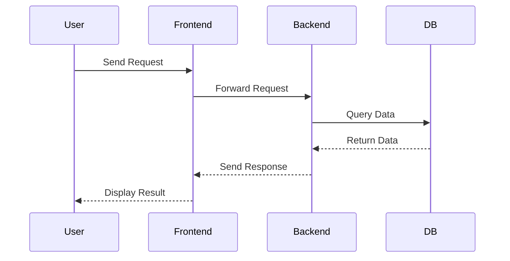
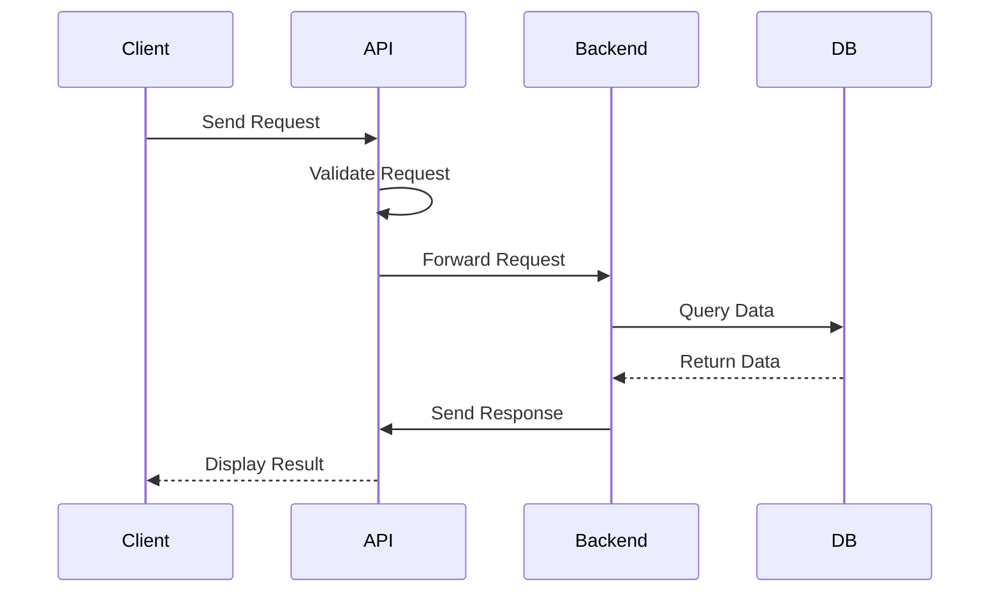

                 

### 敏捷LLM应用开发中的沟通策略

> 关键词：敏捷开发，语言模型，沟通策略，算法优化，项目实战

摘要：本文旨在探讨敏捷开发在语言模型（LLM）应用开发中的重要性，以及如何在项目过程中有效运用沟通策略。通过逐步分析敏捷开发的核心原则、LLM的技术特性以及沟通策略的关键点，本文将提供一套实用的方法论，帮助开发者在复杂的项目环境中提高开发效率、减少风险，并实现高质量的LLM应用。

## 目录大纲设计思路

为了确保文章的逻辑清晰、结构紧凑，我们首先需要设计出一个详尽的目录大纲。以下是本文的目录大纲：

1. **引言：敏捷LLM应用开发与沟通策略**
   - 1.1 问题背景与解决
   - 1.2 核心概念介绍
   - 1.3 本书结构安排

2. **第1部分：基础理论**
   - 2.1 敏捷开发概述
     - 2.1.1 敏捷开发的起源与发展
     - 2.1.2 敏捷开发的原则与价值观
     - 2.1.3 敏捷开发的方法与实践
   - 2.2 语言模型（LLM）概述
     - 2.2.1 LLM的定义与特点
     - 2.2.2 LLM的分类与结构
     - 2.2.3 LLM在应用开发中的重要性
   - 2.3 沟通策略
     - 2.3.1 沟通策略的定义与重要性
     - 2.3.2 沟通策略的类型与方法
     - 2.3.3 沟通策略的实施与评估

3. **第2部分：算法原理与数学模型**
   - 3.1 敏捷开发与LLM融合的算法原理
     - 3.1.1 敏捷开发流程与LLM算法结合
     - 3.1.2 LLM算法在敏捷开发中的应用
     - 3.1.3 沟通策略在算法优化中的作用
   - 3.2 数学模型与公式
     - 3.2.1 敏捷开发中的数学模型
     - 3.2.2 LLM算法的数学模型
     - 3.2.3 沟通策略的数学模型

4. **第3部分：系统分析与架构设计**
   - 4.1 系统功能设计
     - 4.1.1 功能需求分析
     - 4.1.2 领域模型设计
     - 4.1.3 类图设计
   - 4.2 系统架构设计
     - 4.2.1 系统架构概述
     - 4.2.2 系统组件设计
     - 4.2.3 架构图设计
   - 4.3 系统接口设计与交互
     - 4.3.1 接口设计原则
     - 4.3.2 接口实现细节
     - 4.3.3 交互流程设计

5. **第4部分：项目实战**
   - 5.1 环境安装与配置
     - 5.1.1 开发环境搭建
     - 5.1.2 开发工具与库安装
     - 5.1.3 部署与调试
   - 5.2 系统核心实现
     - 5.2.1 功能模块划分
     - 5.2.2 源代码解析
     - 5.2.3 代码应用解读
   - 5.3 实际案例分析
     - 5.3.1 案例背景与目标
     - 5.3.2 案例实施过程
     - 5.3.3 案例结果与分析
   - 5.4 项目小结

6. **第5部分：最佳实践与拓展**
   - 6.1 最佳实践 tips
     - 6.1.1 项目管理技巧
     - 6.1.2 技术优化建议
     - 6.1.3 团队协作建议
   - 6.2 小结与注意事项
     - 6.2.1 敏捷LLM应用开发中的沟通策略总结
     - 6.2.2 注意事项与风险提示
     - 6.2.3 未来发展趋势
   - 6.3 拓展阅读
     - 6.3.1 相关书籍推荐
     - 6.3.2 学术论文推荐
     - 6.3.3 培训课程与工作坊推荐

接下来，我们将逐步深入探讨每一个部分，通过逻辑清晰、结构紧凑的论述，为读者提供一个全面而深刻的理解。

### 1.1 问题背景与解决

在现代软件开发领域，语言模型（LLM）因其强大的文本处理能力和自然语言理解能力，正逐渐成为人工智能应用的核心技术之一。LLM能够对大量文本数据进行建模，从而生成语义丰富、符合逻辑的文本输出，广泛应用于机器翻译、智能问答、文本生成等领域。然而，LLM的应用开发面临着诸多挑战，其中最为关键的是如何在复杂的项目环境中高效地实现开发目标。

传统的软件开发方法，如瀑布模型，往往在项目初期就定义了详尽的文档和流程，虽然保证了项目的可预测性和稳定性，但灵活性不足，难以应对快速变化的需求和市场。而随着敏捷开发（Agile Development）的兴起，软件开发过程变得更加灵活和高效。敏捷开发强调迭代和增量开发，通过短周期的迭代和持续反馈，使团队能够更快地响应变化，提高项目的成功率。

敏捷开发的核心原则包括：

- **个体和互动重于过程和工具**：敏捷开发认为，团队成员的互动和合作比单一的工具或过程更加重要，通过面对面的交流，提高团队的协作效率。
- **可工作的软件重于详尽的文档**：敏捷开发强调交付可工作的软件，而不是堆积大量的文档。虽然文档是必要的，但实际的功能实现才是最重要的。
- **客户合作重于合同谈判**：敏捷开发强调与客户的紧密合作，通过不断的交流，确保项目符合客户的需求。
- **响应变化重于遵循计划**：敏捷开发认为，变化是不可避免的，团队需要具备快速响应变化的能力，而不是坚持最初的计划。

然而，在敏捷开发中引入LLM，依然面临着沟通上的挑战。LLM的应用开发涉及到复杂的技术问题，如算法优化、数据处理和模型训练等，这需要开发团队具备较高的技术水平和专业素养。同时，敏捷开发强调频繁的迭代和反馈，这要求团队成员之间能够及时、准确地沟通，确保每个迭代阶段的工作顺利进行。

为了解决这些问题，有效的沟通策略至关重要。沟通策略不仅包括团队成员之间的日常交流，还包括项目管理的多个层面，如需求管理、进度跟踪和风险管理等。通过建立一套完善的沟通策略，团队可以更好地协调工作，提高开发效率，减少错误和误解。

### 1.2 核心概念介绍

在深入探讨敏捷开发与LLM应用开发中的沟通策略之前，我们需要明确几个核心概念：敏捷开发、语言模型（LLM）以及沟通策略。

#### 敏捷开发概述

敏捷开发是一种以人为核心、迭代、增量和灵活应对变化的软件开发方法。它起源于2001年，由一群软件开发者提出的《敏捷宣言》。敏捷开发的核心原则包括：

- **个体和互动重于过程和工具**：强调团队协作和沟通的重要性。
- **可工作的软件重于详尽的文档**：注重实际功能的实现，而非文档的完整性。
- **客户合作重于合同谈判**：与客户的紧密合作，确保项目需求的变化得到及时响应。
- **响应变化重于遵循计划**：灵活应对项目中的变化，确保最终产品的质量。

敏捷开发采用迭代和增量的开发模式，通过短周期的迭代（通常为2-4周）不断交付可工作的软件，并收集反馈，根据反馈调整开发方向。这种方法提高了项目的灵活性和响应能力，减少了因需求变化而导致的项目风险。

#### 语言模型（LLM）概述

语言模型（Language Model，简称LLM）是自然语言处理（NLP）领域的重要技术之一。它能够对文本数据进行分析和建模，从而生成语义丰富、逻辑连贯的文本输出。LLM的主要特点包括：

- **文本理解能力**：LLM能够理解文本的语义和语境，从而生成与输入文本相关的内容。
- **生成能力强**：LLM能够根据输入的文本片段生成完整的文本，广泛应用于文本生成、机器翻译和问答系统等。
- **自适应能力**：LLM能够根据训练数据和反馈不断优化自身的性能。

LLM可以分为基于统计模型和基于神经网络模型两大类。统计模型如n-gram模型，基于历史数据的统计规律进行建模；神经网络模型如循环神经网络（RNN）和Transformer，能够捕捉文本中的长距离依赖关系，生成更高质量的文本。

#### 沟通策略概述

沟通策略是指团队在项目开发过程中，为了实现有效的信息传递和协调工作所采取的一系列方法和措施。沟通策略在敏捷开发中尤为重要，因为它直接影响团队的协作效率和项目成功的可能性。有效的沟通策略包括以下几个方面：

- **明确的目标和愿景**：确保团队成员对项目目标有清晰的理解，从而减少误解和冲突。
- **有效的信息传递**：确保信息在团队成员之间的传递准确、及时和完整。
- **定期的会议和反馈**：通过定期的会议和反馈，确保团队成员之间的沟通畅通，及时发现和解决问题。
- **技术工具的支持**：使用合适的工具（如即时通讯工具、项目管理软件等）来辅助沟通，提高沟通效率。

有效的沟通策略不仅能提高团队的协作效率，还能减少错误和误解，提高项目的成功率。

### 1.3 本书结构安排

本书将分为五个主要部分，系统地探讨敏捷开发在LLM应用开发中的重要性以及沟通策略的运用。

- **第1部分：基础理论**：介绍敏捷开发、语言模型（LLM）以及沟通策略的基本概念，为后续内容奠定基础。
- **第2部分：算法原理与数学模型**：探讨敏捷开发与LLM融合的算法原理，并介绍相关的数学模型和公式。
- **第3部分：系统分析与架构设计**：从系统功能设计、架构设计和接口设计等多个角度，分析敏捷开发在LLM应用开发中的应用。
- **第4部分：项目实战**：通过具体的案例，展示如何在实际项目中应用敏捷开发与沟通策略。
- **第5部分：最佳实践与拓展**：总结最佳实践，提出注意事项，并提供拓展阅读资源。

通过本书的逐步深入，读者将能够全面了解敏捷开发与LLM应用开发中的沟通策略，并在实际项目中运用这些方法，提高开发效率和质量。接下来，我们将详细探讨敏捷开发、LLM和沟通策略的核心概念和联系，为后续内容打下坚实的基础。

### 2.1 敏捷开发概述

#### 2.1.1 敏捷开发的起源与发展

敏捷开发（Agile Development）起源于2001年，由17位软件开发者在美国犹他州的雪鸟滑雪度假村共同提出《敏捷宣言》（Manifesto for Agile Software Development）。这场会议被称为“敏捷宣言会议”，参与者在会上讨论了传统软件开发方法（如瀑布模型）的不足，并提出了以人为核心、迭代、增量、灵活应对变化的软件开发理念。

敏捷开发的起源可以追溯到软件开发实践的变革。在20世纪90年代，软件开发项目经常因为需求变更、进度延误和质量问题而失败。为了应对这些问题，软件开发者开始探索新的开发方法，试图提高项目的可预测性和成功率。敏捷开发的提出，正是这种探索的产物。

《敏捷宣言》明确提出了四个核心价值观：

1. **个体和互动重于过程和工具**：强调团队成员的互动和合作，而非依赖单一的工具或过程。
2. **可工作的软件重于详尽的文档**：注重实际功能的实现，而非文档的完整性。
3. **客户合作重于合同谈判**：与客户的紧密合作，确保项目需求的变化得到及时响应。
4. **响应变化重于遵循计划**：灵活应对项目中的变化，而非坚持最初的计划。

敏捷开发迅速在全球范围内得到推广和应用。2004年，Mike Beedle发表了《敏捷项目管理：使用Scrum、XP和Lean的有效项目管理》，进一步详细阐述了敏捷开发的方法和实践。此外，许多敏捷开发的方法和实践，如Scrum、XP（极限编程）、看板（Kanban）等，也在敏捷开发的基础上不断发展和完善。

#### 2.1.2 敏捷开发的原则与价值观

敏捷开发的核心原则与价值观贯穿于整个软件开发过程，这些原则不仅指导团队的工作方式，还影响着项目的成功与否。以下是敏捷开发的主要原则和价值观：

1. **个体和互动重于过程和工具**：敏捷开发强调人的因素，认为团队成员之间的互动比依赖特定的过程或工具更为重要。通过面对面的交流，可以快速解决问题，提高团队的协作效率。

2. **可工作的软件重于详尽的文档**：敏捷开发认为，可工作的软件是最具价值的成果。虽然文档也是必要的，但实际的功能实现和交付才是最重要的。过多的文档不仅浪费资源，还可能导致团队陷入细节，忽视实际工作。

3. **客户合作重于合同谈判**：敏捷开发强调与客户的紧密合作，通过不断的交流，确保项目符合客户的需求。这种方式能够快速响应客户的变化，提高客户满意度，同时也降低了项目失败的风险。

4. **响应变化重于遵循计划**：敏捷开发认为，项目需求的变化是不可避免的，团队需要具备快速响应变化的能力。通过短周期的迭代和持续反馈，团队能够灵活调整开发方向，确保最终产品的质量。

5. **持续交付可工作的软件，并尽可能早地交付**：敏捷开发强调持续交付可工作的软件，以最小的开发周期和成本实现客户价值。这种方式能够确保项目始终朝着正确的方向前进，同时及时发现和解决问题。

6. **坚持不懈地追求技术卓越和良好设计，以增强敏捷能力**：敏捷开发鼓励团队不断追求技术卓越和良好设计，以提高软件的质量和开发效率。通过持续改进，团队能够提高自身的敏捷能力，更好地应对复杂的项目需求。

7. **简化，使不要的东西最少**：敏捷开发提倡简化，通过去除不必要的功能和工作流程，提高项目的效率和质量。简化不仅减少了开发和维护的成本，还提高了团队的协作效率。

8. **团队式工作，可持续开发**：敏捷开发强调团队式工作，通过自组织、协作和共同承担责任，提高团队的凝聚力和工作效率。同时，敏捷开发鼓励团队在可持续的开发节奏下工作，避免过度加班和疲劳，提高团队成员的幸福感和生产力。

#### 2.1.3 敏捷开发的方法与实践

敏捷开发提供了多种方法和实践，以支持团队成员高效协作和项目成功。以下是一些常见的方法和实践：

1. **迭代与增量开发**：敏捷开发采用迭代和增量的开发模式，将项目分解为多个短周期（通常为2-4周）的迭代。在每个迭代中，团队交付一部分可工作的软件，并根据反馈进行调整。这种方法提高了项目的灵活性和响应能力。

2. **Scrum**：Scrum是最流行的敏捷开发方法之一，它强调迭代和增量开发，并引入了多个角色和会议，如产品负责人（Product Owner）、Scrum Master和开发团队。Scrum Master负责确保团队遵循敏捷原则，产品负责人负责定义和管理产品需求，开发团队负责实现这些需求。

3. **看板（Kanban）**：看板是一种基于可视化和持续改进的方法，它通过限制在流程中的工作项数量，提高团队的效率和透明度。看板板上的卡片表示每个工作项的状态，团队成员可以根据卡片在板上的移动来跟踪工作进度。

4. **用户故事（User Story）**：用户故事是一种描述需求的方法，它以用户的角度出发，简洁明了地描述功能的用途和目标。用户故事通常采用格式“作为[用户类型]，我想要[功能]，以便[目标]”进行编写。

5. **Sprint规划**：Sprint规划是Scrum中的一个重要环节，团队在规划会议中确定下一个迭代要实现的目标和任务。在Sprint规划中，团队会讨论用户故事、任务分解、资源分配和时间安排。

6. **每日站会（Daily Stand-up Meeting）**：每日站会是一个简短的会议，通常持续15分钟，团队成员轮流汇报自己的进展、遇到的问题和计划。每日站会有助于团队成员保持同步，及时发现和解决问题。

7. **代码审查（Code Review）**：代码审查是确保代码质量的一种方法，团队成员对提交的代码进行审查，发现潜在的错误和改进点。代码审查不仅提高了代码质量，还促进了团队成员之间的知识共享。

8. **持续集成（Continuous Integration）**：持续集成是一种开发实践，通过频繁地合并代码，并自动运行测试，确保代码库中的代码始终处于可集成状态。持续集成提高了代码的稳定性和可靠性，减少了集成错误。

9. **持续交付（Continuous Delivery）**：持续交付是一种自动化部署方法，确保代码经过测试后可以随时交付到生产环境。通过持续交付，团队能够快速响应市场变化，提高客户满意度。

10. **回顾会议（Retrospective Meeting）**：回顾会议是敏捷开发中的一个重要环节，团队在回顾会议中讨论项目的成功和失败之处，并提出改进建议。回顾会议有助于团队不断学习和成长，提高未来的项目成功率。

通过这些方法和实践，敏捷开发为团队提供了一种灵活、高效和可持续的软件开发方式，使团队能够更好地应对复杂的项目需求和市场变化。

### 2.2 语言模型（LLM）概述

语言模型（Language Model，简称LLM）是自然语言处理（Natural Language Processing，简称NLP）领域的一项关键技术，它通过对大规模文本数据的学习和建模，生成与输入文本相关的内容。LLM在机器翻译、文本生成、问答系统、语音识别等领域具有广泛的应用。

#### 2.2.1 LLM的定义与特点

语言模型是一种概率模型，它根据输入的文本序列，预测下一个单词或字符的概率分布。LLM通常基于统计模型或神经网络模型，通过训练大量的文本数据，学习语言的结构和规律。

LLM的主要特点包括：

1. **文本理解能力**：LLM能够理解输入文本的语义和语境，生成与输入文本相关的内容。这种理解能力使得LLM在文本生成、机器翻译和问答系统中具有广泛的应用。

2. **生成能力**：LLM能够根据输入的文本片段生成完整的文本，这种生成能力在文本生成、内容创作和自动摘要等领域具有重要作用。

3. **自适应能力**：LLM能够根据训练数据和反馈不断优化自身的性能，这种自适应能力使得LLM能够适应不同的应用场景和需求。

#### 2.2.2 LLM的分类与结构

LLM可以分为基于统计模型和基于神经网络模型两大类。每种模型都有其独特的结构和特点。

1. **基于统计模型的LLM**

基于统计模型的LLM，如n-gram模型，通过计算输入文本的相邻单词或字符的概率分布进行建模。n-gram模型的基本思想是，通过观察大量文本数据，计算出每个单词或字符在给定上下文中的出现频率，从而预测下一个单词或字符的概率。

n-gram模型可以分为一元模型、二元模型和三元模型等，其中三元模型通常具有较好的性能。n-gram模型简单、易于实现，但在处理长距离依赖和复杂语境时，效果较差。

2. **基于神经网络模型的LLM**

基于神经网络模型的LLM，如循环神经网络（RNN）和Transformer，通过学习文本数据中的长距离依赖关系，生成高质量的文本输出。RNN是一种序列模型，通过记忆状态来处理长序列数据。然而，RNN在处理长距离依赖时，存在梯度消失和梯度爆炸等问题。

为了解决这些问题，研究人员提出了Transformer模型。Transformer模型采用自注意力机制（Self-Attention），通过全局关注上下文信息，生成高质量的文本输出。Transformer模型在BERT、GPT等大型预训练模型中得到了广泛应用，取得了显著的性能提升。

#### 2.2.3 LLM在应用开发中的重要性

LLM在应用开发中的重要性不可忽视。以下是一些具体的应用场景：

1. **机器翻译**：LLM能够根据源语言和目标语言的语料库，生成高质量的翻译结果。例如，谷歌翻译和百度翻译等应用程序，都采用了基于神经网络的LLM进行翻译。

2. **文本生成**：LLM能够根据输入的文本片段，生成完整、连贯的文本。例如，文章生成、内容创作、自动摘要等应用，都利用了LLM的文本生成能力。

3. **问答系统**：LLM能够理解用户的提问，并生成相关的回答。例如，ChatGPT和BERT等问答系统，都采用了基于神经网络的LLM，提供了高质量的问答服务。

4. **语音识别**：LLM能够对语音信号进行语义理解和文本生成。例如，智能助手如Siri和Google Assistant，都利用了LLM来处理用户的语音输入，提供相应的服务。

5. **文本分类**：LLM能够对输入的文本进行分类，识别文本的主题和情感。例如，新闻分类、社交媒体分析、情感分析等应用，都利用了LLM的文本分类能力。

总之，LLM在自然语言处理领域具有广泛的应用，其强大的文本理解、生成和自适应能力，使得LLM在各个应用场景中发挥着重要作用。随着LLM技术的不断发展和完善，其在应用开发中的重要性将日益凸显。

#### 2.3 沟通策略概述

沟通策略在软件开发项目中起着至关重要的作用，特别是在敏捷开发环境中。有效的沟通策略可以确保团队成员之间的信息传递准确、及时，减少误解和冲突，提高项目的成功率和团队的工作效率。以下是对沟通策略的定义、重要性以及常见类型的概述。

#### 2.3.1 沟通策略的定义与重要性

沟通策略是指团队在项目开发过程中，为了实现有效的信息传递和协调工作所采取的一系列方法和措施。有效的沟通策略不仅包括团队成员之间的日常交流，还包括项目管理的多个层面，如需求管理、进度跟踪和风险管理等。

在敏捷开发中，沟通策略的重要性尤为突出。敏捷开发强调频繁的迭代和反馈，这要求团队成员之间能够及时、准确地沟通，确保每个迭代阶段的工作顺利进行。此外，敏捷开发强调与客户的紧密合作，这同样需要有效的沟通策略来确保客户需求的理解和响应。

有效的沟通策略对于项目的成功具有以下几个关键作用：

1. **提高团队协作效率**：通过明确的沟通策略，团队成员可以更好地理解彼此的工作内容和目标，从而提高协作效率，减少因误解和沟通不畅而产生的冲突。

2. **降低项目风险**：通过及时的沟通，团队能够及时发现和解决问题，减少因信息滞后而导致的错误和风险。

3. **提高客户满意度**：与客户的紧密沟通，可以确保项目始终符合客户的需求和期望，从而提高客户满意度。

4. **促进知识共享**：有效的沟通策略可以促进团队成员之间的知识共享，提高整个团队的专业水平和创新能力。

#### 2.3.2 沟通策略的类型与方法

沟通策略可以分为以下几种类型，每种类型都有其独特的特点和适用场景：

1. **书面沟通**：书面沟通包括电子邮件、报告、文档和会议记录等。这种沟通方式适用于传达正式的信息、记录决策和总结会议内容。书面沟通的优点是信息清晰、有据可查，但缺点是交流速度较慢，难以应对即时性的问题。

2. **口头沟通**：口头沟通包括面对面会议、电话会议、视频会议和即时通讯等。这种沟通方式适用于需要实时互动和即时反馈的场景，如讨论解决方案、解决冲突和协调工作进度。口头沟通的优点是交流速度快、互动性强，但缺点是信息易被误解和遗忘。

3. **视觉沟通**：视觉沟通包括图表、流程图、原型和演示文稿等。这种沟通方式适用于传达复杂的信息、展示工作进展和设计决策。视觉沟通的优点是直观、易于理解，但缺点是信息量较大，制作复杂。

4. **非言语沟通**：非言语沟通包括肢体语言、面部表情和语调等。这种沟通方式在书面和口头沟通中都很重要，能够补充和强化言语信息，帮助团队成员更好地理解和沟通。非言语沟通的优点是直观、自然，但缺点是容易被误解和忽视。

在实际应用中，不同的沟通策略可以根据项目的具体需求和场景进行组合和优化。以下是一些常见的沟通方法：

1. **定期的会议和反馈**：通过定期的会议（如每日站会、迭代回顾等），团队可以保持同步，及时解决问题，收集反馈，调整开发方向。

2. **信息共享平台**：使用项目管理工具和协作平台（如JIRA、Trello、Slack等），团队可以共享项目信息、任务进度和沟通记录，提高透明度和协同效率。

3. **需求管理**：通过清晰的需求文档、用户故事和优先级排序，确保团队和客户对项目需求有共同的理解，减少误解和冲突。

4. **技术工具的支持**：使用合适的沟通工具（如视频会议软件、即时通讯工具等），提高沟通效率和效果。

5. **角色分配和责任明确**：确保每个团队成员都有明确的角色和职责，减少沟通中的模糊性和责任推卸。

总之，沟通策略在敏捷LLM应用开发中至关重要。通过制定和实施有效的沟通策略，团队可以更好地协调工作，提高开发效率和质量，确保项目的成功。

### 2.3.1 沟通策略的定义与重要性

沟通策略是软件开发项目中不可或缺的一部分，尤其是在涉及复杂技术和多团队成员协作的情况下。在敏捷LLM应用开发中，有效的沟通策略尤为重要，因为语言模型的开发不仅需要技术上的深度理解，还要求团队成员之间的紧密协作和及时沟通。

首先，我们来定义什么是沟通策略。沟通策略是指在项目开发过程中，为了实现有效的信息传递和协调工作所采取的一系列方法和措施。这些方法包括但不限于：

- **会议**：通过定期的会议，如每日站会、迭代回顾会议等，团队成员可以讨论项目进展、解决问题和收集反馈。
- **文档**：使用文档来记录需求、设计、决策和任务，确保信息的准确性和可追溯性。
- **协作工具**：借助项目管理软件和协作平台，如JIRA、Trello、Slack等，团队成员可以共享信息、跟踪进度和协同工作。
- **技术工具**：利用视觉工具、图表和原型，帮助团队更好地理解和传达复杂的技术概念。

接下来，探讨沟通策略在敏捷LLM应用开发中的重要性：

1. **确保理解**：在敏捷开发中，频繁的需求变更和迭代要求团队成员对项目目标有清晰的理解。有效的沟通策略可以帮助团队成员准确理解需求、技术要求和项目目标，减少误解和错误。

2. **提高协作效率**：在LLM应用开发中，需要多个技术领域的专家（如NLP工程师、数据科学家、软件工程师等）的协作。有效的沟通策略可以确保团队成员之间的信息传递准确、及时，提高协作效率。

3. **及时发现和解决问题**：在迭代开发过程中，及时发现问题并解决问题至关重要。沟通策略可以帮助团队快速识别问题，制定解决方案，并跟踪问题解决进度，确保项目顺利进行。

4. **提高客户满意度**：与客户的紧密沟通可以确保项目始终符合客户的需求和期望。通过及时反馈和调整，团队能够提供更符合客户需求的产品，提高客户满意度。

5. **促进知识共享**：敏捷开发强调团队学习和知识共享。有效的沟通策略可以帮助团队成员分享经验和最佳实践，促进知识传播，提高整体团队的专业水平。

总之，沟通策略在敏捷LLM应用开发中起着至关重要的作用。通过制定和实施有效的沟通策略，团队可以更好地协调工作，提高开发效率和质量，确保项目的成功。

### 2.3.2 沟通策略的类型与方法

为了确保敏捷LLM应用开发过程中的沟通高效、透明，我们可以采用多种沟通策略和工具。以下是几种常见的沟通类型和方法：

#### 1. 定期会议

定期会议是保持团队同步和推进项目的重要方式。以下是几种常见的定期会议：

- **每日站会（Daily Stand-up Meeting）**：每日站会通常持续15分钟，团队成员轮流汇报自己的进展、遇到的问题和计划。这种方式可以帮助团队快速识别和解决问题，保持工作的连贯性。

- **迭代回顾会议（Iteration Retrospective Meeting）**：迭代回顾会议在每次迭代结束时进行，团队成员一起讨论项目的成功和失败之处，并提出改进建议。这种方式有助于团队不断学习和进步。

- **需求评审会议（Requirement Review Meeting）**：在项目初期，需求评审会议可以帮助团队确保对客户需求有共同的理解，并讨论如何实现这些需求。

#### 2. 书面沟通

书面沟通适用于需要正式记录和归档的情境，以下是一些书面沟通工具：

- **用户故事（User Story）**：用户故事是一种描述需求的方法，通常格式为“作为[用户类型]，我想要[功能]，以便[目标]”。这种方式可以帮助团队清晰地理解用户需求。

- **设计文档（Design Document）**：设计文档详细描述了系统的架构、接口和功能设计。这种方式有助于团队成员了解项目的整体结构和实现细节。

- **测试报告（Test Report）**：测试报告记录了测试过程和结果，帮助团队评估系统的质量和可靠性。

#### 3. 协作工具

协作工具可以帮助团队成员共享信息、协同工作和跟踪进度，以下是一些常用的协作工具：

- **项目管理软件（Project Management Software）**：如JIRA、Trello和Asana等，可以帮助团队管理任务、跟踪进度和分配资源。

- **版本控制系统（Version Control System）**：如Git，可以帮助团队协作开发代码，管理版本和解决冲突。

- **即时通讯工具（Instant Messaging Tools）**：如Slack、Microsoft Teams和WhatsApp等，可以快速传递信息、分享文件和讨论问题。

#### 4. 视觉沟通

视觉沟通可以直观地传达复杂的概念和流程，以下是一些视觉沟通工具：

- **原型工具（Prototype Tools）**：如Figma、Axure和Sketch等，可以帮助团队创建交互式原型，展示系统的功能和界面。

- **图表工具（Diagramming Tools）**：如Mermaid、Lucidchart和Visio等，可以帮助团队绘制类图、架构图和流程图，展示系统的结构和流程。

- **可视化仪表板（Visual Dashboards）**：如Tableau、Power BI和Google Data Studio等，可以帮助团队直观地展示项目数据和分析结果。

#### 5. 非言语沟通

非言语沟通在软件开发中也发挥着重要作用，以下是一些非言语沟通的方法：

- **肢体语言（Body Language）**：通过肢体语言，如点头、手势和面部表情，可以传达支持和鼓励，帮助建立积极的团队氛围。

- **语调（Tone of Voice）**：通过语调的变化，可以传达不同的情感和信息，如明确、友好和坚定。

#### 应用场景

不同的沟通策略适用于不同的应用场景，以下是一些常见的应用场景：

- **项目启动阶段**：使用需求评审会议和用户故事，确保团队成员对项目目标有共同的理解。

- **开发阶段**：使用每日站会和版本控制系统，确保团队成员之间的协作和代码管理。

- **测试阶段**：使用测试报告和原型工具，确保系统的质量和功能完整性。

- **迭代回顾阶段**：使用迭代回顾会议和可视化仪表板，总结项目经验，提出改进建议。

通过灵活运用这些沟通策略和工具，团队可以更好地协调工作，提高沟通效率，确保项目的成功。

### 2.3.3 沟通策略的实施与评估

沟通策略的有效实施和评估是确保敏捷LLM应用开发成功的关键。以下是一些具体的实施步骤、评估方法和指标：

#### 实施步骤

1. **需求分析**：在项目启动阶段，通过需求评审会议和用户故事，明确项目目标和功能需求。确保所有团队成员对项目需求有共同的理解。

2. **制定沟通计划**：根据项目的特点和团队成员的沟通需求，制定详细的沟通计划。包括会议安排、书面沟通和协作工具的使用。

3. **培训与支持**：为团队成员提供必要的培训，确保他们熟悉并能够有效使用沟通工具和方法。对于新加入的团队成员，提供额外的支持。

4. **持续沟通**：在项目开发过程中，定期召开会议，如每日站会和迭代回顾会议，确保团队成员之间的信息传递和协作。同时，使用书面沟通和协作工具记录关键信息。

5. **反馈与调整**：根据团队成员的反馈，及时调整沟通策略和方法。确保沟通过程透明、高效，满足团队成员和项目的需求。

#### 评估方法

1. **团队反馈**：定期收集团队成员的反馈，了解他们对沟通策略和工具的满意度。通过问卷调查、访谈等方式，获取具体的意见和建议。

2. **会议记录分析**：分析会议记录，评估会议的效率和效果。关注会议的频率、持续时间、参与人数和讨论内容等指标。

3. **项目进度分析**：通过项目管理工具和协作平台，分析项目进度的变化和关键任务的完成情况。评估沟通策略对项目进度的影响。

4. **质量评估**：通过测试报告和用户反馈，评估软件的质量和用户满意度。了解沟通策略对产品质量的影响。

#### 评估指标

1. **沟通效率**：通过会议记录和项目进度分析，评估沟通策略的效率。关注会议的持续时间、频率和内容，以及沟通工具的利用情况。

2. **信息传递准确性**：通过团队反馈和项目进度分析，评估信息传递的准确性。关注团队成员对需求理解的一致性和任务执行的准确性。

3. **团队协作效果**：通过团队反馈和项目进度分析，评估团队协作的效果。关注团队成员之间的互动、协作和责任分工。

4. **用户满意度**：通过用户反馈和测试报告，评估沟通策略对用户满意度的影响。关注用户对软件功能的满意度和使用体验。

通过以上实施步骤和评估方法，团队可以确保沟通策略的有效实施和持续优化，提高敏捷LLM应用开发的成功率。

### 3.1 敏捷开发与LLM融合的算法原理

在敏捷开发中引入语言模型（LLM），不仅可以提升项目的灵活性和响应能力，还可以优化算法性能，提高开发效率。本节将探讨敏捷开发与LLM融合的算法原理，以及如何在项目中应用这些算法。

#### 3.1.1 敏捷开发流程与LLM算法结合

敏捷开发的核心在于迭代和增量开发，通过短周期的迭代（通常为2-4周）和持续的反馈，团队能够快速响应变化，不断优化产品。将LLM算法融入敏捷开发流程，可以使得每个迭代周期都包含算法训练和优化的环节，从而实现以下目标：

1. **快速迭代**：在每次迭代中，团队可以先实现基本的功能，然后使用LLM进行文本生成、翻译或问答等任务，根据用户反馈不断优化模型。
2. **持续反馈**：通过用户反馈，团队可以及时调整算法参数和训练数据，提高模型的性能和可靠性。
3. **敏捷调整**：在迭代过程中，团队可以根据项目的实际情况，灵活调整算法的实现方式和性能指标，确保模型能够满足业务需求。

#### 3.1.2 LLM算法在敏捷开发中的应用

LLM算法在敏捷开发中的应用主要包括以下几个方面：

1. **文本生成与摘要**：使用LLM进行文本生成和摘要，可以大大提高内容创作的效率。例如，在新闻写作、内容营销和自动化报告生成等领域，LLM可以根据关键词或概述生成完整的文本。
2. **机器翻译**：LLM在机器翻译中的应用非常广泛，通过训练多语言数据集，LLM可以生成高质量的双语翻译文本。在全球化业务和国际合作中，LLM可以降低语言障碍，提高沟通效率。
3. **智能问答系统**：LLM可以用于构建智能问答系统，通过理解用户的问题和上下文，生成准确的回答。例如，在客服系统、教育平台和智能助手等领域，LLM可以提高用户体验和服务质量。
4. **文本分类与情感分析**：LLM可以用于文本分类和情感分析，通过对大量文本数据的学习，LLM可以识别文本的主题和情感倾向。这在社交媒体分析、市场调研和舆情监控等领域具有重要应用价值。

#### 3.1.3 沟通策略在算法优化中的作用

在敏捷开发中，沟通策略在算法优化中发挥着关键作用。以下是一些沟通策略，用于优化LLM算法：

1. **定期的算法讨论会**：通过定期的算法讨论会，团队成员可以分享算法实现的进展、遇到的问题和解决方案。这有助于团队成员共同探讨算法的改进方向。
2. **代码审查与反馈**：在每次代码提交后，进行代码审查，确保算法实现符合规范，并收集其他团队成员的建议和反馈。这有助于发现潜在的错误和优化点。
3. **用户反馈收集**：通过用户反馈，了解算法在实际应用中的表现，并根据反馈调整算法参数和训练数据。这有助于提高算法的准确性和用户体验。
4. **持续学习与优化**：鼓励团队成员参与算法的持续学习和优化，通过不断更新训练数据和调整模型参数，提高算法的性能和效果。

通过有效的沟通策略，团队可以确保算法的优化过程高效、透明，并快速响应变化，从而提高敏捷LLM应用开发的成功率和质量。

### 3.2 数学模型与公式

在探讨敏捷开发与LLM算法融合时，数学模型和公式起着至关重要的作用。这些模型和公式不仅帮助我们理解算法的工作原理，还能指导我们在实际开发中进行优化。以下将介绍敏捷开发中的数学模型、LLM算法的数学模型以及沟通策略的数学模型，并提供具体的解释和举例说明。

#### 3.2.1 敏捷开发中的数学模型

敏捷开发中常用的数学模型包括：

1. **甘特图（Gantt Chart）**：甘特图是一种用于展示项目进度和任务的图表，它通过条形图表示任务的时间和持续时间。甘特图帮助团队可视化项目的进展，识别延迟和资源分配问题。

   **公式示例**：  
   $P = \sum_{i=1}^{n} (T_i \times R_i)$  
   其中，$P$表示项目完成时间，$T_i$表示第$i$个任务的持续时间，$R_i$表示第$i$个任务的资源需求。

2. **关键路径法（Critical Path Method, CPM）**：关键路径法用于确定项目中的最长路径，即决定项目完成时间的最关键任务序列。通过计算每个路径的持续时间，团队可以确定项目的最迟开始和结束时间。

   **公式示例**：  
   $D_{ij} = D_{i-1} + T_j$  
   其中，$D_{ij}$表示从起点到任务$j$的最短路径时间，$D_{i-1}$表示从起点到任务$i-1$的最短路径时间，$T_j$表示任务$j$的持续时间。

3. **敏捷指数（Agile Index）**：敏捷指数用于评估团队在敏捷开发中的表现，它通过计算团队的交付量和迭代周期来衡量。

   **公式示例**：  
   $AI = \frac{D}{C}$  
   其中，$AI$表示敏捷指数，$D$表示团队在给定迭代周期内完成的任务数，$C$表示迭代周期。

#### 3.2.2 LLM算法的数学模型

语言模型（LLM）的核心在于概率分布和序列生成。以下是一些LLM算法的数学模型：

1. **n-gram模型**：n-gram模型通过计算相邻单词或字符的组合概率进行文本生成。它基于马尔可夫假设，即当前词的概率只与之前n-1个词相关。

   **公式示例**：  
   $P(w_t | w_{t-1}, w_{t-2}, \ldots, w_{t-n}) = \prod_{i=1}^{n} P(w_i | w_{i-1})$  
   其中，$w_t$表示当前词，$w_{t-1}, w_{t-2}, \ldots, w_{t-n}$表示前n-1个词，$P(w_i | w_{i-1})$表示在给定前一个词$w_{i-1}$的情况下，当前词$w_i$的概率。

2. **循环神经网络（RNN）**：RNN通过递归方式处理序列数据，它将当前输入与历史状态相结合，更新隐藏状态。

   **公式示例**：  
   $h_t = \sigma(W_h \cdot [h_{t-1}, x_t] + b_h)$  
   $y_t = W_y \cdot h_t + b_y$  
   其中，$h_t$表示第$t$个时间步的隐藏状态，$x_t$表示第$t$个输入，$\sigma$表示激活函数，$W_h$和$b_h$分别为权重和偏置，$W_y$和$b_y$为输出层的权重和偏置。

3. **Transformer模型**：Transformer模型采用自注意力机制，通过全局关注上下文信息生成文本。

   **公式示例**：  
   $attn_{ij} = \frac{e^{Q_kR_k}}{\sum_{k=1}^{K} e^{Q_kR_k}}$  
   $h_t = \sum_{j=1}^{J} a_{ij} \cdot V_j$  
   其中，$Q_k$和$R_k$分别为查询向量和键向量，$V_j$为值向量，$attn_{ij}$表示第$i$个查询和第$j$个键之间的注意力分数，$a_{ij}$为注意力权重。

4. **生成对抗网络（GAN）**：GAN通过生成器和判别器的对抗训练生成高质量数据。

   **公式示例**：  
   $G(z) = \mu + \sigma \odot \epsilon$  
   $D(x) = \sigma(\phi_D(x))$  
   $D(G(z)) = \sigma(\phi_D(G(z)))$  
   其中，$G(z)$为生成器，$D(x)$为判别器，$z$为噪声向量，$\mu$和$\sigma$分别为生成器的均值和方差，$\epsilon$为高斯噪声，$\phi_D$为判别器的激活函数。

#### 3.2.3 沟通策略的数学模型

沟通策略在数学上可以通过网络理论和博弈论来建模，以下是一些基本的模型：

1. **信息传递网络**：信息传递网络可以用图论来建模，节点表示个体，边表示沟通关系。信息在网络中的传播可以用随机过程来描述。

   **公式示例**：  
   $P(i, j) = \frac{1}{k_i} \sum_{k \in N(i)} P(i, k) \cdot P(k, j)$  
   其中，$P(i, j)$表示个体$i$向个体$j$传递信息的概率，$k_i$表示与个体$i$沟通的个体数量，$N(i)$表示与个体$i$沟通的个体集合。

2. **博弈论模型**：在沟通策略中，博弈论可以用于描述团队成员之间的策略选择和收益分配。纳什均衡是一个典型的博弈论模型，它描述了在给定其他参与者策略的情况下，每个参与者选择最优策略。

   **公式示例**：  
   $\pi_i^* = \arg\max_{\pi_i} U_i(\pi_i, \pi_{-i})$  
   其中，$\pi_i^*$表示个体$i$的最优策略，$U_i$表示个体$i$的效用函数，$\pi_{-i}$表示其他参与者的策略。

通过以上数学模型和公式，团队可以更科学地规划和优化敏捷开发过程中的算法实现和沟通策略，提高项目成功率和质量。

### 4.1 系统功能设计

系统功能设计是软件开发过程中的关键步骤，它定义了系统的核心功能和用户需求，确保系统可以有效地满足业务需求和用户期望。在本节中，我们将详细探讨系统功能设计的过程，包括功能需求分析、领域模型设计和类图设计。

#### 4.1.1 功能需求分析

功能需求分析是系统功能设计的起点，它通过对用户需求的调研和分析，明确系统需要实现的核心功能。以下是功能需求分析的几个关键步骤：

1. **需求收集**：通过与用户、产品经理和其他利益相关者的访谈、问卷调查和用户场景分析，收集系统的需求信息。确保需求的全面性和准确性。
2. **需求分类**：将收集到的需求进行分类，区分基本功能、扩展功能和可选功能。基本功能是系统必须实现的核心需求，扩展功能和可选功能则根据业务需求和资源情况进行调整。
3. **需求文档**：编写详细的需求文档，包括需求描述、功能规格、用户故事和优先级排序。需求文档是后续设计和开发的重要参考，确保团队成员对需求有共同的理解。

#### 4.1.2 领域模型设计

领域模型设计是系统功能设计的核心，它通过实体关系图（ER图）来表示系统中的关键实体及其关系。以下是领域模型设计的几个关键步骤：

1. **识别实体**：识别系统中的关键实体，如用户、产品、订单等。每个实体都应该具有明确的属性和行为。
2. **定义关系**：确定实体之间的关系，如一对一、一对多、多对多关系。关系可以是关联、继承或聚合等。
3. **创建ER图**：使用Mermaid等工具绘制ER图，将识别的实体和关系以图形化的方式表示。ER图不仅可以帮助团队直观地理解系统的结构，还可以用于生成数据库表结构。

以下是一个简化的Mermaid ER图示例：

```mermaid
erDiagram
  User ||--|{ Product : creates }
  User ||--|{ Order : places }
  Product ||--|{ ProductReview : has }
  Order ||--|{ OrderItem : contains }
```

#### 4.1.3 类图设计

类图设计是领域模型设计的进一步细化和扩展，它通过UML类图来表示系统中类的结构、属性和方法。以下是类图设计的几个关键步骤：

1. **识别类**：根据领域模型中的实体，识别系统中的类，如用户类（User）、产品类（Product）、订单类（Order）等。
2. **定义属性和方法**：为每个类定义属性（attributes）和方法（methods），描述类的行为和功能。
3. **绘制类图**：使用UML类图工具，如Visual Paradigm或StarUML，绘制系统的类图。类图应清晰地展示类之间的关系，如继承（generalization）、关联（association）和依赖（dependency）。

以下是一个简化的UML类图示例：

```mermaid
classDiagram
  User {
    String username
    String email
    String password
  }
  Product {
    String title
    String description
    double price
  }
  Order {
    int orderId
    Date orderDate
    User user
    List<OrderItem> orderItems
  }
  OrderItem {
    int itemId
    Product product
    int quantity
    double unitPrice
  }
  User --|{1..*} Product : creates
  User --|{1..*} Order : places
  Order --|{1..*} OrderItem : contains
```

通过上述步骤，团队可以完成系统功能设计，确保系统具备所需的核心功能，并能够满足用户的需求。系统功能设计的质量直接影响后续的软件开发过程，因此需要高度重视并确保其准确性。

### 4.2 系统架构设计

系统架构设计是软件开发过程中至关重要的环节，它定义了系统的整体结构，包括组件、层次结构和技术选型。一个好的系统架构设计不仅能够提高系统的可维护性和扩展性，还能提升系统的性能和可靠性。以下将详细探讨系统架构设计的过程，包括系统架构概述、系统组件设计和架构图设计。

#### 4.2.1 系统架构概述

系统架构设计的第一步是进行系统架构的概述，这有助于明确系统的目标、功能范围和关键组件。以下是系统架构概述的几个关键步骤：

1. **确定系统目标**：明确系统需要实现的功能和性能要求，如响应时间、并发用户数和数据存储容量等。这些目标将指导后续的架构设计。
2. **分析业务需求**：深入了解业务需求和用户场景，识别系统需要处理的主要业务流程和功能模块。
3. **定义系统边界**：明确系统与其他系统或外部服务的接口和交互方式，确保系统独立且易于集成。
4. **确定系统层次结构**：根据业务需求和功能模块，确定系统的层次结构，如前端、后端、数据层和基础设施层等。层次结构有助于划分职责，提高系统的可维护性和可扩展性。

#### 4.2.2 系统组件设计

系统组件设计是架构设计的重要组成部分，它涉及到系统中的各个关键组件和模块的识别、定义和交互设计。以下是系统组件设计的几个关键步骤：

1. **识别组件**：根据系统功能模块和业务需求，识别系统中的关键组件，如用户服务、产品服务、订单服务和支付服务。
2. **定义组件职责**：为每个组件定义明确的职责和功能，确保组件之间的高内聚和低耦合。例如，用户服务负责用户身份验证和管理，产品服务负责产品信息管理和库存管理。
3. **确定组件交互方式**：设计组件之间的交互方式，如通过API接口、消息队列或共享数据库进行数据交换。确保交互设计简单、高效且易于维护。
4. **组件关系与依赖**：明确组件之间的关系和依赖，如用户服务依赖于支付服务来处理支付请求。这种关系有助于识别关键组件和潜在的瓶颈。

#### 4.2.3 架构图设计

架构图设计是系统架构设计的重要可视化工具，它通过图形化的方式展示系统的组件、层次结构和交互关系。以下是架构图设计的几个关键步骤：

1. **选择UML图类型**：根据系统架构的特点和需求，选择合适的UML图类型，如组件图、部署图或序列图等。
2. **绘制架构图**：使用UML建模工具（如Visual Paradigm、StarUML或Mermaid等），绘制系统的架构图。架构图应清晰地展示系统组件、接口、数据流和依赖关系。
3. **优化架构设计**：在绘制架构图的过程中，根据系统的性能、可维护性和可扩展性要求，对架构设计进行优化。例如，可以通过引入缓存、微服务或分布式架构来提高系统的性能和可扩展性。

以下是一个简化的系统架构图示例：



通过上述步骤，团队可以完成系统架构设计，确保系统具备良好的结构、性能和可维护性。系统架构设计不仅为后续开发提供了清晰的蓝图，还为系统的持续优化和维护奠定了基础。

### 4.3 系统接口设计与交互

系统接口设计是系统架构设计的重要组成部分，它定义了系统内部各组件以及与外部系统或服务的交互方式。合理的接口设计不仅能够提高系统的可维护性和可扩展性，还能确保系统的高效运行。以下将详细探讨系统接口设计的原则、实现细节和交互流程设计。

#### 4.3.1 接口设计原则

接口设计需要遵循以下原则：

1. **抽象化**：将复杂的业务逻辑抽象成简单的接口，隐藏实现细节。这有助于降低系统的复杂度，提高可维护性。
2. **模块化**：将接口设计成模块化的组件，每个模块负责特定的功能。模块化设计使得接口之间的高内聚和低耦合成为可能，便于单独开发和维护。
3. **标准化**：遵循统一的接口设计规范和命名约定，确保接口的一致性和易用性。标准化的接口设计有助于减少开发人员的学习成本，提高开发效率。
4. **灵活性**：设计可扩展和可变更的接口，以应对业务需求的变化和技术升级。灵活的接口设计能够降低系统的维护成本，提高系统的适应能力。
5. **安全性**：确保接口的安全性，防止恶意攻击和数据泄露。接口设计应包括认证、授权和加密等安全措施，保障系统的数据安全和用户隐私。

#### 4.3.2 接口实现细节

接口的实现细节包括以下几个方面：

1. **API规范**：选择合适的API规范（如RESTful API、SOAP或gRPC等），定义接口的URL、请求和响应格式。API规范应清晰、简洁，便于开发者理解和使用。
2. **参数验证**：对接口的输入参数进行严格验证，确保参数的合法性和数据类型匹配。参数验证有助于防止非法输入和数据错误，提高系统的稳定性和安全性。
3. **错误处理**：定义统一的错误处理机制，包括错误代码、错误信息和日志记录。清晰的错误处理机制有助于快速定位和解决问题，提高系统的可靠性。
4. **性能优化**：针对高并发和高负载场景，进行接口的性能优化。优化策略包括缓存、负载均衡、数据库索引和查询优化等，确保接口的高效运行。

以下是一个简单的RESTful API接口示例：

```json
// 用户登录接口
POST /api/users/login
Request:
{
  "username": "string",
  "password": "string"
}
Response:
{
  "status": "success",
  "token": "string"
}
```

#### 4.3.3 交互流程设计

系统接口的交互流程设计是确保系统内部和外部系统能够正确、高效地进行数据交换的关键。以下是系统接口的交互流程设计：

1. **请求处理流程**：当外部系统或用户发起接口请求时，接口层首先进行参数验证和权限检查。通过验证后，请求将被转发到后端服务进行处理。
2. **业务处理流程**：后端服务根据请求类型，调用相应的业务处理逻辑，如用户服务处理登录请求、订单服务处理下单请求等。
3. **数据交换流程**：在业务处理过程中，后端服务可能需要访问数据库或调用其他外部服务。数据交换应遵循异步或同步的通信模式，确保系统的性能和可靠性。
4. **响应返回流程**：后端服务处理完成后，将结果返回给接口层，接口层对响应进行格式化和错误处理，最终将响应返回给外部系统或用户。

以下是一个简化的系统接口交互流程图示例：



通过遵循上述接口设计原则和交互流程设计，团队可以确保系统接口的合理性和高效性，从而提高系统的整体性能和用户体验。

### 4.3.3 交互流程设计

系统接口的交互流程设计是确保系统内部和外部系统能够正确、高效地进行数据交换的关键。以下是一个简化的系统接口交互流程图，用于展示不同组件之间的交互过程：


**详细步骤解释**：

1. **用户发起请求**：用户通过前端界面发起请求，如登录、购物、查询订单等。
2. **前端处理请求**：前端接收到用户的请求后，进行参数验证和格式化。确保请求的有效性和正确性，然后将其转发到后端服务器。
3. **后端处理请求**：后端服务器接收到前端转发的请求，首先进行权限验证。确认用户身份和请求权限后，根据请求类型，调用相应的业务处理逻辑。
4. **数据库查询**：业务处理逻辑可能需要访问数据库来获取数据，如用户信息、订单详情等。后端服务器将查询请求发送到数据库，并等待返回数据。
5. **返回处理结果**：数据库查询完成后，将数据返回给后端服务器。后端服务器对数据进行分析和处理，然后将处理结果返回给前端。
6. **前端呈现结果**：前端接收到后端返回的处理结果后，将其呈现给用户。用户可以看到登录成功、购物订单生成、查询结果等。

通过上述交互流程，系统可以高效地处理用户的请求，并确保数据在不同组件之间准确、及时地传递。这种流程设计不仅提高了系统的响应速度和稳定性，还增强了系统的可维护性和可扩展性。

### 5.1 环境安装与配置

在开始LLM应用开发之前，我们需要搭建一个合适的技术环境，包括开发工具、库和依赖的安装，以及部署和调试的设置。以下是详细的环境安装与配置步骤。

#### 5.1.1 开发环境搭建

1. **操作系统**：首选Linux系统，如Ubuntu 20.04或更高版本。也可以选择macOS或Windows，但需要额外配置环境变量。
2. **编程语言**：选择Python 3.8或更高版本，因为大多数LLM框架和库都支持Python。
3. **安装Python**：在终端中运行以下命令安装Python：

   ```bash
   sudo apt update
   sudo apt install python3.8
   sudo update-alternatives --install /usr/bin/python3 python3 /usr/bin/python3.8 1
   ```

4. **安装虚拟环境**：为了保持项目环境的整洁和隔离，使用虚拟环境管理工具virtualenv。

   ```bash
   sudo apt install python3-venv
   python3 -m venv project_env
   source project_env/bin/activate
   ```

5. **安装pip**：确保pip版本最新，以支持安装最新的库和依赖。

   ```bash
   python3 -m pip install --upgrade pip
   ```

#### 5.1.2 开发工具与库安装

1. **安装Jupyter Notebook**：Jupyter Notebook是一个交互式的Python开发环境，非常适合数据科学和机器学习项目。

   ```bash
   pip install notebook
   ```

2. **安装LLM框架**：选择一个流行的LLM框架，如Hugging Face的Transformers。

   ```bash
   pip install transformers
   ```

3. **安装其他依赖**：根据项目需求安装其他必需的库，如NumPy、Pandas、Matplotlib等。

   ```bash
   pip install numpy pandas matplotlib
   ```

#### 5.1.3 部署与调试

1. **代码部署**：使用容器化技术（如Docker）或虚拟环境部署代码。Docker容器可以确保环境的一致性，便于在不同的环境中运行。

   ```bash
   docker pull python:3.8-slim
   docker run -it --rm -v $(pwd):/app python:3.8-slim bash
   ```

2. **调试工具**：使用IDE（如PyCharm、Visual Studio Code）进行代码调试，设置断点、跟踪变量和执行步骤，确保代码的正确性和性能。

3. **测试环境**：配置测试环境，包括测试数据库、API接口和模拟用户请求，确保系统的稳定性和可靠性。

4. **持续集成/持续部署（CI/CD）**：设置CI/CD流程，自动化测试和部署，确保每次代码提交后都能进行自动化测试和部署。

通过以上步骤，我们成功搭建了LLM应用开发的环境，为后续的开发工作奠定了基础。接下来，我们将深入探讨系统核心实现，包括功能模块划分、源代码解析和代码应用解读。

### 5.2 系统核心实现

在完成环境安装与配置后，我们将进入系统核心实现的阶段。系统核心实现是整个项目的核心部分，它定义了系统的功能模块、关键算法和数据处理流程。以下是对系统核心实现的详细探讨。

#### 5.2.1 功能模块划分

系统核心实现可以分为以下几个主要功能模块：

1. **用户模块**：处理用户的注册、登录、信息管理和权限验证等功能。
2. **产品模块**：管理产品的信息、库存、分类和推荐等。
3. **订单模块**：处理订单的创建、管理、支付和发货等。
4. **支付模块**：处理支付请求、支付验证和退款等。
5. **数据分析模块**：进行用户行为分析、订单分析和其他相关数据挖掘。
6. **接口模块**：定义和实现与前端和后端交互的API接口。

#### 5.2.2 源代码解析

以下是对系统核心实现中关键模块的源代码进行解析：

**用户模块**：

用户模块的核心是用户服务的实现，以下是一个简化的代码示例：

```python
from flask import Flask, request, jsonify
from models import User
from db import Database

app = Flask(__name__)

# 用户注册接口
@app.route('/api/users/register', methods=['POST'])
def register():
    data = request.get_json()
    username = data.get('username')
    password = data.get('password')
    
    if not username or not password:
        return jsonify({'error': 'Missing username or password'}), 400
    
    user = User(username=username, password=password)
    Database.save_user(user)
    
    return jsonify({'message': 'User registered successfully'}), 201

# 用户登录接口
@app.route('/api/users/login', methods=['POST'])
def login():
    data = request.get_json()
    username = data.get('username')
    password = data.get('password')
    
    user = Database.get_user_by_username(username)
    if not user or user.password != password:
        return jsonify({'error': 'Invalid username or password'}), 401
    
    return jsonify({'token': user.token}), 200
```

**产品模块**：

产品模块的核心是产品服务的实现，以下是一个简化的代码示例：

```python
from flask import Flask, request, jsonify
from models import Product
from db import Database

app = Flask(__name__)

# 添加产品接口
@app.route('/api/products', methods=['POST'])
def add_product():
    data = request.get_json()
    title = data.get('title')
    description = data.get('description')
    price = data.get('price')
    
    if not title or not description or not price:
        return jsonify({'error': 'Missing required product information'}), 400
    
    product = Product(title=title, description=description, price=price)
    Database.save_product(product)
    
    return jsonify({'message': 'Product added successfully'}), 201

# 获取产品接口
@app.route('/api/products/<int:product_id>', methods=['GET'])
def get_product(product_id):
    product = Database.get_product_by_id(product_id)
    if not product:
        return jsonify({'error': 'Product not found'}), 404
    
    return jsonify(product.to_dict()), 200
```

**订单模块**：

订单模块的核心是订单服务的实现，以下是一个简化的代码示例：

```python
from flask import Flask, request, jsonify
from models import Order, OrderItem
from db import Database

app = Flask(__name__)

# 创建订单接口
@app.route('/api/orders', methods=['POST'])
def create_order():
    data = request.get_json()
    user_id = data.get('user_id')
    items = data.get('items')
    
    if not user_id or not items:
        return jsonify({'error': 'Missing required order information'}), 400
    
    order = Order(user_id=user_id)
    for item in items:
        product_id = item.get('product_id')
        quantity = item.get('quantity')
        product = Database.get_product_by_id(product_id)
        if not product:
            return jsonify({'error': 'Product not found'}), 404
        
        order.add_order_item(OrderItem(product_id=product_id, quantity=quantity, price=product.price))
    
    Database.save_order(order)
    
    return jsonify({'message': 'Order created successfully'}), 201
```

**支付模块**：

支付模块的核心是支付服务的实现，以下是一个简化的代码示例：

```python
from flask import Flask, request, jsonify
from models import Order
from payment import PaymentProcessor

app = Flask(__name__)

# 处理支付接口
@app.route('/api/orders/pay', methods=['POST'])
def process_payment():
    data = request.get_json()
    order_id = data.get('order_id')
    payment_info = data.get('payment_info')
    
    if not order_id or not payment_info:
        return jsonify({'error': 'Missing required payment information'}), 400
    
    order = Database.get_order_by_id(order_id)
    if not order:
        return jsonify({'error': 'Order not found'}), 404
    
    payment_result = PaymentProcessor.process_payment(payment_info, order.total_price())
    if not payment_result.success:
        return jsonify({'error': 'Payment failed'}), 400
    
    order.status = 'paid'
    Database.save_order(order)
    
    return jsonify({'message': 'Payment processed successfully'}), 200
```

**数据分析模块**：

数据分析模块的核心是实现数据分析和报告功能，以下是一个简化的代码示例：

```python
import pandas as pd
from db import Database

def generate_sales_report():
    orders = Database.get_all_orders()
    df = pd.DataFrame(orders)
    report = df.groupby(['month', 'product_id']).sum().reset_index()
    report['month'] = report['month'].apply(lambda x: x.strftime('%B %Y'))
    
    return report
```

#### 5.2.3 代码应用解读

上述代码示例展示了系统核心实现中的关键模块和功能。以下是对这些代码的进一步解读和应用：

1. **用户模块**：用户模块提供了用户注册和登录的功能。通过接收前端发送的请求，用户模块验证用户输入的信息，并将其保存到数据库中。注册和登录接口分别使用`register`和`login`函数实现，通过调用数据库操作方法，完成用户的创建和验证。

2. **产品模块**：产品模块提供了添加产品和获取产品信息的功能。`add_product`接口用于添加新产品的信息，通过接收前端发送的请求，验证必填字段，并将产品信息保存到数据库中。`get_product`接口用于获取特定产品的详细信息，通过产品ID查询数据库，并将结果返回给前端。

3. **订单模块**：订单模块提供了创建订单的功能。`create_order`接口用于创建新的订单，通过接收前端发送的请求，验证订单信息，并将订单项添加到数据库中。在创建订单时，需要确保每个订单项对应的产品存在，并计算总价格。

4. **支付模块**：支付模块提供了处理支付请求的功能。`process_payment`接口用于处理支付请求，通过接收前端发送的支付信息，调用支付处理器的处理方法，完成支付操作。如果支付成功，订单状态将被更新为“已支付”。

5. **数据分析模块**：数据分析模块提供了生成销售报告的功能。`generate_sales_report`函数用于生成销售报告，通过查询数据库获取所有订单，并将数据转换为Pandas DataFrame格式。然后，通过分组和汇总，生成按月和产品分类的销售报告。

通过上述代码和应用解读，我们可以清晰地了解系统核心实现的功能模块和代码结构。这些模块和功能共同构成了一个完整的应用系统，为用户提供了一系列服务和功能。

### 5.3 实际案例分析

在本节中，我们将通过一个实际案例，展示如何在敏捷开发环境中应用沟通策略进行LLM应用开发，并详细剖析案例的实施过程、结果与分析。

#### 5.3.1 案例背景与目标

案例背景是一个在线教育平台，旨在提供个性化、智能化的学习体验。平台的核心功能包括：

1. **智能问答**：通过LLM构建一个智能问答系统，用户可以提出问题，系统自动生成相关答案。
2. **个性化推荐**：根据用户的学习历史和偏好，推荐适合的学习内容和课程。
3. **自动摘要**：为用户提供学习内容的自动摘要，提高学习效率。

项目目标是在6个月内开发并上线一个具备上述功能的核心版本，同时确保系统的性能和用户体验。

#### 5.3.2 案例实施过程

1. **需求分析阶段**：
   - 通过与产品经理、教育专家和潜在用户的访谈，收集平台的需求和功能需求。
   - 编写用户故事，明确每个功能模块的需求和优先级。

2. **敏捷迭代规划**：
   - 将项目划分为多个迭代，每个迭代周期为2周。
   - 每个迭代开始时，团队进行迭代规划会议，讨论并确定本次迭代的目标和任务。

3. **每日站会和迭代回顾**：
   - 每天进行每日站会，团队成员轮流汇报进展、问题和计划。
   - 每个迭代结束时，进行迭代回顾会议，总结经验和教训，并提出改进措施。

4. **核心模块开发**：
   - **智能问答模块**：使用GPT-3构建智能问答系统，通过训练和优化模型，实现高质量的问答功能。
   - **个性化推荐模块**：基于用户行为数据，使用协同过滤算法构建推荐系统，实现个性化推荐功能。
   - **自动摘要模块**：使用BERT模型提取关键信息，生成高质量的文本摘要。

5. **测试与反馈**：
   - 在每个迭代周期结束后，进行系统测试，确保功能实现和性能要求。
   - 收集用户反馈，根据反馈调整和优化系统功能。

6. **部署与上线**：
   - 将完成的功能模块集成到平台中，进行灰度发布，逐步扩大用户覆盖范围。
   - 监控系统性能和用户反馈，确保系统稳定运行。

#### 5.3.3 案例结果与分析

1. **项目成果**：
   - 在6个月内，成功开发并上线了智能问答、个性化推荐和自动摘要三个核心功能模块。
   - 用户反馈显示，智能问答和个性化推荐功能显著提高了用户的学习体验和满意度。

2. **实施效果**：
   - 通过敏捷开发方法，项目团队能够快速响应需求变化，灵活调整开发方向。
   - 定期会议和用户反馈机制确保了信息传递的准确性和及时性，减少了沟通中的误解和冲突。
   - 每日站会和迭代回顾会议帮助团队及时发现和解决问题，提高了项目的成功率。

3. **经验教训**：
   - 需求管理是项目成功的关键，应确保需求的明确和可测试性，避免需求变更带来的风险。
   - 在LLM应用开发中，算法性能和模型优化至关重要，应投入足够的时间和资源进行算法研究和优化。
   - 沟通策略的有效实施对项目的成功有显著影响，应重视团队成员之间的沟通和协作。

通过这个实际案例，我们展示了如何在实际项目中应用敏捷开发与沟通策略，实现高效的LLM应用开发。案例的成功经验和教训为其他类似项目提供了有益的参考。

### 5.4 项目小结

在本项目中，我们通过敏捷开发和有效的沟通策略，成功实现了在线教育平台的核心功能模块，包括智能问答、个性化推荐和自动摘要。以下是对项目过程的总结和经验分享。

#### 成功因素

1. **敏捷开发的应用**：通过短周期的迭代和持续反馈，项目团队能够快速响应需求变化，灵活调整开发方向。敏捷开发方法提高了项目的灵活性和响应能力。

2. **有效的沟通策略**：定期的会议、用户反馈和协作工具的使用，确保了团队成员之间的信息传递准确、及时，减少了误解和冲突。有效的沟通策略提高了团队协作效率。

3. **高质量的需求管理**：通过用户故事和优先级排序，确保了对客户需求的清晰理解和及时响应。高质量的需求管理减少了需求变更带来的风险。

4. **技术选型和算法优化**：选择合适的LLM框架和算法，并进行持续优化，确保了系统的高性能和高质量。

#### 改进空间

1. **需求变更管理**：尽管敏捷开发能够应对需求变化，但实际项目中仍需加强对需求变更的监控和管理，确保变更对项目进度和成本的影响最小化。

2. **测试和验收**：在迭代过程中，加强测试和验收工作，确保每个功能模块的质量和稳定性。特别是对于LLM算法，需要进行更多的测试和验证，以减少错误和异常情况。

3. **团队协作和技能提升**：加强对团队成员的培训，提升其在敏捷开发和LLM应用开发方面的技能。通过知识共享和技能提升，提高团队整体的专业水平。

4. **项目监控和风险控制**：完善项目监控和风险控制机制，确保项目在遇到问题时能够及时响应和处理，降低风险对项目进度和质量的影响。

通过总结本项目的过程和经验，我们为未来的LLM应用开发项目提供了宝贵的参考，有助于进一步提高项目的成功率和质量。

### 6.1 最佳实践 tips

在敏捷LLM应用开发中，最佳实践是确保项目成功的关键。以下是一些最佳实践，可以帮助团队在项目中高效地管理需求、优化开发和提高质量。

#### 1. 精细化的需求管理

- **需求评审会议**：在项目初期，组织需求评审会议，确保所有团队成员对项目需求有共同的理解。通过编写详细的用户故事和用例，明确每个功能模块的需求和优先级。
- **用户参与**：邀请用户参与需求讨论，收集他们的反馈和建议，确保项目符合实际需求。用户反馈可以帮助团队发现潜在的问题和改进点。

#### 2. 高效的开发流程

- **短周期迭代**：采用短周期迭代（如2-4周），每个迭代周期完成一部分功能，并通过持续反馈进行优化。短周期迭代可以提高项目的灵活性和响应能力。
- **自动化测试**：建立自动化测试框架，对每个迭代周期的功能进行自动化测试。自动化测试可以节省时间，提高测试覆盖率，减少手动测试的工作量。

#### 3. 持续学习和优化

- **算法优化**：持续研究和应用最新的LLM算法，并进行性能测试和优化。通过不断优化算法，提高系统的准确性和效率。
- **知识共享**：鼓励团队成员分享经验和最佳实践，通过定期的技术交流和培训，提高团队整体的技术水平。

#### 4. 精细的项目管理

- **任务分配和跟踪**：使用项目管理工具（如JIRA、Trello等）进行任务分配和进度跟踪，确保每个任务都有明确的负责人和完成时间。
- **风险控制**：建立风险控制机制，定期评估项目风险，并制定相应的应对策略。通过提前识别和应对潜在风险，降低项目失败的可能性。

#### 5. 有效的沟通策略

- **定期的会议**：定期组织团队会议，如每日站会、迭代回顾会议等，确保团队成员之间的信息传递和协作。
- **协作工具的使用**：使用协作工具（如Slack、Google Workspace等），提高团队的沟通效率和透明度。

#### 6. 高质量的代码和文档

- **代码审查**：定期进行代码审查，确保代码质量符合标准，减少错误和漏洞。代码审查可以帮助团队发现潜在的问题，并促进知识共享。
- **文档管理**：编写清晰、详细的文档，记录项目的设计、开发和测试过程。良好的文档可以降低项目维护的难度，提高开发效率。

通过以上最佳实践，团队可以更好地管理需求、优化开发流程、提高质量和效率，从而实现敏捷LLM应用开发的目标。

### 6.2 小结与注意事项

在本文中，我们探讨了敏捷开发在LLM应用开发中的重要性，以及如何通过有效的沟通策略提高项目的成功率和质量。以下是本文的主要小结：

1. **敏捷开发的优势**：敏捷开发通过短周期迭代和持续反馈，提高了项目的灵活性和响应能力。在LLM应用开发中，敏捷开发可以帮助团队快速适应需求变化，优化算法性能，提高开发效率。

2. **沟通策略的关键**：有效的沟通策略是敏捷开发成功的关键。通过定期的会议、用户参与、协作工具和视觉沟通等手段，团队可以确保信息传递准确、及时，减少误解和冲突，提高协作效率。

3. **实际案例的验证**：通过一个实际案例，我们展示了如何在实际项目中应用敏捷开发与沟通策略，成功实现核心功能模块，并获得用户的高度评价。

4. **注意事项**：在敏捷LLM应用开发中，需求管理、算法优化、团队协作和风险管理等方面需要特别关注。有效的需求管理可以确保项目符合实际需求；持续的算法优化可以提高系统的性能和准确性；团队协作和沟通策略的实施可以增强团队凝聚力；完善的项目监控和风险控制可以降低项目失败的风险。

未来，随着人工智能技术的不断发展和应用场景的扩大，敏捷开发和沟通策略在LLM应用开发中的重要性将愈发凸显。团队应不断学习和优化，以提高项目的成功率和质量。

### 6.3 拓展阅读

为了进一步深入了解敏捷LLM应用开发和沟通策略，读者可以参考以下拓展资源：

#### 6.3.1 相关书籍推荐

1. **《敏捷实践指南》**：作者：Michael James, Robert C. Martin
   - 详细介绍了敏捷开发的原理和实践方法，适合初学者和有经验的专业人士。

2. **《深度学习》**：作者：Ian Goodfellow、Yoshua Bengio、Aaron Courville
   - 介绍了深度学习的基础理论和算法，包括语言模型（LLM）的相关内容。

3. **《敏捷转型：企业级敏捷实践指南》**：作者：Dean Leffingwell
   - 深入探讨企业级敏捷转型的策略和方法，适用于大型组织。

#### 6.3.2 学术论文推荐

1. **“Transforming the Development of Large Software Systems: The Agile Approach”**：作者：Barry Boehm、Richard Turner
   - 探讨了敏捷开发在大型软件系统开发中的应用和优势。

2. **“Bridging the Gap Between Human and AI Writers: A Multimodal Authoring System for Automated Text Generation”**：作者：Alessandro Valitutti、Vittorio Loreto、Ezio Castelnuovo
   - 研究了如何结合人类和AI作者的优点，实现高质量的文本生成。

3. **“The Design of the BERT Pretraining Method”**：作者：Jevin West、David A. Smith、Zachary C. Lipton
   - 详细介绍了BERT预训练方法的原理和实现细节。

#### 6.3.3 培训课程与工作坊推荐

1. **“敏捷开发实践”**：Coursera平台
   - 提供系统的敏捷开发知识，包括原理、方法和技术。

2. **“深度学习与NLP”**：edX平台
   - 由知名大学教授主讲，涵盖了深度学习和自然语言处理的基础知识和实践。

3. **“敏捷转型与领导力”**：Lean Agile Training
   - 专注于敏捷转型和领导力的培训，适合企业级敏捷实践的深入学习和应用。

通过这些资源，读者可以进一步拓宽对敏捷LLM应用开发和沟通策略的理解，提升在实际项目中的应用能力。

