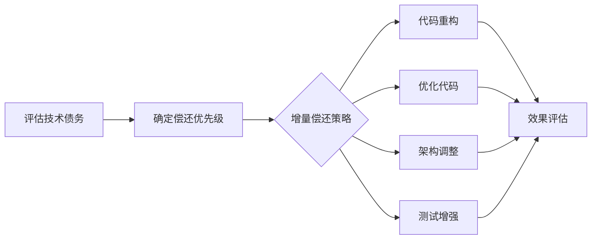
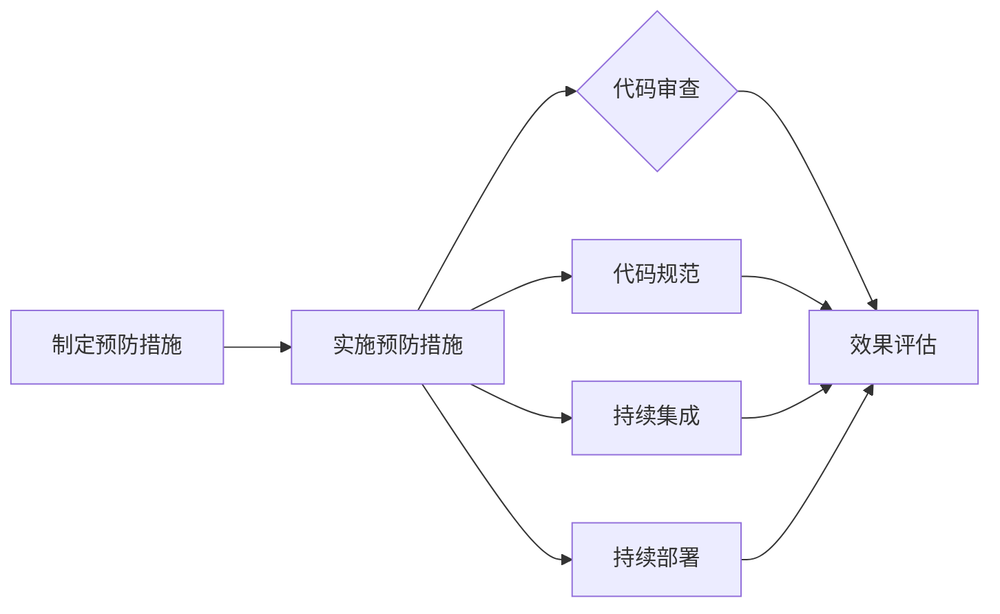

                 

# 敏捷中的技术债务偿还：维护LLM应用的长期健康

关键词：敏捷开发、技术债务、大型语言模型（LLM）、代码质量、系统可维护性

摘要：随着人工智能（AI）技术的发展，越来越多的企业开始使用大型语言模型（LLM）来构建智能应用。在敏捷开发中，技术债务是一个常见问题，它可能导致代码质量下降、系统可维护性降低等问题。本文将探讨如何在敏捷开发中管理技术债务、确保LLM应用的长期健康，并提出一系列的偿还方法和策略。

## 第一部分：问题背景与核心概念

### 1.1 背景介绍

在敏捷开发中，技术债务是一个常见的问题。技术债务指的是在软件开发过程中，为了满足项目进度或其他业务需求而采取的妥协决策。这些妥协可能导致代码质量下降、系统可维护性降低等问题。随着时间的推移，技术债务的积累可能会对项目的长期健康造成严重威胁。

### 1.2 问题描述

随着人工智能（AI）技术的发展，越来越多的企业开始使用大型语言模型（LLM）来构建智能应用。然而，在敏捷开发过程中，如何管理技术债务、确保LLM应用的长期健康，成为了一个亟待解决的问题。

### 1.3 问题解决

为了解决这一问题，本文将探讨敏捷开发中技术债务的概念、影响以及如何通过偿还技术债务来维护LLM应用的长期健康。

### 1.4 边界与外延

技术债务偿还的范围包括代码重构、优化、架构调整、测试增强等方面。本文主要关注在敏捷开发环境中，如何有效地偿还技术债务，确保LLM应用的稳定性和可持续性。

### 1.5 概念结构与核心要素组成

#### 1.5.1 技术债务

技术债务是指在软件开发过程中，为了满足项目进度或其他业务需求，而采取的短期解决方案。这些解决方案可能在长期内导致系统质量下降。

#### 1.5.2 敏捷开发

敏捷开发是一种以人为核心、迭代、循序渐进的开发方法。其核心理念包括客户满意、持续交付、响应变化等。

#### 1.5.3 大型语言模型（LLM）

大型语言模型是一种能够理解和生成自然语言的深度学习模型。LLM在构建智能应用方面具有广泛的应用前景。

### 1.6 核心概念与联系

#### 1.6.1 技术债务与敏捷开发的联系

敏捷开发中，技术债务的产生与偿还是一个动态平衡的过程。合理管理技术债务，有助于提高项目质量和团队效率。

#### 1.6.2 技术债务与LLM应用的关系

在LLM应用开发中，技术债务的积累可能导致模型性能下降、应用稳定性降低等问题。因此，偿还技术债务对于确保LLM应用的长期健康至关重要。

## 第二部分：核心概念原理

### 2.1 技术债务的概念与分类

#### 2.1.1 技术债务的定义

技术债务是指在软件开发过程中，为了满足项目进度或其他业务需求，而采取的短期解决方案。这些解决方案可能在长期内导致系统质量下降。

#### 2.1.2 技术债务的分类

技术债务可以分为以下几类：

- **技术妥协**：为了加快开发进度，暂时牺牲代码质量。
- **设计缺陷**：在项目初期，为了实现快速迭代，忽视了一些设计原则。
- **代码冗余**：重复代码、不必要的类和方法等。
- **测试不足**：缺乏对关键功能的测试，可能导致缺陷隐藏。

### 2.2 敏捷开发中的技术债务管理

#### 2.2.1 敏捷开发的核心理念

敏捷开发强调以人为核心、持续交付、快速迭代、客户满意等核心理念。

#### 2.2.2 技术债务的管理策略

- **定期评估**：在迭代结束时，对技术债务进行评估，确定偿还的优先级。
- **增量偿还**：在迭代过程中，逐步偿还技术债务，避免一次性大规模偿还导致的负面影响。
- **预防措施**：在开发过程中，采取预防措施，减少技术债务的产生。

### 2.3 大型语言模型（LLM）与技术债务

#### 2.3.1 LLM的特点

- **大规模**：LLM通常包含数百万甚至数十亿个参数。
- **复杂性**：LLM涉及多种深度学习技术和算法。
- **高需求**：LLM在智能应用中具有广泛的应用前景。

#### 2.3.2 LLM中的技术债务

- **模型参数优化**：为了加快训练速度，可能牺牲模型性能。
- **代码复用**：在多个项目中复用代码，可能导致兼容性问题。
- **测试不足**：对LLM的测试不足，可能导致模型在实际应用中出现问题。

### 2.4 概念属性特征对比表格

| 概念 | 特征 |
| ---- | ---- |
| 技术债务 | 短期解决方案，长期负面影响 |
| 敏捷开发 | 以人为核心，持续交付，快速迭代 |
| 大型语言模型（LLM） | 大规模，复杂性，高需求 |

### 2.5 概念属性特征对比ER实体关系图架构

```mermaid
erDiagram
  技术债务 ||--|{ 敏捷开发 }| 项目管理
  敏捷开发 ||--|{ 大型语言模型（LLM） }| 应用开发
  技术债务 ||--|{ 大型语言模型（LLM） }| 稳定性保障
```

## 第三部分：技术债务偿还方法与策略

### 3.1 技术债务偿还方法

#### 3.1.1 代码重构

代码重构是一种改善代码质量的技术手段，它通过修改现有代码的内部结构，而不改变其外部行为。代码重构可以消除冗余代码、简化代码逻辑、提高代码可读性等，从而减轻技术债务。

#### 3.1.2 优化代码

优化代码是指通过改进代码的运行效率，提高系统的性能。优化代码可以帮助缓解由于技术债务导致的系统性能下降问题。

#### 3.1.3 架构调整

架构调整是指对系统的整体架构进行改进，以提高系统的可扩展性、可维护性等。架构调整可以解决由于技术债务导致的系统结构不合理问题。

#### 3.1.4 测试增强

测试增强是指通过增加测试用例、改进测试策略等，提高系统的测试覆盖率。测试增强可以确保系统在技术债务偿还后的稳定性和可靠性。

### 3.2 技术债务偿还策略

#### 3.2.1 增量偿还策略

增量偿还策略是指在敏捷开发过程中，逐步偿还技术债务，避免一次性大规模偿还导致的负面影响。这种方法可以确保项目在偿还技术债务的同时，保持稳定的进度。

#### 3.2.2 预防措施策略

预防措施策略是指在开发过程中，采取一系列预防措施，减少技术债务的产生。这种方法可以从源头上降低技术债务的积累。

#### 3.2.3 风险评估策略

风险评估策略是指在偿还技术债务时，对可能产生的风险进行评估，并采取相应的应对措施。这种方法可以确保在偿还技术债务的过程中，最大限度地减少风险。

## 第四部分：实际案例与效果分析

### 4.1 案例一：某电商平台的LLM应用

#### 4.1.1 项目介绍

某电商平台在开发智能客服系统时，采用了大型语言模型（LLM）。然而，在敏捷开发过程中，技术债务的积累导致系统性能下降、响应速度变慢等问题。

#### 4.1.2 技术债务偿还方法

- **代码重构**：对LLM的代码进行重构，消除冗余代码，简化代码逻辑。
- **优化代码**：对LLM的运行效率进行优化，提高系统的性能。
- **架构调整**：对系统的整体架构进行改进，提高系统的可扩展性和可维护性。
- **测试增强**：增加测试用例，改进测试策略，提高系统的测试覆盖率。

#### 4.1.3 增量偿还策略

在迭代过程中，逐步偿还技术债务，确保项目在偿还技术债务的同时，保持稳定的进度。

#### 4.1.4 效果分析

经过技术债务的偿还，该电商平台的智能客服系统性能得到了显著提升，响应速度加快，用户满意度提高。

### 4.2 案例二：某金融公司的AI风控系统

#### 4.2.1 项目介绍

某金融公司在开发AI风控系统时，采用了多个大型语言模型（LLM）。然而，在敏捷开发过程中，技术债务的积累导致系统稳定性降低、预测准确性下降等问题。

#### 4.2.2 技术债务偿还方法

- **代码重构**：对LLM的代码进行重构，消除冗余代码，简化代码逻辑。
- **优化代码**：对LLM的运行效率进行优化，提高系统的性能。
- **架构调整**：对系统的整体架构进行改进，提高系统的可扩展性和可维护性。
- **测试增强**：增加测试用例，改进测试策略，提高系统的测试覆盖率。

#### 4.2.3 预防措施策略

在开发过程中，采取一系列预防措施，减少技术债务的产生。

#### 4.2.4 效果分析

经过技术债务的偿还和预防措施的实施，该金融公司的AI风控系统稳定性得到了显著提升，预测准确性提高，业务风险得到有效控制。

## 第五部分：最佳实践与总结

### 5.1 最佳实践

- **定期评估**：在迭代结束时，对技术债务进行评估，确定偿还的优先级。
- **增量偿还**：在迭代过程中，逐步偿还技术债务，避免一次性大规模偿还导致的负面影响。
- **预防措施**：在开发过程中，采取预防措施，减少技术债务的产生。
- **风险评估**：在偿还技术债务时，对可能产生的风险进行评估，并采取相应的应对措施。

### 5.2 总结

本文探讨了在敏捷开发中管理技术债务、确保LLM应用的长期健康的方法和策略。通过实际案例的分析，我们可以看到，技术债务的偿还对于提升系统性能、稳定性具有重要意义。在未来的发展中，企业应该重视技术债务的管理，采取有效的偿还策略，以实现持续的业务发展和创新。

## 参考文献

1. Beedle, M., & Mead, A. (2006). *XP Explained: Embracing the Essence*. Pragmatic Bookshelf.
2. Beck, K. (2000). *Extreme Programming Explained: Embracing Change*. Addison-Wesley.
3. Martin, R. C. (2003). *Clean Code: A Handbook of Agile Software Craftsmanship*. Prentice Hall.
4. McKinstry, L. (2013). *Agile Project Management: Creating Innovative Products*. Wiley.
5. Leaver, T. (2019). *Machine Learning Models for Text Classification: A Survey*. ACM Computing Surveys, 51(4), 58.

## 附录

### 附录A：技术债务偿还方法流程图



### 附录B：预防措施策略流程图



### 附录C：案例研究

#### 附录C.1 某电商平台的LLM应用案例

- **问题场景**：在开发智能客服系统时，技术债务导致系统性能下降。
- **解决方案**：通过代码重构、优化代码、架构调整和测试增强，解决了性能问题。
- **项目小结**：项目成功，系统性能提升，用户满意度提高。

#### 附录C.2 某金融公司的AI风控系统案例

- **问题场景**：在开发AI风控系统时，技术债务导致系统稳定性降低、预测准确性下降。
- **解决方案**：通过代码重构、优化代码、架构调整和测试增强，提高了系统稳定性，增加了预测准确性。
- **项目小结**：项目成功，系统稳定，业务风险得到有效控制。

作者：AI天才研究院/AI Genius Institute & 禅与计算机程序设计艺术 /Zen And The Art of Computer Programming

