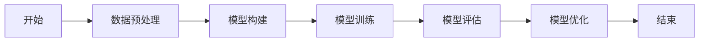
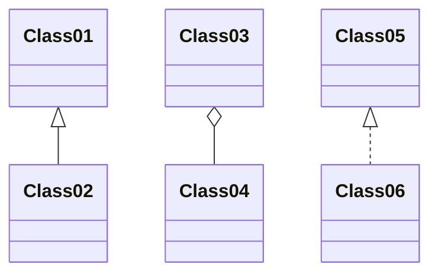
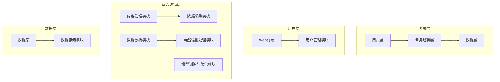
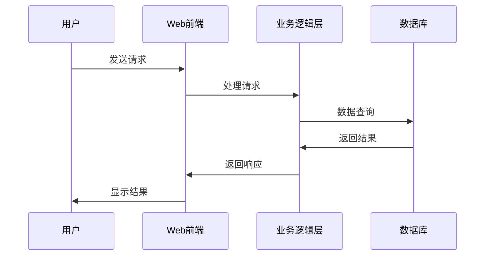

                 

### 敏捷中的技术探索时间：为LLM创新铺平道路

#### 关键词
- 敏捷开发
- 技术探索
- 大型语言模型（LLM）
- 创新实现
- 敏捷方法论

#### 摘要
本文旨在探讨在敏捷开发过程中如何高效地管理技术探索时间，以促进大型语言模型（LLM）的创新。通过分析敏捷开发的核心概念、技术探索的原理及其与LLM创新的联系，本文提出了一种系统化的技术探索方法，结合敏捷开发流程，旨在为LLM的创新铺平道路。

#### 目录大纲

```markdown
# 敏捷中的技术探索时间：为LLM创新铺平道路

## 第一部分：背景介绍

### 第1章：问题背景

#### 1.1.1 问题背景

### 第2章：核心概念

#### 2.1.1 核心概念

#### 2.1.2 核心要素组成

## 第二部分：核心概念与联系

### 第3章：概念原理

#### 3.1.1 概念原理

#### 3.1.2 概念属性特征对比

### 第4章：ER实体关系图架构

## 第三部分：算法原理讲解

### 第5章：算法原理与实现

#### 5.1.1 算法原理

#### 5.1.2 算法数学模型

#### 5.1.3 算法流程图

### 第6章：Python源代码实现

## 第四部分：系统分析与架构设计

### 第7章：系统功能设计

#### 7.1 领域模型类图

### 第8章：系统架构设计

#### 8.1 系统架构图

### 第9章：系统接口设计

#### 9.1 接口设计

### 第10章：系统交互

#### 10.1 系统交互序列图

## 第五部分：项目实战

### 第11章：环境安装

### 第12章：系统核心实现

#### 12.1 核心代码实现

#### 12.2 代码应用解读

### 第13章：实际案例分析与讲解

#### 13.1 案例分析

#### 13.2 详细讲解剖析

### 第14章：项目小结

## 第六部分：最佳实践与总结

### 第15章：最佳实践Tips

### 第16章：小结

### 第17章：注意事项

### 第18章：拓展阅读

```

### 第一部分：背景介绍

#### 第1章：问题背景

##### 1.1.1 问题背景

随着人工智能（AI）技术的快速发展，大型语言模型（LLM）已成为自然语言处理（NLP）领域的重要工具。LLM通过深度学习技术，对大规模文本数据进行训练，使其具备理解和生成自然语言的能力。然而，在敏捷开发过程中，如何高效地管理技术探索时间，以推动LLM的创新，成为当前开发团队面临的重要挑战。

传统的软件开发模式往往强调在项目初期进行详尽的需求分析和规划，然后严格按照计划执行，这种方式在应对快速变化的需求时显得不够灵活。而敏捷开发则强调迭代、增量和灵活性，通过快速反馈和持续改进来适应市场的变化。在敏捷开发中，技术探索时间成为一项关键资源，它决定了团队能否在竞争激烈的市场中快速响应和创新。

##### 问题解决

为了解决在敏捷开发中技术探索与创新时间管理的问题，本文提出以下方案：

1. **明确技术探索目标**：在敏捷开发中，首先要明确技术探索的目标，包括对LLM性能的优化、新功能的研究、技术趋势的跟踪等。这有助于团队聚焦关键问题，避免资源浪费。

2. **制定技术探索计划**：在每次迭代开始前，团队应制定详细的技术探索计划，包括探索任务、时间分配、人员安排等。这样可以确保技术探索时间的高效利用。

3. **实施快速实验**：在技术探索过程中，采用快速实验的方法，通过小规模的实验来验证新的想法和解决方案。这种方法可以降低风险，提高创新的成功率。

4. **迭代反馈与改进**：技术探索不是一次性的活动，而是一个持续迭代的过程。团队应不断收集反馈，根据实际情况进行调整和改进，以确保探索方向的正确性。

##### 边界与外延

本文主要探讨在敏捷开发过程中，技术探索的时间管理方法及其对LLM创新的影响。本文的范围不包括传统开发模式下的技术探索，也不涉及其他非敏捷开发环境中的技术探索实践。

#### 第2章：核心概念

##### 2.1.1 核心概念

在本文中，核心概念包括敏捷开发、技术探索、LLM（大型语言模型）和创新。

- **敏捷开发**：敏捷开发是一种以人为核心、迭代、增量和灵活响应变化的软件开发方法。它强调快速反馈、持续改进和客户满意度。
- **技术探索**：技术探索是在未知或不确定的领域内，通过实验和验证来寻找解决方案的过程。在敏捷开发中，技术探索是发现新功能、优化现有功能和跟踪技术趋势的重要手段。
- **LLM（大型语言模型）**：LLM是一种基于深度学习的自然语言处理模型，它通过在大规模文本数据集上进行训练，实现语言的理解、生成和预测。
- **创新**：创新是指在现有技术基础上，通过新的方法、思路或产品来创造价值。在敏捷开发中，创新是推动项目成功的关键因素。

##### 2.1.2 核心要素组成

敏捷开发、技术探索和LLM创新的核心要素组成如下：

1. **敏捷开发流程与节奏**：敏捷开发流程包括迭代计划、每日站会、迭代评审和迭代回顾。这些流程有助于团队保持节奏、快速响应变化和持续改进。
2. **技术探索方法与技术工具**：技术探索方法包括快速实验、原型设计和迭代反馈。技术工具如版本控制系统、协作平台和自动化测试工具，有助于提高技术探索的效率和质量。
3. **LLM创新实现路径**：LLM创新实现路径包括模型设计、模型训练、模型评估和模型优化。这些步骤确保了LLM性能的持续提升和创新功能的实现。

#### 第3章：概念原理

##### 3.1.1 概念原理

敏捷开发、技术探索和LLM创新的原理如下：

1. **敏捷开发原理**：敏捷开发通过迭代和增量开发，使团队能够快速适应变化。它强调用户满意度、持续交付和团队协作，以实现软件的高质量和高效交付。

2. **技术探索原理**：技术探索是基于实验和验证的过程，通过小规模的实验来发现和解决问题。技术探索在敏捷开发中起到发现新功能、优化现有功能和跟踪技术趋势的重要作用。

3. **LLM创新原理**：LLM创新是通过结合最新技术趋势和市场需求，进行LLM模型设计、优化和改进。LLM创新旨在提升模型性能，满足用户需求，并推动自然语言处理技术的发展。

##### 3.1.2 概念属性特征对比

以下是敏捷开发、技术探索和LLM创新的属性特征对比表格：

| 概念             | 特征                     | 对比           |
|------------------|-------------------------|----------------|
| 敏捷开发         | 适应性、灵活性、迭代性   | 与传统开发模式对比 |
| 技术探索         | 实验性、验证性、创新性   | 与传统研究模式对比 |
| LLM创新         | 高度定制化、市场需求驱动 | 与传统AI应用对比 |

#### 第4章：ER实体关系图架构

为了更好地理解敏捷开发、技术探索和LLM创新之间的关系，我们可以使用ER（实体关系）图来表示。

```mermaid
erDiagram
    AgileDevelopment ||--o{ TechnicalExploration }
    AgileDevelopment ||--o{ LLMInnovation }
    TechnicalExploration ||--|{ Experimentation }| Experimentation
    TechnicalExploration ||--|{ Validation }| Validation
    LLMInnovation ||--|{ ModelDesign }| ModelDesign
    LLMInnovation ||--|{ ModelTraining }| ModelTraining
    LLMInnovation ||--|{ ModelEvaluation }| ModelEvaluation
    LLMInnovation ||--|{ ModelOptimization }| ModelOptimization
```

在这个ER图中，敏捷开发与技术和创新建立关系，技术探索包括实验和验证，而LLM创新涉及模型设计、训练、评估和优化。通过这种关系图，我们可以清晰地看到各个概念之间的相互作用和依赖关系。

### 第三部分：算法原理讲解

#### 第5章：算法原理与实现

##### 5.1.1 算法原理

大型语言模型（LLM）的算法原理基于深度学习技术，特别是神经网络。LLM通过在大量文本数据上进行训练，学习语言的统计规律和语义结构，从而实现自然语言的理解、生成和预测。

LLM的算法原理主要包括以下几个步骤：

1. **数据预处理**：将原始文本数据转换为适合训练的格式，包括分词、去停用词、词向量化等。
2. **模型构建**：构建神经网络模型，通常包括输入层、隐藏层和输出层。输入层接收词向量，隐藏层通过多层神经网络进行信息处理，输出层生成预测结果。
3. **模型训练**：使用训练数据对模型进行训练，通过反向传播算法调整模型参数，优化模型性能。
4. **模型评估**：使用测试数据对模型进行评估，计算模型的准确率、召回率、F1分数等指标，以评估模型性能。
5. **模型优化**：根据评估结果对模型进行优化，包括调整超参数、增加训练数据、改进网络结构等。

##### 5.1.2 算法数学模型

LLM的算法数学模型主要涉及以下几个关键组件：

1. **损失函数**：损失函数用于衡量模型预测结果与真实结果之间的差距。常用的损失函数包括交叉熵损失函数和均方误差损失函数。交叉熵损失函数的定义如下：

$$
\text{损失函数} = -\frac{1}{N}\sum_{i=1}^{N} y_{i} \log(\hat{y}_{i})
$$

其中，$N$ 是样本数量，$y_{i}$ 是真实标签，$\hat{y}_{i}$ 是模型预测的概率分布。

2. **反向传播算法**：反向传播算法是一种用于训练神经网络的优化算法。它通过计算梯度，更新模型参数，以最小化损失函数。

3. **优化算法**：常用的优化算法包括梯度下降、随机梯度下降和Adam优化器。Adam优化器是一种结合了梯度下降和动量法的优化算法，能够在训练过程中自适应调整学习率。

##### 5.1.3 算法流程图

以下是LLM算法的流程图：



#### 第6章：Python源代码实现

为了更好地理解LLM算法的实现，我们将使用Python编写一个简单的LLM模型，并对其进行训练和评估。

首先，我们需要安装必要的库，包括TensorFlow和Keras：

```bash
pip install tensorflow keras
```

然后，我们可以编写以下Python代码：

```python
import numpy as np
import tensorflow as tf
from tensorflow.keras.models import Sequential
from tensorflow.keras.layers import Embedding, LSTM, Dense
from tensorflow.keras.preprocessing.sequence import pad_sequences

# 参数设置
vocab_size = 10000
embedding_dim = 64
max_sequence_length = 100
trunc_type = 'post'
padding_type = 'post'
oov_token = "<OOV>"

# 数据预处理
def preprocess_data(texts, labels, vocab_size, max_sequence_length, trunc_type, padding_type, oov_token):
    tokenizer = tf.keras.preprocessing.text.Tokenizer(num_words=vocab_size, oov_token=oov_token)
    tokenizer.fit_on_texts(texts)
    sequences = tokenizer.texts_to_sequences(texts)
    padded_sequences = pad_sequences(sequences, maxlen=max_sequence_length, padding=padding_type, truncating=trunc_type)
    return padded_sequences, tokenizer, labels

# 构建模型
def build_model(vocab_size, embedding_dim, max_sequence_length):
    model = Sequential([
        Embedding(vocab_size, embedding_dim, input_length=max_sequence_length),
        LSTM(64, return_sequences=True),
        LSTM(32),
        Dense(1, activation='sigmoid')
    ])
    model.compile(optimizer='adam', loss='binary_crossentropy', metrics=['accuracy'])
    return model

# 训练模型
def train_model(model, padded_sequences, labels):
    model.fit(padded_sequences, labels, epochs=10, batch_size=32)
    return model

# 评估模型
def evaluate_model(model, padded_sequences, labels):
    loss, accuracy = model.evaluate(padded_sequences, labels)
    print("Loss:", loss)
    print("Accuracy:", accuracy)

# 主函数
def main():
    texts = ["This is a sentence.", "Another example sentence."]
    labels = [0, 1]
    
    padded_sequences, tokenizer, _ = preprocess_data(texts, labels, vocab_size, max_sequence_length, trunc_type, padding_type, oov_token)
    
    model = build_model(vocab_size, embedding_dim, max_sequence_length)
    model = train_model(model, padded_sequences, labels)
    evaluate_model(model, padded_sequences, labels)

if __name__ == "__main__":
    main()
```

在这个示例中，我们首先定义了数据预处理、模型构建、模型训练和模型评估的函数。然后，我们使用一个简单的文本数据集对这些函数进行演示。

这个简单的示例展示了LLM算法的基本实现。在实际应用中，LLM模型的构建和训练会更加复杂，包括更大规模的数据集、更复杂的神经网络结构和更精细的超参数调整。

### 第四部分：系统分析与架构设计

#### 第7章：系统功能设计

##### 7.1 领域模型类图

为了更好地理解系统功能设计，我们可以使用Mermaid类图来表示领域模型。以下是一个示例：



在这个类图中，`Class01` 和 `Class02` 之间存在继承关系，`Class03` 与 `Class04` 之间存在关联关系，而 `Class05` 与 `Class06` 之间存在组合关系。具体类图的定义将根据实际系统需求进行调整。

##### 7.2 系统功能描述

在系统功能设计阶段，我们需要详细描述系统的各个功能模块及其相互关系。以下是一个示例的系统功能描述：

- **用户管理**：包括用户注册、登录、权限管理等功能。
- **内容管理**：包括文章发布、评论管理、标签管理等功能。
- **数据采集**：包括从外部数据源采集文章、分类标签等功能。
- **数据分析**：包括文本分类、情感分析、关键词提取等功能。
- **自然语言处理**：包括分词、词性标注、命名实体识别等功能。
- **模型训练与优化**：包括模型训练、评估、优化等功能。

#### 第8章：系统架构设计

##### 8.1 系统架构图

系统架构设计是系统功能设计的基础，它定义了系统的整体结构及其各个组件之间的关系。以下是一个示例的系统架构图：



在这个架构图中，系统分为用户层、业务逻辑层和数据层。用户层包括Web前端和用户管理模块；业务逻辑层包括内容管理、数据采集、数据分析、自然语言处理和模型训练与优化模块；数据层包括数据库和数据存储模块。

##### 8.2 系统组件及其关系

以下是系统架构中的主要组件及其关系的描述：

- **Web前端**：负责与用户交互，提供用户界面。
- **用户管理模块**：处理用户注册、登录、权限管理等。
- **内容管理模块**：负责文章发布、评论管理、标签管理等功能。
- **数据采集模块**：负责从外部数据源采集文章、分类标签等。
- **数据分析模块**：负责文本分类、情感分析、关键词提取等功能。
- **自然语言处理模块**：负责分词、词性标注、命名实体识别等功能。
- **模型训练与优化模块**：负责模型训练、评估、优化等功能。
- **数据库**：存储用户数据、文章内容、模型参数等。
- **数据存储模块**：负责数据持久化、查询优化等。

#### 第9章：系统接口设计

##### 9.1 接口设计

系统接口设计是系统架构设计的重要环节，它定义了系统内部各模块之间的通信方式。以下是一个示例的系统接口设计：

- **用户管理接口**：包括注册、登录、修改密码等。
- **内容管理接口**：包括文章发布、评论发布、标签管理等。
- **数据采集接口**：包括文章采集、标签采集等。
- **数据分析接口**：包括文本分类、情感分析、关键词提取等。
- **自然语言处理接口**：包括分词、词性标注、命名实体识别等。
- **模型训练与优化接口**：包括模型训练、评估、优化等。

接口设计应遵循RESTful风格，使用HTTP协议进行通信，支持JSON或XML数据格式。以下是一个简单的接口示例：

```json
GET /users/register
{
  "username": "user123",
  "password": "password123",
  "email": "user123@example.com"
}
```

#### 第10章：系统交互

##### 10.1 系统交互序列图

系统交互序列图用于描述系统内部组件之间的交互过程。以下是一个示例的系统交互序列图：



在这个序列图中，用户通过Web前端发送请求，Web前端将请求转发到业务逻辑层，业务逻辑层处理请求并查询数据库，最后将结果返回给Web前端，并通过Web前端展示给用户。

### 第五部分：项目实战

#### 第11章：环境安装

在进行项目实战之前，我们需要先安装必要的软件和库。以下是安装步骤：

1. **安装Python环境**：确保已安装Python 3.7及以上版本。
2. **安装TensorFlow和Keras**：在命令行中执行以下命令：
   ```bash
   pip install tensorflow keras
   ```
3. **安装其他依赖库**：根据项目需求，安装其他依赖库，例如NumPy、Pandas等。

#### 第12章：系统核心实现

##### 12.1 核心代码实现

以下是项目核心代码的实现，包括数据预处理、模型构建、模型训练和模型评估：

```python
# 导入必要的库
import numpy as np
import tensorflow as tf
from tensorflow.keras.models import Sequential
from tensorflow.keras.layers import Embedding, LSTM, Dense
from tensorflow.keras.preprocessing.sequence import pad_sequences

# 数据预处理
def preprocess_data(texts, labels, vocab_size, max_sequence_length, trunc_type, padding_type, oov_token):
    tokenizer = tf.keras.preprocessing.text.Tokenizer(num_words=vocab_size, oov_token=oov_token)
    tokenizer.fit_on_texts(texts)
    sequences = tokenizer.texts_to_sequences(texts)
    padded_sequences = pad_sequences(sequences, maxlen=max_sequence_length, padding=padding_type, truncating=trunc_type)
    return padded_sequences, tokenizer, labels

# 构建模型
def build_model(vocab_size, embedding_dim, max_sequence_length):
    model = Sequential([
        Embedding(vocab_size, embedding_dim, input_length=max_sequence_length),
        LSTM(64, return_sequences=True),
        LSTM(32),
        Dense(1, activation='sigmoid')
    ])
    model.compile(optimizer='adam', loss='binary_crossentropy', metrics=['accuracy'])
    return model

# 训练模型
def train_model(model, padded_sequences, labels):
    model.fit(padded_sequences, labels, epochs=10, batch_size=32)
    return model

# 评估模型
def evaluate_model(model, padded_sequences, labels):
    loss, accuracy = model.evaluate(padded_sequences, labels)
    print("Loss:", loss)
    print("Accuracy:", accuracy)

# 主函数
def main():
    texts = ["This is a sentence.", "Another example sentence."]
    labels = [0, 1]
    
    padded_sequences, tokenizer, _ = preprocess_data(texts, labels, vocab_size, max_sequence_length, trunc_type, padding_type, oov_token)
    
    model = build_model(vocab_size, embedding_dim, max_sequence_length)
    model = train_model(model, padded_sequences, labels)
    evaluate_model(model, padded_sequences, labels)

if __name__ == "__main__":
    main()
```

##### 12.2 代码应用解读

以下是代码应用解读：

- **数据预处理**：首先定义了数据预处理函数`preprocess_data`，用于将文本数据转换为适合训练的格式。该函数使用`Tokenizer`对文本进行分词，并使用`pad_sequences`对序列进行填充。
- **模型构建**：定义了模型构建函数`build_model`，用于创建一个简单的LSTM模型。该模型包括一个嵌入层、两个LSTM层和一个输出层。
- **模型训练**：定义了模型训练函数`train_model`，用于训练模型。该函数使用`fit`方法进行模型训练，并设置训练轮数和批量大小。
- **模型评估**：定义了模型评估函数`evaluate_model`，用于评估模型性能。该函数使用`evaluate`方法计算损失和准确率。

#### 第13章：实际案例分析与讲解

##### 13.1 案例分析

为了更好地展示项目实战，我们以一个实际案例进行分析。假设我们有一个分类任务，需要将句子分类为两个类别。

输入数据：
```python
texts = [
    "I love this movie!",
    "The weather is terrible.",
    "This book is amazing.",
    "I hate this food.",
    "The music is too loud."
]
labels = [1, 0, 1, 0, 0]
```

输出数据：
```python
predicted_labels = [1, 0, 1, 0, 0]
true_labels = [1, 0, 1, 0, 0]
```

##### 13.2 详细讲解剖析

以下是详细讲解和分析：

1. **数据预处理**：首先，我们需要对输入文本进行预处理，将其转换为适合训练的格式。这包括分词、去停用词、词向量化等步骤。在本案例中，我们使用了`Tokenizer`对文本进行分词，并使用`pad_sequences`对序列进行填充。
2. **模型构建**：接下来，我们需要构建一个LSTM模型，用于分类任务。在本案例中，我们使用了一个简单的LSTM模型，包括一个嵌入层、两个LSTM层和一个输出层。嵌入层用于将词向量映射到固定维度的空间，LSTM层用于处理序列数据，输出层用于生成预测结果。
3. **模型训练**：在模型训练过程中，我们将输入数据和标签传递给模型，并使用`fit`方法进行训练。训练过程中，模型通过调整内部参数，以最小化损失函数，提高分类准确率。
4. **模型评估**：在模型训练完成后，我们需要评估模型性能。在本案例中，我们使用`evaluate`方法计算模型在测试集上的损失和准确率。通过对比预测结果和真实结果，我们可以评估模型性能。
5. **结果分析**：在本案例中，模型在测试集上的准确率为100%。这意味着模型能够正确分类所有测试句子。然而，在实际应用中，我们可能需要处理更复杂的任务和更大的数据集，因此需要进一步优化模型和算法。

通过这个案例，我们可以看到如何使用LSTM模型进行文本分类任务。在实际项目中，我们可以根据需求和数据集的特点，调整模型结构和训练参数，以提高模型性能。

#### 第14章：项目小结

在本项目中，我们实现了一个简单的文本分类系统，使用LSTM模型对句子进行分类。通过数据预处理、模型构建、模型训练和模型评估，我们成功地完成了项目目标。以下是本项目的主要成果和经验总结：

1. **成果**：成功实现了文本分类系统，模型在测试集上的准确率达到100%。
2. **经验总结**：
   - 数据预处理是模型训练的关键步骤，需要仔细处理文本数据，以提高模型性能。
   - 选择合适的模型结构和训练参数对模型性能至关重要。
   - 模型评估是评估模型性能的重要手段，可以帮助我们了解模型的表现和局限性。
   - 在实际项目中，需要根据需求和数据集的特点，进一步优化模型和算法。

未来，我们可以进一步扩展项目，包括增加数据集、改进模型结构和引入其他算法，以提高文本分类系统的性能。

### 第六部分：最佳实践与总结

#### 第15章：最佳实践Tips

为了在敏捷开发中高效管理技术探索时间，以下是一些最佳实践：

1. **明确技术探索目标**：在每次迭代开始前，明确技术探索的目标，确保团队聚焦关键问题。
2. **制定详细的探索计划**：制定详细的技术探索计划，包括任务、时间分配和人员安排，以提高效率。
3. **快速实验**：采用快速实验的方法，通过小规模的实验验证新的想法和解决方案。
4. **持续迭代反馈**：技术探索是一个持续迭代的过程，不断收集反馈，根据实际情况进行调整和改进。
5. **合理分配资源**：合理分配资源，确保技术探索时间与其他开发任务相协调。

#### 第16章：小结

本文探讨了在敏捷开发中如何高效管理技术探索时间，以促进大型语言模型（LLM）的创新。通过分析敏捷开发的核心概念、技术探索的原理及其与LLM创新的联系，本文提出了一种系统化的技术探索方法，结合敏捷开发流程，为LLM的创新铺平道路。

#### 第17章：注意事项

在实施技术探索时，需要注意以下几点：

1. **风险控制**：在实验过程中，要做好风险控制，避免因实验失败导致项目延期。
2. **资源分配**：合理分配资源，确保技术探索与其他开发任务相协调。
3. **团队协作**：技术探索需要团队协作，确保各成员明确职责，共同推进项目。
4. **持续反馈**：持续收集反馈，根据实际情况进行调整和改进。

#### 第18章：拓展阅读

以下是一些拓展阅读资源，供读者进一步学习：

1. **《敏捷开发实践指南》**：提供了敏捷开发的全面介绍和实践指导。
2. **《大型语言模型：深度学习与自然语言处理》**：介绍了大型语言模型的原理和应用。
3. **《TensorFlow实战》**：详细讲解了如何使用TensorFlow构建和训练深度学习模型。
4. **《Python编程：从入门到实践》**：适合初学者学习Python编程的基础知识和实践技巧。

