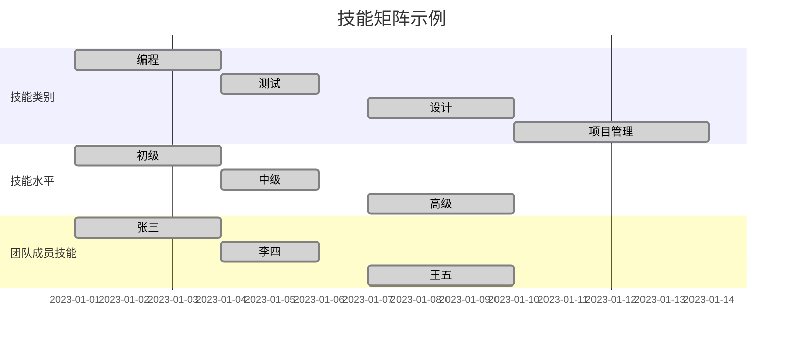

                 

### 引言

在现代软件开发领域，敏捷开发已成为一种主流的开发模式，它通过灵活应对变化和持续交付高质量软件来满足客户需求。然而，敏捷开发的成功不仅依赖于严格的过程和工具，更依赖于团队成员的综合技能和协作能力。在这个背景下，技能矩阵的概念应运而生，成为提升团队敏捷性和多功能性的关键工具之一。

技能矩阵是一种用于评估和提升团队技能的模型，它通过系统的技能分类和评估方法，帮助团队识别成员的优势和不足，从而实现技能的合理配置和优化。技能矩阵在敏捷开发中的应用尤为重要，因为它不仅有助于构建多功能的团队，还能够促进团队成员的个人技能发展和团队整体协作效率的提升。

本文旨在探讨敏捷开发中的技能矩阵，特别是在构建多功能LLM（大型语言模型）开发团队方面的应用。我们将从以下几个方面展开讨论：

1. **敏捷开发概述**：介绍敏捷开发的起源、核心原则与实践，以及与传统开发模式的比较。
2. **技能矩阵概念与模型**：解释技能矩阵的定义、结构与在敏捷开发中的应用。
3. **构建多功能团队**：探讨多功能团队的必要性、构建方法和团队成员的角色与职责。
4. **技能提升与成长**：分析敏捷实践中的个人技能发展和团队协作技能提升策略。
5. **技能矩阵在敏捷项目管理中的应用**：探讨技能矩阵在迭代计划、风险管理和团队沟通中的应用。
6. **实施案例**：通过实际案例展示技能矩阵在敏捷开发中的具体应用和效果。
7. **未来展望**：讨论技能矩阵在敏捷开发中的发展趋势与挑战。

通过本文的讨论，我们希望读者能够对敏捷开发中的技能矩阵有更深入的理解，并掌握如何利用技能矩阵来构建和提升多功能团队，从而在敏捷开发的实践中取得更好的成果。

### 第一部分：敏捷与技能矩阵基础

#### 第1章：敏捷开发概述

**1.1 敏捷开发的起源与发展**

敏捷开发（Agile Development）起源于20世纪90年代末期，是对当时软件工程项目中广泛存在的复杂性和不确定性的一种回应。最早的敏捷思想可以追溯到2001年，当时17位软件开发专家在瑞士的尤利西斯酒店（Snowbird, Utah）举行了为期几天的会议，这次会议被称为“敏捷宣言”的诞生。

敏捷宣言的核心是“个体和互动重于过程和工具”、“可工作的软件重于详尽的文档”、“客户合作重于合同谈判”、“响应变化重于遵循计划”。这四条原则奠定了敏捷开发的基础，其核心理念在于通过团队协作、持续交付和快速迭代来满足不断变化的需求。

敏捷开发的发展经历了几个重要的阶段：

- **初期阶段**：敏捷开发最初主要关注的是项目管理和团队协作，以Scrum和XP（极端编程）为代表的方法被广泛采用。这些方法强调迭代开发、增量交付和持续反馈。
- **中期阶段**：随着敏捷开发理念的普及，更多的工具和框架被引入，如看板（Kanban）、看板化（Lean）和敏捷方法学的集成（Agile Methodology Integration）。这一阶段，敏捷开发开始向更广泛的软件开发流程和生命周期扩展。
- **成熟阶段**：敏捷开发逐渐成为一种普遍的软件开发文化，不仅仅局限于开发团队，而是扩展到产品管理、运营和整个组织的各个层面。敏捷联盟（Agile Alliance）和Scrum联盟（Scrum Alliance）等组织的成立，进一步推动了敏捷社区的建立和成长。

**1.2 敏捷开发的核心原则与实践**

敏捷开发以其灵活性和适应性而闻名，其核心原则和实践包括以下几个方面：

- **用户故事（User Stories）**：用户故事是一种简洁明了的需求描述方式，用于定义产品功能或特性的最小可交付单元。用户故事通常由三个部分组成：功能描述、用户角色和情景。
- **迭代开发（Iterative Development）**：迭代开发是一种分阶段交付产品的方法，每个阶段都包含需求收集、设计、开发和测试。每个迭代都尽可能快速地交付一个可用的产品版本。
- **Scrum框架**：Scrum是一种流行的敏捷开发方法，它通过每日站立会议、迭代回顾和产品待办列表等实践，确保团队能够高效协作和持续改进。
- **看板（Kanban）**：看板是一种可视化流程管理工具，通过限制在进度中的工作项数量，来优化工作流程和提高生产效率。
- **持续集成（Continuous Integration）**：持续集成是一种开发实践，通过频繁地将代码合并到共享的主干分支，并自动运行测试来确保代码的可靠性和质量。

**1.3 敏捷开发与传统开发模式的比较**

传统开发模式，如瀑布模型（Waterfall Model），通常遵循严格的项目计划和时间表，强调前期需求分析和文档编写。而敏捷开发则更加灵活和迭代，以下是比较两者的一些关键点：

- **项目生命周期**：传统开发模式通常在项目初期完成所有需求分析和设计，然后按照预定计划进行开发。而敏捷开发则采用短周期的迭代方式，每个迭代都提供可工作的软件。
- **需求变化**：传统开发模式对需求变化持保守态度，而敏捷开发则鼓励需求变化，并在每个迭代中快速适应和响应。
- **团队协作**：传统开发模式通常依赖于明确的角色和职责分工，而敏捷开发强调团队成员的协作和跨功能团队的自主管理。
- **质量保证**：传统开发模式通常通过严格的测试和评审来确保质量，而敏捷开发则通过持续集成和持续交付来保证软件的持续高质量。

总之，敏捷开发通过其灵活性和迭代性，为应对快速变化的市场需求提供了有效的解决方案。然而，敏捷开发也要求团队具备更高的协作能力和适应能力，这对团队成员的技能和沟通提出了更高的要求。技能矩阵作为一种评估和提升团队技能的工具，在敏捷开发中发挥了至关重要的作用。

#### 第2章：技能矩阵概念与模型

**2.1 技能矩阵的定义与结构**

技能矩阵（Skill Matrix）是一种用于评估和展示团队成员技能水平的工具，它通过系统的分类和评估方法，帮助团队识别成员的优势和不足，从而实现技能的合理配置和优化。技能矩阵的核心在于它提供了一个全面的视图，展示了团队中每个人的技能分布和互补性。

技能矩阵通常包括以下几个关键组成部分：

- **技能类别**：这些是定义团队成员所需技能的基本类别，如编程、测试、设计、项目管理等。
- **技能水平**：每个技能类别都关联一个或多个技能水平，如初级、中级、高级等。技能水平的定义可以是基于经验和能力的不同层次。
- **团队成员**：技能矩阵中的每个成员都关联到一个或多个技能类别和相应的技能水平。

**技能矩阵的典型结构**可能如下所示：

在这个示例中，我们可以看到不同团队成员在编程、测试、设计和项目管理等方面的技能水平分布。

**2.2 技能矩阵与传统人才矩阵的对比**

传统人才矩阵（Traditional Talent Matrix）通常用于展示团队成员的工作职责和项目分配。它与技能矩阵的主要区别在于：

- **目的**：传统人才矩阵主要关注成员的工作职责和项目分配，而技能矩阵则专注于团队成员的技能评估和优化。
- **内容**：传统人才矩阵通常包含成员的职位、负责的项目、项目进度等信息，而技能矩阵则包含成员的技能类别、技能水平和技能互补性。
- **使用方式**：传统人才矩阵通常用于项目管理，以确保项目的顺利进行，而技能矩阵则用于团队建设和技能提升，以优化团队的整体能力。

**对比表格**：

| 对比项 | 传统人才矩阵 | 技能矩阵 |
| --- | --- | --- |
| 目的 | 展示工作职责和项目分配 | 评估和优化团队技能 |
| 内容 | 职位、项目、进度 | 技能类别、技能水平、技能互补性 |
| 使用方式 | 项目管理 | 团队建设 |

**2.3 技能矩阵在敏捷开发中的应用**

在敏捷开发中，技能矩阵的应用尤为重要，因为它能够帮助团队快速识别和解决技能缺口，从而提升团队的多功能性和协作效率。以下是技能矩阵在敏捷开发中的几个关键应用场景：

- **团队构建**：通过技能矩阵，敏捷团队可以识别出所需技能的缺口，并根据技能互补性原则来构建团队。例如，一个以开发为主的团队可能需要包含数据库专家、前端工程师和后端工程师等。
- **任务分配**：在敏捷迭代中，技能矩阵可以帮助项目经理和团队领导更合理地分配任务。团队成员可以根据其技能水平和工作偏好来选择最适合的任务，从而提高工作效率和质量。
- **技能提升**：技能矩阵不仅可以用于展示当前团队的技能水平，还可以用于制定个人和团队技能提升计划。例如，通过分析技能矩阵，团队可以识别出需要进一步提升的技能领域，并制定相应的培训计划。
- **团队协作**：技能矩阵提供了一个透明和可视化的工具，帮助团队成员了解彼此的技能优势和不足，从而促进更好的协作和沟通。

**案例**：假设一个敏捷开发团队正在进行一个复杂的机器学习项目，项目需要涉及数据分析、模型训练、前端开发和后端服务。通过技能矩阵，团队可以识别出：

- 数据分析师具备高级数据分析技能，但缺乏前端开发经验。
- 前端开发工程师具备中级前端开发技能，但需要提高机器学习相关技能。
- 后端开发工程师具备高级后端开发技能，但需要加强前端和数据分析方面的知识。

基于这些信息，团队可以采取以下措施：

- 为数据分析师提供前端开发培训，提高其技能水平。
- 为前端开发工程师提供机器学习相关课程，增强其专业技能。
- 通过内部交流和合作，促进团队成员之间的知识共享和技能互补。

通过这样的应用，技能矩阵不仅帮助团队解决了当前的技能缺口，还促进了团队成员的技能提升和团队协作效率的提高。

综上所述，技能矩阵作为一种评估和提升团队技能的工具，在敏捷开发中具有重要作用。通过系统的技能分类和评估方法，技能矩阵能够帮助团队构建多功能团队，优化任务分配，提升技能水平和促进团队协作，从而在敏捷开发中取得更好的成果。

#### 第3章：构建多功能团队

**3.1 多功能团队的必要性**

在现代软件开发项目中，多功能团队（Cross-functional Team）已经成为确保项目成功的关键因素。多功能团队由来自不同专业领域、具备互补技能的成员组成，通过跨职能合作，能够更高效地解决复杂问题，更快地交付高质量的产品。

**必要性**：

- **快速响应变化**：在现代软件开发中，需求变化频繁且不可预测。多功能团队能够迅速调整资源，快速响应变化，确保项目按时交付。
- **降低风险**：多功能团队中，不同领域的专家可以在项目早期就发现和解决问题，降低项目失败的风险。
- **提高产品质量**：多功能团队成员可以共同协作，确保产品在设计和开发过程中考虑各个方面的需求和问题，从而提高产品质量。
- **促进知识共享**：多功能团队中的成员可以从不同的视角和经验中学习，促进知识的共享和技能的提升。

**3.2 如何构建高效的多功能团队**

要构建一个高效的多功能团队，需要考虑以下几个方面：

**1. 明确团队目标**：首先，团队需要明确共同的目标和愿景，确保所有成员都朝着相同的方向努力。这可以通过定期的团队会议和沟通来实现。

**2. 确定团队成员**：团队应由不同领域的专家组成，包括软件开发、测试、设计、项目管理等。每个成员都应该具备所需的技能和经验，以支持项目的各个阶段。

**3. 优化沟通和协作**：高效的沟通和协作是多功能团队成功的关键。可以使用各种协作工具，如Jira、Slack等，来确保团队成员能够及时交流信息和进度。

**4. 培养团队文化**：团队文化对于团队的成功至关重要。一个积极、开放和互相尊重的团队文化能够促进成员之间的合作和知识共享。

**5. 提供持续培训和发展机会**：为了确保团队技能的持续提升，团队应该提供定期的培训和发展机会，以帮助成员不断学习和成长。

**3.3 多功能团队中的角色与职责**

在多功能团队中，每个成员的角色和职责都是明确的，以确保团队高效运作。以下是一些常见的角色和职责：

**1. 产品经理**：负责定义产品愿景和需求，确保团队按照客户和市场的需求进行开发。

**2. 开发工程师**：负责设计和实现软件功能，通常分为前端、后端和数据库工程师。

**3. 测试工程师**：负责测试软件的功能和性能，确保产品质量。

**4. 设计师**：负责设计产品的用户界面和用户体验，确保产品易于使用和用户友好。

**5. 项目经理**：负责项目的规划和管理，确保项目按时交付。

**6. 数据分析师**：负责分析用户数据和业务数据，为产品优化和决策提供数据支持。

**7. 运营人员**：负责产品的上线和维护，确保产品的稳定运行和用户体验。

通过构建高效的多功能团队，敏捷开发团队能够更好地应对复杂项目的挑战，提高项目的成功率。多功能团队不仅能够在快速变化的市场环境中快速响应，还能够通过跨职能协作，提高产品质量和客户满意度。因此，构建和培养多功能团队是敏捷开发中不可或缺的一环。

#### 第4章：敏捷中的技能提升与成长

**4.1 敏捷实践中的个人技能发展**

在敏捷开发环境中，个人技能的发展至关重要。敏捷实践不仅要求团队成员具备多样化的技能，还需要他们不断适应和学习，以应对快速变化的需求和项目挑战。以下是一些关键步骤和策略，帮助团队成员在敏捷实践中提升个人技能：

**1. 自我评估和职业规划**：团队成员应定期进行自我评估，识别自身的优势和不足。通过设立个人职业目标和规划，可以帮助团队成员有针对性地提升技能。例如，如果某个成员希望提高编程能力，他们可以设定一个目标，通过参加编程课程、阅读相关书籍或参加在线编程竞赛来实现。

**2. 持续学习**：敏捷开发领域知识和技术更新迅速，团队成员应保持持续学习的态度。可以通过以下途径进行学习：

   - 参加技术会议和研讨会：通过参加行业会议和研讨会，团队成员可以了解最新的技术趋势和最佳实践。
   - 在线课程和培训：利用在线教育资源，如Coursera、edX等，学习新的编程语言、框架或工具。
   - 阅读专业书籍和博客：定期阅读专业的技术书籍和博客，保持对最新技术发展的关注。

**3. 实践和项目经验**：理论知识需要通过实践来巩固。团队成员应积极参与实际项目，通过解决实际问题来提升技能。例如，参与一个涉及新技术和工具的项目，可以让他们在实际操作中学习和掌握这些新技能。

**4. 反馈和改进**：敏捷开发强调持续反馈和改进。团队成员应在每个迭代结束时进行反思，识别工作中的不足，并制定改进措施。例如，如果某个成员发现自己在项目管理方面存在缺陷，可以通过参加项目管理课程或寻求导师指导来提升。

**4.2 敏捷开发中的团队协作技能提升**

除了个人技能的提升，敏捷开发中的团队协作技能同样重要。高效团队协作能够显著提高项目成功率。以下是一些提升团队协作技能的策略：

**1. 定期团队建设活动**：通过定期组织团队建设活动，如团建活动、团队拓展训练等，可以增强团队成员之间的信任和合作精神。

**2. 促进沟通与透明度**：沟通是团队协作的核心。确保团队内部沟通渠道畅通，通过每日站立会议、迭代回顾等方式，及时分享进展、问题和解决方案。

**3. 分享最佳实践**：团队成员应分享自己在项目中的最佳实践和经验。这不仅可以帮助团队避免重复犯错，还可以促进知识的共享和技能的提升。

**4. 利用协作工具**：现代协作工具如Jira、Trello、Slack等，可以帮助团队更好地管理任务和项目，提高协作效率。

**5. 培养共同目标感**：通过明确团队的目标和愿景，确保每个成员都朝着共同的目标努力。这可以通过定期的团队目标设定和回顾来实现。

**4.3 敏捷文化中的技能成长路径**

敏捷文化鼓励团队成员不断学习和成长，为此，以下是一些常见的技能成长路径：

**1. 认证课程**：参与专业认证课程，如Scrum Master认证、Certified Agile Leader (CAL)等，可以帮助团队成员获得行业认可的认证，提升专业水平。

**2. 跨职能培训**：通过跨职能培训，团队成员可以学习不同领域的知识和技能，提高整体团队的多功能性。

**3. 内部导师制度**：建立一个内部导师制度，让有经验的成员指导新成员，帮助他们快速融入团队并提升技能。

**4. 定期技能评估**：通过定期技能评估，团队成员可以了解自己在团队中的技能水平和贡献，制定个性化的成长计划。

总之，敏捷开发中的技能提升和成长是一个持续的过程，需要团队成员的积极参与和持续努力。通过自我评估、持续学习、实践经验和反馈改进，团队成员可以在敏捷实践中不断提升个人和团队技能，从而在快速变化的市场环境中保持竞争力。

#### 第5章：技能矩阵在敏捷项目管理中的应用

**5.1 技能矩阵与敏捷迭代计划**

在敏捷开发中，迭代计划是项目管理的重要组成部分。技能矩阵在这个过程中发挥着关键作用，帮助团队在每次迭代中做出更明智的决策。以下是如何利用技能矩阵进行敏捷迭代计划的几个关键步骤：

**1. 分析需求与技能匹配**：在开始每个迭代之前，项目经理和团队成员需要分析当前迭代的需求和任务。通过技能矩阵，可以快速识别哪些任务需要哪些特定的技能，并确保团队中具备这些技能的成员参与相应的工作。

**2. 动态调整团队配置**：技能矩阵提供了一个清晰的可视化工具，可以帮助团队动态调整资源配置。例如，如果某个迭代需要大量的前端开发工作，项目经理可以调整技能矩阵，将具备前端开发技能的成员分配到相关任务。

**3. 设定优先级**：利用技能矩阵，团队可以更准确地设定任务的优先级。例如，如果某个关键任务需要高级技能，但团队中只有初级技能的成员，项目经理可能需要优先考虑其他任务，以确保关键任务能够得到适当资源。

**4. 优化迭代进度**：技能矩阵可以帮助团队监控迭代进度，确保每个任务都按照计划进行。通过技能矩阵，团队成员可以及时了解自身任务的状态和进度，从而更好地协调工作。

**案例**：假设一个敏捷团队正在规划一个新功能迭代。通过技能矩阵，团队识别出以下需求：

- **前端开发**：需要3名中级前端工程师。
- **后端开发**：需要2名高级后端工程师和1名中级工程师。
- **测试**：需要2名测试工程师。

通过分析技能矩阵，团队发现现有的资源分配如下：

- **前端开发**：3名中级工程师。
- **后端开发**：2名高级工程师，1名中级工程师。
- **测试**：1名测试工程师。

团队决定在下一个迭代中优先处理前端开发任务，并将2名中级工程师提升为高级工程师，以确保前端开发团队能够顺利完成工作。同时，团队将增加1名测试工程师，以满足测试需求。

**5.2 技能矩阵与敏捷风险管理**

敏捷开发强调快速迭代和持续交付，因此在项目管理中，风险管理尤为重要。技能矩阵可以帮助团队更有效地识别和应对风险，以下是一些应用策略：

**1. 识别技能缺口**：通过技能矩阵，团队可以识别出哪些任务可能存在技能缺口。例如，如果一个迭代需要大量数据分析工作，但团队中只有初级技能的成员，这可能会导致进度延误和质量问题。

**2. 制定应急计划**：一旦识别出技能缺口，团队可以制定相应的应急计划，例如招募外部专家或调整任务优先级。

**3. 风险评估与监控**：利用技能矩阵，团队可以定期进行风险评估，确保所有潜在风险都得到关注和监控。例如，每个迭代结束时，团队可以回顾技能矩阵中的数据，评估哪些任务存在风险，并制定相应的应对措施。

**案例**：假设一个敏捷团队在某个迭代中发现，由于需要处理复杂的数据分析任务，但团队中只有一名成员具备相关技能，这可能导致任务延期。团队通过技能矩阵识别到这一风险后，立即采取以下措施：

- **招募专家**：团队决定在下一个迭代中招募一名数据分析专家，以确保当前迭代能够按时完成。
- **任务分解**：团队将复杂的数据分析任务分解为多个子任务，并分配给其他具备相关技能的成员，以减轻单点风险。
- **技能提升**：团队决定为其他成员提供数据分析培训，提高团队的技能水平，以应对未来类似任务。

**5.3 技能矩阵与敏捷团队沟通**

在敏捷开发中，团队沟通是确保项目成功的关键。技能矩阵作为一种沟通工具，可以帮助团队成员更好地理解彼此的技能和能力，促进协作和沟通，以下是一些具体应用：

**1. 明确角色和职责**：通过技能矩阵，团队成员可以清楚地了解每个成员的技能和角色。例如，如果一个新成员加入团队，他们可以通过技能矩阵快速了解团队成员的职责和技能，从而更好地融入团队。

**2. 促进知识共享**：技能矩阵可以帮助团队成员识别出各自的专长和不足，促进知识和经验的共享。例如，一个具备高级测试技能的成员可以分享他们的经验和最佳实践，帮助其他成员提升技能。

**3. 提高沟通效率**：技能矩阵提供了一个可视化的工具，帮助团队成员更好地理解和沟通。例如，在每日站立会议上，团队可以通过技能矩阵展示当前任务分配和进展，确保所有成员对项目的状态有共同的理解。

**案例**：在一个敏捷团队中，项目经理通过技能矩阵展示了当前的任务分配和团队成员的技能水平。在一次站立会议上，项目经理发现一个重要的测试任务分配给了一名初级测试工程师。项目经理立即与团队成员进行了沟通：

- **识别问题**：项目经理指出当前任务对测试工程师的技能要求较高，但分配的工程师只有初级技能。
- **讨论解决方案**：团队成员讨论了可能的解决方案，包括为初级工程师提供额外培训、调整任务分配或招募外部测试专家。
- **制定计划**：团队决定为初级工程师提供额外培训，并调整任务分配，以确保项目能够按时完成。

通过这些沟通措施，团队有效地解决了技能缺口问题，确保了项目的顺利进行。

综上所述，技能矩阵在敏捷项目管理中的应用，不仅帮助团队更有效地进行迭代计划、风险管理和团队沟通，还提高了整体的项目管理效率和成功率。通过系统的技能评估和优化，敏捷团队能够更好地应对复杂项目的挑战，实现持续交付高质量的产品。

#### 第6章：敏捷中的技能矩阵实施案例

**6.1 案例一：技能矩阵在初创公司中的应用**

在某家初创公司，敏捷开发是其核心技术实践，而技能矩阵则是其团队管理和项目优化的重要工具。以下是如何在该公司中实施技能矩阵的具体步骤和效果：

**背景**：该公司专注于开发人工智能驱动的数据分析平台，团队成员包括软件开发工程师、数据科学家、产品经理和设计师。由于公司规模较小，团队成员需要具备跨领域的技能，以应对快速变化的需求。

**步骤**：

1. **技能分类**：公司首先对团队成员的技能进行了系统分类，包括编程、数据科学、产品设计、项目管理等。

2. **技能水平评估**：通过内部培训和外部认证，公司为每个团队成员设定了技能水平，如初级、中级和高级。

3. **构建技能矩阵**：公司创建了一个详细的技能矩阵，每个团队成员都被分配到相应的技能类别和技能水平。例如，一名数据科学家可能被标记为“数据分析 - 中级”。

4. **动态调整**：根据项目需求和团队成员的技能变化，技能矩阵会定期更新，以确保团队成员的技能与项目需求相匹配。

**效果**：

- **提高团队协作**：技能矩阵帮助团队成员更好地了解彼此的技能，促进知识共享和协作。
- **优化任务分配**：通过技能矩阵，项目经理可以更合理地分配任务，确保每个成员都能在其擅长的领域发挥最大作用。
- **快速响应变化**：技能矩阵使得团队能够快速识别和应对技能缺口，确保项目在面临变化时能够保持稳定性。

**6.2 案例二：技能矩阵在大型企业的实践**

另一家大型企业，其产品开发团队规模庞大，拥有数百名开发工程师、数据科学家、测试工程师等。技能矩阵在该企业的应用如下：

**背景**：企业产品线多样，需求变化频繁，因此需要高效的管理工具来确保项目顺利进行。

**步骤**：

1. **建立中心化技能库**：企业建立了一个中心化的技能库，所有团队成员的技能信息都存储在这个系统中。

2. **定期技能评估**：企业定期对团队成员进行技能评估，通过内部考核和外部认证，更新技能库中的信息。

3. **技能矩阵应用**：在每次项目启动时，项目经理会从技能库中提取相关的技能数据，构建技能矩阵，用于项目规划和资源分配。

4. **持续监控与优化**：企业通过技能矩阵监控团队成员的技能发展，并根据项目需求和团队绩效进行动态调整。

**效果**：

- **优化资源分配**：技能矩阵帮助企业更有效地分配资源，确保项目在各个阶段都有足够的技能支持。
- **提升团队绩效**：通过技能矩阵的监控和优化，团队成员的技能水平得到提升，从而提高了整体团队绩效。
- **加强团队协作**：技能矩阵提供了一个透明的沟通工具，帮助团队成员了解彼此的技能和责任，促进协作和知识共享。

**6.3 案例总结与启示**

通过上述两个案例，我们可以看到技能矩阵在不同规模企业中的应用效果：

- **初创公司**：技能矩阵帮助初创公司快速响应市场需求，提高团队协作和任务分配的效率。
- **大型企业**：技能矩阵帮助企业优化资源分配，提升团队绩效，并加强团队协作。

**启示**：

- **持续技能提升**：企业应重视团队成员的技能提升，定期进行技能评估和培训，确保团队始终具备应对复杂项目的能力。
- **透明沟通**：技能矩阵提供了一个透明的沟通工具，有助于团队成员了解彼此的技能和责任，促进协作。
- **灵活调整**：技能矩阵应具备灵活调整的能力，以应对项目需求和团队变化。

总之，技能矩阵作为一种有效的管理工具，在敏捷开发中具有广泛应用前景。通过合理的实施和持续优化，技能矩阵能够显著提升团队的多功能性和协作效率，从而在敏捷开发中取得更好的成果。

#### 第7章：敏捷中的技能矩阵的未来展望

**7.1 技能矩阵发展的趋势与挑战**

随着敏捷开发的广泛应用和技术的不断进步，技能矩阵的发展也呈现出一些明显的趋势和挑战。

**趋势**：

1. **智能化与自动化**：未来技能矩阵的发展趋势之一是智能化和自动化。通过引入人工智能和机器学习技术，技能矩阵可以自动评估团队成员的技能水平，提供个性化的培训建议，并优化资源分配。

2. **数据驱动**：技能矩阵的发展将更加依赖数据驱动的决策。企业可以通过收集和分析团队成员的工作数据，如任务完成情况、项目绩效等，来不断优化技能矩阵，提升团队效率。

3. **跨领域融合**：随着软件开发的复杂性增加，技能矩阵将不再局限于特定的领域或技能，而是更多地关注跨领域技能的整合。例如，数据科学、人工智能和云计算等领域的融合，将需要团队具备更全面的技能组合。

**挑战**：

1. **数据准确性**：技能矩阵的准确性依赖于数据的准确性和完整性。如果数据存在偏差或不完整，将影响技能矩阵的有效性和决策质量。

2. **技能更新的速度**：技术的快速发展和市场需求的不断变化，要求技能矩阵能够快速适应和更新。然而，技能更新的速度往往难以跟上技术发展的步伐，这将成为一个重要挑战。

3. **文化适应性**：技能矩阵的应用需要企业文化的支持。在一个注重个性化和自主性的环境中，如何确保团队成员接受和积极参与技能评估和培训，是技能矩阵推广的挑战之一。

**7.2 技能矩阵与敏捷开发的深度融合**

技能矩阵在敏捷开发中的应用将越来越深入，其与敏捷开发的深度融合将带来以下几个方面的变化：

1. **敏捷规划与资源分配**：技能矩阵将为敏捷规划提供更准确的数据支持，帮助团队在迭代计划和资源分配中做出更明智的决策。通过技能矩阵，团队能够更清晰地了解成员的技能分布和需求，从而优化任务分配和团队结构。

2. **持续反馈与改进**：技能矩阵提供了一个持续反馈的机制，团队可以通过定期评估和技能更新，持续改进团队效率和绩效。例如，通过技能矩阵的数据分析，团队可以识别出技能提升的优先领域，并制定相应的培训计划。

3. **团队协作与知识共享**：技能矩阵将促进团队成员之间的协作和知识共享。通过技能矩阵，团队成员可以更好地了解彼此的技能和专长，从而在项目开发过程中进行更有效的协作和知识传递。

**7.3 技能矩阵在数字化时代的机遇**

在数字化时代，技能矩阵的应用前景将更加广阔，以下是一些潜在的机遇：

1. **数字化工作空间**：随着远程工作和虚拟团队的普及，技能矩阵可以帮助企业更好地管理分布式团队，确保团队成员的技能需求与项目需求相匹配。

2. **个性化培训与职业发展**：通过技能矩阵，企业可以为员工提供个性化的培训建议和职业发展规划，帮助员工不断提升技能，适应快速变化的数字化工作环境。

3. **技能生态系统**：企业可以建立技能生态系统，通过技能矩阵和外部合作，构建一个强大的技能网络，以应对复杂的项目需求和市场变化。

总之，技能矩阵作为一种重要的管理工具，在敏捷开发和数字化时代将发挥越来越重要的作用。通过智能化和自动化的发展趋势，技能矩阵将更加精准和高效，帮助企业提升团队协作和项目管理能力，从而在敏捷开发中取得更大的成功。

### 结论

通过本文的详细探讨，我们深入理解了敏捷开发中技能矩阵的重要性。技能矩阵不仅为团队提供了一个清晰可视化的技能分布和评估工具，还帮助团队实现资源的优化配置和技能的持续提升。在敏捷开发中，技能矩阵的应用促进了团队的多功能性、协作效率和项目成功率。

为了更好地掌握技能矩阵的应用，以下是一些建议和最佳实践：

1. **定期更新技能矩阵**：确保技能矩阵的准确性是关键。团队应定期更新技能信息，以反映成员技能的实际情况和变化。

2. **个性化培训计划**：通过技能矩阵的数据分析，为团队成员制定个性化的培训计划，帮助他们不断提升技能，适应敏捷开发的需求。

3. **鼓励知识共享**：技能矩阵提供了一个展示团队成员技能和专长的平台，鼓励团队成员之间进行知识共享和协作，促进整体团队技能的提升。

4. **持续反馈与改进**：利用技能矩阵进行定期评估和反馈，识别团队中的技能缺口和改进点，持续优化团队结构和项目流程。

5. **与敏捷实践相结合**：将技能矩阵与敏捷开发的迭代计划、风险管理、团队协作等实践紧密结合，确保技能矩阵的应用能够真正促进敏捷开发的成功。

总之，技能矩阵是敏捷开发中不可或缺的管理工具，通过系统的技能评估和优化，团队能够在快速变化的市场环境中保持竞争力，实现持续交付高质量的产品。

### 作者信息

**作者：AI天才研究院/AI Genius Institute & 禅与计算机程序设计艺术 /Zen And The Art of Computer Programming**

AI天才研究院致力于推动人工智能和软件工程领域的创新与进步，通过研究前沿技术和培养顶尖人才，为行业发展贡献智慧。而《禅与计算机程序设计艺术》则是一部经典的技术哲学著作，为程序员提供了深刻的思考和启示。两位作者结合各自领域的深厚知识和实践经验，为广大读者带来了一篇具有深度和实用性的技术博客文章。

