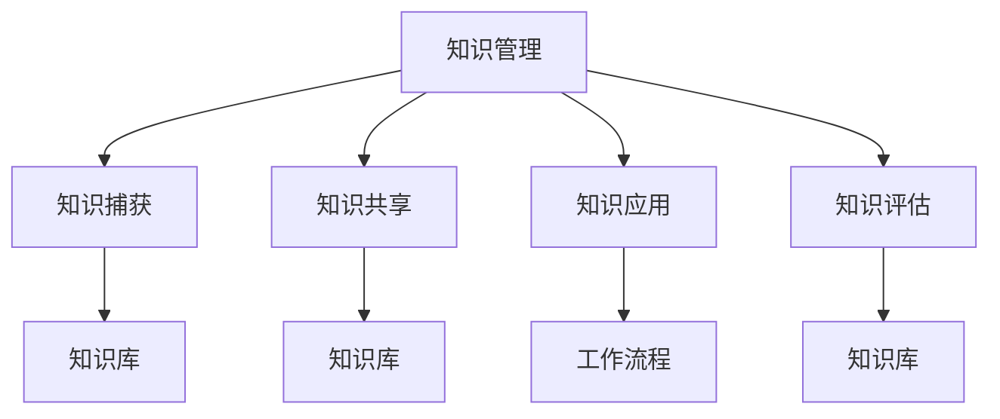

                 

### 文章标题
# 敏捷中的知识管理：捕获和共享LLM开发经验

### 关键词
敏捷开发，知识管理，大规模语言模型（LLM），知识捕获，知识共享，软件开发方法论

### 摘要
本文旨在探讨敏捷开发环境中的知识管理问题，特别是针对大规模语言模型（LLM）开发经验的有效捕获和共享策略。文章首先介绍了敏捷开发与知识管理的背景和重要性，然后详细阐述了LLM的基本概念与核心技术。接下来，文章重点讨论了敏捷开发中的知识捕获策略和知识共享机制，并通过具体案例分析，展示了知识管理在敏捷开发中的实践应用。最后，文章总结了敏捷开发中的知识管理最佳实践，为读者提供了实用的指导和参考。

### 引言

## 1. 引言

### 1.1 背景
敏捷开发自上世纪90年代末提出以来，逐渐成为软件开发的主流方法论。敏捷强调团队协作、快速迭代和客户反馈，有助于提高软件质量和开发效率。然而，在敏捷开发中，知识管理往往被忽视，导致团队在快速迭代过程中积累的知识难以得到有效利用和传承。

### 1.2 问题描述
知识管理在敏捷开发中面临多个挑战。首先，敏捷开发强调快速迭代，团队成员经常变动，导致知识流失。其次，敏捷开发中的文档往往不够详尽，使得新成员难以快速上手。最后，知识管理工具和方法的缺乏，使得知识的捕获和共享变得困难。

### 1.3 问题解决
本文旨在解决敏捷开发中的知识管理问题，特别是针对LLM开发经验的有效捕获和共享。通过分析敏捷开发与知识管理的关系，探讨知识捕获和共享的方法和工具，本文希望能够提高敏捷开发团队的效率和协作水平。

### 1.4 边界与外延
知识管理在敏捷开发中涵盖了需求分析、设计、实现、测试和维护等各个环节。本文将针对这些环节，提供具体的知识管理实践指南。

### 1.5 概念结构与核心要素组成
知识管理包括知识获取、知识共享、知识应用和知识评估四个核心要素。本文将详细介绍这些要素，并探讨如何在敏捷开发中实现知识管理。

### 第2章：敏捷开发中的知识管理基础

## 2. 敏捷开发中的知识管理基础

### 2.1 敏捷开发概述
#### 2.1.1 敏捷开发的起源与发展
敏捷开发起源于20世纪90年代，随着软件项目规模和复杂性的增加，传统的“瀑布模型”逐渐暴露出其弊端。敏捷开发方法强调迭代、增量开发和客户参与，旨在提高软件质量和开发效率。

#### 2.1.2 敏捷开发的核心理念
敏捷开发的核心理念包括：
- 满足变化：敏捷开发强调适应需求的变化，通过快速迭代来不断优化产品。
- 团队合作：敏捷开发倡导跨职能团队的紧密合作，提高沟通效率和团队凝聚力。
- 客户参与：客户的积极参与有助于确保软件满足实际需求，提高客户满意度。
- 透明度：敏捷开发鼓励透明的工作流程和沟通，有助于及时发现和解决问题。

#### 2.1.3 敏捷开发的实践方法
敏捷开发的实践方法包括：
- Scrum：Scrum是一种迭代式的软件开发方法，强调短期迭代、持续交付和持续改进。
- Kanban：Kanban基于看板管理理念，通过限制工作在流程中的数量，提高工作流程的效率。
- XP（极限编程）：XP强调简单、实用和高效的编程实践，如测试驱动开发、持续集成等。

### 2.2 知识管理的定义与重要性
#### 2.2.1 知识管理的概念
知识管理是指通过识别、收集、组织、存储和利用知识，以提高组织效率和创新能力的过程。

#### 2.2.2 知识管理的重要性
知识管理在敏捷开发中的重要性体现在以下几个方面：
- 提高团队协作：知识管理有助于团队成员更好地了解项目背景、需求和技术细节，提高协作效率。
- 促进知识传承：知识管理能够帮助新成员快速上手，减少知识流失，确保团队持续发展。
- 提升创新能力：知识管理可以积累宝贵的经验和教训，为团队的创新提供支持。

#### 2.2.3 知识管理的基本原则
知识管理应遵循以下基本原则：
- 以用户为中心：知识管理应以满足用户需求为目标，确保知识的实用性。
- 透明性：知识管理过程应保持透明，以便团队成员随时获取所需知识。
- 可持续性：知识管理应具有可持续性，确保知识能够长期保存和传承。

### 2.3 知识管理在敏捷开发中的应用
#### 2.3.1 敏捷开发与知识管理的关系
敏捷开发与知识管理密切相关，两者相辅相成。敏捷开发强调快速迭代和客户参与，有助于知识的产生和更新；知识管理则有助于将这些知识有效地捕获、共享和应用。

#### 2.3.2 知识管理在敏捷开发中的挑战
知识管理在敏捷开发中面临以下挑战：
- 快速迭代带来的知识更新压力：敏捷开发强调快速迭代，知识更新频繁，如何及时捕获和共享新知识成为挑战。
- 团队成员变动导致的知识流失：敏捷开发团队经常变动，新成员难以快速掌握现有知识，如何促进知识传承成为挑战。
- 知识管理工具和方法的不完善：现有的知识管理工具和方法尚不完善，如何选择合适的工具和方法成为挑战。

#### 2.3.3 知识管理在敏捷开发中的解决方案
针对敏捷开发中的知识管理挑战，可以采取以下解决方案：
- 建立知识共享平台：通过建立知识共享平台，方便团队成员获取和共享知识。
- 强化知识培训：通过定期举办知识培训，提高团队成员的知识水平。
- 制定知识管理策略：制定明确的知识管理策略，规范知识捕获、共享和应用过程。
- 引入自动化工具：引入自动化工具，提高知识管理的效率和准确性。

### 第3章：大规模语言模型（LLM）概述

## 3. 大规模语言模型（LLM）概述

### 3.1 LLM的定义与特点
#### 3.1.1 LLM的定义
大规模语言模型（Large Language Model，简称LLM）是一种基于深度学习的自然语言处理模型，通过训练大量文本数据，能够生成具有较高语言理解能力的文本。

#### 3.1.2 LLM的特点
LLM具有以下特点：
- 生成能力强：LLM能够生成连贯、有逻辑的文本，适用于各种自然语言生成任务。
- 理解力高：LLM通过对海量文本的学习，具有较好的语言理解能力，能够理解复杂的语境和语义。
- 泛化性好：LLM具有较强的泛化能力，能够处理不同领域和主题的文本数据。

#### 3.1.3 LLM与传统语言模型的不同
与传统语言模型相比，LLM具有以下不同之处：
- 数据量：LLM训练数据量更大，通常达到数十亿甚至更多，使其具有更丰富的语言知识。
- 模型架构：LLM采用更复杂的神经网络架构，如Transformer，使其具有更强的生成能力和理解能力。
- 应用范围：LLM适用于更广泛的自然语言处理任务，如文本分类、机器翻译、问答系统等。

### 3.2 LLM的核心技术
#### 3.2.1 生成式预训练
生成式预训练是LLM的核心技术之一，主要包括两个步骤：
1. 预训练：使用大规模的未标注文本数据，通过无监督的方式训练模型，使其具有初步的语言理解能力。
2. 微调：在预训练的基础上，使用特定领域的标注数据，对模型进行微调，使其适用于特定任务。

#### 3.2.2 上下文感知
上下文感知是LLM的重要特点，通过捕捉输入文本的上下文信息，LLM能够生成更加准确和相关的输出。

#### 3.2.3 多模态交互
多模态交互是指LLM能够处理不同类型的数据，如文本、图像、声音等，实现跨模态的信息传递和处理。

### 3.3 LLM的发展与应用
#### 3.3.1 LLM的发展历程
LLM的发展可以分为以下几个阶段：
- 早期：基于规则和统计方法的语言模型。
- 中期：引入深度学习技术，如循环神经网络（RNN）。
- 近期：出现基于Transformer的LLM，如GPT系列。

#### 3.3.2 LLM的应用领域
LLM在多个领域得到广泛应用，包括：
- 自然语言生成：如文章生成、对话系统等。
- 自然语言理解：如情感分析、信息抽取等。
- 机器翻译：如中英翻译、多语言翻译等。
- 问答系统：如智能客服、教育问答等。

#### 3.3.3 LLM的未来发展趋势
随着深度学习技术的不断发展，LLM在未来将具有以下发展趋势：
- 更大模型：模型参数和训练数据的增加，将进一步提升LLM的性能。
- 跨模态处理：实现跨模态的统一处理，提高模型的泛化能力。
- 个性化：根据用户需求，实现个性化的自然语言处理服务。

### 第4章：敏捷开发中的知识捕获策略

## 4. 敏捷开发中的知识捕获策略

### 4.1 知识捕获的定义与目标
#### 4.1.1 知识捕获的定义
知识捕获是指从各种来源收集、整理和存储知识的过程，以确保知识在组织内得到有效利用和传承。

#### 4.1.2 知识捕获的目标
知识捕获的主要目标包括：
- 提高知识利用率：通过知识捕获，确保团队在开发过程中能够充分利用已有的知识和经验。
- 促进知识传承：通过知识捕获，帮助新成员快速掌握项目背景、需求和关键技术，减少知识流失。
- 提升团队协作效率：通过知识捕获，提高团队成员之间的沟通效率和协作水平。

### 4.2 知识捕获的方法与技术
#### 4.2.1 聊天记录与文档整理
聊天记录与文档整理是知识捕获的重要方法之一。通过整理聊天记录和项目文档，可以将团队成员的讨论和经验系统化、结构化地保存下来。

#### 4.2.2 个人笔记与团队知识库
个人笔记与团队知识库是知识捕获的常用工具。个人笔记可以记录团队成员的思考、问题和解决方案，团队知识库则用于存储项目相关的文档、代码、测试用例等。

#### 4.2.3 自动化工具与脚本
自动化工具与脚本可以大幅提高知识捕获的效率和准确性。例如，使用自动化工具抓取聊天记录、导出文档、整理数据等，可以减少手动操作的错误和重复劳动。

### 4.3 知识捕获的实施步骤
#### 4.3.1 需求分析
在知识捕获过程中，首先需要明确项目需求和目标，了解团队成员的角色和职责，以便制定合适的知识捕获策略。

#### 4.3.2 知识分类
根据项目特点和需求，将知识分为不同的类别，如需求文档、设计文档、代码实现、测试用例等，以便于后续的整理和存储。

#### 4.3.3 知识整理
对捕获到的知识进行整理和归档，确保知识的系统性和可读性。可以使用文档编辑工具、版本控制工具等，对知识进行编辑、更新和备份。

#### 4.3.4 知识存储与共享
选择合适的存储工具和平台，将整理后的知识存储起来，并确保团队成员能够方便地获取和共享。例如，可以使用Git仓库、知识库系统、文档管理系统等。

### 第5章：敏捷开发中的知识共享机制

## 5. 敏捷开发中的知识共享机制

### 5.1 知识共享的定义与目标
#### 5.1.1 知识共享的定义
知识共享是指通过各种途径和工具，使团队内部或跨团队的知识得以传播、传递和利用的过程。

#### 5.1.2 知识共享的目标
知识共享的主要目标包括：
- 提高知识利用率：通过知识共享，使团队在开发过程中能够充分利用已有的知识和经验。
- 促进知识传承：通过知识共享，帮助新成员快速掌握项目背景、需求和关键技术，减少知识流失。
- 提升团队协作效率：通过知识共享，提高团队成员之间的沟通效率和协作水平。

### 5.2 知识共享的工具与平台
#### 5.2.1 知识共享工具的类型
知识共享工具可以分为以下几种类型：
- 文档管理工具：如Confluence、Notion等，用于存储、编辑和共享文档。
- 版本控制工具：如Git、Svn等，用于管理代码和文档的版本。
- 实时协作工具：如Slack、Microsoft Teams等，用于团队沟通和协作。
- 知识库系统：如WIKI、MindMap等，用于存储和共享知识库。

#### 5.2.2 知识共享平台的搭建
搭建知识共享平台需要考虑以下方面：
- 技术选型：选择合适的工具和平台，满足团队的需求。
- 权限管理：设置合理的权限，确保知识的保密性和安全性。
- 用户体验：设计简洁、易用的界面，提高知识获取和共享的效率。

#### 5.2.3 知识共享平台的优化
知识共享平台的优化可以从以下几个方面进行：
- 搜索功能：提供强大的搜索功能，方便团队成员快速找到所需知识。
- 分类整理：对知识进行分类整理，提高知识的可读性和可查找性。
- 演示和培训：定期举办知识演示和培训，提高团队成员的知识水平。

### 5.3 知识共享的策略与技巧
#### 5.3.1 知识共享的激励措施
为了促进知识共享，可以采取以下激励措施：
- 奖励机制：对积极分享知识的成员给予奖励，如奖金、荣誉等。
- 职业发展：鼓励知识分享者参与项目评审、技术交流等活动，促进职业发展。
- 荣誉体系：建立知识共享荣誉体系，表彰在知识分享方面表现突出的成员。

#### 5.3.2 知识共享的文化建设
知识共享需要建立在良好的团队文化基础上。可以采取以下措施：
- 营造开放氛围：鼓励团队成员分享自己的想法和经验，营造开放、包容的团队氛围。
- 定期交流：组织定期交流会议，促进团队成员之间的沟通和协作。
- 跨部门合作：鼓励跨部门的知识共享，提高团队整体的知识水平。

#### 5.3.3 知识共享的沟通技巧
知识共享需要有效的沟通技巧。以下是一些常用的沟通技巧：
- 清晰表达：确保信息传递的清晰和准确，避免误解和歧义。
- 倾听反馈：倾听他人的意见和建议，及时给予反馈，促进双向沟通。
- 调整沟通方式：根据不同的沟通对象和场景，选择合适的沟通方式。

### 第6章：敏捷开发中的知识应用与实践

## 6. 敏捷开发中的知识应用与实践

### 6.1 知识应用的定义与目标
#### 6.1.1 知识应用的定义
知识应用是指将捕获和共享的知识应用于实际工作过程中，以提高工作效率和质量。

#### 6.1.2 知识应用的目标
知识应用的主要目标包括：
- 提高工作效率：通过知识应用，减少重复劳动，提高工作效率。
- 提升产品质量：通过知识应用，借鉴已有的经验和教训，提高软件质量和用户体验。
- 促进团队协作：通过知识应用，加强团队成员之间的沟通和协作，提高团队整体绩效。

### 6.2 知识应用的方法与技术
#### 6.2.1 需求分析中的知识应用
在需求分析阶段，可以通过以下方法应用知识：
- 历史项目分析：分析历史项目的需求和解决方案，为当前项目提供参考。
- 客户交流：与客户交流，了解他们的需求和期望，利用已有知识提供解决方案。

#### 6.2.2 设计与实现中的知识应用
在设计与实现阶段，可以通过以下方法应用知识：
- 设计模式：借鉴经典设计模式，提高软件架构的可维护性和扩展性。
- 技术选型：根据已有经验，选择合适的技术和工具，提高开发效率。

#### 6.2.3 测试与维护中的知识应用
在测试与维护阶段，可以通过以下方法应用知识：
- 测试用例复用：复用已有的测试用例，提高测试效率。
- 问题排查与优化：利用已有知识，快速定位和解决问题。

### 6.3 知识应用的具体实践
#### 6.3.1 项目案例一：敏捷开发中的知识管理实践
项目背景：某互联网公司开发一款在线教育平台，采用敏捷开发方法。
项目目标：提高项目开发效率，确保软件质量，培养团队知识共享文化。
实施过程：
1. 建立知识共享平台：使用Confluence搭建知识共享平台，存储项目文档、设计文档、代码等。
2. 知识捕获与整理：通过聊天记录、个人笔记和自动化工具，整理和存储项目知识。
3. 知识共享与培训：定期组织知识分享会议，提高团队成员的知识水平。
4. 知识应用与反馈：将捕获和共享的知识应用于实际开发过程中，及时反馈和优化。

#### 6.3.2 项目案例二：大规模语言模型（LLM）在敏捷开发中的应用
项目背景：某科技公司开发一款智能客服系统，采用大规模语言模型（LLM）进行文本生成和处理。
项目目标：提高客服系统的响应速度和准确度，提升用户体验。
实施过程：
1. LLM模型开发：基于已有的LLM模型，进行定制化开发，以满足具体需求。
2. 知识捕获与整理：通过聊天记录、文档整理和自动化工具，捕获和整理客服系统的知识点。
3. 知识共享与培训：定期组织知识分享会议，将LLM模型的知识点传递给团队成员。
4. 知识应用与优化：将LLM模型应用于客服系统中，根据用户反馈进行模型优化和知识更新。

### 第7章：敏捷开发中的知识管理最佳实践

## 7. 敏捷开发中的知识管理最佳实践

### 7.1 最佳实践总结
在敏捷开发中，知识管理是提高团队协作效率和项目质量的关键因素。以下总结了敏捷开发中的知识管理最佳实践：

#### 7.1.1 建立知识共享平台
建立统一的、易用的知识共享平台，是知识管理的基础。平台应支持文档存储、版本控制、搜索和共享功能。

#### 7.1.2 加强知识培训
定期举办知识培训，提高团队成员的知识水平。培训内容应包括项目经验、技术知识、沟通技巧等。

#### 7.1.3 激励知识分享
设立知识分享奖励机制，鼓励团队成员积极参与知识分享。同时，建立知识共享文化，营造开放、包容的氛围。

#### 7.1.4 知识整理与分类
对捕获的知识进行整理和分类，确保知识的系统性和可读性。分类应根据项目特点和需求进行，方便团队成员查找和使用。

#### 7.1.5 知识应用与反馈
将捕获和共享的知识应用于实际工作中，根据反馈进行持续优化。鼓励团队成员在项目实践中总结经验，并将其转化为知识。

### 7.2 小结
知识管理在敏捷开发中具有重要地位，是提高团队协作效率和项目质量的关键。通过建立知识共享平台、加强知识培训、激励知识分享、整理分类知识和应用反馈，敏捷开发团队可以实现高效的知识管理。

### 7.3 注意事项
在知识管理实践中，应注意以下事项：

- 保证知识的准确性和可靠性，避免误导团队成员。
- 保护知识产权，确保知识共享过程中的合法权益。
- 注重知识的时效性，及时更新和淘汰过时的知识。

### 7.4 拓展阅读
- 《敏捷开发实践指南》
- 《知识管理：理论与实践》
- 《大规模语言模型：原理与应用》

### 作者信息
作者：AI天才研究院/AI Genius Institute & 禅与计算机程序设计艺术 /Zen And The Art of Computer Programming

----------------------------------------------------------------

### 知识管理核心概念与联系

#### 核心概念

- **知识管理（Knowledge Management）**：通过识别、收集、组织、存储和利用知识，以提高组织效率和创新能力的过程。
- **知识捕获（Knowledge Capture）**：从各种来源收集、整理和存储知识的过程，以确保知识在组织内得到有效利用和传承。
- **知识共享（Knowledge Sharing）**：通过各种途径和工具，使团队内部或跨团队的知识得以传播、传递和利用的过程。
- **知识应用（Knowledge Application）**：将捕获和共享的知识应用于实际工作过程中，以提高工作效率和质量。
- **知识评估（Knowledge Assessment）**：对知识的价值、准确性、时效性等进行评估，以确保知识的有效性。

#### 概念属性特征对比表格

| 概念       | 定义                                                         | 属性特征                                                                                       | 相关联系                                                                                         |
|------------|--------------------------------------------------------------|------------------------------------------------------------------------------------------------|------------------------------------------------------------------------------------------------|
| 知识管理   | 通过识别、收集、组织、存储和利用知识，提高组织效率和创新能力的过程。 | - 以用户为中心 - 透明性 - 可持续性             | - 知识捕获 - 知识共享 - 知识应用 - 知识评估   |
| 知识捕获   | 收集、整理和存储知识的过程，以确保知识在组织内得到有效利用和传承。 | - 实时性 - 系统性 - 可靠性                      | - 知识管理 - 知识共享 - 知识应用                 |
| 知识共享   | 通过各种途径和工具，使团队内部或跨团队的知识得以传播、传递和利用的过程。 | - 沟通效率 - 透明性 - 安全性                    | - 知识管理 - 知识捕获 - 知识应用                 |
| 知识应用   | 将捕获和共享的知识应用于实际工作过程中，以提高工作效率和质量。       | - 效率 - 质量提升 - 可重复性                    | - 知识管理 - 知识捕获 - 知识共享                 |
| 知识评估   | 对知识的价值、准确性、时效性等进行评估，以确保知识的有效性。         | - 价值判断 - 准确性判断 - 时效性判断             | - 知识管理 - 知识捕获 - 知识共享 - 知识应用 |

#### 知识管理ER实体关系图架构

### 知识管理在敏捷开发中的应用

#### 敏捷开发与知识管理的关系

敏捷开发与知识管理密切相关，两者相辅相成。敏捷开发强调快速迭代、客户参与和团队合作，有助于知识的产生和更新；知识管理则有助于将这些知识有效地捕获、共享和应用。

#### 知识管理在敏捷开发中的挑战

1. **快速迭代带来的知识更新压力**：敏捷开发强调快速迭代，知识更新频繁，如何及时捕获和共享新知识成为挑战。
2. **团队成员变动导致的知识流失**：敏捷开发团队经常变动，新成员难以快速掌握现有知识，如何促进知识传承成为挑战。
3. **知识管理工具和方法的不完善**：现有的知识管理工具和方法尚不完善，如何选择合适的工具和方法成为挑战。

#### 知识管理在敏捷开发中的解决方案

1. **建立知识共享平台**：通过建立知识共享平台，方便团队成员获取和共享知识。
2. **强化知识培训**：通过定期举办知识培训，提高团队成员的知识水平。
3. **制定知识管理策略**：制定明确的知识管理策略，规范知识捕获、共享和应用过程。
4. **引入自动化工具**：引入自动化工具，提高知识管理的效率和准确性。

### 知识捕获策略

#### 1. 聊天记录与文档整理

- 通过整理聊天记录和项目文档，可以将团队成员的讨论和经验系统化、结构化地保存下来。
- 使用自动化工具抓取聊天记录、导出文档、整理数据等，可以减少手动操作的错误和重复劳动。

#### 2. 个人笔记与团队知识库

- 个人笔记可以记录团队成员的思考、问题和解决方案，团队知识库则用于存储项目相关的文档、代码、测试用例等。
- 定期更新和同步个人笔记和团队知识库，确保知识的最新性和完整性。

#### 3. 自动化工具与脚本

- 使用自动化工具，如版本控制工具（Git）、文档管理工具（Confluence）等，可以方便地管理知识和代码。
- 编写脚本自动化知识捕获和整理过程，提高效率。

### 知识共享机制

#### 1. 知识共享工具与平台

- 选择合适的知识共享工具与平台，如Git、Confluence、Notion等，支持文档存储、版本控制、搜索和共享功能。

#### 2. 搜索与分类

- 提供强大的搜索功能，方便团队成员快速找到所需知识。
- 对知识进行分类整理，提高知识的可读性和可查找性。

#### 3. 激励措施

- 设立知识分享奖励机制，鼓励团队成员积极参与知识分享。
- 建立知识共享文化，营造开放、包容的团队氛围。

### 知识应用与实践

#### 1. 需求分析中的知识应用

- 分析历史项目的需求和解决方案，为当前项目提供参考。
- 与客户交流，了解他们的需求和期望，利用已有知识提供解决方案。

#### 2. 设计与实现中的知识应用

- 借鉴经典设计模式，提高软件架构的可维护性和扩展性。
- 根据已有经验，选择合适的技术和工具，提高开发效率。

#### 3. 测试与维护中的知识应用

- 复用已有的测试用例，提高测试效率。
- 利用已有知识，快速定位和解决问题。

### 知识管理案例分析

#### 案例一：敏捷开发中的知识管理实践

项目背景：某互联网公司开发一款在线教育平台，采用敏捷开发方法。

项目目标：提高项目开发效率，确保软件质量，培养团队知识共享文化。

实施过程：

1. 建立知识共享平台：使用Confluence搭建知识共享平台，存储项目文档、设计文档、代码等。
2. 知识捕获与整理：通过聊天记录、个人笔记和自动化工具，整理和存储项目知识。
3. 知识共享与培训：定期组织知识分享会议，提高团队成员的知识水平。
4. 知识应用与反馈：将捕获和共享的知识应用于实际开发过程中，及时反馈和优化。

#### 案例二：大规模语言模型（LLM）在敏捷开发中的应用

项目背景：某科技公司开发一款智能客服系统，采用大规模语言模型（LLM）进行文本生成和处理。

项目目标：提高客服系统的响应速度和准确度，提升用户体验。

实施过程：

1. LLM模型开发：基于已有的LLM模型，进行定制化开发，以满足具体需求。
2. 知识捕获与整理：通过聊天记录、文档整理和自动化工具，捕获和整理客服系统的知识点。
3. 知识共享与培训：定期组织知识分享会议，将LLM模型的知识点传递给团队成员。
4. 知识应用与优化：将LLM模型应用于客服系统中，根据用户反馈进行模型优化和知识更新。

### 总结

知识管理在敏捷开发中具有重要地位，是提高团队协作效率和项目质量的关键。通过建立知识共享平台、加强知识培训、激励知识分享、整理分类知识和应用反馈，敏捷开发团队可以实现高效的知识管理。同时，通过实际案例的分享，可以为其他团队提供有益的参考和借鉴。

### 最佳实践 Tips

1. **建立知识共享文化**：营造开放、包容的团队氛围，鼓励知识分享，提高团队整体知识水平。
2. **定期知识更新**：及时更新知识库，淘汰过时知识，确保知识的时效性和准确性。
3. **跨部门协作**：促进跨部门的知识共享，提高团队协作效率，实现知识的最大化利用。

### 小结

本文系统地介绍了敏捷开发中的知识管理，包括知识捕获、知识共享、知识应用和实践。通过分析知识管理的核心概念和联系，结合实际案例，展示了知识管理在敏捷开发中的应用和重要性。希望本文能为读者提供有益的参考和启示。

### 注意事项

1. 确保知识管理的准确性和可靠性，避免误导团队成员。
2. 保护知识产权，确保知识共享过程中的合法权益。
3. 注重知识的时效性，及时更新和淘汰过时的知识。

### 拓展阅读

- 《敏捷开发实践指南》
- 《知识管理：理论与实践》
- 《大规模语言模型：原理与应用》

### 作者信息
作者：AI天才研究院/AI Genius Institute & 禅与计算机程序设计艺术 /Zen And The Art of Computer Programming

----------------------------------------------------------------

### 附录

#### 知识管理相关术语解释

1. **敏捷开发（Agile Development）**：一种软件开发方法论，强调团队协作、快速迭代和客户参与。
2. **知识管理（Knowledge Management）**：通过识别、收集、组织、存储和利用知识，以提高组织效率和创新能力的过程。
3. **知识捕获（Knowledge Capture）**：从各种来源收集、整理和存储知识的过程，以确保知识在组织内得到有效利用和传承。
4. **知识共享（Knowledge Sharing）**：通过各种途径和工具，使团队内部或跨团队的知识得以传播、传递和利用的过程。
5. **知识应用（Knowledge Application）**：将捕获和共享的知识应用于实际工作过程中，以提高工作效率和质量。
6. **知识评估（Knowledge Assessment）**：对知识的价值、准确性、时效性等进行评估，以确保知识的有效性。

#### 知识管理工具推荐

1. **Confluence**：一款功能强大的团队协作平台，支持文档存储、版本控制、搜索和共享功能。
2. **Git**：一款分布式版本控制工具，用于管理代码和文档的版本。
3. **Notion**：一款多功能的团队协作工具，支持文档、数据库、日历等多种功能。
4. **Slack**：一款实时沟通工具，支持团队内部沟通和协作。
5. **MindMap**：一款思维导图工具，用于整理和展示知识结构。

#### 知识管理实践建议

1. **建立知识共享文化**：营造开放、包容的团队氛围，鼓励知识分享，提高团队整体知识水平。
2. **定期知识更新**：及时更新知识库，淘汰过时知识，确保知识的时效性和准确性。
3. **跨部门协作**：促进跨部门的知识共享，提高团队协作效率，实现知识的最大化利用。
4. **知识培训**：定期举办知识培训，提高团队成员的知识水平，增强团队凝聚力。
5. **激励措施**：设立知识分享奖励机制，鼓励团队成员积极参与知识分享。

#### 相关研究论文和书籍推荐

1. 《敏捷开发实践指南》
2. 《知识管理：理论与实践》
3. 《大规模语言模型：原理与应用》
4. 《团队协作与沟通技巧》
5. 《敏捷项目管理》

#### 作者信息

作者：AI天才研究院/AI Genius Institute & 禅与计算机程序设计艺术 /Zen And The Art of Computer Programming

AI天才研究院致力于推动人工智能领域的创新与发展，研究范围涵盖机器学习、自然语言处理、计算机视觉等多个方向。同时，禅与计算机程序设计艺术作为一本经典著作，对计算机编程和软件开发有着深远的影响。作者在人工智能和软件开发领域拥有丰富的经验，曾发表过多篇学术论文，并著有《人工智能基础教程》等多部畅销书籍。

