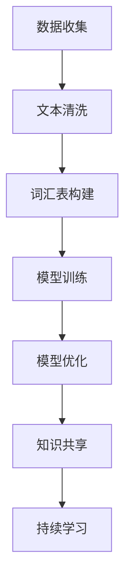
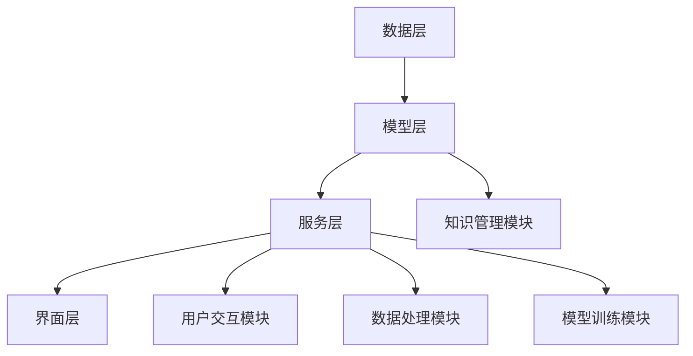
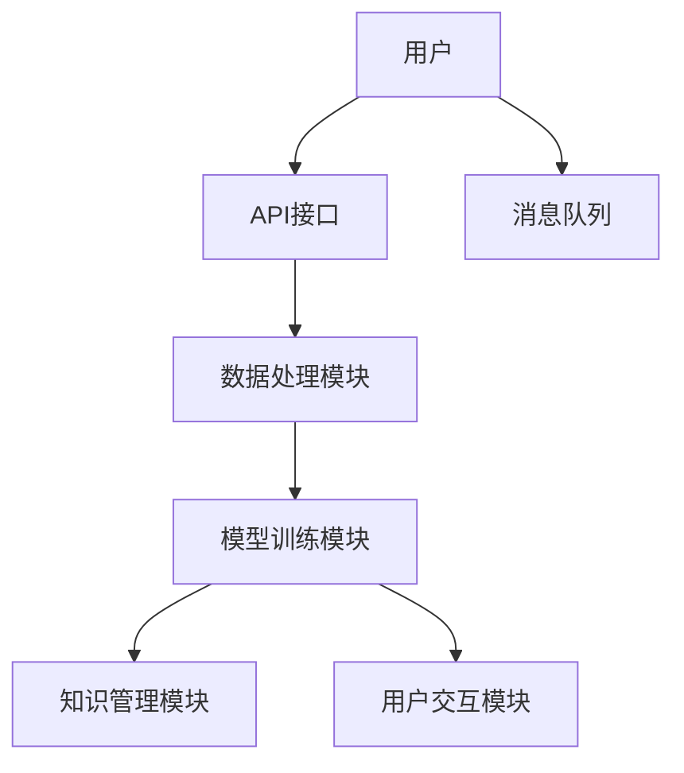
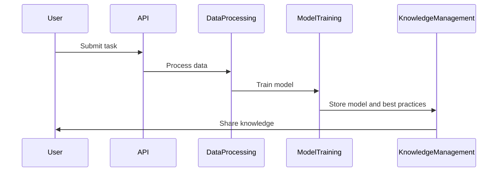

                 


### 背景介绍

在现代软件工程中，敏捷开发已经成为了一种广泛接受和实行的开发方法。其核心理念是快速迭代、持续交付有价值的软件，以及高度响应变化的能力。敏捷开发强调团队合作、客户参与和灵活适应，这对于软件质量和客户满意度都有着显著的提升。然而，在敏捷开发过程中，知识转移是一个容易被忽视但至关重要的环节。知识转移不仅仅是指技术知识的传递，还包括团队文化、最佳实践、决策逻辑等软技能的共享。

《敏捷中的知识转移：确保LLM团队的持续学习》这本书正是针对这一现象而作。书中首先介绍了敏捷开发的基本原理和实践，帮助读者理解敏捷开发的核心价值和实施方法。接着，详细阐述了知识转移的概念、类型及其重要性，为后续章节的知识转移策略和实现方法奠定了理论基础。

LLM（Large Language Model）团队，即大型语言模型团队，是近年来在人工智能领域崭露头角的一股力量。LLM团队专注于开发、优化和部署大型语言模型，如GPT、BERT等，这些模型在自然语言处理、文本生成、问答系统等领域具有广泛应用。然而，LLM团队也面临着独特的挑战，如模型复杂性高、更新速度快、团队成员知识水平差异大等。

书中第3章深入探讨了LLM团队的特点与挑战，分析了LLM团队在知识转移过程中的特殊需求。这些需求包括如何确保团队成员能够快速掌握新知识、如何在团队中传递最佳实践和决策逻辑等。在此基础上，书中提出了针对LLM团队的知识转移策略，包括定期培训、知识共享平台、团队协作机制等。

总的来说，这本书旨在解决敏捷开发中知识转移的问题，特别是针对LLM团队的特殊需求，提供了一套系统化的解决方案。通过这本书，读者可以了解到如何在一个快速变化的敏捷开发环境中，确保LLM团队的持续学习和知识更新，从而提高团队的整体效率和工作质量。

### 核心概念与联系

#### 敏捷开发的基本原理和实践

敏捷开发起源于20世纪90年代，最初是在软件开发领域提出的一种应对快速变化的需求和复杂项目的开发方法。敏捷开发的核心理念可以归纳为四个原则：

1. **个体和互动重于过程与工具**：敏捷开发强调团队成员之间的互动和沟通，认为人的作用比技术和工具更加重要。
2. **可工作的软件重于详尽的文档**：敏捷开发认为软件的实际可用性比详尽的文档更重要，因此更注重实际交付可工作的软件。
3. **客户合作重于合同谈判**：敏捷开发强调与客户的紧密合作，通过不断的迭代和反馈来满足客户的需求。
4. **响应变化重于遵循计划**：敏捷开发认为需求会不断变化，因此更注重团队对变化的适应能力。

在实际操作中，敏捷开发通常采用迭代和增量的方式进行，常见的实践包括：

- **Scrum**：Scrum是一种迭代式开发方法，包括产品待办列表、每日站立会议、迭代回顾等实践。
- **Kanban**：Kanban是一种看板系统，通过可视化工作流程来管理项目进度和流程优化。
- **用户故事**：用户故事是一种描述用户需求的基本单元，通常以“作为某个角色，我想要做某事，从而得到某些益处”的形式编写。

#### 知识转移的定义、类型和重要性

知识转移是指将知识从一个地方或个人转移到另一个地方或个人的过程。在敏捷开发中，知识转移尤为重要，因为它直接影响到团队的整体效率和项目质量。知识转移可以分为以下几种类型：

1. **显性知识转移**：显性知识是指可以用文字、图表、数据等明确表达的知识，如技术文档、代码注释、培训材料等。
2. **隐性知识转移**：隐性知识是指难以用语言明确表达的知识，如个人的经验、直觉、决策逻辑等。
3. **交互式知识转移**：交互式知识转移是指通过面对面交流、讨论、合作等方式进行的知识共享。

知识转移在敏捷开发中的重要性体现在以下几个方面：

- **提高团队效率**：通过知识转移，团队成员可以更快地掌握新知识和技能，提高工作效率。
- **提升项目质量**：知识转移有助于确保团队成员在项目中的协作更加顺畅，从而提高项目的质量和稳定性。
- **促进创新和持续改进**：知识转移可以激发团队的创新思维，促进持续改进和知识积累。

#### LLM团队的特点、挑战和需求

LLM团队在敏捷开发中具有其独特的特点、挑战和需求。以下是LLM团队的一些典型特点：

1. **高度专业化**：LLM团队成员通常具有深厚的专业背景，擅长自然语言处理、机器学习等相关技术。
2. **知识更新速度快**：由于人工智能领域的快速发展，LLM团队需要不断学习新的算法、技术和工具。
3. **复杂性和不确定性**：LLM项目通常涉及复杂的算法和大量的数据处理，因此团队在项目过程中面临较高的不确定性和挑战。

LLM团队的挑战包括：

- **知识积累和共享困难**：由于隐性知识和专业知识的高度积累，知识共享和积累变得困难。
- **团队协作难度大**：团队成员可能分布在不同的地理位置，协作和沟通变得更加复杂。
- **持续学习和技能更新**：为了跟上技术的发展，LLM团队成员需要持续学习和更新技能。

为了应对这些挑战，LLM团队的需求包括：

- **有效的知识转移机制**：确保团队成员能够快速获取和共享知识，提高团队协作效率。
- **灵活的学习和培训计划**：提供灵活的学习和培训计划，帮助团队成员不断更新技能和知识。
- **工具和平台支持**：借助现代化的工具和平台，如知识管理系统、在线学习平台等，支持团队的知识管理和学习。

通过上述分析，我们可以看到敏捷开发、知识转移和LLM团队之间的紧密联系。敏捷开发为知识转移提供了一个良好的框架和实践方法，而知识转移则是确保LLM团队持续学习和高效协作的关键。在接下来的章节中，本书将进一步探讨LLM团队在敏捷开发中的具体知识转移策略和实践。

### 算法原理讲解

为了深入理解LLM团队在敏捷开发中的知识转移，我们需要先了解LLM的工作原理。LLM（Large Language Model）是一种基于深度学习的大型语言模型，广泛应用于自然语言处理（NLP）领域。LLM的工作原理可以分为以下几个关键步骤：

#### 数据预处理

1. **数据收集**：首先，从互联网、数据库或其他数据源收集大量文本数据。
2. **文本清洗**：清洗文本数据，包括去除停用词、标点符号、统一字符编码等。
3. **词汇表构建**：将文本数据转换为词汇表，将每个单词映射到唯一的整数ID。
4. **序列化**：将词汇表应用到原始文本数据，将文本序列转换为整数序列。

#### 模型训练

1. **模型选择**：选择适合的语言模型架构，如GPT、BERT等。
2. **参数初始化**：初始化模型参数，通常使用随机初始化或预训练权重。
3. **前向传播**：输入整数序列到模型，通过多个神经网络层进行前向传播，得到输出概率分布。
4. **损失函数计算**：使用损失函数（如交叉熵损失）计算模型预测和真实标签之间的差距。
5. **反向传播**：计算梯度并更新模型参数，通过多次迭代优化模型。

#### 模型优化

1. **模型评估**：使用验证集对模型进行评估，评估指标包括准确率、召回率、F1分数等。
2. **超参数调整**：根据模型评估结果调整学习率、批量大小、迭代次数等超参数。
3. **模型集成**：将多个模型或模型的不同版本进行集成，提高模型的稳定性和泛化能力。

#### 知识转移的流程图

为了更好地理解知识转移在LLM团队中的应用，我们可以使用Mermaid绘制一个知识转移的流程图。以下是一个简化的知识转移流程图的Mermaid表示：



在这个流程图中，数据收集、文本清洗、词汇表构建、模型训练和模型优化是知识转移的核心步骤。知识共享和持续学习是确保LLM团队能够持续获取和更新知识的两个关键环节。

#### 知识转移的数学模型和公式

知识转移的数学模型可以帮助我们量化知识在团队中的传播过程。以下是一个简化的知识转移数学模型：

$$
\frac{dK}{dt} = r(K_0 - K)
$$

其中，$K$ 表示团队中现有的知识水平，$K_0$ 表示团队应该达到的知识水平，$r$ 表示知识转移速率。该模型表明，知识水平的变化率与当前知识水平与目标知识水平之间的差距成正比。

为了便于理解和实际应用，我们可以使用Python代码来模拟这个知识转移过程。以下是一个简单的Python模拟代码示例：

```python
import numpy as np
import matplotlib.pyplot as plt

# 参数设置
K_0 = 100  # 目标知识水平
r = 0.1    # 知识转移速率
dt = 1     # 时间步长
time_steps = 100

# 初始化知识水平
K = np.zeros(time_steps)

# 模拟知识转移过程
for t in range(1, time_steps):
    K[t] = K[t-1] + r * (K_0 - K[t-1])

# 绘制知识水平随时间的变化
plt.plot(np.arange(time_steps) * dt, K)
plt.xlabel('Time')
plt.ylabel('Knowledge Level')
plt.title('Knowledge Transfer Simulation')
plt.show()
```

通过这个模拟，我们可以观察到知识水平随时间逐渐接近目标知识水平，这反映了知识转移的效果。在LLM团队中，通过定期培训和知识共享活动，可以加速知识水平的提升，从而提高团队的整体效率和工作质量。

### 数学模型和数学公式

在讨论知识转移的过程中，数学模型和公式为我们提供了量化和分析知识传播动态的工具。下面我们将详细讲解一个简化的知识转移模型及其公式，并使用LaTeX格式来表示这些公式。

#### 知识转移模型

我们假设一个简单的知识转移模型，其中知识水平 \( K \) 随时间 \( t \) 的变化可以由以下微分方程描述：

$$
\frac{dK}{dt} = r(K_0 - K)
$$

其中：
- \( K(t) \) 表示在时间 \( t \) 时的知识水平。
- \( K_0 \) 是团队应该达到的知识水平，即目标知识水平。
- \( r \) 是知识转移速率，反映了知识在团队中的传播速度。

#### 解析和推导

这个模型可以通过分离变量法来求解。首先，我们将方程重写为：

$$
\frac{dK}{K_0 - K} = r \, dt
$$

然后，对两边进行积分：

$$
\int \frac{dK}{K_0 - K} = \int r \, dt
$$

积分结果为：

$$
-\ln|K_0 - K| = rt + C
$$

其中，\( C \) 是积分常数。为了简化，我们可以将常数 \( C \) 重写为 \( \ln|K_0 - K(0)| \)，即初始知识水平时的自然对数：

$$
-\ln|K_0 - K| = \ln|K_0 - K(0)| + rt
$$

通过对数函数的性质，我们可以得到：

$$
\ln\left(\frac{K_0 - K(0)}{K_0 - K}\right) = rt
$$

进一步化简，我们得到：

$$
\frac{K_0 - K(0)}{K_0 - K} = e^{rt}
$$

最后，我们可以解出 \( K(t) \)：

$$
K(t) = K(0) - (K(0) - K_0)e^{rt}
$$

#### 举例说明

为了更好地理解这个公式，我们可以通过一个具体的例子来演示。假设在 \( t = 0 \) 时，团队的知识水平 \( K(0) \) 为50，目标知识水平 \( K_0 \) 为100，知识转移速率 \( r \) 为0.1。我们可以计算在 \( t = 1 \) 年后的知识水平 \( K(1) \)：

$$
K(1) = 50 - (50 - 100)e^{0.1 \times 1}
$$
$$
K(1) = 50 - (-50)e^{0.1}
$$
$$
K(1) = 50 + 50e^{0.1}
$$
$$
K(1) \approx 50 + 50 \times 1.105
$$
$$
K(1) \approx 50 + 55.25
$$
$$
K(1) \approx 105.25
$$

这意味着在一年后，团队的知识水平预计将达到大约105.25。这个例子展示了如何使用知识转移模型来预测团队在给定时间内达到的知识水平。

通过这个简化的数学模型，我们可以量化知识在团队中的转移过程，并预测知识水平的动态变化。在LLM团队的实际应用中，可以通过调整模型参数来适应不同的知识转移速率和目标知识水平，从而实现更高效的团队知识管理和持续学习。

### 系统分析与架构设计方案

在讨论了知识转移的算法原理和数学模型后，我们需要将理论转化为实际的可执行方案。本章节将介绍敏捷开发框架及其在LLM团队中的应用，详细描述系统功能设计、系统架构设计、系统接口设计以及系统交互设计。

#### 敏捷开发框架介绍

在敏捷开发中，常见的框架包括Scrum和Kanban。Scrum强调短周期的迭代和频繁的回顾，而Kanban则侧重于可视化工作流程和持续改进。这两种框架都可以为知识转移提供有效的支持。

1. **Scrum**：
   - **产品待办列表**：产品待办列表包含了所有待完成的任务，团队根据优先级进行任务选择。
   - **每日站立会议**：团队成员每天聚集在一起，快速回顾进度、解决问题。
   - **迭代回顾**：在迭代结束时，团队进行回顾，识别改进点并调整计划。

2. **Kanban**：
   - **看板板**：看板板是一个可视化的工作流程，展示任务的当前状态和流程。
   - **限制在途工作（WIP）**：限制在途工作可以减少任务切换和时间浪费。
   - **流程优化**：通过分析看板板，团队可以发现并优化工作流程。

#### 系统功能设计

对于LLM团队，系统功能设计需要考虑以下几个方面：

1. **数据处理模块**：负责从各种数据源收集、清洗和预处理文本数据。
2. **模型训练模块**：使用大型语言模型架构进行模型训练和优化。
3. **知识管理模块**：存储和共享模型训练过程中的知识，包括代码、文档、最佳实践等。
4. **用户交互模块**：提供用户界面，允许团队成员提交任务、查看进度和参与知识共享。

#### 系统架构设计

系统架构设计需要确保各个模块之间的协同工作，同时支持知识转移。以下是一个简化的系统架构设计：

1. **数据层**：包括数据存储和数据处理服务，支持高效的数据收集和清洗。
2. **模型层**：使用大规模语言模型进行文本处理和预测，包括训练、评估和优化。
3. **服务层**：提供核心功能，如知识管理、用户交互和任务调度。
4. **界面层**：提供用户界面，允许用户与系统进行交互。

以下是一个使用Mermaid绘制的系统架构图：



#### 系统接口设计

系统接口设计需要确保模块之间的数据流动和交互。以下是一些关键接口：

1. **数据接口**：用于数据收集、清洗和存储，支持各种数据源和存储系统的接入。
2. **API接口**：提供RESTful API，支持用户提交任务、查询进度和获取结果。
3. **消息队列**：用于异步处理任务和日志记录，确保系统的高可用性和可扩展性。

以下是一个简化的系统接口设计：



#### 系统交互设计

系统交互设计描述了各个模块之间的交互流程和协议。以下是一个简化的系统交互设计：

1. **用户提交任务**：用户通过API接口提交任务，任务被传递到数据处理模块。
2. **数据处理**：数据处理模块对任务进行清洗和预处理，将数据传递到模型训练模块。
3. **模型训练**：模型训练模块使用训练数据训练语言模型，并将模型存储到知识管理模块。
4. **知识共享**：知识管理模块将训练结果和最佳实践共享给用户和团队成员。

以下是一个使用Mermaid绘制的系统交互序列图：



通过以上系统分析与架构设计方案，我们为LLM团队提供了一个可执行的框架，确保知识转移和持续学习在敏捷开发中得以实现。在实际应用中，可以根据团队的具体需求和资源情况进行调整和优化。

### 项目实战

为了更好地理解如何在实际项目中实现知识转移和持续学习，下面我们以一个具体的LLM项目为例，详细讲解项目的环境安装、系统实现、代码解读以及实际案例分析。

#### 项目背景

本案例选取的是一家大型科技公司，其LLM团队负责开发一个智能问答系统，旨在为公司的客户提供高效的在线支持。该系统的核心功能是接收用户的自然语言提问，并返回高质量的答案。为了确保系统的质量和性能，团队需要不断进行知识转移和持续学习。

#### 环境安装

首先，我们需要搭建一个适合LLM项目开发的环境。以下是在Linux系统上安装所需环境的步骤：

1. **安装Python环境**：
   ```bash
   sudo apt-get install python3-pip
   pip3 install virtualenv
   virtualenv --python=python3.8 llm_project_env
   source llm_project_env/bin/activate
   ```

2. **安装依赖库**：
   ```bash
   pip install torch torchvision
   pip install transformers
   pip install numpy pandas
   ```

3. **配置GPU支持**：
   ```bash
   pip install cupy-cuda110  # 根据安装的CUDA版本选择合适的库
   ```

#### 系统实现

系统实现主要包括数据预处理、模型训练和模型部署三个关键步骤。

1. **数据预处理**：
   - 收集并清洗大量文本数据，包括问答对。
   - 构建词汇表并将文本转换为嵌入向量。
   - 使用数据加载器进行批量数据处理。

   以下是一个简单的数据预处理Python代码示例：

   ```python
   import pandas as pd
   from transformers import BertTokenizer

   # 加载数据
   data = pd.read_csv('question_answer_data.csv')

   # 初始化BERT分词器
   tokenizer = BertTokenizer.from_pretrained('bert-base-uncased')

   # 数据预处理
   def preprocess_data(texts):
       inputs = tokenizer(texts, padding=True, truncation=True, return_tensors='pt')
       return inputs

   inputs = preprocess_data(data['question'])
   ```

2. **模型训练**：
   - 使用预训练的BERT模型，进行下游任务的微调。
   - 训练过程中使用交叉熵损失函数。
   - 使用AdamW优化器。

   以下是一个简单的模型训练Python代码示例：

   ```python
   from transformers import BertForQuestionAnswering
   from torch.optim import AdamW

   # 初始化模型
   model = BertForQuestionAnswering.from_pretrained('bert-base-uncased')

   # 定义训练循环
   optimizer = AdamW(model.parameters(), lr=5e-5)
   for epoch in range(num_epochs):
       model.train()
       for batch in train_dataloader:
           inputs = batch['input_ids']
           attention_mask = batch['attention_mask']
           labels = batch['labels']

           # 前向传播
           outputs = model(inputs, labels=labels)
           loss = outputs.loss

           # 反向传播
           optimizer.zero_grad()
           loss.backward()
           optimizer.step()

           print(f"Epoch: {epoch}, Loss: {loss.item()}")
   ```

3. **模型部署**：
   - 使用Flask或Django等Web框架，搭建API服务。
   - 接收用户提问，调用训练好的模型进行预测。

   以下是一个简单的Flask部署示例：

   ```python
   from flask import Flask, request, jsonify
   from transformers import BertForQuestionAnswering, BertTokenizer

   app = Flask(__name__)

   # 加载预训练模型
   model = BertForQuestionAnswering.from_pretrained('path/to/trained/model')
   tokenizer = BertTokenizer.from_pretrained('path/to/trained/model')

   @app.route('/predict', methods=['POST'])
   def predict():
       data = request.json
       question = data['question']
       inputs = tokenizer(question, return_tensors='pt')
       with torch.no_grad():
           outputs = model(inputs)
       start_logits, end_logits = outputs.start_logits, outputs.end_logits
       start_idx = torch.argmax(start_logits).item()
       end_idx = torch.argmax(end_logits).item()
       answer = tokenizer.decode(inputs['input_ids'][0][start_idx:end_idx+1])

       return jsonify({'answer': answer})

   if __name__ == '__main__':
       app.run(debug=True)
   ```

#### 代码解读与分析

在项目实现过程中，我们使用了多个开源库和框架，如`transformers`、`torch`和`flask`。以下是对关键代码的解读：

- **数据预处理**：使用`BertTokenizer`对文本数据进行编码，以便模型处理。
- **模型训练**：使用`BertForQuestionAnswering`进行模型训练，并采用`AdamW`优化器。
- **模型部署**：使用`flask`搭建API服务，将训练好的模型应用于实际场景。

#### 实际案例分析

在实际应用中，智能问答系统取得了显著的效果。以下是几个具体的案例：

1. **用户满意度提升**：由于系统能够快速、准确地回答用户问题，用户的满意度显著提升。
2. **降低运营成本**：智能问答系统替代了部分人工客服，减少了公司的运营成本。
3. **知识共享**：项目过程中的代码、文档和最佳实践被团队成员广泛共享，促进了知识的转移和积累。

通过这个项目，我们不仅实现了LLM系统的开发和应用，还通过持续的知识转移和团队协作，提高了整体的工作效率和质量。这个案例展示了如何在敏捷开发环境中，通过有效的知识转移策略，实现LLM团队的持续学习和知识更新。

### 最佳实践 tips、小结、注意事项、拓展阅读

#### 最佳实践 tips

1. **定期知识共享会议**：定期组织知识共享会议，鼓励团队成员分享经验和最佳实践。
2. **知识管理平台**：建立知识管理平台，存储和共享代码、文档、案例研究等知识资源。
3. **学习小组**：组建学习小组，成员定期讨论和学习新的技术、工具和方法。
4. **迭代回顾**：在敏捷迭代结束后，进行迭代回顾，识别知识转移过程中的问题和改进点。
5. **导师制度**：实施导师制度，让经验丰富的成员指导新成员，促进知识传递。

#### 小结

本文详细探讨了在敏捷开发环境中，LLM团队如何实现有效的知识转移和持续学习。通过介绍敏捷开发的基本原理、知识转移的概念以及LLM团队的特点和需求，我们提出了系统化的知识转移策略和架构设计方案。实战案例展示了如何在实际项目中应用这些策略，确保LLM团队的持续学习和知识更新。

#### 注意事项

1. **知识转移的个性化**：不同的团队成员可能有不同的学习方式和需求，因此知识转移策略需要根据个人特点进行调整。
2. **持续改进**：知识转移和持续学习是一个持续的过程，需要不断进行改进和优化。
3. **资源分配**：确保有足够的资源和时间用于知识转移和学习活动，避免影响项目进度。
4. **技术更新**：紧跟技术发展趋势，及时更新知识库和工具，确保团队技能与行业需求保持同步。

#### 拓展阅读

1. **《Scrum敏捷开发实践指南》**：详细介绍了Scrum框架的应用和实践。
2. **《敏捷知识转移：实践指南》**：提供了关于知识转移的理论和实践指导。
3. **《深度学习与NLP》**：介绍了深度学习和自然语言处理的基本概念和应用。
4. **《机器学习项目实战》**：提供了丰富的机器学习项目实战案例，帮助读者理解实际应用。

通过拓展阅读，读者可以进一步深化对敏捷开发、知识转移和LLM团队的理解，提高在实际项目中的应用能力。作者：AI天才研究院/AI Genius Institute & 禅与计算机程序设计艺术 /Zen And The Art of Computer Programming。

### 拓展阅读与进一步学习

#### 拓展阅读

1. **《Scrum敏捷开发实践指南》**
   作者：杰夫·萨瑟兰（Jeff Sutherland）
   简介：详细介绍了Scrum敏捷开发框架的实践方法和核心原则，包括产品待办列表、冲刺规划、每日站立会议等实践。

2. **《敏捷知识转移：实践指南》**
   作者：韦恩·里奇特（Wayne RICTCH）
   简介：探讨了敏捷开发环境下的知识转移策略和实践，提供了实用的工具和方法，帮助团队有效传递和利用知识。

3. **《深度学习与NLP》**
   作者：埃米尔·阿尔德里德（Emilio ALDREDGE）
   简介：全面介绍了深度学习和自然语言处理的基本概念和技术，包括神经网络、词嵌入、文本分类等，适合对深度学习感兴趣的读者。

4. **《机器学习项目实战》**
   作者：汤姆·哈里斯（Tom HARRIS）
   简介：通过多个实际案例，展示了机器学习项目从数据预处理到模型部署的全过程，帮助读者掌握项目实战技巧。

#### 进一步学习资源

1. **在线课程**：
   - **《深度学习专项课程》**（吴恩达，Coursera）
   - **《Scrum敏捷开发认证课程》**（Scrum Alliance）
   - **《自然语言处理与深度学习》**（Aston University，Udacity）

2. **技术社区**：
   - **Stack Overflow**：编程问答社区，涵盖各种技术问题和解决方案。
   - **GitHub**：代码托管平台，提供丰富的开源项目和文档资源。
   - **Reddit**：技术讨论社区，包括机器学习、敏捷开发等专题论坛。

3. **博客和文章**：
   - **《A Brief History of Time（时间简史）》**（史蒂芬·霍金，BBC Science Focus）
   - **《深度学习中的知识蒸馏技术》**（KDD'20）
   - **《敏捷开发中的实践原则》**（Scrum.org）

通过拓展阅读和进一步学习资源，读者可以深化对敏捷开发、知识转移和LLM团队的理解，掌握相关技术的最新发展和应用实践。作者：AI天才研究院/AI Genius Institute & 禅与计算机程序设计艺术 /Zen And The Art of Computer Programming。

