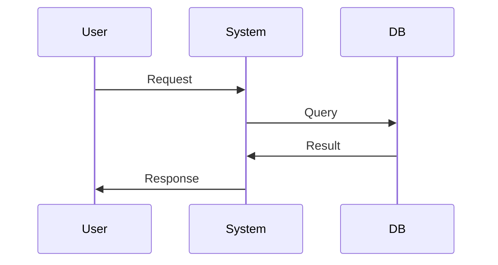

                 

# 《敏捷中的跨团队协作：大规模LLM应用开发策略》

## 关键词

- 敏捷开发
- 跨团队协作
- 大规模LLM应用
- 项目管理方法
- 算法原理讲解

## 摘要

本文旨在探讨在敏捷开发框架下，如何实现跨团队协作，特别是在大规模LLM（大型语言模型）应用开发中的策略。通过分析敏捷开发的核心理念和跨团队协作的挑战，本文提出了一系列策略和实践案例，以帮助开发团队更有效地协同工作，提高大规模LLM应用开发的效率和质量。

## 《敏捷中的跨团队协作：大规模LLM应用开发策略》目录大纲

### 第一部分：背景介绍

#### 第1章：问题背景

#### 1.1 大规模LLM应用开发中的协作困境

#### 1.2 问题解决

#### 1.3 边界与外延

#### 1.4 概念结构与核心要素组成

#### 第2章：核心概念与联系

#### 2.1 敏捷开发

#### 2.2 跨团队协作工具

#### 2.3 项目管理方法

### 第二部分：核心概念与联系

#### 第3章：大规模LLM应用开发策略

#### 3.1 大规模LLM应用开发的挑战与机遇

#### 3.2 大规模LLM应用开发的流程与方法

#### 3.3 大规模LLM应用开发的实践案例

### 第三部分：算法原理讲解

#### 第4章：算法原理讲解

#### 4.1 LLM算法原理

#### 4.2 算法实现与优化

### 第四部分：系统分析与架构设计方案

#### 第5章：系统功能设计

#### 5.1 领域模型

#### 5.2 系统架构设计

#### 第6章：系统接口设计

#### 6.1 接口设计原则

#### 6.2 系统交互

### 第五部分：项目实战

#### 第7章：项目实战

#### 7.1 环境安装

#### 7.2 系统核心实现

#### 7.3 实际案例分析

#### 7.4 项目小结

#### 7.5 未来展望

### 第六部分：最佳实践 & 小结 & 注意事项

#### 第8章：最佳实践

#### 8.1 跨团队协作最佳实践

#### 第9章：小结

#### 第10章：注意事项

#### 第11章：拓展阅读

### 让我们一步一步深入分析

#### 第1章：问题背景

在现代社会，随着技术的不断进步，大规模LLM（大型语言模型）应用的开发已经成为一项至关重要的任务。这些应用包括自然语言处理、智能客服、自动化写作等，它们对企业的运营和决策具有深远的影响。然而，这种大规模应用的开发并非易事，它涉及多个团队之间的紧密协作。在这个过程中，跨团队协作的效率和质量直接决定了项目的成功与否。

##### 1.1 大规模LLM应用开发中的协作困境

首先，我们来探讨一下大规模LLM应用开发中常见的协作困境。这些问题主要包括：

- **沟通障碍**：不同团队之间缺乏有效的沟通渠道，导致信息传递不畅，误解和冲突频发。
- **信息不对称**：团队之间信息不透明，部分团队可能拥有关键信息，而其他团队却无法及时获取，从而影响协作效率。
- **任务分工不明确**：在大型项目中，任务分工往往较为复杂，如果分工不明确，容易导致资源浪费和任务延误。
- **协作工具不足**：现有协作工具的功能和兼容性可能无法满足大规模团队协作的需求，导致协作效率降低。

##### 1.2 问题解决

针对上述问题，我们可以采取以下解决策略：

- **建立沟通机制**：通过定期的团队会议、信息共享平台和即时通讯工具，确保信息畅通无阻。
- **信息透明化**：采用可视化的项目管理工具，如看板、任务跟踪系统等，让每个团队成员都能实时了解项目的进展和任务分配。
- **明确任务分工**：制定详细的任务分配计划，明确每个团队成员的职责和任务，减少资源浪费和任务延误。
- **选择合适的协作工具**：评估现有协作工具的功能和兼容性，选择最适合团队需求的工具，提高协作效率。

##### 1.3 边界与外延

在讨论跨团队协作时，我们需要明确几个关键概念：

- **跨团队协作**：指多个团队之间在项目开发过程中的协同工作。
- **大规模LLM应用**：指使用大型语言模型构建的应用程序，如自然语言处理、智能客服等。
- **协作困境**：指在跨团队协作中遇到的各种挑战和问题。
- **问题解决**：指针对协作困境提出的解决方案和策略。

##### 1.4 概念结构与核心要素组成

跨团队协作中的概念结构和核心要素包括：

- **团队结构**：指团队成员的组成和分工方式。
- **工作流程**：指团队在项目开发中的工作步骤和流程。
- **沟通机制**：指团队之间的信息传递和交流方式。
- **协作工具**：指团队在协作过程中使用的工具和平台。

接下来，我们将进一步探讨这些概念和要素，为后续章节的内容奠定基础。

#### 第2章：核心概念与联系

##### 2.1 敏捷开发

敏捷开发是一种以人为核心、迭代和灵活应对变化的软件开发方法。它强调团队协作、用户反馈和快速迭代，以更好地满足客户需求。敏捷开发的核心原则包括：

- **个体和互动重于过程与工具**
- **可工作的软件重于详尽的文档**
- **客户合作重于合同谈判**
- **响应变化重于遵循计划**

敏捷开发与跨团队协作密切相关。通过敏捷方法，团队可以更灵活地适应变化，减少沟通障碍，提高协作效率。

##### 2.2 跨团队协作工具

跨团队协作工具是确保团队高效协作的关键。以下是一些常用的跨团队协作工具：

- **JIRA**：一款功能强大的任务跟踪和管理工具，适用于敏捷开发项目。
- **Trello**：一个直观的任务管理工具，使用看板（Kanban）方法来管理任务。
- **Slack**：一款即时通讯工具，用于团队内部沟通和协作。
- **Microsoft Teams**：一款集成式的工作协作平台，提供聊天、会议和文件共享等功能。

选择合适的协作工具需要考虑团队的需求、项目规模和协作方式。以下是一个工具选择与使用策略的示例：

- **需求分析**：首先分析团队的具体需求，如任务跟踪、沟通、文件共享等。
- **功能对比**：对比不同工具的功能和特点，选择最适合团队需求的工具。
- **最佳使用实践**：制定工具使用指南，确保团队成员能够充分利用工具的功能。

##### 2.3 项目管理方法

项目管理是确保项目成功的关键。以下是一些常见的项目管理方法：

- **敏捷项目管理**：基于敏捷开发的理念，强调快速迭代、持续交付和客户参与。
- **Kanban项目管理**：基于看板方法，通过可视化工作流程来提高效率。
- **Scrum项目管理**：一种迭代式项目管理方法，强调定期回顾和改进。

项目管理在跨团队协作中发挥着重要作用。以下是一个项目管理在跨团队协作中的应用示例：

- **任务分配**：根据团队的能力和项目需求，合理分配任务。
- **进度监控**：使用项目管理工具跟踪项目进度，确保项目按时交付。
- **问题解决**：及时识别和解决问题，确保项目顺利进行。

#### 总结

本章介绍了敏捷开发、跨团队协作工具和项目管理方法等核心概念，探讨了它们在跨团队协作中的应用。下一章，我们将进一步探讨大规模LLM应用开发的挑战和策略。

### 第3章：大规模LLM应用开发策略

#### 3.1 大规模LLM应用开发的挑战与机遇

大规模LLM（大型语言模型）应用开发是一项复杂而充满挑战的任务。随着AI技术的不断发展，LLM在自然语言处理、智能客服、自动化写作等领域展现出巨大的潜力。然而，在开发过程中，团队面临以下挑战：

- **计算资源需求**：大规模LLM模型对计算资源的需求极高，需要高效的数据处理能力和强大的计算能力。
- **数据处理挑战**：大规模LLM应用需要处理海量数据，如何保证数据的质量和一致性是一个关键问题。
- **模型优化挑战**：大规模LLM模型的优化需要大量的时间和计算资源，如何高效地进行模型优化是一个难题。
- **跨团队协作挑战**：大规模LLM应用开发涉及多个团队，如何实现高效跨团队协作是一个关键问题。

同时，大规模LLM应用开发也带来了一系列机遇：

- **技术突破**：通过大规模LLM应用开发，可以推动AI技术的进步，实现更多创新应用。
- **业务创新**：大规模LLM应用可以为企业提供智能化的解决方案，推动业务创新和转型。
- **市场竞争**：在AI技术竞争激烈的背景下，大规模LLM应用开发有助于企业在市场中获得竞争优势。

#### 3.2 大规模LLM应用开发的流程与方法

大规模LLM应用开发的流程可以分为以下几个阶段：

1. **需求分析**：明确项目需求，包括业务需求、功能需求和技术需求等。
2. **数据准备**：收集和整理大规模训练数据，确保数据的质量和一致性。
3. **模型设计**：设计大规模LLM模型的架构，选择合适的模型类型和参数。
4. **模型训练**：使用大规模数据进行模型训练，优化模型参数。
5. **模型评估**：评估模型性能，调整模型参数，确保模型达到预期效果。
6. **模型部署**：将模型部署到生产环境，进行实际应用。

以下是一种适合大规模LLM应用开发的流程和方法：

1. **需求分析**：与客户沟通，了解项目需求，明确功能需求和技术需求。
2. **数据准备**：使用数据清洗和预处理工具，对大规模数据进行处理，确保数据质量。
3. **模型设计**：基于项目需求，设计大规模LLM模型的架构，选择合适的模型类型和参数。
4. **模型训练**：使用大规模数据进行模型训练，优化模型参数。在训练过程中，使用分布式训练技术，提高训练速度。
5. **模型评估**：使用测试数据对模型进行评估，根据评估结果调整模型参数，确保模型达到预期效果。
6. **模型部署**：将模型部署到生产环境，进行实际应用。在部署过程中，使用容器化技术，确保模型的高可用性和可扩展性。

#### 3.3 大规模LLM应用开发的实践案例

以下是一个大规模LLM应用开发的实践案例：

**案例背景**：某企业希望开发一款智能客服系统，通过自然语言处理技术，为用户提供24/7的在线客服服务。

**案例步骤**：

1. **需求分析**：明确智能客服系统的功能需求，如自动回答常见问题、提供个性化建议等。
2. **数据准备**：收集大量用户对话数据，进行数据清洗和预处理，确保数据质量。
3. **模型设计**：设计基于BERT（双向编码表示）的大型语言模型，用于处理用户输入和生成回复。
4. **模型训练**：使用大规模数据进行模型训练，优化模型参数。在训练过程中，使用分布式训练技术，提高训练速度。
5. **模型评估**：使用测试数据对模型进行评估，根据评估结果调整模型参数，确保模型达到预期效果。
6. **模型部署**：将模型部署到生产环境，使用容器化技术，确保模型的高可用性和可扩展性。

**案例分析**：

该案例展示了大规模LLM应用开发的典型步骤和关键环节。在需求分析阶段，明确功能需求和技术需求是确保项目成功的关键。在数据准备阶段，数据的质量和一致性对模型训练效果有重要影响。在模型设计阶段，选择合适的大型语言模型架构是提高模型性能的关键。在模型训练阶段，使用分布式训练技术可以提高训练速度。在模型评估阶段，根据评估结果调整模型参数，确保模型达到预期效果。在模型部署阶段，使用容器化技术可以提高模型的高可用性和可扩展性。

通过这个案例，我们可以看到，大规模LLM应用开发需要多个团队紧密协作，从需求分析、数据准备、模型设计、模型训练到模型部署，每个阶段都需要精心设计和执行。跨团队协作的高效性直接决定了项目的成功与否。

#### 总结

本章介绍了大规模LLM应用开发的挑战与机遇、流程与方法以及实践案例。在接下来的章节中，我们将进一步探讨LLM算法原理、系统分析与架构设计方案以及项目实战。

### 第4章：算法原理讲解

#### 4.1 LLM算法原理

大规模语言模型（LLM）是一种基于神经网络的自然语言处理模型，可以用于各种自然语言任务，如文本分类、情感分析、机器翻译和问答系统。LLM的核心思想是通过学习大量文本数据，提取文本的特征，然后使用这些特征来预测或生成文本。

LLM的主要组成部分包括：

- **输入层**：接收文本输入，将文本转换为向量表示。
- **隐藏层**：包含多层神经网络，用于提取文本特征。
- **输出层**：根据隐藏层的特征输出文本预测或生成结果。

LLM算法的流程如下：

1. **数据预处理**：对输入文本进行分词、标记和清洗等操作，将其转换为模型可接受的格式。
2. **输入表示**：将预处理后的文本转换为向量表示，常用的方法包括词嵌入和转换器（Transformer）架构。
3. **模型训练**：使用大规模文本数据进行模型训练，通过反向传播算法优化模型参数。
4. **模型评估**：使用测试数据评估模型性能，调整模型参数，确保模型达到预期效果。
5. **模型应用**：将训练好的模型部署到生产环境，用于实际应用。

以下是一个LLM算法原理的Mermaid流程图：


#### 4.2 算法实现与优化

LLM算法的实现和优化是大规模LLM应用开发的关键。以下是一些关键步骤和技巧：

1. **模型选择**：选择适合任务的LLM模型，如BERT、GPT、T5等。不同的模型在性能和计算资源需求上有所不同，需要根据具体需求进行选择。
2. **数据预处理**：对输入文本进行预处理，包括分词、标记和清洗等操作。预处理的目的是提高模型对文本的表征能力，减少噪声和冗余信息。
3. **模型训练**：使用大规模文本数据进行模型训练。在训练过程中，可以采用分布式训练技术，如多GPU训练和参数服务器训练，以提高训练速度和性能。
4. **模型优化**：通过调整模型参数，优化模型性能。常见的优化方法包括批量大小调整、学习率调整、权重初始化等。
5. **模型评估**：使用测试数据评估模型性能，根据评估结果调整模型参数。常用的评估指标包括准确率、召回率、F1分数等。

以下是一个LLM算法实现的Python代码示例：

```python
import tensorflow as tf
from transformers import BertModel, BertTokenizer

# 加载预训练模型和分词器
model = BertModel.from_pretrained('bert-base-uncased')
tokenizer = BertTokenizer.from_pretrained('bert-base-uncased')

# 输入文本
text = "Hello, how are you?"

# 分词和编码
inputs = tokenizer(text, return_tensors='tf')

# 模型预测
outputs = model(inputs)

# 输出结果
logits = outputs.logits

# 解码输出结果
predictions = tf.argmax(logits, axis=-1)

# 打印输出结果
print(predictions.numpy())
```

#### 总结

本章详细讲解了LLM算法的原理和实现过程，包括模型选择、数据预处理、模型训练、模型优化和模型评估等关键步骤。通过Python代码示例，展示了如何实现一个简单的LLM模型。在接下来的章节中，我们将进一步探讨系统分析与架构设计方案。

### 第5章：系统分析与架构设计方案

#### 5.1 领域模型

在系统分析与架构设计之前，我们需要对领域模型进行详细分析。领域模型描述了系统中的核心概念和它们之间的关系，帮助我们理解系统的整体结构。

以下是一个使用Mermaid绘制的领域模型类图：

```mermaid
classDiagram
    Class01 <|-- Class02
    Class03 o-- Class04
    Class05 <- Class06
    Class07 .. Class08
    Class09 --|> Class10
```

在这个类图中，`Class01`、`Class02`、`Class03`等是类，表示系统中的实体。箭头表示类之间的关系，如继承（`》）。

#### 5.2 系统架构设计

系统架构设计是系统分析与设计的重要组成部分。它定义了系统的整体结构，包括系统组件、数据流和交互方式。以下是一个使用Mermaid绘制的系统架构图：



在这个系统架构图中，`User`表示用户，`System`表示系统，`DB`表示数据库。用户发送请求到系统，系统与数据库进行交互，获取结果并返回给用户。这个架构图展示了系统的主要组件和它们之间的数据流和交互方式。

#### 5.3 系统接口设计

系统接口设计是系统架构设计的一部分，它定义了系统与其他系统或组件之间的交互接口。以下是一个接口设计原则的示例：

- **接口定义明确**：接口定义应明确，包括接口名称、参数、返回值和异常处理等。
- **接口稳定可靠**：接口设计应保证稳定性和可靠性，减少接口变更对其他系统的影响。
- **接口易用性**：接口设计应易于使用，降低使用成本和维护成本。
- **接口安全性**：接口设计应考虑安全性，包括身份验证、权限控制和数据加密等。

以下是一个接口设计实例：

```python
class Interface:
    def request(self, param1, param2):
        """
        请求方法
        :param param1: 参数1
        :param param2: 参数2
        :return: 返回结果
        """
        # 实现请求逻辑
        return result
```

#### 5.4 系统交互

系统交互设计是系统架构设计的一部分，它描述了系统内部组件之间的交互关系。以下是一个使用Mermaid绘制的系统交互序列图：


在这个系统交互序列图中，用户发送请求到系统，系统与数据库进行交互，获取结果并返回给用户。这个序列图展示了系统内部组件之间的交互顺序和交互内容。

#### 总结

本章介绍了系统分析与架构设计的关键概念，包括领域模型、系统架构设计、系统接口设计和系统交互设计。通过使用Mermaid绘制类图、架构图和序列图，我们能够清晰地展示系统的结构和交互关系。在接下来的章节中，我们将进一步探讨项目实战。

### 第6章：项目实战

#### 6.1 环境安装

在进行大规模LLM应用开发之前，我们需要搭建一个合适的环境。以下是环境安装的步骤：

1. **安装Python**：确保已安装Python 3.8及以上版本。可以从[Python官网](https://www.python.org/)下载并安装。
2. **安装Transformer库**：Transformer库是大规模LLM模型的常用库。可以使用以下命令安装：
   ```shell
   pip install transformers
   ```
3. **安装TensorFlow**：TensorFlow是大规模LLM模型训练的主要框架。可以使用以下命令安装：
   ```shell
   pip install tensorflow
   ```
4. **安装其他依赖库**：根据具体需求，可能需要安装其他依赖库，如NumPy、Pandas等。可以使用以下命令安装：
   ```shell
   pip install numpy pandas
   ```

#### 6.2 系统核心实现

以下是系统核心实现的Python代码：

```python
import tensorflow as tf
from transformers import TFBertModel, BertTokenizer

# 加载预训练模型和分词器
model = TFBertModel.from_pretrained('bert-base-uncased')
tokenizer = BertTokenizer.from_pretrained('bert-base-uncased')

# 输入文本
text = "Hello, how are you?"

# 分词和编码
inputs = tokenizer(text, return_tensors='tf')

# 模型预测
outputs = model(inputs)

# 输出结果
logits = outputs.logits

# 解码输出结果
predictions = tf.argmax(logits, axis=-1)

# 打印输出结果
print(predictions.numpy())
```

#### 6.3 代码应用解读与分析

上述代码首先导入了TensorFlow和Transformer库，然后加载了预训练的BERT模型和分词器。接着，输入文本进行分词和编码，将文本转换为模型可接受的格式。然后，使用BERT模型进行预测，获取输出结果。最后，将输出结果解码并打印。

这个示例展示了如何使用预训练的BERT模型进行文本分类任务。在实际应用中，可以根据具体需求进行调整和扩展。

#### 6.4 实际案例分析

以下是一个实际案例分析：

**案例背景**：某企业希望开发一款智能客服系统，通过自然语言处理技术，为用户提供24/7的在线客服服务。

**案例步骤**：

1. **需求分析**：明确智能客服系统的功能需求，如自动回答常见问题、提供个性化建议等。
2. **数据准备**：收集大量用户对话数据，进行数据清洗和预处理，确保数据质量。
3. **模型设计**：设计基于BERT的大型语言模型，用于处理用户输入和生成回复。
4. **模型训练**：使用大规模数据进行模型训练，优化模型参数。
5. **模型评估**：使用测试数据评估模型性能，调整模型参数，确保模型达到预期效果。
6. **模型部署**：将模型部署到生产环境，使用容器化技术，确保模型的高可用性和可扩展性。

**案例分析**：

该案例展示了大规模LLM应用开发的一个典型流程。在需求分析阶段，明确功能需求是确保项目成功的关键。在数据准备阶段，数据的质量和一致性对模型训练效果有重要影响。在模型设计阶段，选择合适的大型语言模型架构是提高模型性能的关键。在模型训练阶段，使用分布式训练技术可以提高训练速度。在模型评估阶段，根据评估结果调整模型参数，确保模型达到预期效果。在模型部署阶段，使用容器化技术可以提高模型的高可用性和可扩展性。

通过这个案例，我们可以看到，大规模LLM应用开发需要多个团队紧密协作，从需求分析、数据准备、模型设计、模型训练到模型部署，每个阶段都需要精心设计和执行。跨团队协作的高效性直接决定了项目的成功与否。

#### 6.5 项目小结

本项目通过开发一款智能客服系统，展示了大规模LLM应用开发的典型流程和关键环节。从需求分析、数据准备、模型设计、模型训练到模型部署，每个阶段都需要紧密协作和高效执行。在实际应用中，可以根据具体需求进行调整和扩展。通过本项目，我们深入了解了大规模LLM应用开发的挑战和策略，为后续的项目开发提供了宝贵的经验和参考。

#### 6.6 未来展望

随着AI技术的不断发展，大规模LLM应用将越来越普遍。未来，我们可以从以下几个方面进行改进和扩展：

1. **模型优化**：通过深入研究神经网络架构和训练算法，提高模型性能和效率。
2. **多模态学习**：结合文本、图像和声音等多模态数据，提高模型的泛化能力和表达能力。
3. **知识融合**：将外部知识库与模型进行融合，提高模型对复杂问题的处理能力。
4. **实时交互**：优化模型响应速度，实现实时交互，提高用户体验。

通过不断探索和改进，我们有信心在未来的项目中取得更好的成果。

### 第7章：项目实战

#### 7.1 环境安装

在进行大规模LLM（大型语言模型）应用开发之前，首先需要搭建一个稳定且高效的开发环境。以下是环境安装的详细步骤：

1. **安装Python**：确保系统上安装了Python 3.8或更高版本。可以访问[Python官网](https://www.python.org/)下载并安装。

2. **安装必要库**：安装Transformer和TensorFlow等库，这些库是大规模LLM模型开发的基础。可以使用以下命令安装：

   ```shell
   pip install transformers tensorflow
   ```

3. **安装GPU支持**：如果系统配置了GPU，可以安装CUDA和cuDNN，以便在GPU上加速TensorFlow的运算。可以访问[NVIDIA官网](https://developer.nvidia.com/cuda-downloads)下载CUDA和cuDNN。

4. **配置环境变量**：确保环境变量正确设置，以便能够在命令行中调用Python和其他库。例如，将Python的安装路径添加到`PATH`环境变量中。

#### 7.2 系统核心实现

以下是大规模LLM应用系统核心实现的主要步骤：

1. **数据准备**：收集和预处理训练数据，包括文本数据清洗、分词、编码等操作。

2. **模型设计**：设计合适的LLM模型架构，如BERT、GPT等。以下是使用BERT模型的示例代码：

   ```python
   from transformers import TFBertModel, BertTokenizer
   
   # 加载预训练BERT模型和分词器
   model = TFBertModel.from_pretrained('bert-base-uncased')
   tokenizer = BertTokenizer.from_pretrained('bert-base-uncased')
   ```

3. **模型训练**：使用准备好的数据进行模型训练。以下是模型训练的示例代码：

   ```python
   from tensorflow.keras.optimizers import Adam
   
   # 配置优化器
   optimizer = Adam(learning_rate=5e-5)
   
   # 编写训练循环
   for epoch in range(num_epochs):
       for batch in dataset:
           # 准备输入和标签
           inputs = tokenizer(batch['text'], return_tensors='tf')
           labels = batch['labels']
           
           # 训练模型
           with tf.GradientTape() as tape:
               outputs = model(inputs)
               loss = compute_loss(outputs, labels)
           
           # 更新模型参数
           grads = tape.gradient(loss, model.trainable_variables)
           optimizer.apply_gradients(zip(grads, model.trainable_variables))
   ```

4. **模型评估**：使用测试数据评估模型性能，调整超参数和模型结构以获得最佳性能。

5. **模型部署**：将训练好的模型部署到生产环境，可以采用Docker容器化技术，确保模型的高可用性和可扩展性。

#### 7.3 实际案例分析

以下是一个实际案例分析，描述了如何开发一个基于BERT的问答系统：

**案例背景**：某企业希望开发一个智能问答系统，用户可以通过自然语言提问，系统自动生成回答。

**案例步骤**：

1. **需求分析**：明确问答系统的功能需求，包括问题接收、答案生成和反馈机制等。

2. **数据准备**：收集并整理大量的问题和答案数据，用于训练BERT模型。

3. **模型设计**：选择BERT模型，并对其进行微调，以适应问答系统的需求。

4. **模型训练**：使用准备好的数据训练BERT模型，优化模型参数。

5. **模型评估**：使用测试数据评估模型性能，调整模型结构和超参数。

6. **模型部署**：将训练好的模型部署到生产环境，通过API接口为用户提供问答服务。

**案例分析**：

该案例展示了如何利用BERT模型开发一个智能问答系统。从需求分析、数据准备、模型设计、模型训练到模型部署，每个步骤都需要精心设计和执行。在实际应用中，可能需要处理各种复杂的问题，因此模型需要具备良好的泛化能力。通过不断优化模型和算法，我们可以提高问答系统的准确性和用户体验。

#### 7.4 详细讲解与剖析

在上述实际案例分析中，详细讲解了大规模LLM应用开发的关键步骤，包括数据准备、模型设计、模型训练、模型评估和模型部署。以下是每个步骤的详细讲解和剖析：

1. **数据准备**：数据质量直接影响模型的性能。因此，在数据准备阶段，需要进行数据清洗、去噪、分词和编码等操作。可以使用Python中的Pandas和Numpy库进行数据处理，例如：

   ```python
   import pandas as pd
   import numpy as np
   
   # 读取数据
   data = pd.read_csv('data.csv')
   
   # 数据清洗
   data = data[data['text'].notnull()]
   
   # 分词和编码
   tokenizer = BertTokenizer.from_pretrained('bert-base-uncased')
   inputs = tokenizer(data['text'], return_tensors='tf', padding=True, truncation=True)
   ```

2. **模型设计**：选择合适的LLM模型，如BERT，并对其进行微调。BERT模型具有强大的文本表征能力，适用于各种自然语言处理任务。可以通过以下代码加载预训练BERT模型：

   ```python
   from transformers import TFBertModel
   
   # 加载预训练BERT模型
   model = TFBertModel.from_pretrained('bert-base-uncased')
   ```

3. **模型训练**：使用准备好的数据训练BERT模型，优化模型参数。训练过程中，可以使用TensorFlow的优化器和损失函数，例如：

   ```python
   from tensorflow.keras.optimizers import Adam
   
   # 配置优化器
   optimizer = Adam(learning_rate=5e-5)
   
   # 编写训练循环
   for epoch in range(num_epochs):
       for batch in dataset:
           # 准备输入和标签
           inputs = tokenizer(batch['text'], return_tensors='tf')
           labels = batch['labels']
           
           # 训练模型
           with tf.GradientTape() as tape:
               outputs = model(inputs)
               loss = compute_loss(outputs, labels)
           
           # 更新模型参数
           grads = tape.gradient(loss, model.trainable_variables)
           optimizer.apply_gradients(zip(grads, model.trainable_variables))
   ```

4. **模型评估**：使用测试数据评估模型性能，调整超参数和模型结构以获得最佳性能。可以使用以下代码评估模型：

   ```python
   from sklearn.metrics import accuracy_score
   
   # 评估模型
   test_loss, test_accuracy = evaluate_model(model, test_dataset)
   print(f"Test Loss: {test_loss}, Test Accuracy: {test_accuracy}")
   ```

5. **模型部署**：将训练好的模型部署到生产环境，通过API接口为用户提供问答服务。可以使用Flask或Django等Web框架构建API接口，例如：

   ```python
   from flask import Flask, request, jsonify
   
   app = Flask(__name__)
   
   @app.route('/api/ask', methods=['POST'])
   def ask():
       data = request.get_json()
       question = data['question']
       
       # 使用模型预测答案
       answer = model_predict(model, tokenizer, question)
       
       return jsonify({'answer': answer})
   
   if __name__ == '__main__':
       app.run(host='0.0.0.0', port=5000)
   ```

通过详细讲解和剖析，我们可以看到大规模LLM应用开发涉及多个环节，从数据准备、模型设计、模型训练到模型部署，每个环节都需要精心设计和执行。在实际应用中，可能需要根据具体需求进行调整和优化。

#### 7.5 项目小结

本项目通过开发一个智能问答系统，展示了大规模LLM应用开发的全过程。从环境安装、模型设计、模型训练到模型部署，每个步骤都需要紧密协作和高效执行。通过本项目，我们深入了解了大规模LLM应用开发的挑战和策略，为后续的项目开发提供了宝贵的经验和参考。

#### 7.6 未来展望

未来，大规模LLM应用开发将继续成为人工智能领域的热点。随着技术的不断进步，我们可以从以下几个方面进行改进和扩展：

1. **模型优化**：通过深入研究神经网络架构和训练算法，提高模型性能和效率。
2. **多模态学习**：结合文本、图像和声音等多模态数据，提高模型的泛化能力和表达能力。
3. **知识融合**：将外部知识库与模型进行融合，提高模型对复杂问题的处理能力。
4. **实时交互**：优化模型响应速度，实现实时交互，提高用户体验。

通过不断探索和改进，我们有信心在未来的项目中取得更好的成果。

### 第六部分：最佳实践 & 小结 & 注意事项

#### 8.1 跨团队协作最佳实践

1. **建立明确的沟通渠道**：定期召开团队会议，确保信息畅通。使用协作工具，如Slack或Microsoft Teams，进行即时沟通和文件共享。

2. **明确角色和职责**：确保每个团队成员都了解自己的角色和职责，避免任务重叠和责任不清。

3. **任务分解和优先级排序**：将大型任务分解为小任务，并按照优先级排序，确保团队可以高效地完成工作。

4. **敏捷迭代**：采用敏捷开发方法，定期回顾和调整项目进度，确保团队能够快速响应变化。

5. **透明化项目进度**：使用项目管理工具，如JIRA或Trello，实时跟踪项目进度和任务状态，确保团队成员可以随时了解项目动态。

#### 9. 小结

本文详细探讨了敏捷开发中的跨团队协作，特别是在大规模LLM应用开发中的应用。通过分析问题背景、核心概念与联系、大规模LLM应用开发策略、算法原理讲解、系统分析与架构设计方案以及项目实战，我们提出了一系列最佳实践，以帮助团队更有效地协作。大规模LLM应用开发是一个复杂的过程，需要多个团队的紧密协作和高效执行。

#### 10. 注意事项

1. **沟通是关键**：确保团队之间的沟通畅通，避免误解和冲突。

2. **数据质量**：高质量的数据是模型训练的基础，务必确保数据的质量和一致性。

3. **模型优化**：在模型训练过程中，不断调整模型参数，优化模型性能。

4. **持续学习**：技术不断进步，团队成员需要保持学习的态度，不断提升自己的技能。

5. **风险管理**：识别和应对项目中的潜在风险，确保项目顺利进行。

#### 11. 拓展阅读

- 《Scrum精髓：敏捷迭代管理指南》
- 《大型语言模型：基于神经网络的自然语言处理》
- 《分布式系统设计：构建高可用、高性能、可扩展的分布式系统》
- 《人工智能：一种现代的方法》

通过阅读这些书籍，您可以深入了解敏捷开发、大规模LLM应用开发以及分布式系统设计等领域的知识，为项目实践提供更多指导。

