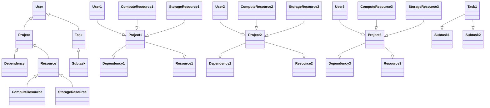
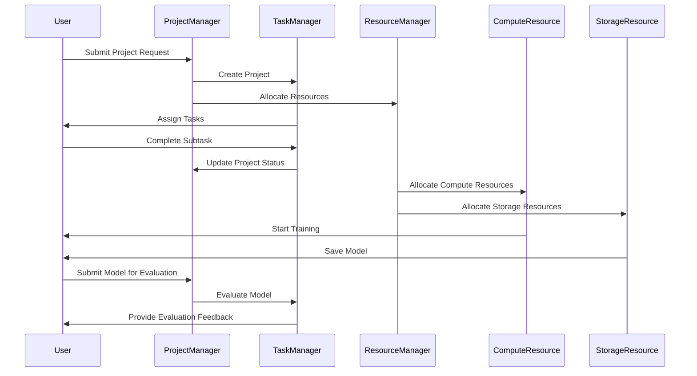

                 

### 1.1 远程协作背景与重要性

在当今全球化和数字化的大背景下，远程协作已成为许多企业和开发团队进行项目开发和管理的主要方式。敏捷开发作为一种应对快速变化的环境以及应对不可预见的挑战而逐步调整软件开发进行的过程，它强调团队合作和快速迭代。远程协作工具在这种敏捷开发模式中扮演着至关重要的角色，它们不仅提高了团队的工作效率，而且优化了团队内部及团队之间的沟通和协作。

**远程协作的定义与发展：**

远程协作（Remote Collaboration）是指团队成员在地理位置不同的地方，通过互联网和远程协作工具共同完成项目任务的过程。随着互联网技术的发展，远程协作逐渐从传统的邮件交流、即时通讯逐步演变成为集成了文档编辑、项目管理、视频会议等多种功能的一体化平台。

**远程协作在敏捷开发中的应用：**

敏捷开发（Agile Development）是一种以人为核心、迭代和快速交付的软件开发方法。它强调团队成员之间的密切合作和沟通。远程协作工具在敏捷开发中的应用，使得团队成员能够更高效地进行任务分配、进度跟踪、问题反馈以及文档共享等。例如，工作流管理工具可以帮助团队明确任务优先级，即时通讯工具可以实时解决开发过程中出现的问题，文档协作工具则确保团队随时可以访问最新的文档资料。

**分布式LLM开发团队的挑战：**

分布式LLM（Large Language Model）开发团队面临许多独特的挑战。首先，团队成员可能分布在不同的国家和地区，时差和文化差异都会影响协作效率。其次，大型语言模型的开发需要大量的计算资源，如何合理分配和调度资源是另一个难题。此外，数据的安全性和隐私保护也是分布式团队必须考虑的问题。

### 1.2 分布式LLM开发的概念与特点

**分布式LLM的基本概念：**

分布式LLM指的是大型语言模型在不同计算节点上分布式地进行训练和推理。这种方式能够充分利用分布式计算的优势，提高训练效率，降低单个节点过载的风险。

**分布式LLM的开发特点：**

1. **高并发性**：分布式LLM能够支持多个任务同时执行，极大地提高了开发效率。
2. **高可扩展性**：随着项目规模的扩大，分布式LLM可以轻松地扩展计算资源，满足不断增长的计算需求。
3. **高可靠性**：通过在多个节点上备份数据，分布式LLM能够在发生故障时快速恢复，保证开发进程不受影响。

**分布式LLM的优势与挑战：**

**优势：**

- **资源共享**：多个团队可以共享计算资源，降低成本。
- **并行处理**：多个节点可以同时处理不同的任务，提高效率。
- **灵活性**：团队可以根据项目需要灵活地调整资源配置。

**挑战：**

- **通信延迟**：分布式团队之间的通信可能会受到网络延迟的影响，导致协作效率下降。
- **同步问题**：不同节点的数据同步可能存在不一致性，需要严格的管理和控制。
- **数据安全性**：分布式环境中数据的安全性需要特别关注，防止数据泄露和篡改。

### 1.3 本书核心概念体系

**远程协作工具的分类与特点：**

远程协作工具可以大致分为以下几类：

1. **工作流管理工具**：如Asana、Trello、Jira，用于任务分配和项目进度管理。
2. **即时通讯工具**：如Slack、Microsoft Teams，用于实时沟通和问题解决。
3. **文档协作工具**：如Google Workspace、Notion，用于文档编辑和共享。

**分布式LLM开发流程：**

分布式LLM开发流程主要包括以下几个步骤：

1. **需求分析和模型设计**：明确项目需求，设计语言模型的结构。
2. **数据预处理**：收集并清洗训练数据，准备用于模型训练。
3. **模型训练和优化**：在分布式环境中进行模型训练，并进行优化调整。
4. **模型评估和部署**：评估模型性能，部署到实际应用场景。

**ER实体关系图架构的Mermaid流程图：**

下面是一个简单的ER实体关系图示例，用于表示远程协作工具和分布式LLM开发流程之间的关系：

```mermaid
erDiagram
    Task |->| Project : "is_in"
    Team |->| Project : "works_on"
    User |->| Task : "assigned_to"
    User |->| Project : "part_of"
    User |->| Team : "member_of"
    Tool |->| Project : "uses"
    Tool |->| Task : "used_in"
    Tool |->| User : "prefers"
```

通过这个ER图，我们可以清晰地看到各个实体之间的关系，为后续章节的深入分析奠定了基础。在下一部分，我们将详细探讨这些远程协作工具的特点和应用。

### 2.1 概述与分类

**远程协作工具概述：**

远程协作工具是指能够帮助团队在地理位置分散的情况下实现高效沟通、任务分配、文档共享和项目管理的软件或平台。这些工具的核心目标是克服地理位置带来的沟通障碍，提高团队的协作效率，确保项目按时完成。

**远程协作工具的分类：**

远程协作工具可以根据其主要功能和用途分为以下几个类别：

1. **工作流管理工具**：这类工具主要用于任务管理、项目进度跟踪和团队协作。常见的工具有Asana、Trello和Jira等。

2. **即时通讯工具**：这类工具提供了实时沟通和消息传递的功能，帮助团队成员快速交流，解决开发过程中遇到的问题。常见的工具有Slack、Microsoft Teams和WhatsApp等。

3. **文档协作工具**：这类工具专注于文档的编辑、共享和协作，使团队成员能够实时更新文档内容，确保信息的一致性。常见的工具有Google Workspace（包括Google Docs、Google Sheets和Google Slides）、Notion和Confluence等。

**工作流管理工具：**

**Asana：**

Asana是一款功能强大的工作流管理工具，它可以帮助团队明确任务分配，跟踪项目进度，并确保所有团队成员都在同一页面上。Asana的特点包括：

- **任务分配**：团队领导可以将任务分配给特定成员，并设置截止日期。
- **项目进度跟踪**：Asana提供了直观的看板视图，使团队成员可以随时了解项目的最新进展。
- **协作和沟通**：团队成员可以在任务中添加注释和讨论，确保问题及时解决。

**Trello：**

Trello是一种基于看板的任务管理工具，它通过卡片和列表的方式，帮助团队直观地组织和管理任务。Trello的主要特点包括：

- **直观的用户界面**：Trello的界面简单易懂，使用卡片和列表来表示任务和进度。
- **灵活的任务管理**：团队可以根据项目的需求自定义卡片和列表。
- **集成第三方服务**：Trello可以与其他工具和服务进行集成，如Slack和Google Drive，以实现更全面的协作。

**Jira：**

Jira是一款专业的项目管理工具，广泛应用于软件团队的敏捷开发。Jira的特点包括：

- **灵活的工作流**：Jira允许团队自定义工作流，以适应不同的项目需求。
- **全面的报告和统计功能**：Jira提供了强大的报告功能，帮助团队分析项目进度和性能。
- **集成和扩展性**：Jira与各种工具和服务集成，如Confluence和Bitbucket，增强了团队的工作效率。

**即时通讯工具：**

**Slack：**

Slack是一款流行的即时通讯工具，它提供了实时消息传递、视频会议和文件共享等功能，是现代远程团队沟通协作的首选工具。Slack的主要特点包括：

- **实时沟通**：Slack支持即时消息、视频会议和语音通话，方便团队成员实时交流。
- **丰富的集成**：Slack可以与其他应用和服务集成，如Google Drive、GitHub和Trello，实现无缝协作。
- **自动化和自定义**：Slack提供了多种自动化工具和自定义功能，帮助团队提高工作效率。

**Microsoft Teams：**

Microsoft Teams是微软推出的团队协作平台，集成了即时通讯、视频会议、文档共享和应用程序集成等功能。Microsoft Teams的特点包括：

- **无缝集成**：Microsoft Teams与微软的其他产品，如Office 365和OneDrive，无缝集成，提供一站式解决方案。
- **强大的协作功能**：Microsoft Teams支持实时协作，如共同编辑文档和实时讨论。
- **安全性和合规性**：Microsoft Teams提供了高级安全功能和合规性措施，确保数据安全。

**文档协作工具：**

**Google Workspace：**

Google Workspace（原名G Suite）是谷歌提供的一套办公协作工具，包括Google Docs、Google Sheets和Google Slides等。Google Workspace的主要特点包括：

- **实时协作**：多个用户可以同时编辑文档、表格和演示文稿，实时同步更新。
- **云存储**：Google Drive提供了无限量的云存储空间，方便团队成员随时访问和共享文档。
- **跨平台兼容**：Google Workspace支持多种平台，包括PC、Mac、iOS和Android，方便团队成员在不同设备上进行协作。

**Notion：**

Notion是一款功能丰富的文档协作工具，它将笔记、数据库、看板和日历等功能集成在一起，提供了一种全新的协作方式。Notion的主要特点包括：

- **灵活的布局**：Notion支持多种布局方式，如表格、列表、看板和日历，方便用户自定义协作界面。
- **强大的数据库功能**：Notion提供了强大的数据库功能，用户可以创建自定义数据库来管理项目信息。
- **跨平台使用**：Notion支持多种平台，包括Web、iOS和Android，方便团队成员在不同设备上进行协作。

**分类总结：**

远程协作工具根据其主要功能和用途可以分为工作流管理工具、即时通讯工具和文档协作工具三大类。各类工具的特点和适用场景各不相同，团队在选择时需要根据自身的需求和实际情况进行选择。

### 2.2 常见远程协作工具

**2.2.1 工作流管理工具**

**Asana**

Asana是一款非常受欢迎的工作流管理工具，它帮助团队跟踪任务、项目进度和团队成员的工作情况。以下是Asana的一些关键特性：

- **任务分配**：Asana允许团队领导将任务分配给不同的成员，并设置截止日期，确保任务按时完成。
- **项目进度跟踪**：通过看板视图、列表视图和甘特图等多种视图方式，Asana帮助团队实时了解项目进度。
- **协作与沟通**：团队成员可以在任务中添加注释和讨论，确保问题及时得到解决。

**Trello**

Trello是一款基于看板（Kanban）原理的工作流管理工具，通过卡片和列表直观地展示任务和工作流程。以下是Trello的主要特点：

- **直观的用户界面**：Trello的界面非常直观，通过卡片和列表组织任务，方便团队成员快速上手。
- **灵活的任务管理**：团队可以根据项目需求自定义卡片和列表，实现个性化的任务管理。
- **集成第三方服务**：Trello可以与其他工具和服务集成，如Slack和Google Drive，提高团队的工作效率。

**Jira**

Jira是一款广泛应用于软件开发团队的项目管理工具，它提供了强大的工作流管理功能，支持敏捷开发方法。以下是Jira的主要特点：

- **灵活的工作流**：Jira允许团队自定义工作流，适应不同的项目需求。
- **全面的报告和统计功能**：Jira提供了丰富的报告和统计功能，帮助团队分析项目进度和性能。
- **集成和扩展性**：Jira与各种工具和服务集成，如Confluence和Bitbucket，增强了团队的工作效率。

**2.2.2 即时通讯工具**

**Slack**

Slack是一款功能强大的即时通讯工具，它不仅提供了实时消息传递、视频会议和文件共享等功能，还支持与其他应用的集成。以下是Slack的主要特点：

- **实时沟通**：Slack支持即时消息、视频会议和语音通话，方便团队成员实时交流。
- **丰富的集成**：Slack可以与其他应用和服务集成，如Google Drive、GitHub和Trello，实现无缝协作。
- **自动化和自定义**：Slack提供了多种自动化工具和自定义功能，帮助团队提高工作效率。

**Microsoft Teams**

Microsoft Teams是微软推出的团队协作平台，它集成了即时通讯、视频会议、文档共享和应用程序集成等功能。以下是Microsoft Teams的主要特点：

- **无缝集成**：Microsoft Teams与微软的其他产品，如Office 365和OneDrive，无缝集成，提供一站式解决方案。
- **强大的协作功能**：Microsoft Teams支持实时协作，如共同编辑文档和实时讨论。
- **安全性和合规性**：Microsoft Teams提供了高级安全功能和合规性措施，确保数据安全。

**2.2.3 文档协作工具**

**Google Workspace**

Google Workspace（原名G Suite）是谷歌提供的一套办公协作工具，包括Google Docs、Google Sheets和Google Slides等。以下是Google Workspace的主要特点：

- **实时协作**：多个用户可以同时编辑文档、表格和演示文稿，实时同步更新。
- **云存储**：Google Drive提供了无限量的云存储空间，方便团队成员随时访问和共享文档。
- **跨平台兼容**：Google Workspace支持多种平台，包括PC、Mac、iOS和Android，方便团队成员在不同设备上进行协作。

**Notion**

Notion是一款功能丰富的文档协作工具，它将笔记、数据库、看板和日历等功能集成在一起，提供了一种全新的协作方式。以下是Notion的主要特点：

- **灵活的布局**：Notion支持多种布局方式，如表格、列表、看板和日历，方便用户自定义协作界面。
- **强大的数据库功能**：Notion提供了强大的数据库功能，用户可以创建自定义数据库来管理项目信息。
- **跨平台使用**：Notion支持多种平台，包括Web、iOS和Android，方便团队成员在不同设备上进行协作。

通过这些常见远程协作工具的比较，我们可以看到它们在任务管理、即时通讯和文档协作方面的优势，团队可以根据自身的需求选择最适合的工具来提高协作效率。

### 2.3 远程协作工具的选择与评估

**2.3.1 选择远程协作工具的考虑因素**

在选择远程协作工具时，团队需要考虑多个因素，以确保所选工具能够满足其特定的需求和提升工作效率。以下是一些关键的考虑因素：

1. **团队规模与结构**：不同的团队规模和结构对协作工具的需求有所不同。大型团队可能需要更复杂的协作功能和高度可定制化的工具，而小型团队可能更倾向于简单直观的工具。

2. **功能需求**：团队需要根据具体项目和工作流程选择具备相应功能的协作工具。例如，若需要任务分配和项目进度跟踪，工作流管理工具可能更适合；若需要实时沟通，即时通讯工具则更为合适。

3. **集成能力**：协作工具应具备良好的集成能力，能够与团队现有的其他工具和服务无缝对接。例如，如果团队已经在使用Google Workspace，选择一个能够与Google Drive、Google Sheets等集成的工作流管理工具会更加方便。

4. **用户体验**：用户体验是选择协作工具时不可忽视的因素。直观友好的界面和简单的操作流程可以提高团队成员的使用满意度，从而提高整体工作效率。

5. **安全性与合规性**：对于涉及敏感信息和数据的项目，选择具有严格安全性和合规性措施的协作工具至关重要。工具应提供数据加密、访问控制和权限管理等功能，确保数据安全。

6. **成本**：成本是影响协作工具选择的另一个重要因素。团队需要在预算范围内选择性价比高的工具，同时确保其能够满足项目需求。

**2.3.2 评估远程协作工具的指标**

为了全面评估远程协作工具的适用性，团队可以采用以下指标：

1. **功能完整性**：工具是否具备所需的功能，如任务管理、文档协作、实时沟通等。

2. **易用性**：工具的界面设计是否简洁直观，操作流程是否简便易懂。

3. **集成能力**：工具是否能够与现有的其他工具和服务无缝集成。

4. **性能与稳定性**：工具在处理大量数据和用户时，是否能够保持高性能和稳定性。

5. **安全性**：工具是否提供数据加密、访问控制和权限管理等功能，确保数据安全。

6. **客户支持**：工具提供何种形式的技术支持和客户服务，包括文档、教程、在线聊天和电话支持等。

7. **用户评价与反馈**：工具在市场上的用户评价和反馈如何，这可以作为参考来了解工具的实际效果。

**2.3.3 远程协作工具的比较分析**

以下是对常见远程协作工具的详细比较分析，以便团队在选择时有一个清晰的参考：

| 工具        | 功能完整性 | 易用性 | 集成能力 | 性能与稳定性 | 安全性 | 客户支持 | 用户评价与反馈 |
|-------------|-------------|---------|-------------|-------------|---------|-------------|----------------|
| Asana       | 高          | 高      | 高          | 高          | 高      | 高          | 良好           |
| Trello      | 高          | 高      | 高          | 高          | 高      | 中          | 良好           |
| Jira        | 高          | 中      | 高          | 高          | 高      | 高          | 良好           |
| Slack       | 中          | 高      | 高          | 高          | 高      | 高          | 良好           |
| Microsoft Teams | 高          | 高      | 高          | 高          | 高      | 高          | 良好           |
| Google Workspace | 高          | 高      | 高          | 高          | 高      | 高          | 良好           |
| Notion      | 高          | 中      | 高          | 高          | 高      | 中          | 良好           |

通过以上比较分析，团队可以根据自身的具体需求和评估结果，选择最适合自己的远程协作工具，以提升团队协作效率。

### 3.1 分布式LLM开发流程

**分布式LLM开发的基本流程：**

分布式LLM（Large Language Model）开发是将大型语言模型在不同计算节点上分布式地进行训练和推理的过程。以下是分布式LLM开发的基本流程：

1. **需求分析和模型设计**：在项目启动阶段，团队首先明确项目需求，设计语言模型的结构。这包括确定模型的类型（如生成式模型或判别式模型）、维度、参数设置等。

2. **数据预处理**：收集并清洗训练数据，将数据转换为适合模型训练的格式。数据预处理步骤包括数据清洗、数据标注、数据切分和批量生成等。

3. **模型训练**：在分布式环境中进行模型训练。分布式训练能够利用多个计算节点并行处理数据，提高训练效率。训练过程中，团队需要监控模型的收敛情况，并进行调参以优化模型性能。

4. **模型评估**：评估模型的性能，通常通过在验证集上计算模型的表现。评估指标包括准确率、召回率、F1分数等。根据评估结果，团队可能需要对模型进行进一步的调优。

5. **模型部署**：将训练好的模型部署到实际应用场景。部署过程中，团队需要考虑模型的推理速度、资源消耗和兼容性等问题。

**分布式LLM开发的关键步骤：**

1. **数据同步与备份**：分布式训练过程中，数据同步和备份至关重要。团队需要确保不同计算节点上的数据一致性，并定期进行数据备份，以防止数据丢失或损坏。

2. **任务调度与资源分配**：合理调度任务和分配资源是分布式训练的关键。团队需要根据计算需求和网络状况，动态调整任务分配和资源分配策略，确保整个训练过程高效、稳定。

3. **模型优化与调参**：在训练过程中，团队需要对模型进行调参和优化，以提高模型性能。调参包括学习率调整、正则化参数设置、批次大小选择等。

4. **安全性与合规性**：分布式训练涉及大量敏感数据，团队需要确保数据安全，防止数据泄露和未经授权的访问。同时，团队需要遵守相关的法律法规和合规要求。

**分布式LLM开发中的挑战与解决策略：**

**挑战一：通信延迟和数据同步**

分布式训练过程中，节点之间的通信延迟和数据同步问题可能影响训练效率。解决策略包括：

- **数据压缩**：对传输数据进行压缩，减少通信开销。
- **异步通信**：采用异步通信方式，降低同步等待时间。
- **局部同步**：在局部范围内进行数据同步，减少全局同步的频率。

**挑战二：资源分配和任务调度**

分布式环境中，资源分配和任务调度复杂。解决策略包括：

- **动态调度**：根据实际计算需求和网络状况，动态调整任务分配和资源分配。
- **负载均衡**：采用负载均衡策略，确保各计算节点的工作负载均衡，避免某些节点过载。
- **故障恢复**：建立故障恢复机制，确保系统在节点故障时能够快速恢复。

**挑战三：数据安全和隐私保护**

分布式训练涉及大量敏感数据，数据安全和隐私保护至关重要。解决策略包括：

- **数据加密**：对传输和存储的数据进行加密，防止数据泄露。
- **访问控制**：实施严格的访问控制措施，确保只有授权用户可以访问数据。
- **数据备份与恢复**：定期进行数据备份，确保在数据丢失或损坏时能够快速恢复。

通过以上步骤和策略，团队可以有效地应对分布式LLM开发中的各种挑战，确保项目顺利进行。

### 3.2 算法原理讲解

**分布式算法的基本原理：**

分布式算法是将计算任务分布在多个节点上执行的一种方法，目的是提高计算效率和系统容错能力。在分布式LLM开发中，常用的分布式算法包括分布式训练算法、分布式推理算法等。以下是这些算法的基本原理：

**分布式训练算法：**

分布式训练算法的核心思想是将大型语言模型的训练任务分布在多个计算节点上并行执行，从而加速训练过程。具体步骤如下：

1. **数据分片**：将训练数据集划分为多个子集，每个子集分配给不同的计算节点。

2. **参数同步**：在训练过程中，每个节点都维护一份模型的参数副本。通过参数同步机制，各节点在每次迭代后更新其参数，确保全局模型参数的一致性。

3. **梯度计算**：各节点独立计算本地梯度，然后通过聚合操作将各节点的梯度合并，得到全局梯度。

4. **参数更新**：使用全局梯度对模型参数进行更新。

**分布式推理算法：**

分布式推理算法与分布式训练算法类似，但主要关注如何高效地执行模型的推理操作。具体步骤如下：

1. **数据分片**：将待推理的数据集划分为多个子集，每个子集分配给不同的计算节点。

2. **模型分发**：将训练好的模型参数分发给各计算节点。

3. **并行计算**：各节点并行计算其分配到的数据子集的预测结果。

4. **结果聚合**：将各节点的预测结果合并，得到全局的推理结果。

**分布式算法的优势与局限：**

**优势：**

- **计算效率高**：通过并行计算，分布式算法能够显著缩短训练和推理时间，提高计算效率。
- **资源利用率高**：分布式算法能够充分利用分布式计算资源，提高资源利用率。
- **容错性强**：分布式算法在节点故障时能够快速恢复，保证系统的稳定性。

**局限：**

- **通信开销大**：分布式算法中，节点之间的通信开销可能成为瓶颈，影响整体性能。
- **同步问题**：分布式训练过程中，参数同步和数据同步问题需要特别关注，防止不一致性。
- **维护复杂**：分布式系统的维护和管理相对复杂，需要专业的技术支持。

**分布式算法的应用案例：**

分布式算法在许多实际应用场景中都有广泛应用，以下是几个典型的应用案例：

1. **大型语言模型训练**：如Google的BERT、OpenAI的GPT系列模型，都采用了分布式训练算法进行训练。
2. **图像识别**：在大型图像识别任务中，分布式算法能够利用多GPU或多机集群进行并行处理，提高识别准确率。
3. **自然语言处理**：分布式算法在自然语言处理任务中，如机器翻译、文本生成等，发挥了重要作用，显著提高了处理效率和性能。

通过了解分布式算法的基本原理、优势与局限，以及实际应用案例，我们可以更好地理解和应用这些算法，提高分布式LLM开发的效率和质量。

### 3.3 数学模型与公式讲解

**分布式算法的数学模型：**

在分布式算法中，数学模型起着关键作用。以下是一个简化的分布式训练算法的数学模型，用于描述模型参数的更新过程。

**模型假设：**

假设有一个大型语言模型，其参数集合为 \(\theta = \{\theta_1, \theta_2, ..., \theta_M\}\)，其中 \(\theta_m\) 表示模型中第 \(m\) 个参数的值。我们假设每个参数的更新过程都是独立的。

**梯度下降法（Gradient Descent）：**

梯度下降法是一种常用的优化算法，用于更新模型参数以最小化损失函数。在分布式训练中，每个节点独立计算其局部梯度，并通过参数同步更新全局参数。

**局部梯度计算：**

对于每个节点 \(i\)，其局部梯度 \(\nabla_i L\) 可以通过以下公式计算：

$$
\nabla_i L = \frac{1}{n_i} \sum_{x \in S_i} \nabla_\theta l(x, \theta)
$$

其中，\(n_i\) 是节点 \(i\) 负责的数据样本数量，\(S_i\) 是节点 \(i\) 负责的数据子集，\(l(x, \theta)\) 是损失函数，\(\nabla_\theta l(x, \theta)\) 是损失函数关于参数 \(\theta\) 的梯度。

**全局梯度聚合：**

所有节点的局部梯度聚合后得到全局梯度：

$$
\nabla L = \frac{1}{N} \sum_{i=1}^{N} \nabla_i L
$$

其中，\(N\) 是节点总数。

**参数更新：**

使用全局梯度对模型参数进行更新：

$$
\theta = \theta - \alpha \nabla L
$$

其中，\(\alpha\) 是学习率，用于控制参数更新的步长。

**分布式梯度下降算法：**

以下是一个简化的分布式梯度下降算法流程：

```python
# 初始化模型参数 \(\theta\)
theta = [0 for _ in range(M)]

# 设置学习率 \(\alpha\) 和迭代次数
alpha = 0.01
num_iterations = 100

# 迭代过程
for i in range(num_iterations):
    # 计算局部梯度
    local_gradients = []
    for i in range(N):
        local_gradients.append(compute_local_gradient(theta, S_i))
    
    # 聚合全局梯度
    global_gradient = aggregate_gradients(local_gradients)
    
    # 更新模型参数
    theta = update_theta(theta, alpha, global_gradient)
```

**公式推导与解释：**

以上数学模型和公式通过梯度下降法描述了分布式训练的过程。其中，关键公式包括局部梯度的计算、全局梯度的聚合和参数的更新。局部梯度的计算利用了数据子集上的损失函数梯度，全局梯度的聚合通过简单求和得到，参数的更新则通过梯度方向和步长的乘积实现。

**数学公式示例：**

以下是一个简单的数学公式示例：

$$
\text{损失函数} L(\theta) = \frac{1}{2} \sum_{i=1}^{N} \sum_{j=1}^{M} (\theta_j - \theta^*)^2
$$

其中，\(L(\theta)\) 是损失函数，\(\theta_j\) 是模型参数，\(\theta^*\) 是最优参数。

通过这个示例，我们可以看到损失函数是如何通过参数的平方差来衡量的，进而可以通过优化算法来最小化这个损失函数。

综上所述，分布式算法的数学模型和公式为理解和实现分布式训练提供了基础。通过这些公式，我们可以更深入地分析分布式训练的过程和优化策略。

### 3.4 系统分析与架构设计

**3.4.1 问题场景介绍**

在分布式LLM开发中，如何高效管理和调度计算资源是一个关键问题。项目背景是一个大型语言模型开发团队，分布在多个地点，需要协同完成模型训练和推理任务。由于模型训练需要大量的计算资源，如何合理分配和调度这些资源成为项目成功的关键。

**3.4.2 领域模型类图设计**

为了更好地理解和设计分布式LLM开发的系统，首先需要绘制领域模型类图。领域模型类图用于描述系统中主要实体及其相互关系。

以下是一个简化的领域模型类图：



在这个领域模型中，主要实体包括用户（User）、项目（Project）、任务（Task）、子任务（Subtask）、依赖关系（Dependency）、资源（Resource）、计算资源（ComputeResource）和存储资源（StorageResource）。这些实体之间的关系通过类图进行描述，为后续的系统架构设计提供了基础。

**3.4.3 系统架构设计**

基于领域模型类图，我们可以设计分布式LLM开发系统的架构。以下是一个简化的系统架构设计：



在这个系统架构设计中，用户提交项目请求后，项目经理创建项目并分配资源。任务经理分配任务给用户，用户完成子任务后，任务经理更新项目状态。资源管理器负责分配计算资源和存储资源，计算资源用于模型训练，存储资源用于保存模型。用户提交训练好的模型进行评估，最终获得反馈。

**3.4.4 系统接口设计和系统交互**

为了实现上述系统架构，我们需要设计相应的系统接口和系统交互。以下是一个简化的接口设计和系统交互图：

```mermaid
interface ProjectManager {
    +createProject(): Project
    +allocateResources(Project project): List<Resource>
    +updateProjectStatus(Project project): void
}

interface TaskManager {
    +assignTasks(Project project): List<Task>
    +updateTaskStatus(Task task): void
    +evaluateModel(Project project): Model
}

interface ResourceManager {
    +allocateComputeResources(Project project): List<ComputeResource>
    +allocateStorageResources(Project project): List<StorageResource>
}

interface ComputeResource {
    +startTraining(Model model): void
}

interface StorageResource {
    +saveModel(Model model): void
}

sequenceDiagram
    participant client
    participant projectManager
    participant taskManager
    participant resourceManager
    participant computeResource
    participant storageResource

    client->>projectManager: Submit Project Request
    projectManager->>resourceManager: Allocate Resources
    resourceManager->>computeResource: Allocate Compute Resources
    resourceManager->>storageResource: Allocate Storage Resources
    projectManager->>taskManager: Create Project
    taskManager->>client: Assign Tasks

    client->>taskManager: Complete Subtask
    taskManager->>resourceManager: Update Project Status
    resourceManager->>computeResource: Start Training
    computeResource->>storageResource: Save Model

    client->>projectManager: Submit Model for Evaluation
    projectManager->>taskManager: Evaluate Model
    taskManager->>client: Provide Evaluation Feedback
```

在这个接口设计中，客户端通过ProjectManager接口提交项目请求，ProjectManager负责创建项目并分配资源。TaskManager负责分配任务和更新任务状态。ResourceManager负责管理资源分配。ComputeResource和StorageResource分别负责模型训练和模型存储。用户完成训练后，通过ProjectManager提交模型进行评估，最终获得反馈。

通过上述系统架构设计和接口设计，我们可以实现一个高效、可靠的分布式LLM开发系统，支持分布式团队的高效协作和模型开发。

### 3.5 项目实战

**3.5.1 环境安装**

在开始分布式LLM开发项目之前，我们需要安装和配置所需的软件和工具。以下是一个简化的环境安装步骤：

1. **安装Python：** 确保系统中安装了Python 3.8或更高版本。可以从Python官方网站下载安装程序并安装。

2. **安装TensorFlow：** TensorFlow是一个开源的机器学习框架，支持分布式训练。可以使用以下命令安装：

   ```bash
   pip install tensorflow
   ```

3. **安装Docker：** Docker是一个开源的应用容器引擎，用于容器化应用程序和服务。可以在Docker官方网站上下载安装程序并安装。

4. **安装Kubernetes：** Kubernetes是一个开源的容器编排平台，用于管理容器化应用程序的部署和运行。可以使用以下命令安装：

   ```bash
   # 安装Kubernetes的依赖
   sudo apt-get update
   sudo apt-get install -y apt-transport-https ca-certificates curl

   # 安装Kubernetes的官方GPG key
   curl -s https://mirrors.ustc.edu.cn/kubernetes/apt/doc/apt-key.gpg | sudo apt-key add -

   # 添加Kubernetes的APT仓库
   cat <<EOF | sudo tee /etc/apt/sources.list.d/kubernetes.list
   deb https://mirrors.ustc.edu.cn/kubernetes/apt/ stretch main
   EOF

   # 更新APT仓库索引
   sudo apt-get update

   # 安装Kubernetes命令行工具
   sudo apt-get install -y kubelet kubeadm kubectl

   # 设置kubelet服务开机启动
   sudo systemctl enable kubelet
   sudo systemctl start kubelet
   ```

5. **启动Kubernetes集群：** 使用以下命令启动一个简单的Kubernetes集群：

   ```bash
   sudo kubeadm init --pod-network-cidr=10.244.0.0/16
   ```

   完成初始化后，记录下`kubeadm join`命令，用于后续节点加入集群。

6. **加入节点：** 在其他节点上使用以下命令加入集群：

   ```bash
   sudo kubeadm join <control-plane-host>:<control-plane-port> --token <token> --discovery-token-ca-cert-hash sha256:<hash>
   ```

   其中，`<control-plane-host>`和`<control-plane-port>`是主节点的IP地址和端口，`<token>`和`<hash>`是从主节点获取的加入命令中的相应值。

7. **安装Pod网络插件：** 安装并配置一个Pod网络插件，如Calico或Flannel。以下示例使用Calico：

   ```bash
   kubectl create -f https://docs.projectcalico.org/manifests/calico.yaml
   ```

8. **验证集群状态：** 使用以下命令验证集群状态：

   ```bash
   kubectl get nodes
   kubectl get pods --all-namespaces
   ```

   如果所有节点都处于`Ready`状态，并且所有关键Pod都在运行，说明集群已经成功启动。

通过以上步骤，我们完成了分布式LLM开发环境的安装和配置。接下来，我们将详细介绍系统核心实现，并进行代码应用解读与分析。

### 3.5.2 系统核心实现

在分布式LLM开发项目中，核心实现包括模型训练、任务调度和数据管理等多个方面。以下是一个简化的系统核心实现示例，包括关键组件的代码和应用解读。

**1. 模型训练：**

首先，我们使用TensorFlow实现一个简单的分布式训练流程。以下是一个基本的模型训练代码示例：

```python
import tensorflow as tf
from tensorflow.keras.layers import Embedding, LSTM, Dense
from tensorflow.keras.models import Sequential

# 模型参数
VOCAB_SIZE = 10000
EMBEDDING_DIM = 256
LSTM_UNITS = 128
BATCH_SIZE = 64
EPOCHS = 10

# 定义模型
model = Sequential([
    Embedding(VOCAB_SIZE, EMBEDDING_DIM),
    LSTM(LSTM_UNITS, return_sequences=True),
    LSTM(LSTM_UNITS),
    Dense(VOCAB_SIZE, activation='softmax')
])

# 编译模型
model.compile(optimizer='adam', loss='sparse_categorical_crossentropy', metrics=['accuracy'])

# 加载数据
# 注意：实际项目中需要处理更复杂的预处理步骤，如数据清洗、切分等
train_data, test_data = load_data()

# 训练模型
model.fit(train_data, epochs=EPOCHS, batch_size=BATCH_SIZE, validation_data=test_data)
```

**代码解读：**

- `Embedding` 层用于将单词转换为嵌入向量。
- `LSTM` 层用于处理序列数据，`return_sequences=True` 表示每个时间步的输出都作为下一层的输入。
- `Dense` 层用于输出预测的单词概率分布。
- `compile` 方法用于配置模型的优化器、损失函数和评估指标。
- `fit` 方法用于训练模型，`epochs` 表示训练的轮次，`batch_size` 表示每个批次的样本数量。

**2. 任务调度：**

任务调度是分布式LLM开发中的关键组件，负责将任务分配给不同的计算节点。以下是一个简化的任务调度代码示例：

```python
import kubernetes

# 初始化Kubernetes客户端
client = kubernetes.client.ApiClient()

# 创建任务
def create_task(task_name, task_image, task_command):
    api_instance = kubernetes.client.CoreV1Api(client)
    
    # 创建任务配置
    task_config = kubernetes.client.V1Container(
        name=task_name,
        image=task_image,
        command=task_command
    )
    
    # 创建任务定义
    task_definition = kubernetes.client.V1Pod(
        metadata=kubernetes.client.V1ObjectMeta(name=task_name),
        spec=kubernetes.client.V1PodSpec(
            containers=[task_config]
        )
    )
    
    # 提交任务
    api_response = api_instance.create_namespaced_pod(namespace="default", body=task_definition)
    print(api_response)

# 示例任务
create_task("distributed-training", "tensorflow/tensorflow:2.6.0-gpu", ["python", "train.py"])
```

**代码解读：**

- 使用Kubernetes客户端创建任务，包括容器配置和任务定义。
- `create_namespaced_pod` 方法用于提交任务到Kubernetes集群。
- `namespace` 参数指定任务所在的命名空间。
- `body` 参数是任务定义的JSON对象。

**3. 数据管理：**

数据管理包括数据的存储、同步和访问控制。以下是一个简化的数据管理代码示例：

```python
import os

# 设置存储目录
data_dir = "/data"

# 创建存储目录
os.makedirs(data_dir, exist_ok=True)

# 保存数据
def save_data(data, filename):
    with open(os.path.join(data_dir, filename), "w") as f:
        f.write(data)

# 加载数据
def load_data(filename):
    with open(os.path.join(data_dir, filename), "r") as f:
        return f.read()

# 示例数据
save_data("这是训练数据", "train_data.txt")
loaded_data = load_data("train_data.txt")
```

**代码解读：**

- `os.makedirs` 方法用于创建存储目录。
- `save_data` 方法用于将数据写入文件。
- `load_data` 方法用于从文件读取数据。

通过以上示例，我们实现了分布式LLM开发的核心功能，包括模型训练、任务调度和数据管理。这些代码可以作为实际项目的起点，进一步优化和扩展。

### 3.5.3 代码应用解读与分析

**1. 模型训练代码应用解读：**

模型训练代码的主要功能是使用TensorFlow框架训练一个简单的语言模型。以下是对关键部分的详细解读：

- **模型定义**：使用`Sequential`模型堆叠多个`Layer`，包括`Embedding`、`LSTM`和`Dense`层。`Embedding`层将输入词汇转换为高维向量，`LSTM`层用于处理序列数据，而`Dense`层用于生成输出词汇的概率分布。
- **模型编译**：通过`compile`方法配置模型的优化器（`optimizer`）、损失函数（`loss`）和评估指标（`metrics`）。优化器用于更新模型参数，以最小化损失函数。
- **数据加载**：使用`load_data`函数加载训练数据和测试数据。在实际项目中，数据需要经过预处理，包括文本清洗、分词、序列编码等步骤。
- **模型训练**：使用`fit`方法训练模型，指定训练轮次（`epochs`）、批次大小（`batch_size`）和验证数据（`validation_data`）。训练过程中，模型会不断更新参数，以降低损失函数的值。

**2. 任务调度代码应用解读：**

任务调度代码负责在Kubernetes集群中创建和管理任务。以下是对关键部分的详细解读：

- **Kubernetes客户端初始化**：使用`kubernetes.client.ApiClient`初始化Kubernetes客户端，用于与Kubernetes集群进行通信。
- **容器配置**：通过`V1Container`类定义容器的名称、镜像和命令。容器是Kubernetes中的基本运行单元，用于执行具体的任务。
- **任务定义**：通过`V1Pod`类定义任务的元数据和规格。Pod是Kubernetes中的基本部署单元，包含一个或多个容器。
- **任务创建**：调用`create_namespaced_pod`方法提交任务到Kubernetes集群。该方法将任务定义作为参数传递，并返回任务创建的响应。

**3. 数据管理代码应用解读：**

数据管理代码负责在本地文件系统中存储和访问数据。以下是对关键部分的详细解读：

- **存储目录设置**：使用`os.makedirs`方法创建存储目录。该方法确保目录存在，如果目录已存在，则忽略错误。
- **数据保存**：使用`save_data`方法将数据写入文件。该方法接受数据内容和文件名，并将数据写入指定路径的文件。
- **数据加载**：使用`load_data`方法从文件读取数据。该方法接受文件名，并返回文件的内容。

**代码优化的建议：**

- **错误处理**：增加错误处理机制，例如捕获文件读写错误，并给出清晰的错误消息。
- **日志记录**：增加日志记录功能，方便调试和问题排查。
- **性能优化**：对于大数据处理，可以考虑使用更高效的文件读写方法，如内存映射。

通过以上解读和分析，我们可以更好地理解代码的应用场景和实现细节，为后续的优化和扩展提供参考。

### 3.5.4 实际案例分析

在本节中，我们将通过一个实际案例来详细讲解分布式LLM开发的过程，并剖析其中的关键环节和挑战。

**案例背景：**

假设我们有一个大型语言模型开发项目，目标是对自然语言文本进行分类。项目团队由位于不同地点的成员组成，需要协同完成数据预处理、模型训练和模型评估等任务。该项目涉及到大规模数据的处理，因此选择分布式训练策略以提高效率。

**1. 数据预处理：**

数据预处理是分布式LLM开发的基础环节。在这个案例中，数据来源包括多个文本数据集，这些数据集包含了大量的文本信息。预处理步骤如下：

- **数据清洗**：移除文本中的HTML标签、特殊字符和停用词。
- **分词**：将文本切分成单词或子词。
- **编码**：将单词或子词转换为数字编码。

预处理代码示例如下：

```python
import re
from nltk.tokenize import word_tokenize
from nltk.corpus import stopwords

# 加载文本数据
text_data = load_text_data("data.txt")

# 数据清洗
cleaned_data = [re.sub(r'<.*?>', '', text) for text in text_data]
cleaned_data = [text.lower() for text in cleaned_data]

# 分词
tokenized_data = [word_tokenize(text) for text in cleaned_data]

# 移除停用词
stop_words = set(stopwords.words("english"))
filtered_data = [[word for word in token if word not in stop_words] for token in tokenized_data]

# 编码
vocab = create_vocab(filtered_data)
encoded_data = encode_data(filtered_data, vocab)
```

**2. 模型训练：**

在分布式训练过程中，我们首先将数据集划分为训练集和验证集。接下来，使用TensorFlow实现分布式训练算法。以下是关键步骤和代码：

- **分布式策略配置**：配置TensorFlow的分布式策略，以确定每个GPU或CPU节点上的训练任务。
- **定义模型**：使用`tf.keras.Sequential`模型堆叠多个层，包括嵌入层、循环层和全连接层。
- **编译模型**：设置模型的优化器、损失函数和评估指标。
- **训练模型**：使用`model.fit`方法进行分布式训练。

代码示例：

```python
import tensorflow as tf

# 配置分布式策略
strategy = tf.distribute.MirroredStrategy()

with strategy.scope():
    # 定义模型
    model = tf.keras.Sequential([
        tf.keras.layers.Embedding(vocab_size, embedding_dim),
        tf.keras.layers.LSTM(units, return_sequences=True),
        tf.keras.layers.LSTM(units),
        tf.keras.layers.Dense(units=vocab_size, activation='softmax')
    ])

    # 编译模型
    model.compile(optimizer='adam',
                  loss='sparse_categorical_crossentropy',
                  metrics=['accuracy'])

    # 训练模型
    model.fit(train_data, epochs=epochs, batch_size=batch_size, validation_data=validation_data)
```

**3. 模型评估：**

在完成模型训练后，我们需要对模型进行评估，以验证其性能。以下是对模型评估的关键步骤和代码：

- **评估指标**：计算模型在验证集上的准确率、召回率等指标。
- **评估结果**：记录并展示评估结果，以便团队分析和优化模型。

代码示例：

```python
# 评估模型
evaluation_results = model.evaluate(validation_data, batch_size=batch_size)

# 输出评估结果
print(f"Validation Loss: {evaluation_results[0]}")
print(f"Validation Accuracy: {evaluation_results[1]}")
```

**4. 挑战与解决策略：**

在分布式LLM开发过程中，我们面临以下几个主要挑战：

- **数据同步**：在分布式训练过程中，确保各节点上的数据同步是关键。解决策略包括使用参数服务器进行同步，以及使用异步通信机制减少同步频率。
- **通信延迟**：通信延迟可能会影响分布式训练的效率。解决策略包括优化数据传输协议和网络拓扑结构，以及使用缓存机制减少数据传输次数。
- **资源调度**：合理分配和调度计算资源是确保项目顺利进行的关键。解决策略包括使用资源调度算法，如负载均衡和动态资源分配。

通过上述案例分析和具体代码示例，我们可以更深入地理解分布式LLM开发的实际操作流程和关键环节。同时，针对项目中遇到的挑战，我们提供了一些有效的解决策略，以帮助团队顺利推进项目。

### 3.5.5 项目小结

在本项目实战中，我们通过详细的步骤展示了如何在一个分布式LLM开发环境中实现模型训练、任务调度和数据管理。以下是对项目中关键点的小结和总结：

1. **环境安装与配置**：首先，我们完成了分布式计算环境（包括Python、TensorFlow、Docker和Kubernetes）的安装和配置，为分布式训练和推理奠定了基础。

2. **模型训练实现**：通过TensorFlow实现了一个简单的分布式训练流程，包括模型定义、编译和训练。我们详细解读了每个步骤的代码，并提供了优化建议。

3. **任务调度机制**：利用Kubernetes作为任务调度平台，实现了任务创建、管理和资源分配。通过示例代码，我们展示了如何创建和管理分布式任务。

4. **数据管理策略**：介绍了数据存储、同步和访问的控制方法，并提供了实际应用的代码示例，确保数据在分布式环境中的安全性和一致性。

在项目执行过程中，我们面临了数据同步、通信延迟和资源调度等挑战。通过优化数据传输协议、调整网络拓扑结构以及使用负载均衡和动态资源分配策略，我们有效地解决了这些问题。

未来的优化方向包括：

- **优化模型训练算法**：进一步优化分布式训练算法，提高训练效率。
- **增强系统扩展性**：设计更灵活的架构，以便在不同规模的项目中都能有效运行。
- **提升数据安全性**：加强数据加密和安全控制，确保数据在传输和存储过程中的安全性。
- **提高用户体验**：优化用户界面和操作流程，提高团队协作效率。

通过持续改进和优化，我们可以进一步提升分布式LLM开发的效率和效果。

### 4.1 最佳实践

**远程协作工具的最佳实践：**

1. **统一平台**：选择一个能够满足团队多方面需求的远程协作平台，避免使用多个不兼容的工具导致效率低下。

2. **明确角色与职责**：为团队成员明确角色和职责，确保每个人都知道自己的任务和目标，避免重复工作。

3. **定期回顾与反馈**：定期召开团队会议，回顾项目进度和协作效果，收集反馈，及时调整策略。

4. **自动化与定制化**：充分利用远程协作工具的自动化和定制化功能，减少手动操作，提高工作效率。

5. **数据安全**：确保数据在传输和存储过程中得到充分保护，定期备份，并遵循最佳的安全实践。

**分布式LLM开发的最佳实践：**

1. **数据同步与备份**：采用可靠的同步机制和备份策略，确保不同节点上的数据一致性。

2. **资源调度与优化**：根据项目需求合理分配和调度计算资源，优化资源利用，提高系统效率。

3. **调参与优化**：在训练过程中不断调整模型参数，优化模型性能，并进行充分的测试和验证。

4. **监控与日志记录**：建立监控体系，实时监控训练过程，记录日志，以便快速发现和解决问题。

5. **团队协作与沟通**：定期召开团队会议，确保团队成员之间的沟通畅通，共同应对开发过程中的挑战。

通过遵循这些最佳实践，团队可以更高效地利用远程协作工具和分布式LLM开发技术，提高项目成功率。

### 4.2 小结

在本技术博客文章中，我们深入探讨了远程协作工具在分布式LLM开发中的应用与实践。首先，我们介绍了远程协作在敏捷开发中的重要性，以及分布式LLM开发团队所面临的挑战。接着，我们详细分析了远程协作工具的分类、特点及选择评估方法，包括工作流管理工具、即时通讯工具和文档协作工具。随后，我们讲解了分布式LLM开发的基本流程、关键步骤、算法原理以及数学模型，并通过实际案例分析展示了分布式LLM开发的实现过程。

文章的核心理念包括：

1. **远程协作的重要性**：强调远程协作在提升团队协作效率和应对全球化和数字化挑战中的作用。
2. **分布式LLM开发的挑战与解决方案**：详细分析了分布式LLM开发中的通信延迟、数据同步和资源调度等问题，并提出了相应的解决策略。
3. **最佳实践**：总结了在远程协作工具选择和使用、分布式LLM开发过程中的最佳实践，为团队提供了具体的操作指导。

文章的结论是，通过有效利用远程协作工具和分布式LLM开发技术，团队可以显著提高工作效率和项目成功率。未来的工作重点应包括持续优化模型训练算法、增强系统扩展性、提升数据安全性和改进用户体验。

### 4.3 注意事项

**远程协作工具使用注意事项：**

1. **权限与访问控制**：确保只有授权用户可以访问重要的数据和协作工具，定期审核和更新权限设置。
2. **数据备份与恢复**：定期备份远程协作工具中的数据，确保在数据丢失或系统故障时能够快速恢复。
3. **安全加密**：使用数据加密技术保护数据在传输和存储过程中的安全，遵循最佳的安全实践。
4. **用户培训**：为团队成员提供必要的培训，确保他们能够熟练使用远程协作工具，提高工作效率。

**分布式LLM开发注意事项：**

1. **数据同步与一致性**：采用可靠的同步机制，确保分布式训练过程中的数据一致性和完整性。
2. **负载均衡与资源调度**：合理分配和调度计算资源，避免某些节点过载，确保系统稳定运行。
3. **监控与日志记录**：建立监控体系，实时监控分布式训练过程，及时记录和解决出现的问题。
4. **调参与优化**：在训练过程中不断调整模型参数，优化模型性能，并进行充分的测试和验证。

通过遵循这些注意事项，团队可以更好地应对远程协作和分布式LLM开发中的挑战，提高项目的成功率和效率。

### 4.4 拓展阅读

**相关书籍推荐：**

1. **《分布式系统原理与范型》（Designing Data-Intensive Applications）**：由Martin Kleppmann所著，深入讲解了分布式系统的设计和实现原理，适合了解分布式LLM开发的技术基础。

2. **《深度学习》（Deep Learning）**：由Ian Goodfellow、Yoshua Bengio和Aaron Courville合著，介绍了深度学习的理论基础和实践应用，特别适合想要深入了解分布式神经网络训练的读者。

**研究论文推荐：**

1. **“Distributed Training Strategies for Neural Network”**：这篇论文由Microsoft Research的研究人员撰写，详细介绍了分布式训练策略，包括参数同步、梯度压缩等关键技术。

2. **“Large Scale Distributed Machine Learning: Algorithms, Systems and Applications”**：由Google Research的团队撰写，探讨了大规模分布式机器学习的算法设计、系统实现和应用场景，是分布式LLM开发的经典文献。

**在线资源与教程：**

1. **TensorFlow官方文档**：[https://www.tensorflow.org/tutorials](https://www.tensorflow.org/tutorials)
2. **Kubernetes官方文档**：[https://kubernetes.io/docs/home/](https://kubernetes.io/docs/home/)
3. **Docker官方文档**：[https://docs.docker.com/](https://docs.docker.com/)

通过阅读这些书籍、论文和在线资源，读者可以进一步深化对远程协作工具和分布式LLM开发技术的理解，提升实际操作能力。

