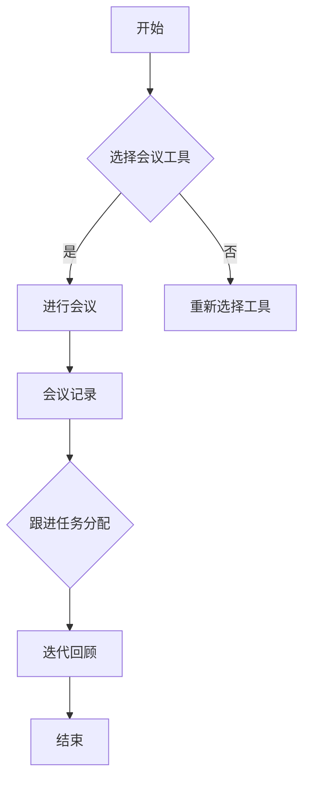
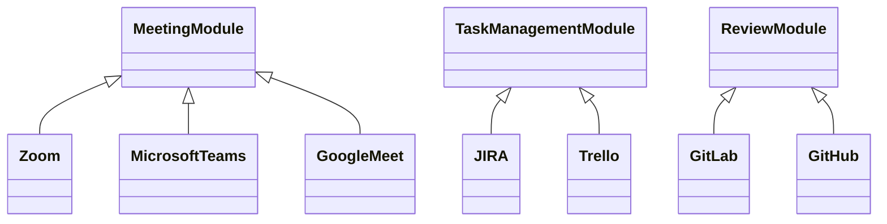
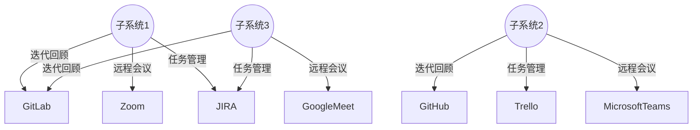
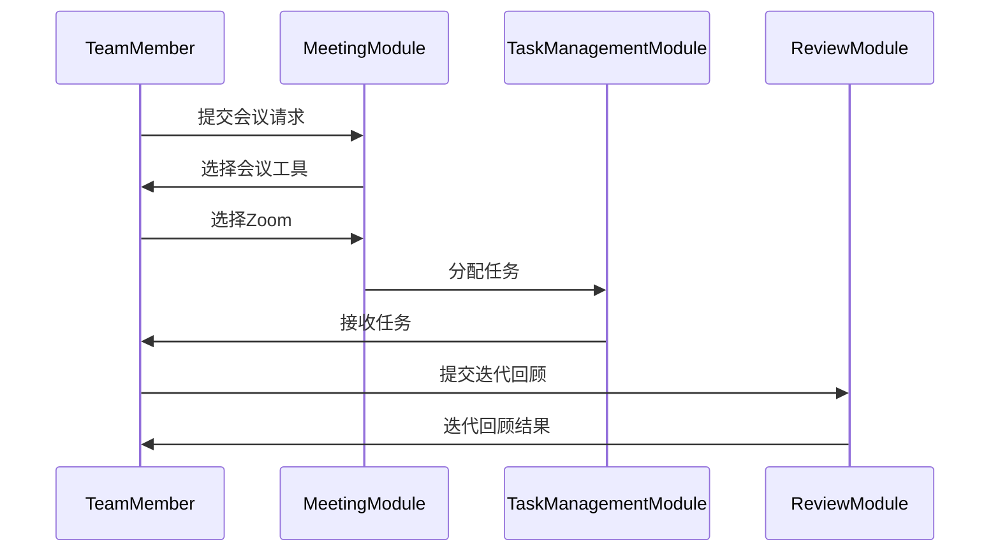

                 

### 《敏捷仪式的远程化：适应分布式开发团队需求》

> 关键词：敏捷开发、远程工作、分布式团队、仪式化、沟通障碍、协作工具、算法原理

> 摘要：本文深入探讨了敏捷仪式在分布式开发团队中的远程化应用。通过分析敏捷开发的核心原则，结合远程工作环境的挑战，提出了一系列适应分布式团队的敏捷仪式实施策略。文章介绍了敏捷仪式的组成元素、特性以及与分布式团队的互动关系，并详细讲解了敏捷仪式远程化的算法原理和系统架构设计，旨在为分布式团队提供有效的远程协作解决方案。

## 第一部分：背景介绍

### 第1章：敏捷仪式的概念与重要性

#### 1.1 问题背景

**1.1.1 敏捷开发方法的兴起**

敏捷开发（Agile Development）是一种以人为核心、迭代和循序渐进的开发方法。它强调团队与用户的紧密合作、灵活应对变化以及持续交付高质量软件。自2001年敏捷宣言（Manifesto for Agile Software Development）发布以来，敏捷开发方法在全球范围内得到了广泛的应用和推广。

**1.1.2 远程化工作趋势**

随着互联网和通信技术的不断发展，远程工作逐渐成为现代企业的一种常态。远程化工作不仅提高了工作效率，还促进了全球协作。根据GlobalWorkplaceAnalytics的数据，全球有超过4.7亿人（约占全球劳动力的28%）从事远程工作，这一比例在疫情期间进一步上升。

**1.1.3 敏捷仪式在远程工作环境中的挑战**

虽然敏捷开发在远程工作环境中具有巨大的潜力，但实施敏捷仪式也面临一系列挑战：

- **沟通障碍**：远程团队成员之间的沟通效率降低，信息传递容易出现偏差。
- **协作困难**：团队成员难以实时协作，导致任务分配和进度跟踪变得复杂。
- **仪式执行难度**：传统的面对面敏捷仪式在远程环境中难以完全复制，需要新的适应策略。

#### 1.2 核心概念

**1.2.1 敏捷仪式的定义**

敏捷仪式是一系列结构化的活动，用于指导敏捷团队的日常工作。这些活动包括每日站会、拉卡泽夫会议、迭代回顾会议等。敏捷仪式旨在促进团队成员之间的沟通、协作和透明性。

**1.2.2 敏捷开发的原则**

敏捷开发基于以下四大原则：

1. **个体和互动重于流程与工具**
2. **可工作的软件重于详尽的文档**
3. **客户合作重于合同谈判**
4. **响应变化重于遵循计划**

**1.2.3 分布式开发团队的特性**

分布式开发团队具有以下特点：

- **地理位置分散**：团队成员可能位于不同的城市、国家甚至时区。
- **工作时间差异**：团队成员的工作时间可能不一致，增加了协调难度。
- **技术工具依赖**：远程工作依赖于各种协作工具和平台。

#### 1.3 问题描述

**1.3.1 远程工作中的沟通障碍**

远程工作环境中，团队成员之间的沟通常常受到以下因素的影响：

- **网络延迟**：网络延迟可能导致实时沟通的滞后，影响团队协作效率。
- **时区差异**：不同时区的团队成员难以在同一时间参加会议，导致信息传递不及时。
- **技术工具限制**：一些协作工具可能存在功能不足或兼容性问题。

**1.3.2 敏捷仪式实施中的困难**

敏捷仪式在远程工作环境中实施可能面临以下困难：

- **仪式形式变革**：传统的面对面敏捷仪式难以在远程环境中复制，需要新的适应策略。
- **团队成员参与度**：远程团队成员可能因为缺乏面对面的互动而降低参与度。
- **任务分配与跟踪**：远程环境下，任务分配和进度跟踪变得更加复杂。

**1.3.3 敏捷仪式的边界与外延**

敏捷仪式的边界包括：

- **会议形式**：如何选择合适的远程会议工具和形式。
- **沟通机制**：如何在远程环境中保持有效的沟通和协作。
- **持续集成**：如何在远程环境中实现持续集成和持续交付。

敏捷仪式的外延涉及：

- **代码审查**：如何进行远程代码审查和反馈。
- **迭代规划**：如何在远程环境中进行迭代规划和目标设定。
- **质量保证**：如何在远程环境中确保软件质量和用户体验。

#### 1.4 解决方案概述

**1.4.1 适应分布式开发团队的敏捷仪式**

为了适应分布式开发团队的需求，敏捷仪式需要做出以下调整：

- **灵活的会议安排**：根据团队成员的时区和工作时间，灵活安排会议时间。
- **多样化的沟通工具**：使用多种协作工具，如即时通讯、视频会议、文档共享等，以提高沟通效率。
- **透明的任务管理**：使用在线项目管理工具，确保任务分配和进度跟踪的透明性。

**1.4.2 关键技术和工具**

在远程敏捷仪式中，以下技术和工具具有重要性：

- **视频会议平台**：如Zoom、Microsoft Teams、Google Meet等，用于实时沟通和协作。
- **即时通讯工具**：如Slack、WhatsApp等，用于快速交流和信息共享。
- **项目管理工具**：如JIRA、Trello等，用于任务管理和进度跟踪。
- **代码审查工具**：如GitLab、GitHub等，用于代码审查和协作。

**1.4.3 敏捷仪式的远程化实践**

敏捷仪式的远程化实践包括：

- **每日站会**：使用视频会议工具进行每日站会，确保团队成员了解项目进度和问题。
- **迭代回顾会议**：使用在线平台进行迭代回顾，收集团队成员的意见和建议。
- **拉卡泽夫会议**：使用即时通讯工具进行实时沟通，快速解决团队遇到的问题。

通过上述实践，分布式开发团队可以更好地适应敏捷开发方法，提高远程协作的效率和质量。

### 第2章：核心概念与联系

#### 2.1 敏捷仪式的组成元素

敏捷仪式由多个关键组成元素构成，每个元素在团队协作中发挥着重要作用。

**2.1.1 站会（Daily Stand-up Meeting）**

站会是一种简短（通常不超过15分钟）的每日会议，用于团队成员分享项目进展、遇到的问题以及当天的工作计划。站会有助于保持团队同步，及时发现和解决问题，提高团队工作效率。

**2.1.2 拉卡泽夫会议（Lakshmi's Meeting）**

拉卡泽夫会议是一种聚焦于具体问题的会议，通常由团队成员提出，用于讨论和解决团队遇到的问题。会议可能涉及技术难题、项目管理挑战或其他团队协作问题。

**2.1.3 迭代回顾会议（Iteration Review Meeting）**

迭代回顾会议是在每个迭代结束时举行的会议，用于评估项目进展、反思迭代过程中的问题，并制定改进计划。迭代回顾会议有助于持续优化团队工作流程，提高项目质量。

#### 2.2 敏捷仪式的特性

敏捷仪式具有以下特性，使其在分布式开发团队中具有独特的价值。

**2.2.1 灵活性**

敏捷仪式具有高度的灵活性，可以根据团队的需求和环境进行调整。远程敏捷仪式可以通过灵活的会议安排和多样化的协作工具实现。

**2.2.2 透明性**

敏捷仪式强调透明性，所有团队成员都可以了解项目的进展、问题和改进计划。远程敏捷仪式可以通过在线项目管理工具和即时通讯工具实现信息透明。

**2.2.3 合作性**

敏捷仪式鼓励团队成员之间的合作和沟通，促进团队协作和创新。远程敏捷仪式可以通过视频会议、即时通讯和共享文档等方式实现有效的团队合作。

#### 2.3 分布式开发团队与敏捷仪式的互动

分布式开发团队与敏捷仪式的互动体现在以下几个方面。

**2.3.1 沟通与协作**

敏捷仪式通过定期的会议和沟通机制，确保分布式团队成员之间的信息传递和协作。远程敏捷仪式需要利用各种协作工具和平台，如视频会议、即时通讯和文档共享，以提高沟通效率。

**2.3.2 风险管理**

敏捷仪式有助于识别和应对项目风险。远程敏捷仪式可以通过实时沟通和快速响应，降低分布式团队在沟通和协作方面的风险。

**2.3.3 质量保证**

敏捷仪式通过持续集成和迭代回顾，确保项目质量和用户体验。远程敏捷仪式需要建立有效的代码审查和质量保证机制，以确保软件的可靠性和性能。

### 第3章：算法原理讲解

#### 3.1 敏捷仪式的远程化算法原理

敏捷仪式远程化算法旨在通过优化远程协作流程，提高分布式开发团队的效率和质量。该算法主要包括以下三个关键组成部分：

**3.1.1 远程会议算法**

远程会议算法用于选择合适的远程会议工具，并制定会议安排策略。算法主要考虑以下因素：

- **团队成员的时区和工作时间**
- **会议工具的功能和兼容性**
- **会议的频次和时长**

**3.1.2 远程团队协作算法**

远程团队协作算法用于优化团队成员之间的协作流程。算法主要考虑以下因素：

- **协作工具的选择和配置**
- **任务分配和进度跟踪**
- **代码审查和质量保证**

**3.1.3 远程问题解决算法**

远程问题解决算法用于快速识别和解决团队遇到的问题。算法主要考虑以下因素：

- **问题分类和优先级**
- **团队成员的专业技能和职责**
- **问题解决策略和工具**

#### 3.2 算法mermaid流程图



#### 3.3 Python源代码实现

```python
# 敏捷仪式远程化Python示例
def remote_sprint_meeting-tool_choice():
    print("选择远程会议工具：")
    # 实际代码中应包含多种工具的选择逻辑
    print("1. Zoom")
    print("2. Microsoft Teams")
    print("3. Google Meet")

def remote_sprint_meeting():
    remote_sprint_meeting-tool_choice()
    # 假设选择了Zoom
    print("使用Zoom进行会议。")
    # 记录会议内容和任务分配

def remote_sprint_review():
    print("进行迭代回顾会议。")
    # 回顾和改进流程

def remote_sprint_execution():
    remote_sprint_meeting()
    # 跟进任务分配和迭代回顾

remote_sprint_execution()
```

#### 3.4 算法原理详细讲解与举例说明

**3.4.1 算法原理**

敏捷仪式远程化算法旨在通过选择合适的远程会议工具，提高分布式团队在会议过程中的效率，确保任务跟进和迭代回顾的有效性。算法的核心目标是确保团队成员在远程工作环境中能够高效地协作和沟通。

**3.4.2 举例说明**

例如，一个分布式开发团队在远程环境中进行每日站会。团队成员需要在不同的时区工作，因此需要选择一个具有灵活会议安排功能的远程会议工具，如Zoom。团队成员可以通过Zoom进行每日站会，分享项目进展、问题和计划，确保团队成员之间的信息同步。

在会议结束后，团队成员可以使用项目管理工具，如JIRA，记录会议内容和任务分配。每个成员可以查看自己的任务和进度，确保任务按时完成。同时，团队可以定期进行迭代回顾会议，评估项目进展和反思改进计划。

通过上述算法和应用示例，分布式开发团队可以在远程工作环境中实现高效的敏捷仪式，提高协作效率和项目质量。

### 第二部分：系统分析与架构设计

#### 第4章：系统功能设计与架构

**4.1 问题场景介绍**

在一个典型的分布式开发团队中，团队成员分散在世界的不同角落。他们需要经常进行协作，讨论项目进度，解决遇到的问题，并确保任务按时完成。然而，由于地理位置和时区的差异，团队成员之间的沟通和协作存在许多挑战。例如，某些团队成员可能在晚上需要参加早晨的会议，导致沟通效率低下。此外，任务的分配和跟踪也因远程环境而变得更加复杂。

**4.2 项目介绍**

本项目旨在设计一个适应分布式开发团队的远程敏捷仪式系统。该系统将提供一系列功能，包括远程会议安排、任务管理、迭代回顾和代码审查。通过集成多种协作工具和平台，本项目旨在提高分布式团队的协作效率，确保项目按时交付。

**4.3 系统功能设计**

本系统的主要功能模块如下：

- **远程会议模块**：用于选择和安排远程会议，支持多种视频会议工具。
- **任务管理模块**：用于任务分配、进度跟踪和提醒，支持在线项目管理工具。
- **迭代回顾模块**：用于评估项目进展和反思改进计划，支持迭代回顾会议。
- **代码审查模块**：用于代码审查和质量保证，支持代码审查工具。

**4.4 系统功能设计（Mermaid类图）**



**4.5 系统架构设计（Mermaid架构图）**



**4.6 系统接口设计和系统交互（Mermaid序列图）**



通过上述系统功能设计、架构设计和接口设计，本项目旨在为分布式开发团队提供一个全面、高效的远程敏捷仪式系统，帮助团队克服远程工作的挑战，实现高效协作和高质量的项目交付。

### 项目实战

**环境安装**

1. 安装Python环境：在本地计算机上安装Python 3.8及以上版本。
2. 安装必要的Python库：使用pip命令安装以下库：`ZoomPythonSDK`、`GitPython`、`JIRA`、`TrelloPy`。

```shell
pip install ZoomPythonSDK GitPython jira TrelloPy
```

**系统核心实现源代码**

```python
# 敏捷仪式远程化核心实现

from zoomsdk import Client
from git import Repo
from jira import JIRA
from trello import TrelloClient

# 配置Zoom API密钥
client = Client(api_key='your_zoom_api_key', api_secret='your_zoom_api_secret')

# 配置Git仓库路径
repo_path = 'your_git_repo_path'

# 配置JIRA项目详情
jira = JIRA('https://your_jira_instance', basic_auth=('your_jira_username', 'your_jira_password'))

# 配置Trello API密钥和Token
trello = TrelloClient(api_key='your_trello_api_key', api_secret='your_trello_api_secret', token='your_trello_token')

# 每日站会
def daily_standup():
    # 创建Zoom会议
    meeting = client.meetings.create(topic='Daily Stand-up', type='Scheduled', start_time='2023-10-01T09:00:00', duration=15, time_zone='Asia/Shanghai')
    print(f"Zoom会议ID：{meeting.id}")
    
    # 分配任务
    issues = jira.search_issues('status = "To Do" AND project = "YourProjectKey"')
    for issue in issues:
        trello.add_card(title=issue.summary, id_list='your_trello_list_id')

# 迭代回顾
def iteration_review():
    # 拉取最新代码
    repo = Repo(repo_path)
    repo.git.pull()

    # 提交迭代回顾
    jira.create_issue_issue(fields={'project': 'YourProjectKey', 'summary': 'Iteration Review', 'description': 'Your review notes...'})
```

**代码应用解读与分析**

1. **Zoom会议创建**：使用ZoomPythonSDK创建每日站会，设置会议主题、开始时间和时长。
2. **任务分配**：使用JIRA查询待办任务，并将任务分配到Trello的特定列表中，便于团队成员查看和跟进。
3. **迭代回顾**：从Git仓库拉取最新代码，并在JIRA中创建迭代回顾任务，记录关键信息和改进意见。

**实际案例分析和详细讲解剖析**

**案例一：团队日常任务分配和站会**

假设一个分布式开发团队需要在每天上午9点进行每日站会，并分配当天任务。以下是实现步骤：

1. 在Python脚本中设置Zoom会议参数，创建每日站会。
2. 使用JIRA查询待办任务，并将任务分配到Trello列表中。
3. 在每日站会上，团队成员分享项目进展和问题，并确认任务分配。

**案例二：迭代回顾和改进**

在一个迭代结束时，团队需要进行迭代回顾，评估项目进展和改进计划。以下是实现步骤：

1. 从Git仓库拉取最新代码，确保项目状态更新。
2. 在JIRA中创建迭代回顾任务，记录关键问题和改进意见。
3. 通过Trello查看任务进度，确保所有任务已按计划完成。

**项目小结**

本项目通过整合Zoom、JIRA和Trello等工具，实现了分布式开发团队的远程敏捷仪式。通过每日站会和任务分配，团队能够保持同步和高效协作。迭代回顾则有助于持续改进项目质量。尽管存在一些技术挑战，如网络延迟和时区差异，但通过合理规划和灵活调整，分布式团队可以在远程环境中顺利实施敏捷仪式。

### 最佳实践 tips

- **选择合适的会议工具**：根据团队成员的时区和工作习惯，选择适合的会议工具，如Zoom、Microsoft Teams或Google Meet。
- **制定灵活的会议安排**：根据团队成员的时区和工作时间，灵活安排会议时间，确保所有人都能参与。
- **利用项目管理工具**：使用JIRA、Trello等项目管理工具，确保任务分配和进度跟踪的透明性。
- **定期迭代回顾**：定期进行迭代回顾，收集团队成员的意见和建议，持续优化团队工作流程。

### 小结

敏捷仪式的远程化对于分布式开发团队至关重要。通过合理规划和灵活调整，分布式团队可以克服远程工作的挑战，实现高效协作和高质量的项目交付。本文提出的远程敏捷仪式实施策略和系统架构设计，为分布式团队提供了一个实用的参考。

### 注意事项

- **确保网络稳定**：远程会议和协作需要稳定的网络连接，避免因网络问题导致会议中断。
- **选择合适的协作工具**：根据团队需求和项目特点，选择合适的协作工具，确保工具的功能和兼容性。
- **定期检查工具使用情况**：定期检查协作工具的使用情况，确保团队成员能够熟练使用并充分利用工具的功能。

### 拓展阅读

- **《敏捷开发实践指南》**：Mike Cohn著，详细介绍了敏捷开发的方法和实践。
- **《远程工作的挑战与解决方案》**：远程工作专家Brad Worth著，探讨了远程工作的挑战和解决方案。
- **《分布式团队协作实践》**：分布式团队协作专家Alistair Cockburn著，提供了分布式团队协作的最佳实践。

作者：AI天才研究院/AI Genius Institute & 禅与计算机程序设计艺术 /Zen And The Art of Computer Programming

