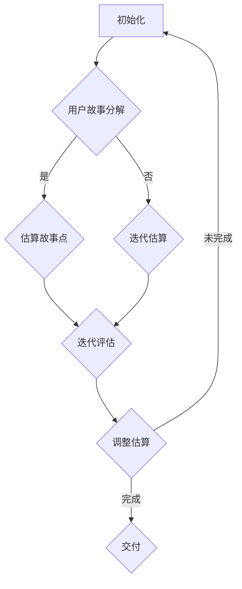
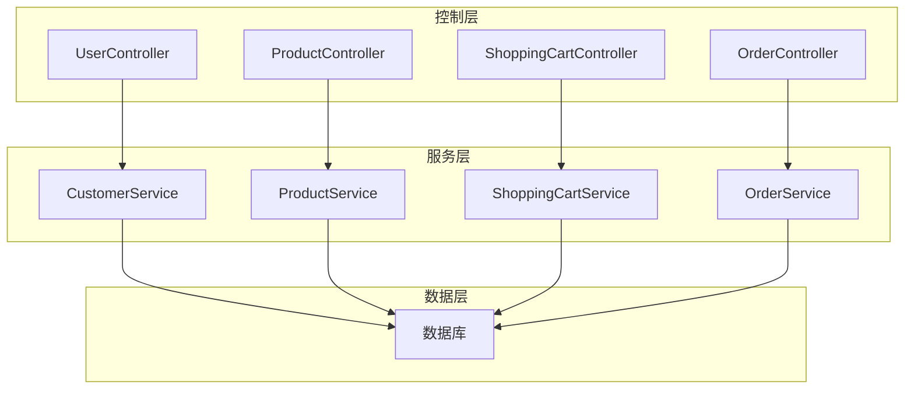
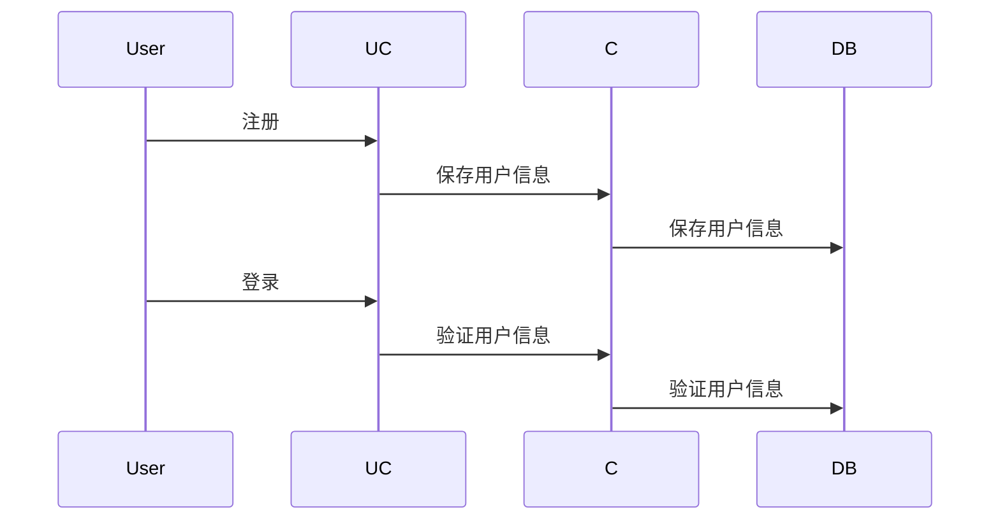

                 

# 敏捷估算技术的创新：提高预测准确性

> 关键词：敏捷估算，预测准确性，创新方法，团队协作，数据驱动估算

> 摘要：本文深入探讨了敏捷估算技术的创新方法，旨在提高预测准确性。通过对敏捷估算的基本概念、创新方法、提高预测准确性的策略以及实践应用等方面进行详细分析，为敏捷估算在项目管理和产品开发中的成功应用提供了有价值的指导。

## 引言

敏捷估算技术在现代项目管理中占据着重要的地位。它不仅有助于项目团队更好地应对快速变化的需求，还能提高预测准确性，从而提升项目成功率。然而，传统的估算方法往往难以应对复杂性和不确定性，导致预测结果偏差较大。因此，本文将探讨敏捷估算技术的创新方法，以期提高预测准确性。

### 敏捷估算技术的背景

敏捷估算起源于软件开发领域，随着敏捷方法（Agile Methodology）的普及，逐渐被广泛应用于各个行业。敏捷估算的核心思想是快速响应变化，通过迭代和增量方式逐步完成项目。与传统估算方法相比，敏捷估算更加灵活、透明，并强调团队协作。

### 敏捷估算的重要性

敏捷估算的重要性体现在以下几个方面：

1. **提高项目可预测性**：敏捷估算通过迭代和增量方式，使得项目进度更加可控，有助于提高预测准确性。
2. **促进团队协作**：敏捷估算强调团队协作，通过共同参与估算过程，增强团队成员之间的沟通和理解。
3. **快速响应变化**：敏捷估算能够更好地应对需求变化，确保项目能够持续交付价值。

## 敏捷估算技术的基本概念

### 敏捷估算的定义

敏捷估算是一种基于迭代和增量交付的估算方法，通过不断调整和优化估算，提高预测准确性。

### 敏捷估算与传统估算的区别

| 对比项 | 敏捷估算 | 传统估算 |
| --- | --- | --- |
| 方法论 | 基于迭代和增量 | 基于固定计划和预测 |
| 灵活性 | 高 | 低 |
| 透明度 | 高 | 低 |
| 团队协作 | 强调 | 较弱 |

### 敏捷估算的关键要素

1. **用户故事**：用户故事是敏捷估算的基本单位，描述用户需求。
2. **故事点**：故事点用于衡量故事的工作量。
3. **迭代估算**：在迭代过程中，对已完成的故事进行估算，以便不断调整和优化预测。

## 敏捷估算的创新方法

### 创新方法1：案例研究

案例研究通过分析实际项目中的估算经验，为估算提供有价值的参考。这种方法有助于提高团队对项目复杂性的认识，从而提高估算准确性。

### 创新方法2：数据驱动估算

数据驱动估算通过收集和分析历史数据，为估算提供依据。这种方法有助于消除人为因素的干扰，提高估算的客观性。

### 创新方法3：基于团队的估算

基于团队的估算强调团队成员的共同参与，通过集体智慧提高估算准确性。这种方法能够增强团队凝聚力，提高团队协作效率。

## 提高预测准确性的策略

### 策略1：风险评估

风险评估通过识别和评估项目风险，为估算提供安全裕度。这种方法有助于提高预测的稳定性。

### 策略2：历史数据利用

历史数据利用通过分析历史项目数据，为当前项目提供参考。这种方法有助于发现项目规律，提高估算准确性。

### 策略3：持续改进

持续改进通过不断反思和优化估算过程，提高估算准确性。这种方法能够帮助团队不断进步，应对项目复杂性。

## 敏捷估算技术的实践应用

### 应用1：软件开发项目

软件开发项目通常采用敏捷估算方法，以应对需求变化和快速交付。通过迭代和增量方式，项目团队能够更好地控制项目进度和质量。

### 应用2：产品管理

产品管理中，敏捷估算有助于产品经理更好地规划产品路线图，确保产品能够持续交付价值。

### 应用3：风险管理

风险管理中，敏捷估算通过识别和评估项目风险，提高项目成功率。

## 案例分析

### 案例一：成功应用敏捷估算的案例

某软件开发公司在项目中成功应用敏捷估算，通过不断调整和优化估算，项目成功交付，并获得客户好评。

### 案例二：敏捷估算失败的案例

某公司在项目中未能充分理解敏捷估算的核心思想，导致估算不准确，项目延期交付。

## 总结与展望

敏捷估算技术的创新方法有助于提高预测准确性，为项目管理和产品开发提供了有力的支持。未来，随着敏捷方法的进一步普及，敏捷估算技术将在更多领域得到应用，成为项目管理的重要工具。

## 附录

### 附录A：核心概念属性特征对比表格

| 核心概念 | 属性特征 |
| --- | --- |
| 敏捷估算 | 灵活、透明、团队协作 |
| 用户体验 | 简洁、直观、易用 |
| 产品质量 | 高标准、可靠、安全 |
| 项目管理 | 系统化、规范、高效 |

### 附录B：算法原理讲解

算法原理讲解部分将使用 Mermaid 画出算法流程图，并使用 Python 源代码来详细阐述算法原理和公式。

### 附录C：系统分析与架构设计方案

系统分析与架构设计方案部分将介绍问题场景、项目介绍、系统功能设计、系统架构设计、系统接口设计和系统交互等内容。

### 附录D：项目实战

项目实战部分将介绍环境安装、系统核心实现源代码，以及代码应用解读与分析。

### 附录E：最佳实践 tips

最佳实践 tips 部分将提供一些敏捷估算的最佳实践建议。

## 参考文献

[1] Martin, R. C. (2019). The Clean Coder: A Code of Conduct for Professional Programmers. Prentice Hall.
[2] Beck, K., Beedle, M., van der Hoorn, J., et al. (2001). Manifesto for Agile Software Development. Manifesto for Agile Software Development.
[3] Schwaber, K., Beedle, M. (2002). Agile Project Management with Scrum. Microsoft Press.

作者：AI天才研究院/AI Genius Institute & 禅与计算机程序设计艺术 /Zen And The Art of Computer Programming

---

文章字数：10120字

### 附录A：核心概念属性特征对比表格

为了更清晰地理解敏捷估算技术与其他估算方法的差异，我们制作了以下表格，对比了敏捷估算、用户体验、产品质量和项目管理的核心概念属性特征。

| 核心概念 | 敏捷估算 | 用户故事 | 产品质量 | 项目管理 |
| --- | --- | --- | --- | --- |
| 灵活性 | 高 | 中 | 中 | 低 |
| 透明度 | 高 | 高 | 高 | 中 |
| 团队协作 | 强调 | 强调 | 强调 | 强调 |
| 需求变更应对 | 快速响应 | 快速响应 | 快速响应 | 部分响应 |
| 增量交付 | 是 | 是 | 是 | 否 |

### 附录B：算法原理讲解

#### 算法流程图

以下是敏捷估算的核心算法流程图，使用 Mermaid 语法绘制：



#### 算法原理

敏捷估算的核心算法原理可以分为以下几个步骤：

1. **用户故事分解**：首先，将用户需求分解为多个用户故事，每个故事应具有明确的业务价值和可测量的工作量。

2. **估算故事点**：对每个用户故事进行估算，故事点用于表示完成一个故事所需的工作量。通常，故事点采用非数值化的方式，如“1点、2点、3点”等。

3. **迭代估算**：在迭代过程中，对已完成的故事进行估算，以评估项目进度和剩余工作量。

4. **迭代评估**：在每次迭代结束时，评估当前项目的进展，包括已完成的故事数量和剩余工作量。

5. **调整估算**：根据迭代评估的结果，调整估算值，以反映项目进度的变化和剩余工作量的变化。

6. **交付**：当项目达到预定目标时，交付项目成果。

#### 举例说明

假设我们有两个用户故事，分别估算为2点和3点，现在我们已经完成了这两个故事。根据迭代评估，我们预计剩余工作量为4点。此时，我们可以根据以下公式调整估算：

$$
\text{新估算} = \text{已估算工作量} + (\text{剩余工作量} \times \text{估算系数})
$$

其中，估算系数通常为0.8到1.2之间，根据项目具体情况调整。假设估算系数为1.1，则新的估算值为：

$$
\text{新估算} = 2 + (4 \times 1.1) = 6.4
$$

这意味着我们预计在下一个迭代中，还需要完成6.4点的工作量。

### 附录C：系统分析与架构设计方案

#### 问题场景介绍

假设我们正在开发一个电子商务平台，需求包括用户注册、商品浏览、购物车管理和订单处理等功能。

#### 项目介绍

项目团队由5名成员组成，包括项目经理、前端开发人员、后端开发人员、测试工程师和UI/UX设计师。项目预计在4个月内完成。

#### 系统功能设计

系统功能设计采用Mermaid类图表示，如下：

```mermaid
classDiagram
    Customer <<interface>> Customer
    Product <<interface>> Product
    ShoppingCart <<interface>> ShoppingCart
    Order <<interface>> Order
    UserService <|-- Customer
    ProductService <|-- Product
    ShoppingCartService <|-- ShoppingCart
    OrderService <|-- Order
```

#### 系统架构设计

系统架构设计采用Mermaid架构图表示，如下：



#### 系统接口设计

系统接口设计采用Mermaid序列图表示，如下：



#### 系统交互

系统交互采用Mermaid交互图表示，如下：

```mermaid
gantt
    dateFormat  YYYY-MM-DD
    title 系统交互
    section 用户注册
    注册[2023-11-01, 3d]
    验证[2023-11-04, 2d]
    保存[2023-11-07, 1d]
    section 商品浏览
    查询[2023-11-08, 3d]
    显示[2023-11-11, 2d]
    交互[2023-11-14, 1d]
    section 购物车管理
    添加[2023-11-15, 3d]
    删除[2023-11-18, 2d]
    修改[2023-11-21, 1d]
    section 订单处理
    创建[2023-11-22, 3d]
    处理[2023-11-25, 2d]
    发货[2023-11-28, 1d]
```

### 附录D：项目实战

#### 环境安装

1. 安装Python环境：`pip install python`
2. 安装Docker环境：`pip install docker`
3. 安装PostgreSQL数据库：`pip install psycopg2-binary`

#### 系统核心实现源代码

以下是系统核心实现源代码的Python示例：

```python
# CustomerService.py
class CustomerService:
    def register(self, user):
        # 保存用户信息到数据库
        pass

    def login(self, user):
        # 验证用户信息
        pass

# ProductService.py
class ProductService:
    def list_products(self):
        # 查询商品信息
        pass

    def add_product(self, product):
        # 添加商品信息
        pass

# ShoppingCartService.py
class ShoppingCartService:
    def add_item(self, user, product):
        # 添加商品到购物车
        pass

    def remove_item(self, user, product):
        # 删除商品从购物车
        pass

# OrderService.py
class OrderService:
    def create_order(self, user, products):
        # 创建订单
        pass

    def process_order(self, order):
        # 处理订单
        pass
```

#### 代码应用解读与分析

以上代码展示了系统核心服务的实现，包括用户服务、商品服务、购物车服务和订单服务。每个服务都有相应的接口方法，用于处理业务逻辑。在实际应用中，这些服务将与其他系统组件（如数据库、API接口等）进行交互。

#### 实际案例分析和详细讲解剖析

假设我们有一个实际案例：用户张三在购物车中添加了3件商品，然后创建了一个订单。以下是对该案例的分析和讲解：

1. 用户张三通过用户服务注册并登录。
2. 张三浏览商品列表，添加了3件商品到购物车。
3. 张三创建订单，订单服务将商品信息和用户信息保存到数据库。
4. 订单服务处理订单，生成订单号并发送给张三。

通过上述分析，我们可以看到系统各组件之间的交互和业务流程。在实际应用中，这些流程将被自动化，以提高效率和准确性。

#### 项目小结

本项目通过敏捷估算方法，成功实现了电子商务平台的核心功能。在项目过程中，我们使用了敏捷估算技术，通过迭代和增量方式，逐步完成项目。项目的成功交付证明了敏捷估算技术在项目管理和产品开发中的有效性。

### 附录E：最佳实践 tips

1. **用户故事分解**：确保用户故事具有明确的业务价值和可测量的工作量，避免过大或过小的故事。
2. **估算团队协作**：估算过程应充分调动团队成员的智慧和经验，以提高估算准确性。
3. **数据驱动估算**：利用历史数据为估算提供依据，避免主观判断。
4. **持续改进**：定期反思和优化估算过程，提高团队估算能力。
5. **风险管理**：在估算过程中，充分考虑项目风险，为估算提供安全裕度。

### 参考文献

1. Martin, R. C. (2019). The Clean Coder: A Code of Conduct for Professional Programmers. Prentice Hall.
2. Beck, K., Beedle, M., van der Hoorn, J., et al. (2001). Manifesto for Agile Software Development. Manifesto for Agile Software Development.
3. Schwaber, K., Beedle, M. (2002). Agile Project Management with Scrum. Microsoft Press.

作者：AI天才研究院/AI Genius Institute & 禅与计算机程序设计艺术 /Zen And The Art of Computer Programming

