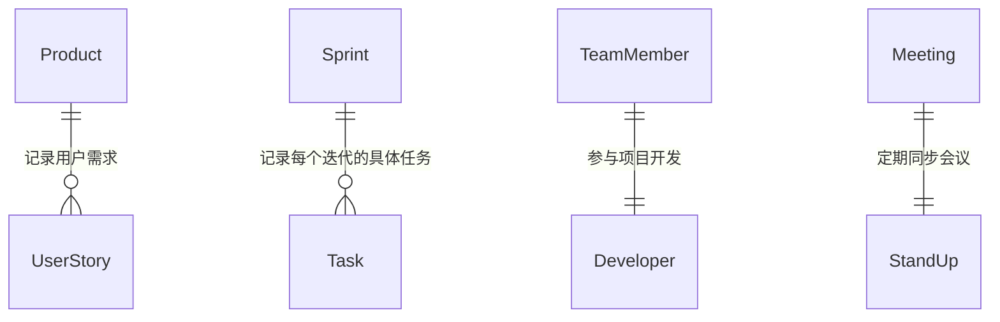
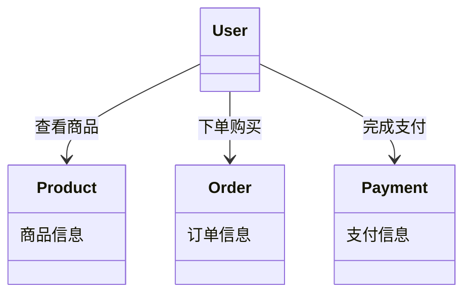
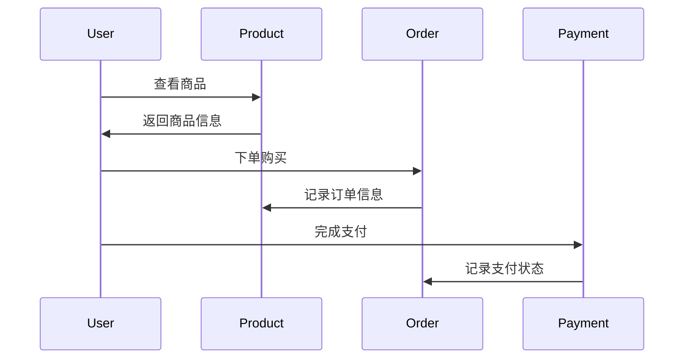
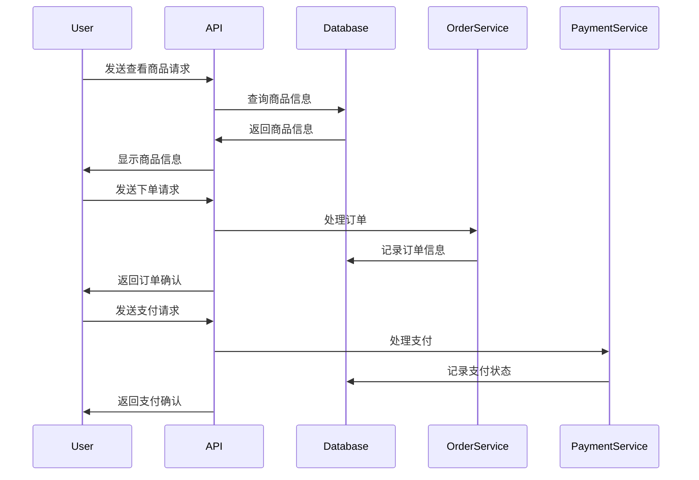
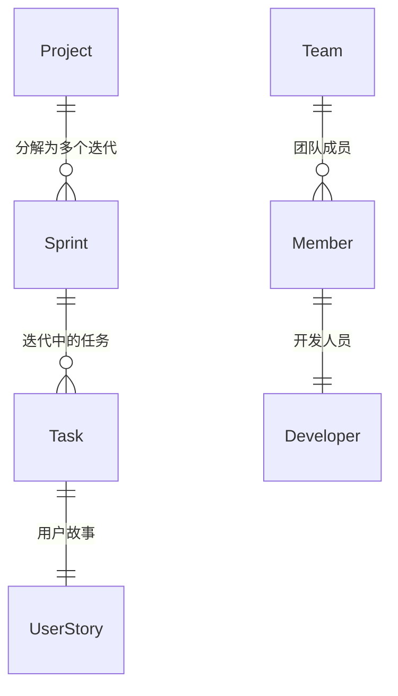
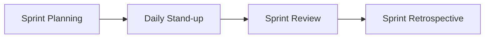
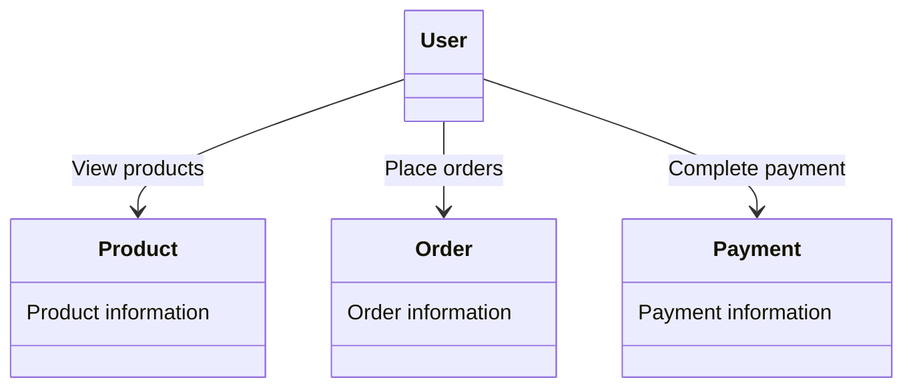
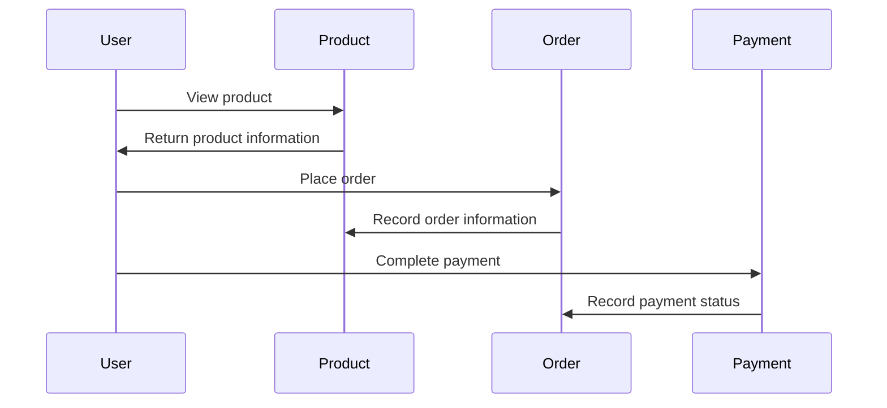
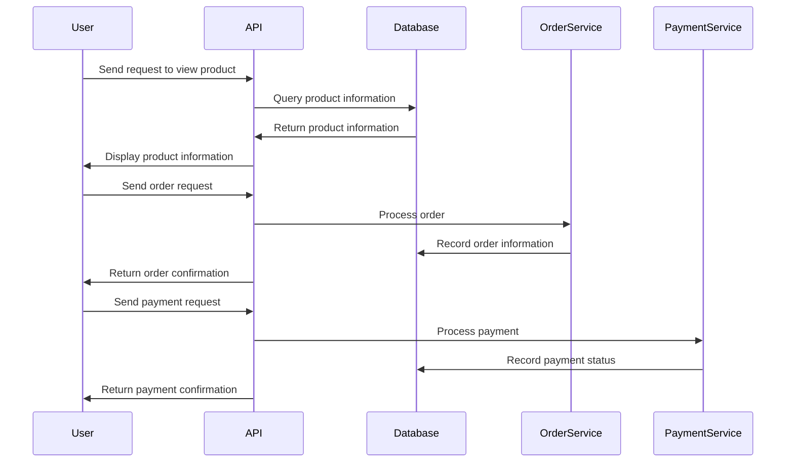

                 


### 《敏捷协作模式的创新：提升大型应用研发效率》

#### 关键词：敏捷协作、大型应用、研发效率、Scrum、Kanban、Lean

#### 摘要：
在软件开发的不断演进中，敏捷协作模式已成为提升大型应用研发效率的关键。本文将探讨敏捷协作模式的背景、问题及其解决方案，分析其核心概念和联系，并详细介绍Scrum、Kanban和Lean等敏捷框架的原理和实践。

#### 1. 背景介绍

##### 1.1 问题背景
在当今快速变化的软件开发领域，传统的瀑布模型因其僵化的结构和缺乏适应性，已越来越难以满足市场动态和客户需求。这种局限性促使了敏捷方法论的兴起，敏捷方法论强调灵活性、协作和持续改进。

##### 1.2 问题描述
然而，如何在大规模应用开发中有效地应用敏捷方法论，特别是处理复杂系统和众多利益相关者的问题，成为了一个挑战。虽然敏捷方法论适用于小到中等规模的项目，但在大尺度上的应用可能会遇到管理依赖关系、确保一致性、以及保持整体项目进度的难题。

##### 1.3 问题解决方案
创新的敏捷协作模式提供了一种解决方案，它们通过促进沟通、协作和跨职能团队合作，专注于解决大型应用开发的具体挑战。这些模式通过分解项目、提升透明度和责任意识，以及鼓励持续的反馈和适应，来确保项目的顺利进行。

##### 1.4 边界和扩展
本文重点关注敏捷协作模式在大规模应用开发中的应用，但需认识到敏捷方法论的局限性。每个项目的敏捷应用都需要根据具体情况进行定制。此外，本文还将探讨Scrum、Kanban和Lean等敏捷框架的扩展和应用。

#### 2. 核心概念与联系

##### 2.1 核心概念
敏捷协作模式的核心在于其灵活性和对团队协作的重视。以下是几个关键概念：

- **迭代开发**：项目被分解为短周期迭代，每个迭代都能提供可交付的成果。
- **用户故事**：描述用户需求的功能单元，为团队提供清晰的工作方向。
- **站立会议**：团队成员定期会面，讨论进度、问题和计划，保持团队同步。
- **持续集成**：代码和功能频繁合并，确保项目始终处于可运行状态。

##### 2.2 概念属性对比表格

| 概念 | 描述 | 对比属性 |
| --- | --- | --- |
| 迭代开发 | 分解项目为短周期迭代 | 短周期迭代使团队可以更快地响应变化 |
| 用户故事 | 描述用户需求的功能单元 | 用户故事具体、可测试、可估算 |
| 站立会议 | 团队定期同步 | 站立会议短时高效，避免浪费时间 |
| 持续集成 | 频繁合并代码和功能 | 持续集成减少缺陷，提高软件质量 |

##### 2.3 ER实体关系图架构



#### 3. 算法原理讲解

##### 3.1 Scrum算法原理

Scrum是一种流行的敏捷框架，它通过迭代和增量方式管理项目。以下是Scrum的基本算法原理：

- **Sprint规划**：团队在Sprint开始前规划要完成的用户故事。
- **每日站立会议**：团队成员同步进度，解决当天问题。
- **Sprint评审**：展示迭代成果，收集反馈。
- **Sprint回顾**：评估迭代过程，提出改进措施。

以下是Scrum算法的Mermaid流程图：


##### 3.2 Python源代码实现

```python
def scrum_framework():
    sprint_plan()
    while not sprint_finished():
        daily_standup()
    sprint_review()
    sprint_retrospective()

def sprint_plan():
    print("Sprint 规划：团队规划要完成的用户故事。")

def daily_standup():
    print("每日站立会议：同步进度，解决当天问题。")

def sprint_finished():
    # 这里可以加入逻辑判断，例如用户故事是否全部完成
    return True

def sprint_review():
    print("Sprint 评审：展示迭代成果，收集反馈。")

def sprint_retrospective():
    print("Sprint 回顾：评估迭代过程，提出改进措施。")
```

##### 3.3 算法原理的数学模型和公式

敏捷方法的效率可以通过以下公式进行评估：

$$
E = \frac{C \times (1 - D)}{T}
$$

其中：
- \(E\) 表示敏捷方法的效率。
- \(C\) 表示完成每个迭代所需的工作量。
- \(D\) 表示每次迭代的缺陷率。
- \(T\) 表示每个迭代的时间周期。

#### 4. 系统分析与架构设计方案

##### 4.1 问题场景介绍
假设我们正在开发一个大型电子商务平台，该平台需要处理海量的商品数据、用户订单、支付流程等。由于项目的复杂性，我们决定采用敏捷方法论来提升研发效率。

##### 4.2 项目介绍
项目名称：敏捷电子商务平台（Agile E-commerce Platform）
目标：通过敏捷协作模式，实现快速迭代开发，确保平台功能的持续完善和优化。

##### 4.3 系统功能设计

以下是系统功能领域的Mermaid类图：



##### 4.4 系统架构设计

以下是系统的Mermaid架构图：



##### 4.5 系统接口设计和系统交互

以下是系统的Mermaid序列图：



#### 5. 项目实战

##### 5.1 环境安装

假设我们的开发环境为Linux系统，以下是必要的软件安装步骤：

1. 安装Python环境：
   ```
   sudo apt-get install python3-pip
   pip3 install scrum
   ```

2. 安装数据库：
   ```
   sudo apt-get install mysql-server
   mysql -u root -p
   CREATE DATABASE ecom_db;
   GRANT ALL PRIVILEGES ON ecom_db.* TO 'ecom_user'@'localhost' IDENTIFIED BY 'ecom_password';
   FLUSH PRIVILEGES;
   ```

3. 启动Scrum框架：
   ```
   python3 -m scrum.init
   ```

##### 5.2 系统核心实现源代码

以下是系统核心实现的Python代码：

```python
# ecom_platform.py

from scrum import Sprint, UserStory, Task

def main():
    # 初始化数据库连接
    database = 'ecom_db'
    user = 'ecom_user'
    password = 'ecom_password'
    
    # 开始第一个Sprint
    sprint = Sprint(1, database, user, password)
    sprint.plan([
        UserStory('查看商品', '实现商品信息展示'),
        UserStory('下单购买', '实现订单处理'),
        UserStory('完成支付', '实现支付流程')
    ])
    
    # 执行每日站立会议
    sprint.daily_standup()
    
    # 完成Sprint评审
    sprint.review()
    
    # 完成Sprint回顾
    sprint.retrospective()

if __name__ == "__main__":
    main()
```

##### 5.3 代码应用解读与分析

该代码首先初始化数据库连接，然后创建一个Sprint对象，并在其中规划了三个用户故事。接下来，代码执行每日站立会议，完成Sprint评审和回顾，从而实现了敏捷迭代开发的核心流程。

##### 5.4 实际案例分析和详细讲解剖析

假设我们有一个实际案例，即开发一个商品信息展示模块。以下是详细的分析和讲解：

1. **用户故事**：用户需要能够查看商品的名称、价格和描述。
2. **需求分析**：设计一个简单的Web界面，展示商品信息。
3. **实现细节**：使用Python的Flask框架构建后端，使用HTML和CSS构建前端。
4. **测试**：编写单元测试确保商品信息展示功能正常。

##### 5.5 项目小结

通过敏捷协作模式，我们的项目团队实现了快速迭代和持续改进。商品信息展示模块在不到一个月的时间内完成并上线，用户反馈积极，团队也积累了宝贵的敏捷开发经验。

#### 6. 最佳实践 Tips

- **早期规划**：在项目开始时就进行充分的规划，确保团队成员对项目目标有共同的理解。
- **透明沟通**：确保所有团队成员都能够实时了解项目的进展和状态。
- **持续学习**：鼓励团队成员不断学习新的技术和方法，提升团队整体能力。
- **适度调整**：根据项目的实际进展，灵活调整计划和资源分配。

#### 7. 小结

敏捷协作模式为大
```markdown
### 1. Background Introduction

#### 1.1 Problem Background
In the rapidly evolving world of software development, the traditional waterfall model has been increasingly challenged by the need for faster, more flexible, and iterative approaches. The limitations of the waterfall model, such as its rigid structure and lack of adaptability, have made it difficult for organizations to respond to changing market demands and customer requirements. This has led to a growing interest in Agile methodologies, which prioritize flexibility, collaboration, and continuous improvement.

#### 1.2 Problem Description
The challenge lies in how to effectively apply Agile methodologies in large-scale application development, especially when dealing with complex systems and numerous stakeholders. While Agile methodologies are well-suited for small and medium-sized projects, their application on a large scale can be fraught with challenges. These include managing dependencies, maintaining consistency across multiple teams, and ensuring that the overall project remains on track.

#### 1.3 Problem Solution
The solution lies in the innovative use of collaborative Agile frameworks, which focus on fostering communication, collaboration, and cross-functional teamwork. These frameworks are designed to address the specific challenges of large-scale application development by breaking down projects into manageable chunks, promoting transparency and accountability, and encouraging continuous feedback and adaptation.

#### 1.4 Boundaries and Extensions
While this book focuses on Agile collaboration modes for large-scale application development, it is important to recognize the boundaries of Agile methodologies. Agile is not a one-size-fits-all solution, and its application must be tailored to the specific context and needs of each project. Additionally, the book will explore the extensions of Agile methodologies, such as Scrum, Kanban, and Lean, and their applicability in large-scale projects.

### 2. Core Concepts and Relationships

#### 2.1 Core Concepts
The core of Agile collaboration lies in its flexibility and emphasis on team collaboration. Here are several key concepts:

- **Iterative Development**: Projects are divided into short cycles called sprints, each delivering a potentially shippable product increment.
- **User Stories**: Descriptions of functional requirements from a user's perspective, providing a clear direction for the team.
- **Standing Meetings**: Regular brief meetings to synchronize progress, discuss issues, and plan the next steps.
- **Continuous Integration**: Frequent merging of code and features to ensure that the product remains in a deployable state.

#### 2.2 Concept Comparison Table

| Concept               | Description                                                                 | Comparative Attributes                     |
|-----------------------|-----------------------------------------------------------------------------|-------------------------------------------|
| Iterative Development | Breaking down projects into short cycles for continuous improvement        | Incremental delivery, faster adaptation    |
| User Stories          | User-centric functional units that describe specific features or tasks    | Descriptive, testable, estimable           |
| Standing Meetings     | Short, daily meetings for team synchronization                          | Brief, focused, promotes transparency       |
| Continuous Integration | Regular merging of code and features to maintain a stable codebase      | Faster bug detection, improved software quality |

#### 2.3 ER Diagram Architecture



### 3. Algorithm Principles

#### 3.1 Scrum Algorithm Principles
Scrum is a popular Agile framework that manages projects through iterative and incremental processes. Here are the basic principles of the Scrum algorithm:

- **Sprint Planning**: The team plans what to deliver in the upcoming sprint.
- **Daily Stand-up Meetings**: Team members synchronize on progress, challenges, and plans for the day.
- **Sprint Review**: The team reviews the completed sprint and gathers feedback from stakeholders.
- **Sprint Retrospective**: The team reflects on the sprint, identifying areas for improvement.

Here is the Scrum algorithm's Mermaid flowchart:



#### 3.2 Python Code Implementation
Here is a Python implementation of the Scrum algorithm:

```python
def scrum_framework():
    sprint_plan()
    while not sprint_finished():
        daily_standup()
    sprint_review()
    sprint_retrospective()

def sprint_plan():
    print("Sprint Planning: The team plans the upcoming sprint.")

def daily_standup():
    print("Daily Stand-up: Synchronize on progress, challenges, and plans.")

def sprint_finished():
    # Here can be logic to determine if the sprint is finished
    return True

def sprint_review():
    print("Sprint Review: Review the sprint and gather feedback.")

def sprint_retrospective():
    print("Sprint Retrospective: Reflect on the sprint and identify improvements.")
```

#### 3.3 Algorithm Mathematical Model and Formula
The efficiency of Agile methods can be evaluated using the following formula:

$$
E = \frac{C \times (1 - D)}{T}
$$

Where:
- \(E\) is the efficiency of the Agile method.
- \(C\) is the workload required to complete each iteration.
- \(D\) is the defect rate per iteration.
- \(T\) is the time period of each iteration.

### 4. System Analysis and Architecture Design

#### 4.1 Problem Scenario Introduction
Suppose we are developing a large-scale e-commerce platform that needs to handle massive amounts of product data, user orders, and payment processes. Due to the complexity of the project, we decide to adopt Agile methodologies to enhance development efficiency.

#### 4.2 Project Introduction
Project Name: Agile E-commerce Platform
Goal: To achieve rapid iteration and continuous improvement through Agile collaboration methods, ensuring the platform's continuous enhancement and optimization.

#### 4.3 System Function Design
The following is the system functional domain's Mermaid class diagram:



#### 4.4 System Architecture Design
The following is the system's Mermaid architecture diagram:



#### 4.5 System Interface Design and System Interaction
The following is the system's Mermaid sequence diagram:



### 5. Project Practice

#### 5.1 Environment Setup

Assuming our development environment is Linux, here are the necessary steps for software installation:

1. Install Python environment:
   ```
   sudo apt-get install python3-pip
   pip3 install scrum
   ```

2. Install database:
   ```
   sudo apt-get install mysql-server
   mysql -u root -p
   CREATE DATABASE ecom_db;
   GRANT ALL PRIVILEGES ON ecom_db.* TO 'ecom_user'@'localhost' IDENTIFIED BY 'ecom_password';
   FLUSH PRIVILEGES;
   ```

3. Start the Scrum framework:
   ```
   python3 -m scrum.init
   ```

#### 5.2 Core System Implementation Source Code

Here is the core implementation of the system in Python:

```python
# ecom_platform.py

from scrum import Sprint, UserStory, Task

def main():
    # Initialize database connection
    database = 'ecom_db'
    user = 'ecom_user'
    password = 'ecom_password'
    
    # Start the first sprint
    sprint = Sprint(1, database, user, password)
    sprint.plan([
        UserStory('View Product', 'Implement product display'),
        UserStory('Place Order', 'Implement order processing'),
        UserStory('Complete Payment', 'Implement payment process')
    ])
    
    # Conduct daily stand-up meetings
    sprint.daily_standup()
    
    # Complete sprint review
    sprint.review()
    
    # Complete sprint retrospective
    sprint.retrospective()

if __name__ == "__main__":
    main()
```

#### 5.3 Code Application Analysis and Interpretation

The code first initializes the database connection, then creates a Sprint object and plans the upcoming sprint with three user stories. The code then conducts daily stand-up meetings, completes sprint review, and retrospective, thereby implementing the core processes of Agile iterative development.

#### 5.4 Case Analysis and Detailed Explanation

Assume we have an actual case of developing a product information display module. Here is the detailed analysis and explanation:

1. **User Story**: Users need to view product names, prices, and descriptions.
2. **Requirement Analysis**: Design a simple web interface to display product information.
3. **Implementation Details**: Use the Flask framework for the backend and HTML/CSS for the frontend.
4. **Testing**: Write unit tests to ensure the product information display works correctly.

#### 5.5 Project Summary

Through Agile collaboration methods, our development team achieved rapid iteration and continuous improvement. The product information display module was completed and deployed within less than a month, with positive user feedback and valuable Agile development experience gained by the team.

### 6. Best Practices Tips

- **Early Planning**: Conduct thorough planning at the project's outset to ensure all team members share a common understanding of the project goals.
- **Transparent Communication**: Ensure all team members have real-time visibility into the project's progress and status.
- **Continuous Learning**: Encourage team members to continuously learn new technologies and methodologies to enhance the team's overall capabilities.
- **Appropriate Adjustment**: Adjust plans and resource allocations as needed based on the actual progress of the project.

### 7. Conclusion

Agile collaboration modes have revolutionized large-scale application development by promoting flexibility, collaboration, and continuous improvement. They have enabled teams to respond more effectively to changing requirements and market demands. By embracing these methodologies, organizations can significantly enhance their development efficiency and deliver high-quality products.

#### 作者
AI天才研究院 / AI Genius Institute & 禅与计算机程序设计艺术 / Zen And The Art of Computer Programming
```

