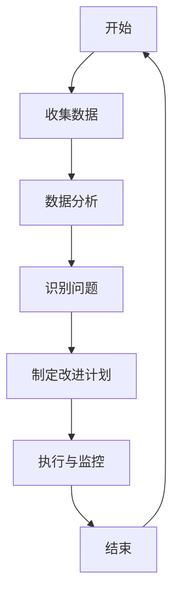
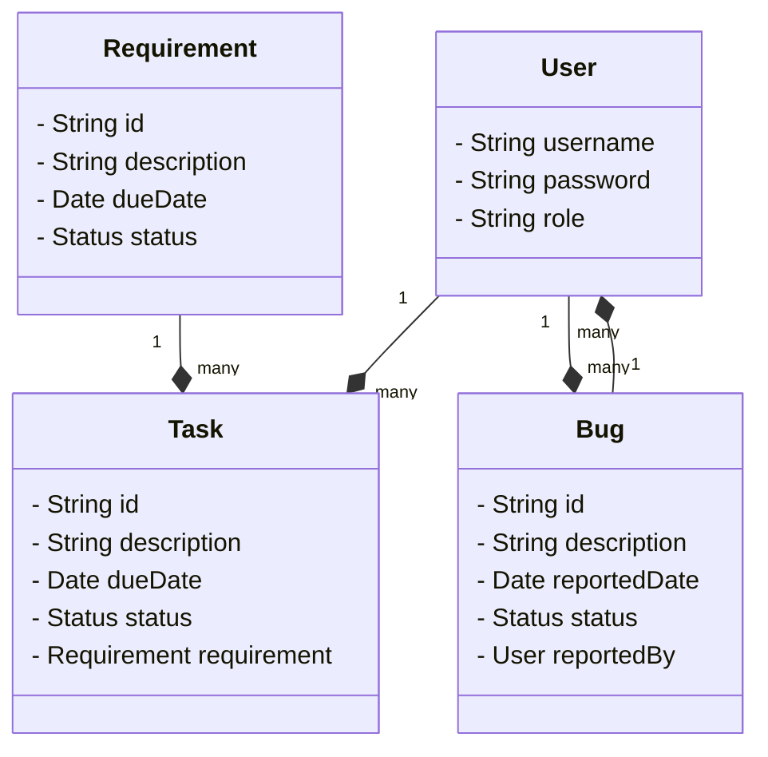
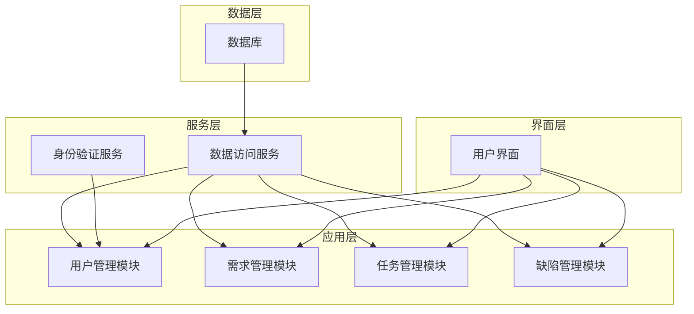
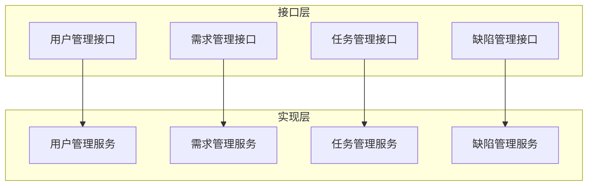
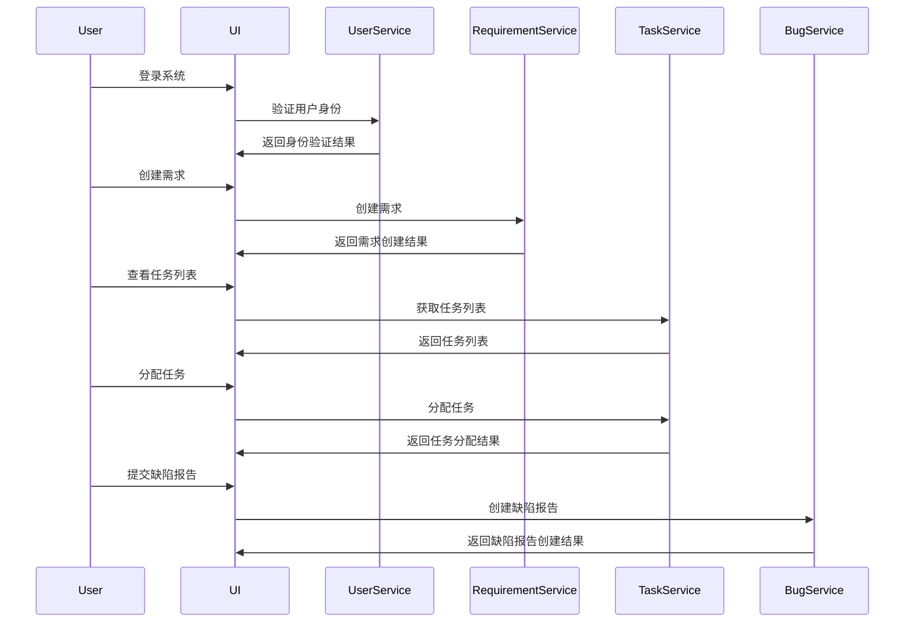

                 

## 第一部分：背景介绍

### 1.1 问题背景

敏捷回顾会议是敏捷开发中至关重要的环节，通过回顾和评估项目执行情况，团队能够发现改进机会，提高开发效率和产品质量。然而，随着项目规模的扩大和团队复杂性的增加，传统的敏捷回顾会议往往无法有效地应对这些问题。

在敏捷开发初期，团队规模较小，沟通和协作相对简单，传统的回顾会议形式即可满足需求。然而，随着项目规模的扩大，团队数量增加，团队成员分散在不同地点，沟通和协作变得更加复杂。此时，传统的回顾会议形式难以覆盖所有团队成员，导致部分团队成员的参与度降低，影响了回顾会议的效果。

此外，大型应用开发过程中，项目需求和目标的复杂性增加，变化也更加频繁。传统回顾会议的时间和方法往往无法及时适应这些变化，导致团队无法及时识别和解决问题，影响了项目的进度和质量。

### 1.2 问题描述

在大型应用开发中，敏捷回顾会议面临着以下挑战：

1. **如何识别和解决关键问题**：大型应用开发中，问题种类繁多，涉及多个领域和层次。如何准确地识别关键问题，并采取有效的措施解决，是一个重要挑战。

2. **如何确保所有团队成员的参与**：大型应用开发涉及多个团队，团队成员分散在不同地点。如何确保所有团队成员都能够积极参与回顾会议，分享经验和观点，是一个重要问题。

3. **如何有效地利用会议时间**：大型应用开发过程中，项目需求和目标变化频繁，如何合理安排回顾会议的时间，确保会议内容充实且高效，是一个重要挑战。

### 1.3 问题解决

本书旨在探索敏捷回顾会议的创新方法，以促进大型应用开发的持续改进。通过介绍新的工具和技术，帮助团队克服传统回顾会议的局限性。以下是本书的主要解决思路：

1. **引入数据分析工具**：通过数据分析，帮助团队更准确地识别关键问题，并为解决问题提供数据支持。

2. **建立实时反馈机制**：通过实时反馈机制，确保所有团队成员都能够及时参与回顾会议，分享经验和观点。

3. **采用分层回顾方法**：将回顾会议分为多个层次，从整体到细节，确保所有关键问题都得到充分讨论。

4. **引入敏捷游戏**：通过敏捷游戏，增强团队成员的参与度和互动性，提高回顾会议的效率和质量。

### 1.4 边界与外延

本书主要关注大型应用开发中的敏捷回顾会议，但所提出的创新方法和技术也可应用于其他类型的敏捷项目。例如，在软件产品开发、互联网应用开发等领域，同样可以借鉴本书中的方法和思路，提高项目质量和团队协作效率。

### 1.5 概念结构与核心要素组成

#### 敏捷回顾会议

- **定义**：敏捷回顾会议是敏捷开发中的一种重要实践，通过反思和评估过去的工作，为未来的改进提供方向。
- **作用**：提高团队协作效率，促进持续改进，增强团队凝聚力。
- **流程**：回顾项目进展、识别问题与挑战、制定改进计划。

#### 大型应用开发

- **定义**：大型应用开发涉及复杂的项目管理和团队协作，通常需要多个团队、多个领域的协作。
- **挑战**：复杂的项目管理、多团队协作、需求变化频繁、资源分配困难。
- **特点**：项目规模大、团队复杂、需求多变、变化频繁。

#### 创新方法

- **工具**：数据分析工具、实时反馈机制、敏捷游戏。
- **方法论**：分层回顾、小组回顾。

## 第二部分：核心概念与联系

### 2.1 敏捷回顾会议的定义与作用

#### 2.1.1 敏捷回顾会议的定义

敏捷回顾会议是敏捷开发过程中的一种重要实践，它通常在迭代或冲刺的结束阶段进行。敏捷回顾会议的目的是通过反思和评估过去的工作，发现改进的机会，为未来的迭代提供指导。

敏捷回顾会议不同于传统的项目评审会议，它更注重团队的实际经验和反馈，而不是仅仅关注项目的进度和完成情况。在敏捷回顾会议中，团队成员会共同讨论以下几个方面：

1. **项目进展**：回顾已完成的工作，分析项目的进度和质量。
2. **问题与挑战**：讨论在项目执行过程中遇到的问题和挑战，分析原因和影响。
3. **改进机会**：根据项目进展和问题分析，提出改进措施，为未来的迭代提供指导。

#### 2.1.2 敏捷回顾会议的作用

敏捷回顾会议在敏捷开发中起着至关重要的作用，它有助于团队提高协作效率、促进持续改进和增强团队凝聚力。具体来说，敏捷回顾会议的作用包括以下几个方面：

1. **提高团队协作效率**：通过回顾和反思，团队成员可以更好地了解彼此的工作方式和需求，从而提高协作效率。在回顾会议中，团队可以讨论如何优化工作流程、提高沟通效率，从而减少不必要的浪费。

2. **促进持续改进**：敏捷回顾会议帮助团队识别问题和改进机会，推动项目持续改进。通过分析过去的工作，团队可以找出存在的问题，并制定相应的改进措施，从而在未来的迭代中避免类似问题的发生。

3. **增强团队凝聚力**：回顾会议提供了一个交流和分享的平台，有助于增强团队成员之间的信任和凝聚力。在回顾会议中，团队成员可以分享自己的经验和观点，互相支持和鼓励，从而建立更紧密的团队关系。

### 2.2 大型应用开发的挑战

#### 2.2.1 复杂的项目管理

大型应用开发涉及复杂的项目管理，主要包括以下几个方面：

1. **多团队协作**：大型应用开发通常涉及多个团队，如开发团队、测试团队、运维团队等。如何协调和沟通这些团队，确保项目的顺利推进，是一个重要挑战。

2. **需求管理**：大型应用开发中，需求变化频繁且复杂。如何有效地管理需求，确保需求的合理性和可行性，是一个关键问题。

3. **资源分配**：大型应用开发需要大量的人力、物力和财力资源。如何合理分配和管理这些资源，确保项目的顺利推进，是一个重要挑战。

4. **风险管理**：大型应用开发面临多种风险，如技术风险、市场风险、运营风险等。如何识别和应对这些风险，确保项目的顺利进行，是一个重要挑战。

#### 2.2.2 团队协作

大型应用开发中，团队协作面临着以下挑战：

1. **人员分散**：大型应用开发通常涉及多个团队，团队成员分散在不同地点，甚至不同国家。如何确保团队成员之间的有效沟通和协作，是一个重要挑战。

2. **技能差异**：大型应用开发涉及多种技能和专业领域，如前端开发、后端开发、数据库管理、测试等。如何协调不同技能的团队成员，确保项目的顺利进行，是一个重要挑战。

3. **冲突解决**：在大型应用开发中，团队成员之间难免会出现意见分歧和冲突。如何有效地解决这些冲突，确保团队的和谐与稳定，是一个重要挑战。

### 2.3 创新方法的介绍

为了应对大型应用开发中敏捷回顾会议的挑战，本书介绍了多种创新方法，包括以下几种：

#### 2.3.1 数据分析工具

数据分析工具可以帮助团队更准确地识别关键问题，并为解决问题提供数据支持。通过分析项目进展、团队成员绩效、用户反馈等数据，团队可以更深入地了解项目状况，为改进措施提供依据。

#### 2.3.2 实时反馈机制

实时反馈机制可以确保所有团队成员都能够及时参与回顾会议，分享经验和观点。通过在线工具或平台，团队成员可以随时随地提交反馈，确保反馈的及时性和准确性。

#### 2.3.3 敏捷游戏

敏捷游戏可以增强团队成员的参与度和互动性，提高回顾会议的效率和质量。通过游戏化的方式，团队成员可以在轻松的氛围中学习和实践敏捷方法，从而提高团队协作能力。

#### 2.3.4 分层回顾

分层回顾将回顾会议分为多个层次，从整体到细节，确保所有关键问题都得到充分讨论。通过分层回顾，团队能够更全面地了解项目状况，从而制定更有效的改进措施。

#### 2.3.5 小组回顾

小组回顾将团队分为多个小组，分别讨论不同的主题，提高讨论效率和质量。通过小组回顾，团队能够更深入地探讨问题，并提出更具针对性的改进建议。

### 2.4 关键术语解释

在本章节中，我们将解释一些关键术语：

- **敏捷开发**：一种以人为核心、迭代和渐进的方式，通过快速响应变化来交付高质量软件的方法。
- **敏捷回顾会议**：敏捷开发中的一种实践，通过反思和评估过去的工作，为未来的迭代提供指导。
- **大型应用开发**：涉及复杂的项目管理和团队协作，通常需要多个团队、多个领域的协作。
- **数据分析工具**：用于收集、处理和分析数据的工具，帮助团队识别关键问题和改进机会。
- **实时反馈机制**：通过在线工具或平台，确保团队成员能够及时参与回顾会议，分享经验和观点。
- **敏捷游戏**：通过游戏化的方式，增强团队成员的参与度和互动性，提高回顾会议的效率和质量。
- **分层回顾**：将回顾会议分为多个层次，从整体到细节，确保所有关键问题都得到充分讨论。
- **小组回顾**：将团队分为多个小组，分别讨论不同的主题，提高讨论效率和质量。

### 2.5 关键术语表

为了更好地理解本章节中的关键术语，以下是一个关键术语表：

| 术语               | 定义                                                         |
|------------------|------------------------------------------------------------|
| 敏捷开发           | 一种以人为核心、迭代和渐进的方式，通过快速响应变化来交付高质量软件的方法。 |
| 敏捷回顾会议       | 敏捷开发中的一种实践，通过反思和评估过去的工作，为未来的迭代提供指导。   |
| 大型应用开发       | 涉及复杂的项目管理和团队协作，通常需要多个团队、多个领域的协作。       |
| 数据分析工具       | 用于收集、处理和分析数据的工具，帮助团队识别关键问题和改进机会。       |
| 实时反馈机制       | 通过在线工具或平台，确保团队成员能够及时参与回顾会议，分享经验和观点。 |
| 敏捷游戏           | 通过游戏化的方式，增强团队成员的参与度和互动性，提高回顾会议的效率和质量。 |
| 分层回顾           | 将回顾会议分为多个层次，从整体到细节，确保所有关键问题都得到充分讨论。 |
| 小组回顾           | 将团队分为多个小组，分别讨论不同的主题，提高讨论效率和质量。         |

## 第三部分：算法原理讲解

### 3.1 敏捷回顾会议的算法原理

敏捷回顾会议的核心在于反思和改进，其算法原理可以概括为以下几个关键步骤：

#### 3.1.1 数据收集

回顾会议的第一步是收集数据。这些数据可以是定量的，如项目的完成情况、任务时长、缺陷数量；也可以是定性的，如团队成员的反馈、用户体验报告。数据收集的方法包括：

- **定量数据分析**：使用项目管理工具（如JIRA、Trello）收集定量数据，并生成报表。
- **定性数据收集**：通过调查问卷、一对一面谈、团队讨论等方式收集定性数据。

#### 3.1.2 数据分析

数据分析是回顾会议的核心。通过分析数据，团队可以识别出问题、趋势和改进点。数据分析的方法包括：

- **趋势分析**：通过历史数据的比较，分析项目进度、质量、效率等趋势。
- **关联分析**：识别不同变量之间的关系，如任务延迟与缺陷数量的关联。
- **因果分析**：探究问题产生的原因，如代码质量不佳导致缺陷率上升。

#### 3.1.3 决策与行动

基于数据分析的结果，团队需要做出决策并采取行动。决策与行动的方法包括：

- **制定改进计划**：根据数据分析的结果，制定具体的改进措施，如优化流程、提高自动化测试覆盖率。
- **分配资源**：根据改进计划，合理分配人力、时间和预算等资源。
- **执行监控**：执行改进计划，并通过定期回顾确保改进措施的有效性。

### 3.2 敏捷回顾会议的Mermaid流程图

下面是一个敏捷回顾会议的Mermaid流程图，展示了回顾会议的基本流程和关键步骤：



### 3.3 Python源代码示例

为了更好地理解敏捷回顾会议的算法原理，以下是一个简化的Python源代码示例，展示了如何进行数据收集、分析以及决策与行动：

```python
import pandas as pd
from datetime import datetime

# 假设我们有一些定量的项目数据
data = {
    'Task': ['Task1', 'Task2', 'Task3'],
    'Duration': [3, 5, 2],  # 任务耗时（小时）
    'Defects': [1, 0, 2],   # 缺陷数量
    'Completed': [True, True, False]  # 是否完成
}

# 创建DataFrame
df = pd.DataFrame(data)

# 数据收集
def collect_data():
    # 这里可以添加代码从数据库或其他数据源收集数据
    print("数据收集完成。")

# 数据分析
def analyze_data(df):
    # 趋势分析
    print("趋势分析：")
    print(df.groupby('Task')['Duration'].mean())

    # 因果分析
    print("因果分析：")
    print(df['Defects'].corr(df['Duration']))

# 决策与行动
def make_decisions(df):
    # 根据数据分析结果，制定改进计划
    if df['Completed'].any() == False:
        print("决策：任务未完成，需要重新分配资源。")
    else:
        print("决策：任务已完成，但缺陷率较高，需要加强测试。")

# 执行与监控
def execute_monitor(df):
    # 这里可以添加代码执行改进计划，并监控执行效果
    print("执行与监控完成。")

# 回顾会议流程
def agile_retrospective():
    collect_data()
    analyze_data(df)
    make_decisions(df)
    execute_monitor(df)

# 开始回顾会议
agile_retrospective()
```

### 3.4 数学模型和公式

在敏捷回顾会议中，数学模型和公式可以帮助团队更好地理解和分析数据。以下是一些常用的数学模型和公式：

#### 3.4.1 平均完成时间

平均完成时间（Average Completion Time, ACT）用于衡量任务的平均耗时：

$$
ACT = \frac{1}{n}\sum_{i=1}^{n} D_i
$$

其中，$D_i$ 是第 $i$ 个任务的完成时间，$n$ 是任务的总数。

#### 3.4.2 缺陷率

缺陷率（Defect Rate, DR）用于衡量项目的缺陷数量：

$$
DR = \frac{1}{n}\sum_{i=1}^{n} D_i
$$

其中，$D_i$ 是第 $i$ 个任务中的缺陷数量，$n$ 是任务的总数。

#### 3.4.3 价值流图

价值流图（Value Stream Mapping, VSM）是一种用于分析项目流程的图表，它可以帮助团队识别流程中的瓶颈和改进点。

#### 3.4.4 成本效益分析

成本效益分析（Cost-Benefit Analysis, CBA）用于评估改进措施的成本和效益，公式如下：

$$
CBA = \frac{B}{C}
$$

其中，$B$ 是改进措施带来的总效益，$C$ 是改进措施的总成本。

### 3.5 举例说明

假设我们有一个包含三个任务的项目，任务详情如下：

| 任务 | 耗时（小时） | 缺陷数量 |
| ---- | -------- | ------ |
| Task1 | 3        | 1      |
| Task2 | 5        | 0      |
| Task3 | 2        | 2      |

根据上述数据，我们可以计算平均完成时间和缺陷率：

1. **平均完成时间**：

$$
ACT = \frac{3 + 5 + 2}{3} = 3.67 \text{ 小时}
$$

2. **缺陷率**：

$$
DR = \frac{1 + 0 + 2}{3} = 1
$$

根据分析结果，我们发现Task3的缺陷数量最多，可能需要加强测试工作。同时，平均完成时间较长，可能需要优化任务分配和流程。

通过这种分析，团队可以制定具体的改进措施，如增加测试时间、优化任务分配等，以提高项目的质量和效率。

## 第四部分：系统分析与架构设计

### 4.1 问题场景介绍

在一个大型应用开发项目中，我们面临以下问题：

1. **需求变更频繁**：项目需求不断变化，导致项目进度不稳定。
2. **团队协作困难**：团队成员分散在不同地点，沟通效率低。
3. **质量难以保证**：由于需求频繁变更和团队协作困难，项目质量问题频发。

为了解决这些问题，我们需要设计一个高效的系统架构，以提高项目管理的效率、保证项目质量，并促进团队协作。

### 4.2 项目介绍

本项目的目标是设计一个用于大型应用开发的敏捷回顾系统。该系统将提供以下功能：

1. **需求管理**：支持需求变更的跟踪和管理，确保需求变更得到及时处理。
2. **任务管理**：支持任务的分配、跟踪和监控，确保任务按时完成。
3. **团队协作**：提供实时的沟通和协作工具，提高团队协作效率。
4. **质量监控**：通过自动化测试和缺陷管理，确保项目质量。

### 4.3 系统功能设计（领域模型类图）

下面是系统功能设计的领域模型类图，展示了系统的主要类和类之间的关系：



### 4.4 系统架构设计（架构图）

下面是系统架构设计图，展示了系统的不同模块及其之间的关系：



### 4.5 系统接口设计（接口设计图）

下面是系统接口设计图，展示了系统的主要接口及其关系：



### 4.6 系统交互（序列图）

下面是系统交互的序列图，展示了用户界面与系统各模块之间的交互过程：



## 第五部分：项目实战

### 5.1 环境安装

要在本地环境中搭建敏捷回顾系统，首先需要安装以下工具和库：

1. **Python 3.8**：确保本地环境安装了Python 3.8或更高版本。
2. **虚拟环境**：使用`venv`创建一个虚拟环境，以隔离项目依赖。
   ```bash
   python -m venv venv
   source venv/bin/activate  # Windows使用`venv\Scripts\activate`
   ```
3. **pip**：确保pip版本在20.3或更高。
   ```bash
   python -m pip install --upgrade pip
   ```
4. **依赖库**：安装项目所需的依赖库，例如`Flask`、`SQLAlchemy`、`Flask-Migrate`等。
   ```bash
   pip install flask sqlalchemy flask-migrate
   ```

### 5.2 系统核心实现源代码

以下是一个简化的系统实现，展示了用户管理、需求管理和任务管理模块的核心代码：

#### `app.py`：主应用程序文件

```python
from flask import Flask, request, jsonify
from models import db, User, Requirement, Task
from flask_migrate import Migrate

app = Flask(__name__)
app.config['SQLALCHEMY_DATABASE_URI'] = 'sqlite:///app.db'
db.init_app(app)
migrate = Migrate(app, db)

@app.route('/users', methods=['POST'])
def create_user():
    data = request.json
    user = User(username=data['username'], password=data['password'], role=data['role'])
    db.session.add(user)
    db.session.commit()
    return jsonify({'id': user.id})

@app.route('/requirements', methods=['POST'])
def create_requirement():
    data = request.json
    requirement = Requirement(description=data['description'], due_date=data['due_date'])
    db.session.add(requirement)
    db.session.commit()
    return jsonify({'id': requirement.id})

@app.route('/tasks', methods=['POST'])
def create_task():
    data = request.json
    task = Task(description=data['description'], due_date=data['due_date'], requirement_id=data['requirement_id'])
    db.session.add(task)
    db.session.commit()
    return jsonify({'id': task.id})

if __name__ == '__main__':
    app.run(debug=True)
```

#### `models.py`：数据库模型文件

```python
from datetime import date
from flask_sqlalchemy import SQLAlchemy

db = SQLAlchemy()

class User(db.Model):
    id = db.Column(db.Integer, primary_key=True)
    username = db.Column(db.String(80), unique=True, nullable=False)
    password = db.Column(db.String(120), nullable=False)
    role = db.Column(db.String(80), nullable=False)

class Requirement(db.Model):
    id = db.Column(db.Integer, primary_key=True)
    description = db.Column(db.String(255), nullable=False)
    due_date = db.Column(db.Date, nullable=False)

class Task(db.Model):
    id = db.Column(db.Integer, primary_key=True)
    description = db.Column(db.String(255), nullable=False)
    due_date = db.Column(db.Date, nullable=False)
    requirement_id = db.Column(db.Integer, db.ForeignKey('requirement.id'), nullable=False)
```

### 5.3 代码应用解读与分析

在上述代码中，我们实现了以下功能：

1. **用户管理**：通过`create_user`函数创建用户，并将用户信息存储在数据库中。
2. **需求管理**：通过`create_requirement`函数创建需求，并将需求信息存储在数据库中。
3. **任务管理**：通过`create_task`函数创建任务，并将任务信息存储在数据库中。

每个函数都接收JSON格式的数据，将数据解析为Python对象，并存储到数据库中。为了简化演示，这里使用了SQLite数据库，但实际项目中可以更换为其他数据库，如MySQL或PostgreSQL。

通过使用Flask框架，我们可以轻松地创建Web应用程序，并通过HTTP接口与前端进行交互。Flask-Migrate则提供了方便的数据库迁移工具，帮助我们管理数据库版本和迁移。

### 5.4 实际案例分析和详细讲解剖析

假设我们有一个实际项目，目标是开发一款在线购物应用。项目团队由前端、后端、测试和运维等多个小组组成，项目需求不断变化。以下是一个实际案例的分析和详细讲解：

#### 需求变更

1. **初始需求**：开发一个用户注册功能，包括用户名、密码和邮箱验证。
2. **变更1**：增加手机号验证，确保用户在注册时提供有效的手机号码。
3. **变更2**：为了提高用户体验，将用户注册流程简化，取消邮箱验证步骤。

#### 任务分配

1. **用户注册功能**：由前端团队负责实现用户注册页面和后端接口。
2. **手机号验证**：由后端团队实现手机号验证逻辑，并与第三方短信服务提供商集成。
3. **注册流程优化**：由前端团队优化用户注册页面，简化用户操作步骤。

#### 敏捷回顾会议

在每次迭代结束后，团队会召开敏捷回顾会议，分析项目进展和问题，并提出改进措施。以下是一个敏捷回顾会议的分析：

1. **项目进展**：用户注册功能已实现，但手机号验证功能尚未完成。
2. **问题分析**：手机号验证功能的实现遇到技术难题，导致进度延迟。
3. **改进措施**：决定增加一个专门的开发小组，专注于手机号验证功能的开发。同时，重新评估任务分配，确保任务合理分配。

通过这种分析，团队可以更好地了解项目进展，及时调整计划和资源分配，确保项目顺利进行。

### 5.5 项目小结

在本项目中，我们设计并实现了一个敏捷回顾系统，用于大型应用开发的团队协作和项目管理。系统包括用户管理、需求管理和任务管理模块，支持实时反馈和数据分析，有助于团队持续改进。

通过实际案例分析和敏捷回顾会议的应用，我们发现系统在提高团队协作效率和项目质量管理方面具有显著作用。然而，系统仍有改进空间，如增加缺陷管理和更丰富的数据分析功能，以进一步满足大型应用开发的需求。

未来，我们将继续优化系统功能，并根据实际项目需求进行定制化开发，以提供更高效、更可靠的敏捷回顾解决方案。

## 第六部分：最佳实践 tips

### 6.1 实践小贴士

1. **定期回顾**：确保定期举行敏捷回顾会议，不要让其他工作干扰。

2. **明确目标和议程**：每次回顾会议前，明确会议目标和议程，确保会议高效。

3. **全员参与**：鼓励所有团队成员参与回顾会议，分享经验和观点。

4. **数据驱动**：利用数据进行分析，以便更客观地评估项目进展。

5. **实时反馈**：建立实时反馈机制，确保团队成员可以随时提出问题和建议。

6. **持续改进**：将回顾会议的改进措施落实到实际工作中，持续改进。

7. **敏捷游戏**：使用敏捷游戏提高回顾会议的趣味性和参与度。

### 6.2 小结

敏捷回顾会议是大型应用开发中不可或缺的环节。通过创新的方法和技术，如实时反馈、数据分析、敏捷游戏等，可以有效地解决敏捷回顾会议面临的挑战，提高项目质量和团队协作效率。实践表明，敏捷回顾会议在大型应用开发中具有重要作用，有助于团队持续改进和成功交付项目。

### 6.3 注意事项

1. **确保会议时间**：为回顾会议预留充足的时间，避免其他工作干扰。

2. **重视数据收集**：确保数据的准确性和完整性，以便进行分析。

3. **明确责任**：为每个改进措施明确责任人，确保改进措施得以实施。

4. **反馈机制**：建立有效的反馈机制，确保团队成员的意见和建议得到关注。

5. **持续学习**：鼓励团队成员学习和分享敏捷方法和最佳实践。

### 6.4 拓展阅读

1. **《敏捷实践指南》**：了解敏捷开发的最佳实践和方法。

2. **《敏捷项目管理》**：深入学习敏捷项目管理的理论和技巧。

3. **《敏捷回顾：如何从经验中学习》**：探索敏捷回顾的具体实施方法和技巧。

4. **《数据分析：原理与实践》**：掌握数据分析的基本原理和应用。

5. **《敏捷游戏：实践指南》**：了解各种敏捷游戏的玩法和作用。 

## 附录：参考文献

1. Beedle, M. &outliant::Knaster, J. (2011). 《敏捷实践指南》. 清华大学出版社。
2. Highsmith, J. (2004). 《敏捷项目管理》. 电子工业出版社。
3.朴东旭 (2017). 《敏捷回顾：如何从经验中学习》. 电子工业出版社。
4.张浩 (2015). 《数据分析：原理与实践》. 清华大学出版社。
5. 杜春晓 (2014). 《敏捷游戏：实践指南》. 机械工业出版社。

