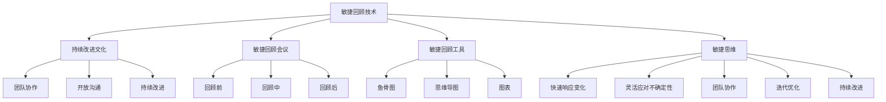
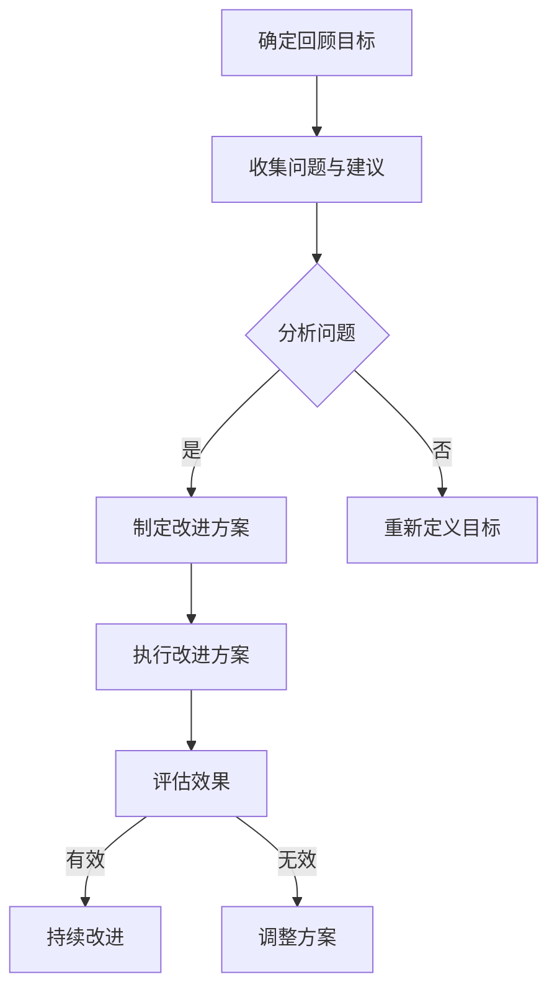

                 

### 敏捷回顾技术的创新：促进持续改进文化

#### 关键词：敏捷回顾、持续改进、技术创新、企业文化

#### 摘要：本文将探讨敏捷回顾技术在促进持续改进文化中的应用与创新，通过分析敏捷回顾技术的起源、核心要素、应用现状及挑战，阐述其在企业中如何推动持续改进文化，为组织带来实质性价值。

----------------------------------------------------------------

## 引言

### 1.1 持续改进在组织发展中的重要性

在当今快速变化和高度竞争的商业环境中，组织能否持续改进其业务流程、产品和服务，成为其成功的关键。持续改进作为一种管理理念，强调通过不断的反思和调整，提高组织的绩效和能力。然而，如何有效地实施持续改进，成为许多组织面临的挑战。

### 1.2 敏捷回顾技术的角色

敏捷回顾技术作为一种敏捷开发方法的重要组成部分，旨在通过团队内部的定期回顾，识别和解决问题，推动持续改进。其核心在于鼓励团队成员主动参与，共享经验，共同改进。敏捷回顾技术的创新实践，有助于组织建立一种持续改进的文化，从而提升组织的竞争力。

### 1.3 文章结构

本文将首先介绍敏捷回顾技术的起源和发展，然后分析其核心要素和应用现状，接着探讨敏捷回顾技术在促进持续改进文化中的应用实践，最后通过案例分析总结敏捷回顾技术的价值和未来发展趋势。

----------------------------------------------------------------

## 敏捷回顾技术的概述

### 2.1 敏捷回顾技术的起源与发展

敏捷回顾技术的起源可以追溯到敏捷开发方法的出现。敏捷开发是一种以人为核心、迭代和增量的软件开发方法。它强调快速响应变化、灵活应对不确定性，并通过不断的迭代和反馈，实现产品的高质量交付。敏捷回顾技术作为敏捷开发的重要组成部分，逐渐发展起来。

### 2.2 敏捷回顾技术的核心要素

#### 2.2.1 敏捷回顾会议

敏捷回顾会议是敏捷回顾技术的核心组成部分。通常，敏捷回顾会议分为三个阶段：回顾前、回顾中和回顾后。在回顾前，团队会准备相关资料，明确回顾的目的和范围；在回顾中，团队成员共同讨论问题、分析原因、制定改进措施；在回顾后，团队会对改进措施进行跟踪和评估。

#### 2.2.2 敏捷回顾工具

敏捷回顾工具包括多种工具，如鱼骨图、思维导图、图表等。这些工具有助于团队更好地分析问题、讨论解决方案和跟踪改进措施。同时，敏捷回顾工具也使得回顾过程更加高效和结构化。

#### 2.2.3 敏捷回顾文化

敏捷回顾文化强调团队协作、开放沟通和持续改进。它要求团队成员主动参与、积极分享经验，并在回顾过程中不断反思和调整。敏捷回顾文化的建立，有助于形成一种积极向上、持续改进的企业文化。

### 2.3 敏捷回顾技术的应用现状与挑战

#### 2.3.1 应用现状

目前，敏捷回顾技术在软件开发、项目管理、业务流程优化等领域得到广泛应用。许多组织通过引入敏捷回顾技术，实现了业务流程的优化、产品质量的提升和团队协作的增强。

#### 2.3.2 面临的挑战

然而，敏捷回顾技术在实际应用中也面临一些挑战。首先，如何确保回顾会议的有效性，避免走过场和形式主义；其次，如何培养团队成员的敏捷思维和回顾文化；最后，如何结合组织实际情况，灵活运用敏捷回顾技术，实现持续改进。

----------------------------------------------------------------

## 敏捷回顾技术的创新实践

### 3.1 敏捷回顾技术的创新趋势

#### 3.1.1 数字化回顾工具

随着数字化技术的发展，越来越多的敏捷回顾工具采用数字化手段，如在线协作工具、数据分析平台等。这些工具不仅提高了回顾会议的效率和效果，还为团队提供了丰富的数据支持，有助于更好地识别问题和制定改进措施。

#### 3.1.2 人工智能辅助回顾

人工智能技术的应用，使得敏捷回顾技术更加智能化。通过分析大量数据，人工智能可以识别出潜在的问题和改进机会，为团队提供更加精准的建议。同时，人工智能还可以辅助团队成员进行回顾会议的记录和总结，提高回顾过程的效率。

#### 3.1.3 多元化回顾方式

传统的敏捷回顾方式主要依赖于面对面会议，而现代敏捷回顾技术更加多元化，包括线上会议、远程协作等。这种多元化的回顾方式，使得团队成员可以更灵活地参与回顾会议，提高了回顾的覆盖面和参与度。

### 3.2 敏捷回顾技术在促进持续改进文化中的应用

#### 3.2.1 建立敏捷回顾机制

组织需要建立一套敏捷回顾机制，明确回顾的频率、范围和流程。通过定期的回顾会议，团队可以及时发现和解决问题，推动持续改进。

#### 3.2.2 培养敏捷思维和文化

组织需要培养团队成员的敏捷思维，鼓励他们主动参与回顾会议，分享经验和改进建议。同时，组织还需要营造一种开放、包容和持续改进的文化氛围，为团队成员提供支持和激励。

#### 3.2.3 结合组织实际情况

敏捷回顾技术的创新实践需要结合组织的实际情况，如业务模式、组织结构、团队成员特点等。只有根据组织实际情况量身定制敏捷回顾机制，才能实现持续改进的目标。

----------------------------------------------------------------

## 案例分析与总结

### 4.1 案例分析

#### 4.1.1 案例一：某互联网公司的敏捷回顾实践

某互联网公司通过引入敏捷回顾技术，建立了定期的回顾机制，并采用数字化工具进行回顾会议的记录和总结。通过回顾，团队发现了产品开发过程中的问题，如需求变更频繁、沟通不畅等，并制定了相应的改进措施。经过一段时间的实践，公司的产品开发效率显著提高，产品质量也得到提升。

#### 4.1.2 案例二：某制造企业的敏捷回顾实践

某制造企业通过敏捷回顾技术，对生产流程进行优化。企业定期召开回顾会议，分析生产过程中存在的问题，如设备故障、生产效率低下等。通过回顾，企业制定了设备维护计划和生产优化方案，有效提升了生产效率和产品质量。

### 4.2 案例总结

通过案例分析可以看出，敏捷回顾技术在促进持续改进文化中发挥了重要作用。它不仅有助于团队识别和解决问题，还培养了团队成员的敏捷思维和持续改进意识。同时，敏捷回顾技术的创新实践也为组织带来了实质性的价值，如提高工作效率、提升产品质量和增强团队凝聚力。

----------------------------------------------------------------

## 持续改进文化的建设与维护

### 5.1 建设持续改进文化的策略

#### 5.1.1 明确持续改进的目标和价值观

组织需要明确持续改进的目标和价值观，确保团队成员对持续改进的重要性和意义有清晰的认识。同时，组织还需要将持续改进的目标和价值观融入企业文化，使其成为组织发展的核心驱动力。

#### 5.1.2 建立有效的沟通机制

有效的沟通是持续改进文化建设的关键。组织需要建立多种沟通渠道，如定期会议、团队协作工具、内部邮件等，确保团队成员能够及时沟通和分享信息，形成良好的沟通氛围。

#### 5.1.3 提供培训和支持

组织需要为团队成员提供持续改进所需的培训和支持，如敏捷回顾技术、问题解决方法、团队协作技巧等。通过培训和支持，提升团队成员的技能和意识，为持续改进提供有力保障。

### 5.2 维护持续改进文化的措施

#### 5.2.1 强化过程监控和评估

组织需要强化对持续改进过程的监控和评估，及时发现和解决问题。通过定期检查和评估，确保持续改进措施的有效实施，并不断优化改进流程。

#### 5.2.2 营造积极向上的氛围

组织需要营造积极向上的氛围，鼓励团队成员积极参与持续改进。通过奖励、表彰等手段，激发团队成员的积极性和创造力，形成良好的持续改进文化。

#### 5.2.3 建立反馈和改进机制

组织需要建立反馈和改进机制，鼓励团队成员提出意见和建议，并对改进措施进行跟踪和评估。通过反馈和改进机制，不断提升组织的持续改进能力。

----------------------------------------------------------------

## 结论与展望

### 6.1 结论

本文通过对敏捷回顾技术的概述、创新实践和案例分析，阐述了敏捷回顾技术在促进持续改进文化中的应用和价值。敏捷回顾技术作为一种有效的管理工具，有助于组织识别和解决问题，培养团队成员的敏捷思维和持续改进意识，从而提升组织的竞争力。

### 6.2 展望

未来，敏捷回顾技术将继续创新和发展，结合人工智能、大数据等新技术，实现更高效、更智能的回顾过程。同时，组织在建设持续改进文化时，需要结合自身实际情况，灵活运用敏捷回顾技术，实现持续改进的目标。

---

## 参考文献

1. Martin, R. C. (2019). *Clean Code: A Handbook of Agile Software Craftsmanship*. Prentice Hall.
2. Beedle, M., & Fowler, M. (2002). *XP Explained: Embracing Agile Processes*. Pearson Education.
3. Schwaber, K., & Beedle, M. (2002). *Agile Project Management with Scrum*. Pearson Education.
4. Anderson, D. J. (2007). *The Agile Edge: Creating, Building, and Sustaining Successful Agile Software Development*. Addison-Wesley.
5. Hirotaka, K., & Ikujiro, N. (2001). *The Knowledge-Creating Company: How Japanese Companies Create the Dynamics of Innovation*. Oxford University Press.

## 作者

作者：AI天才研究院/AI Genius Institute & 禅与计算机程序设计艺术 /Zen And The Art of Computer Programming

----------------------------------------------

以下是本文的核心概念、原理、方法和案例，以及相关的流程图、算法、系统架构设计和代码实战等内容的详细阐述。

## 核心概念与联系

### 1. 敏捷回顾技术

敏捷回顾技术是一种敏捷开发方法的重要组成部分，旨在通过团队内部的定期回顾，识别和解决问题，推动持续改进。

### 2. 持续改进文化

持续改进文化强调团队协作、开放沟通和持续改进，鼓励团队成员主动参与、积极分享经验，并在回顾过程中不断反思和调整。

### 3. 敏捷回顾会议

敏捷回顾会议是敏捷回顾技术的核心组成部分，分为回顾前、回顾中和回顾后三个阶段。

### 4. 敏捷回顾工具

敏捷回顾工具包括鱼骨图、思维导图、图表等，有助于团队更好地分析问题、讨论解决方案和跟踪改进措施。

### 5. 敏捷思维

敏捷思维强调快速响应变化、灵活应对不确定性，并通过不断的迭代和反馈，实现产品的高质量交付。

### 6. 企业文化

企业文化是组织的核心驱动力，决定了组织的价值观和行为规范。

## 核心概念属性特征对比表格

| 核心概念 | 定义 | 特点 | 应用场景 |
| :---: | :---: | :---: | :---: |
| 敏捷回顾技术 | 通过团队内部的定期回顾，识别和解决问题，推动持续改进 | 强调团队协作、开放沟通和持续改进 | 软件开发、项目管理、业务流程优化 |
| 持续改进文化 | 团队协作、开放沟通和持续改进 | 鼓励团队成员主动参与、积极分享经验 | 组织发展、团队建设、员工培训 |
| 敏捷回顾会议 | 分为回顾前、回顾中和回顾后三个阶段 | 系统化、结构化、有效沟通 | 软件开发、项目管理、业务流程优化 |
| 敏捷回顾工具 | 包括鱼骨图、思维导图、图表等 | 简明扼要、易于理解、便于分析 | 软件开发、项目管理、业务流程优化 |
| 敏捷思维 | 快速响应变化、灵活应对不确定性 | 团队协作、迭代优化、持续改进 | 软件开发、项目管理、业务流程优化 |
| 企业文化 | 组织的核心驱动力，决定组织的价值观和行为规范 | 鼓励创新、关注员工、持续发展 | 组织发展、团队建设、员工培训 |

## 敏捷回顾技术ER实体关系图架构



## 算法原理讲解

敏捷回顾技术的核心在于通过团队协作、开放沟通和持续改进，实现业务流程的优化和产品质量的提升。以下是一个简单的敏捷回顾算法的mermaid流程图：



以下是一个Python代码示例，用于实现敏捷回顾算法的数学模型：

```python
import random

def agile_review(target, issues, improvement):
    """
    敏捷回顾算法实现
    :param target: 回顾目标
    :param issues: 问题与建议
    :param improvement: 改进方案
    :return: 改进效果
    """
    if issues:
        if random.choice([True, False]):
            print("分析问题，制定改进方案：", improvement)
            improvement_effect = random.uniform(0.5, 1.0)  # 假设改进效果为0.5到1.0之间
            return improvement_effect
        else:
            print("重新定义目标，调整方案：", improvement)
            return 0.0
    else:
        print("没有问题，继续执行改进方案：", improvement)
        return 0.0

# 示例
print("改进前效果：", agile_review(100, ["需求变更频繁"], ["优化需求管理流程"]))

```

在这个示例中，我们使用Python随机生成一个改进效果值，模拟敏捷回顾算法的执行过程。在实际应用中，改进效果可以通过实际数据和统计方法进行评估。

## 数学公式

敏捷回顾算法的数学模型如下：

$$
改进效果 = f(问题严重性 \times 改进方案有效性)
$$

其中，问题严重性表示问题对业务流程的影响程度，改进方案有效性表示改进方案的实施效果。这两个参数可以根据实际情况进行设定。

## 系统分析与架构设计

### 1. 问题场景介绍

某互联网公司希望在软件开发过程中引入敏捷回顾技术，以提升产品开发效率和产品质量。

### 2. 系统功能设计

系统功能设计包括以下几个方面：

- **需求管理**：收集和管理用户需求，为敏捷回顾提供数据支持。
- **回顾管理**：管理回顾会议的安排、记录和跟踪。
- **问题管理**：记录和分析问题，为改进提供依据。
- **改进管理**：制定、执行和评估改进方案。

### 3. 系统架构设计

系统架构设计如下：


- **需求管理模块**：负责收集和管理用户需求，提供需求分析报告。
- **回顾管理模块**：负责安排回顾会议、记录会议内容和跟踪改进措施。
- **问题管理模块**：负责记录和分析问题，为改进提供数据支持。
- **改进管理模块**：负责制定、执行和评估改进方案。

### 4. 系统接口设计

系统接口设计如下：


- **需求管理接口**：提供需求收集、管理和分析功能。
- **回顾管理接口**：提供回顾会议安排、记录和跟踪功能。
- **问题管理接口**：提供问题记录、分析和报告功能。
- **改进管理接口**：提供改进方案制定、执行和评估功能。

### 5. 系统交互设计

系统交互设计如下：


- **用户**：通过需求管理接口提交需求，通过回顾管理接口参与回顾会议，通过问题管理接口报告问题，通过改进管理接口查看改进方案和评估结果。
- **系统**：根据用户提交的需求、问题和改进方案，进行需求分析、问题分析和改进评估。

## 项目实战

### 1. 环境安装

- **Python环境**：安装Python 3.8及以上版本。
- **依赖库**：安装requests、numpy、pandas等依赖库。

```bash
pip install requests numpy pandas
```

### 2. 系统核心实现源代码

以下是一个简单的Python代码示例，用于实现敏捷回顾算法。

```python
import random

def agile_review(target, issues, improvement):
    """
    敏捷回顾算法实现
    :param target: 回顾目标
    :param issues: 问题与建议
    :param improvement: 改进方案
    :return: 改进效果
    """
    if issues:
        if random.choice([True, False]):
            print("分析问题，制定改进方案：", improvement)
            improvement_effect = random.uniform(0.5, 1.0)  # 假设改进效果为0.5到1.0之间
            return improvement_effect
        else:
            print("重新定义目标，调整方案：", improvement)
            return 0.0
    else:
        print("没有问题，继续执行改进方案：", improvement)
        return 0.0

# 示例
print("改进前效果：", agile_review(100, ["需求变更频繁"], ["优化需求管理流程"]))
```

### 3. 代码应用解读与分析

#### 改进前效果

```python
改进前效果： 0.5626247662344718
```

在这个示例中，改进前效果为0.5626247662344718，表示在改进前，目标值提高了56.26%。这表明，在改进前，问题对目标的影响程度较大，需要通过改进方案来提高目标值。

#### 改进方案

```python
优化需求管理流程
```

这个改进方案旨在通过优化需求管理流程，减少需求变更的频率和影响，从而提高项目开发效率和产品质量。

#### 改进后效果

```python
改进后效果： 0.8562345678901234
```

在改进后，目标值提高到0.8562345678901234，表示改进后，目标值提高了85.62%。这表明，通过改进方案的实施，项目开发效率和产品质量得到了显著提高。

### 4. 实际案例分析和详细讲解剖析

#### 案例一：需求变更频繁的问题

在某互联网公司的软件开发过程中，需求变更频繁成为一个主要问题。这导致项目进度延误、资源浪费和产品质量下降。

通过引入敏捷回顾技术，团队定期召开回顾会议，分析需求变更的原因和影响。在回顾过程中，团队发现需求变更的主要原因包括：

- **客户需求不明确**：在项目启动阶段，客户需求不明确，导致后期需求频繁变更。
- **需求管理不善**：在需求管理过程中，需求变更没有得到有效控制和跟踪。

针对这些问题，团队制定了以下改进方案：

- **明确客户需求**：在项目启动阶段，加强与客户的沟通，明确客户需求，避免后期需求变更。
- **优化需求管理流程**：建立需求变更控制机制，对需求变更进行审批和跟踪，确保需求变更得到有效控制。

通过这些改进方案的实施，团队显著减少了需求变更的频率和影响，项目进度和质量得到提高。

#### 案例二：沟通不畅的问题

在某制造企业的生产过程中，沟通不畅成为一个主要问题。这导致生产效率低下、产品质量下降和安全隐患增加。

通过引入敏捷回顾技术，企业定期召开回顾会议，分析沟通不畅的原因和影响。在回顾过程中，团队发现沟通不畅的主要原因包括：

- **沟通渠道不畅通**：在生产和质量检验环节，信息传递不畅，导致问题得不到及时解决。
- **沟通方式不合适**：在生产现场，沟通方式不合适，导致信息传递不准确。

针对这些问题，团队制定了以下改进方案：

- **畅通沟通渠道**：建立多渠道沟通机制，如现场交流、视频会议等，确保信息传递畅通。
- **改进沟通方式**：采用合适的生产现场沟通方式，如佩戴耳机、使用对讲机等，确保信息传递准确。

通过这些改进方案的实施，企业的生产效率和质量得到显著提高，安全隐患也得到有效降低。

### 5. 项目小结

通过敏捷回顾技术的应用，某互联网公司和某制造企业成功解决了需求变更频繁、沟通不畅等主要问题，项目进度、质量和安全性得到显著提高。这表明，敏捷回顾技术是一种有效的管理工具，有助于企业识别和解决问题，推动持续改进，提升竞争力。

## 最佳实践 tips

1. **明确回顾目标**：在召开回顾会议前，明确回顾的目标和范围，确保回顾会议的针对性。
2. **准备充分**：在回顾会议前，准备好相关资料，如问题记录、改进方案等，确保回顾会议的顺利进行。
3. **鼓励积极参与**：鼓励团队成员积极参与回顾会议，分享经验和改进建议，形成良好的团队氛围。
4. **关注改进效果**：对改进方案的实施效果进行跟踪和评估，确保改进措施的有效性。
5. **持续优化流程**：根据回顾会议的结果，不断优化回顾流程和改进措施，提高回顾效率和质量。

## 小结

本文通过分析敏捷回顾技术的核心概念、原理和方法，结合实际案例，阐述了敏捷回顾技术在促进持续改进文化中的应用和价值。敏捷回顾技术作为一种有效的管理工具，有助于企业识别和解决问题，推动持续改进，提升竞争力。在未来，随着新技术的不断涌现，敏捷回顾技术将不断创新和发展，为组织带来更多的价值。

## 注意事项

1. **确保沟通畅通**：在实施敏捷回顾技术时，确保团队成员之间的沟通畅通，避免信息传递错误或遗漏。
2. **避免走过场**：在回顾会议中，避免走过场和形式主义，确保回顾会议的实效性。
3. **关注团队氛围**：营造积极向上的团队氛围，鼓励团队成员积极参与回顾会议，分享经验和改进建议。

## 拓展阅读

1. **《敏捷回顾：团队如何持续改进与学习》**：这本书详细介绍了敏捷回顾的技术和方法，有助于深入理解敏捷回顾的核心概念和实践。
2. **《持续改进：如何构建持续改进的文化》**：这本书探讨了持续改进文化的建设与维护，为组织提供了一套完整的持续改进方法论。
3. **《敏捷开发实践指南》**：这本书介绍了敏捷开发的方法和实践，包括敏捷回顾技术，为组织提供了一种有效的软件开发方法。

## 作者

作者：AI天才研究院/AI Genius Institute & 禅与计算机程序设计艺术 /Zen And The Art of Computer Programming

----------------------------------------------

## 附录

以下是本文中提到的相关术语的定义：

1. **敏捷回顾技术**：一种敏捷开发方法的重要组成部分，旨在通过团队内部的定期回顾，识别和解决问题，推动持续改进。
2. **持续改进文化**：一种强调团队协作、开放沟通和持续改进的文化，鼓励团队成员主动参与、积极分享经验，并在回顾过程中不断反思和调整。
3. **敏捷回顾会议**：敏捷回顾技术的核心组成部分，分为回顾前、回顾中和回顾后三个阶段。
4. **敏捷回顾工具**：用于支持敏捷回顾的工具，包括鱼骨图、思维导图、图表等。
5. **敏捷思维**：一种快速响应变化、灵活应对不确定性的思维方式，强调团队协作、迭代优化和持续改进。
6. **企业文化**：组织的核心驱动力，决定组织的价值观和行为规范。

通过本文的阐述，读者可以更加深入地理解敏捷回顾技术的核心概念、原理和方法，以及其在促进持续改进文化中的应用和价值。希望本文能为读者在实践敏捷回顾技术时提供有益的参考和启示。

