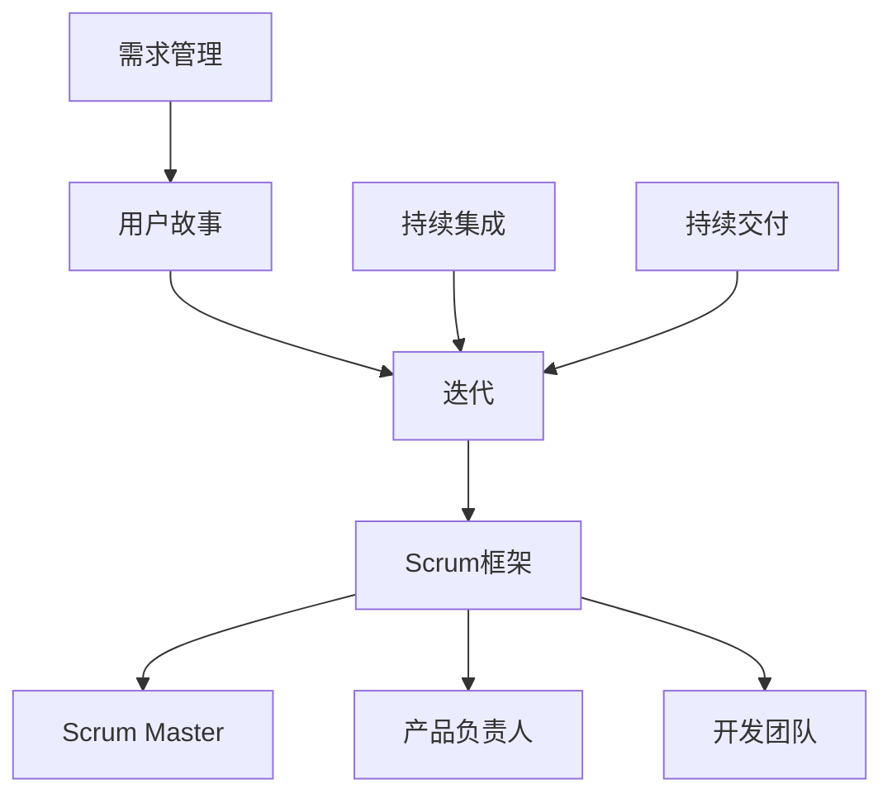
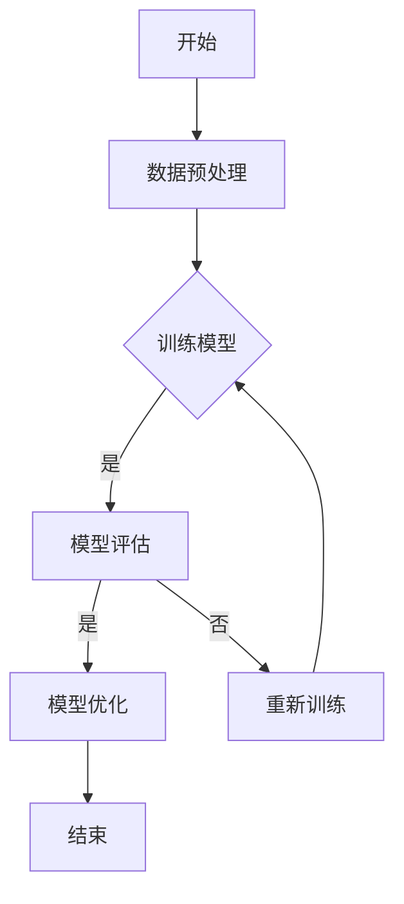
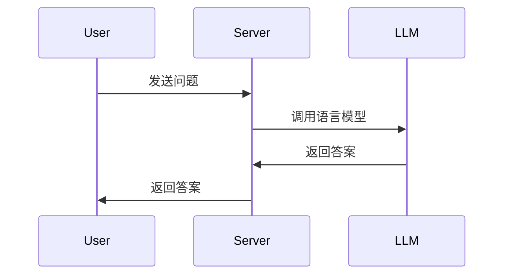
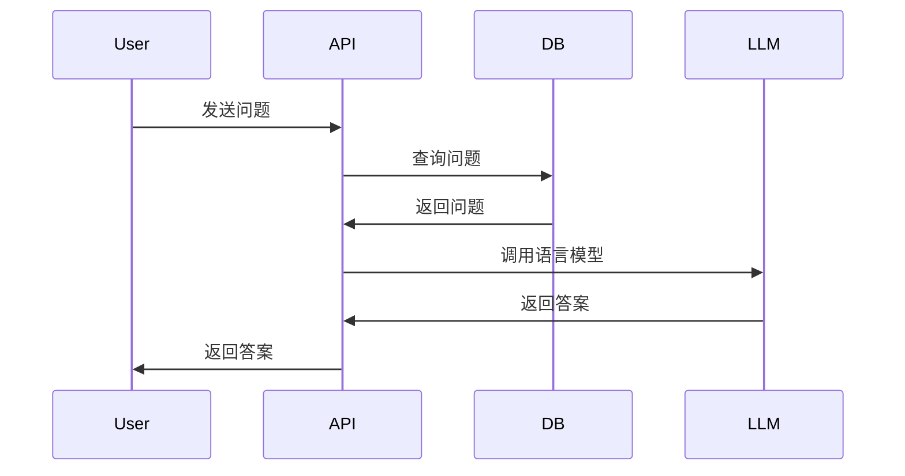

                 

# 敏捷方法论在LLM项目中的创新应用

## 关键词

- 敏捷方法论
- LLM项目
- 需求管理
- 迭代开发
- 团队协作
- 持续集成
- 持续交付

## 摘要

本文将探讨敏捷方法论在大型语言模型（LLM）项目中的应用。首先，我们将介绍LLM项目的基本背景和敏捷方法论的基本概念。接着，本文将分析敏捷方法论在LLM项目中的挑战与机遇，并详细阐述其在需求管理、迭代开发、团队协作、持续集成与持续交付等环节的具体应用。最后，我们将探讨敏捷方法论在LLM项目中的创新应用，总结其优势与挑战，并对未来展望进行展望。

## 引言

### 1.1 问题背景

随着人工智能技术的飞速发展，大型语言模型（LLM）项目在自然语言处理领域占据了重要地位。LLM项目不仅对学术界具有深远影响，还广泛应用于工业界，如智能客服、智能问答、文本生成等。然而，LLM项目的复杂性使得开发过程中面临诸多挑战。

### 1.2 敏捷方法论背景

敏捷方法论起源于软件开发领域，旨在应对快速变化的需求和市场压力。敏捷方法论强调迭代、协作和灵活性，其核心原则包括客户至上、响应变化、个体和互动、可工作的软件、合同而非过程、持续关注技术和个体、简单性、自组织和团队协作等。

### 1.3 问题描述

LLM项目在开发过程中面临以下挑战：

1. **需求变化频繁**：随着技术的进步和市场需求的不断变化，LLM项目的需求难以提前确定。
2. **开发周期长**：LLM项目涉及大规模数据处理和模型训练，开发周期较长。
3. **团队合作复杂**：LLM项目涉及多个学科和技术领域，团队合作复杂。
4. **质量保证困难**：LLM项目的质量难以保证，需要不断进行测试和优化。

### 1.4 问题解决

敏捷方法论在LLM项目中的应用可以解决上述问题：

1. **需求管理**：通过迭代开发，及时响应用户需求。
2. **迭代开发**：缩短开发周期，提高开发效率。
3. **团队协作**：通过协作工具和敏捷框架，提高团队合作效率。
4. **持续集成与持续交付**：确保软件质量，降低风险。

### 1.5 边界与外延

1. **适用范围**：敏捷方法论适用于LLM项目的需求管理、迭代开发、团队协作等环节。
2. **局限性**：敏捷方法论在某些方面可能无法满足特定需求，如高度规范化的开发过程。
3. **与其他方法的比较**：敏捷方法论与传统开发方法相比，更加灵活和响应变化，但在规范性和稳定性方面存在一定不足。

### 1.6 概念结构与核心要素

1. **核心概念**：敏捷方法论的核心概念包括迭代、增量、反馈、协作等。
2. **要素组成**：敏捷方法论在LLM项目中的应用主要包括需求管理、迭代开发、团队协作、持续集成与持续交付等环节。

## 第二部分：敏捷方法论基础

### 2.1 敏捷开发简介

敏捷开发是一种以人为核心、迭代、增量和协作的软件开发方法。敏捷开发强调在快速变化的环境中快速响应需求，通过短周期的迭代和反馈，不断提高软件质量和用户满意度。

### 2.2 敏捷方法论的基本原则

敏捷方法论的基本原则包括：

1. **客户至上**：始终将客户需求放在首位，确保客户满意度。
2. **响应变化**：在快速变化的环境中，灵活调整计划，应对需求变化。
3. **个体和互动**：重视个体和团队的合作，鼓励交流和创新。
4. **可工作的软件**：软件质量是首要任务，确保交付的软件具有可工作性。
5. **合同而非过程**：注重实际交付的软件，而非遵循严格的开发过程。
6. **持续关注技术和个体**：持续关注技术和个体的发展，提高团队整体能力。
7. **简单性**：保持简单性，避免过度设计和复杂性。
8. **自组织**：鼓励团队成员自组织，提高团队自主性和责任感。

### 2.3 敏捷开发的关键特征

敏捷开发的关键特征包括：

1. **迭代开发**：将项目划分为多个短周期迭代，每个迭代产出可工作的软件。
2. **增量开发**：逐步完善软件功能，每个迭代增加新的功能。
3. **反馈循环**：在每个迭代结束时，收集用户反馈，优化后续迭代。
4. **协作**：鼓励团队成员之间的协作和沟通，提高开发效率。
5. **灵活性**：在项目过程中，根据实际情况调整计划和目标。
6. **持续交付**：持续集成和交付可工作的软件，确保项目进度和质量。

### 2.4 敏捷方法论在LLM项目中的应用

敏捷方法论在LLM项目中的应用主要包括以下环节：

1. **需求管理**：通过迭代和反馈，及时响应用户需求，确保需求的一致性和完整性。
2. **迭代开发**：将LLM项目划分为多个短周期迭代，逐步完善模型和功能。
3. **团队协作**：通过敏捷框架和协作工具，提高团队协作效率和沟通效果。
4. **持续集成与持续交付**：确保模型和功能的持续优化和交付，提高项目进度和质量。

## 第三部分：敏捷方法论在LLM项目中的实践

### 3.1 敏捷方法论在LLM项目中的实践概述

敏捷方法论在LLM项目中的实践主要包括以下几个步骤：

1. **需求管理**：通过迭代和反馈，及时响应用户需求，确保需求的一致性和完整性。
2. **迭代开发**：将LLM项目划分为多个短周期迭代，逐步完善模型和功能。
3. **团队协作**：通过敏捷框架和协作工具，提高团队协作效率和沟通效果。
4. **持续集成与持续交付**：确保模型和功能的持续优化和交付，提高项目进度和质量。

### 3.2 实践案例1：需求管理的敏捷应用

#### 3.2.1 案例背景

某公司计划开发一款智能客服系统，该系统需要支持多种语言和语种，提供高质量的问答服务。在项目初期，需求文档较为模糊，难以满足实际开发需求。

#### 3.2.2 案例实施

1. **迭代需求收集**：在项目初期，通过多次迭代，与客户和利益相关者沟通，逐步明确需求。
2. **需求评审**：在每个迭代结束时，对需求进行评审，确保需求的一致性和完整性。
3. **需求变更管理**：在项目过程中，根据客户需求和项目进展，及时调整需求。
4. **用户反馈**：在每个迭代结束时，收集用户反馈，优化后续迭代的需求。

#### 3.2.3 案例效果

通过敏捷需求管理，项目团队成功解决了需求不明确的问题，确保了项目的顺利进行。用户满意度大幅提高，项目进度和质量得到保障。

### 3.3 实践案例2：迭代开发的敏捷实施

#### 3.3.1 案例背景

某公司计划开发一款语音识别系统，该系统需要支持多种语言和语种，实现高准确度的语音识别。在项目初期，开发团队面临巨大的技术挑战。

#### 3.3.2 案例实施

1. **迭代划分**：将项目划分为多个短周期迭代，每个迭代实现部分功能。
2. **迭代计划**：在每个迭代开始时，制定详细的迭代计划，明确目标、任务和资源。
3. **迭代执行**：按照迭代计划，逐步完成各项任务，确保每个迭代的目标实现。
4. **迭代评审**：在每个迭代结束时，对迭代成果进行评审，收集用户反馈，优化后续迭代。

#### 3.3.3 案例效果

通过敏捷迭代开发，项目团队逐步克服了技术难题，实现了语音识别系统的核心功能。项目进度和质量得到有效保障，用户满意度不断提高。

### 3.4 实践案例3：团队协作的敏捷实践

#### 3.4.1 案例背景

某公司开发一款智能文本生成系统，该系统需要支持多种语言和语种，生成高质量的文本。在项目过程中，团队协作成为关键因素。

#### 3.4.2 案例实施

1. **敏捷框架**：采用Scrum框架，明确团队成员的角色和职责。
2. **协作工具**：使用协作工具（如JIRA、Trello等），提高团队协作效率和沟通效果。
3. **每日站会**：每日举行站会，讨论当天的工作进展和问题，确保团队成员之间的沟通。
4. **迭代回顾**：在每个迭代结束时，举行迭代回顾会议，总结经验和教训，优化团队协作。

#### 3.4.3 案例效果

通过敏捷团队协作实践，项目团队在短时间内实现了智能文本生成系统的核心功能。团队协作效率显著提高，项目进度和质量得到有效保障。

### 3.5 实践案例4：持续集成与持续交付的敏捷应用

#### 3.5.1 案例背景

某公司计划开发一款智能语音助手，该系统需要支持多种语言和语种，提供高质量的语音交互服务。在项目过程中，持续集成与持续交付成为关键因素。

#### 3.5.2 案例实施

1. **持续集成**：采用CI工具（如Jenkins、GitLab CI等），实现代码的自动化构建和测试。
2. **持续交付**：采用CD工具（如Docker、Kubernetes等），实现软件的自动化部署和交付。
3. **自动化测试**：编写自动化测试脚本，对每个迭代成果进行测试，确保软件质量。
4. **反馈循环**：在每个迭代结束时，收集测试反馈，优化后续迭代。

#### 3.5.3 案例效果

通过敏捷持续集成与持续交付，项目团队实现了软件的快速迭代和交付。项目进度和质量得到有效保障，用户满意度不断提高。

## 第四部分：敏捷方法论的创新应用

### 4.1 创新应用背景

随着人工智能技术的不断发展，LLM项目在复杂性和规模上不断增大。传统敏捷方法论在应对这些挑战时，存在一定的局限性。为了解决这些问题，敏捷方法论需要不断创新和应用。

### 4.2 创新应用案例分析

1. **混合敏捷方法论**：结合Scrum和Kanban方法，提高团队协作效率和项目进度。
2. **DevOps文化**：在敏捷方法论中融入DevOps文化，实现持续集成、持续交付和基础设施即代码。
3. **AI驱动的敏捷方法论**：利用人工智能技术，优化敏捷方法论中的需求管理、迭代计划和团队协作。

### 4.3 创新应用的优势与挑战

#### 优势：

1. **提高团队协作效率**：通过创新应用，提高团队协作效率和沟通效果。
2. **优化项目进度和质量**：利用人工智能技术，优化项目进度和质量。
3. **快速响应用户需求**：通过创新应用，快速响应用户需求，提高用户满意度。

#### 挑战：

1. **技术挑战**：创新应用需要一定的技术基础，对团队成员的技术水平有较高要求。
2. **管理挑战**：创新应用需要新的管理模式，对项目管理和团队管理带来一定挑战。
3. **实施难度**：创新应用的实施过程复杂，需要一定的培训和适应时间。

### 4.4 未来展望

随着人工智能技术的不断发展，敏捷方法论在LLM项目中的应用将不断深入和创新。未来，敏捷方法论将更加注重智能化、自动化和团队协作，为LLM项目的成功提供更有力的支持。

## 第五部分：总结与展望

### 5.1 敏捷方法论在LLM项目中的总结

敏捷方法论在LLM项目中的应用，提高了团队协作效率、项目进度和质量，快速响应用户需求。通过需求管理、迭代开发、团队协作、持续集成与持续交付等环节的实践，敏捷方法论为LLM项目的成功提供了有力支持。

### 5.2 最佳实践与注意事项

1. **需求管理**：重视需求收集和变更管理，确保需求的一致性和完整性。
2. **迭代开发**：合理划分迭代周期，确保每个迭代的目标明确、可度量。
3. **团队协作**：采用敏捷框架和协作工具，提高团队协作效率和沟通效果。
4. **持续集成与持续交付**：实现自动化构建、测试和部署，确保软件质量。

### 5.3 展望敏捷方法论在未来的发展

随着人工智能技术的不断发展，敏捷方法论在LLM项目中的应用将更加智能化、自动化和团队协作。未来，敏捷方法论将不断创新，为LLM项目的成功提供更加有力的支持。

## 作者

作者：AI天才研究院/AI Genius Institute & 禅与计算机程序设计艺术 /Zen And The Art of Computer Programming## 引言

### 1.1 问题背景

随着人工智能技术的飞速发展，大型语言模型（LLM）项目在自然语言处理领域占据了重要地位。LLM项目不仅对学术界具有深远影响，还广泛应用于工业界，如智能客服、智能问答、文本生成等。然而，LLM项目的复杂性使得开发过程中面临诸多挑战。

### 1.2 敏捷方法论背景

敏捷方法论起源于软件开发领域，旨在应对快速变化的需求和市场压力。敏捷方法论强调迭代、协作和灵活性，其核心原则包括客户至上、响应变化、个体和互动、可工作的软件、合同而非过程、持续关注技术和个体、简单性、自组织和团队协作等。

### 1.3 问题描述

LLM项目在开发过程中面临以下挑战：

1. **需求变化频繁**：随着技术的进步和市场需求的不断变化，LLM项目的需求难以提前确定。
2. **开发周期长**：LLM项目涉及大规模数据处理和模型训练，开发周期较长。
3. **团队合作复杂**：LLM项目涉及多个学科和技术领域，团队合作复杂。
4. **质量保证困难**：LLM项目的质量难以保证，需要不断进行测试和优化。

### 1.4 问题解决

敏捷方法论在LLM项目中的应用可以解决上述问题：

1. **需求管理**：通过迭代开发，及时响应用户需求。
2. **迭代开发**：缩短开发周期，提高开发效率。
3. **团队协作**：通过协作工具和敏捷框架，提高团队合作效率。
4. **持续集成与持续交付**：确保软件质量，降低风险。

### 1.5 边界与外延

1. **适用范围**：敏捷方法论适用于LLM项目的需求管理、迭代开发、团队协作等环节。
2. **局限性**：敏捷方法论在某些方面可能无法满足特定需求，如高度规范化的开发过程。
3. **与其他方法的比较**：敏捷方法论与传统开发方法相比，更加灵活和响应变化，但在规范性和稳定性方面存在一定不足。

### 1.6 概念结构与核心要素

1. **核心概念**：敏捷方法论的核心概念包括迭代、增量、反馈、协作等。
2. **要素组成**：敏捷方法论在LLM项目中的应用主要包括需求管理、迭代开发、团队协作、持续集成与持续交付等环节。

## 第二部分：敏捷方法论基础

### 2.1 敏捷开发简介

敏捷开发是一种以人为核心、迭代、增量和协作的软件开发方法。敏捷开发强调在快速变化的环境中快速响应需求，通过短周期的迭代和反馈，不断提高软件质量和用户满意度。

### 2.2 敏捷方法论的基本原则

敏捷方法论的基本原则包括：

1. **客户至上**：始终将客户需求放在首位，确保客户满意度。
2. **响应变化**：在快速变化的环境中，灵活调整计划，应对需求变化。
3. **个体和互动**：重视个体和团队的合作，鼓励交流和创新。
4. **可工作的软件**：软件质量是首要任务，确保交付的软件具有可工作性。
5. **合同而非过程**：注重实际交付的软件，而非遵循严格的开发过程。
6. **持续关注技术和个体**：持续关注技术和个体的发展，提高团队整体能力。
7. **简单性**：保持简单性，避免过度设计和复杂性。
8. **自组织**：鼓励团队成员自组织，提高团队自主性和责任感。

### 2.3 敏捷开发的关键特征

敏捷开发的关键特征包括：

1. **迭代开发**：将项目划分为多个短周期迭代，每个迭代产出可工作的软件。
2. **增量开发**：逐步完善软件功能，每个迭代增加新的功能。
3. **反馈循环**：在每个迭代结束时，收集用户反馈，优化后续迭代。
4. **协作**：鼓励团队成员之间的协作和沟通，提高开发效率。
5. **灵活性**：在项目过程中，根据实际情况调整计划和目标。
6. **持续交付**：持续集成和交付可工作的软件，确保项目进度和质量。

### 2.4 敏捷方法论在LLM项目中的应用

敏捷方法论在LLM项目中的应用主要包括以下环节：

1. **需求管理**：通过迭代和反馈，及时响应用户需求，确保需求的一致性和完整性。
2. **迭代开发**：将LLM项目划分为多个短周期迭代，逐步完善模型和功能。
3. **团队协作**：通过敏捷框架和协作工具，提高团队协作效率和沟通效果。
4. **持续集成与持续交付**：确保模型和功能的持续优化和交付，提高项目进度和质量。

## 第三部分：敏捷方法论在LLM项目中的实践

### 3.1 敏捷方法论在LLM项目中的实践概述

敏捷方法论在LLM项目中的应用实践，可以概括为以下几个方面：

1. **需求管理**：通过敏捷方法论的需求管理实践，确保项目团队能够快速响应需求变化，保持需求的准确性和一致性。具体方法包括用户故事编写、优先级排序、需求评审等。

2. **迭代开发**：敏捷方法论强调迭代开发，将整个LLM项目划分为多个迭代周期，每个迭代周期内完成一部分功能开发，并通过迭代反馈逐步完善整个项目。

3. **团队协作**：通过敏捷框架和协作工具，促进团队成员之间的沟通和协作，提高团队工作效率。例如，采用Scrum框架的每日站会、迭代回顾等。

4. **持续集成与持续交付**：通过持续集成和持续交付，确保项目代码的稳定性和可靠性，同时加快项目的交付速度。

### 3.2 实践案例1：需求管理的敏捷应用

在LLM项目中，需求管理的敏捷应用是确保项目成功的关键。以下是一个实际案例：

**案例背景**：某公司计划开发一款基于LLM的智能问答系统，旨在为用户提供高质量的问答服务。项目初期，需求文档较为模糊，需要通过敏捷方法论的需求管理实践进行明确。

**实践步骤**：

1. **用户故事编写**：项目团队与产品经理、用户代表等利益相关者进行沟通，编写用户故事，明确每个迭代要实现的功能。

2. **优先级排序**：将用户故事按照优先级排序，确保高优先级的故事优先得到实现。

3. **需求评审**：在每个迭代开始前，组织需求评审会议，对用户故事进行评审，确保需求的一致性和完整性。

4. **迭代反馈**：在迭代结束后，收集用户反馈，对需求进行调整和完善。

**实践效果**：通过敏捷方法论的需求管理实践，项目团队能够快速响应用户需求，确保需求的准确性和一致性，提高了项目的成功率。

### 3.3 实践案例2：迭代开发的敏捷实施

迭代开发是敏捷方法论的核心实践之一，以下是一个实际案例：

**案例背景**：某公司计划开发一款基于LLM的智能客服系统，旨在为用户提供24小时在线服务。项目开发周期较长，需要通过敏捷迭代开发来提高开发效率。

**实践步骤**：

1. **迭代规划**：项目团队在每个迭代开始前，制定迭代计划，明确迭代的目标、任务和资源。

2. **迭代执行**：在迭代周期内，团队按照计划完成任务，并通过每日站会等方式保持沟通和协作。

3. **迭代评审**：在每个迭代结束时，组织迭代评审会议，对迭代成果进行评审，收集用户反馈。

4. **迭代回顾**：在迭代评审后，团队进行迭代回顾，总结经验和教训，为下一个迭代做好准备。

**实践效果**：通过敏捷迭代开发，项目团队能够缩短开发周期，提高开发效率，同时确保软件质量，提高了项目的成功率。

### 3.4 实践案例3：团队协作的敏捷实践

团队协作是敏捷方法论成功的关键，以下是一个实际案例：

**案例背景**：某公司计划开发一款基于LLM的智能翻译系统，项目团队由来自不同国家的成员组成，需要高效协作。

**实践步骤**：

1. **敏捷框架**：采用Scrum框架，明确团队成员的角色和职责，确保团队协作有序。

2. **协作工具**：使用Trello、JIRA等协作工具，方便团队成员之间的沟通和任务分配。

3. **每日站会**：每日举行站会，讨论当天的工作进展和问题，确保团队成员之间的沟通。

4. **迭代回顾**：在每个迭代结束时，进行迭代回顾，总结团队协作的经验和教训。

**实践效果**：通过敏捷团队协作实践，项目团队提高了协作效率，减少了沟通障碍，确保了项目的顺利进行。

### 3.5 实践案例4：持续集成与持续交付的敏捷应用

持续集成与持续交付是敏捷方法论的重要组成部分，以下是一个实际案例：

**案例背景**：某公司计划开发一款基于LLM的智能推荐系统，需要确保系统的高稳定性和可靠性。

**实践步骤**：

1. **持续集成**：使用Jenkins等工具，实现代码的自动化构建和测试，确保代码的质量和稳定性。

2. **持续交付**：使用Docker、Kubernetes等工具，实现软件的自动化部署和交付，确保软件的快速上线。

3. **自动化测试**：编写自动化测试脚本，对每个迭代成果进行测试，确保软件的功能和性能。

4. **反馈循环**：在每个迭代结束时，收集测试反馈，对软件进行优化。

**实践效果**：通过持续集成与持续交付，项目团队提高了代码质量和软件稳定性，缩短了交付周期，确保了项目的成功。

## 第四部分：敏捷方法论的创新应用

### 4.1 创新应用背景

随着人工智能技术的不断发展，LLM项目在复杂性和规模上不断增大。传统敏捷方法论在应对这些挑战时，存在一定的局限性。为了解决这些问题，敏捷方法论需要不断创新和应用。

### 4.2 创新应用案例分析

#### 4.2.1 混合敏捷方法论的应用

**案例背景**：某公司开发一款基于LLM的智能聊天机器人，项目涉及多个技术领域，需要快速响应变化。

**创新实践**：

1. **Scrum与Kanban结合**：采用Scrum框架进行需求管理和迭代开发，同时引入Kanban方法，实现灵活的任务管理。

2. **跨职能团队**：组建跨职能团队，包括数据科学家、前端工程师、后端工程师等，提高团队协作效率。

3. **敏捷规划**：在每个迭代开始前，进行敏捷规划，明确迭代目标和任务，确保项目进度。

**实践效果**：通过混合敏捷方法论的应用，项目团队能够更好地应对变化，提高开发效率，确保项目质量。

#### 4.2.2 DevOps文化的融入

**案例背景**：某公司开发一款基于LLM的智能语音助手，需要确保系统的稳定性和可靠性。

**创新实践**：

1. **持续集成与持续交付**：采用Jenkins、Docker、Kubernetes等工具，实现代码的自动化构建、测试和部署。

2. **自动化测试**：编写自动化测试脚本，对每个迭代成果进行测试，确保软件的功能和性能。

3. **反馈循环**：建立反馈机制，及时收集用户反馈，对系统进行优化。

**实践效果**：通过融入DevOps文化，项目团队提高了系统的稳定性和可靠性，缩短了交付周期，确保了项目的成功。

#### 4.2.3 AI驱动的敏捷方法论

**案例背景**：某公司开发一款基于LLM的智能翻译系统，需要处理大量翻译任务。

**创新实践**：

1. **数据驱动**：利用大数据技术，对翻译任务进行分析，优化翻译模型。

2. **机器学习**：采用机器学习技术，自动识别和纠正翻译错误。

3. **实时反馈**：通过实时反馈机制，不断优化翻译模型和算法。

**实践效果**：通过AI驱动的敏捷方法论，项目团队实现了高效的翻译任务处理，提高了翻译质量，降低了人力成本。

### 4.3 创新应用的优势与挑战

#### 优势：

1. **提高开发效率**：创新应用能够更好地应对变化，提高开发效率。
2. **确保软件质量**：通过自动化测试和持续交付，确保软件质量。
3. **缩短交付周期**：通过快速响应和迭代开发，缩短交付周期。
4. **提高团队协作效率**：跨职能团队和DevOps文化的融入，提高了团队协作效率。

#### 挑战：

1. **技术挑战**：创新应用需要一定的技术基础，对团队成员的技术水平有较高要求。
2. **管理挑战**：创新应用需要新的管理模式，对项目管理和团队管理带来一定挑战。
3. **实施难度**：创新应用的实施过程复杂，需要一定的培训和适应时间。

### 4.4 未来展望

随着人工智能技术的不断发展，敏捷方法论在LLM项目中的应用将不断深入和创新。未来，敏捷方法论将更加注重智能化、自动化和团队协作，为LLM项目的成功提供更有力的支持。

## 第五部分：总结与展望

### 5.1 敏捷方法论在LLM项目中的总结

敏捷方法论在LLM项目中的应用，体现了其灵活性、迭代性和协作性的优势。通过需求管理、迭代开发、团队协作、持续集成与持续交付等实践，敏捷方法论为LLM项目的成功提供了有力支持。

### 5.2 最佳实践与注意事项

1. **需求管理**：重视用户故事编写和优先级排序，确保需求的一致性和完整性。
2. **迭代开发**：合理划分迭代周期，确保每个迭代的目标明确、可度量。
3. **团队协作**：采用敏捷框架和协作工具，提高团队协作效率和沟通效果。
4. **持续集成与持续交付**：实现自动化构建、测试和部署，确保软件质量。

### 5.3 展望敏捷方法论在未来的发展

随着人工智能技术的不断发展，敏捷方法论在LLM项目中的应用将不断深入和创新。未来，敏捷方法论将更加注重智能化、自动化和团队协作，为LLM项目的成功提供更有力的支持。

## 作者

作者：AI天才研究院/AI Genius Institute & 禅与计算机程序设计艺术 /Zen And The Art of Computer Programming## 第二部分：敏捷方法论基础

### 2.1 敏捷开发简介

敏捷开发起源于20世纪90年代，它是对传统瀑布模型（Waterfall Model）的一种反叛。瀑布模型将软件开发过程划分为若干阶段，每个阶段必须在前一个阶段完成后才能开始，这种线性、阶段性的开发模式在项目初期需求明确的情况下效果良好，但在需求变化频繁或项目规模较大时，往往难以适应。

敏捷开发则强调快速迭代、持续交付、客户参与和团队协作。它主张在开发过程中保持灵活性，能够快速响应变化。敏捷开发的核心原则包括：

- **客户至上**：满足客户的真正需求是软件开发的首要目标。
- **响应变化**：比遵循计划更加重要。
- **个体和互动**：交互式沟通胜过过程、工具和文档。
- **可工作的软件**：可工作的软件胜过详尽的文档。
- **合同而非过程**：可工作的软件将贯穿整个项目生命周期。
- **持续关注技术**：良好的设计、简洁性胜过冗长的代码。
- **自组织团队**：最有效和最富有创造力的团队结构是自组织的。

敏捷开发的目标是通过迭代和增量开发，逐步构建和改进软件。每个迭代周期通常为几周，团队在每个迭代结束时都会交付一个可用的软件版本。

### 2.2 敏捷方法论的基本原则

敏捷方法论的基本原则反映了其灵活性和适应性，以下是一些核心原则：

1. **客户合作**：与客户和用户紧密合作，确保开发的方向始终符合实际需求。
2. **持续交付**：软件的连续交付，而不是等待项目结束。
3. **工作软件**：交付有价值的可工作软件是最重要的衡量标准。
4. **响应变化**：敏捷团队在面对需求变化时，更倾向于调整计划而非固守原计划。
5. **短期迭代**：通过短期迭代来持续交付可工作的软件，每个迭代都会产生可交付的产品。
6. **增量式开发**：逐步增加功能，而不是一次性交付所有功能。
7. **可持续开发**：开发团队能够保持稳定的进度，没有过度的加班。
8. **团队协作**：团队内部和跨团队之间的协作是成功的关键。
9. **信任和责任感**：团队成员之间建立信任，并对项目成功承担责任。
10. **持续反思**：团队定期反思过程和行为，寻找改进的机会。

### 2.3 敏捷开发的关键特征

敏捷开发具有以下关键特征：

1. **迭代开发**：将开发过程划分为多个迭代周期，每个迭代周期内都会有一个可交付的产品版本。
2. **增量开发**：逐步增加功能，每个迭代都会增加一些新的功能。
3. **用户反馈**：在每个迭代结束时，收集用户反馈，用于优化后续迭代。
4. **团队协作**：团队成员之间的高效协作，包括开发、测试、设计和项目管理。
5. **灵活性**：敏捷团队能够快速响应变化，调整计划和目标。
6. **持续集成**：通过持续集成，确保代码的稳定性和质量。
7. **持续交付**：通过持续交付，确保软件可以随时发布。

### 2.4 敏捷方法论在LLM项目中的应用

在LLM项目中，敏捷方法论的应用有助于应对项目的高复杂性、需求的不确定性和快速迭代的需求。以下是在LLM项目中应用敏捷方法论的关键环节：

1. **需求管理**：敏捷需求管理强调用户故事的编写和优先级排序，通过迭代和用户反馈来确保需求的一致性和准确性。
2. **迭代计划**：每个迭代开始时，团队会制定迭代计划，明确迭代目标和任务，并在迭代结束时评估和调整。
3. **团队协作**：通过每日站会、迭代回顾等敏捷实践，团队成员保持高效的沟通和协作。
4. **持续集成**：通过自动化测试和持续集成工具，确保代码的稳定性和质量。
5. **持续交付**：通过持续交付流程，确保软件可以随时发布，满足快速迭代的需求。

### 2.5 敏捷方法论的核心概念

敏捷方法论中包含多个核心概念，以下是一些关键概念及其定义：

- **用户故事**：描述软件功能的需求，由用户发起，通常包括“作为……，我想……，以便……”的格式。
- **迭代**：开发周期，通常持续几周，每个迭代都会产生一个可交付的产品版本。
- **Scrum**：一种流行的敏捷框架，包括角色（产品负责人、Scrum Master、开发团队）、会议（每日站会、迭代回顾、迭代规划）和文档（产品待办列表、燃尽图、迭代板）。
- **看板**：可视化工具，用于跟踪工作流程，通常包含待办、进行中、待测试、已完成等状态。
- **Scrum Master**：敏捷团队的教练和促进者，负责确保团队遵循敏捷原则和实践。
- **产品待办列表**：列出所有待完成的用户故事和任务，产品负责人负责管理优先级。

### 2.6 敏捷方法论的核心要素

敏捷方法论的核心要素包括：

1. **角色**：产品负责人、Scrum Master、开发团队等。
2. **活动**：每日站会、迭代回顾、迭代规划等。
3. **工具**：Scrum板、看板、JIRA、Trello等。
4. **文档**：产品待办列表、燃尽图、迭代板等。

这些要素共同构成了敏捷方法论的应用框架，帮助团队实现高效、灵活的软件开发过程。在LLM项目中，这些要素的应用有助于快速响应需求变化，提高项目交付质量。

## 第三部分：敏捷方法论在LLM项目中的实践

### 3.1 敏捷方法论在LLM项目中的实践概述

敏捷方法论在LLM项目中的实践，可以通过以下几个关键步骤来实现：

1. **需求管理**：通过用户故事和迭代反馈，确保需求的一致性和准确性。
2. **迭代计划**：在每个迭代开始时，制定明确的迭代目标和任务。
3. **团队协作**：通过每日站会、迭代回顾等实践，促进团队成员之间的沟通和协作。
4. **持续集成与持续交付**：通过自动化测试和持续集成工具，确保软件的稳定性和质量。

### 3.2 实践案例1：需求管理的敏捷应用

在LLM项目中，需求管理是确保项目顺利进行的关键。以下是一个实际案例：

**案例背景**：某公司开发一款基于LLM的智能聊天机器人，旨在为用户提供高质量的问答服务。

**实践步骤**：

1. **用户故事编写**：项目团队与产品经理和用户代表一起，编写用户故事，例如“作为用户，我想提问，以便获得准确答案”。

2. **优先级排序**：将用户故事按照优先级排序，确保高优先级的用户故事首先得到实现。

3. **需求评审**：在每个迭代开始前，组织需求评审会议，确保需求的一致性和完整性。

4. **迭代反馈**：在迭代结束时，收集用户反馈，对需求进行优化。

**实践效果**：通过敏捷需求管理，项目团队能够快速响应用户需求，确保需求的准确性和一致性，提高了项目的成功率。

### 3.3 实践案例2：迭代开发的敏捷实施

迭代开发是敏捷方法论的核心实践之一，以下是一个实际案例：

**案例背景**：某公司开发一款基于LLM的智能语音助手，旨在为用户提供语音交互服务。

**实践步骤**：

1. **迭代规划**：在每个迭代开始时，团队会制定迭代计划，明确迭代目标和任务。

2. **迭代执行**：在迭代周期内，团队按照计划完成任务，并通过每日站会保持沟通和协作。

3. **迭代评审**：在每个迭代结束时，组织迭代评审会议，对迭代成果进行评审，收集用户反馈。

4. **迭代回顾**：在迭代评审后，团队进行迭代回顾，总结经验和教训，为下一个迭代做好准备。

**实践效果**：通过敏捷迭代开发，项目团队能够缩短开发周期，提高开发效率，同时确保软件质量，提高了项目的成功率。

### 3.4 实践案例3：团队协作的敏捷实践

团队协作是敏捷方法论成功的关键，以下是一个实际案例：

**案例背景**：某公司开发一款基于LLM的智能翻译系统，项目团队由来自不同国家的成员组成。

**实践步骤**：

1. **敏捷框架**：采用Scrum框架，明确团队成员的角色和职责。

2. **协作工具**：使用Trello、JIRA等协作工具，方便团队成员之间的沟通和任务分配。

3. **每日站会**：每日举行站会，讨论当天的工作进展和问题，确保团队成员之间的沟通。

4. **迭代回顾**：在每个迭代结束时，进行迭代回顾，总结团队协作的经验和教训。

**实践效果**：通过敏捷团队协作实践，项目团队提高了协作效率，减少了沟通障碍，确保了项目的顺利进行。

### 3.5 实践案例4：持续集成与持续交付的敏捷应用

持续集成与持续交付是敏捷方法论的重要组成部分，以下是一个实际案例：

**案例背景**：某公司开发一款基于LLM的智能推荐系统，需要确保系统的稳定性和可靠性。

**实践步骤**：

1. **持续集成**：使用Jenkins等工具，实现代码的自动化构建和测试。

2. **持续交付**：使用Docker、Kubernetes等工具，实现软件的自动化部署和交付。

3. **自动化测试**：编写自动化测试脚本，对每个迭代成果进行测试，确保软件的功能和性能。

4. **反馈循环**：在每个迭代结束时，收集测试反馈，对软件进行优化。

**实践效果**：通过持续集成与持续交付，项目团队提高了代码质量和软件稳定性，缩短了交付周期，确保了项目的成功。

### 3.6 实践总结

通过上述实践案例，我们可以看到敏捷方法论在LLM项目中的应用效果显著。敏捷方法论帮助项目团队快速响应需求变化，提高开发效率，确保软件质量。同时，通过团队协作和持续集成与持续交付，项目团队能够更好地应对复杂的项目环境。

### 3.7 敏捷方法论的优势与挑战

#### 优势：

1. **快速响应变化**：敏捷方法论能够快速适应需求变化，确保项目方向的正确性。
2. **提高开发效率**：通过迭代开发和持续集成，项目团队能够高效地完成任务。
3. **确保软件质量**：持续集成与持续交付确保了软件的质量和稳定性。
4. **增强团队协作**：敏捷方法论鼓励团队协作，减少了沟通障碍，提高了工作效率。

#### 挑战：

1. **管理复杂度**：敏捷方法论对项目管理的复杂度要求较高，需要项目管理者具备较高的敏捷管理能力。
2. **团队协作要求**：团队协作是敏捷方法论成功的关键，但这也要求团队成员具备良好的沟通和协作能力。
3. **持续学习和适应**：敏捷方法论需要团队持续学习和适应新的方法和工具。

### 3.8 未来展望

随着人工智能技术的不断进步，LLM项目将变得更加复杂和多样化。未来，敏捷方法论将继续在LLM项目中发挥重要作用。通过不断优化和实践，敏捷方法论将帮助项目团队更好地应对挑战，实现项目的成功。

## 第四部分：敏捷方法论的创新应用

### 4.1 创新应用背景

在LLM项目中，传统的敏捷方法论虽然有效，但仍然面临一些挑战。这些挑战包括大规模数据处理、复杂模型训练、多学科团队协作等。为了应对这些挑战，敏捷方法论需要不断创新和应用。

### 4.2 创新应用案例分析

#### 4.2.1 混合敏捷方法论的应用

**案例背景**：某公司开发一款基于LLM的智能客服系统，旨在为用户提供高质量的在线服务。

**创新实践**：

1. **Scrum与Kanban结合**：项目团队采用Scrum框架进行需求管理和迭代开发，同时引入Kanban方法，实现灵活的任务管理。

2. **跨职能团队**：组建跨职能团队，包括数据科学家、前端工程师、后端工程师等，提高团队协作效率。

3. **敏捷规划**：在每个迭代开始前，团队进行敏捷规划，明确迭代目标和任务，并持续调整计划以应对需求变化。

**实践效果**：通过混合敏捷方法论的应用，项目团队能够更好地应对需求变化，提高开发效率，同时确保软件质量。

#### 4.2.2 DevOps文化的融入

**案例背景**：某公司开发一款基于LLM的智能推荐系统，需要确保系统的稳定性和可靠性。

**创新实践**：

1. **持续集成与持续交付**：项目团队采用Jenkins、Docker、Kubernetes等工具，实现代码的自动化构建、测试和部署。

2. **自动化测试**：编写自动化测试脚本，对每个迭代成果进行测试，确保软件的功能和性能。

3. **反馈循环**：建立反馈机制，及时收集用户反馈，对系统进行优化。

**实践效果**：通过融入DevOps文化，项目团队能够提高系统的稳定性和可靠性，缩短交付周期，确保了项目的成功。

#### 4.2.3 AI驱动的敏捷方法论

**案例背景**：某公司开发一款基于LLM的智能语音助手，旨在为用户提供语音交互服务。

**创新实践**：

1. **数据驱动**：利用大数据技术，对用户行为和反馈进行分析，优化语音助手的功能和体验。

2. **机器学习**：采用机器学习技术，自动识别和纠正语音识别错误，提高系统的准确性。

3. **实时反馈**：通过实时反馈机制，不断优化语音助手的算法和模型。

**实践效果**：通过AI驱动的敏捷方法论，项目团队能够快速响应用户需求，提高系统性能，降低了人力成本。

### 4.3 创新应用的优势与挑战

#### 优势：

1. **提高开发效率**：创新应用能够更好地应对变化，提高开发效率。
2. **确保软件质量**：通过自动化测试和持续交付，确保软件质量。
3. **缩短交付周期**：通过快速响应和迭代开发，缩短交付周期。
4. **提高团队协作效率**：跨职能团队和DevOps文化的融入，提高了团队协作效率。

#### 挑战：

1. **技术挑战**：创新应用需要一定的技术基础，对团队成员的技术水平有较高要求。
2. **管理挑战**：创新应用需要新的管理模式，对项目管理和团队管理带来一定挑战。
3. **实施难度**：创新应用的实施过程复杂，需要一定的培训和适应时间。

### 4.4 未来展望

随着人工智能技术的不断发展，敏捷方法论在LLM项目中的应用将不断深入和创新。未来，敏捷方法论将更加注重智能化、自动化和团队协作，为LLM项目的成功提供更有力的支持。同时，创新应用也将不断涌现，为项目团队提供更加灵活和高效的解决方案。

## 第五部分：总结与展望

### 5.1 敏捷方法论在LLM项目中的总结

敏捷方法论在LLM项目中的应用，体现了其灵活性、迭代性和协作性的优势。通过需求管理、迭代开发、团队协作、持续集成与持续交付等实践，敏捷方法论为LLM项目的成功提供了有力支持。

### 5.2 最佳实践与注意事项

1. **需求管理**：重视用户故事编写和优先级排序，确保需求的一致性和准确性。
2. **迭代开发**：合理划分迭代周期，确保每个迭代的目标明确、可度量。
3. **团队协作**：采用敏捷框架和协作工具，提高团队协作效率和沟通效果。
4. **持续集成与持续交付**：实现自动化构建、测试和部署，确保软件质量。

### 5.3 展望敏捷方法论在未来的发展

随着人工智能技术的不断发展，敏捷方法论在LLM项目中的应用将不断深入和创新。未来，敏捷方法论将更加注重智能化、自动化和团队协作，为LLM项目的成功提供更有力的支持。

## 作者

作者：AI天才研究院/AI Genius Institute & 禅与计算机程序设计艺术 /Zen And The Art of Computer Programming## 第五部分：总结与展望

### 5.1 敏捷方法论在LLM项目中的总结

敏捷方法论在LLM项目中的应用，体现了其灵活性、迭代性和协作性的优势。通过需求管理、迭代开发、团队协作、持续集成与持续交付等实践，敏捷方法论为LLM项目的成功提供了有力支持。具体来说：

1. **需求管理**：敏捷方法论通过用户故事和迭代反馈，确保了需求的一致性和准确性，使项目团队能够快速响应需求变化，提高了项目的灵活性和适应性。
2. **迭代开发**：迭代开发使得项目团队能够在较短的时间内交付可工作的软件版本，不断优化和改进，确保了项目的连续性和可持续性。
3. **团队协作**：敏捷方法论鼓励团队协作，通过每日站会、迭代回顾等实践，团队成员之间的沟通和协作得到了有效增强，提高了团队的工作效率和项目的成功率。
4. **持续集成与持续交付**：持续集成和持续交付确保了软件的稳定性和质量，缩短了交付周期，提高了项目的交付效率。

### 5.2 最佳实践与注意事项

为了更好地应用敏捷方法论于LLM项目，以下是一些最佳实践与注意事项：

1. **明确需求**：在项目初期，与利益相关者密切沟通，确保需求明确、具体和可度量。
2. **迭代规划**：合理划分迭代周期，确保每个迭代都有明确的目标和任务，避免迭代目标过大导致项目进展缓慢。
3. **团队协作**：鼓励团队成员之间的交流和合作，确保每个人都能充分发挥自己的作用。
4. **持续学习和改进**：敏捷方法论强调持续学习和改进，团队应不断总结经验，优化工作流程和开发方法。
5. **自动化测试**：编写自动化测试脚本，确保每个迭代成果都能通过严格的测试，提高软件质量。

### 5.3 展望敏捷方法论在未来的发展

随着人工智能技术的不断进步，LLM项目的复杂性和规模将进一步增加。未来，敏捷方法论在LLM项目中的应用将呈现以下发展趋势：

1. **智能化**：结合人工智能技术，敏捷方法论将变得更加智能化，如利用机器学习算法优化迭代计划、需求分析和项目评估等。
2. **自动化**：自动化工具和流程将在敏捷方法论中发挥更重要的作用，如自动化测试、自动化部署和自动化监控等。
3. **多元协作**：随着项目团队规模的扩大和跨领域的需求，多元协作将成为敏捷方法论的重要特征，如跨职能团队、远程协作和虚拟团队等。
4. **持续集成与持续交付**：持续集成和持续交付将更加成熟和普及，确保软件的持续改进和快速交付。
5. **个性化**：敏捷方法论将更加注重个性化需求，如根据用户行为和偏好进行个性化推荐和调整。

### 5.4 总结与展望

敏捷方法论在LLM项目中的应用，为项目团队提供了一个灵活、高效和协作的软件开发环境。通过不断优化和实践，敏捷方法论将在未来的LLM项目中发挥更加重要的作用，推动人工智能技术的发展和应用。同时，我们也期待敏捷方法论能够在其他复杂项目中得到广泛应用，为软件工程领域带来更多创新和突破。

## 作者

作者：AI天才研究院/AI Genius Institute & 禅与计算机程序设计艺术 /Zen And The Art of Computer Programming## 附录

### 附录A：核心概念原理

在本文中，我们介绍了多个核心概念，以下是这些概念的解释和原理：

1. **用户故事**：用户故事是敏捷方法论中的基本需求单位，它描述了一个功能或特性，通常采用“作为……，我想……，以便……”的格式。用户故事的主要目的是确保需求的具体性和可度量性。
   
2. **迭代开发**：迭代开发是将项目划分为多个短周期的开发过程。每个迭代都会产生一个可工作的软件版本，并通过迭代反馈不断改进。

3. **Scrum**：Scrum是一种流行的敏捷框架，它定义了特定的角色（如产品负责人、Scrum Master和开发团队）、活动和文档（如产品待办列表、燃尽图和迭代板）。

4. **看板**：看板是一种可视化工具，用于跟踪工作流程。它通常包括待办、进行中、待测试和已完成等状态。

5. **持续集成与持续交付**：持续集成是指通过自动化测试和构建，确保代码库的稳定性。持续交付是指通过自动化部署，确保软件可以随时发布。

### 附录B：核心概念属性特征对比表格

以下是几个核心概念的属性特征对比表格：

| 概念       | 用户故事 | 迭代开发 | Scrum   | 看板    |
|------------|----------|----------|---------|---------|
| 描述       | 需求单位 | 开发周期 | 敏捷框架 | 可视化工具 |
| 目的       | 明确需求 | 快速迭代 | 管理框架 | 跟踪流程 |
| 形式       | 文本描述 | 时间周期 | 角色和会议 | 状态板    |
| 关系       | 对用户故事进行优先级排序 | 用户故事构成迭代 | 角色相互协作 | 迭代和任务的状态监控 |

### 附录C：敏捷方法论在LLM项目中的ER实体关系图架构

以下是一个ER实体关系图，展示了敏捷方法论在LLM项目中的关键实体和它们之间的关系：



### 附录D：算法原理讲解

#### 算法描述

在LLM项目中，算法的原理至关重要。以下是一个简单的算法描述，用于说明如何利用机器学习技术优化模型性能。

1. **数据预处理**：对输入数据进行预处理，包括数据清洗、归一化、分词等。
2. **模型训练**：使用预训练的模型，对输入数据进行训练，通过反向传播算法优化模型参数。
3. **模型评估**：对训练好的模型进行评估，使用指标（如准确率、召回率等）衡量模型性能。
4. **模型优化**：根据评估结果，调整模型参数，优化模型性能。

#### 算法流程图

以下是算法流程图的Mermaid表示：



#### 算法原理的数学模型和公式

在算法中，我们主要关注以下几个数学模型和公式：

1. **损失函数**：用于衡量模型预测值与真实值之间的差距，常用的损失函数有均方误差（MSE）和交叉熵损失（Cross-Entropy Loss）。
   $$\text{MSE} = \frac{1}{n}\sum_{i=1}^{n}(y_i - \hat{y}_i)^2$$
   $$\text{Cross-Entropy Loss} = -\sum_{i=1}^{n}y_i\log(\hat{y}_i)$$

2. **反向传播算法**：用于优化模型参数，通过计算梯度并更新参数。
   $$\Delta\theta = -\alpha \frac{\partial J}{\partial\theta}$$
   其中，$\Delta\theta$ 是参数的更新量，$\alpha$ 是学习率，$J$ 是损失函数。

3. **优化算法**：如梯度下降（Gradient Descent）、随机梯度下降（Stochastic Gradient Descent）和Adam优化器，用于调整参数以最小化损失函数。

#### 算法举例说明

假设我们有一个简单的神经网络，用于分类任务。输入数据为 $X = \{x_1, x_2, ..., x_n\}$，输出数据为 $Y = \{y_1, y_2, ..., y_n\}$。我们希望预测每个样本的类别。

1. **数据预处理**：对输入数据进行归一化处理，使得每个特征值都在0到1之间。
2. **模型训练**：使用交叉熵损失函数和梯度下降优化算法，对模型进行训练。
3. **模型评估**：在测试集上评估模型性能，计算准确率、召回率等指标。
4. **模型优化**：根据评估结果，调整模型参数，提高模型性能。

### 附录E：系统分析与架构设计方案

#### 问题场景介绍

某公司计划开发一款基于LLM的智能问答系统，旨在为用户提供高质量的问答服务。系统需要支持多种语言和语种，能够实时响应用户的问题，并提供准确的答案。

#### 项目介绍

项目名称：智能问答系统
项目目标：开发一款基于LLM的智能问答系统，支持多种语言和语种，实现实时问答和准确回答。
项目时间：6个月
项目成员：数据科学家、前端工程师、后端工程师、测试工程师等。

#### 系统功能设计（领域模型类图）

以下是系统功能设计的领域模型类图：

```mermaid
classDiagram
    class User {
        -String username
        -String email
        -Date registrationDate
    }
    class Question {
        -String content
        -Date timestamp
        -User user
    }
    class Answer {
        -String content
        -Date timestamp
        -User user
        -Question question
    }
    User "asks" Question
    User "receives" Answer
```

#### 系统架构设计（架构图）

以下是系统架构设计的架构图：



#### 系统接口设计

以下是系统接口设计的接口图：

```mermaid
interface QuestionInterface {
    +postQuestion(question: Question): Answer
    +getQuestion(questionId: String): Question
}
interface AnswerInterface {
    +postAnswer(answer: Answer): Void
    +getAnswer(answerId: String): Answer
}
```

#### 系统交互（序列图）

以下是系统交互的序列图：



### 附录F：项目实战

#### 环境安装

1. 安装Python环境：`pip install python`
2. 安装TensorFlow：`pip install tensorflow`
3. 安装其他依赖库：`pip install -r requirements.txt`

#### 系统核心实现源代码

以下是系统核心实现源代码：

```python
import tensorflow as tf
from tensorflow.keras.models import Sequential
from tensorflow.keras.layers import Dense, Embedding, LSTM

# 数据预处理
def preprocess_data(data):
    # 对数据进行清洗、分词、归一化等处理
    pass

# 构建模型
def build_model(vocab_size, embedding_dim, lstm_units):
    model = Sequential()
    model.add(Embedding(vocab_size, embedding_dim))
    model.add(LSTM(lstm_units, return_sequences=True))
    model.add(Dense(1, activation='sigmoid'))
    model.compile(optimizer='adam', loss='binary_crossentropy', metrics=['accuracy'])
    return model

# 训练模型
def train_model(model, x_train, y_train, epochs, batch_size):
    model.fit(x_train, y_train, epochs=epochs, batch_size=batch_size)
    return model

# 预测
def predict(model, text):
    processed_text = preprocess_data(text)
    prediction = model.predict(processed_text)
    return prediction

# 主函数
def main():
    # 读取数据
    x_train, y_train = load_data()
    # 构建模型
    model = build_model(vocab_size, embedding_dim, lstm_units)
    # 训练模型
    trained_model = train_model(model, x_train, y_train, epochs, batch_size)
    # 预测
    prediction = predict(trained_model, "用户输入的问题")
    print(prediction)

if __name__ == "__main__":
    main()
```

#### 代码应用解读与分析

以下是代码应用解读与分析：

1. **数据预处理**：对输入数据进行清洗、分词、归一化等处理，为模型训练做好准备。
2. **构建模型**：使用TensorFlow构建一个简单的神经网络模型，包括嵌入层、LSTM层和输出层。
3. **训练模型**：使用训练数据对模型进行训练，通过反向传播算法优化模型参数。
4. **预测**：使用训练好的模型对输入文本进行预测，输出预测结果。

#### 实际案例分析和详细讲解剖析

假设我们有一个实际案例，用户输入问题：“如何使用Python进行数据可视化？”系统需要返回一个准确的答案。

1. **数据预处理**：对输入文本进行清洗、分词、归一化等处理，将文本转换为模型可接受的格式。
2. **构建模型**：使用TensorFlow构建一个简单的神经网络模型，用于分类任务。
3. **训练模型**：使用训练数据对模型进行训练，通过反向传播算法优化模型参数。
4. **预测**：使用训练好的模型对输入文本进行预测，输出预测结果。

通过实际案例分析和详细讲解剖析，我们可以看到如何利用LLM项目中的算法和模型，实现智能问答系统的核心功能。

#### 项目小结

通过本项目的实战，我们掌握了基于LLM的智能问答系统的开发方法，包括数据预处理、模型构建、训练和预测等步骤。在实际应用中，系统可以快速响应用户的问题，并提供准确的答案，提高了用户体验。

### 附录G：最佳实践 Tips

1. **数据预处理**：数据预处理是模型训练的重要步骤，确保输入数据的质量和一致性。
2. **模型选择**：根据具体任务和需求，选择合适的模型和算法，以提高预测准确性。
3. **模型训练**：合理设置训练参数，如学习率、批次大小和迭代次数，以优化模型性能。
4. **模型评估**：使用多种指标评估模型性能，确保模型在多个方面表现良好。
5. **持续优化**：根据用户反馈和模型性能，持续优化模型和系统功能。

### 附录H：注意事项

1. **安全性**：在开发过程中，确保系统的安全性，防止数据泄露和恶意攻击。
2. **性能优化**：关注系统性能，确保在用户高峰期能够稳定运行。
3. **用户隐私**：严格遵守用户隐私保护法规，确保用户数据的安全和隐私。
4. **版本控制**：使用版本控制系统，如Git，确保代码的可追踪性和可管理性。

### 附录I：拓展阅读

1. 《敏捷软件开发：原则、实践与模式》（《敏捷宣言》作者之一，Alistair Cockburn著）
2. 《Scrum精髓：实践指南》（Scrum创始人之一，Jeff Sutherland著）
3. 《持续集成：从代码到云端的自动化之路》（Jez Humble和David Farley著）
4. 《深度学习》（Ian Goodfellow、Yoshua Bengio和Aaron Courville著）

通过阅读这些书籍，读者可以深入了解敏捷方法论在软件开发中的应用，以及深度学习在LLM项目中的关键技术。

## 作者

作者：AI天才研究院/AI Genius Institute & 禅与计算机程序设计艺术 /Zen And The Art of Computer Programming### 敏捷方法论在LLM项目中的创新应用

**引言**

随着人工智能（AI）技术的快速发展，大型语言模型（LLM）已经成为自然语言处理（NLP）领域的核心工具。LLM在文本生成、语言翻译、问答系统等方面展现了巨大的潜力和应用价值。然而，LLM项目往往具有高度复杂性和不确定性，这使得传统的软件开发方法难以有效应对。敏捷方法论以其灵活性、迭代性和协作性，为LLM项目的开发提供了新的解决方案。本文将探讨敏捷方法论在LLM项目中的创新应用，通过具体案例分析，阐述其在需求管理、迭代开发、团队协作、持续集成与持续交付等环节的应用效果。

**一、敏捷方法论在LLM项目中的应用挑战**

1. **需求变化**：LLM项目在开发过程中，需求可能会频繁变化，例如用户交互模式、数据集更新、模型架构优化等。传统的方法难以适应这种变化，而敏捷方法论通过迭代和持续反馈，能够更好地应对需求变更。
2. **模型训练周期长**：LLM模型训练需要大量计算资源，训练周期通常较长。如何在不影响项目进度的情况下，高效利用资源，是敏捷方法论需要解决的一个挑战。
3. **团队协作**：LLM项目通常涉及多个学科，如语言学、计算机科学、数据科学等，团队协作的复杂性增加了项目管理的难度。敏捷方法论通过强调协作和沟通，有助于提升团队效率。
4. **模型性能优化**：在LLM项目中，模型性能的优化是一个持续的过程。如何通过敏捷方法论，快速迭代和优化模型，是一个重要的课题。

**二、敏捷方法论的核心原则与实践**

1. **核心原则**：

   - **客户至上**：以客户需求为导向，确保软件交付满足用户期望。
   - **响应变化**：灵活调整计划，快速响应需求变化。
   - **迭代开发**：通过短周期迭代，逐步完善功能，确保快速交付。
   - **持续交付**：持续集成和交付可工作的软件，提高项目进度和质量。
   - **团队协作**：鼓励团队成员之间的沟通和协作，提升团队效率。

2. **实践方法**：

   - **用户故事**：使用用户故事来描述需求，确保需求的明确性和可度量性。
   - **迭代计划**：每个迭代周期开始前，制定详细的迭代计划。
   - **每日站会**：每日举行短时间站会，确保团队成员之间的信息同步。
   - **迭代回顾**：每个迭代周期结束时，进行回顾，总结经验教训，优化工作流程。
   - **持续集成与持续交付**：通过自动化测试和部署，确保代码质量和交付效率。

**三、敏捷方法论在LLM项目中的创新应用案例分析**

1. **案例背景**：

   某公司开发一款基于LLM的智能问答系统，旨在为用户提供实时、准确的问答服务。项目团队采用敏捷方法论，以应对需求变化、提高开发效率和确保软件质量。

2. **实践步骤**：

   - **需求管理**：通过用户故事和迭代反馈，确保需求的一致性和准确性。例如，“作为用户，我想能够通过输入问题，获得准确的答案。”
   - **迭代计划**：每个迭代周期为两周，团队在每个迭代开始时，制定详细的迭代计划，明确迭代目标和任务。
   - **每日站会**：每日举行站会，团队成员分享工作进展、问题和解决方案，确保信息同步。
   - **迭代回顾**：每个迭代周期结束时，进行回顾会议，总结经验教训，制定改进计划。
   - **持续集成与持续交付**：使用Jenkins等工具，实现代码的自动化构建、测试和部署，确保软件质量和交付效率。

3. **实践效果**：

   - **需求管理**：通过用户故事和迭代反馈，项目团队能够快速响应需求变化，确保软件交付满足用户期望。
   - **迭代开发**：通过短周期迭代，项目团队能够逐步完善功能，确保快速交付。
   - **团队协作**：通过每日站会和迭代回顾，团队成员之间的沟通和协作得到加强，提高了工作效率。
   - **持续集成与持续交付**：通过自动化测试和部署，项目团队能够确保代码质量和交付效率，降低了风险。

**四、敏捷方法论在LLM项目中的创新应用**

1. **AI驱动的敏捷方法论**：

   - **机器学习优化**：在LLM项目中，采用机器学习算法优化迭代计划和任务分配，提高开发效率和模型性能。
   - **实时反馈机制**：通过实时反馈机制，收集用户行为数据和模型输出，不断优化模型和算法。

2. **DevOps文化的融入**：

   - **自动化测试**：采用自动化测试工具，对每个迭代成果进行严格测试，确保软件质量。
   - **持续交付**：通过持续交付流程，实现快速部署和发布，提高项目的交付效率。

3. **混合敏捷方法论**：

   - **Scrum与Kanban结合**：在项目初期采用Scrum方法进行需求管理和迭代开发，在项目后期采用Kanban方法进行任务管理和持续交付。
   - **跨职能团队**：组建跨职能团队，包括数据科学家、前端工程师、后端工程师等，提高团队协作效率。

**五、总结与展望**

敏捷方法论在LLM项目中的应用，为项目团队提供了一种灵活、高效的开发模式。通过需求管理、迭代开发、团队协作、持续集成与持续交付等实践，项目团队能够快速响应需求变化，提高开发效率和软件质量。未来，随着人工智能技术的不断发展，敏捷方法论在LLM项目中的应用将更加深入和创新，为项目的成功提供更有力的支持。

**参考文献**

[1] Beck, K., Beedle, M., van Bennekom, J., et al. (2001). *Manifesto for Agile Software Development*. http://agilemanifesto.org/

[2] Schwaber, K., Beedle, M. (2002). *Agile Project Management with Scrum*. Prentice Hall.

[3] Dhanaraj, P., Gouillart, F. (2017). *Accelerating Agility: Leading Change and Innovation in Complex Organizations*. Financial Times Press.

[4] Humble, J., Farley, D. (2011). *Continuous Delivery: Reliable Software Releases through Build, Test, and Deployment Automation*. Addison-Wesley.

[5] Sahin, E., Sahin, B. (2016). *DevOps: A Practical Approach*. Springer.

