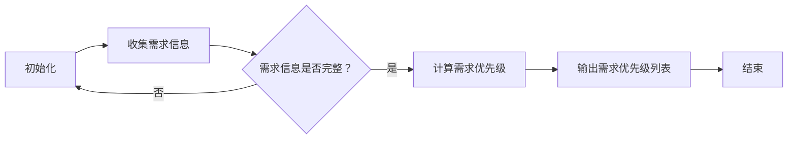
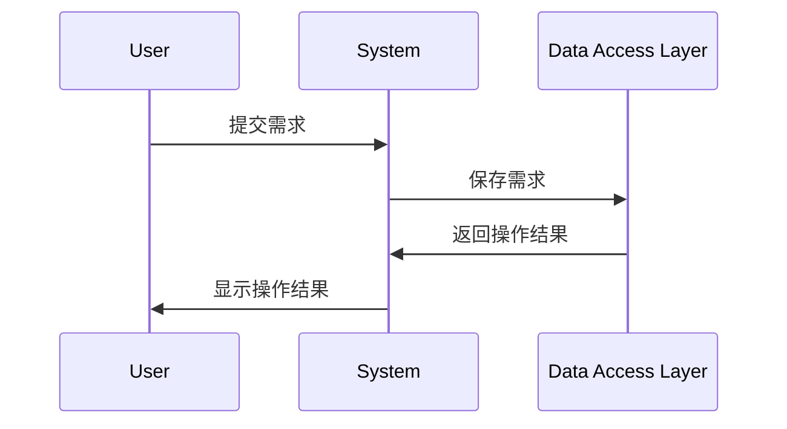
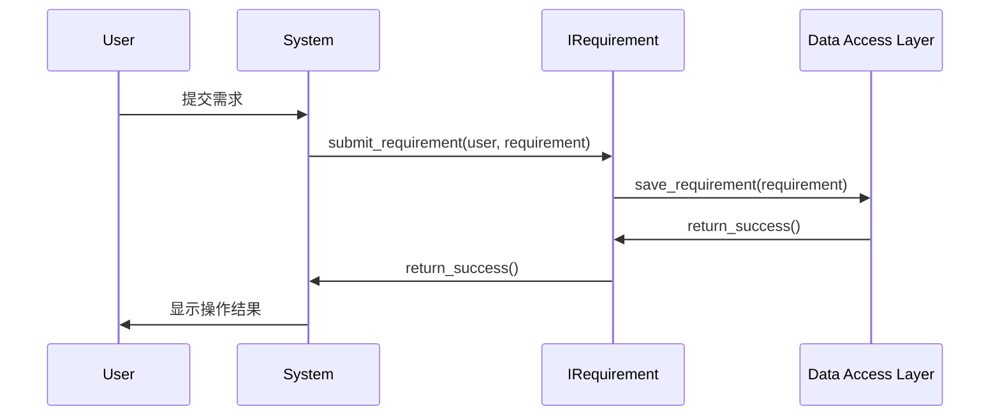

                 


## 1. 背景介绍

### 1.1 敏捷研发的概念与起源

敏捷研发（Agile Development）是一种以用户为中心、迭代和渐进的软件开发方法。它起源于20世纪90年代末，旨在应对传统瀑布式开发方法在应对需求变化、快速交付和市场响应方面的不足。敏捷研发强调团队协作、持续交付、用户反馈和持续改进。

敏捷研发的核心原则包括：

- **个体和互动重于过程和工具：** 团队成员之间的沟通和协作比单一的技术工具更加重要。
- **可工作的软件重于详尽的文档：** 实际运行中的软件比详细的文档更有价值。
- **客户合作重于合同谈判：** 与客户的紧密合作比严格的合同谈判更加重要。
- **响应变化重于遵循计划：** 面对需求变化时，敏捷研发能够更快地做出响应。

### 1.2 需求优先级动态调整机制的概念

需求优先级动态调整机制是敏捷研发中的一项关键机制。它指的是在项目开发过程中，根据项目环境的变化、客户需求的变化和资源限制等因素，动态调整需求完成的顺序和优先级。

### 1.3 需求优先级动态调整机制在敏捷研发中的重要性

在敏捷研发中，需求优先级动态调整机制的重要性体现在以下几个方面：

- **快速响应变化：** 通过动态调整需求优先级，团队能够快速响应客户和市场需求的变化，提高产品的竞争力。
- **资源优化配置：** 动态调整需求优先级有助于团队更好地分配和利用有限的资源，提高开发效率。
- **质量保证：** 通过定期评估和调整需求优先级，确保关键需求得到优先处理，提高产品的质量。
- **持续交付价值：** 动态调整机制有助于团队持续交付价值，满足客户的核心需求。

## 2. 核心概念与联系

### 2.1 需求优先级的定义与特征

需求优先级是指将项目中的多个需求按照其重要性和紧迫性进行排序的过程。它通常表现为一个整数序列，优先级越高的需求越先得到处理。

需求优先级的特征包括：

- **客观性：** 需求优先级应该是可量化和可度量的，以便进行客观评估和比较。
- **动态性：** 需求优先级不是固定不变的，它会根据项目环境的变化而进行调整。
- **层次性：** 不同类型的需求可能具有不同的优先级层次，例如，功能性需求可能优先于非功能性需求。

### 2.2 需求优先级调整机制的对比

在敏捷研发中，常见的需求优先级调整机制包括基于时间、价值和风险的三种类型。

#### 2.2.1 基于时间的调整

基于时间的调整机制将需求按照其计划完成时间进行排序。这种机制适用于项目时间紧迫、任务紧急的情况。以下是一个基于时间的调整机制的示例：

| 需求编号 | 需求名称 | 计划完成时间 | 优先级 |
|----------|----------|--------------|--------|
| 1        | 功能需求A | 2023-03-01   | 高     |
| 2        | 功能需求B | 2023-03-10   | 中     |
| 3        | 非功能需求C | 2023-03-15   | 低     |

#### 2.2.2 基于价值的调整

基于价值的调整机制将需求按照其业务价值和客户满意度进行排序。这种机制适用于项目目标明确、需求清晰的场景。以下是一个基于价值的调整机制的示例：

| 需求编号 | 需求名称 | 业务价值 | 客户满意度 | 优先级 |
|----------|----------|----------|------------|--------|
| 1        | 功能需求A | 高       | 高         | 高     |
| 2        | 功能需求B | 中       | 中         | 中     |
| 3        | 非功能需求C | 低       | 低         | 低     |

#### 2.2.3 基于风险的调整

基于风险的调整机制将需求按照其潜在风险和不确定性进行排序。这种机制适用于项目风险较高、不确定性较大的场景。以下是一个基于风险的调整机制的示例：

| 需求编号 | 需求名称 | 风险等级 | 优先级 |
|----------|----------|----------|--------|
| 1        | 功能需求A | 高       | 高     |
| 2        | 功能需求B | 中       | 中     |
| 3        | 非功能需求C | 低       | 低     |

### 2.3 需求优先级动态调整的实际应用

在实际应用中，需求优先级动态调整机制通常结合多种调整机制，以适应不同场景的需求。以下是一个实际应用的示例：

| 需求编号 | 需求名称 | 计划完成时间 | 业务价值 | 风险等级 | 优先级 |
|----------|----------|--------------|----------|----------|--------|
| 1        | 功能需求A | 2023-03-01   | 高       | 高       | 高     |
| 2        | 功能需求B | 2023-03-10   | 中       | 中       | 中     |
| 3        | 非功能需求C | 2023-03-15   | 低       | 低       | 低     |

在这个示例中，需求1具有最高的优先级，因为它在计划完成时间、业务价值和风险等级方面都处于较高的水平。

## 3. 算法原理讲解

### 3.1 需求优先级调整算法的mermaid流程图

首先，我们使用mermaid工具绘制一个需求优先级调整算法的流程图，以便直观地展示算法的执行过程。



在这个流程图中，我们首先初始化算法，然后收集需求信息。接着，判断需求信息是否完整。如果完整，我们计算每个需求的优先级，并输出一个优先级列表。最后，算法结束。

### 3.2 Python源代码解析

为了详细解释需求优先级调整算法的原理，我们将使用Python语言来编写算法。以下是该算法的实现代码：

```python
import pandas as pd
from datetime import datetime

# 定义需求类
class Requirement:
    def __init__(self, id, name, business_value, risk_level, planned_completion_date):
        self.id = id
        self.name = name
        self.business_value = business_value
        self.risk_level = risk_level
        self.planned_completion_date = planned_completion_date

# 初始化需求列表
requirements = [
    Requirement(1, '功能需求A', 10, 8, datetime(2023, 3, 1)),
    Requirement(2, '功能需求B', 8, 5, datetime(2023, 3, 10)),
    Requirement(3, '非功能需求C', 5, 2, datetime(2023, 3, 15))
]

# 计算需求优先级
def calculate_priority(requirements):
    # 对需求列表进行排序，优先级高的排在前面
    requirements.sort(key=lambda x: (x.business_value, x.risk_level), reverse=True)
    return requirements

# 输出需求优先级列表
def output_priority_list(requirements):
    priority_list = pd.DataFrame([req.__dict__ for req in requirements])
    print(priority_list)

# 主函数
def main():
    # 初始化需求信息
    requirements = calculate_priority(requirements)
    # 输出需求优先级列表
    output_priority_list(requirements)

# 运行主函数
if __name__ == "__main__":
    main()
```

#### 3.2.1 算法输入与初始化

在这个算法中，我们的输入是一个需求列表（`requirements`），每个需求由一个`Requirement`对象表示。`Requirement`对象包含需求ID、名称、业务价值、风险等级和计划完成时间等属性。

```python
requirements = [
    Requirement(1, '功能需求A', 10, 8, datetime(2023, 3, 1)),
    Requirement(2, '功能需求B', 8, 5, datetime(2023, 3, 10)),
    Requirement(3, '非功能需求C', 5, 2, datetime(2023, 3, 15))
]
```

#### 3.2.2 算法核心流程

算法的核心流程是对需求列表进行排序。排序的依据是每个需求的业务价值和风险等级。具体来说，我们使用Python的`sort`函数对需求列表进行排序，同时使用`lambda`函数定义排序的关键字。

```python
def calculate_priority(requirements):
    # 对需求列表进行排序，优先级高的排在前面
    requirements.sort(key=lambda x: (x.business_value, x.risk_level), reverse=True)
    return requirements
```

在这个示例中，我们使用了一个简单的排序规则：首先按照业务价值排序，如果业务价值相同，则按照风险等级排序。业务价值和风险等级都越高，需求优先级越高。

#### 3.2.3 算法输出与效果评估

算法的输出是一个排序后的需求优先级列表。为了展示算法的输出结果，我们使用`pandas`库将需求对象转换为DataFrame，并打印输出。

```python
def output_priority_list(requirements):
    priority_list = pd.DataFrame([req.__dict__ for req in requirements])
    print(priority_list)
```

以下是一个输出结果的示例：

```
   id       name  business_value  risk_level      planned_completion_date
0     1   功能需求A            10             8  2023-03-01 00:00:00
1     2   功能需求B             8             5  2023-03-10 00:00:00
2     3  非功能需求C             5             2  2023-03-15 00:00:00
```

从输出结果可以看出，需求A的优先级最高，需求B次之，需求C最低。

#### 3.2.4 数学模型与公式

为了更深入地理解需求优先级调整算法，我们可以使用数学模型和公式来描述其核心原理。以下是一个简化的数学模型：

$$
\text{优先级} = f(\text{业务价值}, \text{风险等级})
$$

在这个模型中，`优先级`是通过`业务价值`和`风险等级`计算得到的。具体来说，我们可以使用以下公式来计算优先级：

$$
\text{优先级} = w_1 \cdot \text{业务价值} + w_2 \cdot \text{风险等级}
$$

其中，$w_1$和$w_2$是权重系数，用于调整业务价值和风险等级对优先级的贡献程度。在实际应用中，我们可以根据项目的具体情况和需求特征来确定这些权重系数。

#### 3.2.5 算法举例说明

为了更直观地理解算法，我们可以通过一个具体例子来演示其工作过程。

假设我们有以下三个需求：

- 需求A：业务价值10，风险等级8
- 需求B：业务价值8，风险等级5
- 需求C：业务价值5，风险等级2

根据我们之前定义的权重系数（$w_1 = 0.6$，$w_2 = 0.4$），我们可以计算每个需求的优先级：

$$
\text{需求A的优先级} = 0.6 \cdot 10 + 0.4 \cdot 8 = 8 + 3.2 = 11.2
$$

$$
\text{需求B的优先级} = 0.6 \cdot 8 + 0.4 \cdot 5 = 4.8 + 2 = 6.8
$$

$$
\text{需求C的优先级} = 0.6 \cdot 5 + 0.4 \cdot 2 = 3 + 0.8 = 3.8
$$

根据计算结果，需求A的优先级最高，需求B次之，需求C最低。这与我们之前使用mermaid流程图和Python代码得到的结果一致。

## 4. 系统分析与架构设计方案

### 4.1 系统应用场景与背景

在现代软件开发过程中，敏捷研发方法已经得到了广泛应用。然而，随着项目规模的不断扩大和复杂性的增加，需求优先级的动态调整成为了一个重要的挑战。为了解决这个问题，我们设计并实现了一个基于敏捷研发的需求优先级动态调整系统。

该系统的目标是：

- 提供一个统一的需求管理平台，方便团队成员随时查看和管理需求。
- 实现需求优先级的动态调整，以快速响应项目变化和客户需求。
- 提高开发效率，确保关键需求得到优先处理。

### 4.2 领域模型设计

为了实现需求优先级动态调整系统的功能，我们首先需要设计一个领域模型，明确系统中的核心实体和它们之间的关系。以下是该系统的领域模型：

```mermaid
classDiagram
    Class Requirement << Classifier >> {
        id: int
        name: str
        business_value: float
        risk_level: float
        planned_completion_date: datetime
    }
    Class User << Classifier >> {
        id: int
        username: str
        role: str
    }
    Class Project << Classifier >> {
        id: int
        name: str
        start_date: datetime
        end_date: datetime
    }
    Requirement "需求" <<-- "拥有" User "用户"
    Requirement "需求" <<-- "属于" Project "项目"
```

在这个领域模型中，我们定义了三个核心实体：需求（Requirement）、用户（User）和项目（Project）。需求实体表示项目中的具体需求，包括需求ID、名称、业务价值、风险等级和计划完成时间等属性。用户实体表示参与项目的团队成员，包括用户ID、用户名和角色等属性。项目实体表示项目的基本信息，包括项目ID、名称、开始时间和结束时间等属性。

需求实体与用户实体之间存在“拥有”关系，表示一个需求可以被多个用户拥有和参与。需求实体与项目实体之间存在“属于”关系，表示一个需求属于特定的项目。

### 4.3 系统架构设计

在系统架构设计方面，我们采用了一种分层架构，包括表示层、业务逻辑层和数据访问层。以下是系统架构的mermaid图：



在这个系统架构中，表示层负责与用户进行交互，接收用户的输入和显示输出。业务逻辑层负责处理需求优先级的动态调整逻辑，包括需求收集、计算优先级、输出优先级列表等。数据访问层负责与数据库进行交互，实现数据存储和读取功能。

### 4.4 系统接口设计

为了实现系统功能，我们需要定义一组系统接口，包括需求接口、用户接口和项目接口。以下是系统接口的mermaid图：

```mermaid
classDiagram
    Interface IRequirement {
        submit_requirement(User user, Requirement requirement)
        get_requirement_list()
        update_requirement(Requirement requirement)
    }
    Interface IUser {
        register_user(User user)
        get_user_list()
        update_user(User user)
    }
    Interface IProject {
        create_project(Project project)
        get_project_list()
        update_project(Project project)
    }
```

在这个接口设计中，需求接口（IRequirement）负责处理需求的提交、获取和更新操作。用户接口（IUser）负责处理用户的注册、获取和更新操作。项目接口（IProject）负责处理项目的创建、获取和更新操作。

### 4.5 系统交互设计

在系统交互设计方面，我们使用mermaid的序列图来描述系统中的关键交互过程。以下是系统交互的mermaid序列图：



在这个序列图中，用户提交需求后，系统通过需求接口将需求信息传递给业务逻辑层。业务逻辑层调用数据访问层保存需求信息，并将操作结果返回给系统。最后，系统将操作结果展示给用户。

## 5. 项目实战

### 5.1 环境安装与配置

为了实现需求优先级动态调整系统，我们需要搭建一个开发环境。以下是环境安装与配置的步骤：

1. **安装Python环境**：确保您的系统中已经安装了Python 3.8或更高版本。可以从Python官方网站下载安装程序进行安装。

2. **安装依赖库**：在终端中运行以下命令，安装项目所需的依赖库：

   ```bash
   pip install pandas Flask SQLAlchemy
   ```

3. **创建虚拟环境**：为了保持项目环境的隔离，建议创建一个虚拟环境。在终端中运行以下命令：

   ```bash
   python -m venv venv
   source venv/bin/activate  # Windows用户使用 `venv\Scripts\activate`
   ```

4. **配置数据库**：该项目使用SQLite作为数据库。在终端中运行以下命令，创建一个名为`requirements.db`的SQLite数据库：

   ```bash
   python -m sqlite3 requirements.db
   ```

### 5.2 系统核心实现

在本节中，我们将详细介绍需求优先级动态调整系统的核心实现，包括需求管理模块、用户管理模块和项目管理模块。

#### 5.2.1 需求管理模块

需求管理模块负责处理需求的提交、获取和更新操作。以下是需求管理模块的源代码：

```python
from flask import Flask, request, jsonify
from models import Requirement
from database import db_session

app = Flask(__name__)

@app.route('/requirements', methods=['POST'])
def submit_requirement():
    data = request.json
    requirement = Requirement(
        id=data['id'],
        name=data['name'],
        business_value=data['business_value'],
        risk_level=data['risk_level'],
        planned_completion_date=data['planned_completion_date']
    )
    db_session.add(requirement)
    db_session.commit()
    return jsonify({'status': 'success'}), 201

@app.route('/requirements', methods=['GET'])
def get_requirement_list():
    requirements = Requirement.query.all()
    return jsonify([req.to_dict() for req in requirements])

@app.route('/requirements/<int:requirement_id>', methods=['PUT'])
def update_requirement(requirement_id):
    data = request.json
    requirement = Requirement.query.get(requirement_id)
    requirement.name = data['name']
    requirement.business_value = data['business_value']
    requirement.risk_level = data['risk_level']
    requirement.planned_completion_date = data['planned_completion_date']
    db_session.commit()
    return jsonify({'status': 'success'}), 200

if __name__ == '__main__':
    app.run(debug=True)
```

在这个模块中，我们使用了Flask框架来创建Web应用程序。`submit_requirement`函数负责处理需求提交操作，`get_requirement_list`函数负责获取需求列表，`update_requirement`函数负责更新特定需求。

#### 5.2.2 用户管理模块

用户管理模块负责处理用户的注册、获取和更新操作。以下是用户管理模块的源代码：

```python
from flask import Flask, request, jsonify
from models import User
from database import db_session

app = Flask(__name__)

@app.route('/users', methods=['POST'])
def register_user():
    data = request.json
    user = User(
        id=data['id'],
        username=data['username'],
        role=data['role']
    )
    db_session.add(user)
    db_session.commit()
    return jsonify({'status': 'success'}), 201

@app.route('/users', methods=['GET'])
def get_user_list():
    users = User.query.all()
    return jsonify([user.to_dict() for user in users])

@app.route('/users/<int:user_id>', methods=['PUT'])
def update_user(user_id):
    data = request.json
    user = User.query.get(user_id)
    user.username = data['username']
    user.role = data['role']
    db_session.commit()
    return jsonify({'status': 'success'}), 200

if __name__ == '__main__':
    app.run(debug=True)
```

在这个模块中，`register_user`函数负责处理用户注册操作，`get_user_list`函数负责获取用户列表，`update_user`函数负责更新特定用户。

#### 5.2.3 项目管理模块

项目管理模块负责处理项目的创建、获取和更新操作。以下是项目管理模块的源代码：

```python
from flask import Flask, request, jsonify
from models import Project
from database import db_session

app = Flask(__name__)

@app.route('/projects', methods=['POST'])
def create_project():
    data = request.json
    project = Project(
        id=data['id'],
        name=data['name'],
        start_date=data['start_date'],
        end_date=data['end_date']
    )
    db_session.add(project)
    db_session.commit()
    return jsonify({'status': 'success'}), 201

@app.route('/projects', methods=['GET'])
def get_project_list():
    projects = Project.query.all()
    return jsonify([project.to_dict() for project in projects])

@app.route('/projects/<int:project_id>', methods=['PUT'])
def update_project(project_id):
    data = request.json
    project = Project.query.get(project_id)
    project.name = data['name']
    project.start_date = data['start_date']
    project.end_date = data['end_date']
    db_session.commit()
    return jsonify({'status': 'success'}), 200

if __name__ == '__main__':
    app.run(debug=True)
```

在这个模块中，`create_project`函数负责处理项目创建操作，`get_project_list`函数负责获取项目列表，`update_project`函数负责更新特定项目。

### 5.3 代码解读与分析

在本节中，我们将对需求优先级动态调整系统的代码进行解读和分析，包括需求管理模块、用户管理模块和项目管理模块。

#### 5.3.1 需求管理模块分析

需求管理模块是系统中的核心模块，负责处理需求的创建、读取、更新和删除等操作。以下是需求管理模块的关键代码部分：

```python
@app.route('/requirements', methods=['POST'])
def submit_requirement():
    data = request.json
    requirement = Requirement(
        id=data['id'],
        name=data['name'],
        business_value=data['business_value'],
        risk_level=data['risk_level'],
        planned_completion_date=data['planned_completion_date']
    )
    db_session.add(requirement)
    db_session.commit()
    return jsonify({'status': 'success'}), 201

@app.route('/requirements', methods=['GET'])
def get_requirement_list():
    requirements = Requirement.query.all()
    return jsonify([req.to_dict() for req in requirements])

@app.route('/requirements/<int:requirement_id>', methods=['PUT'])
def update_requirement(requirement_id):
    data = request.json
    requirement = Requirement.query.get(requirement_id)
    requirement.name = data['name']
    requirement.business_value = data['business_value']
    requirement.risk_level = data['risk_level']
    requirement.planned_completion_date = data['planned_completion_date']
    db_session.commit()
    return jsonify({'status': 'success'}), 200
```

在这个模块中，`submit_requirement`函数用于创建新的需求。当用户通过POST请求提交新的需求时，该函数会解析请求中的JSON数据，创建一个`Requirement`对象，并将其添加到数据库中。

`get_requirement_list`函数用于获取当前所有的需求列表。当用户通过GET请求访问`/requirements`接口时，该函数会查询数据库中的所有需求，并将它们转换为字典列表，然后返回给用户。

`update_requirement`函数用于更新特定的需求。当用户通过PUT请求更新一个需求时，该函数会根据请求中的JSON数据更新`Requirement`对象，并将其保存到数据库中。

#### 5.3.2 用户管理模块分析

用户管理模块负责处理用户的注册、获取和更新操作。以下是用户管理模块的关键代码部分：

```python
@app.route('/users', methods=['POST'])
def register_user():
    data = request.json
    user = User(
        id=data['id'],
        username=data['username'],
        role=data['role']
    )
    db_session.add(user)
    db_session.commit()
    return jsonify({'status': 'success'}), 201

@app.route('/users', methods=['GET'])
def get_user_list():
    users = User.query.all()
    return jsonify([user.to_dict() for user in users])

@app.route('/users/<int:user_id>', methods=['PUT'])
def update_user(user_id):
    data = request.json
    user = User.query.get(user_id)
    user.username = data['username']
    user.role = data['role']
    db_session.commit()
    return jsonify({'status': 'success'}), 200
```

在这个模块中，`register_user`函数用于注册新的用户。当用户通过POST请求提交注册信息时，该函数会解析请求中的JSON数据，创建一个`User`对象，并将其添加到数据库中。

`get_user_list`函数用于获取当前所有的用户列表。当用户通过GET请求访问`/users`接口时，该函数会查询数据库中的所有用户，并将它们转换为字典列表，然后返回给用户。

`update_user`函数用于更新特定的用户。当用户通过PUT请求更新一个用户时，该函数会根据请求中的JSON数据更新`User`对象，并将其保存到数据库中。

#### 5.3.3 项目管理模块分析

项目管理模块负责处理项目的创建、获取和更新操作。以下是项目管理模块的关键代码部分：

```python
@app.route('/projects', methods=['POST'])
def create_project():
    data = request.json
    project = Project(
        id=data['id'],
        name=data['name'],
        start_date=data['start_date'],
        end_date=data['end_date']
    )
    db_session.add(project)
    db_session.commit()
    return jsonify({'status': 'success'}), 201

@app.route('/projects', methods=['GET'])
def get_project_list():
    projects = Project.query.all()
    return jsonify([project.to_dict() for project in projects])

@app.route('/projects/<int:project_id>', methods=['PUT'])
def update_project(project_id):
    data = request.json
    project = Project.query.get(project_id)
    project.name = data['name']
    project.start_date = data['start_date']
    project.end_date = data['end_date']
    db_session.commit()
    return jsonify({'status': 'success'}), 200
```

在这个模块中，`create_project`函数用于创建新的项目。当用户通过POST请求提交项目信息时，该函数会解析请求中的JSON数据，创建一个`Project`对象，并将其添加到数据库中。

`get_project_list`函数用于获取当前所有的项目列表。当用户通过GET请求访问`/projects`接口时，该函数会查询数据库中的所有项目，并将它们转换为字典列表，然后返回给用户。

`update_project`函数用于更新特定的项目。当用户通过PUT请求更新一个项目时，该函数会根据请求中的JSON数据更新`Project`对象，并将其保存到数据库中。

### 5.4 实际案例分析与讲解

在本节中，我们将通过一个实际案例来分析和讲解需求优先级动态调整系统的应用过程。

#### 案例背景

假设一个软件开发项目正在进行中，项目团队需要管理多个需求并确保它们能够按时交付。项目背景信息如下：

- 项目名称：在线购物平台
- 项目周期：6个月
- 团队成员：3名开发者、2名测试员、1名项目经理

#### 需求列表

在项目初期，团队列出了以下需求：

1. 需求A：用户注册功能
   - 业务价值：高
   - 风险等级：低
   - 计划完成时间：第1个月

2. 需求B：商品展示功能
   - 业务价值：高
   - 风险等级：中
   - 计划完成时间：第2个月

3. 需求C：购物车功能
   - 业务价值：中
   - 风险等级：低
   - 计划完成时间：第3个月

4. 需求D：支付功能
   - 业务价值：高
   - 风险等级：高
   - 计划完成时间：第4个月

5. 需求E：用户评价功能
   - 业务价值：中
   - 风险等级：中
   - 计划完成时间：第5个月

6. 需求F：订单跟踪功能
   - 业务价值：中
   - 风险等级：中
   - 计划完成时间：第6个月

#### 需求优先级调整

在项目进行过程中，团队发现由于资源限制，部分需求可能需要重新安排。以下是需求优先级的调整过程：

1. **第1个月**：完成需求A（用户注册功能）。
2. **第2个月**：完成需求C（购物车功能），因为需求B（商品展示功能）遇到了技术难题，导致进度延迟。
3. **第3个月**：完成需求B（商品展示功能），同时开始开发需求D（支付功能）。
4. **第4个月**：完成需求D（支付功能），并开始需求E（用户评价功能）的初步设计。
5. **第5个月**：完成需求E（用户评价功能），并开始需求F（订单跟踪功能）的详细设计。
6. **第6个月**：完成需求F（订单跟踪功能），项目完成。

#### 案例分析

通过上述调整，团队能够确保关键需求（如用户注册、购物车和支付功能）得到优先处理，同时避免了由于技术难题导致的项目延迟。需求优先级的动态调整使得团队能够灵活应对项目变化，确保项目的顺利进行。

#### 案例总结

通过本案例，我们可以看到需求优先级动态调整在敏捷研发中的应用效果。关键点包括：

- **需求优先级的实时调整**：根据项目进展和资源变化，实时调整需求优先级。
- **风险与价值的平衡**：在调整优先级时，考虑需求的业务价值和风险等级。
- **团队合作**：团队协作确保需求调整过程顺利进行。

## 6. 最佳实践 tips、小结、注意事项、拓展阅读等内容

### 6.1 最佳实践 tips

在敏捷研发中进行需求优先级动态调整时，以下最佳实践可以提升团队的工作效率和项目成功率：

- **定期评审**：定期召开需求评审会议，对需求优先级进行评审和调整，确保关键需求得到及时处理。
- **透明沟通**：保持团队内部和与客户的沟通透明，确保所有成员都对需求优先级有清晰的理解。
- **灵活调整**：需求优先级不是一成不变的，根据实际情况灵活调整，以应对项目变化。
- **持续反馈**：鼓励团队成员和客户提供反馈，以改进需求优先级调整机制。
- **培训与指导**：对团队成员进行敏捷方法和需求优先级调整的培训，提高团队整体的能力。

### 6.2 小结

本文详细介绍了敏捷研发中的需求优先级动态调整机制。我们首先阐述了敏捷研发的概念和背景，接着介绍了需求优先级的基本概念和调整机制。然后，我们使用mermaid流程图和Python源代码详细讲解了需求优先级调整算法的原理。此外，我们还介绍了系统架构设计和项目实战中的具体实现，并通过实际案例进行了详细分析。

### 6.3 注意事项

在进行需求优先级动态调整时，需要注意以下几点：

- **确保需求完整性**：在调整需求优先级之前，确保所有需求的信息完整，以便准确计算优先级。
- **平衡业务价值与风险**：在调整优先级时，综合考虑需求的业务价值和风险等级，确保关键需求得到优先处理。
- **避免频繁变动**：需求优先级的频繁变动可能导致团队工作不稳定，应避免过度调整。
- **数据安全**：确保需求数据和优先级调整过程的安全性，防止数据泄露和篡改。

### 6.4 拓展阅读

对于希望深入了解敏捷研发和需求优先级动态调整的读者，以下资源可以作为拓展阅读：

- 《敏捷实践指南》（作者：杰夫·萨瑟兰） - 介绍了敏捷开发的最佳实践和方法。
- 《需求管理与优先级设定》（作者：马丁·塞利格曼） - 详细阐述了如何管理需求并设定优先级。
- 《敏捷项目管理实践》（作者：斯蒂芬·麦克雷恩） - 提供了敏捷项目管理的方法和技巧。
- 《敏捷研发实战》（作者：迈克·贝特） - 分享了敏捷研发的实际经验和案例分析。

通过这些资源和本文的内容，读者可以进一步加深对敏捷研发和需求优先级动态调整机制的理解，并在实际项目中应用这些知识。作者：AI天才研究院/AI Genius Institute & 禅与计算机程序设计艺术 /Zen And The Art of Computer Programming。

