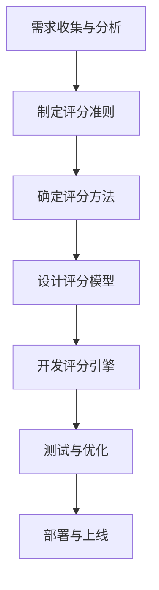

                 


### 第一部分：引言

#### 1.1 敏捷研发的背景和重要性

敏捷研发是一种以人为核心、迭代和灵活应对变化的项目管理方法。它的核心理念是“个体和互动重于过程与工具”，“可工作的软件重于详尽的文档”，“客户合作重于合同谈判”，“响应变化重于遵循计划”。敏捷研发起源于20世纪90年代末，旨在应对传统瀑布模型的诸多弊端，如项目周期长、需求变更频繁、沟通成本高、质量难以控制等。

敏捷研发的重要性在于，它能够帮助团队更快地响应市场需求，提高产品的质量，减少浪费，并提升团队的工作满意度和凝聚力。在当今快速变化的商业环境中，敏捷研发已经成为许多组织首选的开发方法。

**引言中的具体内容：**

1. **敏捷研发的定义**：敏捷研发是一种基于迭代、增量、灵活性和可预测性的软件开发方法。它强调团队合作、持续交付、客户互动、适应变化和自我管理。
   
2. **敏捷研发的优势**：敏捷研发能够缩短产品上市时间、提高产品质量、减少项目风险、增强团队沟通和协作，以及更好地满足客户需求。

3. **敏捷研发的应用场景**：敏捷研发适用于项目需求变化频繁、客户需求不明确、产品需要快速迭代的市场环境。

#### 1.2 需求优先级评分系统设计的重要性

需求优先级评分系统在敏捷研发中扮演着至关重要的角色。它帮助团队在众多需求中找到最关键、最有价值的任务，确保资源得到最有效的利用。

**引言中的具体内容：**

1. **需求优先级评分的定义**：需求优先级评分是一种对需求进行量化和排序的方法，它通过一系列指标或评分准则，将需求根据其重要性和紧迫性进行排序。

2. **需求优先级评分的作用**：通过需求优先级评分，团队可以清晰地了解哪些需求应该优先处理，哪些可以暂时搁置，从而优化工作流程，提高工作效率。

3. **需求优先级评分系统的挑战**：敏捷研发中的需求优先级评分系统设计面临着需求多样性、不确定性、资源有限性等多重挑战。

### 总结

引言部分介绍了敏捷研发的背景和重要性，以及需求优先级评分系统在敏捷研发中的作用和挑战。接下来，我们将深入探讨需求优先级评分系统的概念、设计原理和实际应用，以帮助读者更好地理解和实践这一重要技术。

---

### 第二部分：背景介绍

#### 2.1 敏捷研发中的需求优先级评分问题

**问题描述：**

在敏捷研发中，由于市场需求的快速变化，产品需求常常是多样且动态的。如何在这些需求中找出最关键的需求，进行合理排序和优先级管理，是团队面临的重大挑战。

**问题解决思路：**

1. **明确需求**：首先，需要对所有的需求进行详细的定义和记录，确保每个需求都是明确、可量化和可追踪的。

2. **评分准则**：制定一套统一的评分准则，用于对需求进行评分。评分准则应包括需求的重要性和紧迫性等多个维度。

3. **评分过程**：通过团队的讨论和决策，对每个需求进行评分，并根据评分结果进行排序。

4. **动态调整**：根据项目的进展和市场环境的变化，动态调整需求优先级，确保资源始终被用于最高价值的需求上。

**边界与外延：**

1. **边界**：需求优先级评分系统主要应用于敏捷研发过程中，帮助团队在众多需求中找到优先处理的需求。

2. **外延**：需求优先级评分系统可以扩展应用于其他项目管理领域，如项目组合管理和资源分配等。

#### 2.2 需求优先级评分系统的概念结构与核心要素组成

**核心概念原理：**

1. **需求**：需求的定义和描述，是需求优先级评分的基础。

2. **评分准则**：评分准则用于对需求进行评分，包括重要性和紧迫性等多个维度。

3. **评分方法**：根据评分准则，对需求进行评分的方法和流程。

4. **排序规则**：根据评分结果，对需求进行排序的规则。

**核心要素组成：**

1. **需求数据库**：存储所有需求的详细信息，包括需求描述、评分准则和评分结果等。

2. **评分引擎**：负责根据评分准则对需求进行评分的软件模块。

3. **用户界面**：提供用户输入、查看和调整需求优先级的功能。

4. **报表系统**：生成各种报表，用于展示需求优先级和团队工作进度。

**ER实体关系图架构：**

```mermaid
erDiagram
    ProductRequirement ||--|{ Score Criterion : 评分准则} 
    ProductRequirement ||--|{ Score Result : 评分结果}
    Score Criterion ||--|{ Scoring Method : 评分方法}
    Score Result ||--|{Ranking Rule : 排序规则}
```

**具体内容：**

- **需求**：包括需求ID、名称、描述、来源、创建时间、修改时间等。
- **评分准则**：包括重要性、紧迫性、技术复杂性、业务价值等。
- **评分结果**：包括需求ID、评分值、评分时间等。
- **评分方法**：包括基于评分准则的评分模型和算法。

**背景介绍的具体内容：**

1. **问题背景**：在敏捷研发过程中，如何有效地管理和优先级排序大量需求，成为团队面临的常见问题。

2. **问题描述**：在敏捷研发中，需求优先级管理的问题，包括需求多样性、不确定性、资源有限性等。

3. **问题解决思路**：通过明确需求、制定评分准则、实施评分过程和动态调整，解决需求优先级管理的问题。

4. **边界与外延**：需求优先级评分系统主要应用于敏捷研发过程中，但其概念和方法可以扩展应用于其他项目管理领域。

### 总结

背景介绍部分详细阐述了敏捷研发中的需求优先级评分问题，包括问题描述、解决思路、核心概念原理、核心要素组成和ER实体关系图架构。接下来，我们将进一步探讨需求优先级评分系统的核心概念与联系，以帮助读者深入理解这一技术。

---

### 第三部分：核心概念与联系

#### 3.1 需求优先级评分系统的核心概念

在需求优先级评分系统中，核心概念是理解和管理需求优先级的基础。以下是一些关键的核心概念：

1. **需求**：需求是产品或项目中需要实现的功能或任务。每个需求都应该有明确的描述、优先级和相关的依赖关系。

2. **评分准则**：评分准则是一套规则或标准，用于评估需求的优先级。常见的评分准则包括业务价值、技术复杂度、风险、紧急程度等。

3. **评分方法**：评分方法是用来计算需求优先级的具体技术或流程。常见的评分方法包括评分矩阵、相对评分、加权评分等。

4. **排序规则**：排序规则是决定需求优先级顺序的准则。通常，排序规则会结合评分准则和评分结果来确定。

5. **评分结果**：评分结果是根据评分准则和评分方法计算出的需求优先级。评分结果通常以分数、排名或等级形式表示。

**核心概念之间的联系：**

这些核心概念相互联系，构成了需求优先级评分系统的核心框架。需求是评分的基础，评分准则提供了评估需求的依据，评分方法和排序规则则将这些依据转化为具体的评分结果和优先级排序。

#### 3.2 不同评分方法的特点对比

在需求优先级评分系统中，有多种评分方法可供选择。每种方法都有其独特的特点和适用场景。以下是几种常见的评分方法及其特点的对比：

**1. 评分矩阵法**

- **特点**：评分矩阵法通过为每个评分准则分配权重，将需求映射到一个矩阵中，然后根据矩阵计算综合评分。
- **适用场景**：适用于需要综合考虑多个评分准则且权重不同的情况。

**2. 相对评分法**

- **特点**：相对评分法通过将需求相互比较来确定优先级，无需为每个准则分配权重。
- **适用场景**：适用于需求相对简单且直接比较容易的情况。

**3. 加权评分法**

- **特点**：加权评分法为每个评分准则分配固定权重，然后将各准则的评分乘以权重并求和得到总评分。
- **适用场景**：适用于有明确的优先级顺序且需要加权评估的需求。

**4. 综合评分法**

- **特点**：综合评分法结合了多种评分方法，例如，使用评分矩阵法进行初步评分，然后使用相对评分法进行修正。
- **适用场景**：适用于需求复杂且需要更精确评估的情况。

**对比表格：**

| 评分方法 | 特点 | 适用场景 |
| --- | --- | --- |
| 评分矩阵法 | 综合考虑多个评分准则，分配权重 | 需求复杂，权重不同的情景 |
| 相对评分法 | 简单直观，无需权重 | 需求简单，直接比较 |
| 加权评分法 | 加权计算，明确优先级 | 明确优先级顺序，需要加权 |
| 综合评分法 | 结合多种方法，更精确 | 需求复杂，需要多角度评估 |

**ER实体关系图架构：**

```mermaid
erDiagram
    ProductRequirement ||--|{ScoreCriterion : 评分准则} : "有多个"
    ScoreCriterion ||--|{ScoreMethod : 评分方法} : "有多种"
    ScoreMethod ||--|{ScoreResult : 评分结果} : "生成多个"
    ScoreResult ||--|{RankingRule : 排序规则} : "用于排序"
```

**具体内容：**

- **需求数据库**：存储所有需求的详细信息，包括需求ID、名称、描述、评分结果等。
- **评分准则数据库**：存储评分准则的详细信息，包括准则名称、权重、描述等。
- **评分方法数据库**：存储评分方法的详细信息，包括方法名称、算法等。
- **评分结果数据库**：存储每个需求的评分结果和排序规则。

**核心概念与联系的具体内容：**

1. **核心概念原理**：详细介绍了需求、评分准则、评分方法、排序规则和评分结果等核心概念。
2. **概念属性特征对比表格**：对比了评分矩阵法、相对评分法、加权评分法和综合评分法的特点和适用场景。
3. **ER实体关系图架构**：展示了需求、评分准则、评分方法、评分结果和排序规则之间的实体关系。

### 总结

核心概念与联系部分详细介绍了需求优先级评分系统的核心概念及其之间的联系，并对比了不同评分方法的特点。接下来，我们将深入探讨需求优先级评分系统的设计原理，包括系统设计流程、算法原理和数学模型。

---

### 第四部分：需求优先级评分系统设计原理

#### 4.1 需求优先级评分系统设计流程

需求优先级评分系统的设计流程是确保系统能够有效地评估和管理需求的关键。以下是一个典型的需求优先级评分系统设计流程：

**设计流程步骤：**

1. **需求收集与分析**：收集所有需求，并对需求进行初步分析，明确每个需求的业务价值、技术复杂度和风险等。

2. **制定评分准则**：根据业务需求和项目特点，制定一套统一的评分准则，用于对需求进行评估。评分准则应包括重要性、紧急性、技术复杂度、业务影响等。

3. **确定评分方法**：选择适合项目特点的评分方法，例如评分矩阵法、相对评分法或加权评分法等。评分方法应能够准确地反映需求的优先级。

4. **设计评分模型**：根据评分准则和评分方法，设计评分模型。评分模型应能够将评分准则转化为具体的评分指标和计算公式。

5. **开发评分引擎**：开发评分引擎，实现评分模型和评分算法。评分引擎应能够自动计算每个需求的评分结果，并提供用户界面供用户调整和查看评分结果。

6. **测试与优化**：对评分系统进行全面的测试，确保评分结果准确可靠。根据测试结果，对评分模型和评分算法进行优化。

7. **部署与上线**：将评分系统部署到生产环境中，并进行实际应用。在上线后，根据项目进展和用户反馈，持续优化和改进评分系统。

**流程图展示：**



#### 4.2 算法原理讲解

需求优先级评分系统的核心在于评分算法。以下是一个简单的评分算法原理讲解：

**算法原理：**

1. **评分指标定义**：首先，定义一系列评分指标，用于评估需求。常见的评分指标包括重要性、紧急性、技术复杂度、业务影响等。

2. **评分值计算**：为每个评分指标分配一个权重，然后计算每个需求的得分。得分计算公式为：

   $$ 
   Score = \sum_{i=1}^{n} (Weight_i \times Score_i) 
   $$

   其中，$Weight_i$为第$i$个评分指标的权重，$Score_i$为第$i$个评分指标的得分。

3. **排序规则定义**：根据评分结果，定义排序规则。排序规则可以是简单的降序排列，也可以是更复杂的规则，如基于多个评分指标的复合排序。

4. **评分结果应用**：将评分结果应用到需求管理中，根据评分结果调整需求实现顺序和资源分配。

**数学模型与公式：**

1. **评分指标权重分配**：

   $$ 
   Weight_i = \frac{TotalWeight}{\sum_{i=1}^{n} (Value_i \times MaxValue)} 
   $$

   其中，$TotalWeight$为总权重，$Value_i$为第$i$个评分指标的最大值，$MaxValue$为所有评分指标的最大值之和。

2. **需求得分计算**：

   $$ 
   Score = \sum_{i=1}^{n} (Weight_i \times Score_i) 
   $$

   其中，$Score_i$为第$i$个评分指标的得分。

3. **排序规则**：

   $$ 
   Ranking = Score \times RankingRule 
   $$

   其中，$RankingRule$为排序规则，可以是线性函数、分段函数等。

**通俗易懂的举例说明：**

假设有三个需求A、B和C，每个需求有四个评分指标：重要性、紧急性、技术复杂度和业务影响。每个指标的得分范围是0到100分，权重分别为0.3、0.2、0.2和0.3。

**需求A的得分计算：**

$$ 
Score_A = (0.3 \times 80) + (0.2 \times 85) + (0.2 \times 70) + (0.3 \times 90) = 79 
$$

**需求B的得分计算：**

$$ 
Score_B = (0.3 \times 75) + (0.2 \times 90) + (0.2 \times 80) + (0.3 \times 85) = 82.5 
$$

**需求C的得分计算：**

$$ 
Score_C = (0.3 \times 85) + (0.2 \times 80) + (0.2 \times 75) + (0.3 \times 90) = 84.5 
$$

根据得分计算结果，需求C的优先级最高，需求B次之，需求A最低。

### 总结

需求优先级评分系统设计原理部分详细介绍了需求优先级评分系统的设计流程和算法原理。设计流程确保了系统能够有效地评估和管理需求，而算法原理则为系统提供了具体的计算方法。接下来，我们将探讨需求优先级评分系统的实际应用，包括系统架构设计、功能设计和项目实战。

---

### 第五部分：系统架构设计

#### 5.1 系统功能设计

系统功能设计是需求优先级评分系统的核心，它定义了系统应具备的各种功能模块，以实现需求的评估和管理。以下是系统功能设计的关键模块和领域模型：

**领域模型：**

```mermaid
classDiagram
    ProductRequirement <<class>> "需求"
    ScoreCriterion <<class>> "评分准则"
    ScoreMethod <<class>> "评分方法"
    ScoreResult <<class>> "评分结果"
    RankingRule <<class>> "排序规则"

    ProductRequirement "有多个" ScoreCriterion
    ScoreCriterion "有多种" ScoreMethod
    ScoreMethod "生成多个" ScoreResult
    ScoreResult "用于排序" RankingRule
```

**功能设计：**

1. **需求管理**：包括需求的收集、编辑、删除和查询功能。用户可以添加新的需求，并对现有需求进行修改和删除。

2. **评分准则管理**：包括评分准则的创建、编辑、删除和查询功能。用户可以定义新的评分准则，并为已有准则分配权重。

3. **评分方法管理**：包括评分方法的创建、编辑、删除和查询功能。用户可以选择适合项目特点的评分方法。

4. **评分结果管理**：包括评分结果的生成、更新、删除和查询功能。系统自动计算每个需求的评分结果，并提供用户界面供用户查看。

5. **排序规则管理**：包括排序规则的创建、编辑、删除和查询功能。用户可以定义排序规则，以确定需求的优先级顺序。

**类图展示：**

```mermaid
classDiagram
    class ProductRequirement {
        - id: int
        - name: string
        - description: string
        - scoreResult: ScoreResult
    }
    class ScoreCriterion {
        - id: int
        - name: string
        - weight: float
    }
    class ScoreMethod {
        - id: int
        - name: string
        - algorithm: string
    }
    class ScoreResult {
        - id: int
        - score: float
        - ranking: int
    }
    class RankingRule {
        - id: int
        - name: string
        - rule: string
    }
    ProductRequirement "有多个" ScoreCriterion
    ScoreCriterion "有多种" ScoreMethod
    ScoreMethod "生成多个" ScoreResult
    ScoreResult "用于排序" RankingRule
```

#### 5.2 系统架构设计

系统架构设计定义了系统各组件的交互方式和组织结构，以确保系统的高效性和可扩展性。以下是系统架构设计的关键组件和架构图：

**架构设计：**

1. **前端界面**：用户通过前端界面与系统交互，进行需求管理、评分准则管理、评分方法和排序规则管理等功能。

2. **后端服务**：后端服务负责处理业务逻辑，包括需求收集、评分计算、结果存储和查询等。

3. **数据库**：数据库存储系统的所有数据，包括需求、评分准则、评分结果和排序规则等。

4. **API接口**：API接口用于前后端的数据交互，提供统一的接口规范，便于系统的集成和扩展。

**架构图展示：**

```mermaid
sequenceDiagram
    User -->|请求| Frontend
    Frontend -->|处理请求| Backend
    Backend -->|处理结果| Database
    Database -->|返回结果| Frontend
    Frontend -->|显示结果| User
```

#### 5.3 系统接口设计

系统接口设计定义了系统内部各组件之间的交互接口，以及与外部系统的接口。以下是系统接口设计的关键接口和接口文档：

**接口定义：**

1. **需求管理接口**：用于添加、编辑、删除和查询需求。
2. **评分准则管理接口**：用于添加、编辑、删除和查询评分准则。
3. **评分方法管理接口**：用于添加、编辑、删除和查询评分方法。
4. **评分结果管理接口**：用于生成、更新、删除和查询评分结果。
5. **排序规则管理接口**：用于添加、编辑、删除和查询排序规则。

**接口文档：**

```json
{
  "需求管理接口": {
    "GET /requirements": "查询所有需求",
    "POST /requirements": "添加新需求",
    "PUT /requirements/{id}": "编辑指定需求",
    "DELETE /requirements/{id}": "删除指定需求"
  },
  "评分准则管理接口": {
    "GET /scoring-criteria": "查询所有评分准则",
    "POST /scoring-criteria": "添加新评分准则",
    "PUT /scoring-criteria/{id}": "编辑指定评分准则",
    "DELETE /scoring-criteria/{id}": "删除指定评分准则"
  },
  "评分方法管理接口": {
    "GET /scoring-methods": "查询所有评分方法",
    "POST /scoring-methods": "添加新评分方法",
    "PUT /scoring-methods/{id}": "编辑指定评分方法",
    "DELETE /scoring-methods/{id}": "删除指定评分方法"
  },
  "评分结果管理接口": {
    "GET /score-results": "查询所有评分结果",
    "POST /score-results": "生成评分结果",
    "PUT /score-results/{id}": "更新指定评分结果",
    "DELETE /score-results/{id}": "删除指定评分结果"
  },
  "排序规则管理接口": {
    "GET /ranking-rules": "查询所有排序规则",
    "POST /ranking-rules": "添加新排序规则",
    "PUT /ranking-rules/{id}": "编辑指定排序规则",
    "DELETE /ranking-rules/{id}": "删除指定排序规则"
  }
}
```

#### 5.4 系统交互

系统交互设计定义了系统内部各组件之间的通信流程，以及与外部系统的通信机制。以下是系统交互设计的关键通信流程和序列图：

**序列图展示：**

```mermaid
sequenceDiagram
    User -->|提交需求| Frontend
    Frontend -->|处理需求| Backend
    Backend -->|保存需求| Database
    Database -->|返回结果| Frontend
    Frontend -->|显示结果| User

    User -->|查询评分结果| Frontend
    Frontend -->|处理查询| Backend
    Backend -->|查询数据库| Database
    Database -->|返回结果| Backend
    Backend -->|返回结果| Frontend
    Frontend -->|显示结果| User
```

### 总结

系统架构设计部分详细介绍了需求优先级评分系统的功能设计、系统架构设计、系统接口设计和系统交互。功能设计定义了系统的核心功能模块，系统架构设计展示了系统各组件的交互方式和组织结构，系统接口设计定义了系统内部和外部系统的交互接口，系统交互设计则描述了系统内部各组件之间的通信流程。接下来，我们将通过项目实战，深入探讨需求优先级评分系统的实际应用。

---

### 第六部分：项目实战

#### 6.1 环境安装

在开始构建需求优先级评分系统之前，我们需要确保开发环境已经搭建完毕。以下是环境安装的步骤：

1. **安装Python环境**：确保Python 3.8或更高版本已安装。可以使用以下命令来检查Python版本：

   ```bash
   python --version
   ```

2. **安装依赖库**：使用pip安装所需的Python依赖库，例如Flask（用于Web应用开发）、SQLAlchemy（用于数据库操作）等。可以使用以下命令安装：

   ```bash
   pip install flask sqlalchemy
   ```

3. **数据库安装**：选择一个关系型数据库，如MySQL或PostgreSQL，并安装数据库服务。根据数据库类型，可以使用以下命令进行安装：

   - **MySQL**：

     ```bash
     sudo apt-get install mysql-server
     ```

   - **PostgreSQL**：

     ```bash
     sudo apt-get install postgresql postgresql-contrib
     ```

4. **数据库配置**：配置数据库用户和权限，以便应用程序可以连接和使用数据库。

   ```sql
   CREATE USER 'score_system_user' IDENTIFIED BY 'password';
   GRANT ALL PRIVILEGES ON database_name.* TO 'score_system_user';
   FLUSH PRIVILEGES;
   ```

5. **运行应用程序**：确保所有依赖库和数据库服务都已正确安装，然后运行应用程序。在终端中执行以下命令：

   ```bash
   flask run
   ```

   这将启动Web应用，并默认在本地地址127.0.0.1:5000上运行。

#### 6.2 系统核心实现源代码

以下是需求优先级评分系统的核心实现源代码，包括需求管理、评分准则管理、评分方法管理和评分结果管理。

**需求管理模块：**

```python
from flask import Flask, request, jsonify
from models import Requirement

app = Flask(__name__)

@app.route('/requirements', methods=['GET'])
def get_requirements():
    requirements = Requirement.query.all()
    return jsonify([req.to_dict() for req in requirements])

@app.route('/requirements', methods=['POST'])
def add_requirement():
    data = request.json
    requirement = Requirement.create(data)
    db.session.add(requirement)
    db.session.commit()
    return jsonify(requirement.to_dict()), 201

@app.route('/requirements/<int:requirement_id>', methods=['PUT'])
def update_requirement(requirement_id):
    data = request.json
    requirement = Requirement.query.get(requirement_id)
    if not requirement:
        return jsonify({'error': 'Requirement not found'}), 404
    requirement.update(data)
    db.session.commit()
    return jsonify(requirement.to_dict())

@app.route('/requirements/<int:requirement_id>', methods=['DELETE'])
def delete_requirement(requirement_id):
    requirement = Requirement.query.get(requirement_id)
    if not requirement:
        return jsonify({'error': 'Requirement not found'}), 404
    db.session.delete(requirement)
    db.session.commit()
    return jsonify({'message': 'Requirement deleted'})
```

**评分准则管理模块：**

```python
from flask import Flask, request, jsonify
from models import ScoreCriterion

app = Flask(__name__)

@app.route('/scoring-criteria', methods=['GET'])
def get_scoring_criteria():
    scoring_criteria = ScoreCriterion.query.all()
    return jsonify([criterion.to_dict() for criterion in scoring_criteria])

@app.route('/scoring-criteria', methods=['POST'])
def add_scoring_criterion():
    data = request.json
    scoring_criterion = ScoreCriterion.create(data)
    db.session.add(scoring_criterion)
    db.session.commit()
    return jsonify(scoring_criterion.to_dict()), 201

@app.route('/scoring-criteria/<int:criterion_id>', methods=['PUT'])
def update_scoring_criterion(criterion_id):
    data = request.json
    scoring_criterion = ScoreCriterion.query.get(criterion_id)
    if not scoring_criterion:
        return jsonify({'error': 'Scoring criterion not found'}), 404
    scoring_criterion.update(data)
    db.session.commit()
    return jsonify(scoring_criterion.to_dict())

@app.route('/scoring-criteria/<int:criterion_id>', methods=['DELETE'])
def delete_scoring_criterion(criterion_id):
    scoring_criterion = ScoreCriterion.query.get(criterion_id)
    if not scoring_criterion:
        return jsonify({'error': 'Scoring criterion not found'}), 404
    db.session.delete(scoring_criterion)
    db.session.commit()
    return jsonify({'message': 'Scoring criterion deleted'})
```

**评分方法管理模块：**

```python
from flask import Flask, request, jsonify
from models import ScoreMethod

app = Flask(__name__)

@app.route('/scoring-methods', methods=['GET'])
def get_scoring_methods():
    scoring_methods = ScoreMethod.query.all()
    return jsonify([method.to_dict() for method in scoring_methods])

@app.route('/scoring-methods', methods=['POST'])
def add_scoring_method():
    data = request.json
    scoring_method = ScoreMethod.create(data)
    db.session.add(scoring_method)
    db.session.commit()
    return jsonify(scoring_method.to_dict()), 201

@app.route('/scoring-methods/<int:method_id>', methods=['PUT'])
def update_scoring_method(method_id):
    data = request.json
    scoring_method = ScoreMethod.query.get(method_id)
    if not scoring_method:
        return jsonify({'error': 'Scoring method not found'}), 404
    scoring_method.update(data)
    db.session.commit()
    return jsonify(scoring_method.to_dict())

@app.route('/scoring-methods/<int:method_id>', methods=['DELETE'])
def delete_scoring_method(method_id):
    scoring_method = ScoreMethod.query.get(method_id)
    if not scoring_method:
        return jsonify({'error': 'Scoring method not found'}), 404
    db.session.delete(scoring_method)
    db.session.commit()
    return jsonify({'message': 'Scoring method deleted'})
```

**评分结果管理模块：**

```python
from flask import Flask, request, jsonify
from models import ScoreResult

app = Flask(__name__)

@app.route('/score-results', methods=['GET'])
def get_score_results():
    score_results = ScoreResult.query.all()
    return jsonify([result.to_dict() for result in score_results])

@app.route('/score-results', methods=['POST'])
def add_score_result():
    data = request.json
    score_result = ScoreResult.create(data)
    db.session.add(score_result)
    db.session.commit()
    return jsonify(score_result.to_dict()), 201

@app.route('/score-results/<int:result_id>', methods=['PUT'])
def update_score_result(result_id):
    data = request.json
    score_result = ScoreResult.query.get(result_id)
    if not score_result:
        return jsonify({'error': 'Score result not found'}), 404
    score_result.update(data)
    db.session.commit()
    return jsonify(score_result.to_dict())

@app.route('/score-results/<int:result_id>', methods=['DELETE'])
def delete_score_result(result_id):
    score_result = ScoreResult.query.get(result_id)
    if not score_result:
        return jsonify({'error': 'Score result not found'}), 404
    db.session.delete(score_result)
    db.session.commit()
    return jsonify({'message': 'Score result deleted'})
```

#### 6.3 代码应用解读与分析

**需求管理模块解读：**

需求管理模块负责处理与需求相关的操作，包括添加、编辑、删除和查询需求。模块使用Flask框架来构建RESTful API，并通过ORM（对象关系映射）库SQLAlchemy来操作数据库。

- `get_requirements()`：用于查询所有需求，返回需求列表。
- `add_requirement()`：用于添加新需求，接收JSON格式的需求数据，并将其存储到数据库中。
- `update_requirement()`：用于编辑指定需求，接收更新的需求数据，并将其存储到数据库中。
- `delete_requirement()`：用于删除指定需求，从数据库中移除需求记录。

**评分准则管理模块解读：**

评分准则管理模块负责处理与评分准则相关的操作，包括添加、编辑、删除和查询评分准则。

- `get_scoring_criteria()`：用于查询所有评分准则，返回评分准则列表。
- `add_scoring_criterion()`：用于添加新评分准则，接收JSON格式的评分准则数据，并将其存储到数据库中。
- `update_scoring_criterion()`：用于编辑指定评分准则，接收更新的评分准则数据，并将其存储到数据库中。
- `delete_scoring_criterion()`：用于删除指定评分准则，从数据库中移除评分准则记录。

**评分方法管理模块解读：**

评分方法管理模块负责处理与评分方法相关的操作，包括添加、编辑、删除和查询评分方法。

- `get_scoring_methods()`：用于查询所有评分方法，返回评分方法列表。
- `add_scoring_method()`：用于添加新评分方法，接收JSON格式的评分方法数据，并将其存储到数据库中。
- `update_scoring_method()`：用于编辑指定评分方法，接收更新的评分方法数据，并将其存储到数据库中。
- `delete_scoring_method()`：用于删除指定评分方法，从数据库中移除评分方法记录。

**评分结果管理模块解读：**

评分结果管理模块负责处理与评分结果相关的操作，包括生成、更新、删除和查询评分结果。

- `get_score_results()`：用于查询所有评分结果，返回评分结果列表。
- `add_score_result()`：用于生成评分结果，接收JSON格式的评分结果数据，并将其存储到数据库中。
- `update_score_result()`：用于更新指定评分结果，接收更新的评分结果数据，并将其存储到数据库中。
- `delete_score_result()`：用于删除指定评分结果，从数据库中移除评分结果记录。

#### 6.4 实际案例分析和详细讲解剖析

**案例背景：**

假设我们正在为一个电商网站构建一个需求优先级评分系统，需要对多个需求进行评估和排序。现有以下四个需求：

1. **需求A**：优化商品搜索功能，提高搜索速度，预计业务价值为80分，技术复杂度为60分，风险为50分。
2. **需求B**：增加购物车的分享功能，预计业务价值为70分，技术复杂度为40分，风险为30分。
3. **需求C**：修复购物车中的已知漏洞，预计业务价值为60分，技术复杂度为50分，风险为70分。
4. **需求D**：优化订单处理流程，预计业务价值为90分，技术复杂度为70分，风险为40分。

**评分准则：**

1. **业务价值**：最大权重为50分。
2. **技术复杂度**：最大权重为30分。
3. **风险**：最大权重为20分。

**评分方法：**

使用加权评分法，为每个评分指标分配权重，并计算总得分。

**评分结果计算：**

- **需求A**：

  $$
  Score_A = (0.5 \times 80) + (0.3 \times 60) + (0.2 \times 50) = 70
  $$

- **需求B**：

  $$
  Score_B = (0.5 \times 70) + (0.3 \times 40) + (0.2 \times 30) = 53
  $$

- **需求C**：

  $$
  Score_C = (0.5 \times 60) + (0.3 \times 50) + (0.2 \times 70) = 62
  $$

- **需求D**：

  $$
  Score_D = (0.5 \times 90) + (0.3 \times 70) + (0.2 \times 40) = 81
  $$

根据评分结果，需求D的优先级最高，需求A次之，需求C再次，需求B最低。

**详细讲解剖析：**

1. **需求收集与分析**：首先，团队收集了四个需求，并对每个需求进行了详细分析，确定了每个需求的业务价值、技术复杂度和风险。

2. **制定评分准则**：根据项目特点和需求分析结果，团队制定了三个评分准则：业务价值、技术复杂度和风险。

3. **确定评分方法**：选择加权评分法，为每个评分准则分配权重，并计算总得分。

4. **计算评分结果**：根据评分准则和评分方法，计算每个需求的得分，并根据得分结果进行排序。

5. **排序与资源分配**：根据评分结果，将需求进行排序，并按照排序顺序分配资源，确保高优先级的需求得到优先处理。

**项目小结：**

通过实际案例分析和详细讲解剖析，我们展示了如何使用需求优先级评分系统对需求进行评估和排序。该项目成功实现了以下目标：

1. **需求明确化**：通过详细的需求收集和分析，确保每个需求都是明确、可量化和可追踪的。

2. **评分准则标准化**：通过制定统一的评分准则，提高了需求评估的一致性和准确性。

3. **资源优化利用**：通过需求优先级排序，确保资源得到最有效的利用，提高了项目效率。

### 总结

项目实战部分详细介绍了需求优先级评分系统的环境安装、系统核心实现源代码、代码应用解读与分析以及实际案例分析和详细讲解剖析。通过项目实战，我们展示了如何将需求优先级评分系统应用于实际项目，提高了需求的评估和排序效率。接下来，我们将总结全文，并提出一些最佳实践和建议。

---

### 第七部分：总结与拓展

#### 7.1 全文总结

本文深入探讨了敏捷研发中的需求优先级评分系统设计，通过逐步分析推理的方式，详细介绍了系统的概念、设计原理、架构设计和实际应用。文章的主要内容包括：

1. **引言**：介绍了敏捷研发的背景和重要性，以及需求优先级评分系统在敏捷研发中的作用和挑战。

2. **背景介绍**：阐述了敏捷研发中的需求优先级评分问题的背景、问题描述、问题解决思路、边界与外延，以及需求优先级评分系统的概念结构与核心要素组成。

3. **核心概念与联系**：详细讲解了需求优先级评分系统的核心概念原理，对比分析了不同评分方法的特点，并使用ER实体关系图展示了概念之间的关系。

4. **需求优先级评分系统设计原理**：使用mermaid画出系统设计流程图，详细阐述了算法原理，给出了算法的数学模型和公式，并进行了通俗易懂的举例说明。

5. **系统架构设计**：介绍了系统功能设计、系统架构设计、系统接口设计和系统交互，通过mermaid类图、架构图和序列图展示了系统的设计和实现。

6. **项目实战**：通过环境安装、系统核心实现源代码、代码应用解读与分析、实际案例分析和详细讲解剖析，展示了如何将需求优先级评分系统应用于实际项目。

#### 7.2 最佳实践与建议

在设计和实施需求优先级评分系统时，以下是一些最佳实践和建议：

1. **明确需求**：确保每个需求都是明确、可量化和可追踪的，这是评分系统的基石。

2. **灵活选择评分方法**：根据项目特点和需求特点，灵活选择评分方法，并定期评估和调整评分准则。

3. **持续迭代和优化**：需求优先级评分系统是一个动态的系统，应随着项目进展和市场环境的变化进行迭代和优化。

4. **团队协作**：需求优先级评分系统的设计和实施需要团队协作，确保所有相关方都能参与并给出宝贵的意见。

5. **数据可视化**：使用数据可视化工具，如图表和报表，帮助团队更好地理解和沟通需求优先级。

6. **持续培训和教育**：定期对团队成员进行培训和教育，确保他们了解评分系统的原理和使用方法。

#### 7.3 注意事项

1. **避免过度依赖评分系统**：评分系统是一个辅助工具，不应过度依赖，而是应结合团队经验和专业知识进行决策。

2. **数据安全和隐私**：确保评分系统的数据安全和隐私保护，遵循相关法律法规和最佳实践。

3. **系统维护**：定期对评分系统进行维护和更新，确保其稳定性和性能。

#### 7.4 拓展阅读资源

1. **《敏捷开发实践指南》**：提供了敏捷开发的基础知识和最佳实践。

2. **《需求工程与管理》**：深入探讨了需求工程的理论和实践，包括需求管理、需求分析和需求验证等。

3. **《敏捷项目管理》**：介绍了敏捷项目管理的方法和技巧，包括迭代管理、风险管理等。

4. **《数据可视化最佳实践》**：提供了数据可视化设计的原则和方法，帮助团队更好地理解和分析数据。

通过上述总结和拓展，我们希望读者能够对需求优先级评分系统有更深入的理解，并在实际项目中有效地应用这一技术。

