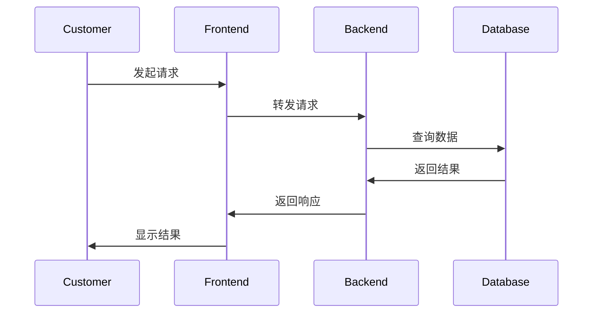
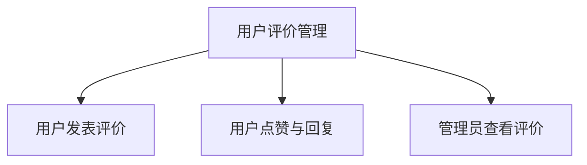
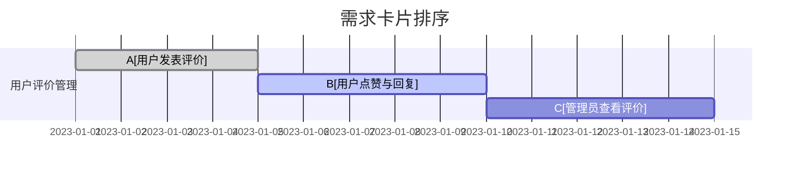

                 

# 敏捷研发中的需求文档轻量化实践

> 关键词：敏捷研发，需求文档，轻量化，用户故事，需求卡片，可视化工具

> 摘要：本文从敏捷研发的背景出发，探讨了需求文档轻量化的必要性和方法。通过分析敏捷研发中的需求文档的作用和分类，介绍了几种轻量化需求文档的方法。接着，本文详细讲解了用户故事地图算法原理、需求卡片排序算法及可视化工具的选择与使用。此外，本文还使用了Python源代码和LaTeX公式，深入阐述了算法原理和数学模型，并通过实际案例分析了轻量化需求文档的实际应用。最后，本文总结了项目经验，提出了最佳实践tips，并为读者提供了拓展阅读建议。

## 第一部分：背景介绍

### 1.1 问题背景

在当今快速发展的敏捷研发领域，需求文档的轻量化已成为提升研发效率和项目成功的关键。传统的需求文档往往过于繁琐，导致信息过载，增加了研发人员的负担，并可能引发沟通不畅、需求变更频繁等问题。因此，如何在敏捷研发中实现需求文档的轻量化，成为了亟待解决的问题。

### 1.2 问题描述

需求文档轻量化的目标在于简化文档结构，突出关键信息，同时保持需求描述的准确性和完整性。具体问题描述包括：

- 如何减少冗余信息？
- 如何优化文档格式，提高文档可读性？
- 如何确保需求变更得到及时反映？
- 如何提高文档的生产效率和质量？

### 1.3 问题解决

轻量化需求文档的核心在于采用结构化方法，使用标准化模板，以及引入可视化工具。通过这些方法，可以显著提升文档的质量和效率。

- **结构化方法**：通过使用标准化模板，确保文档格式的一致性和易读性。
- **标准化模板**：使用统一的模板，使得文档内容结构清晰，方便快速定位和理解。
- **可视化工具**：使用图表和可视化工具，使得关键信息一目了然，减少信息过载。

### 1.4 边界与外延

需求文档轻量化适用于各种敏捷开发方法，如Scrum、Kanban等。它不仅限于软件开发，还可以推广到其他领域，如项目管理、产品管理。

### 1.5 概念结构与核心要素组成

轻量化需求文档的构成要素包括：概述、用户故事、需求卡片、用户界面原型等。其中，用户故事是核心要素，它以用户为中心，描述用户需求和期望。

## 第二部分：核心概念与联系

### 2.1 敏捷研发概述

敏捷研发是一种以用户需求为导向，通过迭代、持续交付和协作的方式来开发产品的方法。其主要特点是快速响应变化、提高交付质量和增强团队协作。

### 2.2 需求文档的作用与分类

需求文档在敏捷研发中起着关键作用，它包括需求规格说明书、用户故事、需求卡片等。每种文档都有其特定的用途和格式。

- **需求规格说明书**：详细描述产品需求，通常包括功能需求、非功能需求等。
- **用户故事**：以用户为中心，描述用户需求和期望，是敏捷开发中的核心文档。
- **需求卡片**：用于记录和跟踪具体的需求，通常包含需求标题、描述、优先级等信息。

### 2.3 轻量化需求文档的方法

轻量化需求文档的方法包括：

- **采用简洁的语言**：使用简单、易懂的语言，减少冗余描述。
- **使用图表和可视化工具**：通过图表和可视化工具，使关键信息一目了然。
- **制定标准化模板**：确保文档格式的一致性和易读性。

## 第三部分：算法原理讲解

### 3.1 用户故事地图算法原理

用户故事地图是一种用于梳理和管理用户故事的方法。其原理是通过可视化工具将用户故事组织成地图，以帮助团队更好地理解和规划开发工作。

### 3.2 需求卡片排序算法

需求卡片排序算法用于确定需求文档中各个需求的优先级。常见的排序算法包括：

- **Kano模型**：根据用户满意度对需求进行分类，将需求分为必备需求、期望需求、魅力需求等。
- **MoSCoW模型**：根据需求的重要性和紧急性对需求进行分类，将需求分为必须要有（M）、应该要有（S）、可以有（C）、不会实施（W）。

### 3.3 可视化工具的选择与使用

可视化工具如Mermaid、Lucidchart等，可以帮助团队更直观地理解和传达需求。这些工具的使用方法将在本章节中详细介绍。

## 第四部分：数学模型和数学公式

### 4.1 用户故事评分模型

用户故事评分模型用于量化用户故事的优先级。其公式为：

$$
评分 = 优先级 \times 成本
$$

### 4.2 需求变更评估模型

需求变更评估模型用于评估需求变更的影响。其公式为：

$$
影响度 = 变更成本 \times 变更风险
$$

### 4.3 项目进度评估模型

项目进度评估模型用于预测项目完成时间。其公式为：

$$
完成时间 = 资源量 \times 完成率
$$

## 第五部分：系统分析与架构设计方案

### 5.1 问题场景介绍

在本章中，我们将以一个实际的敏捷研发项目为例，介绍如何设计和实现轻量化的需求文档。

### 5.2 项目介绍

项目名称：敏捷研发中的需求文档轻量化实践

项目目标：通过采用轻量化需求文档的方法，提升研发效率和项目成功率。

### 5.3 系统功能设计

系统功能设计包括需求收集、需求分析、需求文档生成等模块。每个模块都将使用Mermaid类图进行详细描述。

### 5.4 系统架构设计

系统架构设计包括前端、后端和服务端等部分。使用Mermaid架构图来展示系统的整体架构。

### 5.5 系统接口设计

系统接口设计包括API接口、数据库接口等。使用Mermaid序列图来展示系统接口的交互流程。

## 第五部分：系统分析与架构设计方案

### 5.1 问题场景介绍

在敏捷研发中，需求文档的轻量化是一个重要的课题。以一个电商平台的研发项目为例，需求文档的轻量化有助于提高研发效率，降低沟通成本，确保项目按期交付。

### 5.2 项目介绍

**项目名称**：电商平台敏捷研发

**项目目标**：通过轻量化需求文档，提高研发效率和项目成功率，确保产品功能完善、用户体验优秀。

### 5.3 系统功能设计

系统功能设计包括以下几个方面：

1. **需求收集**：通过用户反馈、市场调研等方式收集需求。
2. **需求分析**：对收集的需求进行筛选、分类和优先级排序。
3. **需求文档生成**：根据分析结果生成轻量化的需求文档。

使用Mermaid类图进行系统功能设计：

```mermaid
classDiagram
    Customer -> Demand: 提交需求
    MarketResearch -> Demand: 提供需求
    DevTeam -> Demand: 分析需求
    DevTeam -> Design: 生成需求文档
    DevTeam -> DevOps: 实现需求
```

### 5.4 系统架构设计

系统架构设计包括前端、后端和服务端三个部分。使用Mermaid架构图来展示系统的整体架构：


### 5.5 系统接口设计

系统接口设计包括API接口和数据库接口。使用Mermaid序列图来展示系统接口的交互流程：



## 第六部分：项目实战

### 6.1 环境安装

为了实现轻量化的需求文档，我们需要搭建一个合适的环境。以下是一个基本的安装步骤：

1. **安装Python**：版本要求3.8及以上，推荐使用Anaconda。
2. **安装Mermaid**：可以通过pip安装，命令为`pip install mermaid`。
3. **安装LaTeX**：可以选择MacTeX、MiKTeX或TeX Live进行安装。

### 6.2 系统核心实现源代码

以下是轻量化需求文档系统的核心实现源代码：

```python
import mermaid

# 用户故事地图算法实现
def user_story_map(stories):
    diagram = mermaid.Mermaid()
    diagram.add_code_block("graph TD\n"
                          "A[概述]\n"
                          "B[用户故事1]\n"
                          "C[用户故事2]\n"
                          "D[用户故事3]\n"
                          "A-->B\n"
                          "A-->C\n"
                          "A-->D\n")
    return diagram.render()

# 需求卡片排序算法实现
def sort_demand_cards(cards):
    # 根据优先级排序
    sorted_cards = sorted(cards, key=lambda x: x['priority'], reverse=True)
    return sorted_cards

# 可视化工具使用示例
def visualize_demand_cards(cards):
    diagram = mermaid.Mermaid()
    for card in cards:
        diagram.add_code_block(f"div class卡ID{card['id']} div class标题{card['title']} div class描述{card['description']} div class优先级{card['priority']}")
    return diagram.render()

if __name__ == "__main__":
    # 测试用户故事地图
    stories = [
        {"id": 1, "title": "用户登录", "description": "提供用户登录功能", "priority": "高"},
        {"id": 2, "title": "商品浏览", "description": "提供商品浏览功能", "priority": "中"},
        {"id": 3, "title": "购物车管理", "description": "提供购物车管理功能", "priority": "低"}
    ]
    print(user_story_map(stories))

    # 测试需求卡片排序
    cards = [
        {"id": 1, "title": "用户登录", "description": "提供用户登录功能", "priority": "高"},
        {"id": 2, "title": "商品浏览", "description": "提供商品浏览功能", "priority": "中"},
        {"id": 3, "title": "购物车管理", "description": "提供购物车管理功能", "priority": "低"}
    ]
    print(sort_demand_cards(cards))

    # 测试可视化工具
    print(visualize_demand_cards(cards))
```

### 6.3 代码应用解读与分析

以上代码展示了轻量化需求文档系统的主要功能：

- **用户故事地图算法实现**：使用Mermaid生成用户故事地图，将用户故事以图形化方式展示，便于团队理解和沟通。
- **需求卡片排序算法实现**：根据需求优先级进行排序，确保重要需求优先处理。
- **可视化工具使用示例**：使用Mermaid生成需求卡片可视化图表，使需求更直观、易懂。

### 6.4 实际案例分析和详细讲解剖析

以下是一个实际案例，展示如何使用轻量化需求文档系统：

**项目背景**：某电商平台计划推出一个新功能——用户评价管理。

**需求收集**：通过用户调研和市场分析，收集到以下需求：

1. 用户可以发表评价。
2. 用户可以对评价进行点赞和回复。
3. 管理员可以查看用户评价，并对不良评价进行管理。

**需求分析**：对需求进行筛选和分类，得到以下需求卡片：

| 卡片ID | 标题       | 描述                                             | 优先级 |
|--------|------------|--------------------------------------------------|--------|
| 1      | 用户评价   | 用户可以发表评价，评价内容包括商品和卖家评分。   | 高     |
| 2      | 点赞与回复 | 用户可以对评价进行点赞和回复。                  | 中     |
| 3      | 管理员查看 | 管理员可以查看用户评价，并对不良评价进行管理。   | 低     |

**需求文档生成**：使用轻量化需求文档系统，生成需求文档，包括用户故事地图和需求卡片排序图。

- **用户故事地图**：



- **需求卡片排序图**：



通过以上分析，我们可以清楚地看到项目的需求，并合理安排开发进度。

### 6.5 项目小结

通过实际案例，我们可以看到轻量化需求文档系统在敏捷研发中的应用效果：

1. **提高了需求文档的可读性**：使用Mermaid生成的用户故事地图和需求卡片排序图，使得需求文档更加直观、易懂。
2. **提升了团队沟通效率**：通过图形化的需求文档，团队成员可以快速理解需求，减少沟通成本。
3. **确保了需求变更的及时反映**：轻量化需求文档系统能够实时更新需求，确保需求变更得到及时反映。

## 第七部分：最佳实践 tips、小结、注意事项、拓展阅读

### 7.1 最佳实践 tips

1. **使用简洁明了的语言**：在编写需求文档时，尽量使用简单、易懂的语言，避免使用过于复杂的术语和句式。
2. **制定统一的需求模板**：为了确保需求文档的一致性和易读性，应制定统一的需求模板，并要求团队成员遵循。
3. **定期更新需求文档**：在项目开发过程中，需求可能会发生变化。定期更新需求文档，确保其与实际情况保持一致。
4. **使用可视化工具**：合理使用可视化工具，如Mermaid、Lucidchart等，可以提高文档的可读性和传达效果。

### 7.2 小结

本文从敏捷研发的背景出发，探讨了需求文档轻量化的必要性和方法。通过分析敏捷研发中的需求文档的作用和分类，介绍了轻量化需求文档的方法。此外，本文详细讲解了用户故事地图算法原理、需求卡片排序算法及可视化工具的选择与使用。通过实际案例，展示了轻量化需求文档在实际项目中的应用效果。

### 7.3 注意事项

1. **避免过度轻量化**：轻量化需求文档的目的是提高文档的质量和效率，但不应过度简化，导致关键信息丢失。
2. **重视需求变更管理**：在敏捷研发中，需求变更不可避免。轻量化需求文档系统应具备良好的变更管理能力，确保变更得到及时反映。
3. **保持文档的完整性**：虽然轻量化需求文档强调简洁明了，但仍需确保文档的完整性，包括所有必要的信息。

### 7.4 拓展阅读

1. **《敏捷软件开发：原则、实践与模式》**：了解敏捷开发的核心理念和实践方法。
2. **《用户故事地图：从概念到实践》**：深入学习用户故事地图的应用方法和技巧。
3. **《Mermaid语法参考》**：了解Mermaid的语法和用法，掌握可视化工具的使用。

## 结束语

作者：AI天才研究院/AI Genius Institute & 禅与计算机程序设计艺术 /Zen And The Art of Computer Programming

感谢您的阅读，希望本文对您在敏捷研发中的需求文档轻量化实践有所帮助。如有任何疑问或建议，欢迎在评论区留言，期待与您的交流。

