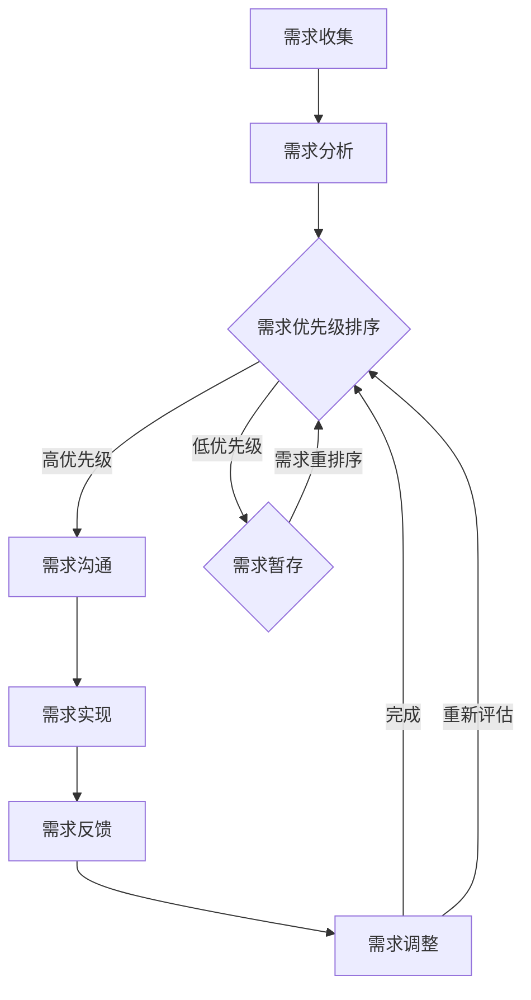
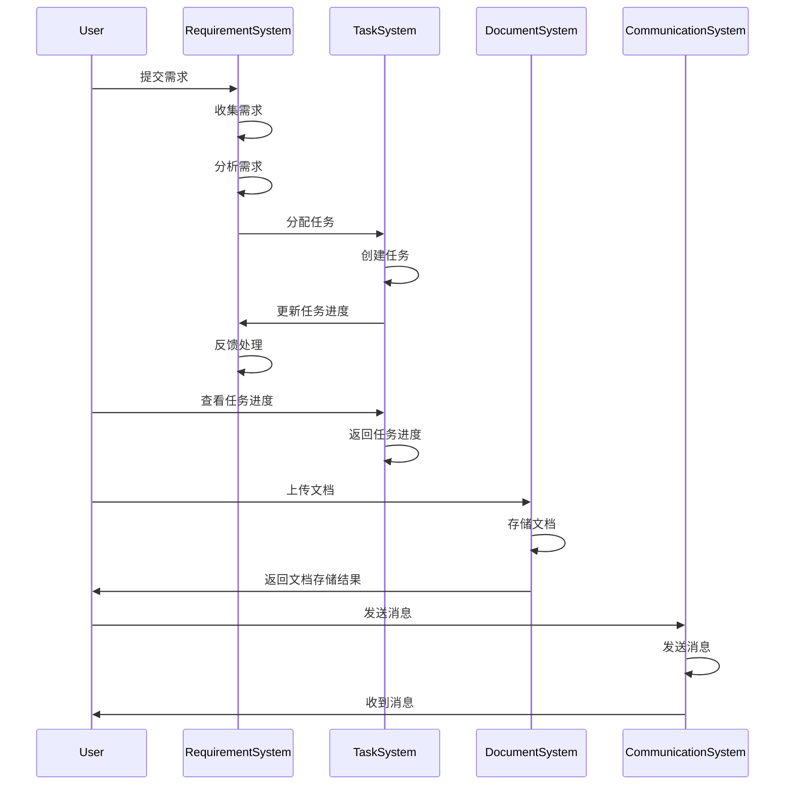

                 

### 第一部分：敏捷研发与需求沟通反馈机制概述

#### 1. 背景介绍

敏捷研发（Agile Development）是一种以人为核心、迭代、渐进的方法论，旨在通过快速响应变化来提高软件开发过程的灵活性和效率。敏捷研发起源于20世纪90年代，其核心理念包括：个体和互动重于过程与工具、可工作的软件重于详尽的文档、客户合作重于合同谈判、响应变化重于遵循计划。敏捷研发的流行主要是因为其能够更好地适应快速变化的商业需求和技术环境。

在敏捷研发过程中，需求沟通反馈机制（Requirement Communication and Feedback Mechanism）是至关重要的。需求沟通是指开发团队与产品所有者、客户、用户等利益相关者之间的信息交流，以确保项目目标的一致性和理解。而反馈机制则是用于收集、处理和回应这些需求信息，以不断优化产品设计和开发过程。

需求沟通反馈机制的设计和实施，对于敏捷研发的成败有着决定性的影响。良好的需求沟通反馈机制能够确保以下几点：

- **提高需求理解的一致性**：通过有效的沟通，减少误解和歧义，确保所有参与方对项目目标有共同的理解。
- **促进跨职能团队协作**：通过实时的反馈，使团队成员能够快速调整工作计划和策略，提高团队的协作效率。
- **快速响应变化**：敏捷研发的核心在于应对变化，良好的反馈机制能够使团队能够及时发现并应对变化，保持项目的敏捷性。
- **提高产品质量**：通过持续的反馈和改进，能够确保产品始终符合用户需求，提高产品的质量和用户满意度。

本文将深入探讨敏捷研发中的需求沟通反馈机制设计，旨在为开发者、项目经理和其他利益相关者提供实用的指导和建议。

#### 2. 核心概念

##### 需求沟通反馈机制

需求沟通反馈机制是指在整个敏捷研发过程中，用于收集、处理和回应需求信息的系统和方法。它包括以下几个关键组成部分：

1. **需求收集**：通过调研、访谈、问卷调查等方式，从产品所有者、客户、用户等利益相关者获取需求信息。
2. **需求分析**：对收集到的需求信息进行整理、分类和分析，明确需求的优先级、范围和可行性。
3. **需求沟通**：通过会议、文档、演示等方式，将需求分析结果传达给开发团队和其他利益相关者，确保信息的一致性。
4. **需求反馈**：在开发过程中，持续收集用户反馈，评估需求实现的效果，并根据反馈进行必要的调整和优化。
5. **持续改进**：基于反馈结果，不断优化需求收集、分析和反馈的过程，提高整个敏捷研发的效率和质量。

##### 敏捷研发

敏捷研发是一种以人为核心、迭代、渐进的软件开发方法论，强调快速响应变化、持续交付价值和高效团队合作。其核心原则包括：

- **个体和互动重于过程与工具**：重视团队成员的沟通和协作，认为人是软件开发的核心。
- **可工作的软件重于详尽的文档**：软件的实际可用性比详细的文档更重要。
- **客户合作重于合同谈判**：与客户的密切合作有助于更好地理解需求，提高产品的市场适应性。
- **响应变化重于遵循计划**：灵活应对变化，以快速适应市场和用户需求。

##### 需求沟通反馈机制与敏捷研发的关系

需求沟通反馈机制是敏捷研发的重要组成部分，它为敏捷研发的持续迭代和优化提供了保障。具体而言，需求沟通反馈机制在以下几个方面支持敏捷研发：

- **确保需求一致性**：通过持续的沟通和反馈，确保开发团队和其他利益相关者对需求有共同的理解，减少误解和歧义。
- **促进敏捷迭代**：通过快速响应需求变化，团队能够持续调整和优化产品设计和开发过程，保持敏捷性。
- **提高产品质量**：通过持续的反馈和改进，确保产品始终符合用户需求，提高产品的质量和用户满意度。
- **增强团队协作**：通过实时的反馈，使团队成员能够更好地协作，提高团队的整体效率。

总之，需求沟通反馈机制是敏捷研发成功的关键因素之一，它不仅能够提高开发效率，还能够确保产品的市场适应性和用户满意度。

### 第二部分：需求沟通反馈机制的核心概念与联系

在深入探讨需求沟通反馈机制之前，我们需要理解其核心概念和原理，以及它与敏捷研发的关系。以下是需求沟通反馈机制的基本要素和理论依据。

#### 1. 概念原理

##### 需求收集

需求收集是需求沟通反馈机制的第一步，它涉及到如何从产品所有者、客户、用户等利益相关者获取需求信息。有效的需求收集需要采用多种方法，如用户调研、访谈、问卷调查、用户故事地图等。需求收集的关键在于确保信息的全面性和准确性。

**用户调研**：通过实地观察、参与用户的工作流程，了解用户的实际需求和使用场景。这有助于获取真实的需求，避免假设和猜测。

**访谈**：与用户、产品所有者和其他利益相关者进行一对一或小组访谈，深入了解他们的需求和期望。访谈的好处是能够获取深入和详细的见解。

**问卷调查**：通过设计问卷收集大量用户的数据，适用于大规模用户群体的需求调研。问卷的设计需要确保问题清晰、易于理解，以提高数据质量。

##### 需求分析

需求分析是对收集到的需求信息进行整理、分类和分析的过程。其目的是明确需求的优先级、范围和可行性，以便在有限的资源下优先处理最重要的需求。

**需求优先级排序**：根据需求的紧急性、重要性和可实现性，对需求进行排序。常用的排序方法包括MoSCoW方法（必须的、重要的、可以延迟的、愿望的）。

**需求范围定义**：明确需求的具体内容、边界和预期成果，以避免需求范围的蔓延和模糊性。

**需求可行性分析**：评估每个需求的可行性，包括技术、资源、时间和成本等方面。这有助于确定哪些需求可以立即实现，哪些需要延迟或放弃。

##### 需求沟通

需求沟通是将需求分析的结果传达给开发团队和其他利益相关者的过程。有效的需求沟通需要确保信息的一致性和透明性，以便所有参与者都能够对需求有共同的理解。

**会议**：通过定期的需求评审会议，讨论和确认需求。会议的形式可以是一对一、小组讨论或全员会议，根据需求和团队规模来选择。

**文档**：编写清晰的需求文档，包括需求描述、用户故事、验收标准等。文档应尽量简洁、直观，以便团队成员和其他利益相关者能够快速理解。

**演示**：通过原型演示、演示文稿或视频等形式，向用户展示需求的具体实现方式。这有助于用户理解需求，并提出反馈和改进建议。

##### 需求反馈

需求反馈是在开发过程中，持续收集用户和利益相关者的反馈，并据此调整和优化需求的过程。需求反馈是敏捷研发中不可或缺的一环，它能够帮助团队及时发现和解决问题，确保产品的最终质量。

**用户反馈**：通过与用户的直接交流，收集他们对产品的使用体验、功能和性能等方面的反馈。用户反馈可以通过调查问卷、用户访谈、社交媒体等方式进行。

**内部反馈**：开发团队内部成员之间的反馈也非常重要。通过代码评审、技术讨论等方式，团队成员可以互相学习、分享经验和发现潜在的问题。

**持续反馈**：需求反馈应该是一个持续的过程，而不是一次性的活动。通过定期的反馈会议、评审和迭代，团队可以持续优化需求，确保产品的持续改进。

##### 持续改进

持续改进是需求沟通反馈机制的核心原则之一，它强调不断优化需求和开发过程，以适应不断变化的环境。

**过程优化**：通过收集和分析反馈数据，发现过程中的瓶颈和不足，并采取相应的措施进行优化。这包括改进沟通方式、优化工作流程、提高团队协作效率等。

**需求优化**：根据反馈结果，调整和优化需求。这可能包括重新评估需求的优先级、修改需求的具体内容、增加或删除某些功能等。

**技术改进**：基于用户反馈和市场需求，不断改进产品的技术实现。这可能包括优化代码结构、改进性能、提升用户体验等。

#### 2. 概念属性特征对比表格

为了更好地理解需求沟通反馈机制，我们可以将其与其他常见的沟通机制进行比较。以下是一个简化的对比表格：

| 沟通机制          | 需求沟通反馈机制           | 用户调研   | 需求分析   | 需求沟通   | 需求反馈   | 持续改进   |
|-----------------|-----------------------|----------|----------|----------|----------|----------|
| 定义            | 收集、处理和回应需求信息的系统 | 调研      | 分析      | 沟通      | 反馈      | 优化      |
| 核心特点          | 强调持续性和迭代性        | 用户参与   | 数据驱动   | 信息一致性 | 及时响应   | 持续优化   |
| 适用场景          | 敏捷研发、复杂项目         | 大规模用户 | 多样化需求 | 团队协作   | 快速响应   | 项目生命周期 |
| 挑战与难点         | 确保信息的一致性和透明性    | 用户参与度   | 需求变动   | 沟通成本   | 反馈滞后   | 持续改进的压力 |
| 对项目的影响         | 提高项目成功率、质量、用户满意度 | 了解用户需求 | 优化产品设计 | 促进协作   | 确保需求实现 | 提升团队能力   |

#### 3. ER实体关系图架构

为了更直观地展示需求沟通反馈机制中的不同实体之间的关系，我们可以使用Mermaid绘制一个简单的ER（实体关系）图。以下是该图的结构和内容：

```mermaid
erDiagram
  Product -->|需求收集| User
  User -->|反馈| Product
  Product -->|需求分析| Developer
  Developer -->|需求沟通| User
  Developer -->|代码实现| Product
  Product -->|测试| Tester
  Tester -->|测试反馈| Developer
```

在这个ER图中，不同的实体（如Product、User、Developer、Tester）通过需求收集、反馈、分析、沟通、代码实现和测试等过程相互关联。例如，Product实体通过需求收集从User获取需求，再通过需求分析转化为可执行的任务，最终通过开发（Developer）和测试（Tester）环节实现并验证。

通过这个ER图，我们可以清晰地看到需求沟通反馈机制中的信息流动和交互过程，有助于更好地理解和设计该机制。

### 第三部分：需求沟通反馈机制的算法原理讲解

在深入探讨需求沟通反馈机制的设计和实现之前，我们需要理解其背后的算法原理。本部分将详细讲解需求沟通反馈算法的流程、实现、数学模型和公式，并通过实际案例进行举例说明。

#### 1. 算法流程图

为了更好地理解需求沟通反馈算法的工作流程，我们可以使用Mermaid绘制一个简化的算法流程图。以下是该流程图的详细结构和内容：



在这个流程图中，各个节点代表需求沟通反馈机制中的关键步骤，包括需求收集、需求分析、需求优先级排序、需求沟通、需求实现、需求反馈和需求调整。以下是每个步骤的详细解释：

1. **需求收集**（A）：通过用户调研、访谈、问卷调查等方式，从产品所有者、客户、用户等利益相关者获取需求信息。
2. **需求分析**（B）：对收集到的需求信息进行整理、分类和分析，明确需求的优先级、范围和可行性。
3. **需求优先级排序**（C）：根据需求的紧急性、重要性和可实现性，对需求进行排序，确定高优先级和低优先级需求。
4. **需求沟通**（D）：将需求分析的结果传达给开发团队和其他利益相关者，确保信息的一致性。
5. **需求实现**（F）：根据需求优先级，开发团队开始实施需求，并将其转化为可工作的软件。
6. **需求反馈**（G）：在需求实现过程中，持续收集用户和利益相关者的反馈，评估需求实现的效果。
7. **需求调整**（H）：根据反馈结果，对需求进行调整和优化，确保需求能够满足用户需求。

#### 2. Python源代码

为了演示需求沟通反馈算法的实现，我们可以使用Python编写一个简单的模拟程序。以下是一个简化的Python代码示例：

```python
import random

# 需求类
class Requirement:
    def __init__(self, id, description, priority):
        self.id = id
        self.description = description
        self.priority = priority

# 需求收集
def collect_requirements():
    requirements = []
    requirements.append(Requirement(1, "增加用户登录功能", "高"))
    requirements.append(Requirement(2, "优化产品性能", "中"))
    requirements.append(Requirement(3, "改进用户界面", "低"))
    return requirements

# 需求分析
def analyze_requirements(requirements):
    return sorted(requirements, key=lambda x: x.priority, reverse=True)

# 需求实现
def implement_requirements(requirements):
    implemented_requirements = []
    for req in requirements:
        # 模拟实现过程，这里使用随机时间表示实现耗时
        implement_time = random.randint(1, 3)
        print(f"实现需求 {req.id}: {req.description}（预计耗时 {implement_time} 天）")
        implemented_requirements.append(req)
    return implemented_requirements

# 需求反馈
def get_feedback(requirements):
    feedback = []
    for req in requirements:
        feedback.append(random.choice(["满意", "一般", "不满意"]))
    return feedback

# 主程序
def main():
    # 收集需求
    requirements = collect_requirements()
    
    # 分析需求
    analyzed_requirements = analyze_requirements(requirements)
    print("分析后的需求优先级：")
    for req in analyzed_requirements:
        print(f"需求 {req.id}: {req.description}（优先级：{req.priority}）")
    
    # 实现需求
    implemented_requirements = implement_requirements(analyzed_requirements)
    
    # 收集反馈
    feedback = get_feedback(implemented_requirements)
    print("需求实现后的反馈：")
    for req, fedback in zip(analyzed_requirements, feedback):
        print(f"需求 {req.id}: {req.description}（反馈：{feedback}）")

    # 调整需求
    adjust_requirements(analyzed_requirements, feedback)

# 调整需求
def adjust_requirements(requirements, feedback):
    for i, (req, fedback) in enumerate(zip(requirements, feedback)):
        if fedback == "不满意":
            requirements[i].priority = "中" if requirements[i].priority == "高" else "低"
            print(f"需求 {req.id}: {req.description}（优先级调整：{requirements[i].priority}）")
        else:
            print(f"需求 {req.id}: {req.description}（无需调整）")

if __name__ == "__main__":
    main()
```

在这个示例中，我们首先定义了一个`Requirement`类，用于表示需求的基本信息。然后，我们编写了`collect_requirements`函数来模拟需求收集过程，`analyze_requirements`函数用于需求分析，`implement_requirements`函数用于模拟需求实现过程，`get_feedback`函数用于模拟需求实现后的反馈收集。最后，`main`函数将这些函数串联起来，形成一个完整的需求沟通反馈流程。

#### 3. 算法原理的数学模型和公式

需求沟通反馈算法背后的数学模型和公式主要用于需求优先级的排序和调整。以下是一些基本的数学模型和公式：

1. **优先级排序公式**：

   优先级排序通常使用一种称为MoSCoW方法的模型，它将需求分为四类：必须的（Mandatory）、重要的（Important）、可以延迟的（Conditional）和愿望的（Wishlist）。我们可以使用以下公式对需求进行排序：

   $$ P_i = \sum_{j=Mandatory}^{Wishlist} w_j \times p_{ij} $$

   其中，$P_i$表示需求$i$的优先级，$w_j$表示类别$j$的权重，$p_{ij}$表示需求$i$属于类别$j$的概率。

2. **需求调整公式**：

   当需求实现后的反馈为“不满意”时，我们需要对需求进行重新调整。调整公式可以表示为：

   $$ P_i' = P_i - \delta $$

   其中，$P_i'$表示调整后的优先级，$P_i$表示原始优先级，$\delta$是一个调整系数，用于表示优先级的降低程度。通常，$\delta$可以根据具体的业务规则进行调整。

#### 4. 举例说明

为了更好地理解需求沟通反馈算法的原理和应用，我们可以通过一个实际案例进行说明。

假设我们有一个新产品开发项目，项目组收集到了以下三个需求：

1. **需求1**：增加用户登录功能，确保用户能够安全地访问系统。
2. **需求2**：优化产品性能，提高系统的响应速度和稳定性。
3. **需求3**：改进用户界面，提升用户体验。

项目组首先使用MoSCoW方法对这些需求进行优先级排序。假设必须的权重为3，重要的权重为2，可以延迟的权重为1，愿望的权重为0。根据这个权重，我们可以计算出每个需求的优先级：

$$ P_1 = 3 \times p_{11} + 2 \times p_{12} + 1 \times p_{13} + 0 \times p_{14} $$
$$ P_2 = 3 \times p_{21} + 2 \times p_{22} + 1 \times p_{23} + 0 \times p_{24} $$
$$ P_3 = 3 \times p_{31} + 2 \times p_{32} + 1 \times p_{33} + 0 \times p_{34} $$

假设需求1和需求2被划分为必须的，需求3被划分为愿望的，那么我们可以计算出每个需求的优先级：

$$ P_1 = 3 \times (1 + 1 + 0 + 0) = 6 $$
$$ P_2 = 3 \times (1 + 0 + 0 + 0) = 3 $$
$$ P_3 = 3 \times (0 + 0 + 1 + 0) = 0 $$

因此，需求的优先级排序为：需求1 > 需求2 > 需求3。

接下来，项目组开始实施这些需求。在需求实现后，项目组收集了用户的反馈。假设用户对需求1和需求2的反馈为“满意”，对需求3的反馈为“不满意”。根据需求调整公式，我们需要对需求3的优先级进行调整：

$$ P_3' = P_3 - \delta $$

由于需求3的原始优先级为0，我们可以将$\delta$设置为1，表示将需求3的优先级调整为可以延迟的。因此，调整后的需求优先级为：

$$ P_3' = 0 - 1 = -1 $$

这意味着需求3的优先级调整为愿望的。经过调整后，新的需求优先级排序为：需求1 > 需求2 > 需求3。

通过这个案例，我们可以看到需求沟通反馈算法在优先级排序和调整中的应用。该算法能够帮助项目组根据用户的反馈及时调整需求，确保产品的最终质量和用户满意度。

### 第四部分：需求沟通反馈机制的系统分析与架构设计方案

在了解了需求沟通反馈机制的核心概念和算法原理之后，本部分将深入探讨如何在实际项目中应用这些概念和原理，并设计一个有效的系统架构方案。

#### 1. 问题场景介绍

假设我们正在开发一款企业级协作工具，该工具需要支持多团队协作、任务管理、文档共享等功能。在这个项目中，需求沟通反馈机制至关重要，因为团队的需求不断变化，并且需要对变化进行快速响应。具体问题场景包括：

- **需求多变**：业务部门的需求频繁变化，需要快速调整和响应。
- **团队协作**：涉及多个部门和专业领域的协作，需要高效的需求沟通和协调。
- **用户反馈**：需要收集用户的实际使用体验，及时调整和优化产品功能。

为了解决这些问题，我们需要设计一个灵活、高效的需求沟通反馈系统，确保团队能够快速响应需求变化，提高产品的质量和用户满意度。

#### 2. 项目介绍

为了更好地阐述需求沟通反馈机制的应用，我们以一个实际项目为例进行介绍。该项目是一个企业级协作工具，名为“智能协作平台”。该平台的主要功能包括：

- **用户管理**：支持多用户注册和管理，包括角色分配和权限控制。
- **任务管理**：支持任务创建、分配、跟踪和进度更新。
- **文档共享**：支持文档上传、下载和版本控制。
- **实时通信**：支持即时消息、会议和视频通话。

在这个项目中，需求沟通反馈机制将贯穿整个开发周期，包括需求收集、需求分析、需求沟通、需求反馈和持续改进等环节。

#### 3. 系统功能设计

为了实现需求沟通反馈机制，我们需要设计一系列核心功能，包括需求收集、需求分析、需求沟通、需求反馈和持续改进。以下是这些功能的具体设计：

**需求收集**

- **用户调研**：通过问卷调查、用户访谈等方式，收集用户的需求和意见。
- **市场分析**：分析行业趋势和竞争对手的产品功能，获取市场需求。
- **内部沟通**：与业务部门和产品团队进行定期沟通，了解他们的需求和建议。

**需求分析**

- **需求分类**：对收集到的需求进行分类和优先级排序，明确需求的范围和可行性。
- **需求建模**：使用用户故事地图、用例图等方法，对需求进行详细建模和描述。
- **需求评审**：组织需求评审会议，对需求进行分析和讨论，确保需求的一致性和可行性。

**需求沟通**

- **需求文档**：编写清晰、简洁的需求文档，包括需求描述、用户故事、验收标准等。
- **需求演示**：通过原型演示、演示文稿等方式，向开发团队和利益相关者展示需求。
- **会议沟通**：定期组织需求沟通会议，确保团队对需求有共同的理解。

**需求反馈**

- **用户反馈**：通过在线调查、用户访谈等方式，收集用户对产品功能的反馈。
- **内部反馈**：开发团队和测试团队之间的反馈，确保需求的正确实现和验证。
- **反馈处理**：对用户反馈进行分类和处理，及时调整和优化产品功能。

**持续改进**

- **过程优化**：根据反馈结果，优化需求收集、分析和反馈的过程，提高效率和质量。
- **需求迭代**：持续收集和响应用户需求，不断迭代和优化产品功能。
- **团队协作**：加强团队内部协作，提高沟通效率和响应速度。

#### 4. 系统架构设计

为了实现上述功能，我们需要设计一个灵活、可扩展的系统架构。以下是该项目的系统架构设计：


**系统架构设计**

- **用户管理模块**：负责用户注册、登录、权限控制等功能。
- **需求管理模块**：负责需求收集、分析、沟通、反馈和持续改进等功能。
- **任务管理模块**：负责任务创建、分配、跟踪和进度更新等功能。
- **文档共享模块**：负责文档上传、下载、版本控制等功能。
- **实时通信模块**：负责即时消息、会议和视频通话等功能。
- **数据存储模块**：负责存储用户数据、需求信息、任务数据和文档数据等。

**系统接口设计**

- **用户管理接口**：提供用户注册、登录、权限查询等接口。
- **需求管理接口**：提供需求收集、分析、沟通、反馈和持续改进等接口。
- **任务管理接口**：提供任务创建、分配、跟踪和进度更新等接口。
- **文档共享接口**：提供文档上传、下载、版本控制等接口。
- **实时通信接口**：提供即时消息、会议和视频通话等接口。

**系统交互序列图**

为了更好地展示系统内部各模块之间的交互过程，我们可以使用Mermaid绘制一个系统交互序列图。以下是该序列图的详细结构和内容：



在这个序列图中，用户与系统各模块之间通过接口进行交互，实现需求收集、任务管理、文档共享和实时通信等功能。通过这个序列图，我们可以清晰地看到系统内部各模块之间的交互过程和数据流动。

### 第五部分：需求沟通反馈机制的项目实战

在前几部分中，我们详细介绍了需求沟通反馈机制的理论基础和系统架构设计。本部分将通过一个实际项目案例，展示如何在实际开发过程中应用需求沟通反馈机制，并分析其中的关键点和经验教训。

#### 1. 环境安装与工具配置

在进行项目实战之前，我们需要确保开发环境的安装和配置。以下是项目所需的开发环境和工具：

- **操作系统**：Linux（推荐Ubuntu 20.04）
- **编程语言**：Python 3.8+
- **数据库**：MySQL 5.7+
- **版本控制**：Git
- **项目管理工具**：Jira
- **集成开发环境**：PyCharm

在安装上述工具和软件之前，请确保已经安装了必要的操作系统和Python环境。以下是安装和配置的步骤：

1. **安装Linux操作系统**：下载并安装Ubuntu 20.04操作系统。
2. **安装Python**：打开终端，运行以下命令安装Python 3.8：
   ```bash
   sudo apt update
   sudo apt install python3.8
   ```
3. **安装MySQL**：打开终端，运行以下命令安装MySQL：
   ```bash
   sudo apt install mysql-server
   ```
4. **安装Git**：打开终端，运行以下命令安装Git：
   ```bash
   sudo apt install git
   ```
5. **安装Jira**：在[Atlassian官网](https://www.atlassian.com/software/jira/downloads)下载Jira安装包，并按照安装向导进行安装。
6. **安装PyCharm**：在[JetBrains官网](https://www.jetbrains.com/pycharm/download/)下载PyCharm社区版，并按照安装向导进行安装。

完成上述步骤后，我们就可以开始项目开发了。

#### 2. 系统核心实现源代码

以下是系统核心实现的部分源代码。为了保持代码的简洁性，我们只展示了需求管理模块的核心代码。

**需求管理模块**：

```python
# 需求管理模块
class RequirementManagement:
    def __init__(self):
        self.requirements = []

    def add_requirement(self, requirement):
        self.requirements.append(requirement)

    def get_requirement(self, requirement_id):
        for requirement in self.requirements:
            if requirement.id == requirement_id:
                return requirement
        return None

    def update_requirement(self, requirement_id, new_requirement):
        requirement = self.get_requirement(requirement_id)
        if requirement:
            requirement.description = new_requirement.description
            requirement.priority = new_requirement.priority

    def delete_requirement(self, requirement_id):
        requirement = self.get_requirement(requirement_id)
        if requirement:
            self.requirements.remove(requirement)

    def list_requirements(self):
        for requirement in self.requirements:
            print(f"ID: {requirement.id}, Description: {requirement.description}, Priority: {requirement.priority}")
```

**需求类**：

```python
# 需求类
class Requirement:
    def __init__(self, id, description, priority):
        self.id = id
        self.description = description
        self.priority = priority
```

**测试代码**：

```python
# 测试需求管理模块
requirement_management = RequirementManagement()

# 添加需求
requirement_management.add_requirement(Requirement(1, "增加用户登录功能", "高"))
requirement_management.add_requirement(Requirement(2, "优化产品性能", "中"))
requirement_management.add_requirement(Requirement(3, "改进用户界面", "低"))

# 列出所有需求
requirement_management.list_requirements()

# 更新需求
requirement_management.update_requirement(2, Requirement(2, "优化产品性能", "高"))

# 再次列出所有需求
requirement_management.list_requirements()

# 删除需求
requirement_management.delete_requirement(3)

# 再次列出所有需求
requirement_management.list_requirements()
```

通过上述代码，我们可以实现需求管理模块的基本功能，包括添加、获取、更新和删除需求等操作。

#### 3. 代码应用解读与分析

在实现需求管理模块时，我们使用了一个`RequirementManagement`类，该类包含了添加、获取、更新和删除需求的方法。这些方法实现了对需求的基本操作，确保了需求数据的完整性和一致性。

**解读与分析**：

1. **需求类（Requirement）**：
   - `id`：需求的唯一标识符，用于区分不同的需求。
   - `description`：需求的具体描述，包括需求的名称、功能和目的。
   - `priority`：需求的优先级，用于确定需求的紧急性和重要性。

2. **需求管理类（RequirementManagement）**：
   - `add_requirement`：添加一个新的需求到需求列表中。
   - `get_requirement`：根据需求ID获取特定的需求对象。
   - `update_requirement`：更新特定需求对象的信息。
   - `delete_requirement`：从需求列表中删除特定的需求对象。
   - `list_requirements`：列出所有需求对象的信息。

通过这些方法，我们可以实现对需求数据的全面管理，确保需求在系统中的正确处理和存储。

#### 4. 实际案例分析和详细讲解剖析

为了更好地理解需求沟通反馈机制在实际项目中的应用，我们以一个实际案例进行详细分析。以下是一个简化的案例，展示如何通过需求沟通反馈机制实现产品功能的迭代和优化。

**案例背景**：

假设我们正在开发一款在线教育平台，用户可以在线学习课程、参加考试和互动讨论。在项目开发初期，我们收集到了以下三个主要需求：

1. **需求1**：提供课程视频播放功能，支持在线学习。
2. **需求2**：提供在线考试功能，支持多种题型和考试模式。
3. **需求3**：提供用户互动讨论区，支持留言和实时聊天。

**开发过程**：

1. **需求收集**：
   - 通过用户调研和访谈，我们收集到了上述三个需求。
   - 同时，业务部门提出了增加课程评论功能和改进用户界面等建议。

2. **需求分析**：
   - 根据需求的紧急性和重要性，我们对需求进行了排序和分类。需求1和需求2被划分为必须实现的优先级，需求3被划分为可以延迟实现的优先级。
   - 我们使用用户故事地图和用例图对需求进行了详细建模和描述。

3. **需求沟通**：
   - 通过需求评审会议，我们与开发团队和业务部门共同讨论和确认了需求。
   - 我们编写了清晰的需求文档，包括需求描述、用户故事和验收标准。

4. **需求实现**：
   - 开发团队开始实施需求1和需求2，并确保其按照需求文档的要求实现。
   - 在开发过程中，我们定期进行代码评审和测试，确保代码质量和功能完整性。

5. **需求反馈**：
   - 在需求实现后，我们向用户发布了部分功能，并收集了他们的反馈。
   - 用户反馈显示，课程评论功能和用户界面改进受到了用户欢迎，而在线考试功能的用户体验有待优化。

6. **需求调整**：
   - 根据用户反馈，我们对在线考试功能进行了调整和优化，包括增加考试倒计时、改进考试界面等。
   - 我们还决定将需求3（用户互动讨论区）提前实现，以提高用户活跃度和互动体验。

7. **持续改进**：
   - 在后续开发中，我们继续关注用户反馈，并根据反馈结果调整和优化产品功能。
   - 我们定期组织需求评审会议，确保团队能够及时响应需求变化，并持续改进产品。

**总结与反思**：

通过这个案例，我们可以看到需求沟通反馈机制在实际项目中的应用效果。需求沟通反馈机制确保了团队能够及时响应需求变化，提高产品的质量和用户满意度。以下是该案例的关键点和经验教训：

1. **及时响应需求变化**：需求沟通反馈机制使团队能够快速响应需求变化，确保产品始终符合用户需求。
2. **用户参与**：用户参与需求收集和反馈过程，有助于提高产品的市场适应性和用户满意度。
3. **定期评审**：定期进行需求评审和反馈，有助于确保需求的一致性和可行性，减少误解和歧义。
4. **持续改进**：持续改进是需求沟通反馈机制的核心原则，它有助于提高团队协作效率和产品开发质量。
5. **优化流程**：通过不断优化需求收集、分析和反馈的过程，团队能够提高工作效率，减少开发风险。

总之，需求沟通反馈机制是敏捷研发中不可或缺的一环，它为团队提供了有效的工具和方法，确保产品能够快速适应市场和用户需求。

#### 5. 项目小结

在本项目中，我们通过需求沟通反馈机制实现了对在线教育平台的功能迭代和优化。以下是项目的主要成果和经验教训：

1. **成果**：
   - 实现了课程视频播放、在线考试和用户互动讨论等功能。
   - 通过用户反馈，对在线考试功能进行了优化，提高了用户体验。
   - 定期进行需求评审和反馈，确保了需求的一致性和可行性。

2. **经验教训**：
   - 需求沟通反馈机制有助于及时响应需求变化，提高产品的市场适应性和用户满意度。
   - 用户参与需求收集和反馈过程，有助于提高产品的质量和市场竞争力。
   - 定期进行需求评审和反馈，有助于确保团队能够持续改进产品，提高开发效率。
   - 通过持续优化需求收集、分析和反馈的过程，团队能够减少开发风险，提高产品质量。

总之，需求沟通反馈机制在敏捷研发中具有重要意义，它为团队提供了有效的工具和方法，确保产品能够快速适应市场和用户需求。通过不断优化和完善需求沟通反馈机制，团队能够提高产品的质量和市场竞争力。

### 第六部分：最佳实践与拓展

#### 1. 最佳实践 tips

为了在实际项目中有效地应用需求沟通反馈机制，以下是一些最佳实践建议：

- **明确沟通目标**：在每次需求沟通之前，明确沟通的目标和预期结果，确保所有参与者都对沟通的内容和目标有共同的理解。
- **使用清晰的语言**：在编写需求文档和进行沟通时，使用简单明了的语言，避免使用专业术语和模糊的描述，以提高信息传递的准确性。
- **定期进行需求评审**：定期组织需求评审会议，确保团队对需求的一致性和可行性有共同的认识，及时发现和解决潜在的问题。
- **鼓励用户参与**：在需求收集和反馈过程中，积极鼓励用户参与，收集他们的意见和建议，以提高产品的市场适应性和用户满意度。
- **建立反馈机制**：建立有效的反馈机制，确保用户和利益相关者的反馈能够及时传递给开发团队，并根据反馈结果进行相应的调整和优化。
- **持续改进流程**：不断优化需求收集、分析和反馈的过程，提高团队的工作效率和质量。

#### 2. 小结

本文详细探讨了敏捷研发中的需求沟通反馈机制设计。通过阐述需求沟通反馈机制的核心概念、原理和算法，结合实际项目案例，我们展示了如何在实际开发过程中应用这一机制，以提高产品的质量和用户满意度。

需求沟通反馈机制在敏捷研发中至关重要，它确保了团队能够及时响应需求变化，提高沟通效率，优化产品设计和开发过程。通过明确沟通目标、使用清晰的语言、定期进行需求评审、鼓励用户参与、建立反馈机制和持续改进流程，团队可以更好地实现需求沟通反馈机制的最佳效果。

#### 3. 注意事项

在实际应用需求沟通反馈机制时，需要注意以下几点：

- **确保信息的一致性**：在沟通过程中，要确保信息的一致性和透明性，避免因信息不对称导致误解和冲突。
- **平衡需求与资源**：在处理需求时，要平衡需求的紧急性、重要性和资源的有限性，确保团队能够在有限资源下优先处理最重要的需求。
- **尊重用户反馈**：用户反馈是需求沟通反馈机制的重要组成部分，要尊重用户的意见和建议，及时进行反馈和处理。
- **避免需求蔓延**：在需求分析和实现过程中，要避免需求范围的蔓延和模糊性，确保需求的明确性和可行性。

#### 4. 拓展阅读

对于希望深入了解需求沟通反馈机制和实践的读者，以下是一些推荐的拓展阅读材料：

- 《敏捷软件开发：原则、实践与模式》（Agile Software Development: Principles, Patterns, and Practices）by Robert C. Martin
- 《用户故事地图：引导需求和实践敏捷开发》（User Story Mapping: Discover the Whole, Join the Dots, and Delight Your Customers）by Jeff Patton
- 《敏捷实践指南》（The Agile Practice Guide）by Mark C. Layton and Michael V. Smith
- 《敏捷项目管理：实践指南》（Agile Project Management: Creating Innovative Products）by Jim Highsmith

这些书籍和资料提供了丰富的理论和实践经验，有助于读者进一步了解敏捷研发和需求沟通反馈机制的设计与实施。

### 结束语

作者：AI天才研究院/AI Genius Institute & 禅与计算机程序设计艺术 /Zen And The Art of Computer Programming

本文从敏捷研发的背景入手，详细探讨了需求沟通反馈机制的设计与实现。通过理论讲解、实际案例和项目实战，我们展示了如何有效地应用需求沟通反馈机制，提高产品的质量和用户满意度。希望本文能为开发者和项目经理提供有价值的参考和指导。在敏捷研发的道路上，需求沟通反馈机制是不可或缺的一环，它为团队提供了快速响应变化、优化产品设计和提高开发效率的工具和方法。让我们共同探索和实践，不断提升敏捷研发的能力和水平。

